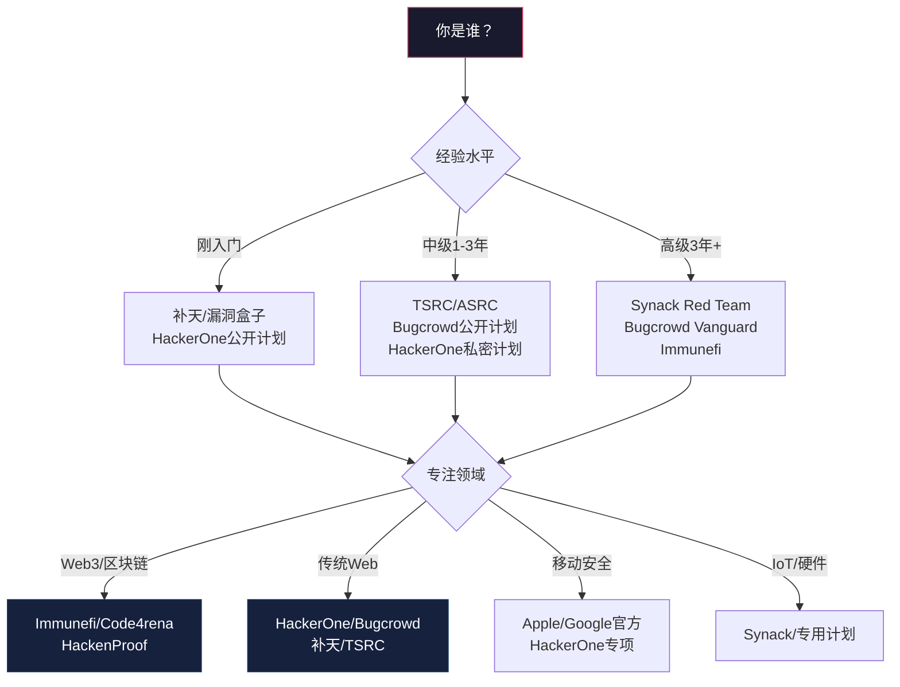
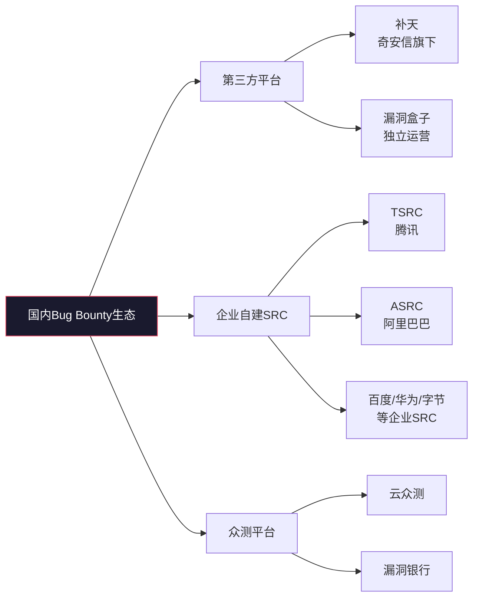
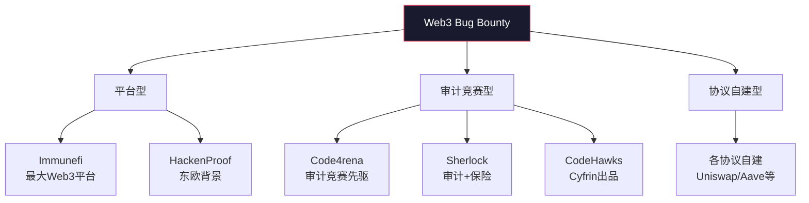
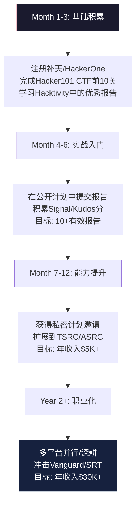

## 27.6 主流平台深度对比分析

选择正确的Bug Bounty平台，往往比掌握更高深的漏洞挖掘技术更能影响你的变现效率。一个优秀的研究者如果错配了平台，可能在低奖金目标上浪费数月时间；而一个中等水平的研究者如果选对了平台和计划，年收入可以轻松突破六位数。本节将从多维度对全球主流平台进行系统性深度对比，帮助你做出最优决策。

### 27.6.1 HackerOne vs Bugcrowd vs Synack 全面对比

这三大平台占据了全球Bug Bounty市场约80%的份额，各有独特的定位和优势。选择哪个平台取决于你的经验水平、收入目标和职业规划。

#### 综合对比矩阵

| 维度 | HackerOne | Bugcrowd | Synack |
|------|-----------|----------|--------|
| **注册门槛** | 开放注册 | 开放注册 | 邀请制/申请审核+技术测试 |
| **活跃计划数** | 2000+ | 1000+ | 200+（均为精选高质量目标） |
| **累计支付赏金** | $300M+ | $200M+ | $100M+ |
| **平均响应时间** | 1-3天 | 2-5天 | 1-2天 |
| **支付周期** | PayPal/Wire 1-2周 | PayPal/Wire 2-4周 | 每两周固定支付（含时薪） |
| **最低提款额** | $50 | $100 | 无最低限制 |
| **信誉系统** | 信号积分（Signal） | Kudos积分 | 内部评级+持续审查 |
| **私密计划邀请机制** | Signal≥阈值自动邀请 | Kudos≥阈值+人工审核 | 全部为内部受控计划 |
| **社区资源** | Hacktivity公开报告/CTF | CrowdStream/大学项目 | Red Team社区/自研工具 |
| **法律保护** | 平台标准免责协议 | 平台标准免责协议 | 完整授权+受控测试环境 |
| **适合人群** | 全水平段（入门友好） | 中高级（精英路线） | 专业级（职业化路线） |
| **对国内研究者友好度** | 中等（英文为主） | 中等（英文为主） | 较低（需较高英语能力） |

#### 收入模型对比

不同平台的收入结构差异很大，理解这些差异对制定收入策略至关重要：

| 收入来源 | HackerOne | Bugcrowd | Synack |
|----------|-----------|----------|--------|
| **漏洞赏金** | 主要收入来源 | 主要收入来源 | 补充收入 |
| **时薪报酬** | 无 | 无（部分专项有） | 核心收入（$100-200/小时） |
| **推荐奖金** | 部分计划提供 | 部分计划提供 | 不适用 |
| **重复漏洞奖励** | 无额外奖励 | 部分计划有 | 不适用 |
| **年度奖金/奖金池** | 部分企业有 | 年度Top研究者奖金 | SRT成员年度奖金 |
| **预估年收入中位数** | $15K-40K | $20K-50K | $50K-120K |

> 💡 **关键洞察**：Synack的"时薪+赏金"混合模式是其最大的差异化优势。即使未发现漏洞，测试时间本身也有报酬。但门槛极高——需要通过严格的技术测试和背景审查，全球SRT成员仅约500人。

#### HackerOne 深度分析

**信号积分（Signal）系统的运作机制**：

HackerOne的Signal系统是其信誉体系的核心，由以下因子加权计算：

| 信号因子 | 权重 | 说明 |
|----------|------|------|
| 漏洞有效性 | 最高 | 提交的漏洞被确认为有效（非重复、非信息性） |
| 严重程度 | 高 | 高危/严重漏洞贡献更多信号分 |
| 报告质量 | 高 | 包含完整PoC、影响分析、修复建议的报告得分更高 |
| 响应互动 | 中 | 与黑客/企业的沟通质量和及时性 |
| 时效性 | 中 | 在计划开放初期发现漏洞加分 |
| 持续活跃 | 低 | 长期活跃比一次性提交更有价值 |

**Signal分的实际意义**：Signal分≥100时，你可能收到第一个私密计划邀请；Signal分≥300时，你会进入HackerOne的"推荐研究者"列表，获得更多高质量私密计划；Signal分≥500时，你将成为HackerOne社区的顶级研究者，可能收到平台主动推荐的企业合作机会。

**Hacktivity的学习价值**：HackerOne的Hacktivity功能允许查看已公开的漏洞报告全文，这是全球最大的公开漏洞报告数据库。研究Hacktivity中的高价值报告可以学习到：

- 顶级研究者的报告结构和叙事方式
- 不同漏洞类型的发现思路和攻击链
- 企业对不同类型漏洞的处理方式
- 漏洞评分和奖金之间的对应关系

**Hacker101 CTF**：HackerOne维护的免费CTF平台，包含从基础到进阶的安全挑战。完成特定挑战可以解锁私密计划邀请资格。建议新手至少完成前10关，这不仅能积累基础技能，还能作为获得私密计划邀请的入场券。

**局限性**：HackerOne的部分企业计划存在奖金偏低的问题（如信息性漏洞仅$150）；一些企业响应缓慢，报告提交后数周甚至数月无回复；Signal分的计算规则不完全透明，研究者难以精确预估自己的排名变化。

#### Bugcrowd 深度分析

**Vanguard精英项目**：

Bugcrowd Vanguard是平台最顶级的研究者计划，仅邀请全球前1%的安全研究者加入。Vanguard成员享有：

- 最高价值的专属目标（企业年费$500K+的计划）
- 专属技术支持和漏洞验证加速通道
- 平台团队的1对1辅导和职业发展建议
- 参与平台战略规划和新产品内测的资格
- 线下安全会议的差旅赞助和VIP待遇

**Kudos积分系统**：

Bugcrowd的Kudos积分综合评估研究者的表现：

| 评估维度 | 权重 | 优化建议 |
|----------|------|----------|
| 报告质量 | 35% | 包含完整复现步骤、环境信息、截图 |
| 漏洞严重性 | 25% | 优先挖掘高危及以上漏洞 |
| 响应速度 | 20% | 在计划开放后48小时内提交 |
| 协作态度 | 15% | 积极回复企业的跟进问题 |
| 时效性 | 5% | 在计划开放早期阶段提交 |

**VDP管理的生态优势**：Bugcrowd在漏洞披露计划（VDP）管理方面处于行业领先地位。全球数千家企业通过Bugcrowd管理其VDP计划，这意味着即使是没有奖金的VDP计划，Bugcrowd也能提供结构化的反馈和信誉积累。对于初学者来说，参与VDP计划是积累经验和建立信誉的安全起点。

**Priority评分系统**：Bugcrowd的Priority系统帮助企业按漏洞严重程度排列处理优先级。作为研究者，这意味着你提交的高危漏洞会被优先处理，减少了"报告石沉大海"的风险。

**局限性**：Bugcrowd的支付周期较长（2-4周），对于依赖Bug Bounty作为主要收入来源的研究者可能造成现金流压力；最低提款额$100比HackerOne的$50更高，对新手不太友好；部分企业计划的Scope定义模糊，增加了重复提交的风险。

#### Synack 深度分析

**严格的准入机制**：

Synack的申请流程包括：

1. **在线申请**：提交个人资料、安全研究经验、技术栈描述
2. **技术测试**：完成一系列安全挑战，评估漏洞挖掘能力
3. **背景审查**：验证身份、检查犯罪记录（约2-4周）
4. **面试**：与Synack安全团队进行技术面试
5. **入职培训**：通过后参加为期1-2周的在线培训
6. **试用期**：前3个月为试用期，表现不佳将被淘汰

整个流程通常需要1-2个月，通过率约为5-10%。

**混合收入模式**：Synack是唯一提供"时薪+赏金"混合收入模式的Bug Bounty平台。SRT（Synack Red Team）成员的收入结构：

- **测试时薪**：$100-200/小时（根据级别和经验）
- **漏洞赏金**：根据漏洞严重程度和影响范围
- **年度奖金**：基于全年表现的绩效奖金
- **总包预估**：资深SRT成员年收入$80K-150K

**受控测试环境**：Synack为每个计划提供标准化的测试环境，包括预定义的测试范围、法律授权文件、安全通信渠道。研究者在这些受控环境中工作，大幅降低了法律风险和合规成本。

**局限性**：极高的准入门槛限制了大多数研究者的参与；计划数量较少（200+），可选目标范围有限；全部为内部计划，没有公开计划供新人练习；测试范围严格限定，灵活性较低。

### 27.6.2 国内平台深度对比

中国市场的Bug Bounty生态与国际平台有显著差异。国内平台更侧重于企业SRC（安全应急响应中心）模式，支付方式以银行转账和支付宝为主，合规要求（如实名认证、收入申报）更为严格。

#### 综合对比矩阵

| 维度 | 补天 | 漏洞盒子 | TSRC | ASRC |
|------|------|----------|------|------|
| **运营方** | 奇安信 | 漏洞盒子科技 | 腾讯 | 阿里巴巴 |
| **定位** | 综合漏洞响应平台 | 企业级漏洞众测 | 腾讯生态安全 | 阿里生态安全 |
| **计划数量** | 500+ | 300+ | 100+ | 150+ |
| **奖金范围** | ¥100-¥50,000 | ¥100-¥30,000 | ¥500-¥100,000+ | ¥500-¥100,000+ |
| **顶级漏洞奖金** | ¥50,000 | ¥30,000 | ¥200,000+ | ¥200,000+ |
| **支付方式** | 银行转账/支付宝 | 银行转账/支付宝 | 银行转账/微信 | 银行转账/支付宝 |
| **税务处理** | 平台代扣 | 平台代扣 | 需自行申报 | 需自行申报 |
| **实名要求** | 必须 | 必须 | 必须+人脸识别 | 必须 |
| **响应速度** | 1-7天 | 1-5天 | 1-3天 | 1-3天 |
| **支付周期** | 确认后1-2周 | 确认后2-3周 | 月结 | 月结 |
| **特色功能** | 漏洞集市/SRC排名 | 团队协作/企业对接 | 安全联盟/应急响应 | 安全众测/红蓝对抗 |
| **适合人群** | 全水平段 | 中级+ | 中高级 | 中高级 |
| **海外研究者友好度** | 低（需国内银行） | 低 | 低 | 低 |

#### 补天平台深度分析

补天是国内最大的第三方漏洞响应平台，汇聚了超过500家国内互联网企业的漏洞奖励计划。其核心优势在于计划数量多、覆盖面广，从中小型互联网公司到大型企业集团都有参与。

**漏洞集市系统**：补天的"漏洞集市"是研究者发现目标的主要入口。集市按行业、技术栈、奖金范围、响应速度等维度分类，研究者可以根据自己的专长精准匹配目标。建议新手优先选择"高响应速度+高奖金"的企业计划，这类企业通常有专业的安全团队，处理效率更高。

**SRC排名系统**：补天根据企业对漏洞的响应速度、修复质量和沟通态度进行综合排名。高排名企业意味着更专业的安全团队和更可靠的奖金兑现。研究目标选择时，优先参考SRC排名可以避免将时间浪费在响应差的企业上。

**公益SRC计划**：补天为非营利组织和政府机构提供公益漏洞响应服务。虽然奖金较低（通常¥100-500），但可以积累信誉积分，部分公益计划还会提供额外的荣誉证书和社会认可。

**对新手的建议**：补天是国内新手的最佳起点。注册门槛低，计划数量多，可以快速积累实战经验。建议先从公益SRC开始，熟悉流程后转向商业计划。

#### 漏洞盒子深度分析

漏洞盒子的核心差异化在于其团队协作功能，这在国内平台中独树一帜。

**团队协作模式**：研究者可以组建2-5人的安全研究团队，针对大型目标进行协同漏洞挖掘。团队模式的优势：

- **信息共享**：团队成员共享侦察信息和攻击面分析，避免重复劳动
- **分工协作**：不同成员负责不同模块，提高整体效率
- **联合署名**：报告可以多人署名，信誉共享
- **风险分担**：复杂漏洞的法律风险由团队共同承担

**企业对接服务**：漏洞盒子提供"企业对接"服务，帮助企业建立自有漏洞响应中心。研究者可以通过平台直接与企业安全团队沟通，减少了第三方中介的信息损耗。对于高价值漏洞，这种直接沟通可以加速确认和支付流程。

**局限性**：计划数量少于补天，大型企业SRC计划较少；团队协作功能虽然强大，但对独立研究者意义有限；部分计划的Scope定义不够清晰，增加了合规风险。

#### TSRC/ASRC 深度分析

腾讯安全应急响应中心（TSRC）和阿里安全应急响应中心（ASRC）是国内两大互联网巨头的自建漏洞奖励平台。这两个平台的优势在于奖金水平高、响应速度快、技术交流机会丰富。

**奖金梯度**（以TSRC为例）：

| 漏洞等级 | 基础奖金 | 优质报告奖金 | 特殊漏洞奖金 |
|----------|----------|------------|------------|
| 严重 | ¥5,000-¥20,000 | ¥20,000-¥50,000 | ¥50,000-¥200,000 |
| 高危 | ¥2,000-¥8,000 | ¥8,000-¥20,000 | ¥20,000-¥50,000 |
| 中危 | ¥500-¥2,000 | ¥2,000-¥5,000 | ¥5,000-¥10,000 |
| 低危 | ¥100-¥500 | ¥500-¥1,000 | ¥1,000-¥2,000 |

> 💡 **关键洞察**："优质报告"和"特殊漏洞"的奖金上限远高于基础奖金。报告质量（完整的PoC、深入的影响分析、可行的修复建议）直接决定了你能拿到哪个档位的奖金。

**职业发展通道**：TSRC和ASRC的优秀研究者可以获得：

- 腾讯/阿里安全团队的工作机会或推荐信
- 参与企业内部安全项目的邀请
- 安全会议的演讲机会和行业曝光
- 与其他顶级研究者的交流和合作机会

**TSRC安全联盟**：腾讯将优秀的安全研究者纳入其安全生态体系，提供专属的技术交流渠道、内部安全工具的试用资格、以及优先参与腾讯新产品安全测试的机会。

**ASRC安全众测**：阿里巴巴的"安全众测"项目允许研究者参与阿里云、支付宝、淘宝等核心产品的深度安全测试。这类测试通常奖金更高，但对研究者的技术要求也更高。

**局限性**：企业SRC计划仅覆盖自家产品，目标范围有限；部分计划的Scope更新频繁，需要持续关注；国内税务处理较为复杂，高收入研究者需要专业税务咨询。

#### 其他值得关注的国内平台

| 平台 | 运营方 | 特色 | 适合人群 |
|------|--------|------|----------|
| **百度安全应急响应中心** | 百度 | 搜索/AI/自动驾驶安全 | AI安全研究者 |
| **华为PSIRT** | 华为 | 硬件/IoT/通信安全 | IoT安全研究者 |
| **字节跳动SRC** | 字节跳动 | 抖音/TikTok生态安全 | 移动安全研究者 |
| **小米安全中心** | 小米 | MIUI/智能家居安全 | 移动/IoT研究者 |
| **云众测** | 云众测科技 | 综合众测平台 | 中级研究者 |
| **漏洞银行** | 漏洞银行科技 | 金融行业专项 | 金融安全研究者 |

### 27.6.3 Web3与区块链专项平台

Web3安全是当前Bug Bounty领域奖金最高的赛道。由于DeFi协议管理着数十亿美元的资产，一个关键漏洞的奖金可达数百万美元。

#### Immunefi 深度分析

Immunefi是Web3安全领域最大的Bug Bounty平台，管理着超过$90B资产保护的项目。

**奖金水平对比**：

| 项目 | 资产规模 | 严重漏洞奖金上限 | 典型奖金范围 |
|------|----------|-----------------|------------|
| Optimism | $5B+ TVL | $2,000,000 | $50,000-500,000 |
| Polygon | $3B+ TVL | $2,000,000 | $30,000-300,000 |
| Compound | $2B+ TVL | $1,500,000 | $20,000-200,000 |
| Aave | $10B+ TVL | $250,000 | $10,000-100,000 |

**Immunefi的漏洞分类**：平台采用CVSS v3.1评分标准，将漏洞分为严重（Critical）、高危（High）、中危（Medium）、低危（Low）四个等级。对于智能合约漏洞，平台还额外考虑了资金影响、用户影响和协议影响三个维度。

**法律保护**：Immunefi为研究者提供行业最强的法律保护。平台的标准免责协议覆盖了所有参与项目，研究者在授权范围内进行的安全测试不会承担法律风险。

**局限性**：需要扎实的智能合约审计能力；Web3项目的技术栈（Solidity/Vyper/Move）学习曲线陡峭；部分项目的Scope定义复杂，跨链桥等基础设施的测试需要深入理解协议架构。

#### Code4rena 审计竞赛模式

Code4rena开创了"审计竞赛"模式，与传统Bug Bounty有本质区别：

| 维度 | 传统Bug Bounty | 审计竞赛 |
|------|---------------|---------|
| **时间窗口** | 长期开放 | 7天集中审计 |
| **竞争模式** | 独立提交 | 所有人同时审计，按质量排名 |
| **奖金分配** | 按漏洞独立发放 | 按排名比例分配奖金池 |
| **报告要求** | 发现即提交 | 竞赛结束后统一提交 |
| **收入可预测性** | 取决于发现数量 | 取决于排名和奖金池大小 |

Code4rena的典型奖金池为$50K-500K，前10名参与者可获得奖金分配。资深审计师在Code4rena的年收入可达$200K-500K。

#### HackenProof 深度分析

HackenProof是东欧背景的Web3安全平台，与Hacken审计公司深度合作。

**特色功能**：
- **漏洞验证加速**：HackenProof提供专业的漏洞验证团队，加速确认流程
- **技术咨询**：研究者可以就复杂漏洞的技术细节获得平台专家的指导
- **企业推荐**：优秀研究者可获得Hacken审计公司的项目推荐
- **社区活动**：定期举办线上安全研讨会和技术分享

### 27.6.4 其他新兴与垂直领域平台

#### Intigriti（欧洲领先）

Intigriti是欧洲最大的Bug Bounty平台，以高质量的欧洲企业计划著称。平台特色：

- **Hackademy教育平台**：提供从入门到进阶的免费安全研究课程，完成课程可获得私密计划邀请
- **月度CTF挑战赛**：每月举办安全CTF，优秀参与者获得独家奖金和私密计划资格
- **Bug Bounty冻结期**：部分计划在特定时期暂停接收报告，研究者需要合理安排时间
- **欧洲企业覆盖**：涵盖大量欧洲银行、电信、政府机构的安全计划

#### YesWeHack（法国平台）

YesWeHack在欧洲和非洲市场有较强影响力，特色是"BaaS"（Bug Bounty as a Service）模式。平台帮助企业快速建立自有的漏洞奖励计划，并提供完整的VDP管理服务。对于研究者来说，YesWeHack的计划通常奖金合理，响应速度较快。

#### BugBase（印度平台）

BugBase专注于南亚市场，提供大量印度金融科技公司和电商平台的安全计划。奖金水平相对较低（$50-500），但计划数量多、竞争小，适合新手积累经验。

#### Apple/Google官方赏金计划

虽然不是传统意义上的Bug Bounty平台，但Apple和Google的官方安全赏金计划不容忽视：

| 计划 | 覆盖范围 | 严重漏洞奖金上限 | 特殊要求 |
|------|----------|-----------------|---------|
| Apple Security Bounty | iOS/macOS/watchOS | $2,000,000 | 需要完整复现环境 |
| Google VRP | Android/Chrome/Cloud | $250,000+ | 需遵循 Responsible Disclosure |
| Microsoft MSRC | Windows/Office/Azure | $250,000+ | 需要详细影响分析 |

这些官方计划的奖金上限极高，但对报告质量的要求也极为严格。Apple的Security Bounty尤其以审核严格著称，从提交到确认可能需要数月时间。

### 27.6.5 平台选择的决策框架

选择平台不应仅看奖金高低，而应综合考虑以下因素构建自己的决策矩阵：

#### 多维度评估模型

| 评估维度 | 权重 | 评估标准 | HackerOne | Bugcrowd | Synack | 补天 | TSRC |
|----------|------|----------|-----------|----------|--------|------|------|
| **目标匹配度** | 30% | 与你的技术栈匹配的计划数量 | ★★★★ | ★★★ | ★★★ | ★★★★ | ★★★ |
| **奖金竞争力** | 25% | 同类漏洞的平均奖金水平 | ★★★ | ★★★ | ★★★★★ | ★★ | ★★★★ |
| **响应可靠性** | 20% | 企业响应速度和处理质量 | ★★★ | ★★★ | ★★★★★ | ★★★ | ★★★★ |
| **成长空间** | 15% | 能否获得私密计划/高价值目标 | ★★★★★ | ★★★★ | ★★★ | ★★★ | ★★★★ |
| **支付便捷性** | 10% | 支付速度和方式灵活性 | ★★★★ | ★★★ | ★★★★ | ★★★★ | ★★★★ |

#### 多平台并行策略

经验丰富的研究者通常在多个平台同时活跃，最大化收入和机会覆盖：

**推荐的多平台组合**：

| 组合方案 | 适合人群 | 平台选择 | 优势 |
|----------|---------|---------|------|
| **国际全栈** | 英语好+经验3年+ | HackerOne+Bugcrowd+Immunefi | 覆盖Web2+Web3 |
| **国内全栈** | 主要在国内 | 补天+TSRC+ASRC | 覆盖国内主流企业 |
| **混合策略** | 双语能力 | HackerOne+TSRC+Immunefi | 全球覆盖+高奖金Web3 |
| **Web3专精** | 智能合约审计 | Immunefi+Code4rena+Sherlock | Web3最高奖金 |
| **新手入门** | 经验<1年 | 补天+HackerOne公开 | 低门槛+学习资源丰富 |

**多平台管理的实操建议**：

1. **统一仪表盘**：使用浏览器书签文件夹管理所有平台，设置统一的通知提醒
2. **目标去重**：同一目标可能出现在多个平台，避免对同一漏洞重复提交
3. **信誉分配**：将80%的时间投入回报最高的平台，20%用于探索新平台
4. **支付管理**：统一使用PayPal或Wire接收国际平台奖金，国内平台使用支付宝

#### 平台专业化的深度策略

另一种策略是在单一平台深耕，成为该平台的顶级研究者：

**深耕的收益**：
- 获得更多私密计划邀请（私密计划奖金通常是公开计划的3-5倍）
- 建立平台内的声誉网络，获得其他研究者的协作机会
- 获得平台提供的专属资源（技术工具、培训课程、会议赞助）
- 参与平台的战略项目（内测新功能、计划设计咨询）

**深耕的成本**：
- 目标范围受限于单一平台的计划库
- 平台政策变化的单一风险敞口
- 可能错过其他平台的高价值机会

#### 新手路径规划

**第1-3个月：基础积累阶段**

- 注册HackerOne和补天，完成账号设置和实名认证
- 完成HackerOne Hacker101 CTF的前10关
- 每天花1小时阅读Hacktivity中的公开报告，学习顶级研究者的思维方式
- 在补天公益SRC中提交第一个报告，熟悉完整流程
- 目标：理解平台机制，提交第一份报告

**第4-6个月：实战入门阶段**

- 选择2-3个熟悉的技术栈对应的公开计划
- 每周至少提交1份高质量报告
- 积极与企业沟通，根据反馈改进报告质量
- 关注Signal/Kudos积分变化，了解信誉系统运作
- 目标：积累10+有效报告，Signal分达到50+

**第7-12个月：能力提升阶段**

- 获得HackerOne或Bugcrowd的私密计划邀请
- 扩展到TSRC或ASRC，参与国内高奖金计划
- 学习高级漏洞挖掘技术（认证绕过、IDOR、SSRF等）
- 开始建立个人品牌（安全博客、漏洞公告）
- 目标：年收入达到$5,000+

**第2年及以后：职业化阶段**

- 多平台并行或单一平台深耕（根据个人策略选择）
- 冲击Bugcrowd Vanguard或Synack SRT等精英计划
- 参与Web3安全（Immunefi/Code4rena）扩展收入来源
- 考虑将Bug Bounty作为全职或半全职职业
- 目标：年收入$30,000+

### 27.6.6 平台使用的核心技巧

#### 提高报告采纳率的通用方法

无论在哪个平台，以下技巧都能显著提高你的报告被采纳和获得高评级的概率：

1. **精准的Scope确认**：在测试前仔细阅读计划的Scope定义，确认目标域名、API端点、测试边界。不确定时，先通过平台向企业询问。

2. **完整的PoC编写**：每个漏洞必须包含可复现的Proof of Concept。使用截图、视频、curl命令或Burp Suite导出的请求，确保企业安全团队能一步复现。

3. **清晰的影响分析**：不要只说"存在XSS漏洞"，要说明：攻击者能窃取什么数据、能执行什么操作、影响多少用户、是否需要用户交互。

4. **可行的修复建议**：提供具体的代码级修复建议，而不是泛泛的"请修复此漏洞"。这能显著提高报告的专业度和企业对你的好感度。

5. **合理的严重性评估**：基于CVSS v3.1标准评估漏洞严重性，避免高估或低估。高估会导致企业反感，低估会导致奖金减少。

#### 平台特有技巧

| 平台 | 特有技巧 |
|------|----------|
| **HackerOne** | 利用Hacktivity学习；完成Hacker101获取私密邀请；关注Signal分变化趋势 |
| **Bugcrowd** | 参加CrowdStream获取额外积分；关注Vanguard资格条件；利用Priority系统优先提交高危漏洞 |
| **Synack** | 提升测试速度和覆盖率；建立与Synack团队的信任关系；持续保持高通过率 |
| **补天** | 利用SRC排名筛选优质企业；参与公益SRC积累信誉；关注新计划上线时间 |
| **TSRC/ASRC** | 重点关注核心产品安全；建立与企业SRC团队的直接联系；参与安全联盟获取独家机会 |
| **Immunefi** | 深入理解DeFi协议架构；关注跨链桥安全；学习经济攻击向量 |
| **Code4rena** | 提升审计速度；学习常见合约漏洞模式；建立排名声誉 |

#### 常见误区与纠正

| 误区 | 真相 | 纠正方法 |
|------|------|----------|
| "奖金越高的平台越好" | 奖金高通常意味着门槛高、竞争激烈 | 选择与自己能力匹配的平台，先在中等奖金平台积累经验 |
| "提交越多报告越好" | 质量远比数量重要，低质量报告会降低Signal/Kudos分 | 宁可少提交，也要确保每份报告都是高质量的 |
| "只关注一个平台就行" | 单一平台存在政策变化风险和目标局限性 | 至少在2-3个平台保持活跃，分散风险 |
| "Web3奖金高所以应该转Web3" | Web3需要完全不同的技能栈，贸然转入效率很低 | 在Web2建立稳固基础后再考虑Web3转型 |
| "私密计划比公开计划好" | 私密计划竞争可能更激烈，且有更高的质量要求 | 先在公开计划中建立声誉，自然获得私密计划邀请 |
| "国内平台奖金太低不值得做" | 国内平台的信誉积累可以转化为职业发展机会 | 将国内平台作为职业发展和信誉积累的渠道，而非纯收入来源 |

### 27.6.7 本节总结

| 如果你是... | 推荐平台组合 | 预期年收入 | 预期成长周期 |
|------------|-------------|-----------|------------|
| **安全新手（<1年经验）** | 补天+HackerOne公开 | ¥5,000-20,000 | 3-6个月 |
| **中级研究者（1-3年）** | HackerOne+TSRC+Bugcrowd | $10,000-30,000 | 6-12个月 |
| **高级研究者（3年+）** | Synack+Bugcrowd Vanguard+Immunefi | $50,000-150,000 | 持续提升 |
| **Web3方向** | Immunefi+Code4rena+Sherlock | $30,000-200,000 | 6-18个月 |
| **国内全职** | 补天+TSRC+ASRC+漏洞盒子 | ¥50,000-200,000 | 12-24个月 |

> 💡 **最终建议**：不要试图同时在所有平台都做到最好。选择2-3个与你技术栈和职业目标最匹配的平台，集中精力深耕。平台选择不是一次性决策，随着经验积累和市场变化，定期重新评估和调整你的平台策略。记住，最好的平台是让你持续产出高质量报告并获得公平回报的那个。
