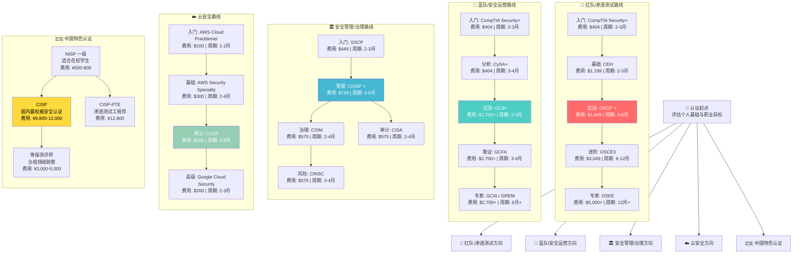
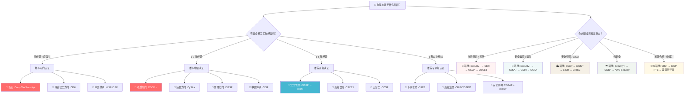

# 第28章 认证路线图

## 章节概述

在网络安全领域，专业认证是衡量从业者技能水平、建立职业信誉的核心标准。随着网络安全威胁的日益复杂化和攻击面的持续扩大，全球网络安全人才缺口已突破 350 万（(ISC)² 2024 劳动力研究报告），企业对具备专业认证的安全人才需求空前旺盛。然而，面对数量庞大、体系各异的认证选项，许多从业者——尤其是初入行者和转型期的 IT 专业人士——常常陷入"该考什么、先考什么、值不值得考"的困惑。

本章将为你提供一份全面、系统的认证路线图。这不是一份简单的认证列表，而是一套**覆盖全职业周期的认证规划方法论**：从理解认证体系的底层逻辑，到根据个人职业目标选择最优路径，再到高效备考的具体策略，最终通过真实案例验证路径的可行性。无论你是零基础的入门者，还是寻求突破的资深从业者，都能在本章找到适合自己的认证发展方案。

## 为什么需要认证

### 信号价值：降低信任成本的经济学模型

从经济学角度看，网络安全认证解决的是典型的**信息不对称**问题。当雇主招聘安全人员时，很难在短时间内准确评估候选人的真实能力。认证机构充当了**第三方信用担保**角色：

```text
求职者能力（未知）→ 认证机构评估（筛选）→ 认证证书（标签）→ 雇主信任（降低信息成本）
```

这种信任传递链条的有效性取决于三个核心要素：

| 要素 | 具体含义 | 典型案例 |
|------|---------|---------|
| **机构声誉** | 认证机构本身的历史、规模和行业认可度 | (ISC)² 成立于 1989 年，全球会员超 60 万 |
| **评估严格性** | 考试难度、监考机制、续证要求 | OSCP 考试为 24 小时实战攻防挑战 |
| **持有人表现** | 认证持有群体在行业中的整体绩效口碑 | CISSP 持有者平均年薪超 $130,000 |

### 薪资溢价：数据驱动的 ROI 分析

认证对薪资的提升效果有大量数据支撑。以下基于 (ISC)²、CyberSeek、PayScale 等权威来源的综合数据：

| 认证 | 持证者平均年薪（美国） | 未持证者平均年薪 | 薪资溢价 |
|------|----------------------|----------------|---------|
| CISSP | $131,000 - $165,000 | $98,000 | 25% - 35% |
| OSCP | $105,000 - $140,000 | $82,000 | 20% - 30% |
| CISM | $120,000 - $155,000 | $92,000 | 22% - 32% |
| CompTIA Security+ | $75,000 - $95,000 | $58,000 | 15% - 25% |
| AWS Security Specialty | $125,000 - $160,000 | $95,000 | 25% - 35% |

**中国市场数据参考**（基于猎聘、BOSS 直聘等平台统计）：

| 认证 | 持证者平均月薪（一线城市） | 适用岗位类型 |
|------|--------------------------|-------------|
| CISP | ¥20,000 - ¥35,000 | 安全管理、等保合规 |
| CISSP | ¥25,000 - ¥45,000 | 安全架构、安全管理 |
| OSCP | ¥22,000 - ¥40,000 | 渗透测试、红队攻防 |
| CISP-PTE | ¥18,000 - ¥32,000 | 渗透测试、安全评估 |

### 投资回报率（ROI）实战计算

以考取 CISSP 为例进行投资回报分析：

| 成本项目 | 金额 | 备注 |
|---------|------|------|
| 考试费用 | $749（约 ¥5,400） | (ISC)² 官方定价 |
| 培训课程 | $3,000 - $5,000（约 ¥22,000 - ¥36,000） | 官方或授权培训 |
| 学习材料 | $300 - $500（约 ¥2,200 - ¥3,600） | 教材 + 题库 + 模拟考 |
| 继续教育 | $50/年 | (ISC)² 会员年费 |
| **合计（首次）** | **$4,049 - $6,249** | **不含时间成本** |

**收益预估**（以年薪 $100,000 的安全从业者为基准）：

| 收益项目 | 金额 | 时间维度 |
|---------|------|---------|
| 薪资提升 | $15,000 - $25,000/年 | 持续 |
| 职业机会 | 更多岗位选择和晋升机会 | 持续 |
| 专业网络 | 认证社区资源与人脉 | 持续 |
| **5 年净收益** | **$70,750 - $118,750** | **扣除全部成本** |

**投资回收期约 3-5 个月**——这意味着认证是一项回报率极高的职业投资。

### 职业发展：超越薪资的多维价值

1. **求职竞争力**：据 CyberSeek 数据，美国网络安全岗位中约 60% 要求或优先考虑持有认证的候选人
2. **晋升加速**：许多企业将 CISSP、CISM 等高级认证作为晋升管理岗的必要条件
3. **行业认可**：持有高级认证更容易获得演讲邀请、咨询机会和行业奖项
4. **合规要求**：国防、金融、政府等关键行业强制要求安全人员持证上岗
5. **持续学习**：继续教育（CPE/CEU）要求推动终身学习，保持技能更新

### 认证的局限性

诚实地说，认证并非万能药。以下局限性需要清醒认识：

- **理论与实践的差距**：部分认证（如 CEH）过于注重理论，可能无法完全反映实际工作能力
- **认证不等于能力**：持有认证只是起点，实际表现才是最终的检验标准
- **知识更新滞后**：认证考试内容通常落后于最新技术和威胁 6-12 个月
- **认证通胀**：随着持有者数量增加，个别认证的区分度可能下降

**结论**：将认证作为职业发展的加速器，而非唯一目标。实际技能培养和项目经验积累与认证同等重要。

## 安全认证全景路线图

以下 mermaid 图展示了从入门到专家级的完整认证路径，按职业方向分类：



## 主流认证深度对比

### 国际认证矩阵

| 认证 | 颁发机构 | 难度等级 | 考试形式 | 费用（美元） | 前置要求 | 有效期 | 续证要求 |
|------|---------|---------|---------|-------------|---------|--------|---------|
| **CompTIA Security+** | CompTIA | ⭐⭐ | 选择题（90题/90分钟） | $404 | 无 | 3年 | 50 CEU/年 |
| **CEH** | EC-Council | ⭐⭐ | 选择题（125题/4小时） | $1,199 | 培训或工作经验 | 3年 | 40 ECE/年 |
| **SSCP** | (ISC)² | ⭐⭐ | 选择题（125题/3小时） | $449 | 1年工作经验 | 3年 | 40 CPE/年 |
| **OSCP** | Offensive Security | ⭐⭐⭐⭐ | 24小时实战攻防 | $1,649 | 无（建议经验） | 永久 | 无 |
| **CISSP** | (ISC)² | ⭐⭐⭐⭐ | 选择题+案例分析（250题/4小时） | $749 | 5年工作经验（可豁免） | 3年 | 40 CPE/年 |
| **CISM** | ISACA | ⭐⭐⭐⭐ | 选择题（150题/4小时） | $575 | 5年工作经验 | 3年 | 20 CPE/年 |
| **CISA** | ISACA | ⭐⭐⭐ | 选择题（150题/4小时） | $575 | 5年工作经验 | 3年 | 20 CPE/年 |
| **CCSP** | (ISC)² | ⭐⭐⭐⭐ | 选择题（125题/4小时） | $595 | 5年工作经验（可豁免） | 3年 | 90 CPE/3年 |
| **OSCE3** | Offensive Security | ⭐⭐⭐⭐⭐ | 3个实战挑战（48小时） | $3,049 | OSCP+OSE | 永久 | 无 |
| **OSEE** | Offensive Security | ⭐⭐⭐⭐⭐ | 2天实战考核 | $5,000+ | OSCE3 | 永久 | 无 |

### 中国认证矩阵

| 认证 | 颁发机构 | 难度等级 | 考试形式 | 费用（人民币） | 前置要求 | 有效期 | 适用场景 |
|------|---------|---------|---------|-------------|---------|--------|---------|
| **NISP 一级** | 国家信息安全水平考试中心 | ⭐ | 选择题 | ¥500-800 | 无（适合学生） | 3年 | 学生入门 |
| **NISP 二级** | 国家信息安全水平考试中心 | ⭐⭐ | 选择题+实操 | ¥1,500-2,000 | NISP一级 | 3年 | 基础岗位 |
| **CISP** | 中国信息安全测评中心 | ⭐⭐⭐ | 选择题（100题/2小时） | ¥9,800-12,000 | 1年工作经验 | 3年 | 安全管理、等保合规 |
| **CISP-PTE** | 中国信息安全测评中心 | ⭐⭐⭐⭐ | 实操考试（8小时） | ¥12,800 | 1年工作经验 | 3年 | 渗透测试 |
| **CISP-IRE** | 中国信息安全测评中心 | ⭐⭐⭐⭐ | 实操考试 | ¥12,800 | 1年工作经验 | 3年 | 应急响应 |
| **等保测评师** | 公安部 | ⭐⭐⭐ | 笔试+面试 | ¥3,000-5,000 | 相关工作经验 | 3年 | 等保测评 |

## 认证体系全景矩阵

从多个维度理解认证体系，有助于做出更明智的选择：

### 按技术领域分类

| 领域 | 核心认证 | 适合人群 | 市场需求趋势 |
|------|---------|---------|-------------|
| **渗透测试/攻击安全** | OSCP、CEH、GPEN、PNPT | 攻防爱好者、渗透测试工程师 | 稳定高需求 |
| **安全管理/治理** | CISSP、CISM、CISA、CRISC | 安全管理者、CISO、审计人员 | 持续增长 |
| **安全运营/防御** | Security+、CySA+、GCIH、GCIA | SOC分析师、安全运维 | 稳定高需求 |
| **云安全** | CCSP、AWS Security、Azure Security | 云架构师、DevSecOps | 快速增长 |
| **工控/IoT安全** | GICSP、ISA/IEC 62443 | OT安全工程师 | 新兴增长 |
| **数字取证** | EnCE、GCFA、CHFI | 取证分析师、事件调查员 | 稳定需求 |

### 按难度级别分类

| 级别 | 代表认证 | 预计备考时间 | 费用范围 | 经验要求 |
|------|---------|-------------|---------|---------|
| **入门级** | Security+、SSCP、NISP、CEH | 2-3 个月 | $300 - $1,200 | 无或极少 |
| **中级** | OSCP、CySA+、GPEN、CISP | 3-6 个月 | $400 - $2,000 | 1-3 年 |
| **高级** | CISSP、CISM、OSCE3、CCSP | 3-12 个月 | $600 - $3,000 | 3-5 年 |
| **专家级** | OSEE、GXPN、OSCE3 | 6-18 个月 | $3,000 - $5,000+ | 5-10 年 |

## 认证选择决策框架

面对众多认证，如何做出正确选择？以下是一个系统化的决策框架：



### 基于职业目标的推荐路径

| 职业方向 | 入门阶段 | 进阶阶段 | 高级阶段 | 专家阶段 |
|---------|---------|---------|---------|---------|
| **渗透测试** | Security+ → CEH | OSCP → GPEN | OSCE3 → GXPN | OSEE |
| **安全运营** | Security+ → CySA+ | GCIH → GCIA | GCFA → GREM | — |
| **安全管理** | SSCP → Security+ | CISSP → CISM | CISA → CRISC | CGEIT |
| **云安全** | Security+ → AWS CP | CCSP → AWS Security | Azure Security → GCP Security | — |
| **中国体系** | NISP 一级 | CISP | CISP-PTE | 等保测评师 |

## 本章内容架构

本章从五个维度系统性地构建网络安全认证知识体系：

### 理论基础（7 篇）

| 篇目 | 主题 | 核心内容 |
|------|------|---------|
| 28.1 | 认证体系概述 | 认证起源、本质、体系化分类、六大主流机构详解 |
| 28.2 | 认证价值分析 | 职业影响、投资回报率、局限性与误区 |
| 28.3 | 认证选择策略 | 基于职业目标、经验水平、市场需求、地区特点的四维选择法 |
| 28.4 | 认证备考理论 | 学习科学基础、时间管理、资源评估 |
| 28.5 | 国际主流认证深度解析 | CISSP、OSCP、CISM 等核心认证的深度拆解 |
| 28.6 | 中国安全认证体系 | CISP、CISP-PTE、NISP 等中国特色认证详解 |
| 28.7 | 本节小结 | 理论基础核心要点回顾 |

### 核心技巧（13 篇）

| 篇目 | 主题 | 核心内容 |
|------|------|---------|
| 28.1 | 认证备考策略 | 自我评估、学习计划制定、资源选择、学习方法优化 |
| 28.2 | 考试技巧 | 题型分析、时间分配、排除策略、心态管理 |
| 28.3 | 时间管理技巧 | 碎片化学习、深度工作、番茄工作法实战应用 |
| 28.4 | 资源获取技巧 | 官方资源、社区资源、二手资源、免费资源获取 |
| 28.5 | 各认证专项备考技巧 | CISSP、OSCP、CISM、Security+ 等逐一拆解 |
| 28.6 | 认证续证与持续发展 | CPE/CEU 管理、知识更新策略、职业持续成长 |
| 28.7 | 本节小结 | 核心备考技巧回顾 |

此外还包括：自我评估清单、学习计划模板、思维导图示例、Anki 卡片示例、每周学习安排、渗透测试方法论模板等实操工具。

### 实战案例（12 篇）

涵盖 6 个真实认证故事，覆盖不同职业阶段和方向：

| 案例 | 人物背景 | 认证路径 | 核心启示 |
|------|---------|---------|---------|
| 案例一 | 零基础转行 | Security+ → CISSP | 安全管理路线的可行路径 |
| 案例二 | 渗透测试方向 | CEH → OSCP → OSCE | 实战能力的阶梯式提升 |
| 案例三 | 云安全方向 | AWS CP → CCSP → AWS Security | 云安全的快速成长路径 |
| 案例四 | 运维转型 | Security+ → CISSP → 安全架构师 | IT 运维到安全管理的转型 |
| 案例五 | Bug Bounty 猎人 | 自学 + OSCP | 自学成才的非传统路径 |
| 案例六 | 失败与重来 | CISSP 首考失败后的调整策略 | 从挫折中学习的方法论 |

### 常见误区（1 篇）

深度剖析 8 大认证规划误区：

1. **盲目追求数量**：持有 10 个入门级认证不如 1 个高级认证
2. **忽视实际技能**：认证只是能力的证明，不是能力本身
3. **选择不适合的认证**：跟风考 CISSP 但没有管理经验
4. **备考方法不当**：死记硬背而非理解性学习
5. **忽视实战**：纸上谈兵，缺乏动手能力
6. **一次性投入过多**：同时备考多个认证导致精力分散
7. **忽略续证要求**：拿到认证后忘记 CPE 管理
8. **只看认证不看经验**：过度依赖认证而忽视项目积累

### 练习方法（1 篇）+ 深度拓展（1 篇）

提供具体的备考策略、资源推荐，以及认证体系之外的深度话题探讨。

## 学习目标

完成本章学习后，你将能够：

1. **体系认知**：理解网络安全认证的底层逻辑——为什么需要认证、认证如何运作、认证体系的全景图
2. **精准选择**：运用四维决策框架（职业目标 × 经验水平 × 市场需求 × 地区特点），为自己规划最优认证路径
3. **高效备考**：掌握间隔重复、费曼学习法、刻意练习等科学备考方法，制定可执行的学习计划
4. **实战应对**：熟悉各类认证的考试形式和题型特点，掌握应对策略和时间管理技巧
5. **长期规划**：建立从入门到专家的完整认证发展路线图，理解认证续证和持续成长的策略
6. **避免陷阱**：识别并规避常见的认证规划误区，将时间和金钱投资在最高回报的认证上

## 适合人群

| 人群类型 | 典型背景 | 建议阅读重点 |
|---------|---------|-------------|
| **安全入门者** | 零经验或 1 年以下，希望进入安全领域 | 理论基础 + 案例一/二 + 常见误区 |
| **安全从业者（初中级）** | 1-5 年经验，希望提升技能和竞争力 | 认证选择策略 + 核心技巧 + 案例三/四/五 |
| **安全管理者** | 5 年以上经验，目标 CISO/安全架构师 | 安全管理路线 + CISM/CISSP 专项 + 案例四 |
| **IT 转型者** | 开发/运维/网管，希望转行安全领域 | 认证选择策略 + 案例四/五 |
| **在校学生** | 计算机相关专业学生 | 入门认证路线 + 学习资源 + 案例一 |
| **中国从业者** | 需要 CISP 等国内认证 | 中国安全认证体系（28.6）+ 案例六 |

## 前置知识

学习本章前，建议你具备以下基础知识：

| 知识领域 | 具体要求 | 推荐补充资源 |
|---------|---------|-------------|
| **网络安全基础** | 了解 CIA 三要素、常见攻击类型（SQL注入、XSS、社工等） | 本书前 20 章 |
| **网络基础** | 理解 TCP/IP 协议栈、HTTP/HTTPS、DNS 等 | 《计算机网络》相关章节 |
| **操作系统基础** | 了解 Windows/Linux 基本操作和安全机制 | 本书系统安全章节 |
| **行业认知** | 了解安全行业的主要岗位类型和职业发展方向 | 本书职业发展相关章节 |

如果你对上述内容还不熟悉，建议先阅读本书前面的章节进行补充学习。

## 本章阅读建议

1. **先通读理论基础**：建立对认证体系的完整认知框架，避免碎片化理解
2. **再学习核心技巧**：掌握备考方法论，为后续实践做准备
3. **参考实战案例**：找到与自己背景相似的案例，获取具体的路径参考
4. **规避常见误区**：在制定计划前了解常见陷阱，少走弯路
5. **制定个人计划**：将本章的知识转化为自己的认证发展路线图

---

> ⚠️ **安全警告与免责声明**
> 
> 本章内容仅供**合法的安全测试与教育目的**使用。所有技术、工具和方法的讨论均旨在帮助安全从业者在**获得明确授权**的前提下进行防御性安全研究。
> 
> - 🚫 **未经授权**对任何系统、网络或应用进行安全测试是**违法行为**
> - ✅ 所有实践活动应在**隔离的实验环境**中进行（如虚拟机、CTF 平台）
> - ✅ 遵守所在国家和地区的**网络安全法律法规**
> - ✅ 遵循**负责任的漏洞披露**原则
> 
> 作者不对因滥用本章内容造成的任何后果承担责任。
