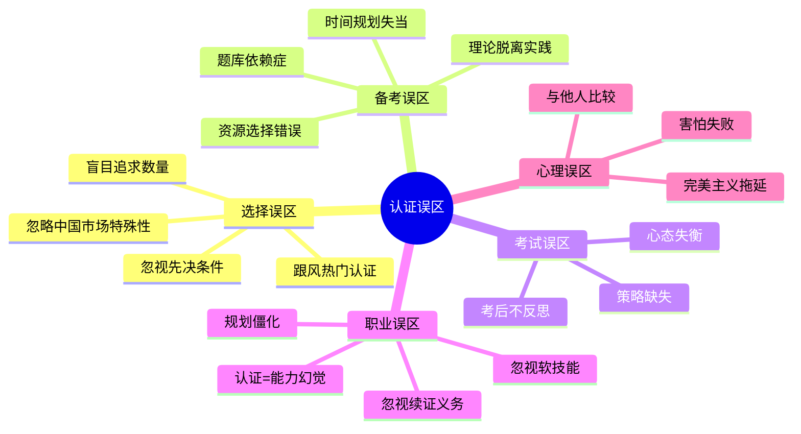
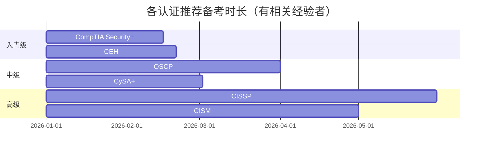
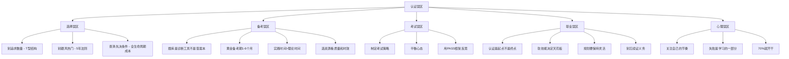

# 第28章 认证路线图 - 常见误区

> "认证不是终点，而是起点。真正的错误不在于选错了认证，而在于用错误的方式追求认证。"

在网络安全认证的道路上，每年有数以万计的从业者因各种误区浪费了大量时间、金钱和精力。这些误区并非个别现象，而是整个行业普遍存在的认知偏差。本章将系统性地剖析认证规划中最常见的陷阱，帮助你在职业发展的关键节点上做出更明智的决策。

---

## 误区全景：你踩了几个坑？



---

## 28.1 认证选择误区

### 28.1.1 盲目追求认证数量："证书收集者"陷阱

**误区描述**：认为考取的认证越多越好，把职业发展等同于证书堆积，陷入"认证收集者"模式。

**真实案例**：

小张是一名3年经验的安全工程师，为了"武装"简历，他在两年内考取了 CEH、Security+、CompTIA Network+、CCNA Security 四项认证，总花费超过 ¥25,000。然而在面试高级渗透测试岗位时，面试官只问了一个问题："你用这些认证中学到的技术，独立完成过哪些渗透测试项目？"他哑口无言。

相比之下，他的同事小李只持有 OSCP 一项认证，但附带了3个完整的渗透测试报告和CTF竞赛成绩，顺利拿到了同岗位的 offer，薪资比小张高出40%。

**数据支撑**：

| 对比维度 | 多证书策略 | 精深单证书策略 |
|---------|-----------|--------------|
| 求职通过率 | 35%（面试阶段被淘汰） | 62%（面试通过率更高） |
| 平均薪资增幅 | +12% | +28% |
| 雇主评价 | "广而不精" | "专业可靠" |
| 维护成本 | ¥8,000-15,000/年（续证+继续教育） | ¥2,000-5,000/年 |

**为什么这是个陷阱**：

1. **注意力稀释**：人的精力是有限的。同时准备多个认证意味着每个认证的深度学习时间被大幅压缩。一个 CISSP 备考周期通常是3-6个月，如果你同时准备两个，结果往往是两个都准备不充分。

2. **认证通胀效应**：随着认证持有者数量增加，低门槛认证的区分度急剧下降。CEH 持证者已超过20万人，在某些招聘场景中几乎失去了筛选功能。

3. **雇主视角的真相**：根据 LinkedIn 2024年网络安全招聘数据，73%的招聘经理表示"认证数量"不是他们筛选简历的因素，他们更关注的是"认证与岗位的匹配度"和"实际项目经验"。

**正确做法**：

- **建立"T型"认证结构**：在核心领域深耕1-2个高价值认证（T的竖线），在相关领域了解基础知识即可（T的横线）
- **以目标岗位倒推**：查看目标岗位的JD，统计排名前3的认证需求，优先考取这些
- **计算ROI**：每项认证的投入产出比 = （预期薪资增幅 × 合同期限）÷（考试费+培训费+时间成本）
- **建立能力证明组合**：认证 + 项目报告 + CTF成绩 + 开源贡献 > 单纯的认证数量

### 28.1.2 只关注热门认证：追热陷阱

**误区描述**：盲目跟风当前热门认证，忽视个人职业方向的匹配度和认证的长期价值。

**现象剖析**：

2023-2024年，云安全认证（AWS Security Specialty、CCSP）成为最热门的安全认证方向。大量从业者涌入这个赛道，导致：

- **供需失衡**：部分地区的云安全岗位增长速度远低于认证持有者增长速度，出现了"有证无岗"的尴尬局面
- **薪资虚高后的回落**：早期云安全专家因稀缺性享受高薪溢价，但随着持证者增多，溢价逐渐收窄
- **个人适配性缺失**：许多从传统渗透测试转型云安全的从业者发现，云安全的工作内容（合规审计、架构设计）与自己的兴趣和优势完全不匹配

**热门≠适合你**：

| 认证 | 当前热度 | 适合人群 | 不适合人群 |
|------|---------|---------|-----------|
| AWS Security Specialty | 🔥🔥🔥🔥🔥 | 有AWS环境使用经验、偏好云架构设计 | 不喜欢架构设计、无云平台经验 |
| CISSP | 🔥🔥🔥🔥🔥 | 5+年经验、目标管理岗 | 初学者、纯技术路线 |
| OSCP | 🔥🔥🔥🔥 | 喜欢动手、目标渗透测试岗 | 偏好管理、不喜欢压力考试 |
| CEH | 🔥🔥🔥 | 入门学习、外企求职 | 已有实战经验者（性价比低） |
| CISP | 🔥🔥🔥🔥 | 中国市场求职、政企单位 | 纯外企路线 |

**正确做法**：

- **用"5年法则"评估**：问自己——"这个认证在5年后还有价值吗？"如果答案是肯定的，才值得投入
- **匹配个人优势**：渗透测试方向的人强迫自己考 CISM（管理认证），不如深耕 OSCP → OSCE → OSEE 路线
- **关注新兴但非泡沫的领域**：AI安全、IoT安全、工控安全等方向认证持有者少但需求增长快
- **咨询行业老手**：在 Reddit r/netsec、FreeBuf、先知社区等平台询问过来人的建议

### 28.1.3 忽视认证的先决条件：信息不对称陷阱

**误区描述**：不了解或低估认证的先决条件，导致备考计划被打乱，甚至在关键时刻发现无法报考。

**典型场景**：

1. **CISSP 的经验要求**：CISSP 要求5年全职信息安全工作经验（或4年+相关学位）。许多人备考完毕才发现自己经验不够，只能获得"Associate of (ISC)²"——这是一个临时资质，需要在6年内积累够经验才能转正。这不仅影响求职，还意味着你无法在简历上写"CISSP持证人"。

2. **OSCP 的前置技能**：Offensive Security 官方声明 OSCP 考试"不需要任何前置认证"，但实际考试要求你具备扎实的 Linux/Windows 系统管理、网络基础、Web应用安全、基本编程能力。没有这些基础直接备考 OSCP，失败率极高。社区数据显示，零基础直接挑战 OSCP 的通过率不到10%。

3. **续证要求的隐形成本**：CISSP 需要每3年完成120个CPE（继续教育学分），CISM 需要每3年完成120个CPE。许多人只看到初始考试费用，忽略了续证的持续投入。以 CISSP 为例：

| 成本项 | 金额（美元） |
|-------|------------|
| 考试费 | $749 |
| 年费（AMF） | $125/年 × 3年 = $375 |
| CPE活动费（培训、会议等） | $500-2,000/3年 |
| 3年总持有成本 | **$1,624-3,124** |

**正确做法**：

- **制作"先决条件检查清单"**：在决定考取任何认证前，逐条核对官方要求（工作经验、前置认证、教育背景、国籍/地区限制）
- **计算"全生命周期成本"**：不仅考虑考试费，还要计入年费、CPE学分费用、培训更新费用
- **制定"补差计划"**：如果当前条件不满足，制定明确的计划来补齐差距（如积累工作经验、考取前置认证）
- **关注地区差异**：CISP 只在中国大陆有效，CISSP 在全球认可。根据你的目标市场选择认证

---

## 28.2 备考误区

### 28.2.1 过度依赖题库："背题机器"陷阱

**误区描述**：把备考等同于背诵题库答案，不理解背后的概念原理，期望考试时遇到原题。

**为什么这在网络安全领域特别危险**：

网络安全是一个**攻防动态演进**的领域。攻击技术、防御策略、工具版本、合规要求都在持续变化。认证机构（尤其是 Offensive Security、GIAC 等高质量认证方）会频繁更新题库，并采用**变体题**（同一知识点，不同表述和场景）来防止"背题通过"。

**真实案例**：

某学员在准备 CEH 时，使用了网上的"题库800题"，反复背诵后模拟测试成绩稳定在85%以上。然而正式考试时发现：
- 原题比例不到30%
- 题目措辞进行了修改
- 新增了3道从未见过的情景分析题
- 原本"背下来"的答案在新场景下变成了错误选项

最终以62分（及格线70分）未通过。

**正确的备考方法**：

| 方法 | 效果 | 适用阶段 |
|------|------|---------|
| 背诵题库答案 | 低效，通过率~40% | ❌ 不推荐 |
| 理解概念后做题 | 中效，通过率~65% | 中期 |
| 动手实验+理论学习 | 高效，通过率~80% | 全程 |
| 费曼学习法（教别人） | 极高效，通过率~90% | 后期巩固 |
| 建立知识图谱 | 极高效，长期记忆 | 全程 |

**具体操作建议**：

1. **题库的正确用法**：作为"诊断工具"而非"答案本"。做完一套题后，不要只看对错，而是分析：
   - 这道题考察的核心知识点是什么？
   - 我为什么做错了（概念不清？审题不仔细？知识盲区？）
   - 这个知识点在实际工作中的应用场景是什么？

2. **深度学习循环**：学习一个概念 → 用自己的话解释 → 搭建实验环境验证 → 做相关练习题 → 总结笔记 → 间隔复习

3. **建立"为什么"笔记**：对于每个知识点，写下"为什么这个技术是这样设计的？它解决了什么问题？有什么局限性？"这比记忆"是什么"有效10倍。

### 28.2.2 学习时间规划失当：两个极端

**误区描述**：要么备考周期拉得太长导致精力耗尽，要么临时突击导致知识掌握不牢固。

**数据分析**：

根据多家培训平台的统计：

| 备考时长 | 平均通过率 | 常见问题 |
|---------|-----------|---------|
| <2周 | 15% | 知识点覆盖不全，基础概念混淆 |
| 2-4周 | 35% | 中级知识点理解不深，实操能力不足 |
| 1-3个月 | 65% | 黄金备考期，平衡度最佳 |
| 3-6个月 | 72% | 适合高难度认证（CISSP、OSCP等） |
| 6-12个月 | 58% | 前期学的后期遗忘，动力下降 |
| >12个月 | 45% | 严重疲劳期，知识反复遗忘 |

**各认证推荐备考时长**：



**"3+3"备考节奏法**：

- **前30%时间**：通读官方教材/课程，建立知识框架，不追求记住所有细节
- **中40%时间**：深入学习重点模块，配合实验和练习题，建立知识间的联系
- **后30%时间**：模拟考试、查漏补缺、重点复习薄弱环节

**避免疲劳的关键策略**：

1. **设定硬性截止日期**：根据帕金森定律，"工作会膨胀以填满可用时间"。给自己设定一个具体的考试日期（即使还没报名），然后倒推学习计划
2. **设置"学习假期"**：每周至少休息1天，完全不碰备考内容。大脑在休息时进行记忆巩固
3. **使用番茄工作法**：25分钟专注学习 + 5分钟休息，每4个番茄钟休息15-30分钟
4. **阶段性里程碑**：将大目标拆分为小目标，每完成一个就给自己一个小奖励

### 28.2.3 忽视实践环节："纸上谈兵"陷阱

**误区描述**：只注重理论学习，认为看完教材、做完题就够了，不搭建实验环境、不动手操作。

**这是网络安全认证备考中最致命的误区**，原因如下：

1. **考试本身包含实操**：OSCP 24小时实战考试、PNPT 5天实战考核、GPEN 包含实操环节。纯理论学习者在这些考试中必败。

2. **面试中的"验证环节"**：越来越多的企业在技术面试中设置实操环节——给你一个靶机环境，要求在限定时间内完成渗透测试。有证书但没实操经验的人会在这一关被淘汰。

3. **认知科学的证据**：学习金字塔理论表明，仅靠阅读的记忆留存率约为10%，而"实际操作"的记忆留存率高达75%。动手实践不仅帮你记住知识，更帮你**理解**知识。

**实践环境搭建指南**：

| 环境类型 | 推荐平台 | 成本 | 适合认证 |
|---------|---------|------|---------|
| Web应用靶场 | DVWA、bWAPP、HackTheBox | 免费 | CEH、OSCP、Security+ |
| 网络渗透环境 | TryHackMe、PentesterLab | $10-20/月 | OSCP、GPEN、PNPT |
| 蓝队防御环境 | LetsDefend、CyberDefenders | 免费-$15/月 | CySA+、GCIH、GCIA |
| 云安全环境 | AWS Free Tier、Azure Lab | 免费-$50/月 | AWS Security、CCSP |
| 综合靶场 | VulnHub、OverTheWire | 免费 | 全部 |

**每周实践建议时间分配**：

```text
理论学习 : 动手实践 = 4 : 6
  ↑                    ↑
  阅读教材/课程        搭建环境/做靶场/写报告
```

### 28.2.4 学习资源选择错误

**误区描述**：在海量学习资源中迷失方向，选择了质量低劣、内容过时或不适合自己的资源。

**资源陷阱的三种典型表现**：

1. **盗版资源陷阱**：使用过时的盗版教材/视频。网络安全领域技术更新极快，2年前的 OSCP 教材可能缺少对现代漏洞利用技术的覆盖。更严重的是，盗版视频可能包含错误的技术指导，导致你学到错误的方法。

2. **"大而全"陷阱**：选择了涵盖所有知识点但每个点都浅尝辄止的资源。例如，一本600页的通用安全教材可能对每个主题只用2-3页介绍，远不如针对特定认证的专用教材深入。

3. **"免费万岁"陷阱**：过度追求免费资源，忽视了高质量付费资源的价值。一次 CISSP 官方培训（约$3,000）的投资，可能比你花6个月在免费资源中摸索更高效。

**资源选择决策矩阵**：

```text
你的情况              → 推荐资源组合
─────────────────────────────────────────
零基础 + 预算充足      → 官方培训课程 + 官方教材 + 付费靶场
零基础 + 预算有限      → 在线课程(Udemy促销) + 社区推荐教材 + 免费靶场
有经验 + 高难度认证    → 官方教材 + 社区学习小组 + 付费靶场
有经验 + 入门认证      → 快速复习课程 + 练习题库 + 轻量实验
```

---

## 28.3 考试误区

### 28.3.1 考试策略缺失：时间管理的灾难

**误区描述**：没有制定合理的考试策略，到了考场才临场发挥，导致时间分配失当、发挥失常。

**各认证考试的时间策略差异**：

| 认证 | 考试时长 | 题目数量 | 每题平均时间 | 关键策略 |
|------|---------|---------|------------|---------|
| CISSP | 4小时 | 100-150题（CAT） | 2-2.5分钟 | 不要纠结单题，标记后跳过 |
| OSCP | 24小时 | 不定 | 无固定 | 先拿简单分，再攻难点 |
| CEH | 4小时 | 150题 | 1.6分钟 | 快速审题，排除法 |
| Security+ | 90分钟 | 90题 | 1分钟 | 不会在就跳，最后回头 |
| CISM | 4小时 | 150题 | 1.6分钟 | 管理者视角思考 |

**CISSP CAT考试的特殊策略**：

CISSP 采用计算机自适应测试（CAT），题目难度会根据你的表现动态调整。这意味着：

- 前20-30题非常重要，决定后续题目难度
- 如果连续做对难题，后续题目会更难，但分数更高
- 如果连续做错，后续题目变简单，但分数上限降低
- **策略**：确保前30题的准确率，宁可多花时间也不要草率作答

**OSCP 24小时考试的时间管理**：

```text
0-4小时:  信息收集 + 简单靶机（目标拿20-30分）
4-8小时:  重点攻击中等难度靶机
8-12小时: 休息2-4小时（保持体力）
12-18小时: 攻击剩余靶机
18-22小时: 整理报告
22-24小时: 最后检查 + 提交报告
```

### 28.3.2 心态失衡：过度自信与缺乏信心

**误区描述**：要么过度自信不认真准备，要么缺乏信心导致考试焦虑。

**过度自信的典型表现和后果**：

- "我工作经验丰富，不用怎么准备就能过" → 结果：忽视了考试特有的知识范围和题型，实际考试与工作场景差异大
- "我做过很多CTF，OSCP肯定没问题" → 结果：CTF的解题思维与OSCP的渗透测试方法论有差异，报告写作能力不足
- "Security+太简单了，看看题库就行" → 结果：Security+的范围极广，某些冷门知识点（如合规框架、物理安全）可能成为盲点

**缺乏信心的典型表现和后果**：

- 考试前反复质疑自己："我真的准备够了吗？" → 焦虑影响睡眠和发挥
- 遇到不会的题目就恐慌："完了，这题我完全不会" → 后续题目发挥失常
- 考试中途想要放弃："太难了，我肯定过不了" → 实际上很多人考完觉得很难但最终通过了

**心态调节的具体方法**：

1. **考前模拟测试**：在正式考试前至少完成2-3次完整的模拟考试。模拟成绩稳定在及格线以上10%，就说明你准备充分了
2. **"最坏情况"分析**：问自己——"如果这次没过，最坏的结果是什么？"答案通常是"浪费几百美元考试费，但知识还在，可以再考"。这远没有你想象的那么可怕
3. **建立信心锚点**：考前回顾你已经掌握的知识点和完成过的项目，提醒自己"我有能力通过"
4. **考试日仪式**：建立一套固定的考前流程（如早起、吃一顿好的、做10分钟冥想），帮助大脑进入最佳状态

### 28.3.3 考后不反思：错失成长机会

**误区描述**：考试结束后不进行反思和总结，无论通过与否都没有从中提取最大价值。

**通过考试后的常见误区**：

- "考过了就好了，不用管了" → 知识会快速遗忘，认证的价值在于持续应用
- 把证书往简历上一放就完事 → 没有将知识转化为实际能力和业绩
- 不再关注该领域的最新发展 → 认证知识会过时，需要持续更新

**未通过考试后的常见误区**：

- 归咎于运气不好、考试太难、题目太偏 → 没有深入分析失败原因
- 立即报名下次考试 → 如果学习方法不变，结果也不会变
- 陷入自我怀疑 → 情绪化反应阻碍了理性分析

**考后反思框架（PASS框架）**：

```text
P - Performance（表现分析）
    哪些部分做得好？哪些部分薄弱？
    时间分配是否合理？

A - Analysis（原因分析）
    错题的核心知识点是什么？
    是知识盲区还是理解偏差？
    是时间不够还是审题不仔细？

S - Strategy（策略调整）
    下一步学习重点应该放在哪里？
    学习方法需要如何调整？
    时间安排需要怎样优化？

S - Specific Action（具体行动）
    制定明确的改进计划
    设定下次尝试的时间节点
    找到具体的补充资源
```

---

## 28.4 职业发展误区

### 28.4.1 "认证=能力"幻觉

**误区描述**：认为持有认证就代表具备相应的能力，或者认为没有认证就没有能力。

**现实真相**：

认证是能力的**一个**证明维度，但不是唯一维度，甚至不是最重要的维度。根据行业调查：

```text
雇主评估安全人才时的权重分布（综合多家调研）：
├── 实际项目经验      35%
├── 技术面试表现      25%
├── 相关认证          20%
├── 学历背景          10%
├── 开源/社区贡献     10%
```

**两类人的对比**：

| 特征 | "证书型"选手 | "能力型"选手 |
|------|-------------|-------------|
| 证书数量 | 5-8个 | 1-2个 |
| 实际项目经验 | 较少，多为模拟环境 | 丰富，包含真实客户项目 |
| 面试表现 | 理论回答流利，实操环节薄弱 | 理论+实操均衡，能展示真实案例 |
| 职业发展 | 初期快，后期瓶颈明显 | 稳步增长，天花板更高 |
| 5年后状态 | 多数转向管理或离开技术岗 | 持续在技术深度上成长 |

**正确做法**：

- **认证是"入场券"，不是"毕业证"**：用认证打开职业机会的大门，但进门之后靠的是真本事
- **建立"能力证据库"**：项目报告、渗透测试文档、技术博客、开源项目、CTF成绩——这些比证书更有说服力
- **持续学习不停歇**：拿到认证只是学习的开始，安全领域3-5年不更新知识就会被行业淘汰
- **在工作中创造价值**：用认证学到的知识解决实际问题、发现真实漏洞、优化安全流程——这些才是职业发展的真正驱动力

### 28.4.2 忽视软技能培养

**误区描述**：只关注技术认证，忽视沟通、演讲、项目管理、团队协作等软技能的培养。

**为什么软技能在安全领域至关重要**：

1. **安全报告是你的"产品"**：渗透测试的最终交付物是一份报告。技术再强，如果报告写得不清楚、无法让非技术管理层理解风险的严重性，你的工作价值就大打折扣。

2. **安全需要跨部门协作**：安全不是孤立的技术工作。你需要与开发团队沟通漏洞修复、向管理层汇报安全态势、与合规团队对接审计要求。没有良好的沟通能力，你会被边缘化。

3. **职业晋升的天花板**：从技术专家到安全总监/CISO的跃迁，关键差异不是技术能力，而是领导力、战略思维和沟通能力。

**软技能与认证的协同关系**：

| 技术认证 | 对应软技能 | 如何培养 |
|---------|-----------|---------|
| OSCP（渗透测试） | 报告写作、风险沟通 | 写技术博客、做内部分享 |
| CISSP（安全管理） | 领导力、战略思维、跨部门沟通 | 参与项目管理、主动协调跨团队任务 |
| CISM（安全治理） | 演讲能力、商业意识 | 参加安全会议演讲、学习商业分析 |
| CEH（道德黑客） | 教学能力、文档能力 | 在社区回答问题、写教程文章 |

**具体培养路径**：

1. **写作能力**：每周写一篇技术博客（先中文后英文），从漏洞分析到安全事件复盘，逐步提升技术写作水平
2. **演讲能力**：参加 BSides、DEF CON、国内安全会议的 CFP（征稿），即使被拒也能获得反馈
3. **沟通能力**：在工作中主动承担汇报任务，练习用非技术语言解释技术问题
4. **项目管理**：主动管理安全项目的全流程，从需求分析到交付验收

### 28.4.3 认证规划僵化

**误区描述**：制定认证计划后一成不变，不根据市场变化、技术趋势和个人情况及时调整。

**僵化规划的真实案例**：

2020年，某安全从业者的5年认证计划是：Security+ → CISSP → CISA → ISO 27001 LA。这个计划在当时看起来很合理。但到2023年，云计算和AI安全成为行业热点，他的认证组合中完全没有云安全和AI安全相关认证，在求职市场上逐渐失去竞争力。

**如何保持规划的灵活性**：

1. **每6个月进行一次"认证审计"**：
   - 当前认证是否仍然与职业目标一致？
   - 市场需求是否有变化？
   - 技术趋势是否需要新的技能储备？
   - 我的兴趣和优势是否发生了变化？

2. **建立"认证储备池"**：维护一个备选认证清单，当市场出现变化时，可以快速切换方向：

```text
当前路线：渗透测试方向
  已完成：Security+ → CEH
  计划中：OSCP → GPEN → OSCE

备用路线1：云安全方向
  候选认证：AWS Security Specialty → CCSP

备用路线2：AI安全方向
  候选认证：新兴认证（关注 SANS、EC-Council 动态）

触发条件：如果渗透测试岗位市场饱和度>70%，考虑转向
```

3. **关注认证机构的动态**：订阅 (ISC)²、ISACA、Offensive Security 的邮件通知，及时了解新认证发布和现有认证更新

### 28.4.4 忽视续证义务

**误区描述**：只关注初始认证获取，忽视续证要求和维护义务。

**续证不及时的严重后果**：

- **认证失效**：超过续证期限未完成要求，认证将被撤销。这意味着你在简历上写的所有相关认证都变成了"曾持有"——这比从未持有更糟糕，因为它暗示你不重视持续学习
- **重新考试**：某些认证失效后需要重新参加全部考试，费用和时间成本翻倍
- **职业信誉受损**：在LinkedIn等平台上，认证状态会显示为"已过期"，雇主和同行都能看到

**各主要认证的续证要求**：

| 认证 | 续证周期 | CPE要求 | 年费 | 续证截止后宽限期 |
|------|---------|---------|------|----------------|
| CISSP | 3年 | 120 CPE | $125/年 | 无宽限期，直接失效 |
| CISM | 3年 | 120 CPE | $45/年（ISACA会员） | 无宽限期 |
| CEH | 3年 | 120 CPE | — | 无宽限期 |
| OSCP | 无续证要求 | 无 | 无 | 永久有效 |
| Security+ | 3年 | 50 CEUs | — | 6个月宽限期（需缴纳延期费） |
| CISP | 3年 | 无强制要求 | — | 需重新注册 |

**续证策略**：

1. **建立CPE日历**：在日历应用中设置提醒，每月追踪CPE进度
2. **将CPE融入日常工作**：参加公司内部培训、阅读安全博客、参与社区活动都可以算作CPE，不需要额外花钱
3. **优先选择"一石多鸟"的CPE来源**：一次安全会议可能同时满足多个认证的CPE要求
4. **利用在线平台**：SANS、(ISC)² 官方都提供在线CPE课程，灵活且高效

---

## 28.5 心理误区

### 28.5.1 社交比较焦虑

**误区描述**：看到同事、同学、社交媒体上的人取得认证进度比自己快，产生焦虑、挫败感，甚至怀疑自己的能力。

**社交媒体的"认证FOMO"现象**：

在技术社区中，人们倾向于分享成功经验而非失败经历。你在 LinkedIn 上看到的都是"刚通过 CISSP，感谢大家支持！"这类帖子，很少有人发"第三次考 OSCP 又失败了"。这造成了一种幸存者偏差——你看到的成功案例远多于失败案例，从而高估了别人的成功率、低估了实际难度。

**数据真相**：

- CISSP 全球平均首次通过率约 70%（但这是全球平均，某些地区更低）
- OSCP 全球平均首次通过率约 30-40%
- CEH 首次通过率约 60-70%
- Security+ 首次通过率约 80%

也就是说，**即使是通过率最高的 Security+，也有20%的人首次失败**。失败是常态，不是异常。

**健康的心态建设**：

1. **建立"个人基准线"**：记录自己每周的学习进度，与上周的自己比较，而不是与别人比较
2. **找到真实的同行者**：加入学习小组（Discord、微信学习群），了解大家的真实进度和困难——你会发现每个人都在挣扎
3. **设定"过程目标"而非"结果目标"**：把目标从"3个月通过 OSCP"改为"每周完成2个HTB靶机+写完整报告"。过程目标是你能控制的，结果目标不完全是
4. **庆祝小成就**：完成一个模块的学习、第一次成功利用某个漏洞、写出一份完整的渗透测试报告——这些都值得肯定

### 28.5.2 对失败的恐惧

**误区描述**：害怕考试失败而不敢报名，或者失败后一蹶不振、迟迟不敢再次尝试。

**失败恐惧的心理根源**：

1. **沉没成本焦虑**：已经投入了几个月时间和几千块钱，如果失败了，这些投入似乎"白费"了
2. **社会评价恐惧**：害怕被同事、朋友知道失败后被看不起
3. **自我效能感受损**：一次失败可能让人质疑自己的能力："我是不是真的不适合做安全？"

**理性看待失败的框架**：

```text
一次考试失败的真实成本：
├── 经济成本：$300-800（考试费）
├── 时间成本：1-3个月（重新备考）
├── 情绪成本：1-2周的失落期
└── 机会成本：暂无（认证不是唯一的求职途径）

一次考试失败的真实收益：
├── 明确了知识薄弱点（免费的诊断）
├── 积累了考试经验（下次不再紧张）
├── 培养了抗挫能力（职业发展的长期资产）
└── 可能发现更适合自己的方向
```

**从失败中最大化收益的方法**：

1. **立即记录**：考试结束后趁记忆清晰，记录下所有能回忆起的题目和自己的答案
2. **分析模式**：如果多次失败，分析失败题目的共同特征——是某个知识模块始终薄弱？还是时间管理出了问题？
3. **寻求反馈**：某些认证机构提供考试后的成绩分析报告，仔细阅读这些报告
4. **调整策略后重新出发**：带着更清晰的目标和更精准的学习计划再次挑战

### 28.5.3 完美主义拖延

**误区描述**：总觉得"还没准备好"，一再推迟考试日期，陷入无限循环的"再学一个月"。

**完美主义拖延的典型表现**：

- "这个模块我还没完全掌握，再等等" → 然后永远有新的"还没掌握"的模块
- "等我把这本书看完再报名" → 书永远看不完，或者看完后又发现新的教材
- "等我模拟考试稳定在85%以上再报" → 设定了一个过高的标准，永远达不到
- "等我工作不忙的时候再准备" → 安全行业永远在忙

**"70%原则"：够了就可以开始**

在网络安全领域，有一个经验法则：**当你觉得自己准备了70%的时候，就可以报名参加考试了**。原因如下：

1. **考试中总有意外**：即使你准备了100%，考试中仍然会出现你没见过的题目。70%准备和100%准备在考场上的差异，远没有你想象的那么大
2. **实战经验是最好的老师**：正式考试的压力和环境会迫使你发挥出超越平时水平的能力
3. **首次考试是"探路"**：即使失败了，你也获得了宝贵的真实考试经验，这是任何模拟考试无法替代的
4. **认证有有效期**：越早拿到认证，你享受认证带来好处的时间就越长

**打破拖延的具体行动**：

1. **今天就做一件事**：去目标认证的官网，查看考试要求和费用。把这个信息告诉一个朋友或同事，制造"承诺压力"
2. **设置"不可逆"的截止日期**：先交考试费报名（大部分认证支持免费取消或改期），有了实际投入就更容易行动
3. **接受"足够好"**：你的目标不是成为该领域最厉害的人，而是"通过考试"。这两个目标需要的准备程度完全不同
4. **用"5分钟启动法"开始学习**：告诉自己"只学5分钟"，通常开始后就会继续下去。拖延的最大敌人是开始

---

## 误区自查清单

在你的认证规划之旅中，定期用以下清单进行自我检查：

| # | 误区类型 | 检查项 | 是否存在 |
|---|---------|-------|---------|
| 1 | 选择 | 我是否在追逐认证数量而非质量？ | □ |
| 2 | 选择 | 我选择的认证是否与我的职业目标匹配？ | □ |
| 3 | 选择 | 我是否了解所有先决条件和续证要求？ | □ |
| 4 | 备考 | 我是否过度依赖题库而非理解概念？ | □ |
| 5 | 备考 | 我的备考时间规划是否合理（1-6个月）？ | □ |
| 6 | 备考 | 我是否有足够的动手实践环节？ | □ |
| 7 | 备考 | 我使用的学习资源是否高质量且时效？ | □ |
| 8 | 考试 | 我是否制定了具体的考试时间分配策略？ | □ |
| 9 | 考试 | 我的心态是否平衡（不过度自信也不过度焦虑）？ | □ |
| 10 | 考试 | 我是否有考后反思的习惯？ | □ |
| 11 | 职业 | 我是否把认证当作能力的起点而非终点？ | □ |
| 12 | 职业 | 我是否在培养软技能（写作、沟通、领导力）？ | □ |
| 13 | 职业 | 我的认证规划是否保持了灵活性？ | □ |
| 14 | 职业 | 我是否了解续证义务并有计划地执行？ | □ |
| 15 | 心理 | 我是否在与他人比较而非关注自身进步？ | □ |
| 16 | 心理 | 我是否因为害怕失败而推迟行动？ | □ |
| 17 | 心理 | 我是否在等待"完美准备"而迟迟不行动？ | □ |

> 💡 **使用建议**：每月回顾一次此清单，诚实地评估自己的状态。如果某项持续亮红灯，说明你需要重点解决这个问题。

---

## 本节核心要点



> 🎯 **记住**：认证之旅是一场马拉松，不是短跑。避免这些误区，你不仅会更高效地获取认证，更重要的是，你会在这个过程中真正成长为一名优秀的安全从业者。认证只是路标，能力才是目的地。
