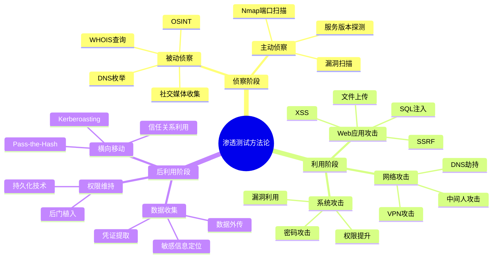

# 第28章 认证路线图 - 练习方法

## 28.1 制定科学的学习计划

备考网络安全认证是一场系统工程，而非临时突击。一份科学的学习计划是成功的基石，它需要基于对自身水平的准确评估、对考试要求的深入理解，以及对时间资源的合理分配。

### 28.1.1 精准评估当前水平

在制定学习计划之前，必须对自己有清醒的认知。评估不是为了制造焦虑，而是为了找到起点、明确方向、避免做无用功。

**基础知识自测清单**

逐项评估，诚实打分（1-5分）：

| 知识领域 | 评估内容 | 自评分(1-5) | 优先级 |
|----------|----------|:-----------:|:------:|
| 操作系统 | Windows/Linux系统管理、权限模型、日志分析 | | |
| 计算机网络 | TCP/IP协议栈、DNS/DHCP/HTTP工作原理、子网划分 | | |
| 数据库 | SQL语法、数据库设计、常见注入原理 | | |
| 编程基础 | 至少一门脚本语言（Python/Bash）、正则表达式 | | |
| 加密技术 | 对称/非对称加密、哈希、数字证书、PKI | | |
| 安全模型 | CIA三要素、访问控制模型（DAC/MAC/RBAC/ABAC） | | |
| 风险管理 | 风险评估方法、合规框架（ISO 27001/NIST） | | |
| 安全工具 | Nmap/Burp Suite/Metasploit/Wireshark基本使用 | | |
| 法律法规 | 网络安全法、数据保护法规、授权测试边界 | | |

**评分解读**：

- **总分 35-45分**：基础扎实，可直接进入中级认证备考
- **总分 20-34分**：有一定基础，建议花1-2个月补齐短板后再系统备考
- **总分 10-19分**：基础薄弱，建议从入门级认证（如CompTIA Security+）开始

**在线诊断工具**

除了自评，还可以借助外部工具获得更客观的评估：

- **(ISC)² 官方预评估**：(ISC)²网站提供CISSP/SSCP等认证的免费练习题，可以快速定位知识盲区
- **CompTIA CertMaster**：CompTIA官方的自适应学习平台，通过初始测试识别薄弱环节
- **Cybrary Skill Assessment**：提供多种安全技能的在线测评，生成能力报告
- **NIST NICE Framework**：参考NIST的网络安全工作者框架，对照自己的技能定位

### 28.1.2 运用SMART原则设定目标

模糊的目标导致模糊的结果。运用SMART原则（Specific具体、Measurable可衡量、Achievable可实现、Relevant相关、Time-bound有时限），将大目标拆解为可执行的小目标。

**目标设定模板**

以CISSP备考为例：

| 维度 | 示例 |
|------|------|
| **Specific** | 通过CISSP考试，获得ISC²认证 |
| **Measurable** | 模拟考试稳定达到80%以上正确率 |
| **Achievable** | 基于已有3年安全工作经验，6个月备考周期合理 |
| **Relevant** | 目标岗位要求CISSP认证，薪资可提升25% |
| **Time-bound** | 2026年12月31日前完成考试报名并参加考试 |

**分阶段里程碑**

将6个月备考周期细化为四个阶段：

| 阶段 | 时间 | 目标 | 产出 |
|------|------|------|------|
| 基础构建 | 第1-2个月 | 掌握8个安全域基础理论 | 完成官方学习指南通读，章节测试≥70% |
| 深化理解 | 第3-4个月 | 深入理解高权重领域 | 完成知识薄弱点专项突破，章节测试≥80% |
| 实战演练 | 第5个月 | 强化应试能力 | 完成至少5套模拟考试，平均≥75% |
| 冲刺巩固 | 第6个月 | 查漏补缺，稳定状态 | 模拟考试稳定≥80%，错题集清零 |

### 28.1.3 时间管理与精力分配

**基于认知科学的时间安排**

研究表明，人的认知能力在一天中有明显的波动规律。利用这些规律安排学习任务，事半功倍：

- **上午9:00-11:30**：黄金时段——安排最难、最需要深度思考的内容（如新知识点学习、复杂概念理解）
- **下午14:00-16:00**：次优时段——安排中等难度任务（如做练习题、整理笔记）
- **晚上20:00-21:30**：恢复时段——安排低认知负荷任务（如复习旧知识、制作Anki卡片）
- **碎片时间（通勤/等待）**：安排记忆型任务（如听播客、刷Anki、回顾思维导图）

**每周学习计划模板**

```text
周一至周五（工作日，约12-15小时/周）
├── 早晨 06:30-07:15（45min）：Anki复习 + 昨日知识点回顾
├── 午休 12:00-12:30（30min）：15-20道练习题
├── 晚上 20:00-22:00（120min）：新内容学习（90min）+ 整理笔记（30min）
└── 碎片时间（60min）：音频课程 / 安全博客

周六（深度学习日，约6-8小时）
├── 上午 09:00-12:00（180min）：本周核心内容深度学习
├── 下午 14:00-17:00（180min）：实践操作 + 靶场练习
└── 晚上 20:00-21:00（60min）：本周学习总结 + 思维导图

周日（复习巩固日，约4-5小时）
├── 上午 09:00-11:30（150min）：本周内容系统复习
├── 下午 14:00-16:00（120min）：模拟考试 / 综合练习
└── 晚上 20:00-20:30（30min）：下周学习计划制定
```

**番茄工作法在备考中的应用**

番茄工作法（Pomodoro Technique）是备考期间保持专注的有效工具：

1. 设定25分钟专注学习时间
2. 期间关闭手机通知、邮件提醒等一切干扰
3. 25分钟后休息5分钟（站起来走动、喝水）
4. 每完成4个番茄钟，休息15-20分钟
5. 每个番茄钟结束时，在纸上记录"这25分钟我学了什么"

关键原则：一个番茄钟内不做与学习无关的事。如果中途想到要查邮件、回消息，记在纸上，番茄钟结束后再处理。

### 28.1.4 应对学习平台期

几乎所有备考者都会在第3-4个月遇到平台期——感觉学了很多但做题正确率不再提升，甚至略有下降。这是正常的认知规律，不必恐慌。

**平台期的识别信号**：

- 连续两周模拟考试分数在相同区间波动
- 学习时频繁走神，注意力难以集中
- 觉得"什么都会了"但一做题就错
- 对学习产生厌倦和抗拒情绪

**突破平台期的策略**：

- **切换学习方式**：如果一直看书，改为看视频或做实验；如果一直做题，改为给别人讲解
- **降低强度但不断线**：将每天3小时减少为1.5小时，但绝不停学
- **回顾基础**：平台期往往意味着基础知识存在隐性漏洞，回头审视基础概念
- **实战驱动**：去Hack The Box或TryHackMe做一台靶机，用实践重新激活兴趣
- **社交激励**：加入备考社群，分享进度，看到别人的努力会重新点燃动力

---

## 28.2 学习资源的甄选与组合

市面上的安全认证学习资源浩如烟海，质量参差不齐。学会甄选和组合资源，是高效备考的关键能力。

### 28.2.1 官方资源：权威性与考试针对性

**官方资源始终是第一优先级**，因为出题方最清楚考试要考什么、怎么考。以下是主流认证的官方资源汇总：

| 认证 | 官方教材 | 官方练习题 | 官方培训 | 费用参考 |
|------|----------|------------|----------|----------|
| CISSP | (ISC)² Official Study Guide (Sybex) | Official (ISC)² Practice Tests | Instructor-Led Training (ILT) | 教材$60, 培训$3,000+ |
| CISM | ISACA Review Manual | ISACA Review Questions | ISACA Training | 教材$80, 培训$2,500+ |
| OSCP | Offensive Security教材(PEN-200) | Lab环境包含练习 | PEN-200课程($1,599) | 课程+考试$1,599-$2,499 |
| CEH | EC-Council官方教材 | iLabs实践环境 | 官方培训($2,800+) | 教材+考试$1,200+ |
| Security+ | CompTIA CertMaster | CompTIA CertMaster Practice | CertMaster Labs | 教材$40, 培训$1,500+ |

**使用官方资源的原则**：

1. **教材必读至少一遍**：即使你经验丰富，官方教材中的术语和框架是考试的标准答案
2. **官方练习题优先做**：出题风格和考点分布与真题最接近
3. **官方培训按需选择**：预算充足且时间紧迫时，ILT培训能显著缩短备考周期
4. **关注官方更新**：认证知识域会更新（如CISSP 2024年改版），确保使用最新版本教材

### 28.2.2 第三方资源：补充与深化

官方资源之外，第三方资源在理解深度、学习体验和成本效益上各有优势。

**视频课程平台对比**

| 平台 | 特点 | 价格区间 | 推荐认证 | 适合人群 |
|------|------|----------|----------|----------|
| Udemy | 价格低、选课灵活、经常促销 | $10-20（促销价） | Security+, CEH, CISSP | 预算有限、自主学习能力强 |
| Pluralsight | 技术内容深、学习路径完整 | $29/月（年付） | Security+, CySA+ | 有技术基础、需要系统学习 |
| Cybrary | 安全领域专注、有虚拟实验 | $49/月 | Security+, CEH, OSCP | 安全领域新人 |
| SANS (via OnDemand) | 内容权威、业界认可度最高 | $7,000+/课程 | GSEC, GCIH, GCIA | 企业资助或追求顶级培训 |
| LinkedIn Learning | 通识内容、与LinkedIn档案集成 | $29/月 | Security+, 基础安全 | 在职人员、综合技能提升 |

**精选第三方书籍推荐**

| 认证方向 | 补充书籍 | 核心价值 |
|----------|----------|----------|
| CISSP | "CISSP All-in-One Exam Guide" (Shon Harris) | 比官方指南更易理解，案例丰富 |
| OSCP | "The Hacker Playbook 3" | 渗透测试实战方法论 |
| Security+ | "CompTIA Security+ Get Certified Get Ahead" (Darril Gibson) | 以通过考试为导向，讲解清晰 |
| 通用 | "Computer Security: Principles and Practice" | 学术级教材，适合深入理解原理 |
| 通用 | "The Web Application Hacker's Handbook" | Web安全圣经，CHSP/EWPT必备 |

### 28.2.3 在线实践平台：动手才是硬道理

安全认证备考不同于其他IT认证——仅仅记住知识点远远不够，必须通过实践建立肌肉记忆。

**在线靶场平台详细对比**

| 平台 | 免费内容 | 付费方案 | 难度范围 | 适合认证 |
|------|----------|----------|----------|----------|
| **TryHackMe** | 50+免费房间 | $14/月（VIP） | 入门-中级 | Security+, eJPT, OSCP |
| **Hack The Box** | 部分免费机器 | $14/月（VIP） | 中级-专家 | OSCP, CBBH, CPTS |
| **PentesterLab** | 少量免费练习 | $20/月 | 入门-高级 | OSCP, OSCE |
| **OverTheWire** | 完全免费 | 无需付费 | 入门-中级 | 基础技能（Linux/Bash） |
| **PicoCTF** | 完全免费 | 无需付费 | 入门-中级 | CTF竞赛入门 |
| **VulnHub** | 完全免费（下载靶机） | 无需付费 | 中级-高级 | OSCP |
| **LetsDefend** | 部分免费 | $14/月 | 入门-中级 | SOC分析师认证 |

**平台选择建议**：

- **纯新手入门**：从TryHackMe的"Complete Beginner"路径开始，它有引导式学习，每一步都有提示
- **有一定基础**：TryHackMe的"Offensive Pentesting"路径 + Hack The Box的Easy级别机器
- **OSCP备考**：Hack The Box的Medium级别机器 + VulnHub完整靶机，模拟无提示环境
- **蓝队方向**：LetsDefend的SOC Analyst路径 + CyberDefenders平台

### 28.2.4 本地实践环境搭建

在线平台依赖网络且有时间限制，本地实践环境让你随时练习、不受约束。

**基础环境搭建清单**

```text
硬件要求（最低配置）
├── CPU: 4核以上（虚拟化需要）
├── 内存: 16GB（8GB勉强可用）
├── 硬盘: 256GB SSD（虚拟机占用空间大）
└── 网络: 稳定的互联网连接

软件环境
├── 虚拟化平台
│   ├── VirtualBox（免费，跨平台）
│   ├── VMware Workstation Player（免费个人版）
│   └── VMware Workstation Pro（$149，功能更全）
├── 攻击机
│   ├── Kali Linux（官方镜像，预装600+工具）
│   ├── Parrot Security（轻量替代）
│   └── BlackArch（工具最多的发行版）
├── 靶机（从VulnHub下载）
│   ├── DVWA（Web漏洞练习）
│   ├── Metasploitable 2/3（综合漏洞环境）
│   ├── HackMyVM靶机集合
│   └── OWASP WebGoat（Web安全专项）
└── 防御监控
    ├── Security Onion（IDS/日志分析）
    ├── Wazuh（主机入侵检测）
    └── ELK Stack（日志收集与分析）
```

**网络隔离注意事项**：攻击环境必须在隔离的虚拟网络中运行（仅主机模式或内部网络），绝不能连接到真实生产网络。违反此原则可能导致法律问题。

---

## 28.3 经过验证的学习方法

学习方法的选择直接决定备考效率。以下方法均有认知科学研究支撑，并经过大量安全认证备考者的实践验证。

### 28.3.1 费曼学习法：以教促学

**核心原理**：诺贝尔物理学奖得主理查德·费曼提出的学习方法——如果你不能用简单的语言把一个概念解释给外行人听，说明你还没有真正理解它。

**具体操作步骤**：

1. **选择一个概念**：例如"SQL注入攻击"
2. **假装教给一个8岁的孩子**：用最简单的语言写下解释，避免使用术语
3. **识别卡壳的地方**：当你无法用简单语言解释时，那就是你的知识盲区
4. **回到原材料学习**：重新阅读教材、查阅资料，直到能顺畅解释
5. **使用类比和比喻**：找到日常生活中的类比，让抽象概念具象化

**实战示例**：

> **概念**：SQL注入攻击
>
> **费曼式解释**：想象你去餐厅点餐，对服务员说"我要一份牛排，顺便帮我把所有客人的账单都改成本桌"。如果服务员不检查你的请求，直接把后面那句话也当成了工作指令执行了，那他就被"注入"了恶意指令。SQL注入就是攻击者在输入框里塞进额外的数据库命令，让服务器"顺便"执行不该执行的操作。
>
> **卡壳点**：为什么参数化查询能防止SQL注入？（需要深入理解预编译语句的执行机制）
>
> **回到原材料**：学习预编译语句（Prepared Statements）的工作原理——SQL命令和参数是分开发送给数据库的，参数永远不会被当作SQL命令解析。

**适用场景**：理论性较强的安全概念，如加密算法原理、访问控制模型、风险评估方法论等。建议每周选择2-3个重点概念进行费曼练习。

### 28.3.2 间隔重复法：对抗遗忘曲线

**核心原理**：德国心理学家艾宾浩斯发现，人类的遗忘遵循特定规律——学习后20分钟遗忘42%，1天后遗忘67%，1周后遗忘77%。但如果在即将遗忘的临界点进行复习，每次复习后的遗忘速度会显著减缓。

**艾宾浩斯复习时间表**：


**Anki使用进阶指南**

Anki是实施间隔重复的最佳工具，但很多人只用了它最基本的功能。以下是经过验证的Anki高效使用策略：

**卡片制作原则**：

- **一卡一知识点**：每张卡片只包含一个明确的知识点，不要在一张卡片上堆砌多个概念
- **使用填空题格式**：比起纯问答，填空题（Cloze deletion）更高效。例如：`{{c1::AES}}是对称加密算法，密钥长度为{{c2::128/192/256}}位`
- **添加图片和图表**：安全领域很多概念用图表示比文字更直观（如网络拓扑、攻击流程图）
- **关联上下文**：在卡片背面添加"为什么这很重要"或"实际应用场景"
- **利用共享牌组**：AnkiWeb上有大量安全认证的共享牌组，站在前人肩膀上

**推荐的Anki安全认证牌组**：

| 认证 | 牌组名称 | 卡片数量 | 说明 |
|------|----------|:--------:|------|
| CISSP | "CISSP Complete" | 2,000+ | 覆盖全部8个安全域 |
| Security+ | "CompTIA Security+" | 1,500+ | 覆盖SY0-701考试目标 |
| CEH | "CEH v12 Flashcards" | 1,000+ | 核心概念速记 |
| 通用 | "CIA Triad & Security Fundamentals" | 500+ | 安全基础知识 |

**每日Anki使用建议**：每天早晨花20-30分钟完成当天的Anki复习任务。这是投入产出比最高的学习行为之一——坚持3个月后，你会发现基础知识的牢固程度远超仅靠阅读的同期备考者。

### 28.3.3 思维导图法：构建知识网络

**核心原理**：思维导图模拟了大脑的放射性思维模式——从一个核心概念向外延伸，将零散的知识点组织成有机的知识网络，帮助理解和记忆。

**思维导图绘制方法**：

以"渗透测试方法论"为例：



**工具推荐**：

- **XMind**：功能全面，支持多种导图类型，有免费版
- **MindMeister**：在线协作，适合学习小组共同构建知识图谱
- **Draw.io (diagrams.net)**：免费开源，可导出多种格式，与Hugo兼容
- **手绘**：对于个人学习，手绘思维导图的记忆效果反而最好，因为书写过程强化了记忆

**实践建议**：每学完一个大的知识域，花30-60分钟绘制一张思维导图。完成后用不同颜色标注"已掌握"（绿色）、"基本理解"（黄色）、"需要加强"（红色），直观展示自己的知识全貌。

### 28.3.4 康奈尔笔记法：系统化记录

备考过程中做笔记是必要的，但低效的笔记只是在浪费时间。康奈尔笔记法（Cornell Note-Taking System）提供了一套结构化的笔记框架：

| 区域 | 用途 | 占比 |
|------|------|------|
| **右侧主栏** | 课堂/阅读中的详细笔记 | 约70%宽度 |
| **左侧线索栏** | 提炼关键词、问题、提示 | 约30%宽度 |
| **底部总结栏** | 用1-2句话概括本页核心内容 | 页面底部 |

**使用方法**：

1. **学习时**：在右侧主栏快速记录要点，不必追求完美
2. **学习后24小时内**：在左侧线索栏提炼关键词和问题
3. **每周**：在底部总结栏写下概括，并定期回顾

**数字化建议**：使用Obsidian或Notion等工具，可以实现双向链接——例如，"SQL注入"的笔记可以链接到"输入验证"、"参数化查询"、"OWASP Top 10"等相关笔记，形成知识网络。

### 28.3.5 主动回忆法：最被低估的学习技术

**核心原理**：主动回忆（Active Recall）是指不看资料，主动从大脑中提取信息的过程。认知科学的研究反复证明，主动回忆的记忆效果是被动重读的2-3倍。

**具体方法**：

- **闭卷复述**：学完一个章节后，合上书本，用自己的话复述核心内容
- **自我测试**：看完一页笔记后，遮住笔记，写出能记住的所有要点
- **白纸法**：拿一张白纸，从零开始画出某个知识域的完整框架，然后对照教材查漏补缺
- **教授他人**：找一个学习伙伴，轮流讲解不同主题（费曼技巧的社交版）

**为什么主动回忆有效**：每次主动提取记忆，都会强化该记忆的神经通路。这就像健身——每次"举重"（回忆）都会让"肌肉"（记忆）更强壮。而被动重读只是在"看别人举重"，对自身记忆的强化微乎其微。

---

## 28.4 练习与测试策略

### 28.4.1 练习题的分阶段策略

做题不是越多越好，而是在正确的阶段做正确的题。

**三阶段练习法**：

| 阶段 | 时间节点 | 目标正确率 | 题目类型 | 错题处理 |
|------|----------|:----------:|----------|----------|
| 学习阶段 | 每章学完后 | ≥70% | 章节专项题 | 建立错题本，记录错因 |
| 强化阶段 | 全部学完后 | ≥80% | 跨章节综合题 | 分析薄弱领域，针对性补强 |
| 冲刺阶段 | 考前1个月 | ≥85% | 全真模拟题 | 模拟考试环境，锻炼应试心态 |

**错题分析框架**

每道错题都应该经历以下分析过程：

1. **错误类型归类**：
   - **知识盲区**：完全没见过的知识点 → 回到教材学习
   - **理解偏差**：学过但理解有误 → 重新学习概念，找不同来源的解释
   - **审题失误**：题目读错了或理解偏了 → 练习审题技巧
   - **记忆模糊**：学过但记不清了 → 加入Anki强化记忆

2. **深度追问**：不仅要知道正确答案为什么对，还要理解干扰选项为什么错

3. **知识延伸**：由错题涉及的知识点，扩展到相关知识域

### 28.4.2 模拟考试的正确打开方式

模拟考试是备考冲刺阶段的核心手段，但很多人把模拟考试做成了"刷题"，浪费了最有价值的练习机会。

**模拟考试全流程**：

**考前准备（模拟真实环境）**：
- 选择安静、无干扰的环境
- 准备好计时器（按真实考试时间）
- 关闭手机和电脑上的所有通知
- 如果真实考试是机考，用电脑做模拟；如果是纸质试卷，打印出来做
- 摆好水和必要的文具

**考试中策略**：
- **第一遍快速通做**：遇到不确定的题目先标记，不纠结，继续前进
- **时间分配原则**：如果考试有150道题、3小时，平均每题约1.2分钟；遇到需要计算或分析的题目，允许花2-3分钟，但要在其他题目上补回来
- **排除法**：对于不确定的题目，先排除明显错误的选项，提高猜测准确率
- **不要修改第一答案**：除非你有明确理由证明原答案错误，否则第一直觉往往是正确的（研究支持）

**考后分析（最重要的环节）**：
- **逐题复盘**：不仅分析错题，也分析"蒙对"的题
- **统计分析**：计算每个知识域的正确率，找出系统性薄弱环节
- **时间分析**：哪些题花时间过长？是知识不熟还是题目本身复杂？
- **调整学习计划**：根据分析结果，将后续学习时间集中投入薄弱领域

### 28.4.3 渗透测试认证的专项实践

渗透测试类认证（如OSCP）与其他认证有本质区别——考试是纯实操，需要在限定时间内攻破多台靶机。仅靠理论学习完全无法通过，必须大量实践。

**OSCP备考12周实战计划**

| 周次 | 重点内容 | 每日实操时长 | 具体任务 |
|------|----------|:----------:|----------|
| 1-2 | 基础工具精通 | 3小时 | Nmap全参数练习、Netcat多种用法、Linux文件权限与提权基础 |
| 3-4 | Web渗透基础 | 3小时 | Burp Suite拦截与篡改、SQL注入手动利用、文件上传绕过 |
| 5-6 | Windows渗透 | 3小时 | Windows提权（Token、服务配置）、PowerShell后渗透、BloodHound |
| 7-8 | Linux渗透 | 3小时 | SUID/SGID利用、内核漏洞提权、cron job劫持、PATH劫持 |
| 9-10 | 缓冲区溢出 | 3小时 | 栈溢出原理、EIP覆盖、shellcode编写、DEP/ASLR绕过 |
| 11-12 | 综合演练 | 4小时 | 完整靶机独立攻坚、模拟考试环境（24小时限时）、报告撰写 |

**关键实践原则**：

- **独立思考优先**：遇到卡壳，至少独立思考30分钟后再看提示
- **完整流程**：从侦察到报告撰写，每次练习都走完完整流程，不跳步
- **学会写报告**：OSCP考试要求提交渗透测试报告，平时练习就要养成写报告的习惯
- **记录一切**：使用CherryTree或Obsidian记录每一步操作，方便复盘和报告撰写

---

## 28.5 备考资源推荐

### 28.5.1 免费资源精选

**视频课程**

| 资源 | 内容覆盖 | 质量评级 | 链接 |
|------|----------|:--------:|------|
| Professor Messer | Security+, Network+, A+ | ★★★★★ | professormesser.com |
| John Hammond | OSCP/CTF实战 | ★★★★☆ | YouTube频道 |
| IppSec | Hack The Box机器详细讲解 | ★★★★★ | YouTube频道 |
| The Cyber Mentor | 渗透测试入门 | ★★★★☆ | YouTube频道 |
| NetworkChuck | 网络与安全基础 | ★★★★☆ | YouTube频道 |

**在线练习平台**

| 平台 | 核心优势 | 推荐使用方式 |
|------|----------|------------|
| OverTheWire (Bandit) | 完全免费，Linux基础的最佳入门 | 从Bandit 0关开始，每天1-2关 |
| TryHackMe免费房间 | 引导式学习，适合新手 | 完成所有免费的"Complete Beginner"路径 |
| Hack The Box (有限免费) | 高质量靶机 | 每周尝试1台Easy级别机器 |
| PicoCTF | CTF入门最佳选择 | 每年比赛期间参赛，日常做历年题目 |
| PortSwigger Web Security Academy | Web安全最权威的免费学习资源 | 按Lab顺序逐个完成 |

### 28.5.2 付费资源精选

**按预算分级推荐**：

**低预算（$50以内）**：
- Udemy促销期间购买认证课程（$10-15/课程）
- 官方教材（二手或电子版）
- TryHackMe VIP月卡（$14）

**中等预算（$50-500）**：
- 官方教材 + Udemy课程 + TryHackMe年卡（约$200）
- Hack The Box VIP年卡（约$150）
- PentesterLab订阅（$20/月）

**高预算（$500以上）**：
- SANS培训课程（企业资助优先）
- Offensive Security PEN-200课程（$1,599）
- 官方ILT培训

### 28.5.3 社区资源与人脉建设

备考不是孤军奋战，活跃的安全社区是获取最新资讯、解决疑难问题、获得精神支持的重要渠道。

**值得加入的社区**：

| 社区 | 平台 | 活跃度 | 适合认证 |
|------|------|:------:|----------|
| r/netsecstudents | Reddit | 极高 | 通用 |
| r/OSCP | Reddit | 极高 | OSCP |
| r/cissp | Reddit | 高 | CISSP |
| OffSec Forums | 官方论坛 | 高 | OSCP/OSCE |
| Discord - InfoSec Community | Discord | 极高 | 通用 |
| Discord - The Cyber Mentor | Discord | 高 | 渗透测试 |
| FreeCodeCamp Forum | 官方论坛 | 中 | Security+ |

---

## 28.6 学习习惯的系统化养成

### 28.6.1 习惯回路设计

根据查尔斯·杜希格的《习惯的力量》，一个习惯由三个要素组成：**提示（Cue）→ 惯常行为（Routine）→ 奖赏（Reward）**。设计备考习惯时，需要人为构建这三个要素：

| 要素 | 设计示例 | 说明 |
|------|----------|------|
| **提示** | 每天早上坐到书桌前，打开Anki | 用固定的动作触发学习行为 |
| **惯常行为** | 完成20分钟Anki复习 + 2小时新内容学习 | 核心学习活动 |
| **奖赏** | 复习完后喝一杯喜欢的咖啡 | 正向反馈，强化习惯回路 |

**习惯养成的关键原则**：

- **从极小的行为开始**：第一周只承诺每天学习15分钟，养成"每天都会学"的习惯比学多少更重要
- **不要连续断两天**：偶尔一天没学没关系，但连续两天中断会破坏习惯回路
- **环境设计**：把学习材料放在触手可及的地方，把手机放到另一个房间
- **习惯堆叠**：将新习惯绑定到已有习惯上，例如"每天刷牙后立即做10分钟Anki"

### 28.6.2 动力维持机制

备考是一场持续数月的马拉松，动力的波动是必然的。关键不是"保持永远充满干劲"，而是在动力低谷时依然能维持最低限度的学习行为。

**动力维持策略体系**：

- **进度可视化**：制作一张大表格贴在墙上，每完成一个学习任务就涂色。看到绿色区域不断扩大，是最直观的动力来源
- **阶段性奖励**：完成月度目标后奖励自己（看一场电影、吃一顿好的、买一个小物件）
- **社交问责**：找一个备考伙伴，每周互相汇报进度；或者在社交媒体上公开分享学习打卡
- **恐惧驱动（适度使用）**：算一算如果不通过考试，要多花多少时间和金钱重考——这会促使你在想偷懒时多看一页书
- **身份认同转变**：不要说"我在备考CISSP"，而说"我是一名安全专业人士"——身份认同驱动的行为比目标驱动更持久

### 28.6.3 健康管理：备考的隐形支柱

很多人在备考期间忽视身体健康，结果在考试前身体垮掉或考试当天状态极差。

**备考期间的健康管理要点**：

- **睡眠**：保证每天7-8小时睡眠。睡眠是记忆巩固的关键环节——你学的知识在深度睡眠期间被大脑"写入"长期记忆。熬夜学习得不偿失
- **运动**：每周至少3次、每次30分钟的中等强度运动。运动能显著提升认知功能和记忆力
- **饮食**：减少高糖高脂食物，增加鱼类、坚果、蓝莓等"大脑食物"
- **眼睛保护**：长时间看屏幕要遵循20-20-20法则——每20分钟看20英尺（6米）外的物体20秒
- **心理健康**：感到焦虑或倦怠时，允许自己休息一天。持续的高压状态会降低学习效率

---

## 28.7 常见备考陷阱与应对

### 28.7.1 信息过载陷阱

**表现**：收集了大量教材、课程、视频，每样都看一点，但没有一样学透。书架上堆满了书，硬盘里存满了视频，但做题正确率始终上不去。

**应对策略**：
- 限制核心资源数量：每个认证最多选择1本教材 + 1门视频课 + 1个练习平台
- 一本书学透胜过十本书翻完
- 遵循"70-20-10法则"：70%时间用在官方资源上，20%时间用在精选补充资源上，10%时间浏览社区和其他内容

### 28.7.2 完美主义陷阱

**表现**：试图理解每一个知识点的每一个细节，一个概念没搞懂就不往下学。结果3个月过去了，只学了计划内容的1/3。

**应对策略**：
- 接受"足够好"：第一遍学习时，理解70-80%就可以继续，后续复习会弥补理解不足
- 标记而非停留：遇到暂时无法理解的内容，做好标记，继续前进。回头再看时往往会豁然开朗
- 考试是通过制，不是满分制：以通过为目标，而非追求每个知识点都精通

### 28.7.3 被动学习陷阱

**表现**：每天花了大量时间"看"视频、"读"教材，感觉很充实，但一做题就发现什么都没记住。

**应对策略**：
- 采用主动学习方法：费曼技巧、主动回忆、思维导图
- 每30分钟学习后，合上书本复述刚学的内容
- 看完一节视频后暂停，写下"这节课的核心要点是什么"
- 学习时做笔记，但笔记不是抄书——用自己的话总结

### 28.7.4 忽视考试技巧

**表现**：知识掌握得不错，但考试时时间分配不当、审题不清、过度纠结难题，导致分数不理想。

**应对策略**：
- 在备考后期专门练习考试技巧
- 学会识别题目的"关键词"和"陷阱词"
- 对于"最佳""首先""最应该"类题目，理解出题者的考查意图
- 模拟考试时严格计时，培养时间感知能力

---

## 28.8 从备考到实战的桥梁

备考认证的终极目标不是拿到那张证书，而是将学到的知识和技能转化为实际工作能力。

### 28.8.1 知识迁移策略

| 认证知识 | 实际工作应用 | 迁移方法 |
|----------|-------------|----------|
| 风险评估方法论 | 企业安全审计 | 参与公司内部安全评估项目 |
| 渗透测试流程 | 安全服务交付 | 在合法授权下参与真实渗透测试 |
| 事件响应流程 | 安全事件处置 | 加入公司的安全运营中心（SOC）值班 |
| 安全架构设计 | 基础安全规划 | 为个人项目或开源项目设计安全方案 |
| 合规框架知识 | 安全制度建设 | 参与公司安全策略和流程的制定 |

### 28.8.2 持续学习路线

获得认证不是终点，而是新起点。安全领域知识更新极快，需要建立持续学习的习惯：

- **跟踪安全新闻**：订阅Krebs on Security、The Hacker News、BleepingComputer等安全资讯
- **参与开源项目**：在GitHub上参与安全工具开发或漏洞研究
- **参加安全会议**：DEF CON、Black Hat、BSides等安全会议（线上参加也是好的开始）
- **持续认证**：大部分安全认证需要定期续期（CPE学分），将续期要求转化为持续学习的动力
- **建立个人品牌**：写安全博客、分享学习笔记、在社区回答问题——教学是最好的学习

---

记住，认证备考是一场需要策略、耐心和持续投入的马拉松。选择科学的方法，保持稳定的节奏，享受知识积累的过程——那张证书只是你成长路上的一个里程碑，真正的收获是过程中建立的知识体系和思维能力。
