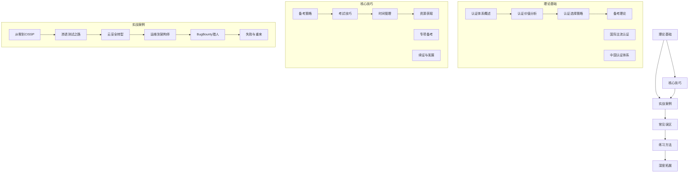
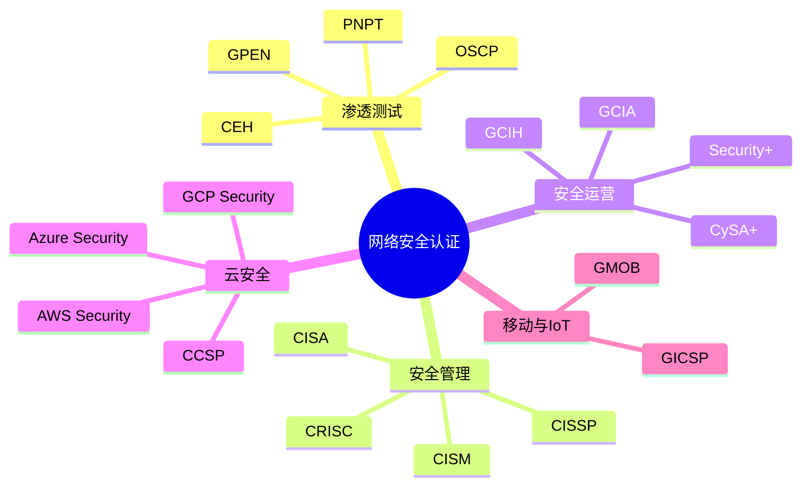
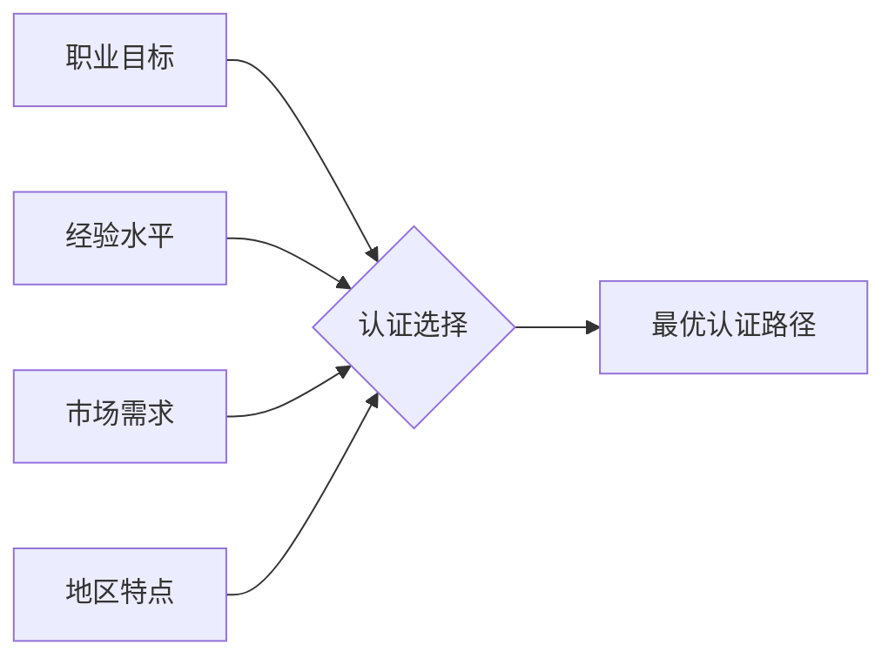
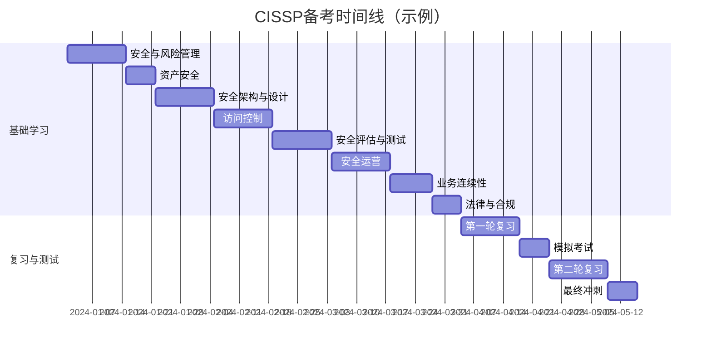
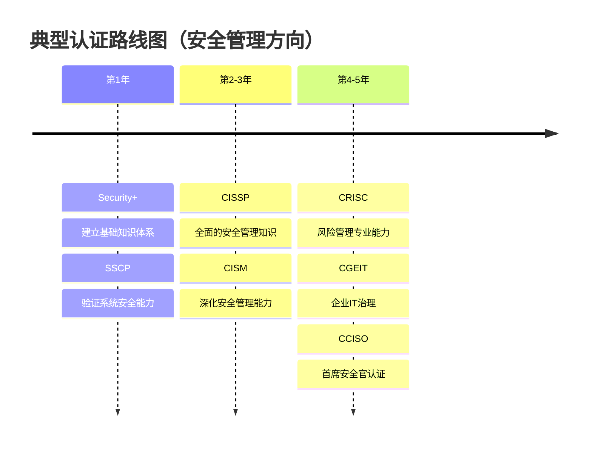

# 第28章 认证路线图 - 本章小结

## 写在前面：认证的本质是什么

本章是《网络安全攻防指南》中最具"人生规划"意味的一章。它不教你某个漏洞怎么打、某个工具怎么用，而是回答一个更根本的问题：**在网络安全这个快速迭代的领域里，你如何建立一套可持续的职业成长体系？**

认证是这套体系中最具"可量化"特征的一环。它既是知识体系的验证，也是职业路径的里程碑，更是行业信任的传递机制。但认证本身不是目的——它是手段，是工具，是你在安全之路上留下的一个个脚印。

本章从理论基础到实战案例，从备考技巧到常见误区，构建了一个完整的认证决策框架。读完本章，你应该能够回答三个核心问题：

1. **我为什么需要认证？**——不是为了"好看"，而是为了建立可验证的专业能力
2. **我需要什么认证？**——不是"最火的"，而是与职业目标最匹配的
3. **我如何高效获得认证？**——不是"刷题"，而是系统化的学习与实战

---

## 一、全章知识地图

本章共42个文件，分为五大模块。下图展示了各模块之间的逻辑关系：



### 模块间的递进关系

| 模块 | 核心问题 | 输出物 | 与其他模块的关系 |
|------|---------|--------|----------------|
| 理论基础 | "认证是什么？为什么需要？" | 认证知识框架 | 为所有后续决策提供认知基础 |
| 核心技巧 | "怎么高效备考？" | 可执行的学习方法 | 将理论转化为行动 |
| 实战案例 | "别人是怎么做的？" | 路径参考与经验教训 | 验证理论、启发技巧 |
| 常见误区 | "哪些坑要避开？" | 风险清单与纠正方案 | 反向验证，防止走弯路 |
| 练习方法 | "具体怎么练？" | 学习计划模板与资源清单 | 落地执行 |
| 深度拓展 | "还有哪些延伸？" | 进阶方向与前沿趋势 | 为高级读者提供纵深 |

---

## 二、核心要点回顾

### 2.1 理论基础：建立认证认知框架

#### 认证的本质：信任传递机制

认证的核心价值不在于那张证书，而在于它背后传递的**信任**。当你看到一位候选人持有CISSP认证时，你信任的是(ISC)²的评估标准——这个标准经过了30多年的市场验证。这种信任机制降低了雇主筛选人才的成本，也降低了从业者证明自己的成本。

从信息经济学角度看，认证是一种**信号传递（Signaling）**。在劳动力市场上，雇主和求职者之间存在信息不对称——雇主不知道求职者的真实能力，求职者也不知道雇主是否值得信任。认证就是解决这个不对称的信号工具：它向市场传递"我具备X能力"的信号，而这个信号的成本（考试费、备考时间、维护费用）确保了其可信度。

#### 认证体系的全景图

本章介绍了六大认证机构、二十余种主流认证。按技术领域可分为：



按难度级别可分为四个梯队：

| 级别 | 代表认证 | 典型备考周期 | 适用人群 | 年薪影响 |
|------|---------|------------|---------|---------|
| 入门级 | Security+, SSCP, CEH | 1-3个月 | 0-2年经验 | +5%-15% |
| 中级 | OSCP, CySA+, CCNA Security | 3-6个月 | 2-5年经验 | +15%-25% |
| 高级 | CISSP, CISM, OSCE | 6-12个月 | 5年以上经验 | +25%-40% |
| 专家级 | OSEE, GXPN, CCISO | 12个月+ | 行业顶尖 | +40%+ |

#### 中国认证体系的特殊性

本章特别介绍了中国本土的认证体系，这是国际认证无法替代的：

- **CISP**（注册信息安全专业人员）：国内最权威的安全认证，由公安部认可，在国企、央企、政府项目中几乎是硬性要求
- **CISP-PTE**（注册渗透测试工程师）：国内渗透测试领域的权威认证，采用实战考试模式，难度不亚于OSCP
- **NISP**（国家信息安全水平考试）：面向在校学生的入门级认证，是进入安全行业的"敲门砖"
- **厂商认证**：华为安全认证、深信服安全认证等在各自生态内具有很高的认可度

> 💡 **关键洞察**：在中国市场，国际认证（CISSP、OSCP）与本土认证（CISP、CISP-PTE）往往需要"组合使用"——外企和大型民企看重国际认证，国企和政府项目看重本土认证。最优策略是"国际+本土"双轨并行。

#### 认证选择策略：四维决策模型

本章提出了一个四维认证选择框架：



- **职业目标维度**：你想做什么？渗透测试→OSCP路线；安全管理→CISSP路线；云安全→CCSP路线
- **经验水平维度**：你现在在哪？0-2年→Security+；2-5年→OSCP/CySA+；5年+→CISSP/CISM
- **市场需求维度**：市场需要什么？CISSP和OSCP长期稳定，云安全认证增长最快
- **地区特点维度**：你在哪里？中国→CISP+CISSP组合；北美→CISSP+OSCP；欧洲→CISSP+CISM

---

### 2.2 核心技巧：从理论到行动

#### 备考策略的科学基础

本章将备考策略建立在认知科学的基础上，而非经验主义：

**间隔重复（Spaced Repetition）**：
- 原理：艾宾浩斯遗忘曲线表明，遗忘在学习后立即开始，24小时内遗忘约70%
- 方法：使用Anki等工具，按照1天→3天→7天→15天→30天的间隔复习
- 效果：相比集中复习，间隔重复可将长期记忆保留率提高3-5倍

**主动回忆（Active Recall）**：
- 原理：大脑在"提取"信息时比"输入"信息时形成更强的神经连接
- 方法：读完一章后合上书，尝试回忆关键概念；使用闪卡进行自我测试
- 效果：主动回忆的效果是被动阅读的2-3倍

**费曼学习法**：
- 原理：如果你不能用简单的语言解释一个概念，说明你还没有真正理解它
- 方法：选择一个概念→用大白话解释→找出漏洞→回去学习→重复
- 效果：特别适合CISSP等需要"融会贯通"的认证

**刻意练习（Deliberate Practice）**：
- 原理：安德斯·艾利克森的研究表明，专家与普通人的区别不在于天赋，而在于刻意练习的质量
- 方法：识别薄弱环节→设计针对性练习→获得即时反馈→调整策略
- 效果：在OSCP等实战认证中，刻意练习是突破瓶颈的唯一途径

#### 时间管理：在职备考的生存指南

对于大多数安全从业者来说，备考的最大挑战不是"学不会"，而是"没时间"。本章给出了具体的时间管理方案：

**番茄工作法 + 碎片时间利用**：

| 时间段 | 时长 | 活动 | 认知负荷 | 适用内容 |
|--------|------|------|---------|---------|
| 早晨6:00-7:00 | 60分钟 | 深度学习 | 高 | 新知识点、复杂概念 |
| 通勤路上 | 30分钟×2 | 音频课程/Anki | 低 | 复习、记忆卡片 |
| 午休12:00-12:30 | 30分钟 | 练习题 | 中 | 选择题、判断题 |
| 晚上20:00-22:00 | 120分钟 | 深度学习 | 高 | 核心章节、实战练习 |
| 周末上午 | 180分钟 | 综合练习 | 高 | 模拟考试、项目实战 |
| 周末下午 | 120分钟 | 复习总结 | 中 | 思维导图、知识梳理 |

**每周20小时**的投入，对于Security+这样的入门认证，6周即可完成；对于CISSP这样的高级认证，需要20-24周。

#### 考试技巧：临门一脚的关键

考试技巧往往被忽视，但它决定了你是否能在有限时间内发挥出真实水平。

**选择题策略（CISSP、CISM、Security+等）**：
1. **先易后难**：快速浏览全卷，先做有把握的题目，建立信心
2. **排除法**：即使不确定正确答案，通常能排除1-2个明显错误的选项
3. **关键词识别**：注意"最""首先""通常"等限定词，它们往往指向正确答案
4. **场景化思维**：CISSP考试特别强调"管理者视角"，选择最符合企业利益的答案

**实战考试策略（OSCP、CISP-PTE等）**：
1. **时间分配**：OSCP考试24小时，建议前12小时攻机，后12小时写报告
2. **优先级排序**：先拿下容易的机器，确保基础分，再挑战高难度目标
3. **文档记录**：每一步操作都要记录，报告占分很高，不要到最后才写
4. **心态管理**：OSCP的通过率约30%，失败是常态，关键是分析原因、调整策略

---

### 2.3 实战案例：从他人经历中汲取智慧

本章通过六个真实案例，展示了认证规划在不同背景下的具体实践：

#### 案例一：从零到CISSP的安全管理之路

**背景**：IT运维人员，3年工作经验，目标转型安全管理
**路径**：Security+ → CISSP
**关键决策**：
- 选择Security+而非CEH作为起点，因为Security+的知识体系更贴近管理岗位需求
- 利用工作中接触到的安全项目积累经验，满足CISSP的5年经验要求（可通过相关经验折算）
- 备考CISSP时采用"8大域"分块学习法，每个域2-3周，总计6个月

**结果**：通过CISSP认证后，成功转型为安全经理，薪资提升35%

**核心启示**：认证路径要与职业目标对齐，而非盲目追求"最火"的认证。

#### 案例二：渗透测试认证之路

**背景**：信息安全专业毕业生，1年工作经验
**路径**：Security+ → CEH → OSCP
**关键决策**：
- 先用Security+建立基础知识体系，再用CEH了解攻击技术全景
- OSCP备考时搭建HomeLab环境，每天练习2-3小时，持续4个月
- 第一次OSCP考试失败（只拿下1台机器），分析了失败原因（时间分配不当+报告质量不够），第二次通过

**结果**：OSCP通过后，获得渗透测试岗位offer，起薪比同届高出40%

**核心启示**：OSCP的失败率很高，但失败本身是宝贵的学习经历。关键是从失败中提取教训。

#### 案例三：云安全认证之路

**背景**：系统管理员，5年工作经验，目标转型云安全
**路径**：AWS Cloud Practitioner → CCSP → AWS Security Specialty
**关键决策**：
- 先通过AWS Cloud Practitioner建立云计算基础认知
- 利用工作中的云项目经验，将理论应用到实际场景
- CCSP和AWS Security Specialty并行备考，因为两者在云安全控制方面有大量重叠

**结果**：成为公司云安全负责人，负责设计并实施云安全架构

**核心启示**：云安全认证需要"理论+实践"双轮驱动，仅靠书本无法通过。

#### 案例四：从运维到安全架构师的转型之路

**背景**：运维工程师，8年工作经验
**路径**：CISSP → CISM → CCISO
**关键决策**：
- 利用丰富的运维经验，快速通过CISSP（运维经验覆盖了多个知识域）
- CISM备考时重点关注"安全治理"和"风险管理"，这是从技术岗到管理岗的关键跨越
- CCISO作为终极目标，需要积累管理经验和行业影响力

**结果**：晋升为安全架构师，负责制定公司整体安全战略

**核心启示**：高级认证的门槛不仅是知识，更是经验和影响力。

#### 案例五：BugBounty猎人的认证之路

**背景**：自由职业者，通过BugBounty积累安全经验
**路径**：CEH → OSCP → GWAPT → GPEN
**关键决策**：
- 选择实战性强的认证，与BugBounty工作形成正向循环
- GWAPT（Web应用渗透测试）直接提升了BugBounty的效率和收益
- 通过认证建立了个人品牌，获得更多商业渗透测试机会

**结果**：年收入从纯BugBounty的10万元提升到30万元（认证+商业项目）

**核心启示**：认证可以与现有工作形成协同效应，而非额外的负担。

#### 案例六：失败与重来的认证故事

**背景**：多次考试失败后重新规划
**关键教训**：
- 第一次备考CISSP：只刷题不学理论，失败
- 第二次备考OSCP：没有实战练习，失败
- 第三次重新规划：先Security+打基础，再OSCP练实战，最后CISSP做管理，全部通过

**核心启示**：认证规划不是一蹴而就的，失败是调整策略的信号，而非放弃的理由。

---

### 2.4 常见误区：避开认证路上的十大陷阱

本章系统梳理了认证规划中容易犯的错误，归纳为五大类：

#### 认证选择误区

| 误区 | 表现 | 后果 | 纠正方法 |
|------|------|------|---------|
| 盲目追求数量 | 考了5个认证但都不深入 | 简历花哨但能力存疑 | 聚焦2-3个核心认证，深度掌握 |
| 只追热门认证 | 看到什么火就考什么 | 认证与职业目标不匹配 | 以职业目标为锚点选择认证 |
| 忽视先决条件 | 直接报考CISSP但经验不足 | 认证无效或无法续证 | 仔细阅读官方要求，规划前置认证 |

#### 备考误区

| 误区 | 表现 | 后果 | 纠正方法 |
|------|------|------|---------|
| 过度依赖题库 | 只刷题不学教材 | 遇到变形题就懵 | 以教材为主，题库为辅 |
| 时间安排不当 | 要么太松要么太紧 | 要么遗忘要么崩溃 | 制定详细计划，定期调整 |
| 忽视实践环节 | 只学理论不动手 | 实战认证必然失败 | 搭建实验环境，每天练习 |

#### 考试误区

| 误区 | 表现 | 后果 | 纠正方法 |
|------|------|------|---------|
| 考试策略不当 | 在难题上纠结太久 | 简单题没时间做 | 先易后难，合理分配时间 |
| 过度自信或缺乏信心 | 准备不足就去考/准备充分也不敢考 | 前者必然失败，后者浪费机会 | 以模拟考试分数为参考 |
| 忽视考后反思 | 通过就庆祝，失败就沮丧 | 无法从经验中学习 | 无论成败都要复盘 |

#### 职业发展误区

| 误区 | 表现 | 后果 | 纠正方法 |
|------|------|------|---------|
| 认证等于能力 | 拿到认证就认为自己行了 | 实际能力跟不上 | 认证只是起点，持续实践才是关键 |
| 忽视软技能 | 只关注技术认证 | 管理岗位竞争力不足 | 技术认证+沟通/管理/领导力 |
| 规划缺乏灵活性 | 一条路走到黑 | 遇到变化就不知所措 | 定期评估，动态调整 |

#### 心理误区

| 误区 | 表现 | 后果 | 纠正方法 |
|------|------|------|---------|
| 与他人比较 | 看到别人考得快就焦虑 | 打乱自己的节奏 | 专注自己的路径和进度 |
| 害怕失败 | 不敢报考，一直"准备中" | 永远无法开始 | 接受失败是常态，先考再说 |
| 完美主义倾向 | 一定要100%准备充分才考 | 永远觉得"还不够" | 设定"足够好"的标准，果断行动 |

---

### 2.5 练习方法：从计划到执行

#### 学习计划制定的五步法

1. **评估当前水平**：使用自我评估清单，诚实评价每个知识域的掌握程度
2. **设定SMART目标**：具体、可衡量、可实现、相关、有时限
3. **分解学习内容**：将考试大纲分解为可管理的学习模块
4. **安排学习时间**：根据可用时间制定周计划和日计划
5. **建立反馈机制**：每周回顾进度，每月调整计划

#### 学习资源选择指南

| 资源类型 | 代表 | 优势 | 劣势 | 适用阶段 |
|---------|------|------|------|---------|
| 官方教材 | (ISC)²官方教材 | 最权威、最全面 | 价格高、更新慢 | 全程 |
| 官方培训 | SANS培训 | 质量高、含实操 | 价格极高 | 预算充足者 |
| 在线课程 | Udemy、Pluralsight | 价格低、灵活 | 质量参差不齐 | 入门-中级 |
| 社区资源 | Reddit、Discord | 免费、实时 | 需要筛选 | 辅助学习 |
| 实践环境 | HomeLab、云平台 | 最贴近实战 | 需要投入时间搭建 | 实战认证必备 |

#### 分阶段练习策略



---

## 三、关键建议：认证规划的四大支柱

### 3.1 明确认证目标：先想清楚"为什么"

在开始认证之旅前，问自己三个问题：

1. **我想在安全领域的哪个方向发展？**
   - 渗透测试？安全管理？云安全？安全运营？
   - 不同的方向对应完全不同的认证路径

2. **什么样的认证最能帮助我实现目标？**
   - 不是"最火的"，而是"最匹配的"
   - 考虑认证的长期价值和行业认可度

3. **我愿意投入多少时间和金钱？**
   - 时间：每周能投入多少小时？备考周期多长？
   - 金钱：考试费、培训费、材料费的预算是多少？

> 💡 **实用工具**：使用本章提供的"认证路线图模板"，将以上三个问题的答案具体化、可操作化。

### 3.2 制定长期规划：3-5年的认证路线图

认证规划应该是长期的、系统的。不要只考虑眼前的认证，而要制定3-5年的认证路线图：



**短期目标（1年内）**：
- 考取基础认证，建立知识体系
- 建议：Security+或CEH（二选一，不要同时考）
- 投入：每周10-15小时，备考2-3个月

**中期目标（1-3年）**：
- 考取专业认证，深化专业能力
- 建议：CISSP或OSCP（根据方向选择）
- 投入：每周15-20小时，备考6-12个月

**长期目标（3-5年）**：
- 考取高级认证，建立行业影响力
- 建议：CISM/CRISC/OSCE/CCISO（根据方向选择）
- 投入：每周10-15小时，备考12-18个月

### 3.3 理论与实践并重：认证不是终点

认证学习不应只停留在理论层面，要注重实践应用：

**搭建实验环境**：
- 使用VirtualBox/VMware搭建HomeLab
- 部署Kali Linux、Metasploitable、DVWA等靶机
- 每天至少1小时动手练习

**将知识应用到工作中**：
- 在工作中主动承担安全相关任务
- 将认证学到的框架应用到实际项目中
- 记录实践心得，形成个人知识库

**参与实际项目**：
- 参加CTF比赛，锻炼实战能力
- 参与开源安全项目，建立技术影响力
- 通过BugBounty平台验证渗透测试能力

### 3.4 持续学习与更新：认证是起点，不是终点

技术在不断进步，认证也需要持续更新：

**关注认证的续证要求**：
- CISSP：每3年续证，需要60个CPE学分
- CISM：每3年续证，需要120个CPE学分
- OSCP：每3年续证，需要完成指定的实验或考试

**定期参加继续教育**：
- 参加安全会议（DEF CON、Black Hat、RSA等）
- 订阅安全博客和期刊
- 参加在线课程和培训

**跟踪行业最新动态**：
- 关注新兴技术（AI安全、零信任、SASE等）
- 了解新的认证（如AI安全认证、隐私保护认证等）
- 保持学习的热情和好奇心

---

## 四、下一步行动：七步启动你的认证之旅

完成本章学习后，建议你按照以下步骤开始行动：

### 第一步：自我评估（第1周）

使用本章提供的自我评估清单，诚实评价自己的当前水平：

- 基础知识：计算机网络、操作系统、密码学、安全概念
- 目标认证知识领域：对照考试大纲，逐项评估
- 薄弱环节：列出需要重点学习的领域
- 可用时间：每周能投入多少小时？
- 预算：考试费、培训费、材料费的预算是多少？

### 第二步：选择认证（第2周）

根据自我评估结果，选择最适合的认证方向：

- 参考本章的"四维认证选择框架"
- 咨询行业内人士的意见
- 研究目标认证的市场需求和薪资影响
- 确定第一个目标认证

### 第三步：制定计划（第3周）

制定详细的备考计划和时间表：

- 设定SMART目标
- 分解学习内容
- 安排学习时间
- 选择学习资源

### 第四步：开始学习（第4周起）

选择合适的学习资源，开始系统学习：

- 以官方教材为主
- 结合在线课程和社区资源
- 每天坚持学习，保持节奏

### 第五步：实践应用（持续进行）

将学到的知识应用到实践中：

- 搭建实验环境
- 动手练习
- 参与CTF或BugBounty

### 第六步：参加考试（计划时间）

在准备充分后勇敢参加考试：

- 以模拟考试分数为参考
- 合理分配考试时间
- 保持冷静的心态

### 第七步：持续发展（通过认证后）

通过认证后继续学习和成长：

- 关注续证要求
- 参加继续教育
- 规划下一个认证目标

---

## 五、认证路线图模板

以下是一个可操作的认证路线图模板，复制后填入你的具体信息：

```markdown
## 我的认证路线图

### 基本信息
- 姓名：_______
- 当前职位：_______
- 工作经验：_______年
- 职业目标：_______
- 可用时间：每周_______小时
- 预算：_______元

### 自我评估
| 知识领域 | 掌握程度（1-5） | 备注 |
|---------|---------------|------|
| 计算机网络 | ___ | |
| 操作系统 | ___ | |
| 密码学 | ___ | |
| 安全概念 | ___ | |
| 编程基础 | ___ | |

### 短期目标（1年内）
- 认证1：_______
  - 选择理由：_______
  - 计划时间：_______
  - 学习资源：_______
  - 预算：_______
  - 每周投入：_______小时

### 中期目标（1-3年）
- 认证2：_______
  - 选择理由：_______
  - 计划时间：_______
- 认证3：_______
  - 选择理由：_______
  - 计划时间：_______

### 长期目标（3-5年）
- 认证4：_______
  - 选择理由：_______
- 认证5：_______
  - 选择理由：_______

### 每月检查点
| 月份 | 学习进度 | 练习情况 | 调整事项 |
|------|---------|---------|---------|
| 第1个月 | | | |
| 第2个月 | | | |
| ... | | | |

### 风险与应对
| 潜在风险 | 影响程度 | 应对策略 |
|---------|---------|---------|
| 时间不够 | | |
| 预算超支 | | |
| 考试失败 | | |
```

---

## 六、推荐资源

### 认证信息网站

| 机构 | 官网 | 代表认证 | 特点 |
|------|------|---------|------|
| (ISC)² | https://www.isc2.org | CISSP, CCSP, SSCP | 全球最大安全认证机构 |
| ISACA | https://www.isaca.org | CISM, CISA, CRISC | 审计和治理领域权威 |
| EC-Council | https://www.eccouncil.org | CEH, CHFI, CCISO | 道德黑客认证 |
| Offensive Security | https://www.offensive-security.com | OSCP, OSEP, OSED | 实战考核最严格 |
| CompTIA | https://www.comptia.org | Security+, CySA+, CASP+ | 入门级标准 |
| GIAC | https://www.giac.org | GPEN, GCIH, GWAPT | SANS旗下，质量极高 |
| 中国信息安全测评中心 | https://www.itsec.gov.cn | CISP, CISP-PTE | 国内最权威 |

### 学习社区

| 平台 | 名称 | 特点 |
|------|------|------|
| Reddit | r/cissp, r/oscp, r/CompTIA | 全球最大认证讨论社区 |
| Discord | Various certification study groups | 实时讨论，互助学习 |
| LinkedIn | 认证相关的专业群组 | 职业网络，行业洞察 |
| 知乎 | 网络安全认证相关话题 | 中文社区，本土经验 |
| FreeBuf | 安全认证讨论区 | 国内安全社区 |

### 考试准备资源

| 资源 | 适用认证 | 特点 |
|------|---------|------|
| Boson练习题 | Security+, CASP+ | 题目质量高，解析详细 |
| CCCure | CISSP | CISSP备考神器 |
| Offensive Security Lab | OSCP | 官方实验环境 |
| Udemy | 多种认证 | 价格低，课程丰富 |
| Pluralsight | 多种认证 | 质量高，体系完整 |
| Sybex教材 | 多种认证 | 官方推荐教材 |

---

## 七、写在最后：认证之外的思考

本章花了大量篇幅介绍认证，但我想在结尾说几句"认证之外"的话。

### 认证是手段，不是目的

认证的价值在于它帮助你建立知识体系、验证专业能力、拓展职业机会。但认证本身不是目的——你的目的是成为一名优秀的网络安全从业者。

一张CISSP证书不能保证你成为好的安全经理，一个OSCP认证不能保证你成为好的渗透测试工程师。真正决定你职业高度的，是你在实践中积累的经验、解决过的问题、建立的影响力。

### 认证是起点，不是终点

通过认证不是学习的结束，而是新的开始。技术在不断进步，威胁在持续演变，认证的内容也在不断更新。保持学习的热情和好奇心，比任何一张证书都重要。

### 认证是信号，不是全部

在求职市场上，认证是一个重要的信号，但它不是全部。你的项目经验、技术博客、开源贡献、社区影响力，同样重要甚至更重要。

### 认证是工具，不是枷锁

不要让认证成为你的枷锁。不要为了考证而考证，不要为了续证而续证。认证应该是你职业发展的工具，而不是束缚你的枷锁。

---

## 总结

本章从理论基础到实战案例，从备考技巧到常见误区，构建了一个完整的认证决策框架。核心要点可以归纳为：

1. **认证是信任传递机制**，价值在于降低信息不对称
2. **选择认证要基于四维框架**：职业目标、经验水平、市场需求、地区特点
3. **备考要基于认知科学**：间隔重复、主动回忆、费曼学习法、刻意练习
4. **实践与理论并重**：认证只是起点，持续实践才是关键
5. **避开十大误区**：从认证选择到心理误区，全面规避风险
6. **制定长期规划**：3-5年的认证路线图，而非短期冲刺

认证是职业发展的重要助力，但不是唯一路径。希望本章的内容能够帮助你制定合理的认证规划，在安全领域取得更大的成就。

记住，持续学习和实践才是职业发展的根本动力。

**祝你在认证之路上取得成功！**

---

> 📌 **本章配套资源**
> - 自我评估清单：见"核心技巧/02-自我评估清单.md"
> - CISSP学习计划示例：见"核心技巧/03-CISSP学习计划示例.md"
> - 每周学习安排：见"核心技巧/04-每周学习安排.md"
> - Anki卡片示例：见"核心技巧/06-Anki卡片示例.md"
> - 思维导图示例：见"核心技巧/05-思维导图示例密码学.md"
> - 渗透测试方法论模板：见"核心技巧/11-渗透测试方法论模板.md"
> - 各认证专项备考技巧：见"核心技巧/10-285各认证专项备考技巧.md"
> - 认证续证与持续发展：见"核心技巧/12-286认证续证与持续发展.md"