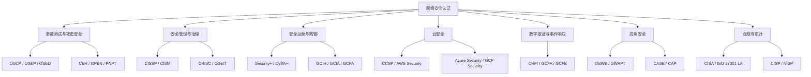
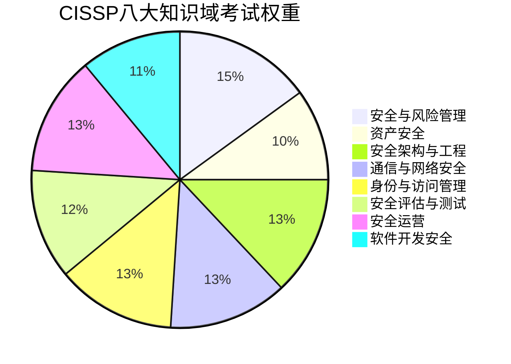
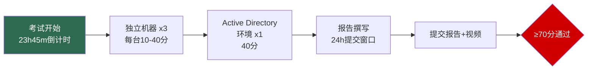
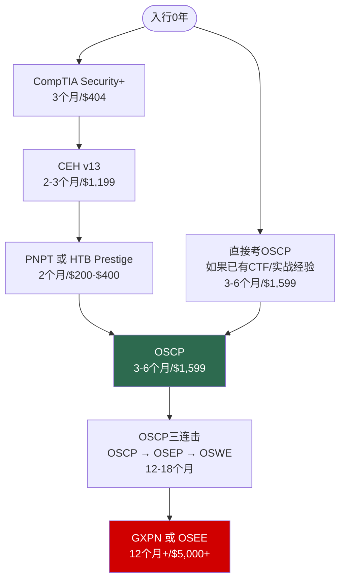
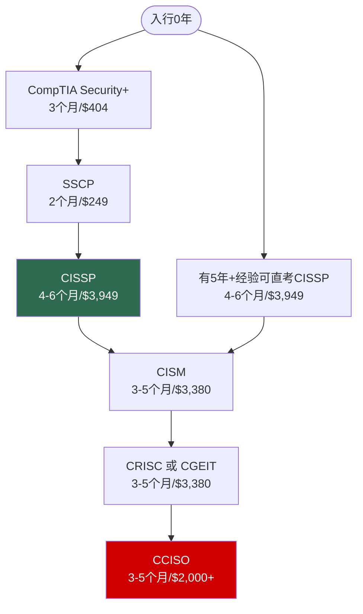
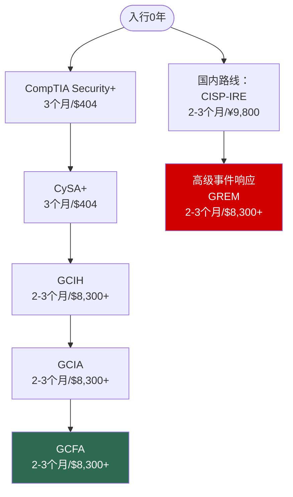
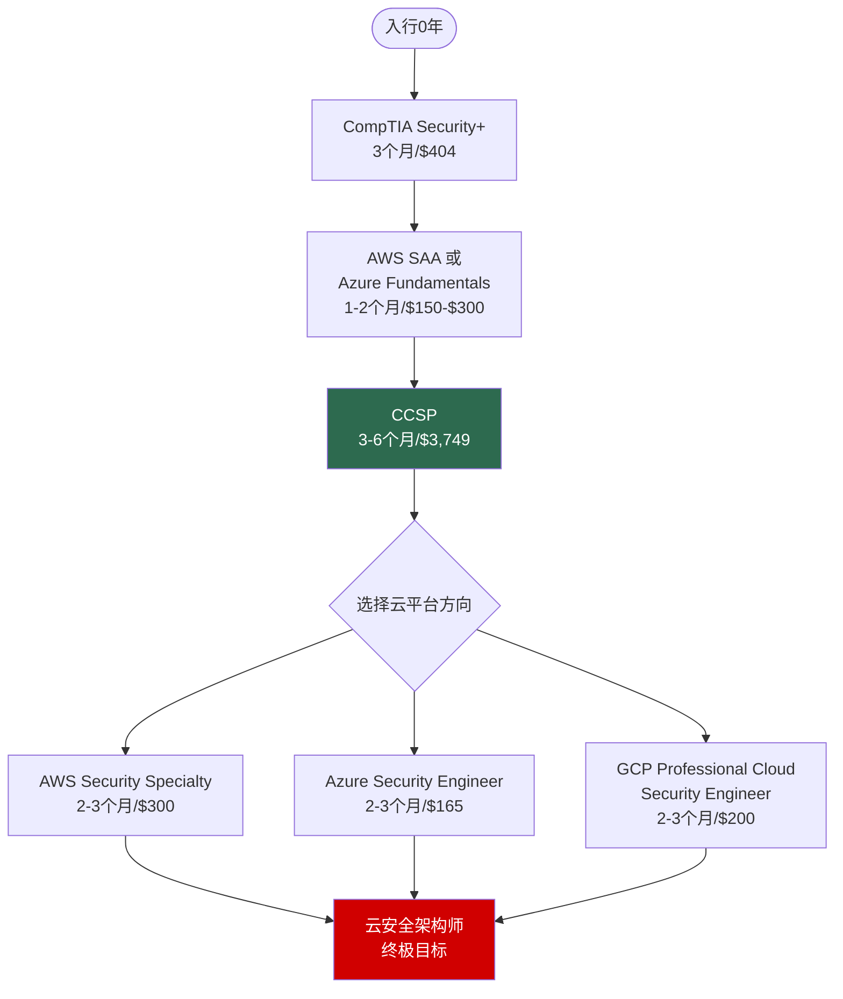
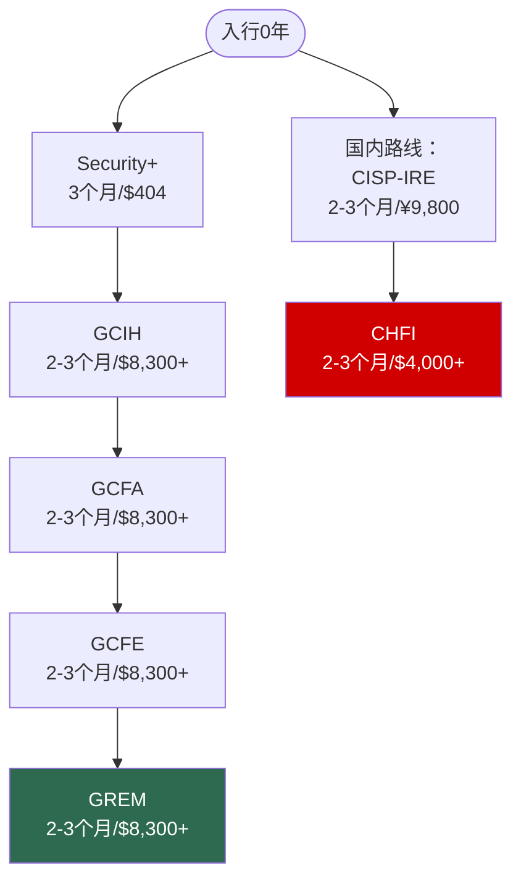

# 第28章 认证路线图 - 深度拓展

本节作为认证路线图的收官篇章，将前面理论基础、核心技巧和实战案例中的知识进行纵深拓展。我们将从认证体系全景图出发，深入剖析各主流认证的核心细节，提供可落地的成本分析和备考时间表，追踪行业前沿动态，并给出完整的学习资源地图，帮助你做出真正符合自身情况的认证决策。

---

## 一、网络安全认证体系全景图

### 1.1 认证的本质与价值

网络安全认证并非一张简单的"证书"——它是一套**标准化的人才评估机制**。在信息不对称的就业市场中，认证充当了"信任传递"的桥梁：认证机构以其专业声誉为担保，向雇主传递"此人具备某项能力"的信号。

**认证的核心价值体现在五个维度：**

| 价值维度 | 具体体现 | 量化参考 |
|---------|---------|---------|
| 知识验证 | 通过标准化考试证明专业能力 | 覆盖数百个知识域的系统考核 |
| 薪资提升 | 持证者薪资显著高于未持证者 | (ISC)²数据：平均高出20%-30% |
| 职业准入 | 某些岗位的硬性门槛要求 | 美国约60%安全岗位要求或优先认证 |
| 持续学习 | 认证续期倒逼持续专业发展 | 多数认证需每年40-80 CPE学分 |
| 行业人脉 | 认证社区提供专业交流平台 | (ISC)²全球会员超180万人 |

需要强调的是，认证**不能完全代表实际能力**。一个持有CISSP的从业者未必比一个在一线深耕5年但无认证的工程师更有实战能力。认证是"加分项"而非"替代品"，最佳策略是**认证+实战经验+持续学习**三位一体。

### 1.2 认证的分类体系

网络安全认证可以从三个维度进行分类：

**按技术领域分类：**

**按难度级别分类：**

| 级别 | 适合人群 | 代表认证 | 典型备考时长 | 考试费用(USD) |
|-----|---------|---------|------------|-------------|
| 入门级 | 0-2年经验，IT转行者 | Security+, SSCP, CEH | 2-3个月 | $370-$500 |
| 中级 | 2-5年经验，有一定基础 | OSCP, CySA+, CCSP | 3-6个月 | $600-$1,600 |
| 高级 | 5年+经验，资深从业者 | CISSP, CISM, OSEP | 4-8个月 | $700-$2,500 |
| 专家级 | 行业顶尖，深度研究者 | OSEE, GXPN, OSCE3 | 6-12个月 | $1,500-$5,000 |

**按发证机构分类：**

| 机构类型 | 特点 | 代表机构 | 适合人群 |
|---------|------|---------|---------|
| 厂商中立 | 跨平台通用，行业认可度广 | (ISC)², ISACA, CompTIA | 追求广泛认可的从业者 |
| 厂商特定 | 深度绑定特定技术栈 | AWS, Microsoft, Cisco | 专注特定平台的工程师 |
| 实战导向 | 考核实际操作能力 | Offensive Security, SANS/GIAC | 渗透测试/蓝队实操人员 |
| 政府/行业 | 满足合规和法规要求 | CISP, NISP, DISA | 中国体制内/军工/央企 |

### 1.3 主要认证机构深度剖析

#### (ISC)²——信息安全认证的全球领导者

(ISC)²成立于1989年，是全球最大的非营利网络安全认证和人才培养组织。其核心理念是"一个安全的世界"（A Safe and Secure World），要求所有持证者遵守《(ISC)²道德准则》。

**核心认证矩阵：**

| 认证 | 全称 | 领域 | 经验要求 | 考试格式 | 费用(USD) | 续证要求 |
|-----|------|------|---------|---------|----------|---------|
| CISSP | Certified Information Systems Security Professional | 信息安全管理 | 5年（可用学位抵1年） | CAT 100-150题/3小时 | $749 | 40 CPE/年 |
| CCSP | Certified Cloud Security Professional | 云安全 | 5年（含1年云安全） | CAT 125题/4小时 | $599 | 30 CPE/年 |
| SSCP | Systems Security Certified Practitioner | 安全运维 | 1年 | CAT 125题/4小时 | $249 | 40 CPE/年 |
| CSSLP | Certified Secure Software Lifecycle Professional | 应用安全 | 4年 | CAT 125题/4小时 | $599 | 30 CPE/年 |
| CC | Certified in Cybersecurity | 入门级安全 | 无 | CAT 100题/2小时 | $0（免费） | 无 |

> **(ISC)²新动态**：2024年推出的CC（Certified in Cybersecurity）认证是完全免费的入门级认证，包含入门级、中级和高级三个层次，降低了安全行业的准入门槛。这是一个值得关注的趋势——认证机构开始通过免费入门认证来扩大安全人才储备。

#### ISACA——IT治理与审计的权威

ISACA成立于1969年，最初专注于IT审计领域，现已扩展到信息安全治理、风险管理和合规领域。其认证在金融、审计和合规行业具有极高声望。

**核心认证矩阵：**

| 认证 | 全称 | 领域 | 经验要求 | 考试格式 | 费用(USD) | 续证要求 |
|-----|------|------|---------|---------|----------|---------|
| CISM | Certified Information Security Manager | 信息安全管理 | 5年（含3年管理） | 150题/4小时 | $760 | 20 CPE/年 |
| CISA | Certified Information Systems Auditor | IT审计 | 5年（含2年审计） | 150题/4小时 | $760 | 20 CPE/年 |
| CRISC | Certified in Risk and Information Systems Control | 风险管理 | 5年（含3年风险管理） | 150题/4小时 | $760 | 20 CPE/年 |
| CGEIT | Certified in the Governance of Enterprise IT | IT治理 | 5年（含2年治理） | 150题/4小时 | $760 | 20 CPE/年 |

#### Offensive Security——渗透测试的硬核标杆

Offensive Security（简称OffSec）以极其严格的实战考试闻名于世。其认证考试不是做选择题，而是在真实环境中攻破目标机器——这种考核方式使得OffSec认证在渗透测试领域拥有无与伦比的信誉。

**核心认证矩阵：**

| 认证 | 全称 | 课程 | 考试时长 | 通过要求 | 费用(USD) |
|-----|------|------|---------|---------|----------|
| PEN-200 → OSCP | Penetration Testing with Kali Linux | 渗透测试基础到中级 | 23小时45分钟 | 70/100分 | $1,599-$2,549 |
| PEN-300 → OSEP | Evasion Techniques and Breaching Defenses | 高级渗透测试 | 48小时 | 70/100分 | $1,599-$2,549 |
| EXP-301 → OSED | Windows User Mode Exploit Developer | Windows漏洞开发 | 48小时 | 70/100分 | $1,599-$2,549 |
| WEB-300 → OSWE | Advanced Web Attacks and Exploitation | Web安全漏洞研究 | 72小时 | 70/100分 | $1,599-$2,549 |

> **OffSec定价说明**：基础价格$1,599包含90天课程访问权限+1次考试机会。$2,549版本包含180天访问权限+2次考试机会。失败后可单独购买重考，约$400-$600。

#### SANS/GIAC——高端安全培训的代名词

SANS Institute是全球最大的信息安全培训组织，其GIAC（Global Information Assurance Certification）认证以课程质量极高、考试难度极大著称。但SANS的培训费用也极为昂贵——这是其最大门槛。

**热门GIAC认证：**

| 认证 | 全称 | 对应课程 | 课程费用(USD) | 认证考试费(USD) |
|-----|------|---------|-------------|---------------|
| GPEN | GIAC Penetration Tester | SEC560 | $7,360-$9,390 | $949 |
| GCIH | GIAC Certified Incident Handler | SEC504 | $7,360-$9,390 | $949 |
| GCIA | GIAC Certified Intrusion Analyst | SEC503 | $7,360-$9,390 | $949 |
| GREM | GIAC Reverse Engineering Malware | SEC610 | $7,360-$9,390 | $949 |
| GXPN | GIAC Exploit Researcher and Advanced Penetration Tester | SEC660 | $9,390-$11,390 | $949 |

> **SANS的成本现实**：SANS/GIAC是所有认证中**成本最高**的路径。完成一门课程+认证的总费用在$8,300-$10,300之间。好消息是，SANS提供多种奖学金项目（如CyberTalent Scholarship），可将费用降低至$0-$2,000。此外，部分雇主会报销SANS培训费用。

#### CompTIA——入门级安全的行业标准

CompTIA（Computing Technology Industry Association）是全球最大的IT行业组织之一，其认证被广泛视为进入IT和安全行业的"入场券"。

**核心安全认证：**

| 认证 | 全称 | 前置条件 | 考试格式 | 费用(USD) | 有效期 |
|-----|------|---------|---------|----------|-------|
| Security+ | CompTIA Security+ | 无（建议2年IT经验） | 最多90题/90分钟 | $404 | 3年 |
| CySA+ | CompTIA Cybersecurity Analyst | Security+或3年经验 | 最多85题/165分钟 | $404 | 3年 |
| CASP+ | CompTIA Advanced Security Practitioner | CySA+或5年经验 | 最多90题/165分钟 | $509 | 3年 |
| PenTest+ | CompTIA Penetration Testing | CySA+或3年经验 | 最多85题/165分钟 | $404 | 3年 |

### 1.4 中国本土认证体系

对于在中国发展的安全从业者，本土认证同样不可忽视。许多政府机构、央企和国企在招聘时明确要求持有CISP等国内认证。

| 认证 | 全称 | 发证机构 | 适用场景 | 费用(RMB) | 备考建议 |
|-----|------|---------|---------|----------|---------|
| CISP | 注册信息安全专业人员 | 中国信息安全测评中心 | 政府/央企/国企 | 9,800-12,000 | 官方培训+教材，注重政策法规 |
| CISP-PTE | 注册渗透测试工程师 | 中国信息安全测评中心 | 渗透测试岗位 | 9,800-12,000 | 实操考试，需搭建实验环境 |
| CISP-IRE | 注册应急响应工程师 | 中国信息安全测评中心 | 安全运营/应急响应 | 9,800-12,000 | 结合国内安全事件案例 |
| NISP | 国家信息安全水平考试 | 中国信息安全测评中心 | 在校学生/初级从业者 | 680-1,280 | 分一级和二级，适合入门 |
| NISP二级 | 国家信息安全水平考试（二级） | 中国信息安全测评中心 | 有一定基础的从业者 | 1,280 | 含渗透测试、安全运维等方向 |

> **CISP报名须知**：CISP认证必须通过中国信息安全测评中心授权的培训机构报名，不支持个人直接报考。培训一般为4天集中授课+2天考试准备。各培训机构价格在9,800-12,000元之间浮动，建议选择官方授权的大型机构（如谷安天下、启明星辰等）。

---

## 二、核心认证深度解析

### 2.1 CISSP——信息安全管理的"黄金标准"

CISSP被公认为信息安全领域最具含金量的认证之一，是全球安全管理和CISO岗位的"敲门砖"。

**八大知识域及权重（2024版CBK）：**

**各知识域核心考点详解：**

| 知识域 | 权重 | 核心考点 | 常见题型 |
|-------|------|---------|---------|
| 安全与风险管理 | 15% | 安全治理原则、合规框架(RFRA/GDPR)、BIA、安全策略制定、职业伦理 | 场景分析：给定情境判断最佳安全策略 |
| 资产安全 | 10% | 数据分级分类、数据生命周期管理、隐私保护、数据安全控制 | 知识应用：识别资产分类中的错误做法 |
| 安全架构与工程 | 13% | 安全模型(Bell-LaPadula/Biba/Clark-Wilson)、密码学、安全架构设计、物理安全 | 概念辨析：区分不同安全模型的适用场景 |
| 通信与网络安全 | 13% | OSI/TCP-IP模型、网络设备安全、安全协议(TLS/IPSec/SSH)、VPN、网络攻击防御 | 技术细节：协议层级对应的攻击与防御 |
| 身份与访问管理 | 13% | 身份认证机制、访问控制模型(RBAC/ABAC/MAC/DAC)、联合身份管理、目录服务 | 方案设计：选择合适的身份认证与授权方案 |
| 安全评估与测试 | 12% | 渗透测试流程、漏洞评估、日志审查、绩效度量 | 流程判断：渗透测试各阶段的目标和输出 |
| 安全运营 | 13% | 安全运营中心(SOC)、事件响应、灾难恢复、业务连续性、取证调查 | 排序题：事件响应流程的正确步骤 |
| 软件开发安全 | 11% | SDL/DevSecOps、安全编码实践、API安全、代码审计、漏洞管理 | 实践应用：识别代码中的安全缺陷类型 |

**CISSP备考实战建议：**

1. **必备教材**：CISSP All-in-One Exam Guide (第9版, Shon Harris/Fernando Maymí) + CISSP Official Study Guide (ISC)²官方学习指南
2. **练习平台**：Boson CISSP Practice Exams（公认最接近真题的模拟题）
3. **学习时长**：建议4-6个月，每天1-2小时
4. **关键策略**：CISSP考的不是"技术有多强"，而是"决策有多合理"——始终站在**管理层视角**思考问题
5. **常见陷阱**：不要选"最安全的"方案，要选"最合适的"方案（兼顾安全、成本、业务需求）

### 2.2 OSCP——渗透测试领域的"硬核通行证"

OSCP是渗透测试领域认可度最高的实操型认证，其考试要求考生在23小时45分钟内攻破多台目标机器并获得足够分数——没有选择题，纯粹考验实战能力。

**PEN-200课程核心模块：**

| 模块 | 内容 | 学习重点 | 实验要求 |
|-----|------|---------|---------|
| 渗透测试方法论 | PTES标准流程 | 信息收集→漏洞分析→渗透→后渗透→报告 | 完成方法论文档 |
| 信息收集 | 被动/主动侦察技术 | Nmap、Whois、DNS枚举、OSINT | 完成网络侦察实验 |
| Web应用攻击 | SQL注入、文件包含、命令注入等 | Burp Suite使用、Web枚举 | 攻破Web应用实验 |
| 网络服务攻击 | SMB、SSH、FTP、RDP等服务利用 | Metasploit/手动利用 | 攻破网络服务实验 |
| 密码攻击 | 暴力破解、字典攻击、离线破解 | Hydra、Hashcat、John the Ripper | 完成密码攻击实验 |
| 本地提权 | 内核漏洞、配置错误、SUID滥用 | LinPEAS/WinPEAS、内核提权 | 完成提权实验 |
| 后渗透 | 横向移动、持久化、数据提取 | 代理隧道、Mimikatz、AD攻击 | 完成后渗透实验 |

**OSCP考试结构（2024版PEN-200）：**

- **独立机器**：3台不同难度的独立目标，分值各不相同，难度递增
- **Active Directory环境**：2022年改革后新增，整个AD域环境值40分——这是最大分值单体，需要拿下域管理员权限
- **报告**：考试结束后24小时内提交详细渗透测试报告

**OSCP备考时间表（推荐12周计划）：**

| 周次 | 学习内容 | 每日时长 | 里程碑 |
|-----|---------|---------|-------|
| 第1-2周 | 课程模块1-3：方法论、信息收集、Web攻击 | 2-3小时 | 完成基础实验 |
| 第3-4周 | 课程模块4-6：网络服务、密码攻击、本地提权 | 2-3小时 | 独立攻破5台HTB机器 |
| 第5-6周 | 课程模块7-9：后渗透、AD攻击、报告 | 3-4小时 | 完成所有课程实验 |
| 第7-8周 | HTB/TryHackMe系统练习 | 3-4小时 | 独立攻破15+台机器 |
| 第9-10周 | AD环境专项练习 | 4-5小时 | AD环境全系列攻破 |
| 第11周 | 模拟考试（完整23h45m） | 全天 | 模拟得分≥70 |
| 第12周 | 查漏补缺+报告模板准备 | 2-3小时 | 报告模板完成 |

### 2.3 CEH——道德黑客认证的入门之选

CEH（Certified Ethical Hacker）是EC-Council颁发的道德黑客认证，适合安全领域的入门和中级从业者。虽然其实战性不如OSCP，但在企业招聘和合规场景中有广泛认可。

**CEH v13核心知识域（16个模块）：**

| 模块 | 内容 | 考试占比 | 核心工具 |
|-----|------|---------|---------|
| 1. 信息收集概论 | OSINT、网络侦察 | 5% | Maltego、theHarvester |
| 2. 网络扫描 | 端口扫描、服务识别、OS指纹 | 5% | Nmap、Masscan |
| 3. 枚举 | 用户名枚举、SMB枚举、SNMP枚举 | 5% | Enum4linux、SNMPwalk |
| 4. 系统入侵 | 漏洞利用、远程代码执行 | 8% | Metasploit、SearchSploit |
| 5. 恶意软件 | 病毒、木马、勒索软件分析 | 5% | Wireshark、Process Monitor |
| 6. 社会工程学 | 钓鱼、物理渗透、认知攻击 | 8% | SET、GoPhish |
| 7. DoS攻击 | 流量放大、协议耗尽 | 3% | Hping3、LOIC |
| 8. 会话劫持 | Cookie劫持、中间人攻击 | 3% | Burp Suite、Ettercap |
| 9. Web服务器攻击 | 服务器配置错误、已知漏洞 | 5% | Nikto、DirBuster |
| 10. Web应用攻击 | OWASP Top 10全覆盖 | 10% | Burp Suite、OWASP ZAP |
| 11. SQL注入 | 手工注入、自动化注入 | 8% | SQLMap |
| 12. 无线网络攻击 | WPA2破解、Evil Twin | 5% | Aircrack-ng、Wifite |
| 13. 移动平台攻击 | Android/iOS安全测试 | 3% | Drozer、Frida |
| 14. IoT和OT攻击 | 物联网和工控安全 | 3% | Shodan、IoT Inspector |
| 15. 云计算安全 | 云环境渗透测试 | 5% | ScoutSuite、Pacu |
| 16. 密码学 | 哈希、加密、密钥管理 | 3% | Hashcat、John the Ripper |

**CEH考试信息：**
- 题目数量：125道选择题
- 考试时间：4小时
- 通过分数：60%-85%（根据考试版本动态调整）
- 考试费用：$1,199（含1次考试机会）
- 培训要求：建议完成官方培训（约$2,800-$3,500），但可通过工作经验豁免

### 2.4 CCSP——云安全认证的首选

随着企业上云加速，CCSP（Certified Cloud Security Professional）已成为云安全领域最受认可的认证。它由(ISC)²和CSA（Cloud Security Alliance）联合推出。

**CCSP六大知识域：**

| 知识域 | 权重 | 核心考点 |
|-------|------|---------|
| 云概念、架构与设计 | 17% | 云服务模型（IaaS/PaaS/SaaS）、部署模型、安全架构 |
| 云数据安全 | 20% | 数据生命周期安全、加密、密钥管理、数据丢失防护 |
| 云平台与基础设施安全 | 17% | 虚拟化安全、容器安全、网络分段、身份管理 |
| 云应用安全 | 11% | 安全开发生命周期、API安全、安全测试 |
| 云安全运营 | 16% | 事件响应、BCP/DR、安全监控、合规审计 |
| 云法律与合规 | 19% | 数据主权、隐私法规、合同管理、审计责任 |

**CCSP与CISSP的对比：**

| 对比维度 | CISSP | CCSP |
|---------|-------|------|
| 核心领域 | 广泛的信息安全管理 | 专注云安全 |
| 经验要求 | 5年（通用安全） | 5年（含1年云安全） |
| 知识域数量 | 8个 | 6个 |
| 交叉程度 | 包含云安全基础 | 需要CISSP级别的安全基础 |
| 建议备考顺序 | 可直接考 | 建议先考CISSP |
| 费用(USD) | $749 | $599 |
| 市场定位 | CISO/安全管理岗位 | 云安全架构师/工程师 |

---

## 三、认证成本全景分析

### 3.1 直接成本对比

以下列出各认证的**总持有成本**（考试费+推荐培训费+教材费+续证费，按3年有效期计算）：

| 认证 | 考试费(USD) | 推荐培训(USD) | 教材费(USD) | 3年续证费(USD) | 总成本(USD) | 总成本(RMB约) |
|-----|-----------|-------------|-----------|--------------|-----------|-------------|
| Security+ | 404 | 0(自学) | 50 | 0(CEU可免费) | 454 | 3,300 |
| CEH | 1,199 | 2,800 | 80 | 0(免续证) | 4,079 | 29,500 |
| CCSP | 599 | 3,000 | 60 | 90 | 3,749 | 27,200 |
| OSCP | 1,599 | 0(含课程) | 0(含课程) | 0(永久有效) | 1,599 | 11,600 |
| CISSP | 749 | 3,000 | 80 | 120 | 3,949 | 28,600 |
| CISM | 760 | 2,500 | 60 | 60 | 3,380 | 24,500 |
| GPEN | 949 | 9,390 | 0(含课程) | 949 | 11,288 | 82,000 |
| CISP | ¥9,800 | 含培训 | 含教材 | ¥400/年 | ¥11,000 | 11,000 |

> **注**：汇率按1 USD ≈ 7.25 RMB估算，实际费用因汇率波动和促销活动可能有所不同。

### 3.2 间接成本考量

除了直接的经济成本，还需要考虑以下间接成本：

**时间成本：**

| 认证 | 建议备考时长 | 每日学习时间 | 总学习小时数 |
|-----|-----------|-----------|-----------|
| Security+ | 2-3个月 | 1-2小时 | 100-150小时 |
| CEH | 2-4个月 | 1-2小时 | 100-200小时 |
| CCSP | 3-6个月 | 2-3小时 | 200-350小时 |
| OSCP | 3-6个月 | 3-5小时 | 300-500小时 |
| CISSP | 4-6个月 | 2-3小时 | 300-500小时 |
| CISM | 3-5个月 | 2-3小时 | 200-350小时 |
| GPEN | 2-3个月（课程） | 全日制 | 200-300小时 |

**机会成本：**
- 备考期间可能需要减少加班和副业时间
- 高强度备考可能影响工作绩效（需合理平衡）
- 培训课程通常需要请假参加（4-6天集中培训）

### 3.3 投资回报率(ROI)分析

认证投资的回报主要体现在薪资提升和职业机会两个方面：

**各认证对薪资的影响（基于Glassdoor、Indeed等平台数据）：**

| 认证 | 平均年薪提升(USD) | 投资回收期 | 5年净收益(USD) |
|-----|-----------------|----------|-------------|
| Security+ | +$8,000 | 7个月 | $36,460 |
| CEH | +$10,000 | 5个月 | $45,920 |
| CCSP | +$15,000 | 3个月 | $71,250 |
| OSCP | +$12,000 | 2个月 | $58,400 |
| CISSP | +$15,000 | 3个月 | $71,050 |
| CISM | +$12,000 | 3个月 | $56,620 |
| GPEN | +$15,000 | 9个月 | $63,710 |

> **ROI计算公式**：投资回收期 = 总成本 / (年薪资提升/12)；5年净收益 = 年薪资提升 × 5 - 总成本。以上数据为估算值，实际收益因个人情况、地区市场和岗位差异而不同。

**关键洞察**：
- **OSCP的ROI最高**：成本低、永久有效、薪资提升显著，是渗透测试方向的首选投资
- **Security+的入门ROI最优**：成本最低、备考时间最短、市场认可度广
- **SANS/GIAC培训ROI较低**：除非获得奖学金或雇主报销，否则高昂的培训费拉低了投资回报
- **CISP在国内市场的ROI稳定**：在政府/央企/国企场景下几乎是必备认证

---

## 四、基于职业目标的认证路径规划

### 4.1 渗透测试方向

**各阶段关键里程碑：**

| 阶段 | 目标 | 典型职位 | 薪资范围(RMB/年) |
|-----|------|---------|----------------|
| Security+ | 建立安全基础知识体系 | 初级安全工程师 | 8-15万 |
| CEH | 理解攻击者思维和常见攻击手法 | 安全测试工程师 | 10-18万 |
| OSCP | 具备独立渗透测试能力 | 渗透测试工程师 | 15-30万 |
| OSEP/OSWE | 高级渗透和Web漏洞研究能力 | 高级渗透测试工程师 | 25-50万 |
| OSEE/GXPN | 漏洞研究和高级利用开发 | 安全研究员/红队负责人 | 40-80万 |

### 4.2 安全管理方向

**管理方向特别说明：**
- **CISSP → CISM是经典组合**：CISSP覆盖广泛的技术+管理知识，CISM则深入信息安全管理体系
- **CRISC适合风险导向岗位**：如果目标是GRC（治理、风险、合规）方向，CRISC是加分项
- **CCISO是CISO的终级认证**：面向有志于成为首席信息安全官的高管候选人

### 4.3 安全运营方向

### 4.4 云安全方向

**云安全方向特别说明：**
- **CCSP是云安全的"通识课"**：不绑定特定云平台，适合架构师级别
- **平台认证是"落地能力"**：AWS/Azure/GCP认证证明你能实际操作该平台
- **趋势：容器和Kubernetes安全**：CKS（Certified Kubernetes Security Specialist）正成为云原生安全的新热门认证

### 4.5 数字取证与事件响应方向

---

## 五、认证考试实战策略

### 5.1 选择题考试策略（适用于CISSP/CISM/CEH等）

**审题三步法：**

1. **识别关键词**：题干中的限定词（"最佳"、"首先"、"最安全"、"管理层"）直接决定答案方向
2. **排除法**：先排除明显错误的选项（通常2个），再在剩余选项中选择最佳答案
3. **换位思考**：想象自己是CISO/安全经理/审计员——你会怎么做？

**CISSP答题核心原则：**
- 始终选择"最佳实践"而非"技术上最先进的"
- 考虑合规要求（如GDPR、等保）对决策的影响
- 安全策略优先级：预防 > 检测 > 响应 > 恢复
- 当多个选项都"对"时，选**最全面、最系统化**的那个
- 如果题目问"首先要做什么"——通常是**风险评估**

**时间管理（以CISSP为例）：**
- 100-150题/3小时 ≈ 每题1.2-1.8分钟
- 前50题控制在40分钟内
- 如果某题超过3分钟仍不确定，标记后跳过
- 最后预留15分钟检查标记题目

### 5.2 实操考试策略（适用于OSCP等）

**OSCP 23小时考试时间线规划：**

| 时间段 | 活动 | 说明 |
|-------|------|------|
| 0-2小时 | 全面信息收集 | Nmap全端口扫描、服务枚举、Web目录爆破 |
| 2-6小时 | 独立机器1攻击 | 优先拿下最简单的机器，建立信心 |
| 6-12小时 | 独立机器2+3攻击 | 中等和高难度机器，交替尝试 |
| 12-18小时 | AD环境攻击 | 专注域渗透，拿下域管理员 |
| 18-20小时 | 补充分数 | 回头攻克之前失败的机器 |
| 20-23小时 | 过程记录整理 | 截图、命令记录、时间戳整理 |
| 考试结束后24小时 | 报告撰写 | 使用预准备的报告模板 |

**关键技巧：**
- **不要死磕**：如果一台机器30分钟内没有思路，换一台继续
- **善用提示**：OSCP考试有有限的提示机制（如社区论坛），在关键时刻使用
- **记录一切**：每一步操作都要截图记录，报告需要详细的过程描述
- **准备报告模板**：考试前就准备好报告模板（封面、目录、机器详情、截图占位）

### 5.3 持续教育(CPE)管理

大多数认证要求持证者每年获取一定数量的CPE（Continuing Professional Education）学分来维持认证有效性。

**各认证CPE要求对比：**

| 认证 | 每年CPE要求 | 总CPE要求(周期) | CPE获取途径 |
|-----|-----------|---------------|-----------|
| CISSP | 40 CPE/年 | 120 CPE/3年 | 培训、会议、出版物、志愿服务 |
| CCSP | 30 CPE/年 | 90 CPE/3年 | 培训、会议、在线学习 |
| SSCP | 40 CPE/年 | 120 CPE/3年 | 同CISSP |
| CISM | 20 CPE/年 | 120 CPE/3年 | 培训、会议、阅读 |
| OSCP | 无CPE要求 | 永久有效 | — |
| Security+ | — | CEU/3年 | 培训、会议、出版物 |

**高效积累CPE的途径：**
- **安全会议**：Black Hat（每次可获15-20 CPE）、DEF CON、RSAC、ISC² Congress
- **在线课程**：SANS Webcasts（免费，每次1-2 CPE）、Cybrary、Pluralsight
- **出版物**：发表技术博客、论文（需审核认可）
- **社区贡献**：参与OWASP、(ISC)²社区活动
- **企业内训**：组织或参与内部安全培训

---

## 六、行业前沿动态与未来趋势

### 6.1 云安全认证的爆发式增长

云计算的全面普及正在重塑安全认证市场。2024-2025年的关键趋势：

**多云安全认证需求激增：**
- 企业平均使用2.3个云平台（Flexera 2024报告），导致云安全人才缺口扩大
- CCSP持证者需求年增长35%以上
- Kubernetes安全（CKS认证）成为新兴热门方向
- 容器安全、Serverless安全等细分领域正在催生新的认证需求

**云安全认证路线建议：**
- 入门：AWS Cloud Practitioner / Azure Fundamentals → Security+
- 进阶：CCSP + 1个平台认证（AWS/Azure/GCP）
- 高级：CCSP + AWS Security Specialty + CKS

### 6.2 AI安全认证的兴起

随着AI技术的广泛应用，AI安全正成为认证市场的新增长点：

**新兴AI安全认证：**
| 认证 | 发证机构 | 关注领域 | 成熟度 |
|-----|---------|---------|-------|
| CAISM（Certified AI Security Manager） | AI安全联盟 | AI系统安全治理 | 早期阶段 |
| MLSA（Machine Learning Security Assessment） | SANS/GIAC | ML模型安全 | 发展中 |
| NIST AI RMF相关认证 | NIST框架推动 | AI风险管理 | 标准化阶段 |

**现有认证中的AI安全内容扩展：**
- CISSP v9已增加AI安全相关考点
- CCSP加入了AI云服务安全的考核内容
- SANS开设了专门的AI安全课程（SEC595）

### 6.3 微认证与技能验证的兴起

传统"大而全"的认证正在受到灵活性更强的微认证挑战：

**微认证趋势：**
- **Google/Coursera专业证书**：3-6个月完成，行业认可度快速上升
- **AWS Skill Builder**：亚马逊推出的模块化技能验证
- **Microsoft Learn Credentials**：微软的微认证体系
- **ISC² CC认证**：免费入门认证，降低行业门槛

**微认证的优劣势分析：**

| 维度 | 传统认证 | 微认证 |
|-----|---------|-------|
| 考核深度 | 深入全面 | 聚焦特定技能 |
| 市场认可 | 广泛成熟 | 快速增长中 |
| 时间投入 | 3-12个月 | 2-8周 |
| 成本 | 较高($300-$10,000) | 较低($0-$500) |
| 续证要求 | 有(CPE/CEU) | 通常无或较宽松 |
| 适用场景 | 管理岗/架构师/合规 | 技术岗/快速技能验证 |

### 6.4 认证的数字化转型

**在线监考考试的普及：**
- (ISC)²、ISACA、CompTIA均已支持远程在线监考
- OnVUE（Pearson VUE）和ProctorU等远程监考平台成熟
- 自适应测试（CAT）技术根据答题水平动态调整难度

**数字化认证凭证：**
- 数字徽章（Digital Badges）正在取代传统纸质证书
- LinkedIn等平台已支持认证徽章展示
- 区块链验证技术开始应用于认证防伪

### 6.5 中国市场认证发展趋势

**国内认证体系的完善：**
- 等级保护2.0标准推动了等保测评师认证需求
- 数据安全法和个人信息保护法的实施催生了数据安全相关认证
- 关键信息基础设施保护（关保）要求推动了关保评估师认证
- 信创安全认证随着国产化替代加速兴起

**国产化与自主可控相关的安全认证：**
- 信创安全工程师认证（各厂商推动）
- 密码应用安全性评估师（国密局推动）
- 数据安全治理官（CCRC认证中心）

---

## 七、学习资源地图

### 7.1 核心备考资源推荐

**综合平台：**

| 平台 | 特色 | 适合认证 | 费用 | 推荐指数 |
|-----|------|---------|------|---------|
| TryHackMe | 引导式学习路径，适合初学者 | OSCP入门、Security+ | 免费/$14/月 | ★★★★★ |
| HackTheBox | 高质量靶机，挑战性强 | OSCP、GPEN | 免费/$14/月 | ★★★★★ |
| PentesterLab | Web安全专精 | OSWE、CEH | $20/月 | ★★★★ |
| CyberDefenders | 蓝队/取证靶场 | GCIH、GCFA | 免费/$15/月 | ★★★★ |
| LetsDefend | SOC模拟运营 | CySA+、GCIH | 免费/$14/月 | ★★★★ |
| PortSwigger Academy | Burp Suite官方Web安全教程 | OSWE、CEH | 免费 | ★★★★★ |

**CISSP专项资源：**
- **Boson CISSP Practice Exams**：公认最接近真题的模拟题，$89
- **Destination Certification MindMap系列**：YouTube上最受欢迎的CISSP视频
- **Prabh Nair CISSP视频**：深入浅出的讲解风格

**OSCP专项资源：**
- **TCM Security的Practical Ethical Hacking**：入门到OSCP的桥梁课程
- **IppSec的HTB视频**：每台HTB机器的详细解题过程
- **VIP Lobsters的OSCP笔记**：社区公认的高质量备考笔记

### 7.2 书籍推荐

| 书名 | 作者 | 出版社 | 适合认证 | 推荐理由 |
|-----|------|-------|---------|---------|
| CISSP All-in-One Exam Guide (第9版) | Fernando Maymí, Shon Harris | McGraw-Hill | CISSP | CISSP备考圣经，覆盖所有知识域 |
| Official (ISC)² Guide to the CISSP CBK (第5版) | (ISC)² | Wiley | CISSP | 官方知识体系参考 |
| CompTIA Security+ Study Guide (SY0-701) | Mike Chapple, David Seidl | Sybex | Security+ | 入门级安全认证权威指南 |
| CEH All-in-One Exam Guide (第4版) | Matt Walker | McGraw-Hill | CEH | CEH备考全面覆盖 |
| Penetration Testing (第2版) | Georgia Weidman | No Starch Press | OSCP | 渗透测试入门经典 |
| The Hacker Playbook 3 | Peter Kim | 自出版 | OSCP | 实战渗透测试方法论 |
| Hacking Exposed Web Applications (第4版) | Joel Scambray, et al. | McGraw-Hill | OSWE/CEH | Web安全攻防权威参考 |
| The Web Application Hacker's Handbook (第2版) | Dafydd Stuttard, Marcus Pinto | Wiley | OSWE | Web渗透测试圣经 |

### 7.3 工具链推荐

**渗透测试方向（OSCP/OSWE必备）：**

| 工具类别 | 推荐工具 | 用途 | 学习优先级 |
|---------|---------|------|----------|
| 侦察 | Nmap、Masscan、Amass | 网络扫描和服务发现 | ★★★★★ |
| Web测试 | Burp Suite、OWASP ZAP | Web应用安全测试 | ★★★★★ |
| 漏洞利用 | Metasploit、SearchSploit | 漏洞利用框架 | ★★★★☆ |
| 密码攻击 | Hydra、Hashcat、John the Ripper | 密码破解和恢复 | ★★★★☆ |
| 提权 | LinPEAS、WinPEAS、GTFOBins | 本地提权辅助 | ★★★★★ |
| 后渗透 | Chisel、Ligolo-ng、CrackMapExec | 代理隧道和横向移动 | ★★★★☆ |
| 信息收集 | Maltego、theHarvester、Shodan | OSINT和信息收集 | ★★★☆☆ |

**安全管理方向（CISSP/CISM辅助）：**

| 工具类别 | 推荐工具 | 用途 |
|---------|---------|------|
| 风险评估 | NIST RMF Tool、Risk Assessment Matrix | 风险量化分析 |
| 合规审计 | OpenSCAP、ComplianceAsCode | 安全基线和合规检查 |
| 安全架构 | draw.io、Lucidchart、Mermaid | 安全架构图绘制 |

**安全运营方向（CySA+/GCIH辅助）：**

| 工具类别 | 推荐工具 | 用途 |
|---------|---------|------|
| SIEM | Splunk、ELK Stack、Wazuh | 日志分析和安全监控 |
| 流量分析 | Wireshark、Zeek、Suricata | 网络流量分析和检测 |
| 取证 | Autopsy、Volatility、FTK | 数字取证分析 |

### 7.4 社区与交流平台

**国际社区：**
- **Reddit r/netsec**：安全技术讨论，每日行业新闻
- **Reddit r/SecurityCareerAdvice**：职业发展建议
- **Discord**：OffSec Discord、HTB Discord、TryHackMe Discord
- **Twitter/X**：安全研究者的信息集散地，关注@TinkerSec、@haborus等

**中国社区：**
- **先知社区**：阿里云旗下的安全技术社区，高质量技术文章
- **FreeBuf**：国内最大的安全媒体之一
- **看雪论坛**：逆向工程和漏洞研究的深度社区
- **安全客**：奇安信旗下安全技术社区
- **绿盟科技技术博客**：国内顶级安全公司的技术分享

---

## 八、常见误区与纠正

### 误区一：认证越多越好

**错误认知**：认为持有更多认证就等于更强的能力。

**事实**：认证的价值在于**深度而非数量**。一个持有OSCP+OSWE的渗透测试专家，比一个持有Security++CEH+CySA+的人在渗透测试领域更有竞争力。根据(ISC)²的调查，雇主更看重的是**与岗位最相关的1-2个核心认证**。

**正确做法**：选择2-3个与职业目标最相关的认证，逐一攻克并深入理解。

### 误区二：只刷题不理解

**错误认知**：认为只要刷完所有题库就能通过考试。

**事实**：选择题考试可以通过刷题通过，但实操考试（如OSCP）无法"刷"过去。即使是选择题认证，纯刷题通过的持证者在面试和工作中会暴露知识漏洞——因为理解才是真正的掌握。

**正确做法**：刷题是辅助手段，核心是理解原理。使用"学习→练习→复习→再练习"的循环方法。

### 误区三：忽视实战经验

**错误认知**：认为拿到认证就等于具备了相应的能力。

**事实**：认证证明你具备了基础知识体系，但实际工作能力需要项目经验来验证。一个从未做过真实渗透测试的OSCP持证者，在面对企业复杂环境时可能手足无措。

**正确做法**：在备考和持证期间，积极参与CTF、Bug Bounty、开源项目和企业安全实践。

### 误区四：忽视续证和持续学习

**错误认知**：考到认证就万事大吉。

**事实**：多数认证需要持续教育（CPE）来维持有效性。更重要的是，安全领域技术更新极快——5年前的认证知识可能已经过时。

**正确做法**：将持续学习纳入职业规划，定期参加安全会议、阅读技术博客、参与社区活动。

### 误区五：盲目追求高难度认证

**错误认知**：认为只有最难的认证才有价值。

**事实**：认证选择应基于**职业需求**而非虚荣心。如果你的目标是安全管理岗位，CISSP+CISM比OSCP+OSEE更实用。

**正确做法**：根据当前职业阶段和目标岗位选择认证，逐步进阶。

---

## 九、思考题与实践练习

### 思考题

1. **认证价值评估**：你计划考取的认证与你的职业目标之间的关联度如何？如果用1-10分评估，你给几分？如何调整使其关联度更高？

2. **成本效益分析**：如果预算有限（例如只有5000元人民币），你会选择哪个认证？请列出你的决策逻辑。

3. **认证vs经验**：假设你面试了两个候选人——一个持有CISSP但只有2年经验，另一个无认证但有7年安全运营经验。你会更倾向于录用谁？为什么？

4. **AI时代的认证**：随着AI工具（如ChatGPT、Copilot）的普及，你认为哪些认证的价值会被削弱？哪些会增强？为什么？

5. **中国市场特殊性**：如果你计划在中国发展，CISP和CISSP应该如何选择？是否需要两个都考？

### 实践练习

1. **个人认证路线图**：根据本节内容，为自己绘制一份从现在到5年后的认证路线图，包括每个阶段的认证目标、预计时间、预算和ROI估算。

2. **学习计划制定**：选择一个目标认证，制定详细的12周学习计划，包括每周学习内容、每日时间安排和里程碑检查点。

3. **资源评估**：访问TryHackMe、HackTheBox和PortSwigger Academy，分别完成一个免费练习房间/挑战，评估哪个平台最适合你当前的水平。

4. **社区参与**：加入一个安全社区（Reddit r/netsec、先知社区或看雪论坛），本周内阅读5篇技术文章并发表1条评论或提问。

---

## 十、本节小结

深度拓展环节将认证路线图的知识从"知道"提升到"理解"和"应用"。核心要点回顾：

| 维度 | 关键收获 |
|-----|---------|
| 体系认知 | 理解了认证的分类体系、主要机构特点和中国本土认证定位 |
| 核心认证 | 深入了解了CISSP/OSCP/CEH/CCSP等认证的考试结构和备考策略 |
| 成本决策 | 掌握了各认证的直接成本、间接成本和ROI分析方法 |
| 路径规划 | 能根据职业方向（渗透/管理/运营/云安全/取证）选择最优认证路径 |
| 考试策略 | 学会了选择题和实操考试的差异化应对策略 |
| 前沿趋势 | 了解了云安全、AI安全、微认证等新兴方向 |

> **最终寄语**：认证是网络安全职业生涯的重要里程碑，但永远不是终点。真正的安全专家是那些将认证知识转化为实战能力、持续跟踪技术演进、并为行业做出贡献的人。选择适合自己的认证路径，以终为始，持之以恒——你的认证之旅，从此刻开始。
