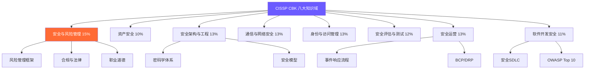
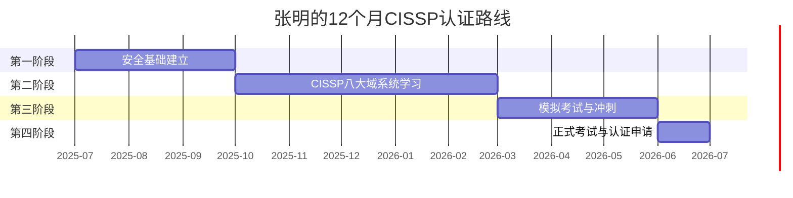

## 28.1 案例一：从零到CISSP的安全管理之路

### 28.1.1 背景介绍

#### 主人公画像

**张明**，30岁，计算机科学专业本科毕业，在一家中型互联网公司担任IT运维工程师5年。日常工作涵盖Linux/Windows服务器管理、网络设备配置（交换机、路由器、防火墙基础策略）、虚拟化平台运维（VMware vSphere）、自动化脚本编写（Shell/Python），以及参与公司ISO 27001信息安全管理体系的运维配合工作。

**转型动机**：公司信息安全事件频发——2025年初发生了一起内部数据泄露事件，一名离职员工利用未及时回收的VPN账号访问了核心业务系统，导致客户敏感数据外泄。公司管理层高度重视，决定组建专职安全团队，并公开竞聘安全负责人岗位。张明意识到，如果能在短时间内补足安全知识体系并获得权威认证，就有机会从运维岗位转型进入管理层。

**能力基线**：

| 维度 | 现有水平 | 缺口分析 |
|------|---------|---------|
| 网络基础 | ★★★★☆ 扎实 | 安全协议（IPsec/SSL/TLS）深度不足 |
| 操作系统 | ★★★★☆ 熟练 | 系统安全加固、安全配置基线（CIS Benchmark）缺乏实操 |
| 编程能力 | ★★★☆☆ 能写脚本 | 安全编码、代码审计、SDLC安全实践空白 |
| 安全基础 | ★★☆☆☆ 了解概念 | 八大安全域系统知识缺乏，无框架化认知 |
| 风险管理 | ★☆☆☆☆ 空白 | 风险评估方法论、NIST RMF、ISO 31000完全不熟悉 |
| 合规知识 | ★☆☆☆☆ 仅知道ISO 27001名字 | GDPR、网络安全法、等保2.0、PCI DSS等法规体系空白 |
| 密码学 | ★★☆☆☆ 知道AES/RSA概念 | 对称/非对称加密原理、PKI体系、数字签名不深入 |
| 管理思维 | ★★☆☆☆ 偏执行 | 战略规划、安全治理、预算管理、向上汇报能力薄弱 |

#### 行业背景

CISSP（Certified Information Systems Security Professional）由(ISC)²颁发，是全球最广泛认可的信息安全管理认证。截至2025年，全球持有CISSP认证的专业人士超过18万人，覆盖170多个国家和地区。

根据(ISC)²《2024年全球网络安全劳动力研究》数据：

- 全球网络安全人才缺口约400万，中国缺口超过100万
- 持有CISSP认证的安全从业者平均年薪约$120,000 USD（国内一线城市约40-80万人民币）
- CISSP持证者薪资比未持证者高出25%-35%
- 73%的CISO职位要求或优先考虑CISSP认证
- CISSP是美国国防部DoD 8570/8140指令认可的IAM/IAT Level III基准认证

在中国市场，CISSP同样是安全管理层岗位的"黄金门票"。大型互联网企业（BAT、字节、华为）、金融行业（银行、证券、保险）、咨询公司（德勤、普华永道、埃森哲）以及跨国企业在华机构，都对CISSP持证者有强烈需求。

---

### 28.1.2 CISSP认证全景解析

在制定认证路线之前，张明需要全面了解CISSP的知识体系、考试要求和职业价值。

#### 八大知识域（CBK）

CISSP的知识体系被称为CBK（Common Body of Knowledge），涵盖信息安全的全部8个领域：

| 编号 | 领域名称 | 权重 | 约考题数 | 核心主题 | 难度 |
|------|---------|------|---------|---------|------|
| 1 | 安全与风险管理 | 15% | 19-26题 | CIA三元组、风险管理框架、合规要求、职业道德 | ⭐⭐⭐⭐⭐ |
| 2 | 资产安全 | 10% | 13-18题 | 数据分类分级、隐私保护、资产生命周期管理 | ⭐⭐⭐ |
| 3 | 安全架构与工程 | 13% | 16-23题 | 密码学、安全模型（Bell-LaPadula/Biba/Clark-Wilson）、物理安全 | ⭐⭐⭐⭐ |
| 4 | 通信与网络安全 | 13% | 16-23题 | OSI/TCP-IP模型、网络架构、安全协议、无线安全 | ⭐⭐⭐ |
| 5 | 身份与访问管理 | 13% | 16-23题 | AAA协议、身份生命周期、SSO/Federation、RBAC/ABAC | ⭐⭐⭐ |
| 6 | 安全评估与测试 | 12% | 15-21题 | 渗透测试、审计流程、漏洞评估、KPI/CSF | ⭐⭐⭐ |
| 7 | 安全运营 | 13% | 16-23题 | 事件响应、灾备/BCP/DR、取证分析、日志管理 | ⭐⭐⭐⭐ |
| 8 | 软件开发安全 | 11% | 14-19题 | SDLC安全、OWASP Top 10、安全编码、数据库安全 | ⭐⭐⭐ |

#### 考试详情与报考条件

| 项目 | 具体内容 |
|------|---------|
| 考试形式 | 计算机自适应测试（CAT） |
| 题目数量 | 100-150道选择题（含25道不计分实验题） |
| 考试时长 | 3小时（含15分钟教程和协议签署） |
| 及格分数 | 700/1000 |
| 考试费用 | $749 USD（首次） |
| 重考费用 | $599 USD（需等待30天） |
| 考试语言 | 英语、简体中文、日语等12种语言 |
| 考试地点 | Pearson VUE授权考试中心（全球） |

**工作经验要求**：

- 至少5年累计信息安全相关工作经验，领域至少覆盖CBK的2个及以上
- 学士学位可抵免1年经验（即4年即可满足要求）
- (ISC)²认可的硕士学位可抵免2年
- 通过考试后有6年时间补足工作经验（未达标期间称为"Associate of (ISC)²"）
- 需要一位有效CISSP持证者背书，或由(ISC)²直接审核

**持续维护**：

- 每年需要40个CPE（Continuing Professional Education）学分
- 年度维护费$125 USD
- 3年为一个认证周期，需积累120个CPE学分

#### CAT自适应考试机制

CISSP采用的CAT（Computerized Adaptive Testing）自适应测试机制是许多考生感到困惑的地方。理解其工作原理对备考策略至关重要：

**运作原理**：

1. 初始难度适中（约50%正确率）
2. 答对 → 题目难度提升；答错 → 题目难度降低
3. 系统根据你的答题表现实时计算"能力估值"
4. 当系统有足够置信度判断你是否达标（或未达标）时，考试提前结束
5. 最少答100题，最多答150题，3小时时限

**关键启示**：

- 不要在简单题上掉以轻心——它们决定了你的能力估值基础
- 遇到超难题不要恐慌——可能是在高难度区间的正常波动
- 审题比解题更重要——CAT题目故意设置大量干扰项，关键词定位是核心技能
- 不要追求"做完"——系统会在适当时机结束考试

---

### 28.1.3 认证规划与路线图

#### SWOT分析

张明对自己进行了深度SWOT分析：

| 维度 | 内容 |
|------|------|
| **优势（S）** | ① IT基础扎实（5年运维经验），网络和系统知识可直接迁移 ② 有项目管理经验（参与过基础设施迁移项目） ③ 公司正在组建安全团队，内部转型机会明确 ④ 有ISO 27001运维配合经验，对合规有初步认知 ⑤ 会Python，能写自动化脚本 |
| **劣势（W）** | ① 无安全领域系统知识，八大域认知碎片化 ② 工作繁忙，有效学习时间有限（工作日约2小时/天） ③ 英语阅读速度慢，CISSP英文考试有挑战 ④ 缺乏风险管理思维，偏重技术执行 ⑤ 密码学知识薄弱，仅了解概念 |
| **机会（O）** | ① 公司安全团队组建，竞聘安全负责人岗位 ② 国家《网络安全法》《数据安全法》推动企业安全投入 ③ 安全人才缺口大，CISSP持证者供不应求 ④ 公司可能支持认证培训费用 ⑤ CISSP考试已支持中文 |
| **威胁（T）** | ① 竞争对手可能已有安全背景或安全认证 ② CISSP考试难度大，首次通过率约50% ③ 考试费用高（$749），经济压力 ④ 5年工作经验要求：需确认是否满足条件 ⑤ 学习进度可能受工作加班影响 |

#### 12个月认证路线图

张明将整个转型计划划分为四个阶段，采用"Security+ → CISSP"的渐进路线：

---

#### 第一阶段：安全基础建立期（第1-3个月）

**目标**：建立安全知识框架，获得CompTIA Security+认证，补齐安全领域入门知识

**为什么选择Security+作为起点**：

张明在分析后认为，直接备考CISSP存在两个风险：一是知识跨度太大，从运维直接跳到管理层思维容易产生认知断层；二是CISSP考试费用$749，失败成本高。Security+作为全球认可的入门级安全认证，无前置经验要求，费用仅$392，且其知识体系与CISSP有约40%的重叠——通过Security+可以为CISSP打下坚实基础。

**学习计划**：

| 月份 | 学习内容 | 学习资源 | 每周投入 | 实操任务 |
|------|---------|---------|---------|---------|
| 第1月 | 安全基础概念、威胁类型、安全架构原则 | Security+教材（Darril Gibson）+ Professor Messer免费视频 | 12小时 | 搭建Home Lab，配置防火墙规则 |
| 第2月 | 网络安全、身份管理、密码学基础、安全运营 | Security+教材后半部分 + Jason Dion练习题 | 14小时 | 使用Wireshark抓包分析HTTPS握手、配置OpenVPN |
| 第3月 | PBQ实操训练 + 模拟考试冲刺 + 考试 | Tutorials Dojo模拟题 + 错题复习 | 15小时 | 完成3套全真模拟，目标850+/900 |

**关键实操任务清单**：

1. 搭建包含防火墙、IDS、SIEM的安全实验环境（使用VirtualBox + 安全虚拟机）
2. 使用Wireshark捕获并分析TLS 1.3握手过程
3. 配置Linux系统安全基线（参考CIS Benchmark for Ubuntu 22.04）
4. 使用John the Ripper测试密码强度，理解暴力破解与字典攻击
5. 编写Python脚本实现简单的端口扫描器
6. 配置Nginx WAF规则防御基础Web攻击

**预计支出**：Security+ 考试费$392，教材$50-80，合计约$450-470 USD。

---

#### 第二阶段：CISSP八大域系统学习期（第4-8个月）

**目标**：系统掌握CISSP CBK全部8个领域，建立风险管理视角

**学习策略**：按权重和难度排序，优先攻克高权重+高难度领域

| 月份 | 学习领域 | 权重 | 每周投入 | 学习方法 |
|------|---------|------|---------|---------|
| 第4月 | 安全与风险管理（域1） | 15% | 14小时 | 官方教材 + 笔记 + Anki闪卡 |
| 第5月 | 资产安全（域2）+ 安全架构与工程（域3） | 23% | 15小时 | 教材 + 密码学实操 + 安全模型思维导图 |
| 第6月 | 通信与网络安全（域4）+ 身份与访问管理（域5） | 26% | 15小时 | 教材 + 网络安全协议深度学习 + AD实操 |
| 第7月 | 安全评估与测试（域6）+ 安全运营（域7） | 25% | 14小时 | 教材 + SIEM实操 + 事件响应演练 |
| 第8月 | 软件开发安全（域8）+ 全域复习 | 11%+ | 14小时 | 教材 + OWASP WebGoat + 前四月复习 |

**各领域学习深度指引**：

**域1：安全与风险管理（权重最高，失分重灾区）**

这是CISSP考试的核心域，也是张明最薄弱的环节。需要掌握：

- **CIA三元组的深度理解**：不仅要知道Confidentiality/Integrity/Availability的定义，还要理解三者之间的权衡关系（如高可用性可能牺牲部分安全性）
- **风险管理框架**：NIST RMF（6步流程：分类→选择→实施→评估→授权→监控）、ISO 31000（风险识别→分析→评价→处理）、OCTAVE方法
- **风险评估方法论**：定性分析（风险矩阵、概率影响图）、定量分析（SLE/ALE/ARO计算）、混合方法
- **合规要求**：GDPR（数据保护官DPO、72小时报告、数据主体权利）、美国HIPAA（PHI保护、BAA）、PCI DSS（12项要求）、中国《网络安全法》《数据安全法》《个人信息保护法》
- **职业道德**：(ISC)²安全伦理准则（保护社会、诚实正直、提供尽责服务、发展专业、推动行业进步）

**域3：安全架构与工程（密码学是难点）**

- **安全模型**：Bell-LaPadula（机密性）、Biba（完整性）、Clark-Wilson（商业环境完整性）、Brewer-Nash（防火墙墙）
- **密码学体系**：
  - 对称加密：AES（128/192/256位）、DES/3DES（已淘汰）、ChaCha20
  - 非对称加密：RSA（2048位以上安全）、ECC（同等安全性更短密钥）、Diffie-Hellman密钥交换
  - 哈希函数：SHA-2/SHA-3（SHA-1已不安全）、HMAC（带密钥的哈希消息认证码）
  - PKI体系：数字证书、证书颁发链、CRL/OCSP吊销检查
- **物理安全**：设施安全层级、环境控制（温度/湿度/UPS）、监控系统

**域7：安全运营（事件响应是重点）**

- **事件响应流程**：准备→检测与分析→遏制→根因分析→恢复→经验教训
- **BCP/DRP**：业务影响分析（BIA）、恢复时间目标（RTO）与恢复点目标（RPO）、热站/温站/冷站
- **取证分析**：数字取证流程、证据保全、磁盘镜像、时间线分析
- **日志管理**：SIEM部署、日志聚合、关联分析、告警规则配置

**推荐学习资源**：

| 资源名称 | 类型 | 费用 | 推荐理由 |
|---------|------|------|---------|
| (ISC)² CISSP官方学习指南（Sybex第9版） | 教材 | $45-60 | 权威教材，覆盖全部CBK内容 |
| CISSP All-in-One（Shon Harris） | 教材 | $40-55 | 深度解析，适合进阶理解 |
| LinkedIn Learning CISSP课程（Mike Chapple） | 视频 | 含Premium订阅 | 结构化视频，适合系统学习 |
| Boson ExSim-Max CISSP | 题库 | $75-99 | 业界公认最接近真实考试 |
| (ISC)²官方练习测试 | 题库 | $50 | 官方出品，权威性强 |
| r/cissp（Reddit社区） | 社区 | 免费 | 经验贴非常实用，备考心态支持 |
| Sunflower CISSP PDF | 复习笔记 | 免费 | 高效速记，考前冲刺必备 |

---

#### 第三阶段：模拟考试与冲刺期（第9-11个月）

**目标**：通过大量模拟考试巩固知识，识别并补强薄弱领域

**冲刺计划**：

| 周数 | 任务 | 产出 |
|------|------|------|
| 第1-2周 | 完成Boson全真模拟题第一轮，识别薄弱域 | 薄弱域清单 + 错题本 |
| 第3-4周 | 针对薄弱域重点复习，整理思维导图 | 8个域的思维导图 + 关键概念速记卡 |
| 第5-6周 | 完成Boson + Official Practice Tests第二轮 | 成绩提升至75%+ |
| 第7-8周 | 全真模考冲刺（至少3套完整模拟），计时训练 | 成绩稳定在78%+ |
| 第9-10周 | 错题回顾 + Sunflower PDF速记 + 心态调整 | 考前信心建立 |
| 第11-12周 | 最后一轮薄弱域突击 + 模拟考（考前2周） | 进入考试状态 |

**模拟考试成绩追踪表**：

| 模拟考试 | 日期 | 总分 | 域1 | 域2 | 域3 | 域4 | 域5 | 域6 | 域7 | 域8 | 备注 |
|---------|------|------|-----|-----|-----|-----|-----|-----|-----|-----|------|
| Boson #1 | 第9周 | 62% | 55% | 70% | 58% | 68% | 65% | 60% | 55% | 72% | 域1、域7严重不足 |
| Boson #2 | 第11周 | 71% | 65% | 75% | 68% | 72% | 70% | 72% | 65% | 78% | 整体提升 |
| Official #1 | 第13周 | 76% | 72% | 78% | 73% | 76% | 74% | 75% | 72% | 80% | 接近目标 |
| Boson #3 | 第15周 | 80% | 78% | 82% | 77% | 80% | 79% | 78% | 76% | 84% | 达标 |
| Final Mock | 第17周 | 83% | 80% | 85% | 80% | 82% | 82% | 80% | 78% | 86% | 准备就绪 |

---

#### 第四阶段：正式考试与认证申请（第12个月）

**考试准备**：

- 考前2周：不再接触新知识，只回顾错题和速记卡
- 考前3天：保持正常作息，不熬夜，适当运动
- 考试当天：提前1小时到达考试中心，携带两种有效身份证件

**考试策略**：

1. **时间管理**：3小时100-150题，平均每题1.5-2分钟。CAT考试可能在100-120题结束
2. **关键词定位**：圈出题目中的"最佳""最优先""首先"等限定词
3. **管理思维优先**：CISSP考的是"安全经理在想什么"，不是"工程师在做什么"。当技术和管理两个选项都对时，选管理视角的答案
4. **排除法**：先排除明显错误的选项，再在2-3个中选最优
5. **不要纠结**：遇到不确定的题标记后继续，CAT算法会给你第二次机会

**考试结果**：

张明在Pearson VUE考试中心完成了CISSP考试，考试进行到约第125题时系统提前结束——他通过了，成绩785/1000（及格线700）。

---

### 28.1.4 备考方法论

#### 学习策略

**1. 费曼学习法**

每学完一个概念，用自己的话给别人讲一遍。如果讲不明白，说明没真正理解。张明的做法是：每周末给妻子（非技术背景）讲解本周学的核心概念，用生活化的类比来解释。例如：

> "风险管理就像家庭理财——你不会把所有钱放在一个银行（风险集中），你会分散投资（风险转移/分散），买保险（风险转移），也会留应急资金（风险接受）。安全管理也是一样，你需要评估哪些资产最值钱，可能遭受什么威胁，然后决定是防范、转移、接受还是规避这些风险。"

**2. 间隔重复（Spaced Repetition）**

使用Anki制作电子闪卡。张明每天在通勤路上花15-20分钟复习闪卡，利用碎片时间循环巩固。示例闪卡内容：

> **正面**：Bell-LaPadula模型的核心原则是什么？
> **背面**：
> - 不上读（No Read Up / Simple Security）：低级别进程不能读取高级别数据
> - 不下写（No Write Down / *-Property）：高级别进程不能向低级别写入数据
> - 强制访问控制（MAC）的实现基础
> - 核心目标：保护信息的**机密性**（不泄露机密数据）
> - 对应安全公理：*tranquility*（安全级别在运行期间不变）

> **正面**：NIST RMF的6个步骤是什么？
> **背面**：
> 1. 分类（Categorize）—— 确定系统的安全影响级别
> 2. 选择（Select）—— 选择安全控制措施
> 3. 实施（Implement）—— 实施选定的控制
> 4. 评估（Assess）—— 评估控制的有效性
> 5. 授权（Authorize）—— 系统所有者授权运行
> 6. 监控（Monitor）—— 持续监控控制有效性
> - 助记口诀：分选实评授监

**3. 主动回忆（Active Recall）**

不要反复阅读教材，而是合上书回忆关键知识点。张明每周日做一个"空白纸练习"：拿出一张白纸，凭记忆画出本周学习领域的知识结构图，然后对照教材补充遗漏部分。

**4. 手写笔记**

研究表明手动书写比打字更容易形成长期记忆。张明准备了一个B5活页本，每学完一个模块就手写800-1000字的知识点总结，用荧光笔标记考试重点。在冲刺阶段，这些手写笔记成为最有效的复习材料。

**5. 历年真题分析**

张明在Reddit的r/cissp社区收集了大量考生分享的考试经验，发现以下规律：

- 约30%的题目是直接的知识点考察
- 约50%是情景题（"作为安全经理，你首先应该..."）
- 约20%是"最佳答案"题（多个选项都对，但只有一个是最佳实践）
- 安全与风险管理域的题目最多，且最容易选错

---

#### 考试技巧

**CAT考试的特殊应对策略**：

1. **开头10题决定难度基调**：前10题对系统评估你初始能力至关重要。遇到不确定的题也要尽量选择最合理的答案，避免一开始就进入低难度区间。

2. **区分"正确"和"最佳"**：CISSP大量题目有多个"看起来都对"的选项。解题框架：
   - 首先排除明显技术错误的选项
   - 剩余选项中，选择符合"管理层视角"的答案
   - 再从管理视角的选项中，选择"首先应该做"的（时间顺序）
   - 如果还是无法区分，选择包含"评估/评估风险"的选项（管理第一步）

3. **否定题的处理**：题目中出现"NOT""EXCEPT""LEAST"时，务必圈出否定词。这类题目约占15%，是最容易因粗心丢分的题型。

4. **不要被技术细节迷惑**：CISSP的密码学/网络题目不会考你AES加密的具体数学原理，而是考你"在什么场景下应该选择对称加密而非非对称加密"。

---

### 28.1.5 实战案例：学以致用的真实经历

#### 第5个月——公司安全事件的处理

学习进行到第5个月时，张明遇到了一次实战考验：公司一台对外的Web服务器被发现存在WebShell后门。

**事件过程**：

运维监控系统在凌晨3点发现一台Web服务器的CPU使用率异常飙升。张明负责排查，发现了一个通过文件上传漏洞植入的WebShell（一句话木马）。

**基于CISSP域7（安全运营）知识的处理**：

1. **检测与确认**：通过日志分析确认WebShell的存在时间（约3天）、攻击者IP地址、已执行的操作
2. **遏制**：立即将该服务器从生产环境隔离（网络层隔离），同时检查同一网段其他服务器是否被横向渗透
3. **证据固定**：对WebShell文件进行哈希值计算，完整镜像服务器硬盘，保留所有相关日志
4. **根因分析**：发现Web应用存在文件上传漏洞，上传的PHP WebShell绕过了文件类型检查（Content-Type伪造）
5. **长期修复**：
   - 部署WAF规则拦截恶意文件上传
   - 实施文件上传白名单机制（仅允许特定扩展名）
   - 加强日志监控和告警规则
   - 对全体开发人员进行安全编码培训
   - 启动定期渗透测试机制

**学习收获**：这次事件让张明深刻理解了CISSP域7中"事件响应计划"的实战价值——教科书上的流程在真实场景中完全适用，但需要团队的配合和管理层的支持。他以此为契机，向管理层提交了一份《信息安全事件响应预案》，获得了领导的高度认可。

#### 第8个月——参与安全策略制定

随着学习的深入，张明开始将CISSP域1（安全与风险管理）的知识应用到工作中：

- **风险评估**：对公司核心业务系统进行了初步的风险评估，使用NIST SP 800-30的风险评估框架，识别了23个高风险点
- **安全策略文档**：协助编写了公司《信息安全管理制度》草案，包括访问控制策略、密码策略、数据分类与保护策略
- **合规差距分析**：对照《网络安全法》和等保2.0三级要求，梳理了公司现有安全措施与合规要求之间的差距

这些工作不仅帮助张明在公司安全团队竞聘中脱颖而出，更为他的CISSP学习提供了宝贵的实践经验——在域1的考试中，这些亲身经历让他对风险管理概念的理解远超纯理论考生。

---

### 28.1.6 背书与认证申请

通过CISSP考试只是第一步。张明还需要完成(ISC)²的背书流程才能正式成为CISSP持证者。

**背书流程**：

1. **寻找背书人**：需要一位持有有效CISSP认证的(ISC)²会员。张明通过LinkedIn和安全社区联系到了一位曾在安全会议上认识的CISSP持有者
2. **提交工作经验**：在线提交工作经历描述，需覆盖至少2个CBK域。张明描述了以下经验：
   - 域4（通信与网络安全）：5年运维中涉及网络设备配置和防火墙管理
   - 域7（安全运营）：参与ISO 27001运维、事件响应实践
   - 域1（安全与风险管理）：风险评估、安全策略制定
3. **背书审核**：(ISC)²审核背书人资格和申请人工作经验描述
4. **完成签署**：签署(ISC)²职业行为守则
5. **获得认证**：审核通过后，收到CISSP证书和电子徽章

**时间线**：从考试通过到获得正式认证约4-6周。

---

### 28.1.7 常见误区与避坑指南

#### 误区一：认为CISSP是纯技术认证

**问题**：许多技术背景的考生按技术思维备考，过度钻研密码学数学原理、网络协议细节，而忽视了风险管理、合规治理等管理领域。

**纠正方法**：CISSP是一门**管理认证**。考试中约60%的题目考察的是安全决策能力，而非技术细节。备考时要时刻提醒自己："如果我是CISO/安全经理，我会怎么做？"当技术和管理两个选项都正确时，选择管理视角的答案。

#### 误区二：只刷题不理解

**问题**：部分考生依赖题库通过考试，遇到情景题就束手无策。CISSP考试中的情景题占50%以上，且每次考试的题目组合不同，刷过的原题几乎不会重复出现。

**纠正方法**：刷题的目的是**发现知识盲区**，而非**记忆答案**。每做错一道题，应该回到教材找到对应知识点，理解其原理。张明的策略是：每做完50道题，对错题写一段"为什么我选错了，正确答案的逻辑是什么"的分析笔记。

#### 误区三：忽视工作经验要求

**问题**：有些考生花大量时间和金钱通过考试，但发现工作经验不足5年，无法获得正式CISSP认证。

**纠正方法**：CISSP允许通过考试后获得"Associate of (ISC)²"身份，有6年时间补足工作经验。但张明建议：**最好在满足工作经验要求后再考试**，因为实际工作经验不仅帮助你通过背书审核，更重要的是让你对考试中的管理类题目有更深刻的理解。

张明的情况：5年IT运维经验 + 1年安全实践经验（从开始学习算起），覆盖了2个CBK域，满足了工作经验要求。

#### 误区四：忽视中文考试的语言优势

**问题**：张明最初选择了英文考试，但发现CISSP的英文题目措辞非常微妙，语言理解偏差直接影响答题准确率。

**纠正方法**：(ISC)²提供中文版CISSP考试，翻译质量较高。对于英语非母语的考生，建议：
- 如果英语阅读能力一般，果断选择中文考试
- 如果英语能力强（如雅思7.0+），英文考试可能更优，因为部分术语在英文语境中更精确
- 无论选择哪种语言，专业术语的中英文对照必须掌握

**关键术语中英对照表**：

| 中文术语 | English Term |
|---------|-------------|
| 安全与风险管理 | Security and Risk Management |
| 资产安全 | Asset Security |
| 安全架构与工程 | Security Architecture and Engineering |
| 通信与网络安全 | Communication and Network Security |
| 身份与访问管理 | Identity and Access Management (IAM) |
| 安全评估与测试 | Security Assessment and Testing |
| 安全运营 | Security Operations |
| 软件开发安全 | Software Development Security |
| 机密性/完整性/可用性 | Confidentiality / Integrity / Availability (CIA) |
| 风险管理框架 | Risk Management Framework (RMF) |
| 业务影响分析 | Business Impact Analysis (BIA) |
| 事件响应计划 | Incident Response Plan (IRP) |
| 业务连续性计划 | Business Continuity Plan (BCP) |
| 灾难恢复计划 | Disaster Recovery Plan (DRP) |
| 强制访问控制 | Mandatory Access Control (MAC) |
| 基于角色的访问控制 | Role-Based Access Control (RBAC) |
| 数字证书 | Digital Certificate |
| 公钥基础设施 | Public Key Infrastructure (PKI) |

---

### 28.1.8 投入产出分析

#### 时间投入

| 阶段 | 时间 | 每周学时 | 总学时 | 产出 |
|------|------|---------|-------|------|
| 第一阶段（安全基础） | 12周 | 12-15小时 | 144-180小时 | Security+认证 |
| 第二阶段（CISSP系统学习） | 20周 | 14-15小时 | 280-300小时 | 八大域知识体系 |
| 第三阶段（模拟冲刺） | 12周 | 15-18小时 | 180-216小时 | 模拟成绩稳定80%+ |
| 第四阶段（考试+认证） | 4周 | 10小时 | 40小时 | CISSP认证 |
| **合计** | **48周（12个月）** | **—** | **644-736小时** | **双认证** |

#### 财务投入

| 项目 | 费用（USD） | 备注 |
|------|------------|------|
| Security+ 考试费 | $392 | 第一阶段 |
| CISSP 考试费 | $749 | 第二阶段（一次通过） |
| CISSP 年维护费 | $125/年 | 持续持有费用 |
| 教材与学习资料 | $200-300 | Sybex教材 + All-in-One + Anki |
| 题库与模拟考试 | $150-200 | Boson + Official Practice Tests |
| 安全社区/培训（可选） | $100-200 | Reddit Premium、Udemy课程 |
| **合计（首年）** | **$1,616-1,966 USD** | 折合人民币约11,500-14,000元 |

#### 预期职业回报

| 时间段 | 预期职位 | 预计年薪（一线城市） | 薪资增幅 |
|--------|---------|-------------------|---------|
| 转型前 | IT运维工程师 | 20-30万/年 | — |
| 获得Security+后 | 安全运维工程师 | 25-35万/年 | +25% |
| 获得CISSP后 | 安全负责人/安全经理 | 40-70万/年 | +100% |
| 2年后（经验积累） | 安全总监/CISO | 60-120万/年 | +200% |

**投资回收期**：CISSP带来的薪资涨幅通常在6-12个月内收回全部认证投资。

---

### 28.1.9 学习资源与工具清单

#### 推荐书籍

| 书名 | 作者 | 适用阶段 | 推荐理由 |
|------|------|---------|---------|
| 《CompTIA Security+ SY0-701学习指南》 | Darril Gibson | 第一阶段 | 入门经典，通俗易懂 |
| 《(ISC)² CISSP官方学习指南（第9版）》 | James Michael Stewart等 | 第二阶段 | 权威教材，覆盖全部CBK |
| 《CISSP All-in-One（第9版）》 | Shon Harris, Fernando Maymí | 第二阶段 | 深度解析，案例丰富 |
| 《Sunflower CISSP》 | 社区贡献 | 第三阶段 | 高效速记，冲刺必备 |
| 《网络安全法》《数据安全法》《个人信息保护法》 | 全国人大 | 全阶段 | 中国合规必读 |

#### 效率工具

| 工具 | 用途 | 费用 |
|------|------|------|
| Anki | 间隔重复闪卡 | 免费 |
| Obsidian / Notion | 学习笔记知识库 | 免费 |
| XMind / ProcessOn | 知识结构脑图 | 免费版/月付 |
| Draw.io | 架构图绘制 | 免费 |
| Wireshark | 网络协议分析 | 免费 |
| VirtualBox / VMware | 搭建安全实验环境 | 免费/付费 |
| ChatGPT / Claude | 学习答疑辅助 | 付费订阅 |
| Boson ExSim-Max | CISSP模拟考试 | $75-99 |
| Flomo / 浮墨笔记 | 碎片化知识点积累 | 免费版 |

---

### 28.1.10 案例总结

张明的CISSP之路代表了典型的"运维→安全管理者"转型路径。他的成功得益于四个关键因素：

1. **渐进式路线选择**：先Security+后CISSP，降低认知跨度，每张证书都为下一张铺路。Security+提供知识基础，CISSP在此之上建立管理视角。

2. **学以致用**：每学完一个知识点就尝试在真实工作中应用。公司安全事件、策略制定、合规评估等实践经历，不仅加深了对CISSP知识的理解，也在竞聘安全负责人岗位时提供了有力的实操证明。

3. **科学的学习方法**：费曼学习法保证理解深度，间隔重复保证记忆持久度，模拟考试保证应试能力。三者结合，让学习效率最大化。

4. **时间管理的纪律**：在全职工作之余，坚持每周14-15小时的学习投入，持续12个月。关键不是每天学多少，而是每天都不中断。

对同样有志于通过CISSP转型安全管理岗位的读者，张明的核心建议是：

> **"CISSP不是考你知道多少安全技术，而是考你能不能像安全经理一样思考。技术背景是优势，但如果只停留在技术思维，你一定会在考试中碰壁。从现在开始，每次遇到安全问题，先问自己'风险是什么'，再问'怎么控制风险'——这就是CISO的思维方式。"**

---

### 28.1.11 延伸阅读

- (ISC)²官网：CISSP认证详情与报考指南 — https://www.isc2.org/certifications/cissp
- NIST SP 800-53 Rev.5：安全与隐私控制目录 — https://csrc.nist.gov/publications/detail/sp/800-53/rev-5/final
- NIST RMF：风险管理框架官方文档 — https://csrc.nist.gov/projects/risk-management
- OWASP Top 10 (2021)：Web应用安全风险 — https://owasp.org/www-project-top-ten/
- 《中华人民共和国网络安全法》全文 — http://www.npc.gov.cn/npc/c30834/201611/608e6896e7e24af09965071e52552f17.shtml
- 《中华人民共和国数据安全法》全文 — http://www.npc.gov.cn/npc/c30834/202106/a8c4e3672c74491a80b53a172bb753fe.shtml
- Reddit r/cissp社区 — https://www.reddit.com/r/cissp/
