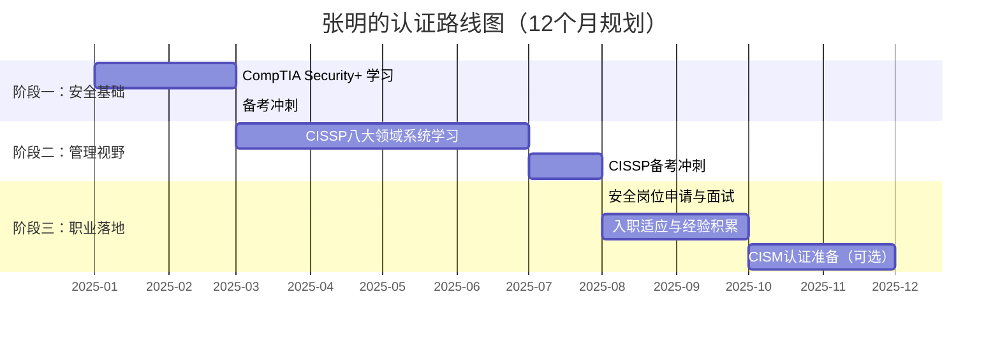

## 张明的认证路线图：从IT运维到安全管理者的12个月转型之路

### 案例背景

#### 主人公画像

张明，30岁，计算机科学专业本科毕业，拥有5年IT运维经验，就职于一家中型互联网企业。他所在的团队负责维护公司核心业务系统（日均处理100万+请求，涉及电商交易和用户数据），技术栈覆盖Linux服务器、MySQL数据库、Nginx反向代理和基础的Shell自动化脚本。

**认证前状态**：

| 维度 | 具体情况 |
|------|---------|
| 技术能力 | 熟悉Linux系统管理、网络基础配置、数据库日常维护，能独立排查80%以上的系统故障 |
| 安全知识 | 几乎为零——从未系统学习过安全框架、风险评估、合规要求，仅在运维过程中接触过防火墙规则配置和SSH密钥管理 |
| 英语水平 | 大学四级，能阅读基础英文技术文档，但专业术语阅读吃力，考试级英语是明显短板 |
| 可用学习时间 | 每天1.5小时（晚间21:00-22:30）+ 周末5小时（周六上午集中复习） |
| 职业目标 | 从运维工程师转型为安全管理岗位，期望在12个月内取得CISSP认证，实现职业跃迁 |
| 经济状况 | 月薪15K，所在城市为二线城市，认证费用需要自费，预算约5,000元 |

#### 转型动机

张明的转型动机来自三个层面的推动：

**第一层：职业天花板焦虑**。在IT运维岗位工作了5年后，张明发现自己已经触及了技术成长的天花板——日常运维工作高度重复，晋升通道狭窄（运维组只有2个高级岗位，已有同事占据）。他意识到，如果不主动转型，未来3-5年可能会陷入"有经验但无增长"的职业困境。

**第二层：安全意识的觉醒**。2024年夏天，公司发生了一起数据泄露事件：一名运维人员将包含用户手机号和订单信息的数据库备份文件误传到公共云存储桶（S3），虽然文件在2小时内被删除，但这次事件让整个运维团队意识到——**不懂安全的运维，是在裸奔**。张明主动申请参与了事后的安全整改，负责加固所有云存储桶的访问策略。这次经历让他深刻体会到安全知识的价值，也让他看到了转型的方向。

**第三层：行业趋势的牵引**。张明观察到，安全岗位在招聘市场上的需求持续增长，薪资水平普遍高于同级别的运维岗位。他在招聘网站上搜索"安全分析师"，发现起薪普遍在18K-25K之间，比他的运维岗位高出30%-60%。更重要的是，安全领域对"有运维背景+安全认证"的复合型人才需求旺盛——这正是张明可以构建的差异化优势。

#### SWOT分析

张明在制定认证计划前，先对自己的现状进行了系统的SWOT分析：

| 维度 | 内容 | 策略 |
|------|------|------|
| **优势（Strengths）** | 5年运维经验，对系统架构、网络协议、数据库有深刻理解；有项目管理经验（曾负责过一次系统迁移）；学习能力强（自学掌握了Shell和Python基础） | 将运维经验转化为安全学习的加速器——很多安全概念（如网络分段、访问控制）在运维中已经接触过 |
| **劣势（Weaknesses）** | 安全知识几乎为零；英语阅读能力偏弱；没有安全相关的项目经验；缺乏安全思维（习惯从可用性角度而非安全性角度思考问题） | 从最基础的Security+开始建立安全世界观；利用Anki强化英语术语记忆；在备考过程中主动寻找安全实践机会 |
| **机会（Opportunities）** | 公司正在组建安全团队，有内部转岗机会；行业对安全人才需求旺盛；CISSP认证在安全领域认可度极高 | 将CISSP认证作为内部转岗的"敲门砖"；利用公司学习基金报销认证费用 |
| **威胁（Threats）** | 安全领域竞争激烈，许多候选人已有多年安全经验；CISSP考试通过率低（约60%）；备考时间有限（每天仅1.5小时） | 以"运维+安全"的复合背景作为差异化定位；制定严格的学习计划确保每天的学习时间不被挤占 |

---

### 认证路线全景规划

张明的认证路线遵循"安全基础→管理视野→职业落地"的三阶递进模型，总规划周期为12个月：



#### 认证选择逻辑

张明的选择体现了"由浅入深、由技术到管理"的策略：

| 阶段 | 认证名称 | 选择理由 | 投入时间 | 费用 | 预期产出 |
|------|---------|---------|---------|------|---------|
| 一 | CompTIA Security+ | 零基础安全入门，覆盖网络安全全貌，为CISSP打基础 | 2.5个月 | $392 | 建立安全世界观，掌握安全基础术语和概念 |
| 二 | CISSP | 安全领域最权威的"黄金认证"，覆盖管理和技术两个层面 | 5个月 | $749 | 获得安全管理视野，满足安全岗位的核心认证要求 |
| 三（可选） | CISM | 聚焦信息安全治理，适合向安全经理方向发展 | 2个月 | $575 | 强化治理能力，为未来晋升安全经理做准备 |

**总预算**：约$1,141（约人民币8,200元），张明所在公司报销了全部认证费用，并提供每年$2,000的学习基金。

---

### 阶段一：安全基础构建（第1-3个月）

#### 目标：CompTIA Security+

**为什么从Security+开始而不是直接学CISSP？**

张明深知自己的安全知识几乎为零。CISSP虽然含金量高，但它是"管理者视角"的认证，要求考生具备5年安全相关工作经验（或4年+相关认证）。如果直接备考CISSP，张明会面临两个问题：

1. **知识断层**——CISSP假设考生已经具备安全基础概念，直接学习会因缺乏基础而事倍功半
2. **考试资格**——CISSP要求5年安全工作经验，张明没有，需要先考取Security+作为"前置认证"来缩短经验要求

Security+恰好解决了这两个问题：它覆盖了网络安全的6大核心领域，为张明搭建了一个完整的"安全世界观"，同时作为CISSP的前置认证，可以缩短CISSP的经验要求。

#### 学习框架

**Security+六大核心领域**：

| 领域 | 权重 | 核心知识点 | 张明的难点 | 应对策略 |
|------|------|-----------|-----------|---------|
| 威胁、攻击与漏洞 | 24% | 恶意软件、社会工程学、应用攻击、无线攻击、物理攻击 | 需要记忆大量攻击类型和名称 | 制作攻击类型分类表格，按"攻击目标"分组记忆 |
| 架构与设计 | 21% | 云计算安全、虚拟化、IoT安全、安全框架、零信任 | 云安全部分较抽象 | 结合自己的运维经验理解云安全概念 |
| 实施 | 25% | 身份与访问管理、PKI、加密技术、安全解决方案 | 加密算法数学概念较抽象 | 用"场景记忆法"——每种算法对应一个使用场景 |
| 运营与事件响应 | 16% | 取证、事件响应流程、业务连续性、灾难恢复 | 与运维经验结合较好，相对轻松 | 利用运维经验快速理解，重点记忆流程步骤 |
| 治理、风险与合规 | 14% | 法规、风险评估、业务连续性、审计 | 需要记忆大量法规名称和适用范围 | 制作法规对比表，按"行业+地域"分类 |

#### 备考策略

**每日学习计划**（张明的实际日程表）：

| 时间段 | 内容 | 时长 | 工具/资源 |
|--------|------|------|----------|
| 21:00-21:45 | 观看Professor Messer视频课程（1.5倍速） | 45分钟 | YouTube/官网 |
| 21:45-22:15 | 阅读官方教材对应章节 | 30分钟 | Sybex Security+ Study Guide |
| 22:15-22:30 | Anki复习（当日新学内容+旧内容） | 15分钟 | Anki牌组 |
| 周六上午 | 做一套模拟题+错题分析 | 2小时 | Jason Dion题库 |
| 周日下午 | 复习本周所有Anki卡片 | 1小时 | Anki |

**学习资源清单**：

| 资源类别 | 具体资源 | 价格 | 评分 | 点评 |
|---------|---------|------|------|------|
| 视频课程 | Professor Messer Security+免费课程 | 免费 | ★★★★★ | 内容精炼，每节15-20分钟，配套笔记PDF |
| 教材 | CompTIA Security+ Study Guide (Sybex, 第8版) | $49 | ★★★★☆ | 覆盖全面，每章有练习题，但部分案例偏陈旧 |
| 题库 | Jason Dion Security+模拟题包（6套） | $20 | ★★★★★ | 难度接近真题，题目解析详细，是备考核心工具 |
| 动手实验 | TryHackMe Security+路径 | $10/月 | ★★★★☆ | 在虚拟机中实操安全工具，弥补纯理论学习的不足 |
| 闪卡 | Anki预置Security+牌组（约800张） | 免费 | ★★★★☆ | 社区维护，覆盖高频考点，适合通勤时复习 |
| 辅助 | Security+思维导图（自制） | 免费 | ★★★★☆ | 将六大领域知识可视化，帮助建立知识框架 |

**错题管理方法**：张明建立了一个Excel错题本，记录每道错题的错误原因（知识点遗忘/理解偏差/陷阱选项/审题失误）。他发现自己的高频错误集中在：

1. **加密算法适用场景混淆**——对称加密（AES）、非对称加密（RSA）、哈希（SHA-256）的使用场景容易混淆
2. **法规适用范围不清**——GDPR（欧盟）、HIPAA（美国医疗）、PCI DSS（支付卡行业）、SOX（美国上市公司）的行业和地域界限
3. **风险评估术语混淆**——资产（Asset）、威胁（Threat）、脆弱性（Vulnerability）、风险（Risk）四个概念的关系

针对这三类问题，张明分别制作了对比表格和思维导图进行专项强化。例如，他用一张表格对比了三种加密算法：

| 算法类型 | 代表算法 | 速度 | 密钥管理 | 典型场景 |
|---------|---------|------|---------|---------|
| 对称加密 | AES、DES、3DES | 快 | 双方共享同一密钥，分发困难 | 大量数据加密（如数据库加密、文件加密） |
| 非对称加密 | RSA、ECC、Diffie-Hellman | 慢 | 公钥公开，私钥保密 | 密钥交换、数字签名、SSL/TLS握手 |
| 哈希算法 | SHA-256、MD5、SHA-1 | 快 | 无密钥（单向函数） | 数据完整性校验、密码存储 |

#### 考试细节

- **考试形式**：90分钟，最多90题（含2道PBQ性能题）
- **成绩**：820/900（通过分750）
- **总学习时间**：约100小时
- **一次通过**：是的

**考试当天经验**：

张明在考试当天采用了以下策略：

1. **先做选择题，后做PBQ**——PBQ（Performance-Based Questions）是最具挑战的部分，要求在实际模拟环境中配置安全设置。张明将PBQ留到最后30分钟集中处理，确保前面的选择题有充足时间。
2. **标记不确定的题目**——遇到不确定的题目，先标记，继续往下做，最后有时间再回来思考。
3. **利用运维经验**——PBQ中有一道关于防火墙规则配置的题，张明凭借运维经验快速完成，这是他"运维+安全"复合背景的优势体现。

**备考经验总结**：

- Security+考试不仅考察知识，还考察"安全思维"——很多题目要求从"最安全"的角度选择答案，而不是从"最实用"的角度
- 理解概念比死记硬背更重要——张明发现，凡是真正理解原理的知识点，无论题目怎么变化都能答对
- 模拟考试是检验准备程度的最佳方式——张明在正式考试前做了6套模拟题，成绩从65%提升到85%

---

### 阶段二：CISSP系统学习（第4-8个月）

#### 目标：CISSP（Certified Information Systems Security Professional）

CISSP是(ISC)²推出的信息安全领域最权威的认证，被誉为安全领域的"黄金认证"。它覆盖8大知识领域，要求考生具备"管理者视角"——不仅要懂技术，还要懂管理、法律、合规。

**为什么选择CISSP？**

张明的选择基于三个考量：

1. **行业认可度最高**——CISSP在全球安全领域认可度最高，是安全岗位的"硬通货"
2. **覆盖范围最广**——8大知识领域覆盖了安全的全貌，从技术到管理、从法律到运营
3. **职业门槛**——许多安全岗位（尤其是安全管理岗）明确要求CISSP认证

#### CISSP八大知识领域

| 领域 | 权重 | 核心内容 | 张明的准备策略 |
|------|------|---------|--------------|
| 安全与风险管理 | 15% | 风险管理流程、治理框架、合规要求 | 结合公司安全整改经验理解 |
| 资产安全 | 10% | 数据分类、数据保护、数据生命周期 | 利用运维中的数据库管理经验 |
| 安全架构与工程 | 14% | 安全框架、零信任、密码学、安全设计 | 重点突破，这是技术含量最高的领域 |
| 通信与网络安全 | 14% | 网络架构、网络攻击防护、无线安全 | 运维网络经验是优势 |
| 身份与访问管理 | 13% | IAM、身份生命周期、联邦身份 | 结合公司SSO系统理解 |
| 安全评估与测试 | 12% | 渗透测试、漏洞管理、安全评估 | 需要额外学习渗透测试基础 |
| 安全运营 | 13% | SOC、事件响应、取证、日志管理 | 运维经验可迁移 |
| 软件开发生命周期安全 | 9% | SDLC、DevSecOps、安全编码 | 需要补充开发安全知识 |

#### 备考策略

**周学习计划**（张明的实际日程表）：

| 星期 | 晚间学习（21:00-22:30） | 周末学习 |
|------|------------------------|---------|
| 周一 | 安全与风险管理（教材+视频） | |
| 周二 | 资产安全（教材+练习题） | |
| 周三 | 安全架构与工程（重点突破） | |
| 周四 | 通信与网络安全（教材+实验室） | |
| 周五 | 身份与访问管理（教材+实践） | |
| 周六 | 安全评估与测试 + 2小时模拟考 | 上午：模拟考试+错题分析 |
| 周日 | 安全运营 + 软件安全（复习） | 下午：Anki复习+知识梳理 |

**学习资源清单**：

| 资源类别 | 具体资源 | 价格 | 评分 | 点评 |
|---------|---------|------|------|------|
| 教材 | (ISC)² Official CISSP Study Guide (第4版) | $79 | ★★★★★ | 官方教材，覆盖全面，每章有练习题 |
| 视频 | Kelly Handerhan的CISSP视频课程 | $299 | ★★★★★ | 讲解生动，适合零基础学习者，配套笔记 |
| 题库 | CCCure练习题库（约3000题） | $99 | ★★★★☆ | 题目量大，但部分题目偏难，需要配合教材使用 |
| 题库 | CISSP官方练习题集 | $49 | ★★★★☆ | 题目质量高，但数量较少（约500题） |
| 闪卡 | Anki预置CISSP牌组（约1500张） | 免费 | ★★★★☆ | 社区维护，覆盖高频考点 |
| 辅助 | CISSP思维导图（自制） | 免费 | ★★★★★ | 将八大领域知识可视化，帮助建立知识框架 |

**遇到的困难与解决方案**：

| 困难 | 具体表现 | 解决方案 |
|------|---------|---------|
| 密码学难以理解 | 对称加密、非对称加密、哈希、数字签名的概念容易混淆 | 用"场景记忆法"——每种技术对应一个使用场景，制作对比表格 |
| 安全架构抽象 | 零信任、安全框架（如NIST CSF、ISO 27001）的概念较抽象 | 结合公司安全整改的实际案例理解，将抽象概念具象化 |
| 工作忙碌时难以保持学习节奏 | 项目上线期间连续2周无法保证每天1.5小时的学习时间 | 调整学习时间，利用早晨6:30-7:30和周末集中复习，确保每周总学习时间不低于10小时 |
| 模拟考试分数波动较大 | 模拟考成绩在60%-80%之间波动，影响信心 | 分析错题，重点复习薄弱环节，将模拟考作为"诊断工具"而非"考核工具" |

**CISSP备考核心技巧——"管理者思维"**：

CISSP考试的一个核心特点是考察"管理者思维"。张明在备考过程中发现，很多题目的正确答案不是"技术上最正确的"，而是"管理上最合理的"。例如：

> 题目：公司发现一个安全漏洞，应该怎么做？
> - A. 立即修复漏洞
> - B. 评估风险，根据业务影响决定修复优先级
> - C. 通知所有员工
> - D. 关闭相关系统

正确答案是B。因为从管理者的角度，修复漏洞需要评估风险、成本、业务影响，而不是盲目行动。张明将这个规律总结为"CISSP答题三原则"：

1. **先评估，再行动**——任何安全决策都应该先评估风险和影响
2. **业务优先**——安全是为业务服务的，不能为了安全而牺牲业务
3. **合规导向**——在不确定时，选择符合法规和标准的选项

#### 考试细节

- **考试形式**：150分钟，125题（自适应考试，难度根据答题情况动态调整）
- **成绩**：通过（CISSP只显示Pass/Fail，不公布具体分数）
- **总学习时间**：约200小时
- **一次通过**：是的

**考试当天经验**：

张明在CISSP考试当天采用了以下策略：

1. **合理分配时间**——125题150分钟，平均每题1分12秒。张明将时间分为三段：前60题（10分钟/题，仔细审题）、中间60题（1分钟/题，快速判断）、最后5题（5分钟/题，深度思考）
2. **标记不确定的题目**——遇到不确定的题目，先标记，继续往下做，最后有时间再回来思考
3. **保持冷静**——自适应考试的难度会根据答题情况动态调整，张明在考试中途发现题目难度明显上升，但他没有慌张，而是提醒自己"这说明前面的题答得不错"
4. **利用"管理者思维"**——每道题都从"管理者"的角度思考，而不是从"技术人员"的角度

---

### 阶段三：考试冲刺与职业落地（第9-12个月）

#### 全面复习策略

在CISSP考试前1个月，张明进入了全面复习阶段：

**每日复习计划**：

| 时间段 | 内容 | 时长 |
|--------|------|------|
| 21:00-21:30 | 快速浏览八大领域思维导图 | 30分钟 |
| 21:30-22:00 | 做一套模拟题（25题/套） | 30分钟 |
| 22:00-22:30 | 错题分析+知识点回溯 | 30分钟 |
| 周末 | 完整模拟考试（125题）+ 深度错题分析 | 3小时 |

**复习重点**：

张明根据模拟考的成绩分析，将复习重点集中在以下三个领域：

1. **安全架构与工程**（模拟考正确率65%）——重点复习密码学、零信任架构、安全框架
2. **软件开发生命周期安全**（模拟考正确率60%）——重点复习SDLC、DevSecOps、安全编码
3. **安全评估与测试**（模拟考正确率70%）——重点复习渗透测试方法论、漏洞管理流程

#### 职业发展

**角色转变**：IT运维工程师 → 安全分析师

**职位变化对比**：

| 维度 | 认证前 | 认证后（12个月） |
|------|-------|----------------|
| 职位 | IT运维工程师 | 安全分析师 |
| 薪资 | 月薪15K | 月薪20K（提升约33%） |
| 团队角色 | 一线运维执行 | 安全事件分析与响应 |
| 汇报对象 | 运维经理 | 安全经理 |
| 决策范围 | 执行层面的运维操作 | 安全事件调查与分析报告 |

**薪资回报率分析**：

认证总投入约$1,141（约人民币8,200元）+ 学习时间约300小时。按月薪提升5K计算，12个月内的薪资增量回报（60K）已完全覆盖认证投资，**ROI在2个月内已回本**。

**具体职业变化**：

1. **安全事件分析**——负责公司安全事件的调查、分析和报告，包括恶意软件事件、网络攻击事件、数据泄露事件
2. **安全监控**——负责SOC（安全运营中心）的7×24小时监控，使用SIEM工具（如Splunk、ELK）分析安全日志
3. **漏洞管理**——定期进行漏洞扫描和评估，编写漏洞修复报告
4. **安全培训**——为运维团队和开发团队提供安全意识培训（每季度1次）
5. **合规对标**——参与公司业务系统与等保2.0、ISO 27001的安全合规对标

---

### 经验总结与可复制方法论

#### 张明的认证成功公式

```text
成功 = 战略规划（25%）+ 系统学习（45%）+ 动手实践（15%）+ 持续坚持（15%）
```

#### 五大可复制经验

**1. 方向比速度重要**

张明花了2周时间做认证规划，而不是立刻开始学习。他先用SWOT分析自己的现状，再制定12个月的路线图。**大多数人失败不是因为学得慢，而是因为方向选错了**。

**2. "阶梯式学习法"**

```text
Security+（安全基础）  ← 建立安全世界观
    ↓
CISSP（管理视野）  ← 从管理者角度理解安全
    ↓
CISM（治理能力）  ← 向安全经理方向发展（可选）
```

这种"基础→管理→治理"的阶梯式学习，比直接考高级认证更扎实、更可持续。

**3. 从"运维思维"到"安全思维"的转变**

张明说："以前做运维，我的第一反应是'怎么让系统跑起来'。但考完Security+后，我开始问'这个系统安全吗？有没有潜在风险？'"——**知识框架建立后，思维方式会自然转变**。

**4. 时间管理：不追求完美，追求持续**

张明从不要求自己每天学习3小时（那不可持续），他只承诺"每天至少1.5小时"。周末可以补学习，工作日完成最低目标即可。**300天里他有超过280天完成了学习目标**，关键在于"低门槛坚持"而非"高强度冲刺"。

**5. 构建学习闭环**

```text
学新知识 → 做练习题 → 发现盲区 → 定向补充 → 做新题验证
```

张明的错题本不只是记录答案，而是记录"错误归因"。他发现大多数人只做"学习→做题→对答案"的前三步，缺少"归因→定向补充"的关键环节。

---

### 常见误区与教训

| 误区 | 具体表现 | 纠正方法 |
|------|---------|---------|
| 贪多求快 | 想同时备考Security+和CISSP | 聚焦一个，通过后再下一个 |
| 只做题不看书 | 刷1000题但是不理解原理 | 每道错题追溯回教材原文 |
| 只学不练 | 安全知识停留在理论 | 在虚拟机中搭建安全实验环境 |
| 忽视英语 | 依赖中文翻译资料 | 英文教材+英文模拟题（CISSP考试是英文的） |
| 闭门造车 | 一个人埋头苦学 | 加入备考群组，每周交流一次 |
| 死记硬背 | 背大量知识点但不理解 | 用"场景记忆法"和"管理者思维"理解概念 |

**张明的遗憾**：他承认自己在备考CISSP时太依赖官方教材，忽略了行业白皮书（如NIST CSF、ISO 27001标准原文），这些文档在考试中经常被引用。他建议在备考初期就通读这些核心文档。

---

### 给不同背景读者的建议

| 你的背景 | 推荐路线 | 说明 |
|---------|---------|------|
| 纯运维，无安全经验 | Security+ → CISSP → CISM | 和本案例路线一致，运维经验是优势 |
| 有安全基础，无管理经验 | Security+（速通）→ CISSP → CISM | 先补安全基础再考管理认证 |
| 学生/刚毕业 | Security+ → CEH → CISSP | 先建立安全基础，再考渗透测试认证 |
| 安全已有多年经验 | 直接CISSP（可免Security+） | 跳过后一层，只拿高级认证 |
| 开发背景，想转安全 | Security+ → CISSP → CSSLP | 增加软件安全认证（CSSLP） |

---

### 本章小结

张明的12个月认证之路，展示了一条从IT运维转型为安全分析师的**可复制路径**。这条路的本质不是"考取2个证书"，而是通过系统化的学习，在技术、管理和思维三个层面构建完整的安全能力。

**核心启示**：

- **认证不是终点**，而是知识体系化的手段——Security+建立了安全世界观，CISSP构建了管理视野
- **学习顺序决定效率**——基础→管理的递进不可跳级，跳过基础直接考高级认证往往事倍功半
- **运维经验是安全学习的加速器**——很多安全概念（如网络分段、访问控制、日志管理）在运维中已经接触过，善用已有经验可以大幅缩短学习曲线
- **坚持比天赋重要**——每天1.5小时，300天就是450小时的实质性进步，足以完成从零基础到CISSP的跨越

张明的路线并非唯一正确的路线，但其中的原则——**规划先行、由浅入深、理论与实践结合、运维经验迁移**——适用于每一个希望从运维转型为安全专业人才的人。

> **一句话总结**：认证规划不是排考试日程，而是设计能力成长的路线——让每一个认证解决一个具体的知识盲区，最终构建完整的职业竞争力。运维经验不是包袱，而是转型的加速器。