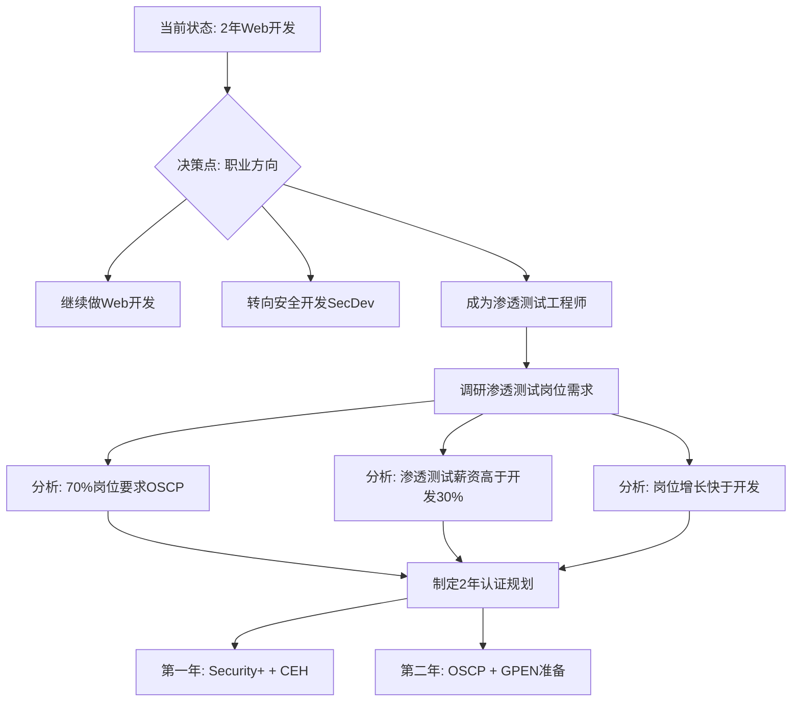
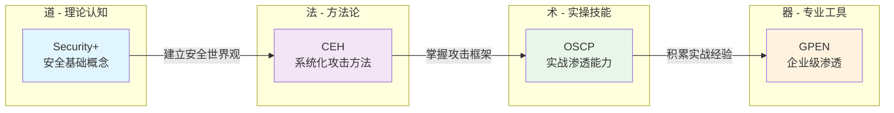
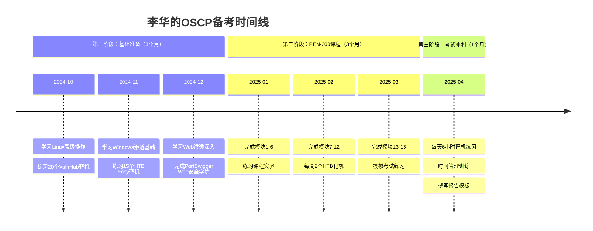
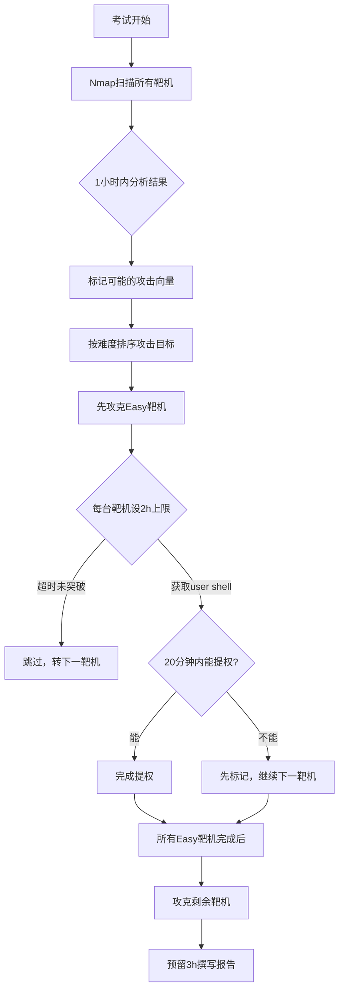
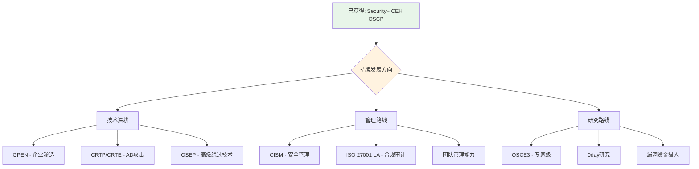

# 28.2 案例二：渗透测试认证之路

> **案例摘要**：本案例讲述信息安全专业毕业生李华，如何在2年内从Web开发转型为专业渗透测试工程师的真实历程。从CompTIA Security+入门，到CEH建立方法论，再到OSCP实战淬炼，最终拿到80分通过OSCP——期间经历了一次失败的惨痛教训。本案例将详细还原每一步的备考策略、时间分配、资源选择和心态调整，为立志从事渗透测试的读者提供一份可复制的成长蓝图。

---

## 28.2.1 背景介绍

### 主人公画像

| 维度 | 详情 |
|------|------|
| 姓名 | 李华（化名） |
| 年龄 | 25岁 |
| 学历 | 信息安全专业本科 |
| 工作经验 | 2年Web开发 |
| 技术栈 | HTML/CSS/JavaScript、Python、MySQL、基本Linux操作 |
| 安全基础 | 大学期间学过密码学和网络安全概论，但缺乏实战经验 |
| 目标 | 成为专业渗透测试工程师 |
| 时间规划 | 2年内建立完整的渗透测试认证体系 |

### 起点评估

李华的优势和劣势非常典型——他代表了大量从开发转向安全的从业者群体。

**核心优势：**
- **编程基础扎实**：2年Web开发经验让他对HTTP协议、数据库交互、应用架构有深入理解，这在Web渗透测试中是巨大优势
- **安全意识萌芽**：大学课程为他打下了理论基础，至少知道OWASP Top 10、SQL注入、XSS等概念
- **学习驱动力强**：对安全领域有浓厚兴趣，不是为了证书而考证
- **年龄优势**：25岁，精力充沛，试错成本低

**明显短板：**
- **实战经验几乎为零**：会写代码不等于会找漏洞，渗透测试需要逆向思维和攻击者视角
- **网络基础薄弱**：只了解基本的TCP/IP，对路由交换、防火墙策略理解不深
- **工具使用有限**：只用过基本的nmap扫描，对Metasploit、Burp Suite、Wireshark等专业工具不熟悉
- **缺乏攻击者思维**：开发思维是"怎么让系统工作"，渗透思维是"怎么让系统崩溃"

### 决策过程

李华在决定走渗透测试路线前，做了充分的调研：



李华参考了主流招聘平台上渗透测试岗位的JD（Job Description），发现以下规律：
- **初级岗位**（8-15K）：要求Security+或同等认证，熟悉常见漏洞和工具
- **中级岗位**（15-25K）：要求CEH或OSCP，有实战项目经验
- **高级岗位**（25-40K）：要求OSCP/GPEN，能独立完成渗透测试项目
- **专家岗位**（40K+）：要求OSCE/OSCE3或多个高级认证，能做0day研究

基于这个调研，他确定了"Security+ → CEH → OSCP → GPEN"的认证路线，并设定了2年时间窗口。

---

## 28.2.2 认证规划与路线图

### 整体路线图

```mermaid
gantt
    title 李华的2年渗透测试认证路线图
    dateFormat YYYY-MM
    axisFormat %Y-%m

    section 第一年
    Security+ 备考           :a1, 2024-01, 2024-02
    Security+ 考试           :milestone, a1end, 2024-02
    CEH 备考                 :a2, after a1, 2024-05
    CEH 考试                 :milestone, a2end, 2024-05
    OSCP 基础准备            :a3, after a2, 2024-09

    section 第二年
    PEN-200 课程学习          :b1, 2024-10, 2025-03
    OSCP 考试冲刺            :b2, after b1, 2025-04
    OSCP 首考失败            :milestone, b2end, 2025-04
    强化训练                  :b3, 2025-05, 2025-07
    OSCP 二战通过            :milestone, b3end, 2025-07
    GPEN 备考                :b4, after b3, 2025-12
```

### 各认证定位分析

李华选择的认证组合并非随意堆砌，而是有明确的功能定位：

| 认证 | 定位 | 核心价值 | 备考周期 | 预算 |
|------|------|---------|---------|------|
| CompTIA Security+ | 入门通行证 | 建立安全知识体系，满足初级岗位门槛 | 1-2个月 | ¥2,500 |
| CEH | 方法论框架 | 系统化学习攻击技术，掌握行业通用术语 | 2-3个月 | ¥12,000 |
| OSCP | 实战硬实力 | 证明独立渗透测试能力，行业最高含金量 | 6-9个月 | ¥15,000 |
| GPEN | 专业进阶 | 深化企业级渗透测试方法，管理岗位加分 | 3-4个月 | ¥15,000 |

**总计投入**：约¥45,000（考试费+培训费），时间约24个月。

### 认证路线的逻辑



---

## 28.2.3 备考过程详解

### 28.2.3.1 Security+ 备考（1个月）

**为什么从Security+开始？**

很多人质疑：信息安全本科毕业，为什么还要考入门级的Security+？李华的理由很务实：
1. **快速建立信心**：Security+相对简单，可以快速拿到第一个认证，为后续备考建立节奏感
2. **补齐知识盲区**：大学课程偏理论，Security+覆盖了实际工作中需要的安全管理和合规知识
3. **满足岗位门槛**：很多安全岗位的最低要求就是Security+或同等认证
4. **适应考试模式**：为后续更高难度的认证考试积累应试经验

**备考策略：**

| 阶段 | 时间 | 内容 | 产出 |
|------|------|------|------|
| 通读教材 | 第1-2周 | 完整阅读《CompTIA Security+ Study Guide》 | 标记重点和难点 |
| 专题突破 | 第3周 | 针对弱项（风险评估、合规框架）深入学习 | 完成知识卡片 |
| 模拟考试 | 第4周前半 | 每天1套模拟题，分析错题 | 错题集 |
| 查漏补缺 | 第4周后半 | 回顾错题，复习高频考点 | 最终复习笔记 |

**具体学习资源：**
- 教材：CompTIA Security+ Study Guide (SY0-701)
- 视频：Professor Messer的Security+系列（YouTube免费）
- 练习题：CompTIA CertMaster Practice
- 实验：TryHackMe的Security+学习路径

**考试结果：**
- 备考时间：1个月（每天3小时，周末6小时）
- 考试分数：850/900（通过线750）
- 评价：难度适中，对于有安全专业背景的考生来说，1个月足够

**关键经验：**
- Security+考试偏重概念理解而非实操，适合先考
- 风险管理和合规相关内容占比约25%，不容忽视
- 模拟题非常重要，真实考试的题型和难度与模拟题高度一致

---

### 28.2.3.2 CEH 备考（2个月）

**为什么选CEH？**

CEH（Certified Ethical Hacker）是渗透测试方向最广泛认可的入门级认证之一。虽然社区对CEH的实操性有争议（"CEH教你理论，OSCP教你实战"），但李华认为CEH在以下方面有独特价值：
1. **建立完整的攻击方法论**：CEH按照攻击链（Kill Chain）系统梳理了各阶段的攻击技术
2. **行业通用语言**：很多企业和甲方客户使用CEH作为评估标准
3. **工具全景图**：覆盖了渗透测试中可能用到的所有工具类别
4. **法律合规框架**：详细讲解了渗透测试的法律边界和授权流程

**备考策略：**

CEH的备考与Security+有本质区别——CEH覆盖面极广（20个模块），但每个模块的深度有限。备考的关键是"广度优先，重点深入"。

**20个核心模块及权重分析：**

| 模块 | 内容 | 权重 | 备考重点 |
|------|------|------|---------|
| 01 反映射与侦查 | 信息收集技术 | 高 | Google Hacking、子域名枚举 |
| 02 扫描网络 | 网络扫描工具 | 中 | Nmap高级用法 |
| 03 枚举技术 | 资源枚举 | 高 | SMB枚举、SNMP枚举 |
| 04 系统漏洞 | 漏洞扫描与分析 | 高 | Nessus、OpenVAS |
| 05 系统漏洞 | 漏洞利用 | 高 | Metasploit框架 |
| 06 恶意软件 | 木马/蠕虫/勒索软件 | 中 | 恶意软件分析基础 |
| 07 社会工程学 | 人因攻击 | 中 | 钓鱼、 pretexting |
| 08 流量分析 | 网络嗅探 | 中 | Wireshark过滤语法 |
| 09 Web服务器 | 服务器漏洞 | 高 | Apache/IIS配置缺陷 |
| 10 Web应用漏洞 | Web攻击 | 最高 | OWASP Top 10全覆盖 |
| 11 SQL注入 | 数据库攻击 | 最高 | 手工注入和SQLMap |
| 12 无线网络 | 无线攻击 | 低 | WPA2破解基础 |
| 13 移动平台 | 移动安全 | 低 | Android/iOS基础 |
| 14 IoT安全 | 物联网安全 | 低 | 常见IoT漏洞 |
| 15 云安全 | 云环境攻击 | 中 | AWS/Azure常见配置错误 |
| 16 加密技术 | 密码学应用 | 低 | 常见加密算法弱点 |
| 17-20 | 杂项 | 低 | 考前浏览即可 |

**时间分配策略：**

```text
第1-2周：模块01-05（网络层攻击）
  - 每天学习1个模块
  - 每周完成1个HTB靶机巩固
  - 做完模块03后练习Nmap完整扫描流程

第3-4周：模块09-11（Web层攻击）← 最重要的部分
  - Web相关模块占CEH考试30%以上
  - 每个模块花3天深入学习
  - 搭建DVWA和WebGoat本地靶场练习

第5-6周：模块06-08, 12-16（杂项模块）
  - 快速浏览，抓重点
  - 社会工程学模块重点关注案例
  - 云安全模块关注AWS常见配置错误

第7周：模块17-20 + 全面复习
  - 快速浏览剩余模块
  - 刷题库（至少500题）
  - 查漏补缺

第8周：考前冲刺
  - 每天2套模拟题
  - 复习错题本
  - 重点记忆法律合规相关知识点
```

**考试结果：**
- 备考时间：2个月
- 考试形式：125道选择题，4小时
- 考试分数：未公布具体分数（CEH只显示通过/未通过）
- 评价：选择题考试，难度适中，但知识点覆盖面广，需要扎实的基础

**关键经验：**
- CEH考试的陷阱题很多，要注意题干中的关键词（"最佳"、"最有效"、"首先"）
- 法律和合规相关题目容易被忽视，但占比约15%
- 考前一周集中刷题效果最好
- CEH的iLabs实验环境非常有用，建议至少完成80%的实验

---

### 28.2.3.3 OSCP 备考（6-9个月）

**为什么OSCP是终极目标？**

在渗透测试领域，OSCP（Offensive Security Certified Professional）被称为"渗透测试认证的黄金标准"。它与Security+和CEH的本质区别在于：

| 对比维度 | Security+ | CEH | OSCP |
|---------|-----------|-----|------|
| 考试形式 | 选择题 | 选择题 | 24小时实战 |
| 实操要求 | 无 | iLabs | 独立渗透5台靶机 |
| 通过标准 | 750/900 | 及格线 | 70/100分 |
| 有效期 | 3年 | 3年 | 3年 |
| 行业认可度 | 入门级 | 中等 | 极高 |
| 薪资溢价 | 5-10% | 10-15% | 20-30% |
| 备考周期 | 1-2个月 | 2-3个月 | 6-12个月 |

**PEN-200课程体系：**

OSCP考试需要先完成Offensive Security的PEN-200培训课程。2024年更新后的PEN-200课程包含：

```text
模块1：渗透测试基础
  ├── 什么是渗透测试
  ├── 渗透测试方法论
  ├── 道德与法律考量
  └── 报告撰写

模块2：范围界定与漏洞识别
  ├── 客户交互
  ├── 信息收集
  └── 漏洞扫描

模块3：漏洞利用
  ├── 公开漏洞利用
  ├── 定制利用
  └── 后渗透

模块4：后渗透
  ├── 权限提升
  ├── 横向移动
  ├── 持久化
  └── 数据提取

模块5：报告撰写
  ├── 报告结构
  ├── 发现记录
  └── 修复建议

模块6：Kali Linux简介
  ├── 工具概览
  └── 自定义工具链

模块7：被动信息收集
  ├── OSINT技术
  └── 子域名枚举

模块8：主动信息收集
  ├── Nmap深度使用
  └── 服务枚举

模块9：渗透Web服务器
  ├── Web应用漏洞
  ├── SQL注入
  └── 文件包含

模块10：渗透Windows
  ├── Windows攻击面
  ├── 本地提权
  └── AD攻击基础

模块11：渗透Linux
  ├── Linux提权
  ├── SUID/SGID滥用
  └── 内核漏洞

模块12：渗透客户端
  ├── 恶意宏
  └── 反弹Shell

模块13：密码攻击
  ├── 在线攻击
  ├── 离线破解
  └── 密码喷洒

模块14：端口转发与隧道
  ├── 本地端口转发
  ├── 远程端口转发
  └── SSH隧道

模块15：活动目录渗透
  ├── AD枚举
  ├── AD攻击
  └── Kerberos攻击

模块16：Kali Purple
  ├── 蓝队工具
  └── 攻防演练
```

**OSCP备考时间线：**



**核心备考资源：**

| 资源类型 | 具体内容 | 用途 | 优先级 |
|---------|---------|------|--------|
| 课程 | PEN-200官方课程 | 必须完成 | ★★★★★ |
| 靶场 | Hack The Box | 实战练习 | ★★★★★ |
| 靶场 | TryHackMe OSCP路径 | 辅助练习 | ★★★★☆ |
| 靶场 | Proving Grounds | 模拟考试 | ★★★★★ |
| 工具 | Kali Linux | 渗透平台 | ★★★★★ |
| 工具 | Burp Suite Pro | Web渗透 | ★★★★☆ |
| 工具 | Metasploit Framework | 漏洞利用 | ★★★★☆ |
| 参考 | GTFOBins | Linux提权 | ★★★★★ |
| 参考 | LOLBAS | Windows提权 | ★★★★★ |
| 参考 | PayloadsAllTheThings | Payload库 | ★★★★☆ |
| 视频 | IppSec的HTB解说 | 学习思路 | ★★★★★ |
| 社区 | r/oscp (Reddit) | 经验交流 | ★★★★☆ |

---

## 28.2.4 OSCP首考经历——失败的教训

### 考试环境

OSCP考试是一个24小时的实战考核，考试环境如下：

| 参数 | 详情 |
|------|------|
| 考试时长 | 24小时（连续） |
| 靶机数量 | 5台（2台20分 + 2台20分 + 1台25分 + 1台15分 bonus） |
| 通过分数线 | 70/100分 |
| 允许使用的工具 | Kali Linux预装工具 + Metasploit（限1台靶机） |
| 提交物 | 渗透测试报告 + 证据截图 |

### 24小时考试实录

**第1-4小时：第一台靶机（20分）——顺利**

```text
00:00 - 开始Nmap全端口扫描
00:05 - 发现80端口开放，Apache httpd
00:10 - 访问Web页面，发现WordPress
00:15 - 使用WPScan枚举插件和用户
00:30 - 发现存在已知漏洞的插件版本
01:00 - 利用漏洞获取web服务器shell
02:00 - 开始提权，发现内核版本存在漏洞
03:00 - 编译内核exploit，提权到root
03:30 - 获取flag，完成第一台靶机
```

**第5-8小时：第二台靶机（20分）——顺利**

```text
05:00 - Nmap扫描，发现多个开放端口
05:15 - 发现SMB服务，使用smbclient枚举
05:45 - 找到一个可读的共享目录
06:00 - 在共享目录中发现备份文件
06:30 - 解密备份文件，获取数据库凭证
07:00 - 利用凭证登录，发现命令执行漏洞
07:30 - 通过命令执行获取shell
08:00 - 使用LinPEAS发现SUID提权向量
08:30 - 提权成功，获取flag
```

**第9-12小时：第三台靶机（20分）——顺利**

```text
09:00 - Nmap扫描，发现HTTP和SSH
09:15 - Web应用存在登录页面
09:30 - 测试SQL注入，发现union-based注入
10:00 - 通过SQL注入获取管理员凭证哈希
10:30 - 离线破解哈希，获取明文密码
11:00 - 使用管理员凭证登录Web应用
11:15 - 发现文件上传功能，上传反弹shell
11:30 - 获取shell，开始提权
12:00 - 通过Sudo提权到root
12:30 - 获取flag
```

**第13-16小时：第四台靶机（25分）——困难**

```text
13:00 - Nmap扫描，端口较少
13:15 - 发现自定义Web应用
13:30 - 开始手动测试各种漏洞
14:30 - 尝试SQL注入，无效
15:00 - 尝试文件包含，无效
15:30 - 尝试命令注入，无效
16:00 - 发现一个可疑的API端点
```

**第17-20小时：继续攻坚——部分成功**

```text
17:00 - 深入分析API端点
18:00 - 发现API存在IDOR漏洞
18:30 - 利用IDOR获取敏感信息
19:00 - 发现了一个低权限shell
19:30 - 开始尝试提权
20:00 - 尝试了多种提权方法均失败
20:30 - 决定放弃提权，先写报告
```

**第21-24小时：撰写报告**

```text
21:00 - 开始整理所有发现
22:00 - 撰写渗透测试报告
23:00 - 检查截图和证据
23:30 - 提交报告
```

### 得分与失分分析

| 靶机 | 预期得分 | 实际得分 | 状态 | 分析 |
|------|---------|---------|------|------|
| 靶机1（20分） | 20 | 20 | ✅ root | 利用WordPress插件漏洞+内核提权 |
| 靶机2（20分） | 20 | 20 | ✅ root | SMB枚举+数据库凭证泄露+提权 |
| 靶机3（20分） | 20 | 20 | ✅ root | SQL注入+文件上传+提权 |
| 靶机4（25分） | 25 | 0 | ❌ 未通过 | IDOR发现但未能提权，未提交部分分 |
| 靶机5 bonus（15分） | 15 | 0 | ❌ 未尝试 | 时间耗尽 |
| **合计** | **100** | **60** | **❌ 未通过** | 差10分 |

### 失败原因深度分析

李华在考后反思中总结了五个核心失败原因：

**1. 时间管理失控**

这是最致命的问题。李华在第四台靶机上耗费了过多时间（7小时），而只拿到了0分。合理的做法是：
- 每台靶机设置最大时间预算（按分值比例分配）
- 如果2小时内没有实质性进展，应该先跳过
- 优先完成能拿分的靶机，最后攻克难题

**2. 提权知识储备不足**

在前三台靶机中，提权都相对简单（内核漏洞、SUID、Sudo配置错误）。但第四台靶机的提权需要更高级的技巧（可能涉及Windows AD攻击或自定义提权脚本），李华在这方面的练习不够。

**3. 缺乏"先拿分"的策略**

OSCP考试是"得分制"而非"通关制"——你不需要攻破所有靶机。李华如果在第四台靶机上只拿到user-level shell就放弃提权，转而攻克第五台bonus靶机，可能就能达到70分。

**4. 报告撰写效率低**

用了3小时写报告，其中1小时是重复检查。如果提前准备好报告模板，这个过程可以压缩到1.5小时以内。

**5. 心态管理不足**

在第四台靶机受挫后，李华出现了明显的焦虑情绪，影响了后续的判断力和执行力。在24小时的考试中，心态管理是核心能力之一。

---

## 28.2.5 失败后的调整与二次备考

### 问题诊断矩阵

李华没有简单地"再做一遍"，而是系统性地分析了自己的短板：

| 短板领域 | 严重程度 | 改进方案 | 预期时间 |
|---------|---------|---------|---------|
| 提权技术 | 高 | 专项练习30+提权场景 | 2周 |
| 时间管理 | 高 | 模拟考试中训练分配 | 每次练习 |
| Windows AD攻击 | 高 | 完成BloodHound+AD靶场 | 3周 |
| 报告效率 | 中 | 准备模板+快速截图脚本 | 1周 |
| 心态管理 | 中 | 建立"跳过→回来"机制 | 持续 |
| 高级漏洞利用 | 中 | 练习PwnCollege+OverTheWire | 3周 |

### 强化训练计划

**第1-2周：提权专项训练**

```bash
# Linux提权练习清单
# 来源：GTFOBins + TGSecurity提权清单

# SUID提权
find / -perm -u=s -type f 2>/dev/null  # 查找SUID文件
# 练习：至少完成20个GTFOBins的SUID提权案例

# 内核漏洞提权
# 练习：Linux Exploit Suggester工具使用

# Sudo提权
sudo -l  # 检查sudo权限
# 练习：Sudo Killer工具 + 手动分析

# Cron提权
cat /etc/crontab  # 检查cron任务
# 练习：cron路径劫持、文件权限利用

# Capabilities提权
getcap -r / 2>/dev/null  # 检查capabilities
# 练习：cap_sh、python等能力提权
```

**第3-4周：Windows AD攻击训练**

```bash
# AD攻击练习环境搭建
# 使用Vulnerable-AD PowerShell脚本搭建本地AD靶场

# 核心技能练习
# 1. LDAP枚举（ldapsearch）
# 2. BloodHound数据收集（SharpHound）
# 3. Kerberoasting（GetUserSPNs.py）
# 4. AS-REP Roasting（GetNPUsers.py）
# 5. Pass the Hash（psexec.py）
# 6. Golden Ticket / Silver Ticket
```

**第5-6周：模拟考试**

使用Offensive Security的Proving Grounds进行模拟考试：
- 每周1次完整模拟（24小时，严格计时）
- 每次模拟后复盘时间分配
- 练习"先拿分再攻坚"的策略

**报告模板优化：**

```markdown
# 渗透测试报告模板（OSCP格式）

## 1. 执行摘要
- 测试范围
- 测试时间
- 关键发现总结

## 2. 方法论
- 使用的工具和技术
- 测试范围说明

## 3. 发现
### 3.1 [靶机名称]
- 漏洞描述
- 影响分析
- 复现步骤（含截图）
- 修复建议

## 4. 风险评级
| 漏洞 | 严重程度 | CVSS |
|------|---------|------|
| ... | 高/中/低 | x.x |

## 5. 修复建议
- 短期修复
- 长期改进

## 附录
- 工具列表
- 完整日志
```

### 二次考试经历

经过3个月的强化训练，李华再次参加OSCP考试：

**考试策略调整：**



**考试结果对比：**

| 项目 | 首考 | 二战 |
|------|------|------|
| 开始时间 | 09:00 | 09:00 |
| 首台靶机完成 | 03:30 | 02:15 |
| 全部靶机处理完 | 20:30 | 18:00 |
| 报告提交 | 23:30 | 20:00 |
| 完成靶机数 | 3/5 | 4/5 |
| 得分 | 60/100 | 80/100 |
| 结果 | ❌ 未通过 | ✅ 通过 |

**关键改进：**
- 时间分配更合理，每台靶机严格控制时间
- 提权速度提升（从平均2小时缩短到45分钟）
- 报告撰写从3小时压缩到2小时
- 心态更稳定，遇到困难能果断跳过

---

## 28.2.6 认证后的职业发展

### 职业变化

拿到OSCP认证后，李华的职业轨迹发生了显著变化：

**求职阶段（拿证后1个月内）：**
- 投递简历15家，收到面试邀请8家
- 面试通过率：5/8（62.5%）
- 最终选择了某互联网安全公司的渗透测试工程师岗位

**薪资对比：**

| 时间节点 | 职位 | 月薪 | 备注 |
|---------|------|------|------|
| 拿证前 | Web开发工程师 | 12K | 2年经验 |
| 拿证后 | 渗透测试工程师 | 18K | 含OSCP溢价 |
| 1年后 | 高级渗透测试工程师 | 25K | 项目经验积累 |
| 2年后 | 渗透测试技术负责人 | 35K | 团队管理 |

**技能溢价分析：**
- OSCP认证带来的直接薪资提升：+50%（12K→18K）
- 1年项目经验后的薪资增长：+39%（18K→25K）
- 转管理后：+40%（25K→35K）

### 日常工作内容

作为渗透测试工程师，李华的日常工作包括：

1. **外部渗透测试项目**（占比40%）：为客户系统做安全评估
2. **内部安全审计**（占比30%）：审查公司自有系统的安全状况
3. **应急响应支持**（占比15%）：协助处理安全事件
4. **安全工具开发**（占比10%）：编写自动化渗透测试脚本
5. **技术分享与培训**（占比5%）：给团队做技术分享

### 持续学习计划



**短期目标（1年内）：**
- 考取GPEN认证
- 积累50+渗透测试项目经验
- 在安全社区发布3篇技术博客

**中期目标（2-3年）：**
- 考取CRTP（Certified Red Team Professional）
- 开始参与Bug Bounty项目
- 建立个人技术品牌

**长期目标（5年）：**
- 成为安全团队负责人
- 考取OSCE3（专家级认证）
- 发表原创安全研究成果

---

## 28.2.7 关键经验总结

### 认证选择建议

基于李华的亲身经历，以下是渗透测试方向的认证选择建议：

| 阶段 | 推荐认证 | 前置条件 | 预算 | 备考周期 |
|------|---------|---------|------|---------|
| 入门期 | Security+ | 无 | ¥2,500 | 1-2个月 |
| 成长期 | CEH | Security+或同等 | ¥12,000 | 2-3个月 |
| 成熟期 | OSCP | 1年以上安全经验 | ¥15,000 | 6-12个月 |
| 进阶期 | GPEN/CRTP | OSCP | ¥15,000 | 3-4个月 |
| 专家期 | OSCE3 | 多年经验 | ¥25,000+ | 12个月+ |

### 备考核心原则

**1. 实操优先，理论为辅**

渗透测试是实践性极强的技能。单纯背诵知识点无法通过OSCP——你需要真正动手打靶。建议学习时间分配：
- 30% 理论学习（课程、文档、博客）
- 70% 实操练习（靶场、CTF、项目）

**2. 建立个人知识库**

李华在备考过程中使用Notion建立了个人知识库，记录每道靶机的解题思路：
- 靶机名称和难度
- 攻击路径和时间线
- 用到的工具和技术
- 遇到的坑和解决方案
- 可复用的Payload和脚本

**3. 时间管理是核心竞争力**

OSCP考试是24小时的马拉松。在模拟考试中就要练习时间管理：
- 每台靶机设置最大时间预算
- 建立"跳过→回来"的机制
- 预留足够的报告撰写时间
- 保持规律的作息（不要通宵）

**4. 心态管理不可忽视**

渗透测试考试中，挫败感是常态。李华的经验：
- 感到卡住时，离开电脑走10分钟
- 使用"番茄工作法"保持专注
- 和备考社区交流，获取动力
- 记住：即使考试失败，学到的技能不会消失

**5. 报告是得分的关键**

很多人把90%的精力放在攻破靶机上，忽略了报告。但OSCP的评分标准是"发现+报告"，一份清晰的报告可以弥补技术上的不足：
- 提前准备报告模板
- 攻击过程中随时截图
- 用清晰的步骤描述复现过程
- 为每个发现提供修复建议

### 常见误区与纠正

| 误区 | 纠正方法 |
|------|---------|
| "Security+太简单，不值得考" | Security+是建立信心和知识体系的重要起点 |
| "CEH只是选择题，没有实战价值" | CEH提供了完整的攻击方法论框架，是后续实操的基础 |
| "OSCP必须一次通过" | 首考失败是常见现象，关键是分析原因并针对性改进 |
| "刷题就够了" | 渗透测试需要的是解决问题的能力，不是记忆能力 |
| "工具用得越多越好" | 精通核心工具（Nmap、Burp、Metasploit）比广泛但浅尝辄止更有价值 |
| "只要技术好就能找到好工作" | 沟通能力、报告撰写、项目管理同样重要 |
| "认证越多越好" | 质量比数量重要，一个OSCP的价值超过五个入门级认证 |

---

## 28.2.8 给后来者的建议

### 给Web开发转型者的建议

李华的经历证明，Web开发经验是渗透测试的巨大优势。但要注意：
1. **转换思维模式**：从"怎么让系统工作"转变为"怎么让系统崩溃"
2. **补充网络知识**：开发者的网络知识通常不够深入，需要系统学习TCP/IP和路由交换
3. **学习逆向思维**：开发是正向构建，渗透是逆向分析
4. **发挥编程优势**：你的编程能力可以用来编写自动化渗透工具和自定义exploit

### 给在校学生的建议

如果你是信息安全专业的在校学生：
1. **尽早开始实战**：不要等到毕业才开始打靶，大二就可以开始HTB/THM
2. **参加CTF比赛**：CTF是锻炼渗透测试能力的最佳途径
3. **建立技术博客**：记录你的学习过程，这本身就是最好的简历
4. **争取实习机会**：在安全公司实习3个月，胜过自学1年

### 给在职转型者的建议

如果你已经在IT行业工作，想转型渗透测试：
1. **不要裸辞**：安全认证的备考需要持续投入，稳定的收入很重要
2. **利用现有技能**：运维经验→系统安全，开发经验→Web安全，网络经验→网络安全
3. **碎片化学习**：工作日每天2小时，周末每天6小时，2年内完全可以完成认证
4. **找一个学习伙伴**：和志同道合的人一起学习，互相督促和讨论

---

> **本节小结**：李华的渗透测试认证之路展示了从Web开发转型为专业渗透测试工程师的完整过程。他的经历告诉我们：认证不是终点，而是能力证明的起点。Security+建立基础，CEH构建方法论，OSCP淬炼实战能力——三者缺一不可。更重要的是，从失败中学习、持续改进的能力，才是成为优秀渗透测试工程师的关键。记住，OSCP只是一张入场券，真正的安全高手是在无数次实战中成长起来的。
