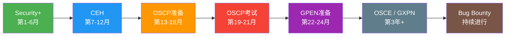
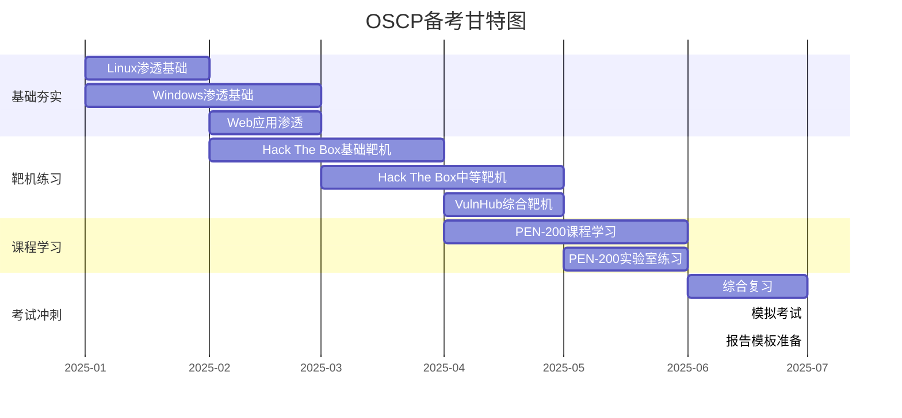
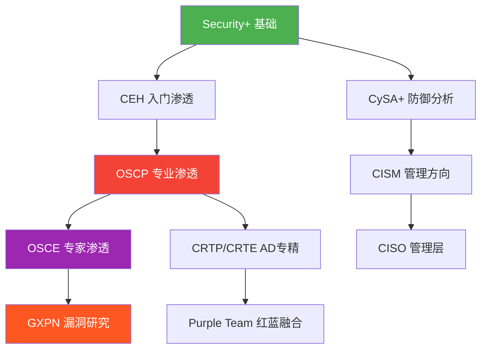

## 李华的认证路线图

李华是一位25岁的信息安全专业本科毕业生，拥有2年Web开发经验。他立志在2年内建立起从基础到专业的渗透测试认证体系，实现从Web开发到专业渗透测试工程师的职业转型。以下是他完整的认证路线图、备考过程和职业发展历程，为有类似背景的读者提供详实的参考。

## 一、认证路线总览



| 阶段 | 时间 | 认证 | 费用预算 | 难度 |
|------|------|------|----------|------|
| 第一年上半年 | 第1-6月 | CompTIA Security+ | ¥3,500 | ★★☆☆☆ |
| 第一年下半年 | 第7-12月 | CEH (Certified Ethical Hacker) | ¥8,000 | ★★★☆☆ |
| 第二年上半年 | 第13-18月 | OSCP备考（PEN-200课程） | ¥15,000 | ★★★★☆ |
| 第二年年中 | 第19-21月 | OSCP考试 | 含在上方 | ★★★★★ |
| 第二年下半年 | 第22-24月 | GPEN准备 | ¥12,000 | ★★★★☆ |
| 第三年及以后 | 长期 | OSCE / GXPN / Bug Bounty | 视认证而定 | ★★★★★ |

> **费用说明**：以上费用包含培训课程、考试费和学习资源，未包含日常练习靶机订阅（约¥200/月）。实际费用因地区和渠道不同可能有所浮动。国内考生可通过EC-Council授权培训机构参加CEH培训，费用通常包含在培训包中。

## 二、第一年：基础建设期

### 2.1 Security+（第1-6月）

**选择理由**：

Security+是CompTIA推出的全球公认的入门级安全认证，由美国国防部认可，符合ISO 17024标准。对于信息安全专业出身的李华来说，这张认证是建立系统化安全知识框架的第一步，也是后续所有高级认证的基石。

**备考详情**：

- **备考时间**：1个月（利用业余时间，每天2-3小时）
- **总学习时长**：约80-90小时
- **核心资源**：
  - 官方教材《CompTIA Security+ Study Guide (SY0-701)》
  - Professor Messer的免费视频课程（YouTube/Bilibili）
  - CertMaster练习平台
  - Darril Gibson的《Get Certified Get Ahead》辅助教材

**知识体系覆盖**：

| 域 | 占比 | 关键知识点 | 李华的掌握情况 |
|----|------|-----------|---------------|
| 安全运营 | 28% | 事件响应、数字取证、安全监控 | ★★★★☆ 基础扎实 |
| 威胁与漏洞 | 22% | 常见攻击类型、漏洞分析、社工 | ★★★★★ 专业强项 |
| 安全架构 | 19% | 网络架构、云安全、密码学 | ★★★☆☆ 需强化云安全 |
| 安全程序管理 | 16% | 风险管理、合规、治理 | ★★★☆☆ 缺乏实战经验 |
| 数据保护 | 15% | 加密、数据分类、隐私 | ★★★☆☆ 理论为主 |

**学习策略**：

李华发现，虽然信息安全专业学过大部分Security+的知识点，但考试侧重的是"安全思维"而非纯技术。他采用了以下策略：

1. **先做模拟题摸底**：第一周完成一套完整模拟题，正确率约65%，识别出安全架构和程序管理两个薄弱域
2. **分域攻克**：按照"威胁漏洞→安全运营→数据保护→安全架构→程序管理"的顺序，由强到弱推进
3. **间隔重复**：使用Anki制作闪卡，每天复习前一天和一周前的知识点
4. **考前冲刺**：最后一周每天做2套模拟题，重点复习错误题

**考试结果**：

- 成绩：850/900（通过线750）
- 用时：1小时20分钟（总时限90分钟）
- 备考投入：约¥1,500（教材+CertMaster）

**经验总结**：

Security+的知识面很广但不深，适合快速建立安全知识全景图。对于有专业背景的考生，重点不在于"学新知识"，而在于"用安全的视角重新审视已有知识"。李华最大的收获是建立了风险评估的思维模式——在后续的渗透测试中，这种"先评估风险再动手"的思路让他避免了很多低级错误。

### 2.2 CEH（第7-12月）

**选择理由**：

CEH（Certified Ethical Hacker）由EC-Council颁发，是全球最广泛认可的渗透测试入门认证。相比Security+偏防御视角，CEH转向攻击视角，覆盖了渗透测试的完整方法论和工具链。这张认证帮助李华完成了从"知道漏洞是什么"到"知道怎么找到和利用漏洞"的认知转变。

**备考详情**：

- **备考时间**：2个月（每天3-4小时）
- **总学习时长**：约160-180小时
- **核心资源**：
  - EC-Council官方培训课程（iLabs在线实验平台）
  - 官方教材《Certified Ethical Hacker v13》
  - Matt Walker的《CEH All-in-One Exam Guide》
  - Hack The Box基础靶机练习（配合认证内容）

**知识体系覆盖**：

| 模块 | 核心内容 | 学习重点 |
|------|----------|----------|
| 信息收集与侦查 | OSINT、网络扫描、枚举 | Nmap、Maltego、Recon-ng |
| 系统漏洞分析 | 扫描工具、漏洞评估 | Nessus、OpenVAS、Nikto |
| 网络攻击 | 中间人、DoS、会话劫持 | Ettercap、hping3、Slowloris |
| Web应用攻击 | SQL注入、XSS、CSRF | Burp Suite、SQLMap、XSSer |
| 恶意软件 | 特洛伊、病毒、后门 | 恶意代码分析基础 |
| 社会工程学 | 钓鱼、尾随、诱骗 | 社工攻击链设计 |
| 无线攻击 | WiFi破解、蓝牙攻击 | Aircrack-ng、Wifite |
| 密码学攻击 | 暴力破解、字典攻击 | Hashcat、John the Ripper |
| 法律与合规 | 网络犯罪法律、职业道德 | 各国网络安全法律框架 |

**学习策略**：

1. **工具实操优先**：CEH考试中约30%的内容与工具使用相关，李华搭建了本地Kali Linux虚拟机环境，逐一练习每个工具的用法
2. **场景模拟**：将教材中的攻击场景转化为实际操作，在隔离的虚拟网络中完整复现攻击链
3. **法律意识强化**：CEH强调"合法的黑客行为"，李华专门整理了中国《网络安全法》《数据安全法》《个人信息保护法》与CEH考试相关条款的对照表
4. **思维导图法**：每个模块结束后，手绘一张思维导图，梳理攻击-防御的对应关系

**考试结果**：

- 成绩：86/100（通过线60）
- 题型：125道选择题，4小时
- 备考投入：约¥8,000（含iLabs实验平台6个月订阅）

**经验总结**：

CEH最大的价值在于建立了一套完整的渗透测试方法论框架。李华发现，虽然很多工具他之前零散使用过，但CEH的模块化结构帮助他把这些碎片知识串联成了体系。特别是"信息收集"模块，让他意识到渗透测试中80%的工作其实是在收集信息而非直接攻击。不过他也指出，CEH偏理论和工具操作，缺少对复杂环境的深入挑战，这正是OSCP要弥补的部分。

## 三、第二年：专业突破期

### 3.1 OSCP备考（第13-18月）

**选择理由**：

OSCP（Offensive Security Certified Professional）被誉为渗透测试领域的"终极认证"。与CEH偏理论不同，OSCP完全基于实战——24小时的不间断考试，在真实环境中攻破多台靶机。这张认证要求考生不仅"知道怎么做"，更要"真正能做到"，是衡量渗透测试实战能力的金标准。

**备考阶段规划**：



**第一阶段：基础夯实（3个月，每天3-4小时）**

李华发现，Web开发经验在渗透测试中是一把双刃剑——他对Web应用架构了如指掌，但对底层操作系统和网络协议的理解相对薄弱。因此他重点补强了两个方向：

*Linux渗透基础*：
- 用户和权限管理（SUID、SGID、sticky bit）
- 进程和服务管理（systemd、cron）
- 内核漏洞提权（searchsploit查找内核版本漏洞）
- 文件系统权限和特殊权限位
- 练习平台：OverTheWire: Bandit（1-20关）、PicoCTF Linux专题

*Windows渗透基础*：
- Active Directory基础（域、组策略、Kerberos认证）
- Windows服务漏洞（服务路径、未quoted service path）
- 注册表提权（AlwaysInstallElevated、Autorun）
- PowerShell在渗透测试中的应用
- 练习平台：TryHackMe的Windows Fundamentals模块

**第二阶段：靶机实战练习（4个月，每天3-4小时）**

这一阶段是OSCP备考的核心。李华在Hack The Box上完成了约30台Easy-Medium难度的靶机，在VulnHub上完成了约15台综合靶机。他建立了一套标准化的靶机练习笔记模板：

```markdown
## 靶机名称：[Name]
## 难度：[Easy/Medium/Hard]
## 操作系统：[Linux/Windows]

### 1. 信息收集
- Nmap扫描结果：[完整命令和输出]
- 服务枚举：[开放端口、服务版本]
- 目录扫描：[gobuster/dirsearch结果]
- 隐藏信息：[robots.txt、备份文件等]

### 2. 漏洞发现
- 可利用漏洞：[漏洞名称、CVE编号]
- 利用条件：[前置要求]
- PoC/Exploit：[具体利用方法]

### 3. 初始访问
- 攻击向量：[具体的攻击路径]
- 工具使用：[metasploit/shell/自定义脚本]
- 获得的Shell类型：[webshell/reverse shell/bind shell]

### 4. 权限提升
- 当前用户权限：[user/user with sudo]
- 提权方法：[内核漏洞/服务配置错误/密码重用]
- 最终获得：[root/NT AUTHORITY\SYSTEM]

### 5. 经验总结
- 关键教训：[最重要的学习点]
- 耗时：[实际用时]
- 难度评分：[1-10]
```

**第三阶段：PEN-200课程学习（3个月）**

OSCP的官方培训课程PEN-200是备考的关键环节。李华通过Offensive Security官网购买了课程+考试包（含90天实验室访问权限）。

课程核心内容：

| 章节 | 主题 | 实验数量 | 预计用时 |
|------|------|----------|----------|
| 1-3 | 渗透测试方法论、信息收集 | 5 | 1周 |
| 4-6 | Web应用攻击（OWASP Top 10） | 8 | 2周 |
| 7-9 | 漏洞利用和后渗透 | 6 | 2周 |
| 10-12 | 权限提升（Linux/Windows） | 6 | 2周 |
| 13-15 | Active Directory攻击 | 4 | 1周 |
| 16 | 完整渗透测试模拟 | 2 | 1周 |

**关键学习点**：

- **缓冲区溢出**：PEN-200中有专门的缓冲区溢出章节，这是OSCP考试的传统考点。李华花了约20小时练习，从理解EIP寄存器、到构造shellcode、再到绕过ASLR和DEP保护，逐步掌握了栈溢出的完整流程
- **Web应用渗透**：利用Burp Suite进行手动测试，重点关注业务逻辑漏洞（权限提升、IDOR、认证绕过），这些在自动化工具扫描中容易被忽略
- **AD攻击**：Kerberoasting、AS-REP Roasting、Pass the Hash、Golden Ticket等技术在现代企业环境中极为常见

**第四阶段：考试冲刺（1个月）**

- 每天做2-3台从未接触过的靶机，严格计时
- 整理所有笔记，形成个人知识库
- 准备标准化的考试报告模板
- 调整作息，确保考试当天处于最佳状态

### 3.2 OSCP考试实战经历（第19-21月）

**考试规则**：

- 考试时长：24小时不间断
- 靶机数量：5台（多为多步骤攻击链）
- 通过分数线：70/100分
- 提交物：完整的渗透测试报告
- 特殊规则：仅使用Kali Linux自带工具和浏览器，不得使用自动化漏洞扫描器（如Nessus/OpenVAS）

**逐小时实战记录**：

**第1-4小时：拿下第一台靶机（20分）→ 进展顺利**

李华按照信息收集→漏洞发现→利用的标准流程操作：

1. Nmap全端口扫描发现80端口运行Apache，22端口SSH开放
2. Gobuster目录枚举发现`/admin`隐藏管理面板
3. 测试默认凭证`admin:admin`登录成功（这是最常见的低级错误之一）
4. 在管理面板的文件上传功能中发现未做文件类型校验
5. 上传PHP webshell获取初始访问权限
6. 发现MySQL服务使用root运行，且密码为弱口令
7. 通过MySQL UDF提权获取root权限
8. 用时3.5小时，确认得分20分

**教训**：默认凭证和弱口令在真实渗透测试中极为常见。李华事后复盘时发现，很多考生会忽略最基本的测试步骤，花大量时间寻找复杂漏洞，却忘记尝试最简单的攻击向量。

**第5-8小时：攻克第二台靶机（20分）→ 略有波折**

1. Nmap发现8080端口运行Tomcat
2. 尝试默认凭证`tomcat:tomcat`失败
3. 用`msfconsole`的Tomcat管理器爆破模块尝试，发现凭证`admin:password`
4. 部署恶意WAR文件获取webshell
5. 反弹shell到Kali机器
6. 枚举系统发现SUID权限的`find`命令
7. 利用`find -exec /bin/bash -p \;`提权
8. 用时4小时，确认得分20分

**中间休息（第9-10小时）**：

李华意识到自己已经连续工作了8小时，决定休息2小时。他设定了闹钟，闭眼养神，同时在脑中梳理剩余靶机的可能攻击思路。这个决策后来被证明是正确的——长时间高强度的渗透测试会导致判断力下降，适当的休息反而提高了整体效率。

**第11-14小时：第三台靶机（20分）→ 关键突破**

这台靶机是整个考试中最具挑战性的一台，需要三步攻击链：

1. Web应用存在SQL注入漏洞（基于时间的盲注）
2. 利用SQLMap自动化注入获取数据库内容
3. 从数据库中提取管理员密码哈希
4. 使用Hashcat离线破解密码（MD5，字典攻击15分钟）
5. 使用破解的密码登录Web管理后台
6. 在后台的"系统命令"功能中发现命令注入漏洞
7. 构造反弹shell获取初始访问
8. 发现内核版本存在提权漏洞（DirtyPipe CVE-2022-0847）
9. 编译并执行提权脚本获取root权限
10. 用时4小时，确认得分20分

**第15-18小时：第四台靶机（25分）→ 最艰难的挑战**

这台25分的大分值靶机让李华经历了最痛苦的4小时：

1. 全端口扫描发现大量开放端口，信息收集量巨大
2. 发现Web应用使用了自定义的认证机制
3. 通过代码审计发现认证绕过漏洞
4. 获取低权限shell后开始枚举
5. 发现系统运行了多个自定义服务，但都无法直接利用
6. 尝试了5种不同的提权路径均失败
7. 在第17小时找到了一个可能的提权向量，但需要特殊条件
8. 反复尝试各种绕过方法，最终在第18小时成功提权
9. 用时4小时，确认得分25分

**这台靶机的关键经验**：

- 遇到死胡同时不要死磕，先跳过再回来
- 记录每一种尝试，避免重复无效的攻击路径
- 提权的关键往往藏在服务配置的细节中（如环境变量、配置文件中的硬编码凭证）

**第19-20小时：第五台靶机（15分）→ 战略放弃**

经过前四台的高强度对抗，李华判断剩余时间不足以完整攻破第五台靶机（难度为Hard），决定战略性放弃，将精力投入到撰写高质量的报告中。这是一个成熟的决策——OSCP考试中，报告质量直接影响评分，一份不完整的报告可能让已经获得的分数打折扣。

**第21-24小时：撰写报告**

报告是OSCP考试的另一半得分关键。李华按照以下结构撰写：

```text
报告结构：
1. 执行摘要（1页）
   - 渗透测试目标和范围
   - 发现的关键风险
   - 总体评估

2. 方法论（1页）
   - 使用的工具和技术
   - 测试范围和限制

3. 靶机1详细报告（3-4页）
   - 信息收集过程
   - 漏洞发现和利用
   - 权限提升步骤
   - 截图证据
   - 建议的修复措施

4. 靶机2详细报告（3-4页）
   ...（同上结构）

5. 靶机3详细报告（3-4页）
   ...（同上结构）

6. 靶机4详细报告（3-4页）
   ...（同上结构）

7. 附录
   - Nmap扫描结果
   - 完整的命令日志
   - 工具输出截图
```

**报告撰写要点**：

- 每一步操作都附带截图（带时间戳和终端标题栏）
- 命令输出完整粘贴，不省略任何内容
- 使用编号步骤说明攻击路径，确保读者可以复现
- 每个漏洞都附带修复建议（这是很多考生忽略的部分）
- 格式统一：字体、字号、标题层级、截图大小

**最终结果**：获得80分，通过（需70分）

| 靶机 | 得分 | 用时 | 攻击类型 |
|------|------|------|----------|
| 靶机1 | 20分 | 3.5小时 | Web漏洞+弱口令 |
| 靶机2 | 20分 | 4小时 | Tomcat WAR部署+提权 |
| 靶机3 | 20分 | 4小时 | SQL注入+命令注入+内核提权 |
| 靶机4 | 25分 | 4小时 | 认证绕过+配置错误提权 |
| 靶机5 | 0分（放弃） | 2小时（尝试） | 未完成 |
| **总计** | **80分** | **17.5小时+报告** | - |

**OSCP备考总投入**：

| 项目 | 费用 | 时长 |
|------|------|------|
| PEN-200课程+考试包 | ¥15,000 | - |
| Hack The Box订阅 | ¥1,200 | 6个月 |
| VulnHub（免费） | ¥0 | - |
| 练习靶机时间 | - | 约400小时 |
| 课程学习时间 | - | 约200小时 |
| **总计** | **¥16,200** | **约600小时** |

### 3.3 GPEN准备（第22-24月）

**选择理由**：

GPEN（GIAC Penetration Tester）由SANS/GIAC颁发，与OSCP互补。OSCP侧重动手能力，GPEN更注重渗透测试的方法论、报告编写和商业环境下的测试规范。对于希望进入企业级渗透测试领域的李华来说，GPEN是补充OSCP"重技术、轻方法论"短板的理想选择。

**备考重点**：

- **SANS SEC560课程**：企业级渗透测试方法论、网络渗透、Web应用安全
- **重点内容**：
  - 渗透测试的项目管理（从客户沟通到报告交付）
  - 高级Web攻击技术（逻辑漏洞、业务流程滥用）
  - 社会工程学在企业渗透中的应用
  - 渗透测试的法律和合规框架
- **考试形式**：180道选择题，5小时，通过线73%

**GPEN与OSCP的对比**：

| 维度 | OSCP | GPEN |
|------|------|------|
| 侧重 | 实战动手能力 | 方法论与流程 |
| 考试形式 | 24小时实操+报告 | 选择题 |
| 知识深度 | 技术操作深度 | 广度和方法论 |
| 行业认可 | 渗透测试圈公认 | 企业安全认可度高 |
| 有效期 | 终身（但建议每3年重考） | 4年 |
| 适合人群 | 想证明动手能力 | 想进入企业安全团队 |

## 四、长期目标与持续发展

### 4.1 高级认证规划

**OSCE（Offensive Security Certified Expert）**：

- **定位**：Offensive Security的专家级认证，比OSCP高一个层级
- **核心内容**：高级漏洞利用、自定义漏洞开发、绕过现代安全防护（ASLR、DEP、CFG、CET）
- **考试形式**：48小时极限挑战，需要攻破高防护目标
- **适合时机**：在OSCP通过1-2年后，积累了足够的实战经验再挑战
- **预计投入**：¥18,000+，约800小时学习时间

**GXPN（GIAC Exploit Researcher and Advanced Penetration Tester）**：

- **定位**：SANS/GIAC的最高级渗透测试认证
- **核心内容**：漏洞研究、0day利用开发、高级逆向工程
- **前置要求**：建议先通过GPEN
- **适合时机**：渗透测试从业3-5年后
- **预计投入**：¥30,000+（含SANS课程费用）

**认证路径对比**：



### 4.2 Bug Bounty与持续学习

李华在获得OSCP后开始参与Bug Bounty活动，作为持续精进技能和积累实战经验的途径：

- **首选平台**：HackerOne、Bugcrowd、补天（国内）
- **关注方向**：Web应用漏洞（利用OWASP Top 10的深入理解）、API安全、身份认证绕过
- **目标**：每月至少提交2个有效报告，保持对真实环境的敏感度
- **学习方式**：阅读其他猎人的公开报告（HackerOne Hacktivity），学习独特的攻击思路

**Bug Bounty收益预期**：

| 漏洞等级 | 典型奖励范围 | 李华的目标占比 |
|----------|-------------|---------------|
| 严重（Critical） | ¥5,000-50,000 | 5% |
| 高危（High） | ¥2,000-10,000 | 25% |
| 中危（Medium） | ¥500-3,000 | 50% |
| 低危（Low） | ¥100-500 | 20% |

### 4.3 知识分享与社区贡献

李华建立了技术博客，记录渗透测试学习过程和实战经验：

- **博客内容**：靶机攻略、认证备考经验、工具使用技巧、漏洞分析报告
- **社区参与**：参加本地安全社区活动（如杭州/上海的SecWiki安全沙龙）
- **开源贡献**：整理个人渗透测试脚本库并开源到GitHub
- **目标影响**：帮助其他有类似背景的从业者少走弯路

## 五、认证投入与回报分析

### 5.1 总投入统计

| 认证 | 费用（¥） | 备考时间（小时） | 备考时长（月） |
|------|-----------|-----------------|---------------|
| Security+ | 1,500 | 90 | 1 |
| CEH | 8,000 | 180 | 2 |
| OSCP | 16,200 | 600 | 9 |
| GPEN | 12,000 | 300 | 3 |
| **合计** | **37,700** | **1,170** | **15** |

### 5.2 职业回报

**薪资变化**：

| 阶段 | 职位 | 月薪范围（¥） | 相对变化 |
|------|------|---------------|----------|
| 入职（无认证） | Web开发工程师 | 10,000-15,000 | 基准 |
| Security+后 | 安全运维工程师 | 12,000-18,000 | +20-30% |
| CEH后 | 初级渗透测试工程师 | 15,000-22,000 | +30-40% |
| OSCP后 | 专业渗透测试工程师 | 20,000-30,000 | +50-60% |
| GPEN+经验 | 高级安全顾问 | 25,000-40,000 | +80-100% |

> **说明**：以上薪资范围为一线城市（北京/上海/深圳/杭州）的市场参考，实际薪资受个人能力、公司规模、行业领域等因素影响。根据(ISC)²的《网络安全劳动力研究》，持有认证的安全从业者平均薪资比未持证者高出20%-30%，而OSCP持有者的溢价更高。

**职业发展路径**：


## 六、关键经验与教训

### 6.1 认证规划原则

1. **先广后深，阶梯递进**：不要跳级挑战高级认证。Security+建立安全思维→CEH建立攻击方法论→OSCP证明动手能力→GPEN补充方法论→OSCE挑战专家级。每一步都是下一步的基石。

2. **认证与实践并行**：认证只是能力的证明，不是能力本身。在备考过程中同步进行靶机练习和Bug Bounty，确保"学到的"和"用到的"保持同步。

3. **设定时间预算**：每张认证设定明确的备考时间上限，避免无限期拖延。李华的经验是：如果一张认证的备考超过6个月还没有参加考试，说明学习方法需要调整。

4. **ROI思维**：不是认证越多越好。评估每张认证对职业发展的边际贡献，优先选择ROI最高的认证。对于渗透测试方向，OSCP的ROI通常是最高的。

### 6.2 备考方法论

1. **主动学习优于被动学习**：看视频和读教材是被动学习，实际操作和写笔记是主动学习。李华发现，花1小时动手实验的学习效果相当于花3小时看视频。

2. **间隔重复**：使用Anki等工具进行知识的间隔重复，特别是在记忆命令、语法和漏洞利用步骤方面效果显著。

3. **费曼学习法**：尝试用自己的话向别人解释某个概念，如果解释不清楚，说明自己还没有真正理解。李华通过写技术博客实践了这一方法。

4. **错误日志**：建立一个"错误日志"，记录每次练习中犯的错误和对应的正确方法。考试前重读错误日志，避免重复犯错。

### 6.3 常见误区

| 误区 | 正确做法 | 李华的教训 |
|------|----------|-----------|
| 只刷题不理解原理 | 理解每个知识点的"为什么" | CEH初期只背题不理解，模拟考分数停滞不前 |
| 忽视报告撰写 | 从备考第一天就练习写报告 | OSCP第一次考试因报告不完整扣分 |
| 考前突击不休息 | 考前保证充足睡眠和休息 | OSCP考试中途休息2小时反而提高了效率 |
| 追求认证数量 | 优先追求认证质量 | 放弃同时备考多个认证的计划，专注OSCP |
| 孤立学习 | 加入学习社区互相交流 | 加入OSCP备考Discord群后学习效率提升30% |
| 忽视法律合规 | 每次测试都确保有书面授权 | 在合法的靶场和Bug Bounty范围内练习 |

## 七、给读者的实操建议

### 7.1 如果你是信息安全专业在校生

- **大二**：开始准备Security+，利用学校资源（很多高校有CompTIA合作项目）
- **大三**：备考CEH，同步在Hack The Box上练习，积累实战经验
- **大四**：挑战OSCP，用实习和毕设时间备考
- **毕业时**：持有Security+和CEH，在求职市场上已经具有显著优势

### 7.2 如果你是转行的IT从业者

- **第一步**：评估自己的技术基础（网络、操作系统、编程），补齐短板
- **第二步**：从Security+开始，用1-2个月建立安全知识框架
- **第三步**：根据兴趣方向选择CEH（攻击方向）或CySA+（防御方向）
- **第四步**：在实际工作中应用所学，积累案例和经验

### 7.3 如果你是自学安全爱好者

- **建立实验室**：用VirtualBox/VMware搭建包含Kali Linux、DVWA、Metasploitable的本地渗透环境
- **选择学习路径**：TryHackMe的"Complete Beginner"→"Offensive Pentesting"路径是目前最系统的免费学习方案
- **参与社区**：加入CTF战队、参加本地安全沙龙、关注安全社区的技术分享
- **设定里程碑**：每完成一个阶段给自己设定一个小目标（如"本周内独立攻破5台Easy靶机"）

---

> **总结**：李华的认证路线图展示了一个信息安全专业人士如何用2年时间，通过4张认证（Security+ → CEH → OSCP → GPEN），完成从Web开发到专业渗透测试工程师的职业转型。他的故事告诉我们：认证不是目的，而是驱动系统化学习的引擎；失败不是终点，而是优化策略的契机；持续学习才是安全从业者的核心竞争力。
