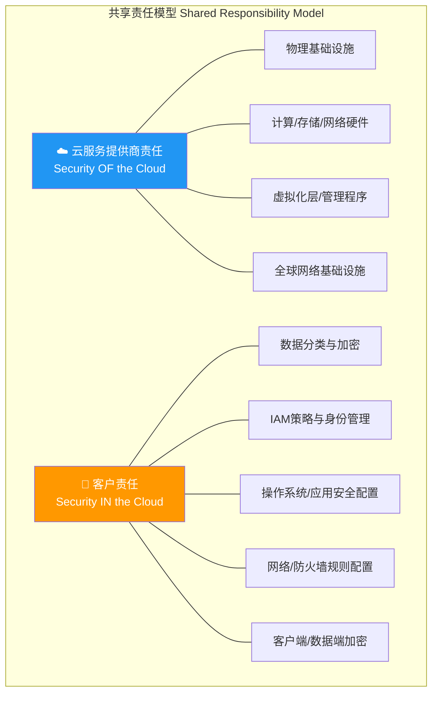
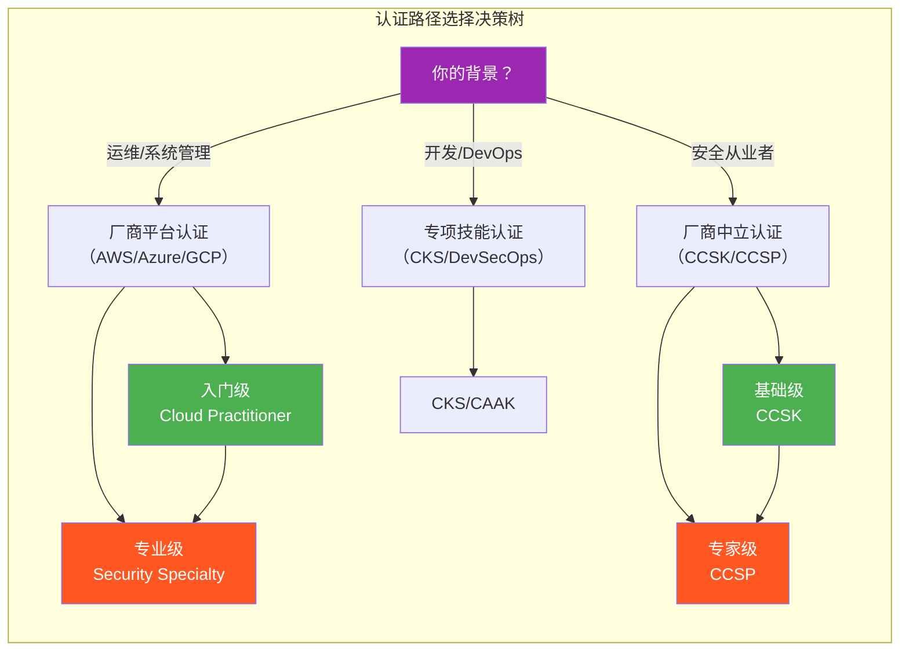
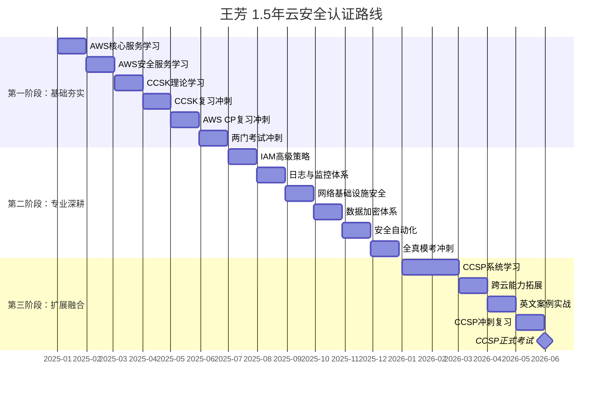
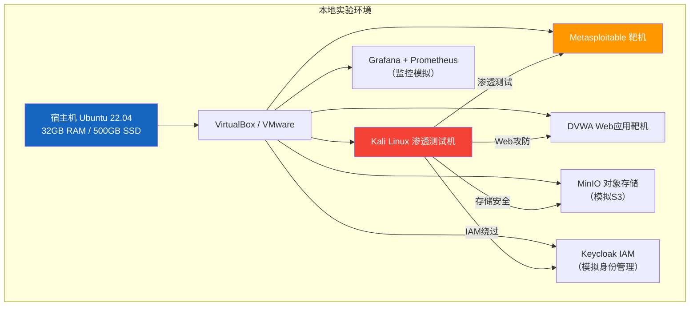
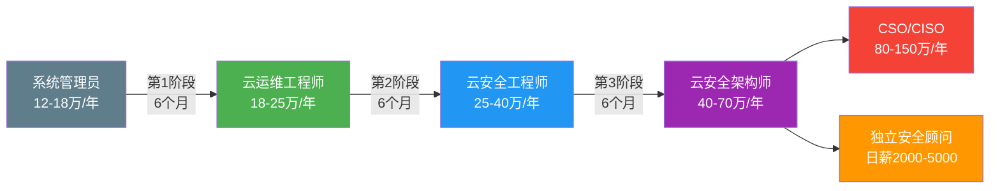

## 28.3 案例三：云安全认证之路

### 28.3.1 背景介绍

#### 主人公画像

**王芳**，28岁，网络工程专业本科学历，毕业后在一家中型互联网公司担任系统管理员3年。日常工作涵盖Linux服务器运维、网络设备配置、基础防火墙策略管理，以及公司内部机房的硬件维护。

**转型动机**：公司业务扩张，核心系统逐步迁移至阿里云和 AWS 海外区，王芳被指派负责云基础设施的运维管理。在迁移过程中，她遇到了传统运维经验无法解决的问题——对象存储桶权限泄露导致数据被爬取、云防火墙规则配置不当导致生产环境被扫描、Kubernetes 集群的 RBAC 配置混乱等。这些问题让她意识到，传统系统管理技能在云环境中有巨大的知识缺口，而企业对云安全人才的需求正在急速增长。

**能力基线**：

| 维度 | 现有水平 | 缺口 |
|------|---------|------|
| 网络基础 | ★★★★☆ 扎实 | 云网络虚拟化概念（VPC对等、TGW） |
| Linux运维 | ★★★★☆ 熟练 | 容器安全、Serverless架构安全 |
| 安全基础 | ★★☆☆☆ 入门 | 云安全框架、IAM策略、加密体系 |
| 编程能力 | ★★☆☆☆ 基础Shell | Python自动化、IaC（Terraform/Pulumi） |
| 合规知识 | ★☆☆☆☆ 空白 | 等保2.0、GDPR、SOC2、PCI DSS |
| 英语阅读 | ★★★☆☆ 可读文档 | 英文原版考试、技术白皮书 |

#### 行业背景

2025年全球云计算市场规模已突破8000亿美元，中国云计算市场超过4000亿元人民币。伴随云采用率的快速上升，云安全事件同步激增。根据 Gartner 预测，到2026年，超过95%的云安全失败将源于客户的配置错误，而非云服务提供商的责任——这就是"共享责任模型"（Shared Responsibility Model）的核心含义。



中国境内，云安全人才缺口超过100万，市场对持有主流云安全认证的专业人才需求旺盛，持证者平均薪资比非持证者高出30%-50%。根据 ISC² 2024年度报告，全球网络安全人才缺口已扩大至400万人，其中云安全方向的人才缺口占比约35%，这意味着仅云安全方向就有约140万的人才需求尚未满足。

#### 云安全人才市场细分

云安全并非单一岗位，而是涵盖多个专业方向的领域。了解这些方向有助于王芳（以及类似背景的读者）明确自己的定位：

| 方向 | 核心技能 | 典型职位 | 薪资范围（一线城市） |
|------|---------|---------|-------------------|
| 云安全运维 | IAM配置、日志审计、基础加固 | 云安全运维工程师 | 20-35万/年 |
| 云安全架构 | 多云安全设计、零信任、合规框架 | 云安全架构师 | 40-70万/年 |
| 云渗透测试 | 云环境攻防、容器逃逸、权限提升 | 云安全渗透测试工程师 | 30-55万/年 |
| 云安全合规 | 等保2.0、SOC2、PCI DSS审计 | 云安全合规顾问 | 35-60万/年 |
| DevSecOps | CI/CD安全、SAST/DAST集成、供应链安全 | DevSecOps工程师 | 30-50万/年 |
| 云安全研究 | 漏洞挖掘、安全工具开发、威胁情报 | 云安全研究员 | 40-80万/年 |

王芳的转型路径选择了"云安全运维→云安全架构"方向，这是与她现有系统管理背景最契合的路线——从运维出发，逐步构建架构思维。

---

### 28.3.2 云安全认证全景图

在制定认证路线之前，王芳需要先理解全球云安全认证的完整生态。云安全认证可以分为三大阵营：

#### 主流云厂商认证（Platform-Specific）

| 云平台 | 入门级 | 助理级 | 专家级 |
|--------|-------|-------|-------|
| AWS | AWS Cloud Practitioner | AWS Certified Security – Specialty | AWS Certified Security – Professional（已退役，现为Security Specialty）|
| Azure | Microsoft Azure Fundamentals (AZ-900) | Azure Security Engineer Associate (AZ-500) | Azure Cybersecurity Architect Expert (SC-100) |
| Google Cloud | Cloud Digital Leader | Associate Cloud Engineer | Professional Cloud Security Engineer |
| 阿里云 | ACA 云计算 | ACP 云计算安全 | ACE 云计算安全架构 |
| 华为云 | HCIA-Cloud | HCIP-Cloud Security | HCIE-Cloud Security |

#### 厂商中立认证（Vendor-Neutral）

| 认证名称 | 颁发机构 | 级别 | 前置要求 | 考试费用 |
|---------|---------|------|---------|---------|
| CCSK (Certificate of Cloud Security Knowledge) | CSA | 基础 | 无 | $395 |
| CCSP (Certified Cloud Security Professional) | (ISC)² | 专家 | 5年信息安全经验（含1年云安全）| $599 |
| CISSP（含云计算域）| (ISC)² | 大师级 | 5年信息安全经验 | $749 |
| CISA (云审计方向) | ISACA | 专家 | 5年IT审计经验 | $575 |
| CompTIA Cloud+ | CompTIA | 中级 | 2年IT经验 | $369 |

#### 专项技能认证（Specialized）

| 认证 | 颁发机构 | 方向 | 费用 | 适用人群 |
|------|---------|------|------|---------|
| CKS (Certified Kubernetes Security Specialist) | CNCF | 容器安全 | $395 | 运维/DevOps转型云安全 |
| CCAK (Certificate of Cloud Auditing Knowledge) | CSA | 云审计 | $395 | 合规/审计方向 |
| AWS DevOps Engineer – Professional | AWS | DevSecOps | $300 | 开发+安全融合方向 |
| OSCP（云渗透延伸）| Offensive Security | 云渗透 | $1,599 | 渗透测试方向 |
| ZTCA (Zero Trust Certified Architect) | CyberArk | 零信任架构 | $250 | 架构设计方向 |



#### 认证选择的核心原则

对于王芳这样的转型者，认证选择需要遵循三个原则：

1. **与工作场景匹配**：王芳的公司使用AWS和阿里云，优先选择AWS认证（国际认可度最高）而非阿里云认证（国内市场认可）
2. **递进式积累**：先拿入门级建立信心和知识框架，再挑战专业级和专家级
3. **广度与深度平衡**：至少拿到一个厂商中立认证（CCSK/CCSP），确保跨平台能力不被单一厂商绑定

---

### 28.3.3 王芳的1.5年认证路线规划

王芳的时间有限，需要在全职工作之余完成认证学习。她将1.5年划分为三个主要阶段：



#### 第一阶段：基础夯实期（第1-6个月）

**目标**：建立云安全知识框架，拿到第一个入门级认证

**认证选择**：AWS Cloud Practitioner + CCSK

**原因分析**：
- AWS Cloud Practitioner（CLF-C02）是AWS的入门级认证，涵盖云概念、AWS服务、安全与合规基础、计费和定价模型。考试时间90分钟，65道题，通过线约700分（1000分制）。没有前置要求，适合零基础转型。
- CCSK（Certificate of Cloud Security Knowledge）由云安全联盟（CSA）颁发，是全球公认的云安全基础知识认证。它覆盖CSA的《云安全指南》v4.0的全部14个域，包括：云计算架构、治理与企业风险管理、法律/合同/电子发现、合规与审计、信息治理、管理平面与业务连续性、基础设施安全、虚拟化与容器、事件响应、应用安全、数据加密、IAM、安全即服务、互操作性与可移植性。

**学习计划**：

| 月份 | 学习内容 | 学习资源 | 每周投入 |
|------|---------|---------|---------|
| 第1月 | AWS核心服务（EC2/S3/VPC/IAM）| AWS官方培训 + 线上实验室 | 10小时 |
| 第2月 | AWS安全服务（GuardDuty/Inspector/WAF/Shield）| AWS Security Essentials课程 | 10小时 |
| 第3月 | 云安全基础理论（CSA指南）| CCSK官方教材 + 录播课 | 12小时 |
| 第4月 | CCSK重点域复习 + 模拟题 | 云安全联盟官网题库 | 12小时 |
| 第5月 | AWS Cloud Practitioner复习 | Tutorials Dojo模拟考 + AWS官方练习题 | 10小时 |
| 第6月 | 两门考试集中冲刺 | 错题复盘 + 最后一轮模拟 | 15小时 |

**实操任务**：
1. 注册AWS免费套餐账号，亲手创建IAM用户并应用最小权限原则
2. 使用AWS Config配置合规规则（如S3存储桶必须开启加密）
3. 创建VPC并配置安全组和网络ACL，验证规则优先级
4. 在AWS上部署一个简单的Web应用，配置WAF规则防御SQL注入
5. 使用CloudTrail审计API调用，识别可疑操作
6. 撰写CCSK 14个域的知识点总结笔记

**预计支出**：AWS Cloud Practitioner 考试费 $100 USD（中文考试 $100），CCSK $395 USD，加上学习资料约 $200。合计约 $695 USD。

---

#### 第二阶段：专业深耕期（第7-12个月）

**目标**：获得一个主流云平台的**安全专项认证**，深化实战能力

**认证选择**：AWS Certified Security – Specialty (SCS-C02)

**原因分析**：
- AWS Security Specialty 是目前全球需求量最大的云安全认证之一。
- 考试时长170分钟，65道题（选择题+多选题），通过线750分。
- 考试覆盖六大领域：
  1. **事件响应**（占14%）—— 识别与响应安全事件、自动化调查
  2. **日志与监控**（占18%）—— CloudTrail、CloudWatch、GuardDuty、Security Hub的配置与集成
  3. **基础设施安全**（占22%）—— 网络隔离（VPC、安全组、NACL）、系统加固（AMI、EC2安全配置）
  4. **身份与访问管理**（占20%）—— IAM策略编写、权限边界、IAM Access Analyzer、SSO集成
  5. **数据保护**（占16%）—— KMS密钥管理、S3加密策略、Secrets Manager
  6. **合规与审计**（占10%）—— Config规则、Artifact、合规框架映射

**学习计划**：

| 月份 | 学习内容 | 实操项目 | 每周投入 |
|------|---------|---------|---------|
| 第7月 | IAM高级策略编写（条件键、权限边界、策略变量）| 为公司多账户架构设计权限模型 | 12小时 |
| 第8月 | 日志与监控体系（CloudTrail组织级跟踪、GuardDuty自动化响应）| 搭建SIEM-on-CloudTrail原型 | 12小时 |
| 第9月 | 网络与基础设施安全（VPC endpoints、PrivateLink、TGW安全设计）| 设计跨VPC安全隔离方案 | 12小时 |
| 第10月 | 数据加密体系（KMS的CMK/HSM、S3默认加密、S3 Object Lock）| 实现S3静态加密+访问日志全量审计 | 12小时 |
| 第11月 | 安全自动化（Lambda自动隔离、Security Hub集成、EventBridge事件驱动）| 编写自动封禁恶意IP的Lambda函数 | 15小时 |
| 第12月 | 全真模考 + 错题集中突破 | 完成3套全真模拟题 | 15小时 |

**实操任务（进阶）**：
1. 使用 Terraform 编写 IaC 代码部署安全基线（S3 Block Public Access、CloudTrail组织跟踪）
2. 部署 AWS Security Hub 并与 GuardDuty、Inspector、Macie 集成
3. 编写 IAM 权限边界（Permissions Boundary）实现开发人员不能创建高风险服务
4. 使用 KMS 实现 S3 对象级加密的 BYOK（Bring Your Own Key）方案
5. 利用 EventBridge + Lambda 自动化处理 GuardDuty 告警（如发现端口扫描自动封禁源IP）
6. 创建 AWS Config 合规规则并配置自动修复（Auto-Remediation）
7. 使用 VPC Flow Logs 分析网络流量异常

**Terraform 实操示例**：用 IaC 部署安全基线

```hcl
# main.tf — 企业级 AWS 安全基线 Terraform 配置
# 适用于 SCS-C02 备考实操，覆盖 Config 规则、GuardDuty、S3 加固

terraform {
  required_version = ">= 1.5"
  required_providers {
    aws = {
      source  = "hashicorp/aws"
      version = "~> 5.0"
    }
  }
}

# 1. 启用 GuardDuty（全组织范围）
resource "aws_guardduty_detector" "org_detector" {
  enable = true
  finding_publishing_frequency = "FIFTEEN_MINUTES"

  datasources {
    s3_logs {
      enable = true
    }
    kubernetes {
      audit_logs {
        enable = true
      }
    }
    malware_protection {
      scan_ec2_instance_with_findings {
        ebs_volumes {
          enable = true
        }
      }
    }
  }

  tags = {
    Environment = "production"
    ManagedBy   = "terraform"
    SecurityBaseline = "true"
  }
}

# 2. S3 存储桶安全加固
resource "aws_s3_bucket" "secure_bucket" {
  bucket = "company-security-audit-logs"
}

resource "aws_s3_bucket_public_access_block" "secure_bucket_pab" {
  bucket = aws_s3_bucket.secure_bucket.id

  block_public_acls       = true
  block_public_policy     = true
  ignore_public_acls      = true
  restrict_public_buckets = true
}

resource "aws_s3_bucket_server_side_encryption_configuration" "secure_bucket_enc" {
  bucket = aws_s3_bucket.secure_bucket.id

  rule {
    apply_server_side_encryption_by_default {
      sse_algorithm     = "aws:kms"
      kms_master_key_id = aws_kms_key.s3_enc_key.arn
    }
    bucket_key_enabled = true
  }
}

resource "aws_s3_bucket_versioning" "secure_bucket_ver" {
  bucket = aws_s3_bucket.secure_bucket.id
  versioning_configuration {
    status = "Enabled"
  }
}

resource "aws_s3_bucket_logging" "secure_bucket_logging" {
  bucket        = aws_s3_bucket.secure_bucket.id
  target_bucket = aws_s3_bucket.secure_bucket.id
  target_prefix = "access-logs/"
}

# 3. KMS 密钥用于 S3 加密
resource "aws_kms_key" "s3_enc_key" {
  description             = "KMS key for S3 bucket encryption"
  deletion_window_in_days = 30
  enable_key_rotation     = true

  policy = jsonencode({
    Version = "2012-10-17"
    Statement = [
      {
        Sid       = "EnableRootAccountPermissions"
        Effect    = "Allow"
        Principal = { AWS = "arn:aws:iam::root" }
        Action    = "kms:*"
        Resource  = "*"
      },
      {
        Sid       = "AllowSecurityTeamAccess"
        Effect    = "Allow"
        Principal = { AWS = aws_iam_role.security_team.arn }
        Action = [
          "kms:Decrypt",
          "kms:DescribeKey",
          "kms:Encrypt",
          "kms:GenerateDataKey*",
          "kms:ReEncrypt*"
        ]
        Resource = "*"
      }
    ]
  })
}

# 4. AWS Config 合规规则
resource "aws_config_config_rule" "s3_bucket_ssl" {
  name = "s3-bucket-ssl-requests-only"

  source {
    owner             = "AWS"
    source_identifier = "S3_BUCKET_SSL_REQUESTS_ONLY"
  }

  depends_on = [aws_config_configuration_recorder.main]
}

resource "aws_config_config_rule" "s3_no_public_read" {
  name = "s3-bucket-public-read-prohibited"

  source {
    owner             = "AWS"
    source_identifier = "S3_BUCKET_PUBLIC_READ_PROHIBITED"
  }

  depends_on = [aws_config_configuration_recorder.main]
}

# 5. Config 记录器
resource "aws_config_configuration_recorder" "main" {
  name     = "security-audit-recorder"
  role_arn = aws_iam_role.config_role.arn

  recording_group {
    all_supported                 = true
    include_global_resource_types = true
  }
}
```

**预计支出**：SCS-C02 考试费 $300 USD，实战培训课程 $500-1000 USD（可选），练习环境成本约 $50-100 USD/月。合计约 $1,000-1,500 USD。

---

#### 第三阶段：扩展与融合期（第13-18个月）

**目标**：获得中立性专家认证，建立跨平台的云安全能力，为职业晋升奠定基础

**认证选择**：CCSP（Certified Cloud Security Professional）

**原因分析**：
- CCSP 由 (ISC)² 颁发，与 CISSP 同级别，是全球认可度最高的云安全专家认证。
- 考试时长3小时，125道题，通过线700分。
- 要求5年信息安全工作经验（含1年云安全），王芳的3年系统管理经验可折算，加上第一阶段和第二阶段的学习和实践，预计可满足工作经验要求。
- 六大知识域：
  1. **云概念、架构与设计**（占17%）—— 云计算参考架构、共享责任模型
  2. **云数据安全**（占20%）—— 数据生命周期管理、DLP、加密技术
  3. **云平台与基础设施安全**（占17%）—— 物理基础设施、网络、虚拟化、容器
  4. **云应用安全**（占17%）—— SDLC安全、DevSecOps、IAM
  5. **云安全运营**（占16%）—— 事件响应、取证、BCP/DR
  6. **法律、风险与合规**（占13%）—— GDPR、PCI DSS、HIPAA、SLA

**学习计划**：

| 月份 | 学习内容 | 学习资源 | 每周投入 |
|------|---------|---------|---------|
| 第13-14月 | CCSP六大域系统学习 | 官方学习指南（OSG第3版）+ 线上视频课程 | 12小时/周 |
| 第15月 | 泛化和跨云能力 | 同时学习Azure Security Engineer (AZ-500) 核心内容 | 14小时/周 |
| 第16月 | 英文案例实战 + 知识体系梳理 | CCSP官方题库 + 错题本 | 14小时/周 |
| 第17月 | CCSP冲刺复习 | 全真模拟考（至少3套） | 15小时/周 |
| 第18月 | CCSP正式考试 | 考前冲刺 + 报名 + 考试 | 全力投入 |

> **关于工作经验要求**：(ISC)² 允许通过后再补齐工作经验。考生在通过CCSP考试后有6年时间积累所需的经验。如果王芳在第15-18个月期间经验不足5年，可以先通过考试获得"准CCSP"身份（Associate of (ISC)²），待经验补足后再升级为正式CCSP。

**CCSP与AWS Security Specialty的知识映射**：

CCSP的六大域与SCS-C02的知识点存在大量交叉，这意味着第二阶段的学习会直接为第三阶段打下基础。以下是关键映射关系：

| CCSP域 | 与SCS-C02的交叉点 | 差异/新增内容 |
|--------|------------------|-------------|
| 云概念、架构与设计 | 共享责任模型、多账户架构 | 云参考架构（CSA CCM）、云服务模型差异（IaaS/PaaS/SaaS） |
| 云数据安全 | KMS加密、S3数据保护 | 数据生命周期管理、DLP、多租户数据隔离、密钥管理策略 |
| 云平台与基础设施安全 | VPC安全、EC2加固 | 虚拟化安全（Hypervisor攻击面）、容器安全、Serverless安全 |
| 云应用安全 | WAF、应用层防护 | SDLC安全集成、DevSecOps、API安全、微服务安全 |
| 云安全运营 | 事件响应、日志监控 | 云取证（证据链完整性）、BCP/DR策略、持续监控框架 |
| 法律、风险与合规 | Config合规规则 | GDPR/PCI DSS/HIPAA/SOC2合规框架、跨境数据传输、合同责任 |

**预计支出**：CCSP 考试费 $599 USD，教材与学习资料约 $200-300 USD，AZ-500 考试费（可选）$165 USD。合计约 $800-1,200 USD。

---

### 28.3.4 学习资源推荐

#### 官方资源

| 资源名称 | 适用认证 | 费用 | 说明 |
|---------|---------|------|------|
| AWS Skill Builder | AWS全系列 | 免费/订阅制($29/月) | 含官方实验和练习题 |
| AWS Ramp-Up Guides | AWS全系列 | 免费 | 按周编排的学习路线图 |
| Microsoft Learn | Azure全系列 | 免费 | 含交互式沙盒环境 |
| CSA Cloud Security Guidance v4 | CCSK | 免费 | 官方英文版PDF可下载 |
| (ISC)² 官方培训 | CCSP | $799-1,599 | 可选，含官方讲师 |
| Google Cloud Skills Boost | GCP全系列 | 免费/订阅制 | 含Quest和Lab |

#### 第三方备考资源

| 资源 | 适用 | 费用 | 推荐理由 |
|------|------|------|---------|
| Tutorials Dojo | AWS | $15-30 | 模拟题质量最高，有详细解析 |
| A Cloud Guru / Pluralsight | 跨平台 | $29-49/月 | 系统性视频课程 |
| Udemy（Jon Bonso系列）| AWS全系列 | 经常打折至$10-20 | 性价比最高 |
| Whizlabs | AWS/CCSP | $20-30/月 | 海量题库 |
| Cloud Security Alliance 官方CCSK培训 | CCSK | $495 | 含官方考试券 |
| LinkedIn Learning | AZ-500 | 含Premium订阅 | 微软讲师录制 |
| 51CTO学院 | 阿里云 | ¥1000-3000 | 中文资源，适合国内考生 |
| B站/YouTube | 通用 | 免费 | 通过搜索"CCSP exam prep"等找到大量经验分享 |

#### 实操练习平台

| 平台 | 方向 | 费用 | 核心价值 |
|------|------|------|---------|
| AWS Free Tier | 基础实操 | 免费12个月 | 创建IAM、VPC、S3等基础服务 |
| AWS Well-Architected Labs | 最佳实践 | 免费 | 按AWS安全支柱动手实验 |
| Azure免费账户 | Azure基础 | 免费12个月 + $200信用额 | 多云对比学习 |
| TryHackMe（云安全路径）| 云攻防 | $10/月 | 交互式云安全CTF闯关 |
| PwnedLabs | 云渗透 | $20/月 | 专注云环境攻防实操场景 |
| AttackIQ Academy | 安全验证 | 免费 | MITRE ATT&CK映射的云安全场景 |
| CloudGoat（Rhino Security）| 云渗透 | 免费开源 | AWS云环境故意留有漏洞的靶场 |
| Terragoat | IaC安全 | 免费开源 | 故意配置错误的Terraform代码，用于安全审计练习 |

---

### 28.3.5 云安全实战实验室搭建

除了使用公有云的免费套餐，王芳还在本地搭建了一套完整的云安全实验环境，用于日常练习和技能验证。

#### 本地云安全实验室架构



#### Docker 化的云安全靶场

使用 Docker Compose 快速搭建一套云安全练习环境：

```yaml
# docker-compose.yml — 云安全实战靶场
version: '3.8'

services:
  # MinIO 对象存储（模拟 AWS S3）
  minio:
    image: minio/minio:latest
    ports:
      - "9000:9000"   # API
      - "9001:9001"   # Web控制台
    environment:
      MINIO_ROOT_USER: admin
      MINIO_ROOT_PASSWORD: insecurepassword123
    command: server /data --console-address ":9001"
    volumes:
      - minio-data:/data
    networks:
      - lab-net

  # 故意存在安全问题的Web应用
  dvwa:
    image: vulnerables/web-dvwa:latest
    ports:
      - "8080:80"
    environment:
      MYSQL_ROOT_PASSWORD: dvwa
    networks:
      - lab-net

  # Vault（模拟云密钥管理）
  vault:
    image: hashicorp/vault:latest
    ports:
      - "8200:8200"
    environment:
      VAULT_DEV_ROOT_TOKEN_ID: myroot
      VAULT_DEV_LISTEN_ADDRESS: "0.0.0.0:8200"
    cap_add:
      - IPC_LOCK
    command: server -dev
    networks:
      - lab-net

  # ELK 日志分析（模拟 CloudTrail + CloudWatch）
  elasticsearch:
    image: docker.elastic.co/elasticsearch/elasticsearch:8.12.0
    environment:
      - discovery.type=single-node
      - xpack.security.enabled=false
      - "ES_JAVA_OPTS=-Xms512m -Xmx512m"
    ports:
      - "9200:9200"
    networks:
      - lab-net

  kibana:
    image: docker.elastic.co/kibana/kibana:8.12.0
    ports:
      - "5601:5601"
    environment:
      ELASTICSEARCH_HOSTS: http://elasticsearch:9200
    networks:
      - lab-net

  # 安全扫描工具
  trivy:
    image: aquasec/trivy:latest
    volumes:
      - ./scan-targets:/target
    entrypoint: ["trivy", "fs", "/target"]
    networks:
      - lab-net

volumes:
  minio-data:

networks:
  lab-net:
    driver: bridge
```

**实验室练习任务清单**：

1. **S3安全加固**：在MinIO中创建存储桶，故意配置为公共可读，然后使用AWS S3安全最佳实践逐步加固
2. **IAM权限分析**：在Keycloak中创建多个用户和角色，练习最小权限原则和权限边界
3. **日志审计**：配置ELK收集所有服务日志，模拟GuardDuty的异常检测逻辑
4. **密钥管理**：使用Vault实现应用密钥的动态生成和自动轮换
5. **漏洞扫描**：使用Trivy扫描Docker镜像中的CVE漏洞，修复高危和严重漏洞
6. **渗透测试**：从Kali对DVWA进行完整渗透测试，记录攻击路径和修复建议

---

### 28.3.6 备考方法论

#### 有效的学习策略

**1. 费曼学习法**：每学完一个概念，用自己的话给同事或录视频讲一遍。如果讲不明白，说明没真正理解。可以通过语音备忘录录音，反复听自己的解释，修正不准确的地方。

**2. 间隔重复（Spaced Repetition）**：

使用 Anki（免费开源）制作电子闪卡。示例闪卡内容：

> **正面**：S3 Block Public Access 的四个设置项是什么？
> **背面**：
> 1. BlockPublicAcls — 阻止通过ACL授予公共访问
> 2. IgnorePublicAcls — 忽略所有公共ACL
> 3. BlockPublicPolicy — 阻止通过桶策略授予公共访问
> 4. RestrictPublicBuckets — 限制通过桶策略的公共访问（需配合IAM）

每天坚持15-20分钟闪卡复习，利用碎片时间（通勤、午休）循环巩固。

**3. 主动回忆（Active Recall）**：不要反复阅读教材，而是合上书回忆关键知识点。以AWS Security Specialty为例，可以自己画一张关于IAM策略评估逻辑的流程图，看能不能画出所有步骤。

**4. 手写笔记**：研究表明手动书写比打字更容易形成长期记忆。王芳准备了一个B5活页本，每学完一个模块就手写500-800字的知识点总结，然后用荧光笔标记考试重点。在备考后期，这些手写笔记成为最有效的冲刺材料。

**5. 项目驱动学习**：将每个认证的知识点转化为一个可交付的项目。例如：

| 认证 | 项目化学习 | 产出物 |
|------|----------|--------|
| AWS CP | 撰写公司AWS环境安全评估报告 | 20页PDF报告 |
| CCSK | 制作CSA 14域思维导图 | XMind/手绘脑图 |
| SCS-C02 | 编写Terraform安全基线模板 | GitHub仓库 |
| CCSP | 设计公司多云安全架构方案 | 架构图+白皮书 |

#### 考试技巧

**选择题答题策略**：

1. **先排除法**：一般每道题有4个选项，通常有1-2个明显错误（如说AWS不支持的配置）。先排掉这些，在剩下的2-3个中选最优解。
2. **关键词定位**：题目中带有"最小权限""成本最优""自动化"等限定词时，对应选择满足该条件的方案。
3. **最长选项未必正确**：但SCS-C02中，最完整的安全方案往往是正确答案，因为AWS倾向选择多层防御。
4. **注意"NOT"和"EXCEPT"**：这类否定型问题最容易出错，建议圈出题目里的否定词。
5. **时间管理**：170分钟做65题，平均每题约2.6分钟。目标是至少留出20分钟复查不确定的题目。

**情景题应对**：

AWS Security Specialty包含大量情景题（Scenario-based questions），例如：

> 某公司有多个AWS账户，希望在使用AWS Organizations后，确保安全团队能统一查看所有账户的GuardDuty告警。以下哪种方案最符合最佳实践？

这种题型的解题框架：
1. 提取约束条件（多个账户、统一查看、最佳实践）
2. 回忆相关服务能力（GuardDuty支持多账户管理、委托管理员）
3. 在选项中识别符合所有约束的方案
4. 排除那些虽然能工作但不符合"最佳实践"的次优解

**各认证的特殊备考策略**：

| 认证 | 核心挑战 | 特殊策略 |
|------|---------|---------|
| AWS CP | 概念多但不深，需记忆AWS专有术语 | 用AWS官方文档术语表建立词汇库 |
| CCSK | 14个域范围广，无实操题 | 用CSA安全指南做章节笔记，每域3-5页 |
| SCS-C02 | 情景题复杂，需深度理解服务交互 | 每个服务都要亲手上机，理解"为什么这样配置" |
| CCSP | 英文阅读量大，法律/合规部分抽象 | 每天读30分钟英文安全博客，用真实案例理解合规要求 |

---

### 28.3.7 实战案例：王芳的转型故事

#### 第3个月——第一次实战考验

公司的AWS环境发生了一起S3数据泄露事件：一个开发人员创建的S3桶意外设置为公共可读，导致5000+条用户注册数据被未知爬虫获取。

王芳作为负责人参与了事件响应。她当时刚学完CCSK的"事件响应"域和S3安全配置，立即采取以下行动：

1. **立即阻断**：使用AWS Console将桶ACL从"公共"改为"私有"，并开启Block Public Access
2. **证据固定**：开启S3访问日志，分析受影响的数据范围，提取攻击者的IP列表和User-Agent
3. **根因分析**：发现开发人员使用了过于宽泛的桶策略（`"Principal": "*"`），且缺少S3 Block Public Access组织级规则
4. **长期修复**：
   - 在AWS Organizations层面启用S3 Block Public Access
   - 使用Service Control Policy (SCP)禁止子账号创建公共S3桶
   - 配置AWS Config规则`s3-bucket-public-read-prohibited`和自动修正
   - 将GuardDuty与Security Hub集成，设置S3异常访问告警
   - 向全部门推送S3安全配置规范文档

这次事件让她深刻理解了CCSK教材中反复强调的"共享责任模型"——云服务商负责云的安全（Security OF the Cloud），客户负责云中的安全（Security IN the Cloud）。配置错误是云安全事件的第一大原因，而正确的IAM和S3策略是最基础也是最重要的防线。

**事件响应时间线与决策记录**：

| 时间 | 行动 | 意义 |
|------|------|------|
| T+0（发现） | 收到安全告警，确认S3桶为公共可读 | 第一时间识别问题 |
| T+15分钟 | 修改ACL为私有，开启Block Public Access | 立即阻断攻击向量 |
| T+30分钟 | 启用S3访问日志，开始分析日志 | 证据固定，量化影响范围 |
| T+2小时 | 完成根因分析，确认攻击者IP和数据泄露范围 | 明确事件全貌 |
| T+4小时 | 编写临时修复方案并实施（SCP + Config规则） | 防止同类事件再次发生 |
| T+1天 | 编写正式事件报告，推送安全规范文档 | 知识沉淀，全员教育 |
| T+1周 | 完成长期安全架构改进方案 | 系统性防御升级 |

#### 第8个月——Kubernetes安全挑战

公司开始将微服务迁移到Amazon EKS。王芳在EKS集群的初始配置中遇到了多个安全问题：

- 使用了默认的集群角色绑定，Pod可以访问EC2 metadata服务
- 没有启用Pod Security Policies（现为Pod Security Admission）
- 没有配置网络策略，所有Pod之间可以自由通信
- 使用默认的Seccomp/AppArmor配置

她结合AWS Security Specialty学习内容，参考了CIS EKS Benchmark和NSA/CISA Kubernetes Hardening Guide，制定了以下加固方案：

```yaml
# 1. 限制Pod访问Metadata服务：通过VPC路由策略或IAM Roles for Service Accounts (IRSA)
# 2. 启用Pod Security Admission (PSA)
apiVersion: v1
kind: Namespace
metadata:
  name: production
  labels:
    pod-security.kubernetes.io/enforce: restricted
    pod-security.kubernetes.io/audit: restricted
    pod-security.kubernetes.io/warn: restricted
---
# 3. 部署Calico或Cilium网络策略
apiVersion: networking.k8s.io/v1
kind: NetworkPolicy
metadata:
  name: deny-all
  namespace: production
spec:
  podSelector: {}          # 应用于所有Pod
  policyTypes:
    - Ingress
    - Egress               # 同时限制入口和出口流量
---
# 4. 创建允许API服务访问特定端口的策略
apiVersion: networking.k8s.io/v1
kind: NetworkPolicy
metadata:
  name: allow-api-egress
  namespace: production
spec:
  podSelector:
    matchLabels:
      app: api-service
  policyTypes:
    - Egress
  egress:
    - to:
      - podSelector:
          matchLabels:
            app: database
      ports:
        - port: 5432        # PostgreSQL
          protocol: TCP
    - to:
      - ipBlock:
          cidr: 0.0.0.0/0
          except:
            - 169.254.169.254/32  # 阻止Metadata服务访问
---
# 5. 限制容器特权和资源使用
apiVersion: v1
kind: Pod
metadata:
  name: secure-pod
  namespace: production
spec:
  securityContext:
    runAsNonRoot: true
    runAsUser: 1000
    fsGroup: 2000
    seccompProfile:
      type: RuntimeDefault
  containers:
    - name: app
      image: myapp:1.0
      securityContext:
        allowPrivilegeEscalation: false
        readOnlyRootFilesystem: true
        capabilities:
          drop:
            - ALL          # 丢弃所有Linux能力
      resources:
        limits:
          cpu: "500m"
          memory: "256Mi"
        requests:
          cpu: "100m"
          memory: "128Mi"
```

这个实战经历让她在备考SCS-C02的"基础设施安全"域时，对Kubernetes相关的安全题目得心应手。

**K8s安全加固检查清单**：

| 检查项 | 问题描述 | 修复方案 | 优先级 |
|--------|---------|---------|--------|
| Pod访问Metadata | 默认允许Pod访问169.254.169.254 | 使用IRSA + VPC路由阻断 | 🔴 高 |
| 默认集群绑定 | cluster-admin权限过度分配 | RBAC最小权限 + 审计 | 🔴 高 |
| 网络策略缺失 | Pod间无隔离 | 实现deny-all默认策略 | 🔴 高 |
| 容器特权模式 | 允许特权容器运行 | PSA restricted策略 | 🔴 高 |
| Seccomp未配置 | 使用默认unconfined配置 | 设置RuntimeDefault | 🟡 中 |
| 镜像安全扫描 | 使用未扫描的镜像 | Trivy/Falco集成CI | 🟡 中 |
| Secrets管理 | 明文存储在etcd | 外部密钥管理（Vault/ESO）| 🟡 中 |

#### 第15个月——多云架构下的安全设计

公司决定采用多云策略，部分工作负载迁移到Azure，以利用Azure的AI/ML服务。王芳需要设计一个跨云的安全架构。

她利用此前学习的AWS安全知识，结合AZ-500的核心内容，设计了以下方案：

| 安全域 | AWS方案 | Azure方案 | 统一管理方案 |
|--------|---------|----------|-------------|
| 身份与访问管理 | AWS IAM + SSO with SAML 2.0 | Azure AD + Managed Identity + RBAC | 统一IdP（Okta/Azure AD）|
| 密钥管理 | AWS KMS + CloudHSM | Azure Key Vault + Managed HSM | HashiCorp Vault跨云 |
| 日志与监控 | CloudTrail + GuardDuty + Security Hub | Azure Monitor + Sentinel + Defender for Cloud | SIEM统一汇聚 |
| 网络隔离 | VPC + TGW + Network Firewall | vNet + Azure Firewall + Virtual WAN | VPN/专线互联 |
| 数据保护 | S3默认加密 + Macie | Blob Storage加密 + Purview | 统一数据分类标准 |
| 合规审计 | Config + Audit Manager | Azure Policy + Blueprint | 统一合规基线 |
| 事件响应 | Security Hub + Lambda自动化 | Sentinel SOAR + Logic Apps | 统一事件响应流程 |

这一阶段她的学习重心转移到比较和迁移上——理解两个平台在同等安全功能上的实现差异，最终目标是拿到CCSP认证，建立厂商无关的云安全思维。

**多云安全架构设计原则**：

1. **身份统一**：无论AWS还是Azure，所有身份验证统一由一个身份提供商（IdP）管理，避免身份碎片化
2. **密钥集中**：使用HashiCorp Vault等工具实现跨云的统一密钥管理，而非在每个云平台单独管理密钥
3. **日志汇聚**：所有云平台的日志统一发送到一个SIEM平台（如Azure Sentinel或Elastic SIEM），实现跨云威胁检测
4. **策略一致**：制定统一的安全基线策略，确保两个云平台的安全配置水平一致
5. **网络互联**：通过VPN或专线建立安全的跨云网络通道，避免通过公网传输敏感数据

---

### 28.3.8 常见误区与避坑指南

#### 误区一：只刷题不实操

**问题**：许多考生依靠刷题库通过考试，但面对真实环境时手足无措。

**纠正方法**：每学一个服务或功能，必须亲手上机操作一次。AWS没有需要销毁资源的概念，因此除了留到生产环境。王芳的做法是：每学完一个服务，就在个人AWS账号中完成以下三步：创建→验证→清理。创建是学习配置参数；验证是用各种手段确认功能生效（如故意访问被拒绝的资源以确认IAM策略生效）；清理是养成不浪费资源的好习惯。

#### 误区二：认为越多认证越好

**问题**：有些人在1年内堆叠了5-6个入门级认证，但实际能力并没有明显提升。

**纠正方法**：认证不是集邮。王芳的路线是"入门→专业→专家"三级递进，每个阶段有一个明确的技能增长点：
- 入门级（CCSK/Cloud Practitioner）：建立知识框架
- 专业级（Security Specialty）：深耕一个平台的深度
- 专家级（CCSP）：融会贯通，跳出平台限制

#### 误区三：忽视英语能力

**问题**：虽然AWS、Azure部分认证支持中文考试，但CCSP和大多数专家级认证只有英文版。英文阅读速度和理解准确度直接影响考试成绩。

**纠正方法**：从第一阶段的CCSK开始看英文原版教材（即使有中文翻译版作为辅助）。对于专业术语，建立中英对照表：

| 中文术语 | English Term |
|---------|-------------|
| 共享责任模型 | Shared Responsibility Model |
| 最小权限原则 | Principle of Least Privilege |
| 纵深防御 | Defense in Depth |
| 攻击面 | Attack Surface |
| 安全控制 | Security Control |
| 合规框架 | Compliance Framework |
| 身份与访问管理 | Identity and Access Management |
| 数据泄露防护 | Data Loss Prevention |
| 服务控制策略 | Service Control Policy |
| 权限边界 | Permissions Boundary |
| 密钥管理服务 | Key Management Service |
| 安全信息与事件管理 | Security Information and Event Management |
| 零信任架构 | Zero Trust Architecture |
| 云安全态势管理 | Cloud Security Posture Management |

每天阅读20分钟AWS安全博客或CSA白皮书，积累技术英语的阅读节奏和词汇量。

#### 误区四：忽视软技能

**问题**：只关注技术层面的安全控制，忽视了沟通和流程推进能力。

**纠正方法**：云安全不只有技术控制，还包括：
- **安全文化推动**：向管理层汇报安全风险时，强调业务影响而非技术细节
- **跨团队协作**：与开发团队配合实施DevSecOps，将安全左移至开发阶段
- **文档能力**：编写清晰的安全规范和操作手册，需要良好的文档化能力
- **安全培训**：能够为非安全背景的同事做安全赋能培训

#### 误区五：忽视成本控制

**问题**：云安全实验和实操需要使用云资源，不加控制的资源使用可能导致账单飙升。

**纠正方法**：
1. **设置预算告警**：在AWS Budgets中设置每月$50的预算告警，超支立即通知
2. **使用免费套餐**：充分利用AWS Free Tier、Azure $200信用额
3. **定时销毁实验资源**：编写脚本在非工作时间自动停止EC2实例
4. **选择按需付费**：实验环境使用按需计费而非预留实例，用完即停
5. **使用Spot实例**：非关键实验使用Spot实例，成本降低60-90%
6. **监控费用**：每周检查一次AWS Cost Explorer，了解费用构成

---

### 28.3.9 投入产出分析

#### 时间投入

| 阶段 | 认证 | 学习周数 | 每周学时 | 总学时 | 经验值 |
|------|------|---------|---------|-------|-------|
| 第一阶段 | AWS Cloud Practitioner | 12 | 10-12 | 120-144 | 入门 |
| 第一阶段 | CCSK | 12 | 10-12 | 120-144 | 基础 |
| 第二阶段 | AWS Security Specialty | 24 | 12-15 | 288-360 | 专业 |
| 第三阶段 | CCSP | 24 | 12-15 | 288-360 | 专家 |
| **合计** | **4个认证** | **72周** | **—** | **816-1008** | **完整体系** |

#### 财务投入

| 项目 | 费用（USD） |
|------|------------|
| AWS Cloud Practitioner 考试 | $100 |
| CCSK 考试 | $395 |
| AWS Security Specialty 考试 | $300 |
| CCSP 考试 | $599 |
| 学习资料与书籍 | $300-500 |
| 实操环境（18个月） | $900-1,800 |
| **合计** | **$2,594-3,694 USD** |

注：折合人民币约18,000-26,000元，约相当于持证后1.5-2个月的薪资涨幅。投资回收期通常在6-12个月内。

**省钱技巧**：
- AWS re:Invent大会期间（每年12月）常有考试券折扣
- (ISC)² 会员推荐计划可获得$50考试折扣
- 多家培训平台在黑五/Cyber Monday有50%以上折扣
- AWS Partner Network成员可获得免费培训和考试折扣

#### 预期职业回报

| 时间段 | 预期职位 | 预计薪资（一线城市） |
|--------|---------|-------------------|
| 转型前 | 系统管理员 | 12-18万/年 |
| 第1阶段后（入门级认证持有） | 云运维工程师 | 18-25万/年（+40%） |
| 第2阶段后（安全专项认证持有） | 云安全工程师 | 25-40万/年（+60%） |
| 第3阶段后（CCSP持有） | 云安全架构师/安全负责人 | 40-70万/年（+75%） |

#### 职业发展路径可视化



---

### 28.3.10 学习资源与工具清单

#### 推荐书籍

| 书名 | 作者 | 适用阶段 | 推荐理由 |
|------|------|---------|---------|
| 《CCSK云安全认证指南》| CSA官方 | 第一阶段 | 与CCSK考试完全对应 |
| 《AWS认证安全专项学习指南(SCS-C02)》| Stuart Scott | 第二阶段 | 附带实操练习和模拟题 |
| 《CCSP官方学习指南第3版》| (ISC)² | 第三阶段 | 官方教材，覆盖所有考试域 |
| 《云安全权威指南》| 谭晓生等（中文）| 全阶段参考 | 国内视角，适合补充理解 |
| 《云安全攻防入门》| 白帽子团队 | 终身后续提升 | 攻防视角的云安全实践 |
| 《AWS安全最佳实践白皮书》| AWS官方 | 第二阶段 | 免费，官方安全指南 |
| 《Container Security》| Liz Rice | 第二阶段 | 容器安全权威参考 |

#### 效率工具

| 工具 | 用途 | 费用 |
|------|------|------|
| Anki | 间隔重复闪卡 | 免费 |
| Notion / Obsidian | 学习笔记知识库 | 免费/付费 |
| XMind / ProcessOn | 知识结构脑图 | 免费版/月付 |
| VS Code | 代码与IaC练习 | 免费 |
| Terraform / Pulumi | IaC安全实践 | 免费 |
| ChatGPT / Claude | 学习答疑辅助 | 付费订阅 |
| AWS CloudShell | 在线终端环境 | 免费 |
| Wireshark + Zeek | 网络流量分析 | 免费 |
| Draw.io | 架构图绘制 | 免费 |
| Flomo / 浮墨笔记 | 碎片化知识点积累 | 免费版 |

---

### 28.3.11 云安全认证后的持续成长

拿到认证不是终点，而是云安全职业发展的起点。王芳在完成认证路线后，建立了持续成长的体系：

#### 技能维护与更新

| 频率 | 活动 | 目的 |
|------|------|------|
| 每日 | 阅读AWS安全博客 / CSA动态 | 保持技术敏感度 |
| 每周 | 参与云安全社区讨论（Reddit r/AWSCertifications、知乎云安全话题）| 交流经验，发现新知识 |
| 每月 | 完成1个云安全实验/CTF | 维持实操能力 |
| 每季 | 参加1次云安全会议/Webinar（如AWS re:Inforce、CSA Congress）| 了解行业趋势 |
| 每年 | 续期认证（AWS认证2年、CCSP 3年）+ 评估新认证方向 | 保持认证有效性 |

#### 云安全前沿方向

| 方向 | 技术趋势 | 相关认证/学习 |
|------|---------|-------------|
| AI/ML安全 | 大模型安全、AI红队、对抗样本 | AWS ML Specialty、AI安全框架 |
| 供应链安全 | SBOM、签名验证、依赖项审计 | SLSA框架、Sigstore |
| 零信任架构 | 从网络边界到身份边界的范式转变 | ZTCA认证、BeyondCorp |
| 云原生安全 | 服务网格安全、eBPF安全、运行时保护 | CKS、CNCF安全项目 |
| 量子安全 | 后量子密码学在云环境的应用 | NIST后量子标准、量子密钥分发 |
| 合规自动化 | 合规即代码（Compliance as Code） | Open Policy Agent、Chef InSpec |

#### 个人品牌建设

王芳在认证学习过程中同步建立了个人品牌：

1. **GitHub 仓库**：将Terraform安全基线、实验脚本整理成开源项目
2. **技术博客**：在CSDN/博客园撰写云安全实战文章，积累技术影响力
3. **社区贡献**：在CSA本地社区做分享，参与开源安全工具贡献
4. **面试准备**：将认证学习中的项目经验整理为STAR格式的面试故事

---

### 28.3.12 案例总结

王芳的云安全认证之路代表了典型的"传统运维→云安全专家"转型路径。她的成功得益于三个关键因素：

1. **系统化的认证路线**：不贪多求快，而是按照"入门→深耕→融合"的节奏递进，每张证书之间互为基础，形成知识体系的骨骼。
2. **学以致用**：每学完一个知识点就立刻在真实环境中实践，将认证考试与实际工作紧密结合，把知识真正转化为能力。
3. **持续积累**：通过笔记、闪卡、脑图等多种手段建立个人知识库，让学习成果可沉淀、可复用、可迭代。

对同样有志于投身云安全领域的读者，王芳的核⼼建议是：**先搭建知识框架，再深耕一个平台，最后融合为厂商中立的安全思维。认证只是路标，真正的目标是理解和驾驭云安全的底层逻辑。**

> "拿到一张认证证书只需要几周的准备，但要真正成为一名合格的云安全专家，需要持续的学习、动手的实践和不怕出错的勇气。云安全最大的魅力在于——你永远有新的东西要学，而这也意味着这个行业永远需要像你一样的新人。"——王芳

---

### 28.3.13 延伸阅读

| 资源 | 类型 | 链接/来源 | 价值 |
|------|------|---------|------|
| CSA云计算关键领域安全指南 v4.0 | 白皮书 | https://cloudsecurityalliance.org | CCSK考试核心参考 |
| AWS Well-Architected Framework - 安全支柱白皮书 | 架构指南 | AWS官方文档 | 安全设计最佳实践 |
| NIST SP 500-322：云计算安全参考架构 | 标准 | NIST官网 | 权威安全参考架构 |
| CIS AWS Foundations Benchmark | 基准 | https://www.cisecurity.org | 安全配置基线标准 |
| NSA/CISA Kubernetes Hardening Guidance | 指南 | NSA官网 | K8s安全加固权威参考 |
| 阿里云安全白皮书 | 白皮书 | 阿里云官网 | 国内云安全实践参考 |
| ISO/IEC 27017：云计算服务的信息安全控制 | 标准 | ISO官网 | 云安全国际标准 |
| MITRE ATT&CK Cloud Matrix | 框架 | https://attack.mitre.org | 云环境威胁建模参考 |
