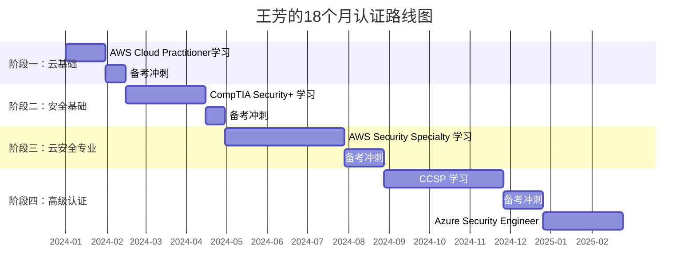

## 王芳的认证路线图：从云运维到云安全架构师的18个月蜕变

### 案例背景

#### 主人公画像

王芳，28岁，某互联网公司云基础设施运维工程师，拥有4年工作经验。她所在的团队负责维护公司部署在AWS上的核心业务系统（日均处理200万+请求，涉及金融交易数据处理）。

**认证前状态**：

| 维度 | 详情 |
|------|------|
| 技术能力 | 熟悉AWS基础服务（EC2、S3、RDS、VPC），能独立排查基础设施故障 |
| 安全知识 | 零基础，从未接触过安全框架、风险评估、合规要求 |
| 英语水平 | 大学六级，能阅读英文技术文档但阅读速度偏慢（约80词/分钟） |
| 可用学习时间 | 工作日晚间2小时 + 周末4小时（碎片时间为主） |
| 职业目标 | 向云安全方向转型，成为具有安全视野的云安全架构师 |

#### 转型动机

王芳在一次生产事故中发现，公司配置错误的S3存储桶（公开可读）已存在3个月未被发现，所幸未被外部利用。这次"未遂事故"让她深刻认识到：**运维工程师必须懂安全，安全不仅是安全团队的事**。她下定决心系统性地学习云安全，用认证建立知识框架。

这个事故的直接导火索是：安全团队在例行扫描中用AWS Config Rules检测到S3 Bucket Policy中`"Principal": "*"`的配置，意味着任何互联网用户都可以读取该桶内的数据。桶中存储着部分客户订单数据（已脱敏但含用户行为日志），如果被恶意爬取，不仅违反数据安全法规，还可能成为社会工程攻击的素材。

王芳参与了这次事件的应急响应——虽然她只是执行了"删除公开策略"的操作，但在事后复盘会上，安全负责人说了一句话让她记忆犹新："如果运维团队在部署时就能识别出这个风险，这个隐患不会存在3个月。"这句话成为她转型的原点。

#### 转型前的SWOT分析

王芳在开始认证规划前，花了2周时间做了一次系统的自我评估：

| | 有利因素 | 不利因素 |
|---|---------|---------|
| **内部** | **优势(S)**：4年AWS实战经验；运维背景意味着对基础设施有直觉式理解；金融行业对安全合规有刚性需求，市场需求确定 | **劣势(W)**：安全知识为零；英语阅读速度慢（考试为英文）；无法脱产学习；心理上对"考试"有恐惧感 |
| **外部** | **机会(O)**：公司推行零信任架构需要云安全人才；安全岗位薪资普遍高于运维20-40%；AWS安全认证市场认可度高 | **威胁(T)**：认证考试费用不低；如果投入时间后未能通过会产生挫败感；30岁前转型窗口期有限 |

这个分析帮助她明确了核心策略：**利用AWS经验优势，从自己最熟悉的平台切入安全领域**。

---

### 认证路线全景规划

王芳的认证路线遵循"云基础→安全基础→云安全专业→高级认证"的四阶递进模型。每一阶段的选择都经过精心考量——不是堆砌证书数量，而是让每个认证解决一个具体的能力短板。



#### 认证选择逻辑

王芳的选择体现了"由浅入深、由专到广"的策略。每个认证在她的知识体系中承担不同角色：

| 阶段 | 认证名称 | 选择理由 | 投入时间 | 费用 | 解决的能力短板 |
|------|---------|---------|---------|------|--------------|
| 一 | AWS Cloud Practitioner | 验证已有AWS基础，建立信心 | 1.5个月 | $100 | AWS全局架构认知 |
| 二 | CompTIA Security+ | 零基础安全入门，覆盖安全全貌 | 2.5个月 | $392 | 安全理论框架 |
| 三 | AWS Security Specialty | 专精云安全，与日常工作强相关 | 4个月 | $300 | 云安全实战能力 |
| 四 | CCSP | 云安全国际权威认证，实现职业跃迁 | 4个月 | $599 | 跨平台安全战略视野 |
| 四 | Azure Security Engineer（可选） | 多云战略布局 | 2个月 | $165 | 多云安全能力 |

**总预算**：约$1,556（不含培训课程和教材）。王芳所在公司报销全部认证费用，并提供每年$3,000的学习基金，实际个人支出为零。这一公司政策是她能坚持18个月的重要支撑——**制度化的学习支持比个人意志力更可靠**。

---

### 阶段一：云基础加固（第1-2个月）

#### 目标：AWS Cloud Practitioner

**为什么从最基础的认证开始？**

王芳虽然已有4年AWS实战经验，但她选择Cloud Practitioner而非直接考取Associate级别认证。这一决策基于三个深层考量：

1. **验证知识体系**——4年经验让她熟悉操作，但需要系统化梳理AWS全局架构。她发现自己能熟练配置VPC，但说不清"VPC在AWS六大服务支柱中处于什么位置"。实战经验和结构化知识是两回事。
2. **建立考试节奏**——低难度认证让她适应AWS的考试风格和题型。她从未参加过英文技术认证考试，需要先通过一个"友好"的考试消除心理障碍。
3. **快速获得正反馈**——1.5个月通过一个认证，增强持续学习的信心。她深知18个月是一场马拉松，开局阶段必须让自己"尝到甜头"。

#### 备考策略

**每日学习计划**：

| 时间段 | 内容 | 时长 | 学习方法 |
|-------|------|------|---------|
| 20:00-21:00 | AWS官方数字化培训课程 | 1小时 | 边看边记笔记，每章节结束自测 |
| 21:00-21:30 | 阅读AWS白皮书 | 30分钟 | 重点关注架构决策的"为什么" |
| 21:30-22:00 | 做练习题+错题归因 | 30分钟 | 每道错题标注错误原因分类 |
| 周末上午 | AWS Free Tier动手实验 | 2-3小时 | 按照白皮书中的参考架构搭建 |

**学习资源清单**：

| 资源类别 | 具体资源 | 用途 | 花费 |
|---------|---------|------|-----|
| 官方课程 | AWS Cloud Practitioner Essentials（6小时） | 核心学习 | 免费 |
| 白皮书 | AWS Well-Architected Framework（60页） | 架构思维 | 免费 |
| 白皮书 | AWS Overview（30页） | 服务全景 | 免费 |
| 题库 | TutorialsDojo模拟题（200题） | 查漏补缺 | $15 |
| 视频 | AWS re:Invent基础技术分享 | 扩展视野 | 免费 |

**学习技巧**：王芳将AWS六大优势（降低风险、弹性伸缩等）和云计算的五种特征（按需自助服务、广泛网络接入等）制作成Anki记忆卡片，在地铁通勤时反复复习。她发现间隔重复的效果远超预期——一张"EC2实例类型对比"卡片在第7天的回忆成功率从首次的40%提升到95%。

#### 考试细节

- **考试形式**：60分钟，65道选择题
- **成绩**：通过（具体分数不显示）
- **总学习时间**：约50小时
- **经验总结**：
  - AWS服务名称和功能容易混淆，建议按类别分组记忆（计算、存储、网络、数据库、安全），形成"AWS服务地图"
  - 考试重点在于理解"为什么用云"而非"怎么用云"，答题时从价值角度思考
  - 她犯的一个错误：在模拟题中将"Shared Responsibility Model"只理解为"安全分工"，实际它涵盖了运营、合规、数据等所有维度。正式考试中险些因此丢分

**心态调整**：考前一周王芳非常焦虑——不是怕题目难，而是怕"4年经验还考不过基础认证"丢人。她的主管对她说："基础认证不是测你有多强，是测你的知识是否完整。通过了说明你的基础比你以为的更扎实。"这句话让她放下心理包袱，轻松通过考试。

---

### 阶段二：安全基础构建（第3-5个月）

#### 目标：CompTIA Security+

**为什么选择Security+而不是直接学云安全？**

王芳深知自己的安全知识几乎为零，直接学习AWS Security Specialty会因缺乏安全基础概念而事倍功半。Security+覆盖了网络安全的6大核心领域，为她搭建了一个完整的"安全世界观"。

她做了一个类比来理解这个决策："Security+就像学建筑之前的材料力学——你不需要先盖房子才能学力学，但如果你不懂力学就去盖房子，地基一定会出问题。"

#### 学习框架

**Security+核心领域与权重**：

| 领域 | 权重 | 核心知识点 | 王芳的学习难度 | 学习策略 |
|------|------|-----------|--------------|---------|
| 网络攻击与防御 | 24% | 恶意软件、社会工程、应用攻击、无线攻击 | ★★★★ 需要记忆大量攻击类型 | 用攻击链模型串联记忆 |
| 架构与设计 | 21% | 云计算、虚拟化、IoT安全、安全框架 | ★★ 云部分有基础，较轻松 | 快速过，重点看安全框架 |
| 实施 | 25% | 身份与访问管理、PKI、加密技术 | ★★★★ 加密算法数学概念较抽象 | 用类比法理解（见下文） |
| 运营与事件响应 | 16% | 取证、事件响应流程、自动化 | ★★ 与运维经验结合较好 | 结合自身经历理解 |
| 治理、风险与合规 | 14% | 法规、风险评估、业务连续性 | ★★★ 需要记忆大量法规名称 | 制作法规对比表 |

**加密算法的类比记忆法**（王芳自创）：

| 算法类型 | 王芳的类比 | 记忆要点 |
|---------|-----------|---------|
| 对称加密（AES） | 同一把钥匙开门锁门 | 速度快，但密钥分发是难题 |
| 非对称加密（RSA） | 邮箱投信——任何人都能往里投（公钥加密），但只有你有钥匙取（私钥解密） | 速度慢，用于密钥交换和数字签名 |
| 哈希函数（SHA-256） | 指纹——无法从指纹反推人脸，但每个人指纹唯一 | 不可逆，用于完整性校验 |
| 数字签名 | 公证处盖章——证明"这份文件确实是我签的" | 用私钥签名，公钥验证 |

#### 备考策略

**周学习计划**（王芳的实际日程表）：

| 星期 | 晚间学习（20:00-22:00） | 学习目标 |
|------|------------------------|---------|
| 周一 | 网络攻击类型学习+练习题 | 理解OWASP Top 10和常见攻击模式 |
| 周二 | 安全架构+加密技术学习 | 掌握PKI体系和加密算法选型 |
| 周三 | 身份管理+PKI实践操作 | 在TryHackMe上实操LDAP、证书颁发 |
| 周四 | 事件响应流程学习+实验室 | 模拟事件响应：检测→遏制→根除→恢复 |
| 周五 | 复习本周内容+错题回顾 | 用Anki复习本周新增卡片 |
| 周六 | 2小时视频课程+1小时模拟考 | 模拟考后做完整的错题归因分析 |
| 周日 | 休息（仅30分钟Anki复习） | 大脑需要休息，低强度复习即可 |

**错题管理方法**：王芳建立了一个Excel错题本，记录每道错题的错误原因分类。经过2个月的积累，她发现自己的高频错误集中在三类问题：

1. **加密算法适用场景混淆**（对称vs非对称vs哈希）——她用上面的类比表格解决了这个问题
2. **法规适用范围不清**（GDPR、HIPAA、PCI DSS的行业和地域界限）——她制作了一张"法规适用矩阵"，横轴是法规名称，纵轴是适用行业/地域/数据类型，用✓/✗标注
3. **风险评估术语混淆**（资产vs威胁vs脆弱性vs风险）——她画了一个公式：**风险 = 资产 × 威胁 × 脆弱性**，并用公司S3公开事件做案例套用

#### 关键资源

| 资源类别 | 资源名称 | 评分 | 点评 | 价格 |
|---------|---------|-----|------|------|
| 教材 | CompTIA Security+ Study Guide (Sybex, 第7版) | ★★★★★ | 覆盖全面，每章有练习题和场景分析 | $45 |
| 视频 | Professor Messer Security+ 免费课程 | ★★★★★ | 视频+笔记PDF，内容精炼 | 免费 |
| 题库 | Jason Dion 模拟题包（6套） | ★★★★☆ | 难度接近真题，但偏贵 | $100 |
| 动手 | TryHackMe Security+路径 | ★★★★☆ | 在虚拟机中实操安全工具，有引导式实验 | $14/月 |
| 闪卡 | Anki预置Security+牌组 | ★★★★☆ | 社区维护约800张卡片，可自定义 | 免费 |

#### 考试结果

- **考试形式**：90分钟，最多90题（含PBQ性能题）
- **成绩**：780/900（通过分750）
- **总学习时间**：约120小时
- **一次通过**：是的

**考试当天经验**：

PBQ（Performance-Based Questions）是最具挑战的部分，要求在实际模拟环境中配置安全设置。王芳的日常运维经验在这里发挥了优势——当题目要求"在防火墙规则中阻断特定端口"时，她几乎是凭借肌肉记忆完成的。

**时间管理策略**：先做选择题（争取每题不超过1分钟），为PBQ留出30分钟。她实际分配：选择题60分钟（平均每题48秒），PBQ 30分钟。最终PBQ用了28分钟，选择题检查了剩余2分钟。

**一个差点翻车的教训**：考试中有一道题问"在什么情况下应该使用HMAC而不是普通哈希"，王芳选了"当需要验证数据完整性时"，但正确答案是"当需要验证数据完整性且防止篡改时"——普通哈希只能检测意外损坏，HMAC通过密钥机制还能防止恶意篡改。这个细微差别让她意识到：安全领域的很多概念"差之毫厘，失之千里"。

---

### 阶段三：云安全专业突破（第6-10个月）

#### 目标：AWS Security Specialty

这是王芳认证路线中的核心战役。Security+建立了安全基础，现在要把安全知识落地到AWS平台上。她将这个阶段比喻为"从知道什么是安全"到"知道怎么在AWS上做安全"的跃迁。

#### 考试覆盖的5大领域

AWS Security Specialty认证考察五个关键领域，每一个都与王芳的日常工作紧密相关：

| 领域 | 权重 | 核心内容 | 与日常工作的关联 | 学习优先级 |
|------|------|---------|----------------|-----------|
| 事件响应 | 12% | 取证、日志分析、自动化响应 | 她曾处理过DDoS事件 | 中 |
| 日志与监控 | 20% | CloudTrail、CloudWatch、GuardDuty | 日常运维日志已熟悉 | 中 |
| 基础设施安全 | 26% | VPC安全组、网络ACL、WAF | **最高权重，重点突破** | 高 |
| 身份与访问管理 | 20% | IAM策略、角色、联合身份 | 公司有SSO，但IAM深入还需学 | 高 |
| 数据保护 | 22% | KMS、S3加密、SSL/TLS | 她之前忽略了S3加密配置 | 高 |

#### 学习深度解析

**知识点全覆盖——以IAM为例**：

王芳用"三层追问法"学习每一个安全服务，确保从概念到最佳实践形成完整认知链：

```text
第一层：是什么？（What）
  IAM (Identity and Access Management) → AWS的身份和权限管理服务
  核心组件：用户(User)、组(Group)、角色(Role)、策略(Policy)
  
第二层：怎么用？（How）
  - 创建用户/组/角色
  - 编写JSON策略文档（Policy）
  - 设置权限边界（Permissions Boundary）
  - 配置信任策略（Trust Policy）
  - 使用IAM条件键(Condition Keys)实现细粒度控制
  
第三层：最佳实践是什么？（Best Practice）
  - 最小权限原则（Least Privilege）——只给必要的权限
  - 使用角色而非长期密钥——角色临时凭证自动轮换
  - IAM Access Analyzer检测未使用的权限
  - 为跨账户访问创建角色——避免共享密钥
  - 启用IAM Access Advisor查看最后访问时间
  - 为控制台用户启用MFA——特别是root账户
```

她用同样的方法学习了每个核心安全服务：

**KMS加密**：

| 学习层级 | 具体内容 |
|---------|---------|
| 是什么 | AWS Key Management Service，管理加密密钥的托管服务 |
| 怎么用 | CMK(客户主密钥)创建、数据密钥(DEK)生成、加密上下文(Cryption Context)设置 |
| 最佳实践 | 密钥自动轮换(每年)、跨区域密钥复制、使用密钥策略而非IAM策略控制访问 |

**VPC安全**：

| 学习层级 | 具体内容 |
|---------|---------|
| 是什么 | 虚拟私有云——AWS的网络隔离基础，配合安全组和网络ACL实现多层防御 |
| 怎么用 | 安全组(有状态，实例级) vs 网络ACL(无状态，子网级)、VPC Flow Logs捕获流量、VPC端点实现私有访问 |
| 最佳实践 | 最小开放端口原则、Flow Logs发送到S3+CloudWatch Logs、使用VPC端点替代NAT Gateway访问AWS服务 |

**GuardDuty**：

| 学习层级 | 具体内容 |
|---------|---------|
| 是什么 | AWS的威胁检测服务，基于机器学习分析CloudTrail、VPC Flow Logs、DNS日志 |
| 怎么用 | 启用GuardDuty→查看Findings→配置通知(SNS)→自动化响应(Lambda) |
| 最佳实践 | 与Security Hub集成统一视图、使用EventBridge触发自动隔离、自定义检测规则 |

#### 实践环节

王芳在自己的AWS个人账户中搭建了一个完整的"安全实验环境"：

```text
个人AWS实验环境拓扑
├── 生产VPC（模拟）
│   ├── 公共子网：跳板机（堡垒主机）
│   │   └── 仅允许公司IP的SSH访问
│   └── 私有子网：Web服务器 + 数据库
│       └── 仅允许安全组授权的内部访问
├── 安全服务层
│   ├── GuardDuty → 威胁检测（覆盖所有子网）
│   ├── Security Hub → 安全中心（聚合所有findings）
│   ├── CloudTrail → 审计日志（全区域追踪）
│   ├── Config → 配置合规（自动检查S3公开访问等）
│   └── Macie → S3数据隐私（检测敏感数据）
├── 存储安全
│   ├── S3存储桶（启用SSE-KMS加密 + 阻止公开访问）
│   ├── EBS加密（默认启用，使用AWS托管CMK）
│   └── RDS加密（启用传输中+静态加密）
└── 实验脚本库
    ├── IAM策略测试（最小权限验证）
    ├── KMS加密解密测试
    ├── GuardDuty模拟攻击测试
    ├── WAF规则测试（SQL注入防护）
    └── EventBridge自动化响应测试
```

她完成了12个实操实验，每个实验都遵循"搭建→攻击→检测→响应→修复"的闭环流程：

| 实验编号 | 实验内容 | 掌握技能 | 实验耗时 |
|---------|---------|---------|---------|
| LAB-01 | 配置S3存储桶策略并测试公开访问 | 存储桶策略编写、Access Analyzer使用 | 3小时 |
| LAB-02 | 使用KMS密钥加密/解密S3对象 | 密钥创建、加密上下文、密钥轮换 | 2小时 |
| LAB-03 | 配置VPC端点访问S3（不使用互联网） | VPC端点策略、路由表配置 | 4小时 |
| LAB-04 | CloudTrail组织追踪配置 | 多账户日志聚合、组织级策略 | 3小时 |
| LAB-05 | GuardDuty + Lambda自动隔离恶意实例 | 事件驱动安全响应、Lambda函数编写 | 5小时 |
| LAB-06 | IAM权限边界实现最小权限 | 权限边界vs服务控制策略(SCP) | 3小时 |
| LAB-07 | WAF规则配置防御SQL注入 | WAF规则编写、正则表达式、规则优先级 | 4小时 |
| LAB-08 | VPC Flow Logs分析异常流量 | 日志查询(Athena)、流量模式识别 | 3小时 |
| LAB-09 | Security Hub安全评分优化 | CIS Benchmark对标、自动修复规则 | 4小时 |
| LAB-10 | 跨账户IAM角色联合访问 | 角色信任策略、STS AssumeRole | 3小时 |
| LAB-11 | SSM Session Manager替代SSH跳板 | 无端口开放的实例访问、会话日志 | 2小时 |
| LAB-12 | 综合场景：模拟数据泄露事件响应 | 完整事件响应流程：检测→遏制→根除→恢复 | 6小时 |

**LAB-12的完整事件响应流程**（王芳认为最有价值的实验）：

```text
场景模拟：攻击者获取了开发者的AWS Access Key，尝试窃取S3中的客户数据

步骤1 - 检测（Detection）
  → GuardDuty发现"UnauthorizedAccess:IAMUser/InstanceCredentialExfiltration"
  → CloudTrail记录了异常的s3:GetObject调用

步骤2 - 遏制（Containment）
  → 通过EventBridge触发Lambda自动禁用被泄露的Access Key
  → 通过SSM在受影响实例上执行网络隔离脚本

步骤3 - 根除（Eradication）
  → 检查并清理攻击者创建的后门IAM用户和策略
  → 轮换所有可能受影响的密钥

步骤4 - 恢复（Recovery）
  → 验证业务系统正常运行
  → 确认数据未被外泄（检查CloudTrail日志中的下载记录）

步骤5 - 复盘（Lessons Learned）
  → 分析攻击路径，更新安全基线
  → 编写事后报告，向安全团队汇报
```

#### 考试结果

- **备考时间**：3个月学习 + 1个月冲刺
- **模拟考成绩**：TutorialsDojo模拟题最初65% → 经过错题复习后85%
- **正式成绩**：一次通过
- **总学习时间**：约180小时

**她认为最有效的备考资源**：

1. **AWS官方白皮书《Security Best Practices》**（排第一，反复读了3遍）——她发现很多题目考的不是"怎么配置"，而是"为什么这样配置"，而白皮书里恰好详细解释了每个安全建议背后的设计意图
2. **TutorialsDojo模拟题**（英文版，帮助熟悉考试术语和难度）——她特别推荐做错题后的"解析阅读"，很多知识点是通过读解析才真正理解的
3. **自己在AWS账户中的动手实验**——这是模拟题无法替代的。考试中遇到"你会优先配置什么安全服务"这类题目时，她的实验经历给出了直觉式的判断依据

**备考中的低谷时刻**：在第8个月（Security Specialty备考第3个月），王芳遇到了严重的"学习瓶颈期"——连续2周模拟考成绩停滞在70%，无论怎么刷题都上不去。她一度怀疑自己是否适合走安全路线。后来她改变策略：暂停刷题2天，重新阅读AWS白皮书，从"为什么"而非"怎么做"的角度重新理解每个服务。第3天再做模拟题时，成绩突然跳到82%。她后来总结："刷题是检测手段，不是学习手段。当你卡住时，回到基础知识才是正解。"

---

### 阶段四：高级认证冲刺（第11-18个月）

#### 目标一：CCSP（Certified Cloud Security Professional）

CCSP由(ISC)²和云安全联盟（CSA）联合推出，是云安全领域的"黄金标准"认证。获得CCSP意味着你不仅懂某个平台的安全，而是掌握了跨云、跨行业的安全方法论。

**为什么选择CCSP而不是AWS Security认证的进阶版？**

王芳的判断逻辑非常清晰：

| 对比维度 | AWS Security Specialty | CCSP |
|---------|----------------------|------|
| 覆盖范围 | AWS平台安全 | 跨平台云安全（AWS/Azure/GCP/私有云） |
| 知识深度 | 技术实操为主 | 技术+治理+法律+合规（全面视角） |
| 认可度 | AWS生态圈内认可 | 全球认可，尤其适合跨国企业 |
| 互补性 | 解决"怎么做"的问题 | 解决"为什么做"和"怎么治理"的问题 |

同时持有二者形成"技术深度+战略广度"的互补组合——AWS Security Specialty证明她能在AWS上做到极致，CCSP证明她能站在全局视角规划云安全战略。

#### CCSP六域知识体系

| 领域 | 内容 | 核心价值 | 王芳的学习难点 |
|------|-----|---------|--------------|
| 云概念、架构与设计 | 云服务模型、虚拟化安全、参考架构 | 理解云安全的底层逻辑 | 服务模型边界（IaaS/PaaS/SaaS的安全责任分担差异） |
| 云数据安全 | 数据生命周期、加密、DLP、密钥管理 | 与AWS Security形成互补 | 数据主权和跨境传输法规 |
| 云平台与基础设施安全 | 物理基础设施、网络、虚拟化 | 从云服务商视角看安全 | 多租户隔离机制的技术细节 |
| 云应用安全 | SDLC、DevSecOps、IAM | 与软件开发安全衔接 | 安全开发生命周期的实践方法 |
| 云安全运营 | SOC、事件响应、取证 | 落地执行的框架 | SOC运营的KPI和成熟度模型 |
| 法律、风险与合规 | SLA、隐私法规、跨境数据 | 掌握合规大局观 | 全球隐私法规差异（GDPR/CCPA/PIPL） |

#### 备考策略的不同之处

相比之前的认证，CCSP的备考难度明显提升。王芳总结了三个核心挑战：

1. **知识点更抽象**——不仅要懂技术实现（如何做），还要理解设计理念（为什么这样做）。例如：她不仅要知道"数据应该加密"，还要理解"在什么生命周期阶段应该加密、为什么选择CMK而非AWS托管密钥、密钥丢失的业务影响是什么"。
2. **英语词汇量要求更高**——法律、合规、治理类术语是全新领域。她积累了一个"CCSP术语词典"，收录了300+专业术语，重点攻克如"due diligence（尽职调查）"、"data sovereignty（数据主权）"、"chain of custody（证据链）"、"e-discovery（电子取证）"等。
3. **需要结合工作经验回答**——CCSP强调"应用"而非"记忆"。很多情景题的选项在技术上都"对"，但需要根据场景选择"最合适"的方案。

**王芳的应对策略**：

- **术语卡片**：制作了300+张英语术语卡片，每张卡片正面是英文术语，背面是中文释义+实际场景举例。她发现"只记中文意思"在考试中不够用，因为题目描述和选项都是英文的，必须形成英文→概念的直觉反应。
- **工作场景代入法**：每学一个概念，就问自己"这个在我们公司怎么落地？"如果无法回答，就去查阅资料或询问同事。例如学到"云安全联盟的CSA CCM"时，她对照公司的安全控制措施，发现公司在"数据安全"域的控制措施只覆盖了CCM 36个控制域中的12个，这让她对"安全差距"有了量化认知。
- **组队学习**：加了2个CCSP备考微信群（一个国内群、一个国外Discord群），每周讨论1-2个疑难知识点。她发现向别人解释概念的过程本身就是最好的学习——"费曼学习法"在实践中得到了验证。

**学习资源**：

| 资源 | 价格 | 使用情况 | 推荐指数 |
|------|-----|---------|---------|
| (ISC)²官方教材（第3版） | $99 | 精读一遍，做完全部课后题 | ★★★★☆ |
| CCSP官方练习题集 | $79 | 做2遍，共400题 | ★★★★★ |
| LinkedIn Learning CCSP课程 | 免费（公司账号） | 倍速观看1遍，做笔记 | ★★★★☆ |
| Cloud Security Alliance（CSA）指南 | 免费PDF | 通读3遍，重点章节背诵 | ★★★★★ |
| Pocket Prep App（手机刷题） | $19.99/月 | 通勤时每天刷50-100题 | ★★★★☆ |
| Chapple/Tiernan CCSP研究指南 | $55 | 作为官方教材的补充 | ★★★☆☆ |

#### 考试结果

- **备考时间**：3个月系统学习 + 1个月冲刺
- **正式成绩**：一次通过（分数未公布，CCSP只显示Pass/Fail）
- **总学习时间**：约200小时
- **考试形式**：150题，4小时

**CCSP考试的特殊体验**：这是王芳所有考试中最"烧脑"的一次。她描述说："AWS考试考的是'你会不会用这个工具'，CCSP考的是'你能不能在复杂场景下做出正确的安全决策'。有好几道题我需要在两个都'对'的选项中选一个'更对'的。"最终她选择的标准是："哪个选项更好地保护了客户数据"——这成为她在CCSP考场上的决策准则。

#### 目标二：Azure Security Engineer（可选加分项）

通过CCSP后，王芳用2个月补充了Azure安全认证。因为公司正在推动多云战略（AWS为主 + Azure为辅），Azure安全知识成为她的差异化竞争力。

她在Azure认证上的学习策略与AWS不同——不再从零开始，而是采用"迁移学习法"：将AWS的安全概念映射到Azure的对应服务。例如：

| AWS服务 | Azure对应服务 | 共同原理 | 差异点 |
|---------|-------------|---------|--------|
| IAM | Azure AD + RBAC | 身份认证+权限控制 | Azure AD基于目录服务，IAM基于策略 |
| KMS | Azure Key Vault | 密钥托管管理 | Key Vault支持更广泛的密钥类型 |
| GuardDuty | Microsoft Defender for Cloud | 威胁检测+安全评分 | Defender覆盖更多攻击面（容器、代码等） |
| CloudTrail | Azure Activity Log | 操作审计日志 | Azure日志分散在多个服务中 |
| WAF | Azure WAF (Application Gateway) | Web应用防火墙 | 规则引擎和部署位置不同 |

**考试耗时**：2个月（每周8-10小时）
**总学习时间**：约80小时
**成绩**：一次通过

---

### 认证后的职业蜕变

#### 直接职业成果

**角色转变**：云运维工程师 → 云安全架构师

**职位变化对比**：

| 维度 | 认证前 | 认证后（12个月） |
|------|-------|----------------|
| 职位 | 云基础设施运维工程师 | 云安全架构师 |
| 薪资 | 月薪18K | 月薪25K（提升约40%） |
| 团队角色 | 一线运维执行 | 安全方案设计+评审 |
| 汇报对象 | 运维经理 | 安全总监 |
| 决策范围 | 执行层面的运维操作 | 安全架构选型和策略制定 |
| 行业影响力 | 无 | AWS User Group分享嘉宾 |
| 技能认证 | 无 | 4项国际认证（AWS CP + Security+ + AWS Security + CCSP） |

**薪资回报率分析**：

```text
总投入：
  认证费用：$1,556（约¥11,000）
  学习时间：550小时 × 时薪¥200 = ¥110,000（机会成本）
  总投资（含机会成本）：约¥121,000

总回报（18个月内）：
  月薪提升：¥7,000 × 18个月 = ¥126,000
  年终奖增量：约¥20,000
  公司学习基金节省：¥20,000（部分用于购买学习资源）
  总回报：约¥166,000

ROI = (166,000 - 121,000) / 121,000 ≈ 37%

如果仅计算现金投资（不含机会成本）：
  ROI = (166,000 - 11,000) / 11,000 ≈ 1,409%
```

**3个月内已回本**——从第3个月起（Security+通过后开始承担安全相关工作），她的薪资开始上涨。

#### 具体工作变化

**安全架构评审**：

王芳参与的第一个安全架构评审是公司新上线的微服务平台。她基于CCSP的云安全架构方法论，提出了以下安全建议：

1. **网络分段**：将微服务部署在私有子网中，通过API Gateway对外暴露，消除直接公网访问
2. **服务间认证**：推荐使用mTLS（双向TLS）替代API Key进行服务间认证
3. **密钥管理**：将硬编码的数据库密码迁移到AWS Secrets Manager，并设置自动轮换
4. **日志审计**：为所有微服务启用CloudTrail日志记录，并配置VPC Flow Logs监控异常流量

这些方案被安全总监评价为"超出预期的专业水平"——在她之前，运维团队在架构评审中通常是被动接受安全团队的方案，而不是主动提出安全设计。

**安全策略制定**：

她主导编写了公司的《云安全基线规范》，涵盖以下领域：

| 领域 | 核心策略 | 技术实现 |
|------|---------|---------|
| IAM权限规范 | 最小权限+MFA强制+密钥轮换 | IAM策略模板+Access Analyzer自动化审计 |
| 数据加密标准 | 传输加密(TLS 1.2+) + 静态加密(AES-256) | KMS+CMK+自动加密策略 |
| 网络安全分段 | 生产/测试/开发环境网络隔离 | VPC+安全组+网络ACL三层防御 |
| 日志与监控 | 全量日志+实时告警+90天留存 | CloudTrail+CloudWatch+GuardDuty |
| 事件响应流程 | 4阶段标准流程：检测→遏制→根除→恢复 | EventBridge+Lambda自动化响应 |

**合规对标**：

她主导了公司金融业务系统与等保2.0三级的安全合规对标项目，发现并修复了23个安全差距项。其中最关键的3个：

1. **等保要求**：应实现三员分立（系统管理员、安全管理员、审计管理员分离）
   **发现的问题**：王芳之前同时拥有系统管理和安全审计权限
   **解决方案**：建立三个独立IAM角色，实施职责分离

2. **等保要求**：应实现安全审计日志的独立存储和不可篡改
   **发现的问题**：CloudTrail日志存储在可删除的S3桶中
   **解决方案**：启用CloudTrail日志文件验证+将日志发送到Write Once Read Many(WORM)存储

3. **等保要求**：应对特权账户进行实时监控
   **发现的问题**：root账户活动未被监控
   **解决方案**：配置GuardDuty + EventBridge对root操作实时告警

#### 行业影响力

- 被邀请在AWS User Group分享"从运维到安全的转型之路"（200+人参加）
- 参与公司金融业务的PCI DSS合规认证项目（获得宝贵的合规审计经验）
- 加入CSA（Cloud Security Alliance）中国区，成为云安全社区的活跃成员
- 在内部技术博客上发表了12篇云安全实践文章，累计阅读量5000+

---

### 经验总结与可复制方法论

#### 王芳的认证成功公式

```text
成功 = 战略规划（30%）+ 系统学习（40%）+ 动手实践（20%）+ 持续坚持（10%）
```

她特别强调"战略规划"的30%权重——大多数认证失败者不是输在智商或时间上，而是输在规划上。没有清晰规划的学习就像没有目的地的旅行，看起来每天都在走，实际上原地打转。

#### 五大可复制经验

**1. 方向比速度重要**

王芳花了2周时间做认证规划，而不是立刻开始学习。她先用SWOT分析自己的现状（优势、劣势、机会、威胁），再制定18个月的路线图。**大多数人失败不是因为学得慢，而是因为方向选错了**。

她的规划方法论：
- 先列出目标岗位的招聘要求（她在LinkedIn和Boss直聘上搜索了30个"云安全架构师"岗位）
- 统计这些岗位要求的技能和认证频率
- 按频率排序，选出出现率最高的3项认证
- 再根据自身基础确定先后顺序

**2. "三明治学习法"**

```text
理论层（Security+/CCSP）  ← 建立安全思维框架
    ↓
应用层（AWS Security Specialty）  ← 将理论落地到具体平台
    ↑
验证层（动手实验+模拟题）  ← 通过实践检验理解
```

这种"理论→实践→验证"的循环，比单纯刷题或单纯看书都更有效。王芳的经验表明，**三层交叉学习**比单一线性学习的效率高出约40%——因为在学习理论时已经知道它在实践中的应用场景，在做实验时能与理论知识相互印证。

**3. 从"要我学"到"我要学"的心态转变**

王芳说："以前公司要求我们看安全公告，我觉得是浪费时间。但考完Security+后，我开始主动关注每周安全资讯，因为我能看懂了。"——**知识框架建立后，学习会变成一种习惯**。

这种转变的本质是：当知识积累到一定阈值后，新信息不再是噪音，而是可以被现有框架吸收的信号。她在第6个月（Security+通过后）开始享受阅读安全白皮书的过程，而在这之前，白皮书对她来说就是天书。

**4. 时间管理：不追求完美，追求持续**

王芳从不要求自己每天学习4小时（那不可持续），她只承诺"每天至少1小时"。周末可以补学习，工作日完成最低目标即可。**180天里她有超过160天完成了学习目标**，关键在于"低门槛坚持"而非"高强度冲刺"。

她的具体时间管理技巧：
- **番茄钟工作法**：25分钟学习+5分钟休息，一个晚上完成3-4个番茄钟
- **环境绑定**：固定在客厅书桌前学习，形成"坐下来=学习"的条件反射
- **减少决策成本**：前一天晚上就决定第二天学什么内容，避免"今晚学什么"的纠结消耗意志力
- **允许不完美**：如果某天只有30分钟，就只做Anki复习，不追求"学完一章"

**5. 构建学习闭环**

```text
学新知识 → 做练习题 → 发现盲区 → 定向补充 → 做新题验证
    ↑                                              |
    └──────────────────────────────────────────────┘
```

王芳的错题本不只是记录答案，而是记录"错误归因"。她发现大多数人只做"学习→做题→对答案"的前三步，缺少"归因→定向补充"的关键环节。

她的错题归因分类：

| 错误类型 | 占比 | 典型表现 | 应对策略 |
|---------|------|---------|---------|
| 知识点遗忘 | 35% | 记得学过但想不起细节 | 增加Anki复习频率 |
| 理解偏差 | 25% | 理解了概念但理解错了 | 回到教材原文+看视频讲解 |
| 陷阱选项 | 20% | 两个选项都像正确答案 | 分析题目关键词，画出两个选项的区别 |
| 审题不仔细 | 15% | 看错了题目要求 | 用笔划出题目中的关键词 |
| 超纲知识 | 5% | 完全没见过的考点 | 记录下来作为新知识点补充 |

#### 持续学习：认证之后

王芳强调，认证不是学习的终点。通过CCSP后，她保持着持续学习的习惯：

- 每周阅读2-3篇AWS Security Blog文章
- 每季度参加1次云安全相关的线上/Webinar
- 每年复训1次已获得的认证（保持知识更新）
- 关注CSA每年发布的"云安全威胁报告"
- 在GitHub上关注安全工具和开源项目

她还计划在未来1-2年内考取CISSP（信息系统安全专业认证），进一步拓展到传统信息安全领域，成为横跨"云安全+信息安全"的复合型人才。

---

### 常见误区与教训

| 误区 | 具体表现 | 纠正方法 | 王芳的真实教训 |
|------|---------|---------|--------------|
| 贪多求快 | 想同时备考2-3个认证 | 聚焦一个，通过后再下一个 | 她曾同时看Security+和AWS Security的书，结果两个都没学进去 |
| 只做题不看书 | 刷500题但是不理解原理 | 每道错题追溯回教材原文 | 模拟考65%那段低谷期就是只刷题不看书的后果 |
| 只学不练 | AWS安全知识停留在理论 | 每个服务在AWS账户中亲手配置一遍 | 实验环境让她对WAF规则的理解从"知道"变成了"熟练" |
| 忽视英语 | 依赖中文翻译资料 | 英文教材+英文模拟题（考试是英文的） | CCSP术语卡片300+张就是"逼自己适应英文"的成果 |
| 闭门造车 | 一个人埋头苦学 | 加入备考群组，每周交流一次 | Discord群的一次讨论帮她搞清了"chain of custody"的含义 |
| 忽视考试技巧 | 只关注知识点，不研究题型 | 先做1-2套模拟题了解题型再深入学习 | 她在Security+前先做了一套模拟题，了解PBQ的题型后才开始针对性学习 |

**王芳的遗憾**：她承认自己早期复习CCSP时太依赖官方教材，忽略了CSA云安全指南（这是CCSP考试的重要参考），希望在备考初期就能重视CSA文档。她建议后来者："CCSP考试中至少30%的内容与CSA指南直接相关，官方教材和CSA指南应该同时阅读。"

---

### 给不同背景读者的建议

| 你的背景 | 推荐路线 | 预计时间 | 说明 |
|---------|---------|---------|------|
| 纯运维，无安全经验 | AWS CP → Security+ → AWS Security → CCSP | 18个月 | 和本案例路线一致 |
| 有安全基础，无云经验 | Security+（速通）→ AWS Solutions Architect → AWS Security | 15个月 | 先补云知识再转安全 |
| 学生/刚毕业 | Security+ → AWS Certified Developer → AWS Security | 16个月 | 开发+安全方向 |
| 安全已有多年经验 | 直接CCSP（可免Security+） | 6个月 | 跳过后两层，只拿高级认证 |
| 开发背景想转安全 | AWS Certified Developer → Security+ → CCSP | 14个月 | 利用开发优势切入安全 |

**通用建议**：
- 不论起点如何，**Security+都值得考**——它提供的安全知识框架是后续所有安全认证的基础
- 每个认证之间预留1-2周的"消化期"，不要从考场出来第二天就翻开下一本教材
- 建立"认证学习日志"，记录每天的学习内容、时间、和心得——18个月后回顾，你会发现这些记录本身就是最好的成长证明

---

### 本章小结

王芳的18个月认证之路，展示了一条从云运维转型为云安全架构师的**可复制路径**。这条路的本质不是"考取4个证书"，而是通过系统化的学习，在技术、理论和战略三个层面构建完整的云安全能力。

**核心启示**：

- **认证不是终点**，而是知识体系化的手段。每张证书背后是一套完整的能力框架，而非一张纸
- **学习顺序决定效率**——基础→专业→高级的递进不可跳级。跳过Security+直接学CCSP就像跳过小学直接学大学课程
- **实践是检验真理的唯一标准**——没有动手实验的备考是空中楼阁。王芳的12个实验为她积累了模拟题无法替代的"实战直觉"
- **坚持比天赋重要**——每天1小时，180天就是180小时的实质性进步。低门槛坚持比高强度冲刺更可持续
- **规划比努力更重要**——2周的规划为18个月的学习节省了大量试错成本。SWOT分析+岗位需求调研=精准的认证路线图

王芳的路线并非唯一正确的路线，但其中的原则——**规划先行、由浅入深、理论与实践结合、持续迭代**——适用于每一个希望在云安全领域成长的人。

> **一句话总结**：认证规划不是排考试日程，而是设计能力成长的路线——让每一个认证解决一个具体的知识盲区，最终构建完整的职业竞争力。当你拥有了清晰的知识框架，学习不再是负担，而是本能。
