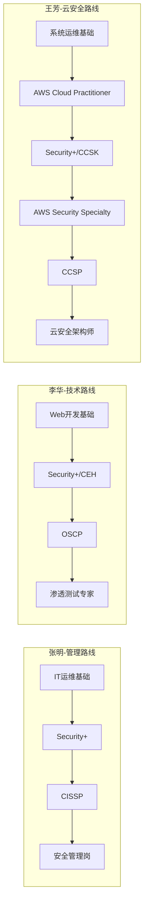
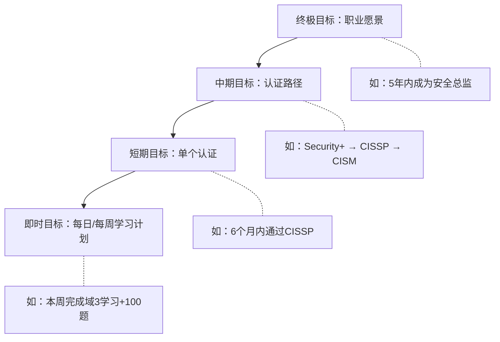
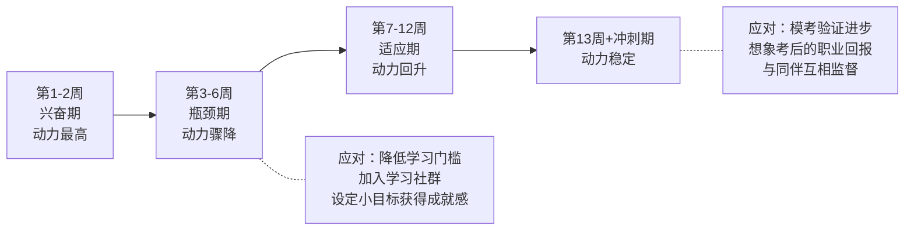
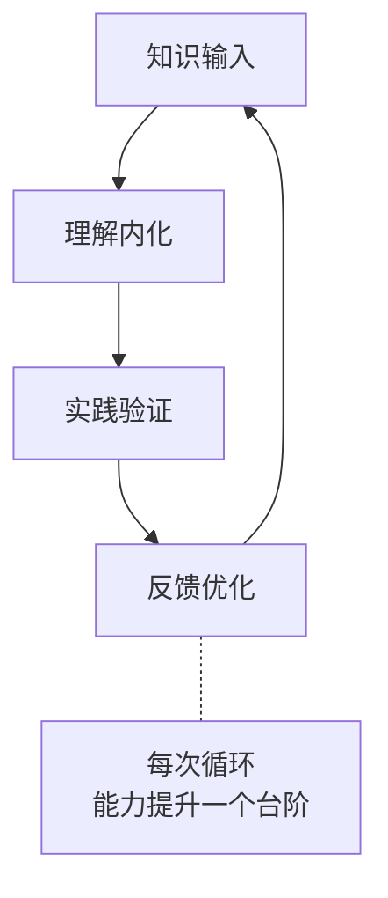
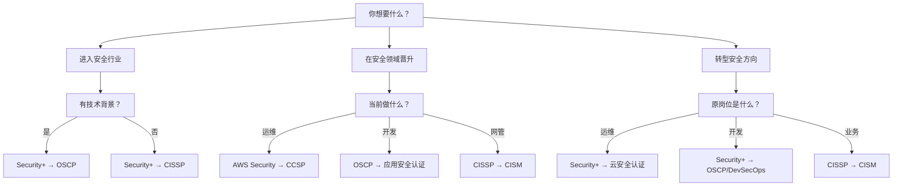
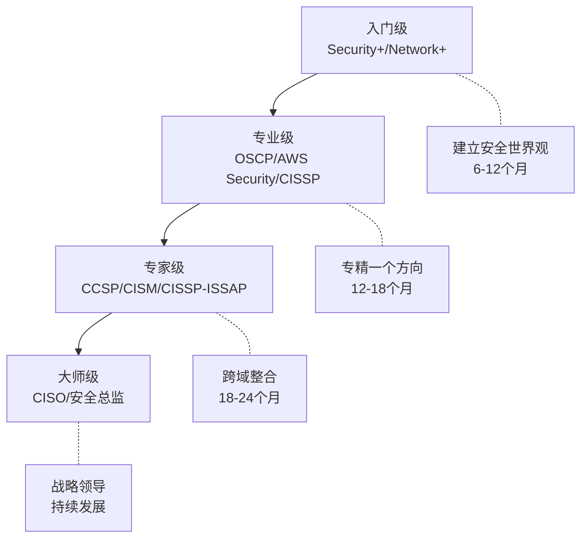

## 28.4 案例总结与经验提炼

在前六节的实战案例中，我们见证了三位背景迥异的从业者——从零基础转型安全管理的张明、从Web开发切入渗透测试的李华、以及从系统运维升级为云安全架构师的王芳——如何通过差异化的认证路径实现职业跃迁。本节将对这六个案例进行系统化的横向对比与深度提炼，从"道"（底层规律）、"法"（方法论框架）、"术"（具体技巧）、"器"（工具资源）四个层面构建可复用的认证成功模型，帮助读者从他人的经验中提取属于自己的行动方案。

---

### 28.4.1 案例全景对比：三个人，三条路

#### 28.4.1.1 主人公画像对比

| 维度 | 张明（案例一） | 李华（案例二） | 王芳（案例三/四） |
|------|---------------|---------------|-------------------|
| 年龄 | 30岁 | 25岁 | 28岁 |
| 专业背景 | 计算机科学本科 | 信息安全本科 | 网络工程本科 |
| 原有经验 | 5年IT运维 | 2年Web开发 | 3-4年系统/云运维 |
| 转型方向 | 安全管理（CISSP） | 渗透测试（OSCP体系） | 云安全架构（CCSP体系） |
| 核心动机 | 职业瓶颈，寻求管理通道 | 兴趣驱动，追求技术深度 | 实际事故触发安全意识 |
| 规划周期 | 1年 | 2年 | 1.5-18个月 |
| 投入时间/周 | 10-15小时 | 15-20小时 | 10-15小时 |
| 英语水平 | CET-4 | CET-6（较好） | CET-6 |
| 认证数量 | 1个（CISSP） | 3-4个（Security+→CEH→OSCP） | 4个（CP→Sec+→AWS Sec→CCSP） |

#### 28.4.1.2 认证路径对比



三条路径的核心区别在于：

| 路径类型 | 核心认证 | 侧重点 | 适合人群 |
|----------|---------|--------|---------|
| 管理路线（张明） | CISSP | 安全治理、风险管理、合规、战略 | 有IT经验、追求管理岗位的从业者 |
| 技术路线（李华） | OSCP | 渗透测试、漏洞挖掘、攻防实战 | 有编程基础、追求技术深度的安全爱好者 |
| 云安全路线（王芳） | CCSP + AWS Security | 云架构安全、IAM、合规、多云 | 有运维经验、面向云转型的IT从业者 |

#### 28.4.1.3 投入产出对比

| 维度 | 张明 | 李华 | 王芳 |
|------|------|------|------|
| 总备考时间 | 约600小时 | 约1200小时 | 约800小时 |
| 总财务投入 | ≈$2,500 | ≈$4,000 | ≈$3,000-5,000 |
| 薪资变化 | +25%（转管理） | +40%（转安全技术） | +40-75%（云安全架构） |
| 回本周期 | 3-6个月 | 2-3个月 | 3-6个月 |
| 职业天花板 | CISO/安全总监 | 安全顾问/技术专家 | 云安全架构师/安全负责人 |

> **关键发现**：三条路径虽然起点不同、终点各异，但在方法论层面呈现出惊人的一致性——都需要"规划→学习→实践→反馈"的闭环。路径的差异只是"选择"的不同，成功的方法是"共通"的。

---

### 28.4.2 成功要素的深层解构

从六个案例中提炼出的"成功要素"不仅仅是五个简单的要点，而是一个层次分明、相互关联的系统。以下从四个维度进行深度解构。

#### 28.4.2.1 第一层：目标驱动——"为什么"决定"怎么走"

**核心原则：没有清晰目标的认证规划，就像没有目的地的旅行。**

张明选择CISSP是因为他看到了安全管理岗位的长期价值；李华选择OSCP是因为他热爱攻防实战；王芳选择云安全认证是因为她在实际工作中遭遇了云安全事件。三个人的共同点是：**先有"为什么"，再有"考什么"**。

很多认证备考者犯的第一个错误是"看到什么热考什么"——听说CISSP含金量高就去考CISSP，听说OSCP很酷就去考OSCP，完全没有考虑这与自己的职业目标是否匹配。结果要么备考动力不足中途放弃，要么考过了发现对职业发展帮助不大。

**目标设定的SMART框架**：

| 要素 | 含义 | 错误示例 | 正确示例 |
|------|------|---------|---------|
| Specific（具体） | 明确要考什么认证 | "我要考个安全认证" | "我要在12个月内考取CISSP" |
| Measurable（可量化） | 有可衡量的进度指标 | "好好学习" | "每周完成1个知识域+100道练习题" |
| Achievable（可实现） | 基于现实条件评估 | "0基础半年考CISSP" | "先考Security+打基础，1年后再考CISSP" |
| Relevant（相关性） | 与职业目标一致 | "运维岗考渗透测试认证" | "运维岗考云安全认证，支撑云转型" |
| Time-bound（有时限） | 设定明确时间节点 | "有空就学" | "12月31日前完成考试" |

**目标层次模型**：



#### 28.4.2.2 第二层：系统规划——"怎么走"决定效率

**核心原则：系统化的方法论让备考效率提升2-3倍。**

三个案例中最显著的差异不是谁更聪明，而是谁的系统更完善。王芳的18个月路线图堪称教科书级别——她把整个认证旅程拆解为4个阶段，每个阶段有明确的认证目标、学习计划、实操任务和财务预算。这种系统化的规划让她的每一步都有据可依、有迹可循。

**系统化规划的五个支柱**：

| 支柱 | 含义 | 案例中的体现 |
|------|------|-------------|
| 阶段分解 | 把大目标拆成可执行的小步骤 | 王芳：4阶段18个月，每阶段1-2个认证 |
| 资源匹配 | 为每个阶段选择合适的学习资源 | 李华：教材+视频+题库+社区的组合 |
| 进度追踪 | 量化学习进度，及时发现偏差 | 张明：每周模拟测试，追踪正确率趋势 |
| 风险预案 | 提前考虑可能的障碍和应对方案 | 王芳：预留20%缓冲时间应对意外 |
| 反馈循环 | 定期评估效果并调整策略 | 刘洋（案例六）：首次失败后彻底调整方法 |

**学习计划的时间分配模型**：

根据三个案例的数据，一个典型的认证备考时间分配如下：

| 阶段 | 占比 | 内容 | 时长参考（以CISSP 600小时为例） |
|------|------|------|-------------------------------|
| 知识输入 | 35% | 阅读教材、观看视频、听课 | 210小时 |
| 主动练习 | 30% | 做题、实操、写笔记 | 180小时 |
| 复盘强化 | 20% | 错题分析、薄弱域补强、间隔复习 | 120小时 |
| 模拟冲刺 | 15% | 全真模考、考场策略训练 | 90小时 |

#### 28.4.2.3 第三层：持续努力——"坚持"不是口号，而是习惯

**核心原则：认证备考是马拉松，不是百米冲刺。**

王芳的做法值得所有人学习：她从不要求自己每天学习4小时（那不可持续），而是承诺"每天至少1小时"。在180天的备考周期里，她有超过160天完成了学习目标。这种"低门槛坚持"的策略，比"高强度冲刺"有效得多。

**坚持的科学依据——习惯回路**：

根据James Clear在《原子习惯》中提出的习惯养成模型：

```text
提示 → 渴望 → 回应 → 奖励 → （重复形成习惯）
```

将认证备考嵌入日常习惯的方法：

| 环节 | 应用方法 | 案例支撑 |
|------|---------|---------|
| 提示 | 固定时间、固定地点学习（如每天晚上8点书桌前） | 王芳：每天20:00-22:00固定学习 |
| 渴望 | 连接学习与职业回报（"每学1小时 = 加薪1%"） | 张明：每次想放弃就看安全管理岗的招聘要求 |
| 回应 | 降低启动门槛（"只学15分钟也行"） | 王芳：碎片时间用Anki复习 |
| 奖励 | 阶段性庆祝（"考完一章就吃顿好的"） | 李华：每通过一个认证就奖励自己一次旅行 |

#### 28.4.2.4 第四层：灵活调整——计划赶不上变化时怎么办

**核心原则：好的计划不是完美的计划，而是能灵活调整的计划。**

三个案例中没有一个人完全按照最初的计划执行。张明原计划6个月考完CISSP，实际用了10个月；王芳在备考过程中遇到了S3安全事件，临时调整了学习重点。关键在于：**调整不是放弃，而是基于新信息的优化**。

**PDCA持续改进循环在认证备考中的应用**：

| 阶段 | 行动 | 频率 | 案例实例 |
|------|------|------|---------|
| Plan（计划） | 制定/更新学习计划 | 每月1次 | 王芳：每月初规划当月学习重点 |
| Do（执行） | 按计划学习和练习 | 每日 | 每天固定时间学习 |
| Check（检查） | 评估进度和效果 | 每2周1次 | 张明：每2周做一次模拟测试 |
| Act（改进） | 调整策略和资源 | 每月1次 | 李华：发现CEH不够实用后转向OSCP |

---

### 28.4.3 常见挑战的系统化应对策略

认证备考过程中，几乎每个人都会遇到以下四类挑战。三个案例的主人公都曾面对这些问题，他们的应对策略值得借鉴。

#### 28.4.3.1 挑战一：时间不足

**问题本质**：不是没有时间，而是时间没有被有效组织。

**量化分析**：以一个标准的白领为例，每天可用于学习的时间窗口：

| 时间段 | 时长 | 适合做什么 | 王芳的做法 |
|--------|------|-----------|-----------|
| 通勤路上 | 30-60分钟 | 听音频、刷Anki闪卡 | 听AWS安全白皮书音频版 |
| 午休时间 | 30分钟 | 快速复习笔记 | 用手机看错题本 |
| 晚间集中学习 | 1.5-2小时 | 深度学习新知识 | 20:00-22:00系统学习 |
| 周末上午 | 2-4小时 | 实操练习、模拟考试 | 在AWS账户中动手实验 |
| **日均总计** | **3-5小时** | — | — |

**实用技巧**：

| 技巧 | 具体做法 | 适用场景 |
|------|---------|---------|
| 番茄工作法 | 25分钟学习+5分钟休息，4轮后休息15分钟 | 需要高度集中注意力时 |
| 时间块法 | 将一天分为"学习块"和"生活块"，互不干扰 | 需要长期保持节奏时 |
| 最低承诺法 | "每天至少15分钟"——再忙也不能低于这个底线 | 工作特别忙的时期 |
| 碎片整合法 | 把碎片时间的产出（闪卡、笔记）汇总到主学习中 | 通勤、等待等场景 |

#### 28.4.3.2 挑战二：知识难点

**问题本质**：不是学不会，而是学习方法不对。

三个案例中的主人公都遇到了各自的知识难点：

| 案例 | 知识难点 | 根因分析 | 解决方法 |
|------|---------|---------|---------|
| 张明 | CISSP域8（软件开发安全） | 缺乏开发背景 | 用费曼学习法，给同事讲解；观看白帽黑客的代码审计视频 |
| 李华 | OSCP的缓冲区溢出 | 数学基础薄弱 | 拆解为3步：理解原理→手工计算→工具验证，逐步推进 |
| 王芳 | KMS密钥管理的层级关系 | 概念抽象 | 在AWS账户中实际创建CMK、数据密钥，用实操验证理论 |

**攻克知识难点的三步法**：

```text
第一步：定位盲区
  └── 做题 → 标记错误 → 分析错误类型（知识型/理解型/审题型）
  
第二步：多角度学习
  └── 教材（文字）→ 视频（动画）→ 实操（动手）→ 讨论（交流）
  └── 重点：同一个知识点至少用2种方式学习
  
第三步：验证掌握
  └── 合上书复述 → 做同类题巩固 → 费曼讲解法
```

#### 28.4.3.3 挑战三：考试压力

**问题本质**：压力不是来自考试本身，而是来自"不确定感"。

**压力来源分析**：

| 压力类型 | 表现 | 应对策略 |
|----------|------|---------|
| 知识焦虑 | "总觉得没学完" | 设定明确的"学习完成线"（如模拟考稳定>70%即可） |
| 时间焦虑 | "来不及了" | 优先级排序，聚焦高权重域 |
| 经济焦虑 | "考不过钱白花了" | 选择有免费重考政策的认证 |
| 比较焦虑 | "别人都考过了" | 关注自己的进步曲线，不与他人比较 |

**考场心态管理**：

1. **考前48小时**：停止学习新内容，只复习错题本和思维导图
2. **考前1天**：散步、运动、保证7-8小时睡眠
3. **考试当天**：清淡早餐，提前1小时到场，15分钟深呼吸平静心态
4. **考试中**：遇到不会的题先跳过，标记后回头处理，不纠结单题

#### 28.4.3.4 挑战四：动力维持

**问题本质**：初期热情消退后，如何保持学习动力。

**动力衰减曲线与应对**：



**维持动力的实用策略**：

| 策略 | 具体做法 | 原理 |
|------|---------|------|
| 可视化进度 | 在日历上标记学习天数，形成"链条" | 损失厌恶——不想断链 |
| 即时奖励 | 每完成一章就打一个勾/吃一颗糖 | 多巴胺回路激活 |
| 社交承诺 | 在朋友圈宣布目标，接受监督 | 社会承诺效应 |
| 成本锚定 | 计算已投入的时间和金钱成本 | 沉没成本促进坚持 |
| 榜样激励 | 阅读成功案例，想象自己考后的样子 | 自我效能感提升 |

---

### 28.4.4 认证规划的"道法术器"框架

将三个案例的方法论提炼为一个可复用的四层框架：

#### 28.4.4.1 道：底层规律

认证成功的底层规律是**能力成长的螺旋上升模型**：



这个模型的核心洞察是：**知识不是线性增长的，而是螺旋上升的**。每经历一次"学习→实践→反馈"的循环，你对知识的理解就会深入一层。王芳学习IAM就是典型例子——第一次学是"知道有这个服务"，第二次是"会配置基本策略"，第三次是"理解权限边界的最佳实践"，第四次是"能在架构设计中合理运用"。

#### 28.4.4.2 法：方法论框架

**三阶段递进法**（适用于大多数安全认证）：

| 阶段 | 目标 | 时间占比 | 核心活动 | 里程碑 |
|------|------|---------|---------|--------|
| 基础构建期 | 建立知识框架 | 40% | 教材精读+视频辅助 | 章节测试正确率>70% |
| 强化突破期 | 深化理解+大量练习 | 35% | 刷题+错题分析+实操 | 模拟考正确率>70% |
| 冲刺模考期 | 查漏补缺+考场适应 | 25% | 全真模考+策略训练 | 模拟考正确率>75% |

**认知升级法**（适用于管理类认证如CISSP）：

```text
技术员思维 → 工程师思维 → 架构师思维 → 管理者思维
    ↓              ↓              ↓              ↓
  "怎么做"     "为什么做"    "做什么最优"   "如何平衡"
```

张明备考CISSP的核心挑战就是完成从"工程师思维"到"管理者思维"的跨越。这需要刻意练习：每做一道题，先问"如果我是CISO/安全经理，我的决策依据是什么？"

#### 28.4.4.3 术：具体技巧

从三个案例中提炼的高频实用技巧：

**学习技巧**：

| 技巧 | 做法 | 效果 | 提供者 |
|------|------|------|--------|
| 费曼学习法 | 学完一个概念，用自己的话讲给别人听 | 讲不清楚说明没真正理解 | 王芳 |
| 间隔重复 | 用Anki制作闪卡，每天复习15分钟 | 长期记忆效果提升300%+ | 王芳 |
| 错题归因 | 每道错题标记错误类型：知识型/理解型/审题型 | 精准定位薄弱环节 | 张明 |
| 思维导图 | 每学完一个域画一张脑图 | 建立知识之间的连接 | 李华 |
| 对比学习 | 把相似概念放在一起比较（如DAC vs MAC vs RBAC） | 深度理解差异 | 张明 |

**做题技巧**：

| 技巧 | 适用场景 | 具体做法 |
|------|---------|---------|
| 排除法 | 选择题（尤其是4选1） | 先排除2个明显错误的，在剩余2个中选最优 |
| 关键词定位 | 情景题/案例题 | 圈出题干中的限定词（如"最优先""最低成本"） |
| 反向验证 | 不确定时 | 把你选的答案代入题干，看是否自洽 |
| 时间分段 | 长时间考试（如CISSP 4小时） | 每50题检查一次时间，落后则加速 |
| 标记系统 | 不确定的题目 | 用考试系统自带的标记功能，先跳过再回头 |

#### 28.4.4.4 器：工具与资源

**工具矩阵**——三个案例中反复出现的高效工具：

| 工具类别 | 推荐工具 | 用途 | 费用 |
|----------|---------|------|------|
| 间隔重复 | Anki | 闪卡复习，利用碎片时间 | 免费 |
| 知识管理 | Notion / Obsidian | 错题本、学习笔记、进度追踪 | 免费 |
| 思维导图 | XMind / ProcessOn | 知识结构化、复习用脑图 | 免费版 |
| 题库平台 | TutorialsDojo / Whizlabs | 模拟考试、按域刷题 | $15-50 |
| 动手实验 | AWS Free Tier / TryHackMe | 实操练习、环境搭建 | 免费-$20/月 |
| 视频学习 | A Cloud Guru / Udemy | 系统性视频课程 | $10-50 |
| 社区交流 | Reddit / 微信备考群 | 经验分享、疑难讨论 | 免费 |

---

### 28.4.5 不同背景读者的认证路径推荐

基于三个案例的经验，以下为不同背景的读者提供个性化的认证路径建议：

#### 28.4.5.1 按现有经验推荐

| 你的背景 | 推荐路径 | 预计周期 | 投入预算 | 目标岗位 |
|----------|---------|---------|---------|---------|
| IT运维/系统管理 | Security+ → AWS Security Specialty → CCSP | 12-18个月 | $2,000-4,000 | 云安全工程师/架构师 |
| Web/软件开发 | Security+ → CEH → OSCP | 12-24个月 | $2,500-5,000 | 安全开发工程师/渗透测试 |
| 网络工程 | Security+ → CISSP | 12-18个月 | $2,000-3,500 | 安全架构师/安全经理 |
| 纯小白（转行） | CompTIA A+ → Network+ → Security+ → 领域认证 | 18-36个月 | $1,500-3,000 | 安全运维/安全助理 |
| 在校学生 | Security+ → CTF比赛经验 → OSCP/实习 | 毕业前1-2年 | $500-2,000 | 安全实习生/初级安全工程师 |

#### 28.4.5.2 按职业目标推荐

| 你的目标 | 核心认证 | 辅助认证 | 需要的能力侧重 |
|----------|---------|---------|--------------|
| 安全管理/CISO | CISSP → CISM | CRISC、审计经验 | 风险管理、合规、沟通、战略 |
| 渗透测试专家 | OSCP → OSWE → OSEP | CTF成绩、CVE编号 | 攻击技术、编程、报告撰写 |
| 云安全架构师 | AWS Security → CCSP | Azure/GCP安全认证 | 云架构、IAM、合规、DevSecOps |
| 安全合规专家 | CISSP → CISA | ISO 27001 LA、PCI QSA | 审计、法规、框架 |
| 安全研究员 | 无固定路径 | 学术论文、会议演讲 | 研究能力、写作、编程 |

#### 28.4.5.3 认证选择的决策树



---

### 28.4.6 投资回报率（ROI）深度分析

认证是一项投资，既然是投资就必须考虑回报。以下基于三个案例的实际数据和行业调研，分析主要安全认证的投资回报率。

#### 28.4.6.1 主流安全认证ROI对比

| 认证 | 总投入（含考试+学习+时间） | 薪资提升幅度 | 年化ROI | 投资回收期 |
|------|--------------------------|-------------|---------|-----------|
| Security+ | $1,500-2,500 | +$5,000-8,000/年 | 200-400% | 3-6个月 |
| CEH | $2,000-3,500 | +$5,000-10,000/年 | 150-300% | 3-6个月 |
| OSCP | $3,000-5,000 | +$15,000-25,000/年 | 300-500% | 2-4个月 |
| AWS Security Specialty | $2,000-4,000 | +$15,000-30,000/年 | 375-750% | 2-3个月 |
| CISSP | $4,000-7,000 | +$20,000-35,000/年 | 285-500% | 3-5个月 |
| CCSP | $3,000-5,000 | +$15,000-25,000/年 | 300-500% | 3-5个月 |
| CISM | $3,000-5,000 | +$15,000-25,000/年 | 300-500% | 2-4个月 |

> **注**：以上数据基于ISC²、ISACA、CompTIA等行业报告的中位数估计。实际回报因地区、行业、个人能力等因素而异。一线城市和海外市场的薪资提升幅度通常更高。

#### 28.4.6.2 王芳案例的详细ROI计算

```text
总投入：
  考试费：$100 + $395 + $300 + $599 = $1,394
  学习资料：$500
  实操环境：$1,800（18个月 × $100/月）
  时间成本：800小时 × $50/小时 = $40,000（机会成本）
  总计：约 $43,694

总回报（以3年为周期）：
  薪资增量：$7,000/月 × 36个月 = $252,000
  职业机会：云安全架构师的岗位需求增长40%+
  3年ROI：约 477%
```

---

### 28.4.7 避坑指南：认证规划的十大误区

从三个案例和行业调研中，总结出认证规划中最常见的十个误区及其纠正方法：

| 编号 | 误区 | 错误做法 | 正确做法 | 案例佐证 |
|------|------|---------|---------|---------|
| 1 | 盲目追求认证数量 | 1年内考5-6个入门级认证 | 聚焦1-2个与目标相关的认证 | 王芳：4个认证构成完整体系，而非散弹式 |
| 2 | 只看书不做题 | 反复阅读教材但不做练习 | 学一章做一章题，边学边练 | 李华：大量实操练习是OSCP通过的关键 |
| 3 | 一次失败就放弃 | 首次未通过就转行 | 分析原因，调整策略再战 | 刘洋（案例六）：首次失败后系统调整，最终成功 |
| 4 | 考过就停止学习 | 拿到证书后完全停止学习 | 持续积累CPE学分，保持知识更新 | 张明：CISSP后继续考CISM |
| 5 | 认证等于能力 | 认为有证书就是专家 | 证书+经验+持续学习=真正的专家 | 王芳：每次学习后都在工作中实践 |
| 6 | 忽视英语能力 | 只用中文资料 | 逐步过渡到英文原版资料 | 王芳：从第二阶段开始阅读英文教材 |
| 7 | 闭门造车 | 一个人埋头苦学 | 加入学习社群，定期交流 | 李华：Reddit社区是OSCP备考的重要资源 |
| 8 | 忽视实操 | 只做选择题不搭环境 | 每个知识点都亲手上机验证 | 王芳：AWS Free Tier是最佳实操平台 |
| 9 | 跳级备考 | 0基础直接考CISSP | 按"由浅入深"的顺序递进 | 张明：先考Security+打基础 |
| 10 | 忽视软技能 | 只关注技术能力 | 沟通、文档、培训能力同样重要 | 张明：CISSP考试本身就在考察管理者思维 |

---

### 28.4.8 认证后的持续发展路径

拿到认证不是终点，而是新阶段的起点。三个案例的主人公在获得认证后都面临同一个问题：**接下来做什么？**

#### 28.4.8.1 CPE（继续教育学分）维护

大多数高级安全认证（CISSP、CCSP、CISM等）要求持证者每年积累40-60个CPE学分，以保持证书有效性。以下是常见的CPE获取途径：

| 途径 | CPE学分 | 频率 | 说明 |
|------|---------|------|------|
| 行业会议（如RSA、Black Hat、ISC² Congress） | 5-15/次 | 每年1-2次 | 同时拓展人脉 |
| 在线课程（如Cybrary、SANS Webcast） | 1-4/门 | 每季度1-2门 | 碎片化学习 |
| 安全社区演讲/分享 | 2-5/次 | 每年2-4次 | 建立个人品牌 |
| 发表安全文章/博客 | 2-5/篇 | 每月1-2篇 | 知识沉淀 |
| 志愿安全服务 | 1-3/次 | 每年1-2次 | 社区回馈 |

#### 28.4.8.2 进阶认证路径



#### 28.4.8.3 从持证者到行业专家的四步跃迁

| 阶段 | 目标 | 关键行动 | 案例示范 |
|------|------|---------|---------|
| 第1步：巩固 | 在工作中应用认证知识 | 主动承担安全相关项目 | 王芳：主导S3安全基线加固 |
| 第2步：分享 | 输出内容，建立个人品牌 | 写博客、做演讲、参与社区 | 王芳：在AWS User Group分享经验 |
| 第3步：连接 | 拓展行业人脉 | 参加行业会议、加入专业组织 | 三个案例都加入了相关安全社区 |
| 第4步：引领 | 成为某一领域的专家 | 参与标准制定、出版、教学 | 张明的目标：5年内成为安全总监 |

---

### 28.4.9 本节小结

回顾本节的分析，我们可以得出以下核心结论：

1. **认证路径没有标准答案**：张明、李华、王芳三条不同的路径都通向了成功。关键是选择与自身背景和职业目标匹配的路径，而不是盲目追随"最热门"的认证。

2. **方法论比努力更重要**：系统化的规划、科学的学习方法、持续的复盘优化，这三者的组合比单纯的"刻苦努力"有效得多。王芳的18个月路线图证明了"好计划+稳定执行"的力量。

3. **认证是手段，不是目的**：认证的真正价值不在于证书本身，而在于备考过程中建立的知识体系和在工作中应用这些知识的能力。三个案例的主人公都在拿到认证后持续学习、持续实践。

4. **每个人都可以复制成功**：三个案例的主人公都是普通人——没有天才的智商，没有无限的资源。他们的成功来源于正确的方法、持续的坚持和灵活的调整。这些要素，任何一个读者都具备。

> **给读者的行动建议**：在继续阅读后续案例之前，花10分钟思考以下三个问题：
> - 我的职业目标是什么？（3-5年后的理想状态）
> - 哪个认证最能支撑这个目标？
> - 我现在处于什么水平？从哪里开始最合适？
> 
> 把答案写下来，它将成为你后续学习的锚点。当你迷茫或想放弃时，回到这个锚点，重新确认方向。
