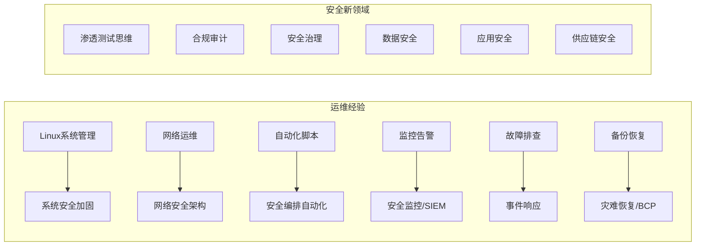
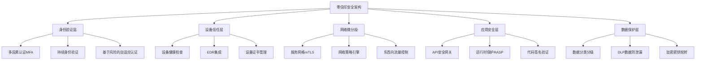
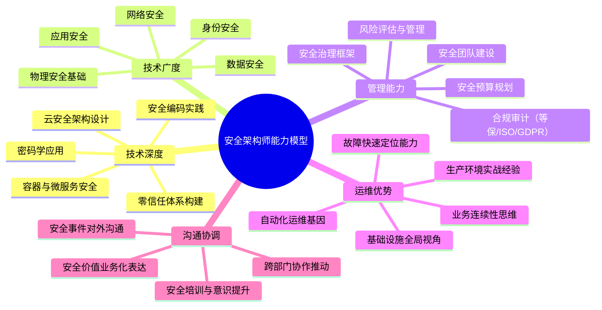

## 28.5 案例四：从运维到安全架构师的转型之路

### 28.5.1 背景介绍

**主人公**：陈伟，35岁，10年IT运维经验，目前担任某互联网公司的运维团队负责人。随着公司业务的云化转型，他深刻意识到安全技能的不可或缺性——容器逃逸、供应链攻击、云配置错误等事件频发，"运维不懂安全"正成为企业最大的单点风险。

**目标**：利用现有运维经验，转型为云安全架构师，计划在2年内建立完整的安全认证体系。

**转型动因分析**：

1. **行业趋势驱动**：Gartner预测到2027年，90%的企业将采用云原生架构，云安全支出年复合增长率超过25%。运维工程师如果不具备安全能力，将在云原生时代被边缘化。
2. **职业天花板**：纯运维岗位的薪资中位数在一线城市约25-35K/月，而云安全架构师的薪资中位数在45-65K/月，且岗位需求增速远超供给。
3. **技术融合趋势**：DevSecOps、SRE安全、零信任架构等概念的兴起，使得"运维+安全"成为最稀缺的复合型人才。

**SWOT分析**：

| 维度 | 详细内容 |
|------|----------|
| **优势（S）** | ① 深厚的Linux/Windows运维经验，理解操作系统底层机制；② 熟悉网络架构（TCP/IP、负载均衡、CDN），具备网络层安全直觉；③ 有项目管理能力，能推动跨部门安全项目落地；④ 对企业IT基础设施有全局认知，理解业务连续性需求；⑤ 已有自动化脚本能力（Shell/Python），可快速上手安全工具链 |
| **劣势（W）** | ① 年龄偏大（35岁），学习新领域的时间成本高；② 缺乏安全专业背景，对攻防思维模式不熟悉；③ 安全领域的知识体系庞大，从渗透测试到合规审计跨度大；④ 家庭压力下可支配学习时间有限（约10-15小时/周） |
| **机会（O）** | ① 公司正在组建安全团队，内部转岗机会明确；② 云安全人才缺口大，AWS/Azure/阿里云认证持有者供不应求；③ 运维背景是天然优势——安全架构师必须理解系统如何运作才能设计防御；④ 企业安全合规需求（等保2.0、GDPR）推动安全岗位扩张 |
| **威胁（T）** | ① 年轻竞争者学习能力强，可能在纯攻防赛道超越；② 安全技术更新快，需要持续投入；③ AI驱动的安全工具可能替代部分基础安全运维工作 |

**关键洞察**：陈伟的最大优势恰恰是"从运维视角理解安全"。大多数安全科班出身的人缺乏对生产环境复杂性的真实理解，而运维人员每天都在和这些复杂性打交道。这个优势远大于"缺安全背景"的劣势。

### 28.5.2 认证规划与时间线

```mermaid
gantt
    title 陈伟2年安全认证路线图
    dateFormat YYYY-MM
    axisFormat %Y-%m
    
    section 第一阶段：夯实基础（0-6月）
    CompTIA Security+           :a1, 2025-01, 3M
    Linux安全加固实践           :a2, 2025-01, 2M
    
    section 第二阶段：云安全专精（7-12月）
    AWS Certified Security Specialty :b1, 2025-07, 4M
    安全工具链实战              :b2, 2025-08, 3M
    
    section 第三阶段：架构与管理（13-18月）
    CISSP                       :c1, 2025-13, 5M
    TOGAF安全架构               :c2, 2025-15, 3M
    
    section 第四阶段：高阶认证（19-24月）
    CCSP（云安全专家）          :d1, 2026-19, 4M
    行业实战项目                :d2, 2026-20, 4M
```

#### 第一阶段（0-6个月）：夯实安全基础

**目标认证**：CompTIA Security+

**为什么从Security+开始**：

Security+ 是全球公认的安全入门认证，覆盖安全基础概念、威胁与漏洞、身份管理、密码学、网络安全等核心领域。对于运维转型者而言，它的价值在于：
- 建立系统化的安全知识框架，而非零散的经验碎片
- 与运维知识产生共振——很多安全概念（如访问控制、网络分段）在运维中已有实践基础
- 获得行业认可的基础资质，为后续高级认证铺路

**学习计划**：

| 周次 | 主题 | 运维经验对接点 | 学习资源 |
|------|------|---------------|----------|
| 1-2周 | 威胁、攻击与漏洞 | 日志分析中见过的攻击模式 | Darril Gibson《CompTIA Security+ Study Guide》 |
| 3-4周 | 架构与设计 | 已有的网络拓扑设计经验 | Cybrary Security+课程 |
| 5-6周 | 实现与运营 | 系统加固、补丁管理的延伸 | 官方练习题 + 实验环境 |
| 7-8周 | 身份管理与访问控制 | AD/LDAP管理经验的深化 | NIST SP 800-63数字身份指南 |
| 9-10周 | 密码学基础 | TLS/SSL配置经验的理论补充 | Cryptography Engineering（Schneier） |
| 11-12周 | 综合复习与模拟考试 | — | CompTIA CertMaster练习平台 |

**运维到安全的知识映射**：



**配套实践**：
- 搭建家庭安全实验室：用VirtualBox/KVM创建隔离靶机环境，部署DVWA、Metasploitable等靶机
- 每周完成2-3个TryHackMe/HTB入门房间，建立攻防直觉
- 将日常运维脚本安全化：加入输入验证、权限最小化、日志审计

#### 第二阶段（7-12个月）：云安全专精

**目标认证**：AWS Certified Security Specialty

**核心学习内容**：

1. **AWS安全架构**（占比30%）：
   - IAM策略与最小权限原则：从运维中"给个sudo权限"转变为细粒度的IAM Policy设计
   - VPC安全设计：安全组、NACL、VPC Peering的安全配置，对应运维中对防火墙规则的管理
   - KMS密钥管理与加密策略：静态加密、传输加密、信封加密模式

2. **数据保护与合规**（占比20%）：
   - S3存储桶安全配置（ACL、策略、访问点）
   - RDS加密与备份策略
   - CloudTrail审计日志与GuardDuty威胁检测的联动

3. **基础设施安全**（占比25%）：
   - EC2实例安全基线：AMI硬化、实例配置文件、安全组最佳实践
   - Lambda函数安全：执行角色、环境变量加密、依赖安全扫描
   - ECS/EKS容器安全：镜像扫描、网络策略、Pod安全策略

4. **事件响应与安全监控**（占比15%）：
   - Security Hub + GuardDuty + Macie的统一安全视图
   - CloudWatch Logs Insights进行安全日志分析
   - AWS Config规则实现配置合规自动化

5. **身份管理与隐私**（占比10%）：
   - AWS SSO与企业IdP集成
   - Amazon Cognito用户池安全配置

**运维经验的独特优势**：

对于已有AWS运维经验的陈伟来说，安全认证的学习可以大幅加速。运维人员对以下概念已有直观理解：
- EC2实例的启动和管理 → 直接延伸到实例安全配置
- VPC网络规划 → 直接延伸到网络层安全设计
- CloudWatch监控 → 直接延伸到安全监控与告警
- CloudFormation/IaC → 直接延伸到安全合规自动化

**实战项目**：为公司搭建一套AWS安全基线自动化部署方案（CloudFormation/Terraform），作为认证学习的实战成果，同时为公司创造实际价值。

#### 第三阶段（13-18个月）：架构与管理能力

**目标认证**：CISSP（信息系统安全专业认证）

**为什么CISSP是转型的关键转折点**：

CISSP不是技术认证，而是安全管理和架构认证。它涵盖8个领域：
- 安全与风险管理（占比15%）
- 资产安全（占比10%）
- 安全架构与工程（占比13%）
- 通信与网络安全（占比13%）
- 身份与访问管理（占比13%）
- 安全评估与测试（占比12%）
- 安全运营（占比13%）
- 软件开发安全（占比11%）

对于陈伟这样有管理经验的运维人员，CISSP的学习过程是从"如何做好一件事"到"如何设计和运营整个安全体系"的思维跃迁。

**CISSP学习策略**：

| 方法 | 具体操作 | 时间投入 |
|------|----------|----------|
| 系统学习 | 《CISSP All-in-One Exam Guide》精读 | 每天1小时 |
| 思维训练 | 每个领域写出"如果我是CISO，如何设计这个领域的安全策略" | 每周2小时 |
| 案例研究 | 研读Target数据泄露、Equifax事件、SolarWinds供应链攻击等经典案例 | 每周1小时 |
| 模拟考试 | 每两周做一次Full-length模拟考试 | 每次3小时 |
| 社区交流 | 加入CISSP备考群，参与案例讨论 | 灵活安排 |

**与运维经验的协同**：

CISSP的"安全运营"和"安全评估"领域与运维高度重合——变更管理、配置管理、灾难恢复、业务连续性这些都是运维的日常。陈伟需要重点突破的是安全治理、合规框架、以及软件开发安全这些此前接触较少的领域。

#### 第四阶段（19-24个月）：高阶认证与综合实战

**目标认证**：CCSP（Certified Cloud Security Professional）

CCSP是CISSP的云安全延伸版本，由ISC²和CSA联合推出。持有CISSP后学习CCSP，约有60%的知识内容重叠，学习效率极高。

**CCSP六大知识域**：
1. 云计算概念、架构和设计
2. 云数据安全
3. 云平台与基础设施安全
4. 云应用安全
5. 云安全运维
6. 云法律合规与风险管理

**综合实战项目**：

在获得以上认证后，陈伟需要一个旗舰级实战项目来证明自己的安全架构能力。建议设计以下项目：

**项目：企业零信任安全架构设计**



### 28.5.3 运维经验的独特转化价值

运维人员转型安全架构师，并非从零开始，而是将已有能力进行"安全化升级"。以下是核心能力的转化映射：

| 运维核心能力 | 安全架构转化 | 转化难度 | 转化路径 |
|-------------|-------------|---------|---------|
| 系统故障排查 | 安全事件响应与取证分析 | ★★☆☆☆ | 学习事件响应流程（PICERL模型），将排查思维应用于安全事件 |
| 网络配置管理 | 网络安全架构设计 | ★★☆☆☆ | 在网络知识基础上补充防火墙策略、IDS/IPS、网络分段 |
| 自动化运维 | 安全编排与自动化响应（SOAR） | ★★☆☆☆ | 将Ansible/Terraform技能应用于安全自动化，学习SOAR平台 |
| 监控告警体系 | SIEM系统建设与安全运营（SOC） | ★★☆☆☆ | 将Prometheus/ELK经验延伸到Splunk/QRadar等SIEM平台 |
| 配置管理 | 安全基线与合规自动化 | ★★★☆☆ | 学习CIS Benchmark、SCAP标准，用IaC实现合规检查 |
| 灾难恢复 | 业务连续性与韧性设计 | ★★★☆☆ | 从备份恢复扩展到完整的BCP/DRP框架设计 |
| 容器/K8s运维 | 容器安全与云原生安全 | ★★★☆☆ | 补充镜像安全扫描、运行时安全、K8s网络策略等 |
| 变更管理 | 安全变更控制与漏洞管理 | ★★★☆☆ | 建立漏洞生命周期管理流程，将变更管理安全化 |

**关键心态转变**：

1. **从"可用性优先"到"安全与可用性平衡"**：运维的核心KPI是系统可用性，而安全架构师需要在可用性、安全性和性能之间找到平衡点。
2. **从"被动响应"到"主动防御"**：运维习惯于出了问题再解决，安全架构需要前置防御——在设计阶段就考虑威胁建模。
3. **从"单点思维"到"体系化思维"**：运维关注单个系统的健康，安全架构需要构建纵深防御体系，考虑攻击链的每个环节。
4. **从"信任网络"到"零信任"**：运维默认内网是可信的，安全架构需要假设网络已被渗透，实施零信任架构。

### 28.5.4 学习资源与时间管理

**每周学习时间分配（假设每周15小时）**：

| 时段 | 内容 | 时长 | 备注 |
|------|------|------|------|
| 工作日早晨 | 理论阅读（认证教材/标准文档） | 1小时×5天 | 利用通勤前的清醒时段 |
| 工作日午休 | 在线课程/视频学习 | 0.5小时×5天 | 手机端学习，灵活安排 |
| 周六上午 | 实验室实操 | 4小时 | 搭建环境、完成靶机挑战 |
| 周六晚上 | 模拟考试/复习 | 2小时 | 检验本周学习成果 |
| 周日上午 | 社区交流/案例研究 | 2小时 | 加入安全社区，参与讨论 |

**推荐学习平台与资源**：

| 平台/资源 | 适用阶段 | 特点 |
|-----------|---------|------|
| TryHackMe | 全阶段 | 引导式学习路径，适合基础到中级 |
| Hack The Box | 第二阶段起 | 高难度靶机，培养实战攻防能力 |
| A Cloud Guru | 第二、四阶段 | AWS/Azure安全认证最佳课程 |
| Cybrary | 全阶段 | 安全认证课程全面覆盖 |
| Cloud Academy | 第二、四阶段 | 云安全实操Lab丰富 |
| SANS Webcast | 全阶段 | 免费安全专题讲座，业界顶级 |
| ISC² Official Training | 第三、四阶段 | CISSP/CCSP官方培训 |
| 《Web安全攻防：渗透测试实战指南》 | 第二阶段 | 中文实战书籍，适合国内环境 |

**利用碎片时间的技巧**：

1. **Anki记忆卡**：将每个知识域的关键概念制作成闪片，利用通勤时间复习
2. **播客学习**：收听Darknet Diaries、Security Now等安全播客，建立安全文化感知
3. **技术博客订阅**：关注Krebs on Security、The Hacker News等，保持对安全态势的感知
4. **工作实践融合**：在日常运维工作中主动发现安全问题并记录，积累案例素材

### 28.5.5 关键里程碑与成果检验

**阶段成果检验标准**：

| 阶段 | 检验方式 | 达标标准 |
|------|----------|----------|
| 第一阶段 | Security+考试通过 | 分数≥750/900 |
| 第二阶段 | AWS安全认证 + 实战项目 | 认证通过 + 公司安全基线方案落地 |
| 第三阶段 | CISSP考试通过 | 考试通过 + 能独立设计安全架构方案 |
| 第四阶段 | CCSP通过 + 零信任架构项目 | 双认证 + 完整的架构设计文档 |

**可量化的职业成果**：

- 安全相关认证：4张（Security+、AWS Security Specialty、CISSP、CCSP）
- 实战项目：至少3个完整安全架构项目
- 技术分享：在公司内部/安全社区做至少5次安全主题分享
- 开源贡献：维护一个安全相关的开源工具或文档项目

### 28.5.6 转型过程中的常见陷阱与应对

**陷阱一：陷入"工具收集者"模式**

许多运维转型者容易犯的错误是花大量时间收集和学习各种安全工具（Nmap、Wireshark、Burp Suite、Metasploit……），但缺乏体系化的知识框架。工具只是手段，安全思维和架构能力才是核心。

**应对**：每学一个工具前，先理解它在安全架构中的位置——它解决什么威胁？保护什么资产？在防御体系的哪个层次？

**陷阱二：忽视合规与治理**

运维人员倾向于关注技术实现，而CISSP等高级认证越来越强调安全治理、风险管理与合规。这是转型中最需要补足的短板。

**应对**：主动参与公司的合规审计项目，阅读等保2.0、ISO 27001、NIST CSF等框架文档，将合规要求转化为可落地的技术控制措施。

**陷阱三：与年轻攻防选手比较渗透测试技能**

运维转型者在纯渗透测试领域很难与安全科班出身的年轻人竞争。与其在别人的赛道上追赶，不如打造"懂安全的架构师"这个差异化定位。

**应对**：聚焦安全架构设计、云安全运营、DevSecOps这些需要深度运维经验的领域，而非追求成为顶尖渗透测试专家。

**陷阱四：低估软技能的价值**

安全架构师需要大量的跨部门沟通——向管理层解释安全投资的价值，推动开发团队修复漏洞，协调运维团队实施安全策略。纯技术思维会导致转型受阻。

**应对**：学习安全治理沟通技巧，练习用业务语言而非技术语言阐述安全方案。推荐阅读《The Manager's Path》和安全治理相关材料。

**陷阱五：学习节奏失控**

35岁的在职人员同时兼顾工作、家庭和高强度学习，很容易出现学习倦怠。一次性报太多考试、同时推进多个学习路径是常见错误。

**应对**：严格遵循单线程推进——每个阶段只聚焦一个认证。利用"最小可交付"原则，每两周产出一个可展示的小成果（实验报告、技术博客、开源贡献）来保持动力。

### 28.5.7 2年后：从运维到安全架构师的蜕变

**预期成果**：

完成2年转型计划后，陈伟将具备以下能力矩阵：



**职业路径选择**：

完成转型后，陈伟有以下职业路径可选：

| 路径 | 描述 | 适合人群 |
|------|------|----------|
| 云安全架构师（甲方） | 在企业内部设计和运营云安全体系 | 偏好稳定性、长期影响 |
| 安全咨询顾问（乙方） | 为多家企业提供安全架构咨询服务 | 偏好多样性、行业视野 |
| CISO/安全负责人 | 负责企业整体安全战略 | 管理能力强者 |
| 独立安全研究员 | 专注特定安全领域的深度研究 | 技术极客倾向 |
| 安全创业 | 基于实战经验开发安全产品/服务 | 有创业意愿和商业嗅觉者 |

**薪资预期对比**：

| 时间点 | 岗位 | 预期薪资（一线城市） |
|--------|------|---------------------|
| 转型前 | 运维负责人 | 25-35K/月 |
| 转型1年后 | 安全工程师/初级安全架构师 | 35-45K/月 |
| 转型2年后 | 云安全架构师 | 45-65K/月 |
| 转型3-5年后 | 高级安全架构师/CISO | 60-100K/月 |

### 28.5.8 本案例启示

**对运维人员转型安全的核心启示**：

1. **运维经验是资产而非负担**：深厚的基础架构理解力是安全架构师最稀缺的能力之一。不要试图"洗掉"运维背景，而要将其作为差异化竞争优势。

2. **认证是手段而非目的**：认证的价值在于构建系统化的知识框架，而非简历上的一个标签。每张认证都应该对应真实的能力提升和实践成果。

3. **安全架构师不是渗透测试专家**：安全架构关注的是"如何设计一个安全的系统"，而非"如何攻破一个系统"。运维人员在这条路上有天然优势。

4. **时间管理是成败关键**：35岁转型最大的挑战不是智力或动力，而是时间。严格的学习计划、单线程推进、最小可交付原则是坚持到底的保障。

5. **创造实战成果比考更多认证重要**：一个成功落地的安全架构项目，比10张认证更能证明你的能力。在学习过程中持续为公司创造安全价值，是转型成功最快的路径。
