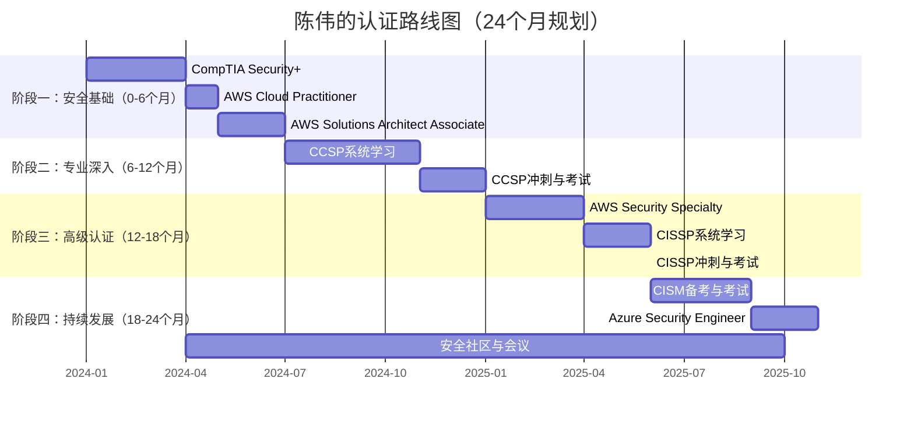

## 陈伟的认证路线图：从IT运维老兵到云安全架构师的24个月进阶之路

> **案例定位**：本文件是"28.5 案例四：从运维到安全架构师的转型之路"的详细路线图。主人公陈伟的背景介绍、SWOT分析见前文，本文聚焦于他的**认证规划细节、备考过程、实战经验与职业蜕变**。

---

### 人物速写

| 维度 | 认证前 | 认证后（24个月） |
|------|-------|----------------|
| 年龄 | 35岁 | 37岁 |
| 职位 | 运维团队负责人 | 云安全架构师 / 安全团队负责人 |
| 技术栈 | Linux/Windows运维、网络架构、Shell脚本 | + AWS安全、云安全架构、合规治理 |
| 证书数 | 0个安全认证 | 6个（Security+、AWS SAA、CCSP、AWS Security Specialty、CISSP、CISM） |
| 薪资 | 月薪22K | 月薪32K（提升约45%） |
| 核心能力 | 基础设施可靠性保障 | 安全架构设计 + 风险治理 + 合规管理 |

---

### 认证路线全景规划

陈伟的路线遵循"**先广后深、平台+管理双轨并行**"的策略。不同于从零起步的初学者，他充分利用了10年运维经验的"存量优势"，将认证学习定位为**知识体系化**而非**知识从零构建**。

#### 四阶段递进模型



#### 认证选择逻辑

陈伟的认证选择并非随意堆砌，每个认证都对应一个明确的能力缺口：

| 阶段 | 认证名称 | 选择理由 | 填补的能力缺口 | 投入时间 | 考试费用 |
|------|---------|---------|---------------|---------|---------|
| 一 | CompTIA Security+ | 安全领域入门"通行证"，建立安全思维框架 | 安全基础理论空白（攻防、密码学、合规） | 3个月 | $392 |
| 一 | AWS Cloud Practitioner | 验证AWS全局认知，为后续AWS安全认证铺路 | 云安全的"云"侧基础 | 1个月 | $100 |
| 一 | AWS Solutions Architect Associate | 深入理解AWS架构，为安全架构设计打基础 | 云架构设计能力 | 2个月 | $300 |
| 二 | CCSP | 云安全领域国际权威认证，跨平台云安全视角 | 云安全治理、合规、法律框架 | 6个月 | $599 |
| 三 | AWS Security Specialty | 专精AWS安全服务，与日常工作强相关 | AWS安全服务深度实操 | 3个月 | $300 |
| 三 | CISSP | 安全领域"黄金标准"，管理视角的安全全貌 | 安全管理思维、风险管理 | 3个月 | $749 |
| 四 | CISM | 安全管理认证，与CISSP形成"技术+管理"互补 | 信息安全治理与项目管理 | 3个月 | $575 |
| 四 | Azure Security Engineer | 多云安全能力，提升差异化竞争力 | Azure平台安全知识 | 2个月 | $165 |

**总预算**：约$3,180（不含培训课程和教材），陈伟所在公司每年提供$5,000技术发展基金，覆盖全部认证费用并有结余。

**选择策略的核心逻辑**：

```text
第一层（阶段一）：建立基础认知
  Security+（安全通用） + AWS基础（云平台认知）
  → 解决"安全是什么"和"云是什么"的问题

第二层（阶段二）：聚焦核心方向
  CCSP（云安全）
  → 解决"云安全怎么做"的问题，建立跨平台云安全视野

第三层（阶段三）：深度+广度双突破
  AWS Security（技术深度） + CISSP（管理广度）
  → 同时具备"能动手"和"能管理"的能力

第四层（阶段四）：差异化竞争
  CISM（管理强化） + Azure（多云扩展）
  → 在"云安全+管理"的交叉领域建立独特竞争力
```

---

### 阶段一：安全基础构建（第1-6个月）

#### 为什么从Security+开始？

陈伟虽然有10年运维经验，但安全知识体系存在明显盲区：
- **知道防火墙怎么配**，但不知道安全架构的整体设计理念
- **能排查网络故障**，但不能系统性地进行威胁建模
- **了解基本加密**，但分不清对称加密、非对称加密和哈希的适用场景边界

Security+恰好覆盖了这6大领域，为他搭建了一个完整的"安全世界观"。

#### Security+备考详情

**学习资源清单**：

| 资源类别 | 具体资源 | 用途 | 陈伟评分 |
|---------|---------|------|---------|
| 官方教材 | CompTIA Security+ Study Guide (Sybex, 第7版) | 系统学习核心知识点 | ★★★★★ |
| 视频课程 | Professor Messer Security+ 免费系列 | 通勤路上听，快速过知识点 | ★★★★★ |
| 题库 | Jason Dion 模拟题包（6套，约600题） | 查漏补缺，适应考试节奏 | ★★★★☆ |
| 动手实验 | TryHackMe Security+ 学习路径 | 在虚拟环境中实操安全工具 | ★★★★☆ |
| 闪卡 | Anki Security+ 预置牌组（约800张） | 碎片时间记忆专业术语 | ★★★★☆ |
| 补充阅读 | NIST SP 800-53 安全控制目录 | 理解安全框架的权威来源 | ★★★☆☆ |

**每日学习安排**：

| 时间段 | 内容 | 时长 |
|-------|------|------|
| 07:30-08:00 | 地铁通勤刷Anki闪卡 | 30分钟 |
| 12:30-13:00 | 午休做10-15道练习题 | 30分钟 |
| 21:00-22:30 | 系统学习新章节（教材+视频） | 1.5小时 |
| 周六上午 | TryHackMe动手实验 + 错题复习 | 3小时 |
| 周日下午 | 模拟考 + 错题归因分析 | 2小时 |

**重点难点攻克**：

陈伟发现Security+中以下3个领域对运维背景的人最具挑战：

| 难点领域 | 具体困难 | 应对策略 |
|---------|---------|---------|
| 密码学 | 数学原理抽象，算法适用场景易混淆 | 制作对比表格（对称vs非对称vs哈希），结合实际场景记忆 |
| 安全架构 | 理论框架多（MITRE ATT&CK、零信任、Defense in Depth），容易"知道名字但不理解逻辑" | 用思维导图画出框架之间的关联，结合公司现有架构做映射 |
| 合规法规 | 法规名称多（GDPR、HIPAA、PCI DSS、SOX），适用范围易混淆 | 按"行业×地域"制作二维矩阵表 |

**考试结果**：
- **成绩**：830/900（通过分750）
- **备考时间**：3个月，总学习时长约150小时
- **考试心得**：PBQ（Performance-Based Questions）需要在模拟环境中配置安全策略，陈伟的运维经验让他在这部分有天然优势

#### AWS认证双连击（第4-6个月）

通过Security+后，陈伟快速拿下了两个AWS基础认证：

**AWS Cloud Practitioner**（1个月）：
- 凭借日常使用AWS的经验，仅用1个月通过
- 重点学习AWS安全责任共担模型（Shared Responsibility Model）
- 成绩：通过（具体分数不公开）

**AWS Solutions Architect Associate**（2个月）：
- 深入学习VPC设计、IAM策略、加密服务等架构层面知识
- 学习资源：Stephane Maarek Udemy课程 + TutorialsDojo模拟题
- 成绩：826/1000（通过分720）
- **关键收获**：系统理解了AWS Well-Architected Framework的六大支柱，特别是"安全性"支柱

```text
AWS Well-Architected Framework - 安全性支柱（陈伟的笔记）

核心原则：
├── 安全是不可谈判的底线
├── 自动化安全最佳实践
├── 在云中保护一切（数据、系统、资产）
├── 安全检测和缓解威胁
└── 通过安全实践缩短响应时间

关键服务映射：
├── 身份管理 → IAM, AWS SSO, STS
├── 检测 → GuardDuty, Security Hub, Macie
├── 基础设施保护 → VPC, WAF, Shield, Config
├── 数据保护 → KMS, S3加密, EBS加密
├── 事件响应 → CloudTrail, Athena, Lambda
└── 合规 → AWS Artifact, Audit Manager
```

---

### 阶段二：云安全专业突破（第6-12个月）

#### CCSP：云安全领域的"黄金标准"

**为什么把CCSP放在这个时间点？**

陈伟的决策逻辑：
1. Security+建立了安全基础认知，AWS认证建立了云平台理解
2. CCSP是连接"安全"和"云"的桥梁——既不是纯安全认证，也不是纯云认证
3. CCSP由(ISC)²和CSA联合推出，国际认可度极高
4. 陈伟的目标是"云安全架构师"，CCSP恰好是这个方向最匹配的认证

**CCSP六大知识域与陈伟的学习难点**：

| 领域 | 权重 | 核心内容 | 陈伟的难点 | 突破方法 |
|------|------|---------|-----------|---------|
| 云概念、架构与设计 | 17% | 云服务模型、虚拟化安全、参考架构 | 云服务模型的边界模糊（IaaS/PaaS/SaaS安全责任划分） | 制作责任矩阵表，逐服务厘清 |
| 云数据安全 | 19% | 数据生命周期、加密、DLP、密钥管理 | 数据主权和跨境数据流动的法律问题 | 结合GDPR实际案例理解 |
| 云平台与基础设施安全 | 18% | 物理基础设施、网络、虚拟化安全 | 多租户隔离机制的技术细节 | 阅读CSA云控制矩阵（CCM） |
| 云应用安全 | 13% | SDLC、DevSecOps、安全测试 | 安全开发生命周期的实践细节 | 结合公司项目做映射 |
| 云安全运营 | 15% | SOC、事件响应、取证、业务连续性 | 云环境取证与传统环境的差异 | 研究AWS取证最佳实践白皮书 |
| 法律、风险与合规 | 18% | SLA、隐私法规、eDiscovery、审计 | 合规术语英文量大（due diligence, data sovereignty, chain of custody） | 制作300+张英文术语卡片 |

**备考策略**：

陈伟为CCSP制定了"四轮复习法"：

```text
第一轮（第1-2个月）：通读教材，建立全景认知
  ├── (ISC)²官方教材（第3版）逐章精读
  ├── 每章做思维导图（平均8-10张/章）
  └── 标记"不懂"和"不熟"的知识点

第二轮（第3个月）：重点突破，补齐短板
  ├── 重点攻克法律与合规领域（18%权重，陈伟最弱）
  ├── 深入学习CSA云安全指南（CCSP考试核心参考）
  └── 加入2个CCSP备考微信群，每周讨论疑难问题

第三轮（第4个月）：实战模拟，查漏补缺
  ├── 做完CCSP官方练习题集（400题，做2遍）
  ├── 每道错题追溯回教材原文
  └── 模拟考试成绩从65%提升到82%

第四轮（第5个月）：冲刺复习
  ├── 快速过思维导图（每天1小时）
  ├── 重点复习错题本中的高频错题
  └── 考前一周每天做1套模拟题保持状态
```

**学习资源**：

| 资源 | 价格 | 使用情况 | 评价 |
|------|-----|---------|------|
| (ISC)² CCSP官方教材（第3版） | $99 | 精读2遍，做全部课后题 | 最权威的参考，但偏理论 |
| CSA云安全指南 v4.0 | 免费PDF | 通读3遍，重点章节背诵 | CCSP考试的重要参考源 |
| CCSP All-in-One Study Guide | $49 | 作为教材的补充参考 | 知识点组织更清晰 |
| Pocket Prep App | $19.99/月 | 每天刷50-100题（通勤时间） | 题目质量一般，但适合碎片刷题 |
| LinkedIn Learning CCSP课程 | 免费（公司账号） | 倍速观看1遍，做笔记 | 适合快速过一遍知识框架 |

**考试结果**：
- **备考时间**：5个月（含2个月冲刺）
- **正式成绩**：一次通过（CCSP仅显示Pass/Fail）
- **总学习时间**：约220小时
- **陈伟的考试心得**：
  - CCSP考察的是"**管理者视角下的云安全**"，不是"怎么配AWS安全组"
  - 每道题都要从业务风险和安全治理的角度思考，而不是纯技术实现
  - 法律和合规领域的分值比预期高（18%），必须认真准备
  - 英文阅读速度是关键瓶颈——平时要刻意练习阅读英文技术文档

---

### 阶段三：深度+广度双突破（第12-18个月）

#### AWS Security Specialty

**为什么在CCSP之后考AWS Security？**

这不是时间安排上的巧合，而是精心设计的"理论→实践"循环：
- CCSP提供了跨平台的云安全理论框架
- AWS Security Specialty将这个框架落地到具体的AWS平台上
- 两者形成"**战略视野 + 技术深度**"的互补

**备考核心策略**：

陈伟利用已在AWS SAA中建立的基础，聚焦AWS安全专项服务：

| 安全服务 | 学习深度 | 实操项目 |
|---------|---------|---------|
| IAM | 策略语法、权限边界、联合身份、跨账户角色 | 编写10+个IAM策略，模拟最小权限场景 |
| KMS | 密钥层级、密钥轮换、加密上下文、多区域密钥 | 用KMS加密S3和EBS，测试密钥恢复流程 |
| GuardDuty | 威胁检测类型、自定义威胁列表、与EventBridge集成 | 搭建自动化威胁响应管道（GuardDuty → Lambda → SNS） |
| Security Hub | 安全评分、CIS基准合规检查、自定义安全标准 | 扫描公司测试环境，输出合规报告 |
| VPC安全 | 安全组 vs 网络ACL、VPC端点、流量镜像、Network Firewall | 设计分层安全网络架构（DMZ + App + DB） |
| WAF | Web ACL规则、速率限制、Bot控制、managed规则组 | 为Web应用配置多层WAF防护规则 |
| Secrets Manager | 密钥自动轮换、跨账户共享、与RDS集成 | 实现RDS密码自动轮换 |

**学习时间**：3个月，约160小时

**考试结果**：一次通过

#### CISSP：安全领域的"皇冠认证"

**备考定位**：

CISSP是陈伟认证之路的**里程碑级挑战**。如果说CCSP是"云安全的专业认证"，CISSP则是"信息安全的全领域认证"——覆盖8大知识域，考察的是**管理者的思维方式**。

**八大知识域与备考难点**：

| 知识域 | 权重 | 核心内容 | 陈伟的情况 |
|-------|------|---------|-----------|
| 安全与风险管理 | 15% | 安全治理、合规、风险管理、职业道德 | 管理经验是优势，但安全治理理论需补充 |
| 资产安全 | 10% | 数据分类、所有权、数据保护、数据生命周期 | 有数据管理经验，中等难度 |
| 安全架构与工程 | 13% | 安全模型、密码学、安全架构设计 | 密码学是薄弱点，需重点突破 |
| 通信与网络安全 | 13% | 网络安全、安全协议、网络攻击 | 网络经验是强项 |
| 身份与访问管理 | 13% | IAM、身份生命周期、访问控制模型 | 日常工作中接触较多 |
| 安全评估与测试 | 12% | 安全评估方法、渗透测试、日志审计 | 需补充安全评估理论 |
| 安全运营 | 13% | 事件响应、取证、业务连续性、灾难恢复 | 有运维经验基础，但需切换到安全视角 |
| 软件开发安全 | 11% | SDLC、安全编码、安全测试 | 开发经验有限，需从零学起 |

**陈伟的CISSP备考三阶段**：

```text
第一阶段（第1个月）：建立管理者思维
  ├── 核心转变：从"怎么解决问题"到"为什么需要解决这个问题"
  ├── 阅读 (ISC)²官方教材（第9版），不求记住，重在理解
  ├── 每学一个知识点，问自己："如果我是CISO，我会怎么做？"
  └── 重点攻克：安全与风险管理、安全架构与工程

第二阶段（第2个月）：系统化学习 + 实战模拟
  ├── Destination Certification视频课程（CISSP公认最佳视频资源）
  ├── 做CISSP Study Guide的全部练习题（约1000题）
  ├── 建立错题本，按知识域分类
  ├── 加入CISSP备考Discord群，每周参与讨论
  └── 用思维导图整理8大知识域之间的关联

第三阶段（第3个月）：冲刺
  ├── 每周做1套完整模拟考试（适应考试节奏和时间压力）
  ├── 重点复习错题本中的高频知识点
  ├── 考前一周快速过思维导图
  └── 调整心态：CISSP是8个领域加权平均分，不需要每个领域都精通
```

**考试当天心得**：

| 维度 | 陈伟的体会 |
|------|----------|
| 题型特点 | 自适应考试（CAT），题目难度随答题正确率动态调整 |
| 时间管理 | 每题平均1.5分钟，遇到不确定的题先标记、后处理 |
| 答题思维 | 始终站在"管理者/决策者"角度思考，不是"技术员"角度 |
| 常见陷阱 | 有些选项"技术上正确但不是最佳管理实践"——CISSP考的是最佳选择 |
| 放弃策略 | 看到"立即""立刻""100%"这类绝对化选项，通常可以排除 |

**考试结果**：
- **成绩**：一次通过
- **备考时间**：3个月，约200小时
- **总分**：CISSP仅显示通过/未通过，但陈伟估算约70%正确率

**CISSP通过后的关键转折**：

> 陈伟回忆："CISSP改变了我看问题的方式。以前遇到安全事件，我的第一反应是'怎么修'。现在我的第一反应是'这个事件的根本原因是什么？组织流程哪里出了问题？如何防止再次发生？'这就是从运维思维到管理思维的转变。"

---

### 阶段四：差异化竞争（第18-24个月）

#### CISM（Certified Information Security Manager）

**为什么在CISSP之后考CISM？**

| 维度 | CISSP | CISM |
|------|------|------|
| 发证机构 | (ISC)² | ISACA |
| 核心定位 | 安全知识的广度覆盖 | 安全管理的深度实践 |
| 考试风格 | 知识型（选择最佳答案） | 场景型（给定业务背景做决策） |
| 聚焦领域 | 8大知识域全面覆盖 | 安全治理、风险管理、事件管理、安全管理开发 |
| 适合人群 | 想建立全面安全认知的人 | 想进入安全管理岗位的人 |

陈伟的考量：CISSP证明了"懂安全"，CISM则证明"能管安全"。两者组合形成完整的安全管理能力证明。

**备考策略**（3个月）：
- 学习资源：ISACA官方教材 + CISM Review Manual + CISM练习题集
- 重点突破：安全治理（Security Governance）和风险管理（Risk Management）
- 关键差异：CISM的题目比CISSP更贴近"实际管理场景"，需要结合业务目标思考

#### Azure Security Engineer Associate

**选择理由**：公司正在推进多云战略（AWS为主 + Azure为辅），Azure安全知识成为差异化竞争力。

**备考策略**（2个月）：
- 学习资源：Microsoft Learn免费课程 + Azure安全文档
- 实操环境：利用Azure免费账户搭建安全实验环境
- 重点：Azure AD安全、Network Security Groups、Azure Sentinel

#### 安全社区参与

从第6个月起，陈伟持续参与安全社区活动：

| 活动类型 | 具体内容 | 频率 | 收获 |
|---------|---------|------|------|
| 安全会议 | AWS re:Invent、CSA Summit、ISC² Conference | 每年2-3次 | 了解行业前沿趋势 |
| 技术分享 | 在公司内部做云安全培训 | 每月1次 | 巩固知识 + 建立内部影响力 |
| 开源社区 | 参与CSA云安全指南中文翻译 | 持续参与 | 深入理解安全框架 |
| 在线社区 | Reddit r/netsec、Discord安全群 | 每周浏览 | 获取安全资讯和技术讨论 |
| 行业认证 | 取得CSA CCSK（Cloud Security Knowledge） | 一次性 | 补充CSA体系的知识 |

---

### 认证后的职业蜕变

#### 职业变化全景对比

| 维度 | 认证前 | 认证后（24个月） |
|------|-------|----------------|
| 职位 | 运维团队负责人（10人团队） | 云安全架构师 + 安全团队负责人（8人团队） |
| 薪资 | 月薪22K | 月薪32K（提升45%） |
| 核心职责 | 基础设施运维、故障响应 | 安全架构设计、风险管理、合规治理 |
| 技术深度 | Linux/网络/存储 | + AWS安全/云架构/加密/安全治理 |
| 管理范围 | 运维执行团队 | 安全策略制定 + 安全团队建设 |
| 行业认可 | 公司内部技术骨干 | 云安全领域技术权威 |
| 职业天花板 | 运维总监（管理路线） | CISO（首席信息安全官）→ 更高天花板 |

#### 具体工作内容升级

**认证前（运维负责人日常）**：
1. 管理服务器和网络基础设施的可用性
2. 处理生产环境故障和紧急事件
3. 执行运维自动化和监控体系建设
4. 参与容量规划和成本优化

**认证后（云安全架构师日常）**：
1. **安全架构设计** —— 负责所有新系统的安全架构评审，确保符合安全基线
2. **安全策略制定** —— 编写公司云安全基线（Cloud Security Baseline）
3. **风险管理** —— 主导季度风险评估，维护风险登记册
4. **合规管理** —— 主导ISO 27001认证和等保2.0合规对标
5. **安全事件管理** —— 从执行恢复升级为负责调查和根因分析
6. **安全培训** —— 为运维和开发团队提供云安全培训
7. **供应商安全评估** —— 评估第三方云服务的安全合规性
8. **安全预算管理** —— 参与安全团队的预算规划和采购决策

**薪资回报率分析**：

```text
认证总投入：
├── 考试费用：$3,180（约23,000 RMB）
├── 教材与课程：约$800（约5,800 RMB）
├── 学习时间：约900小时（24个月 × 每月37.5小时）
└── 总直接成本：约28,800 RMB

薪资增量回报：
├── 月薪提升：10K/月
├── 年度增量：120K RMB
├── 投资回收期：约2.9个月
└── 24个月ROI：约825%
```

---

### 经验总结与可复制方法论

#### 陈伟的认证成功公式

```text
成功 = 经验复用（30%）+ 系统规划（25%）+ 稳定执行（25%）+ 社区参与（20%）
```

#### 五大可复制经验

**1. 善用"存量经验"加速学习**

陈伟的10年运维经验不是"与安全无关的背景"，而是"加速安全学习的催化剂"：

| 运维经验 | 安全领域的映射 |
|---------|---------------|
| 网络架构设计 | 安全网络分段、零信任架构 |
| 服务器管理 | 主机安全加固、漏洞管理 |
| 监控告警 | SIEM建设、威胁检测 |
| 故障应急 | 安全事件响应流程 |
| 自动化运维 | 安全编排与自动化响应（SOAR） |
| 项目管理 | 安全项目管理、合规审计管理 |

**关键原则**：每学一个新安全概念，先问自己"这个和我已知的运维知识有什么联系？"——找到连接点，学习效率翻倍。

**2. "平台+管理"双轨并行**

陈伟的路线同时覆盖了技术深度（AWS Security Specialty）和管理广度（CISSP、CISM），这种组合策略的关键优势：
- 技术认证证明"能动手做"
- 管理认证证明"能做决策"
- 两者组合 = 云安全架构师的理想能力模型

```text
能力矩阵：

              技术深度
         低        高
    ┌──────────┬──────────┐
管  │          │          │
理  │ 运维执行  │ 安全工程师│
广  │          │          │
度  ├──────────┼──────────┤
    │          │          │
高  │ 安全咨询  │ ★安全架构师│
    │          │          │
    └──────────┴──────────┘
    
陈伟的路径：运维执行 → 安全工程师 → ★安全架构师
```

**3. 每次只聚焦一个认证**

陈伟严格遵守"一次一认证"原则：
- 不同时备考两个认证
- 完成一个认证后休息1-2周再开始下一个
- 原因：每个认证的知识体系不同，同时学容易混淆概念

**4. 错题归因法**

陈伟为每个认证建立了详细的错题本：

```text
错题记录格式：
├── 题目编号
├── 错误选项（我选了什么）
├── 正确答案（应该选什么）
├── 错误原因分类：
│   ├── A: 知识点遗忘（记得学过但忘了）
│   ├── B: 理解偏差（理解了但理解错了）
│   ├── C: 审题不仔细（看错了关键词）
│   └── D: 陷阱选项（被干扰项迷惑）
├── 回溯教材页码
└── 复习状态（已复习/待复习）
```

他发现自己的高频错误集中在：
1. 概念边界模糊（如SLA vs SLO vs SLI的区分）
2. 管理视角与技术视角的切换（CISSP常考）
3. 法规适用范围（不同法规的行业和地域适用性）

针对每类错误，制作专项对比表格进行强化。

**5. 建立"认证→实践→认证"的增强循环**

```text
认证学习 → 获得新知识框架
    ↓
实践应用 → 在工作中应用所学（如用CISSP知识改进事件响应流程）
    ↓
发现差距 → 实践中发现"这个领域我还不够深入"
    ↓
下一个认证 → 针对性地补充这个领域
```

陈伟举例："通过CCSP后，我发现公司的云数据安全治理有很多改进空间。这个发现直接推动了他去考CISSP和CISM——因为他需要更全面的安全管理知识来落地这些改进。"

---

### 常见误区与教训

| 误区 | 具体表现 | 纠正方法 |
|------|---------|---------|
| "年纪大了学不动" | 35岁开始新领域学习，担心精力不够 | 利用经验优势降低学习曲线，不是从零开始 |
| "只考一个就够了" | 拿到Security+就觉得够了 | 每个认证填补不同能力缺口，组合价值远大于单一认证 |
| "只背题不理解" | 刷了500题但遇到新场景就不会 | 每道错题追溯回教材原文，理解背后的原理 |
| "忽视管理类认证" | 只考技术认证，不考CISSP/CISM | 技术+管理双认证是高级岗位的必备组合 |
| "闭门造车" | 一个人埋头学习不交流 | 加入备考群组，参加安全社区活动 |
| "只学英语资料"或"只学中文资料" | 要么全英文跟不上，要么全中文考试时懵 | 70%英文+30%中文，逐步提升英文阅读速度 |

**陈伟的遗憾**：
1. 后期备考CISM时时间紧张，导致对ISACA框架的学习不够深入——如果能提前1个月开始会更好
2. 没有更早参加安全会议和社区活动——社区的人脉和知识分享价值被低估了
3. Azure认证可以再早一些——多云安全能力应该更早建立

---

### 给不同背景读者的建议

| 你的背景 | 推荐路线 | 说明 |
|---------|---------|------|
| 10年+运维经验，想转安全 | **与陈伟一致**：Security+ → AWS SAA → CCSP → AWS Security → CISSP | 充分利用运维经验，快速建立安全体系 |
| 5年运维经验，时间有限 | Security+ → CCSP → CISSP | 跳过AWS基础认证，直接切入核心 |
| 有开发背景，想做安全 | Security+ → AWS Developer → CCSP → CISSP | 开发+安全方向，重点关注应用安全 |
| 纯安全背景，无运维经验 | Security+（速通）→ AWS SAA → AWS Security → CCSP | 先补云基础，再深入云安全 |
| 应届生/转行新手 | Security+ → AWS CP → AWS SAA → CCSP | 由浅入深，打好基础再进阶 |

---

### 本章小结

陈伟的24个月认证之路，展示了一条从**运维老兵到云安全架构师**的可复制路径。与从零起步的初学者不同，陈伟的核心策略是"**经验复用 + 体系化补齐**"——利用10年运维经验加速安全学习，同时通过认证建立系统性的安全知识框架。

**核心启示**：

1. **年龄不是障碍，方向才是** —— 35岁开始安全认证之旅，24个月后成为公司云安全领域的技术权威
2. **认证是知识体系化的工具** —— 每个认证填补一个明确的能力缺口，6个认证组合成完整的能力矩阵
3. **"平台+管理"双轨并行** —— 技术认证证明"能做"，管理认证证明"能管"，两者组合才是高级岗位的标配
4. **稳定节奏比高强度冲刺更重要** —— 每天1.5-2小时，持续24个月，比突击3个月效果更持久
5. **社区参与是隐形收益** —— 安全会议、技术分享、开源贡献带来的视野提升和人脉积累，是认证本身无法替代的

> **一句话总结**：认证不是堆证书，而是通过系统化的学习路径，将零散的经验升级为结构化的能力——让每一个认证都成为职业跃迁的台阶。
