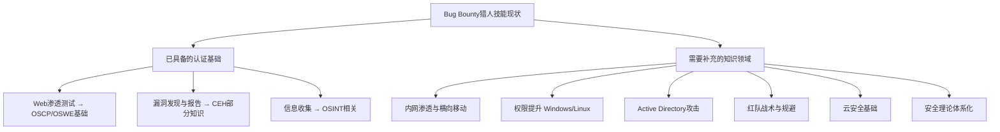
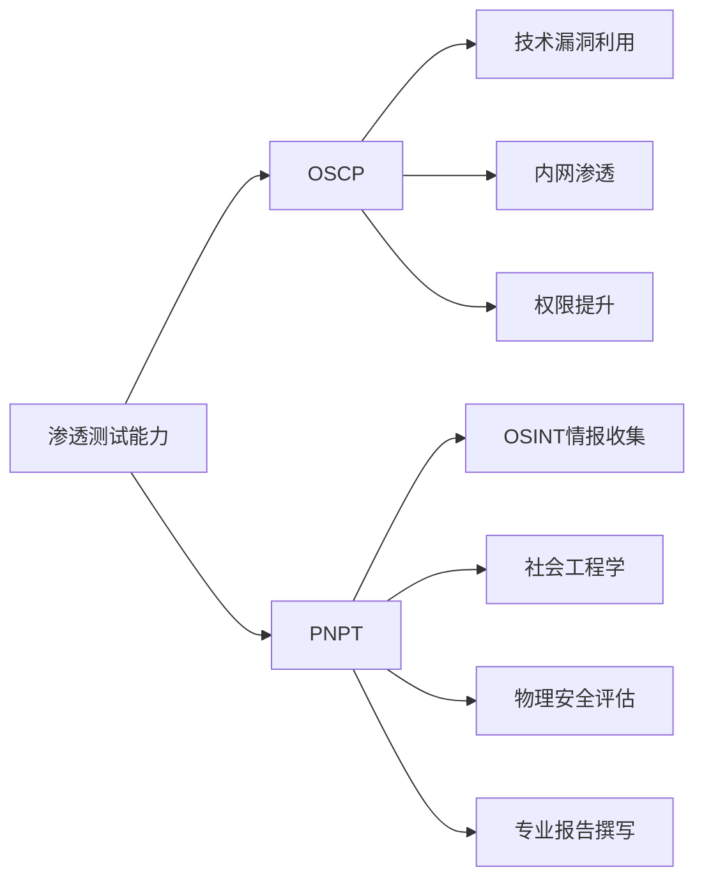
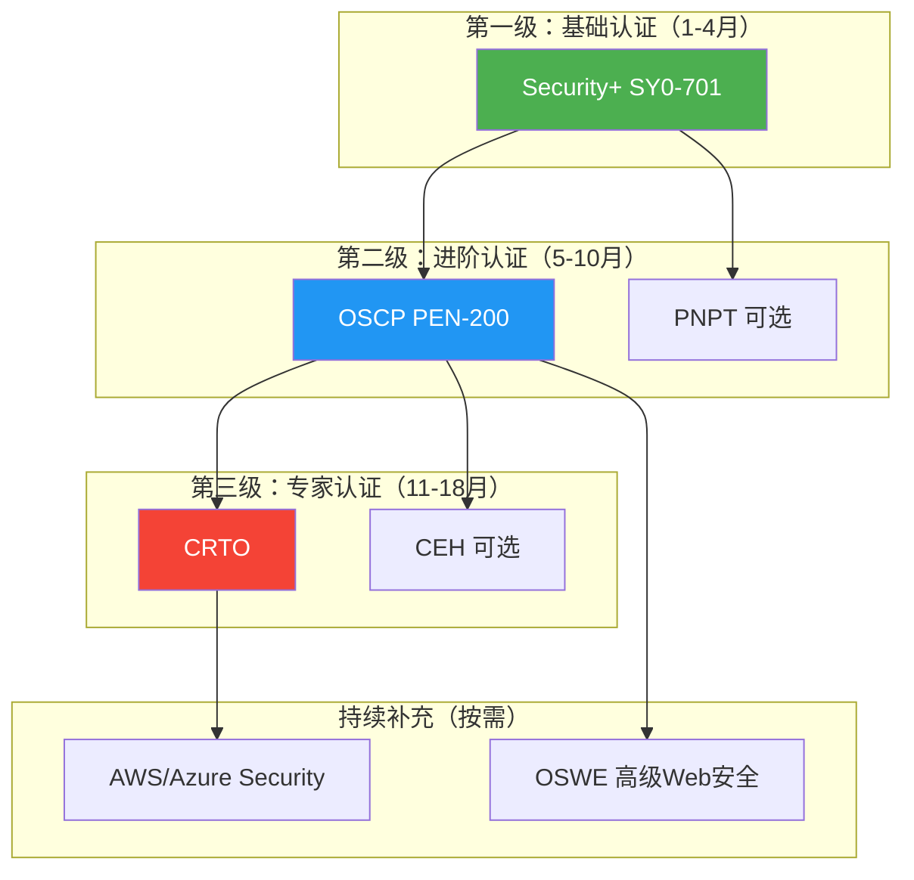
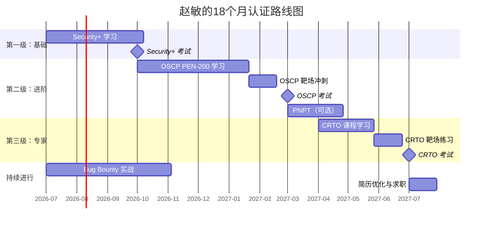

## 28.6 案例五：Bug Bounty猎人的认证之路

### 28.6.1 背景介绍

**主人公**：赵敏，22岁，计算机科学专业大四学生。从大二开始接触Bug Bounty平台（HackerOne、Bugcrowd），经过两年实战积累，已独立发现50+个有效漏洞，涵盖XSS、SSRF、IDOR、权限绕过等多种类型，累计获得赏金约10万美元。在HackerOne上排名Top 500，拥有多个厂商的"荣誉墙"（Wall of Fame）记录。

**起点优势**：
- 丰富的Web漏洞挖掘实战经验
- 熟练使用Burp Suite、Nuclei、FFuF等渗透测试工具
- 拥有真实漏洞报告撰写和沟通能力
- 建立了与多家厂商安全团队的合作关系

**核心痛点**：
- 缺乏系统化的安全理论基础，知识体系"碎片化"
- 没有行业认可的认证证书，求职时简历筛选关难过
- 想从自由猎人转型进入顶级安全公司（如Palo Alto Networks、CrowdStrike），需要学历+认证的"敲门砖"
- 对内网渗透、红队操作等领域经验不足，Bug Bounty主要集中在互联网暴露面

**目标**：在18个月内，通过系统化学习和认证考试，构建完整的安全认证体系，实现从Bug Bounty自由猎人到企业级安全专家的职业跃迁。

---

### 28.6.2 技能审计与认证匹配

#### 28.6.2.1 现有技能盘点

在制定认证规划之前，赵敏对自己两年的Bug Bounty经验进行了系统化的技能审计：

| 技能领域 | 掌握程度 | 具体能力 | 认证映射 |
|---------|---------|---------|---------|
| Web应用安全 | ★★★★★ | XSS/SSRF/IDOR/RCE全套，自动化扫描+手动测试 | OSCP、OSWE核心领域 |
| 信息收集 | ★★★★☆ | 子域名枚举、端口扫描、指纹识别、WAF检测 | OSINT认证相关 |
| 工具使用 | ★★★★☆ | Burp Suite、Nuclei、FFuF、SQLMap等熟练使用 | CEH、PNPT部分覆盖 |
| 漏洞报告 | ★★★★★ | 漏洞描述、复现步骤、修复建议撰写 | CRTO报告写作要求 |
| 编程能力 | ★★★☆☆ | Python脚本编写、简单自动化工具开发 | 无直接对应认证 |
| 内网渗透 | ★★☆☆☆ | 仅有少量CTF内网题经验 | CRTO、OSEP核心领域 |
| 移动安全 | ★★☆☆☆ | 基础Android APK分析 | 无直接对应认证 |
| 云安全 | ★☆☆☆☆ | 几乎没有实战经验 | AWS Security Specialty |
| 密码学 | ★★☆☆☆ | 了解常见加密算法，缺乏深入分析 | 无直接对应认证 |

#### 28.6.2.2 技能差距分析

通过对比行业主流认证的知识域要求，赵敏识别出以下关键差距：



**核心发现**：赵敏的Bug Bounty经验主要集中在"外部攻击面"——即互联网可直接访问的应用和服务。而企业级安全岗位（渗透测试工程师、红队成员）要求的能力更多在"内部攻击面"——内网渗透、AD攻击、权限提升、持久化等。这是从Bug Bounty猎人到企业安全专家的最大鸿沟。

---

### 28.6.3 认证规划：三级跳策略

赵敏采用"三级跳"策略，按难度和价值递进规划认证路线：

#### 第一级：基础认证（第1-4个月）

**目标认证**：CompTIA Security+ (SY0-701)

**选择理由**：
- 行业公认的入门级安全认证，几乎所有企业HR都认可
- 覆盖安全理论基础：风险管理、密码学、网络安全、身份管理、安全运营
- 补全赵敏最大的短板——系统化安全理论知识
- 报考门槛低，无前置认证要求
- 费用合理（考试费约404美元）

**为什么Bug Bounty猎人也需要基础认证**：

很多Bug Bounty猎人认为"我有实战经验，不需要基础认证"。这是一个常见误区。原因有三：

1. **HR筛选机制**：企业招聘流程中，HR通常会用关键词筛选简历。Security+是安全岗位简历的"标准配置"，没有它，简历可能在第一轮就被过滤掉，根本没有技术面试的机会。

2. **知识体系化**：Bug Bounty经验是"点状"的——你精通某个漏洞类型，但对安全的整体框架缺乏认知。Security+帮你建立从资产识别→威胁评估→控制实施→监控响应的完整安全思维模型。

3. **合规与治理理解**：企业安全工作不仅是"找漏洞"，还涉及合规（等保、ISO 27001、SOC 2）、安全治理、风险评估等。Security+帮你理解这些企业安全的"基础设施"。

**学习计划**：

| 周次 | 学习内容 | 资源 | 每日投入 |
|-----|---------|------|---------|
| 第1-2周 | 安全概念与风险管理 | Professor Messer视频 + CompTIA教材 | 2小时 |
| 第3-4周 | 密码学与PKI | 同上 + 动手实验（OpenSSL命令行） | 2小时 |
| 第5-6周 | 网络安全（防火墙/IDS/IPS） | 同上 + GNS3网络模拟实验 | 2小时 |
| 第7-8周 | 身份管理与访问控制 | 同上 + LDAP/AD基础实验 | 2小时 |
| 第9-10周 | 安全运营与事件响应 | 同上 + SIEM基础实验 | 2小时 |
| 第11-12周 | 安全架构与设计 | 同上 + 云安全基础 | 2小时 |
| 第13-14周 | 复习与模拟考试 | Exam Compass题库 + Pocket Prep | 3小时 |
| 第15-16周 | 薄弱环节强化 + 正式考试 | 综合模拟 + 预约考试 | 3小时 |

**关键学习策略**：

赵敏在学习Security+时发现，很多概念她其实已经在实践中使用过，只是不知道正式名称。例如：

- **XSS攻击** → Security+中称为"注入攻击"（Injection Attacks）
- **子域名枚举** → 属于"资产发现"（Asset Discovery）和"信息收集"（Reconnaissance）
- **漏洞报告** → 属于"事件响应"（Incident Response）中的文档化环节
- **使用代理拦截请求** → 属于"网络流量分析"（Network Traffic Analysis）

这种"已知-未知"的映射让她的学习效率极高。她把每个Security+知识点都和自己的Bug Bounty经历关联起来，形成了"理论+实践"的双重记忆锚点。

#### 第二级：进阶认证（第5-10个月）

**目标认证**：OSCP (Offensive Security Certified Professional)

**选择理由**：
- 渗透测试领域的"黄金标准"认证，行业认可度极高
- 100%实操考试（24小时，攻击多台机器并提交报告）
- 完美匹配赵敏的实战型学习风格
- 填补内网渗透、权限提升等关键技能空白
- 持有OSCP的渗透测试工程师平均薪资比无认证者高30-50%

**为什么OSCP是Bug Bounty猎人的最佳进阶选择**：

1. **实战导向**：OSCP不考选择题，而是让你在24小时内真实攻击一个网络环境。这和Bug Bounty的实战风格高度契合，赵敏不需要改变学习方法，只需要扩展攻击范围。

2. **填补内网空白**：OSCP的PEN-200课程系统性地覆盖了内网渗透、横向移动、权限提升等Bug Bounty较少涉及的领域。这正是赵敏技能审计中识别出的最大缺口。

3. **报告写作要求**：OSCP考试要求提交详细的渗透测试报告，这和Bug Bounty报告撰写能力直接相关。赵敏两年的报告撰写经验在这里是显著优势。

**PEN-200课程学习计划**：

| 阶段 | 内容 | 时间 | 重点 |
|------|------|------|------|
| 阶段1 | 信息收集与漏洞扫描 | 2周 | Nmap深度使用、服务枚举、漏洞映射 |
| 阶段2 | Web应用攻击 | 2周 | 文件上传、SQL注入、认证绕过、命令注入 |
| 阶段3 | 基础渗透技术 | 2周 | Metasploit、Shell、后渗透基础 |
| 阶段4 | 权限提升 | 3周 | Linux提权（内核漏洞/SUID/cron）、Windows提权（服务/注册表/令牌） |
| 阶段5 | 内网渗透 | 4周 | 横向移动、端口转发、隧道技术、密码攻击 |
| 阶段6 | Active Directory攻击 | 3周 | Kerberoasting、AS-REP Roasting、Pass-the-Hash、DCSync |
| 阶段7 | 靶机练习 | 4周 | Hack The Box、TryHackPro、Proving Grounds |
| 阶段8 | 模拟考试 | 2周 | 严格按考试格式模拟，24小时完整练习 |

**OSCP学习中的关键挑战与解决方案**：

**挑战1：从"单点漏洞"到"攻击链"思维转变**

Bug Bounty猎人习惯寻找单个高价值漏洞（如RCE），而OSCP要求构建完整的攻击链——从信息收集到初始立足点，再到权限提升和横向移动。

赵敏的应对策略：她制作了一张"攻击链模板"，每次练习时按模板走完所有步骤：

```text
信息收集 → 端口/服务枚举 → 漏洞识别 → 初始访问 → 稳定Shell → 
本地信息收集 → 权限提升 → 内网信息收集 → 横向移动 → 
域信息收集 → 域权限提升 → 域控制器攻陷
```

**挑战2：内网环境缺乏实战经验**

Bug Bounty主要面对互联网暴露面，赵敏几乎没有内网渗透经验。为此，她采取了以下措施：

1. 搭建家庭实验室（使用VMware/VirtualBox构建域环境）
2. 在Hack The Box和TryHackPro上大量练习内网靶机
3. 参加在线红队靶场（如VulnHub、PentesterLab）
4. 重点练习AD攻击的每种技术（Kerberoasting、Golden Ticket等）

**挑战3：24小时考试的时间管理**

OSCP考试时长24小时，需要攻击4-5台机器。很多考生因为时间管理不当而失败。

赵敏的时间管理策略：

```text
00:00-06:00  扫描所有机器，初步评估难度
06:00-12:00  攻击最容易的1-2台机器
12:00-14:00  休息2小时（保持清醒）
14:00-20:00  攻击中等难度的机器
20:00-22:00  攻击最难的机器（最后冲刺）
22:00-24:00  整理截图，撰写报告
```

**经验教训**：赵敏第一次OSCP考试差了5分未通过。失败原因是在一台难度较高的Linux机器上花了太多时间（8小时），挤占了其他机器的时间。第二次考试她严格执行时间管理策略，最终以82分通过（通过线70分）。

#### 第三级：专家认证（第11-18个月）

**目标认证**：CRTO (Certified Red Team Operator)

**选择理由**：
- 红队操作领域的顶级认证
- 覆盖完整的红队战术（侦察→初始访问→执行→持久化→横向移动→数据窃取→清理）
- 使用Cobalt Strike等企业级红队工具
- 与OSCP形成互补——OSCP侧重"发现漏洞"，CRTO侧重"模拟攻击者"
- 对职业发展有直接帮助，红队岗位薪资通常高于渗透测试岗位

**CRTO与OSCP的区别**：

| 维度 | OSCP | CRTO |
|------|------|------|
| 核心能力 | 漏洞发现与利用 | 红队战术执行 |
| 工具导向 | 开源工具为主 | Cobalt Strike为主 |
| 环境复杂度 | 单机或简单网络 | 企业级Active Directory环境 |
| 报告重点 | 技术细节与修复建议 | 攻击模拟与防御建议 |
| 适用岗位 | 渗透测试工程师 | 红队操作员/红队工程师 |
| 难度 | 中高（实操24小时） | 高（实操48小时） |
| 费用 | $1,599（含课程） | $499（仅考试，需自备课程） |

**CRTO学习重点**：

1. **Cobalt Strike深度掌握**：作为红队标准工具，Cobalt Strike的Beacon操作、横向移动、权限维持等功能是CRTO考试的核心。

2. **OPSEC（操作安全）**：如何在攻击过程中避免被防御方（蓝队）发现，包括流量混淆、进程注入、日志清理等。

3. **企业级AD攻击**：比OSCP更深入的Active Directory攻击技术，包括Forest攻击、Shadow Credentials、ADCSPersistence等高级技术。

4. **红队报告撰写**：CRTO报告不仅记录技术细节，还要评估组织的检测能力和响应能力，提供可操作的防御建议。

---

### 28.6.4 辅助认证：按需补充

除了三级核心认证外，赵敏还规划了以下辅助认证，根据职业发展方向按需考取：

#### 28.6.4.1 CEH (Certified Ethical Hacker)

**定位**：综合性安全认证，覆盖攻击技术全景。

**赵敏的评估**：CEH的理论部分她已通过Security+覆盖，实操部分已通过OSCP超越。但CEH在企业招聘中的认可度很高（尤其是国内企业），因此她将CEH列为"备选"认证——如果求职目标企业明确要求CEH，再考取。

**备考建议**：对于已有OSCP的考生，CEH备考时间约4-6周，主要是熟悉其考试格式（125道选择题，4小时）和背诵其特有的术语体系。

#### 28.6.4.2 PNPT (Practical Network Penetration Tester)

**定位**：TCM Security推出的实操渗透测试认证，强调真实世界的渗透测试方法论。

**选择理由**：
- 考试形式贴近真实渗透测试项目（5天考试+2天报告）
- 强调OSINT（开源情报）能力，这是赵敏的弱项
- 费用较低（$399），性价比高
- 包含社会工程学评估，扩展赵敏的能力边界

**与OSCP的互补关系**：



#### 28.6.4.3 AWS Security Specialty / Azure Security Engineer

**定位**：云安全认证，适应安全行业云化趋势。

**选择理由**：随着企业业务上云，云安全岗位需求激增。赵敏的Bug Bounty经验中已有少量云服务漏洞（如S3 Bucket错误配置、Lambda函数权限问题），但缺乏系统化的云安全知识。

**学习路径**：在完成OSCP和CRTO后，根据目标企业的技术栈选择AWS或Azure认证，预计投入2-3个月。

#### 28.6.4.4 认证路线全景图



---

### 28.6.5 学习方法论：Bug Bounty猎人的独特优势

赵敏在认证备考过程中，总结了一套适合Bug Bounty猎人的高效学习方法：

#### 28.6.5.1 "漏洞驱动学习法"

传统的认证学习是"先学理论，再做实验"。赵敏反其道行之——先在真实Bug Bounty目标上实践，再回到教材理解背后的原理。

**具体流程**：

1. **选择Bug Bounty目标**时，刻意选择涉及认证薄弱环节的项目（如使用Active Directory的企业、使用云服务的公司）
2. **在实战中遇到新知识**，记录下来，然后在认证教材中找到对应章节深入学习
3. **将实战发现整理为案例**，反哺认证学习

这种方法的优势在于：每个知识点都有真实的"记忆锚点"，学习效率远高于纯理论学习。

#### 28.6.5.2 "靶场-实战"双循环

赵敏建立了"靶场练习→Bug Bounty实战→靶场练习"的学习循环：

```text
第1周：在Hack The Box练习3台内网靶机
第2周：在Bug Bounty平台上寻找内网相关的漏洞报告（学习他人思路）
第3周：尝试在Bug Bounty目标上应用内网技术（如通过SSRF进入内部网络）
第4周：总结经验，回到靶场攻克更难的内网靶机
```

#### 28.6.5.3 "报告双写"策略

每次在Bug Bounty平台上提交漏洞报告时，赵敏会同时准备两个版本：

1. **Bug Bounty版本**：简洁、直接，聚焦漏洞利用和影响
2. **渗透测试报告版本**：按照OSCP/CRTO的报告格式，包含执行摘要、方法论、详细发现、风险评估、修复建议

这样做的好处是：在备考OSCP和CRTO的报告撰写环节时，她已经有大量"准专业级"的报告素材可以复用。

---

### 28.6.6 职业转型路径

#### 28.6.6.1 从自由猎人到企业安全专家

赵敏规划了三条可能的职业路径：

**路径A：渗透测试工程师**
- 目标公司：安全服务商（如Secureworks、NCC Group、Cybereason）
- 核心认证：OSCP + Security+
- 工作内容：受客户委托进行授权渗透测试
- 薪资范围：20-40万人民币/年（国内），8-15万美元/年（海外）

**路径B：红队操作员**
- 目标公司：大型企业安全部门或专业红队公司
- 核心认证：CRTO + OSCP
- 工作内容：模拟高级持续性威胁（APT），测试企业防御体系
- 薪资范围：30-60万人民币/年（国内），12-20万美元/年（海外）

**路径C：安全研究员/漏洞猎人（升级版）**
- 目标公司：Google Project Zero、Microsoft MSRC、Apple Security Bounty
- 核心认证：OSCP + OSWE（高级Web安全）
- 工作内容：全职漏洞挖掘与安全研究
- 薪资范围：40-80万人民币/年（国内），15-30万美元/年（海外）

#### 28.6.6.2 简历优化：Bug Bounty经验的呈现方式

赵敏在简历中将Bug Bounty经验转化为企业安全岗位的语言：

**转化前（Bug Bounty风格）**：
> 在HackerOne平台上发现50+个漏洞，获得10万美元赏金

**转化后（企业安全风格）**：
> 独立完成50+次授权安全评估，涵盖Web应用安全、API安全、云安全等领域。发现并报告高危漏洞包括：远程代码执行（RCE）8个、服务端请求伪造（SSRF）12个、越权访问（IDOR）15个、存储型XSS 10个。与15+家企业安全团队协作完成漏洞修复，平均修复时间小于72小时。

**关键技巧**：
1. 将"漏洞发现"重新表述为"安全评估"，体现专业性
2. 按漏洞类型和严重程度分类，体现技术深度
3. 强调与企业安全团队的协作经验，体现沟通能力
4. 提供量化数据（漏洞数量、修复时间、影响范围），增强说服力

#### 28.6.6.3 面试准备

赵敏总结了Bug Bounty猎人在安全岗位面试中常见的问题和应对策略：

| 面试问题 | 常见陷阱 | 优质回答方向 |
|---------|---------|------------|
| "你最自豪的漏洞发现是哪个？" | 只讲技术细节，不讲商业影响 | 选择一个影响面广的漏洞，讲述发现过程、技术原理、业务影响、修复方案 |
| "你如何保证测试的全面性？" | 说"靠经验" | 展示方法论：资产枚举→攻击面映射→漏洞扫描→手动测试→逻辑漏洞→报告 |
| "遇到WAF怎么绕过？" | 只列bypass技巧 | 分层回答：识别WAF类型→分析规则→选择绕过策略→记录绕过方法→更新知识库 |
| "内网渗透经验如何？" | 承认没有经验就不说了 | 诚实说明，但强调OSCP/CRTO学习成果、家庭实验室搭建、靶场练习经验 |
| "如何向非技术人员解释漏洞？" | 用技术术语 | 展示沟通能力：用类比解释，如"这个漏洞相当于你家大门没锁，任何人都能进来" |

---

### 28.6.7 投入产出分析

#### 28.6.7.1 费用预算

| 认证 | 考试费 | 培训费 | 学习材料 | 总计 |
|------|-------|--------|---------|------|
| Security+ SY0-701 | $404 | $0（免费资源） | $50（教材） | $454 |
| OSCP PEN-200 | $1,599（含考试+90天实验室） | — | $0（含在课程中） | $1,599 |
| PNPT | $399（含考试） | $0（含在课程中） | $0 | $399 |
| CRTO | $499（仅考试） | $300（RTO课程） | $0 | $799 |
| CEH（可选） | $1,199 | $0（自学） | $100（教材） | $1,299 |
| **总计（不含CEH）** | | | | **$3,251** |
| **总计（含CEH）** | | | | **$4,550** |

以赵敏的Bug Bounty收入（约10万美元/2年 = 5万美元/年），认证投入约占年收入的6-9%，完全在可承受范围内。

#### 28.6.7.2 时间投入

| 认证 | 备考时间 | 每日投入 | 总小时数 |
|------|---------|---------|---------|
| Security+ | 16周 | 2小时 | 224小时 |
| OSCP | 20周 | 3小时 | 420小时 |
| PNPT | 8周 | 2小时 | 112小时 |
| CRTO | 12周 | 3小时 | 252小时 |
| **总计** | **56周（14个月）** | — | **1,008小时** |

**关键约束**：赵敏同时还在进行Bug Bounty工作和完成学业。她将认证学习安排在每天的固定时间段（上午9-12点），Bug Bounty工作安排在下午和晚上，确保两者互不干扰。

#### 28.6.7.3 收益预期

完成三级认证后的预期收益：

1. **薪资提升**：从Bug Bounty自由收入（不稳定）转向企业固定薪资（稳定），预计年薪30-50万人民币（国内）或12-20万美元（海外）
2. **职业稳定性**：从"接单模式"转向"雇佣模式"，获得五险一金、带薪假期等企业福利
3. **职业发展天花板**：从"漏洞猎人"晋升为"安全架构师"或"安全总监"的可能性大幅提升
4. **行业人脉**：通过认证社群和企业工作，建立更广泛的安全行业人脉网络

---

### 28.6.8 常见误区与纠正

#### 误区1："我有实战经验，不需要认证"

**真相**：实战经验是"里子"，认证是"面子"。在企业招聘流程中，认证是HR筛选简历的关键指标。没有认证，你的实战经验可能根本没有展示的机会。

**纠正方法**：将认证视为"通行证"而非"能力证明"。它不定义你的能力，但它决定你能否进入考场展示能力。

#### 误区2："认证越多越好"

**真相**：认证的价值在于"深度"而非"数量"。一个OSCP的含金量远高于五个基础认证的总和。

**纠正方法**：聚焦2-3个高含金量认证，而非追求"证书墙"。赵敏的三级跳策略（Security+ → OSCP → CRTO）就是最佳实践。

#### 误区3："考完认证就万事大吉"

**真相**：认证只是起点，不是终点。安全行业技术迭代极快，认证知识可能在2-3年后就过时。

**纠正方法**：持续学习+持续Bug Bounty实践。赵敏计划每年至少参加一次安全会议（如DEF CON、Black Hat），保持技术敏感度。

#### 误区4："Bug Bounty和企业安全是两个世界"

**真相**：两者的核心技能高度重叠，只是工作模式和目标不同。Bug Bounty是"单兵作战"，企业安全是"团队协作"；Bug Bounty追求"发现漏洞"，企业安全追求"降低风险"。

**纠正方法**：将Bug Bounty经验重新包装为"安全评估经验"，强调方法论、沟通能力和团队协作，而非单纯的漏洞发现数量。

#### 误区5："OSCP太难了，我肯定考不过"

**真相**：OSCP的通过率确实不高（约30-40%），但失败的主要原因不是技术能力不足，而是学习方法不当和时间管理失败。

**纠正方法**：
1. 严格按PEN-200课程进度学习，不要跳过任何章节
2. 在Hack The Box上至少完成50台靶机后再考虑考试
3. 至少进行3次完整的24小时模拟考试
4. 建立自己的"攻击手册"（Cheat Sheet），考试时快速查阅

---

### 28.6.9 18个月执行时间线



---

### 28.6.10 关键里程碑与检查点

为了确保18个月计划的顺利执行，赵敏设定了以下关键检查点：

| 时间节点 | 里程碑 | 检查标准 | 未达标的应对措施 |
|---------|--------|---------|----------------|
| 第4个月末 | Security+通过 | 考试分数≥750（满分900） | 延长1个月复习，分析薄弱环节 |
| 第6个月末 | OSCP课程完成 | 完成所有PDF章节+视频 | 调整每日学习时间，确保进度 |
| 第8个月末 | 靶场练习达标 | Hack The Box完成50台+ | 寻求学习伙伴，加入OSCP社群互助 |
| 第10个月末 | OSCP通过 | 考试分数≥70（满分100） | 第二次考试，重点补强失败方向 |
| 第14个月末 | CRTO课程完成 | 完成所有模块练习 | 调整节奏，必要时推迟考试 |
| 第18个月末 | CRTO通过 + 求职启动 | 考试通过+简历投递30+ | 降低目标公司层级，先积累企业经验 |

---

### 28.6.11 案例总结与启示

赵敏的案例揭示了Bug Bounty猎人走向职业安全专家的几个核心启示：

**启示一：实战经验是最大资产，但需要"翻译"**

Bug Bounty经验不能直接等于企业安全能力。需要通过认证学习补齐理论基础，通过内网靶场练习补实战经验，通过简历优化"翻译"为企业的语言。

**启示二：认证是投资，不是成本**

$3,251的认证投入，换来的是年薪从"不确定的Bug Bounty收入"到"30-50万人民币稳定薪资"的跃迁。投资回报率（ROI）在第一年就能回本。

**启示三：三级跳策略确保可持续性**

从Security+到OSCP再到CRTO，每一级都是下一级的基础。不要跳级，也不要贪多。集中精力攻克一个认证，再进入下一个。

**启示四：Bug Bounty+认证=超级组合**

单纯的Bug Bounty猎人缺乏系统化能力和企业认可；单纯的认证持有者缺乏实战经验。两者结合，就是企业最想要的"即战力"——既有理论深度，又有实战经验，还有行业认可。

**启示五：时间管理是成败关键**

同时进行Bug Bounty、学业和认证学习，需要严格的时间管理。赵敏的做法是：固定时间段做固定事情，用日历工具管理所有任务，每周回顾进度并调整计划。

---

> **本案例核心数据**：18个月，3级认证（Security+ → OSCP → CRTO），约1,008小时学习投入，$3,251费用投入。最终实现从Bug Bounty自由猎人到企业级安全专家的职业转型，预期年薪提升至30-50万人民币。
