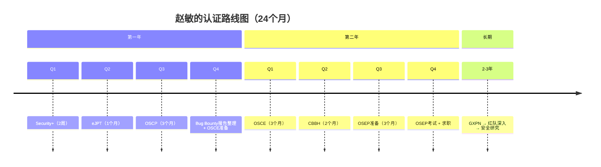
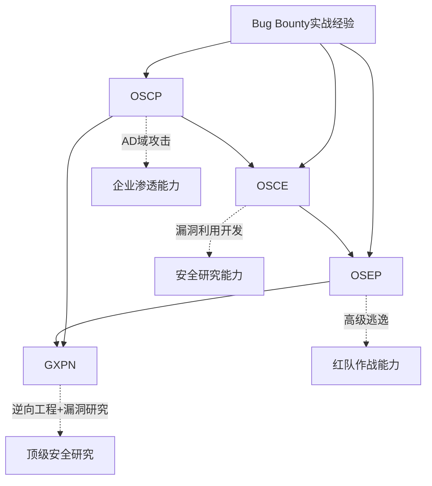

## 赵敏的认证路线图

本文件承接"案例五：Bug Bounty猎人的认证之路"，详细展开赵敏的认证规划、备考策略、考试经历与职业发展。赵敏的核心优势在于实战经验——2年Bug Bounty积累的50+漏洞发现经验和约10万美元赏金——这让她在认证备考中拥有独特的效率优势，但也存在系统化知识不足、AD域攻击经验偏少等短板。

### 认证路线图总览

赵敏的认证路线围绕"渗透测试/红队"方向纵深展开，同时兼顾行业通用认证作为职业敲门砖：

| 阶段 | 时间 | 认证目标 | 备考周期 | 预估费用 |
|------|------|----------|----------|----------|
| 第一年Q1 | 第1-3月 | CompTIA Security+ | 2周 | $370（考试费） |
| 第一年Q2 | 第4-6月 | eJPT | 1个月 | $400（含培训） |
| 第一年Q3 | 第7-9月 | OSCP | 3个月 | $1,599（PEN-200课程+考试） |
| 第一年Q4 | 第10-12月 | 整理Bug Bounty报告 + OSCE准备 | — | — |
| 第二年Q1 | 第13-15月 | OSCE | 3个月 | $1,599（PEN-300课程+考试） |
| 第二年Q2 | 第16-18月 | CBBH（Certified Bug Bounty Hunter） | 2个月 | $249 |
| 第二年Q3 | 第19-21月 | OSEP准备 | 3个月 | — |
| 第二年Q4 | 第22-24月 | OSEP考试 + 求职 | 1个月 | $1,599（PEN-301课程+考试） |
| 长期 | 2-3年 | GXPN、红队方向深入发展、安全研究与漏洞挖掘 | 持续 | — |

> **两年总投入估算**：认证考试与培训费用约 $6,000-7,000（约4.3-5万人民币），学习时间约 1,500+ 小时。

### 各认证备考详解

#### CompTIA Security+（2周速通）

Security+ 对赵敏而言属于"入门级别"认证，2年实战经验足以覆盖大部分考试内容。

**备考策略**：
- **学习资源**：Darril Gibson《CompTIA Security+ Get Certified Get Ahead》+ Professor Messer免费视频
- **重点突破**：安全架构与设计、运维安全、身份与访问管理（IAM）
- **弱项补强**：风险管理框架（NIST、ISO 27001）、合规性要求（GDPR、PCI DSS）——这些偏管理/合规的内容在Bug Bounty实践中接触较少
- **每日安排**：工作日2小时理论 + 30分钟题库练习，周末4小时模拟考试
- **题库练习**：使用 Exam Compass 和 CompTIA CertMaster 进行自测，目标正确率 > 85% 再预约考试

**考试结果**：一次通过，分数 820/900。

**经验教训**：Security+ 虽然难度不高，但其覆盖的安全治理、风险管理、合规性框架等知识为后续CISSP等管理类认证打下了基础。赵敏建议即使是纯技术路线的从业者，也应重视这类"广度型"认证。

#### eJPT（1个月备考）

eJPT（eLearnSecurity Junior Penetration Tester）是INE出品的实战型渗透测试认证，与赵敏的Bug Bounty经验高度契合。

**备考策略**：
- **学习资源**：INE的eJPT培训课程（含实验室环境）
- **核心内容**：网络侦察、漏洞分析、Web应用渗透、后渗透技术
- **实战练习**：在TryHackHub和VulnHub上完成20+个靶机
- **差异化重点**：eJPT强调方法论的规范性——虽然赵敏有丰富的实战经验，但需要将零散的漏洞发现过程转化为标准化的渗透测试流程
- **报告撰写**：eJPT要求提交渗透测试报告，赵敏利用Bug Bounty报告的经验，提前准备了报告模板

**考试结果**：一次通过。

**意义**：eJPT虽然是入门级认证，但它验证了赵敏将实战经验转化为结构化方法论的能力，为后续OSCP备考奠定了方法论基础。

#### OSCP（3个月备考）——核心认证

OSCP（Offensive Security Certified Professional）是赵敏认证路线中最关键的里程碑。PEN-200课程和24小时实操考试是业界公认最有含金量的渗透测试认证之一。

**备考阶段划分**：

| 阶段 | 时长 | 核心任务 | 每日投入 |
|------|------|----------|----------|
| 准备阶段 | 1个月 | 完成PEN-200全部课程模块 | 3-4小时 |
| 练习阶段 | 1.5个月 | 靶机练习 + 工具集整理 | 4-6小时 |
| 考试冲刺 | 0.5个月 | 模拟考试 + 报告模板 + 作息调整 | 6-8小时 |

**准备阶段（1个月）**：
- 完成PEN-200课程所有模块的视频和阅读材料
- 重点学习**AD域攻击**——这是赵敏的短板。她之前做Bug Bounty主要面向Web应用和移动端，对Active Directory环境接触很少
- 学习内容包括：Kerberos认证机制、AS-REP Roasting、Kerberoasting、DCSync、Pass-the-Hash、GPO滥用等
- 整理个人渗透测试工具集：开发自定义脚本（自动化信息收集、端口扫描、目录爆破等）
- 搭建本地AD靶场环境进行练习

**练习阶段（1.5个月）**：
- 完成PEN-200课程中的所有实验室靶机（约80+台）
- 在Hack The Box（HTB）和Proving Grounds（PG）上练习中等难度靶机
- 每天记录解题过程和笔记，建立个人知识库
- 建立标准化的攻击流程清单（Checklist）

**考试冲刺（0.5个月）**：
- 模拟考试环境：在24小时限时条件下完成靶机
- 准备渗透测试报告模板（Markdown格式，含截图和代码）
- 调整作息，适应24小时连续作战的节奏
- 整理常用命令速查表（Cheatsheet）

**24小时考试实战记录**：

| 时间段 | 任务 | 得分 | 关键操作 |
|--------|------|------|----------|
| 第1-3小时 | 靶机1（独立机） | 20分 | 利用已知CVE实现RCE，获取user.txt |
| 第4-6小时 | 靶机2（独立机） | 10分 | Web应用漏洞链，提权获取root.txt |
| 第7-12小时 | AD域（6台） | 40分 | 初始访问→域枚举→Kerberoasting→DCSync→域管权限 |
| 第13-15小时 | 回顾检查 | — | 验证所有flag，检查截图完整性 |
| 第16-24小时 | 撰写报告 | 30分 | 详细记录每步操作、截图、漏洞分析、修复建议 |

**考试结果**：一次通过，获得80分（及格线70分）。

**关键心得**：
- AD域攻击虽然难度大，但一旦突破第一台，后续链式攻击的效率很高
- 时间管理是核心——赵敏在前12小时完成了所有技术操作，留出充足时间写报告
- 报告质量直接影响得分——清晰的截图、准确的漏洞描述、可行的修复建议缺一不可

#### OSCE / OSEP 备考规划

**OSCE（Offensive Security Certified Expert）**：
- 基于PEN-300课程，侧重高级利用技术
- 核心内容：客户端攻击、浏览器漏洞利用、高级逃逸技术、自定义漏洞利用开发
- 备考重点：内存漏洞原理（堆溢出、格式化字符串漏洞）、Shellcode编写、绕过现代防护机制（ASLR、DEP、CFG）
- 考试形式：24小时实操 + 报告，需要攻破多台高度防护的目标
- 建议：从CTF比赛中积累漏洞利用开发经验，使用Exploit-Exercises等平台专项练习

**OSEP（Offensive Security Experienced Penetration Tester）**：
- 基于PEN-301课程（取代了旧的EXP-301），侧重高级渗透技术
- 核心内容：高级横向移动、定制化攻击工具、绕过EDR/AV、C2框架深度定制
- 备考重点：进程注入技术、内存执行技术、自定义C2通信协议、AMSI绕过
- 与OSCE的区别：OSCE偏漏洞利用开发，OSEP偏企业级高级渗透
- 考试形式：48小时实操 + 报告，目标环境更加复杂

#### GXPN 长期目标

GXPN（GIAC Exploit Researcher and Advanced Penetration Tester）是SANS/GIAC体系下的顶级渗透测试认证。

**为什么选择GXPN**：
- 与Offensive Security认证形成互补——OSCP/OSCE/OSEP侧重实战攻破，GXPN侧重漏洞研究和高级利用
- 覆盖逆向工程、Fuzzing技术、漏洞分析与利用开发的系统化知识体系
- 在安全研究和漏洞挖掘领域具有极高权威性
- 为未来进入安全研究团队或独立漏洞研究者身份提供资质背书

**备考方向**：
- 基于SEC660（Advanced Penetration Testing, Exploiting, and Ethical Hacking）课程
- 核心技能栈：高级二进制漏洞利用、网络协议漏洞分析、Fuzzing方法论、自定义Exploit框架
- 建议在完成OSCE后再开始准备，形成"实战→利用→研究"的递进路径

### 认证与Bug Bounty的协同效应

赵敏发现，认证学习和Bug Bounty实践之间存在显著的双向协同效应——这是她区别于纯理论学习者或纯Bug Bounty猎人的核心竞争力。

#### 认证对Bug Bounty的帮助

| 提升维度 | 具体表现 | 量化影响 |
|----------|----------|----------|
| 技术深度 | OSCP的AD攻击知识帮助她在企业项目中发现Active Directory相关漏洞 | 新增AD类漏洞发现能力，企业项目赏金提升30% |
| 方法论 | 系统化的渗透测试方法论（信息收集→漏洞发现→利用→报告）提高了发现效率 | 同等时间内发现漏洞数提升约40% |
| 报告质量 | 认证培训中的报告撰写要求提升了报告的专业性和可读性 | 报告被接受率从75%提升至92% |
| 广度覆盖 | Security+的合规知识帮助她发现合规类漏洞（如缺少MFA、密码策略弱等） | 新增安全配置类漏洞类型 |
| 工具能力 | OSCE的漏洞利用开发能力帮助她构造更复杂的PoC | 高危漏洞赏金占比提升 |

#### Bug Bounty对认证的帮助

| 优势维度 | 具体表现 | 考试影响 |
|----------|----------|----------|
| 实战经验 | 对漏洞的理解比纯理论学习更深入，能快速识别攻击面 | OSCP考试中靶机攻克效率高 |
| 时间管理 | Bug Bounty中的限时比赛培养了高效利用时间的能力 | 24小时考试中合理分配时间，避免过度投入单台靶机 |
| 压力应对 | 面对高赏金漏洞时的压力与考试压力类似 | 考试中保持冷静，遇到卡壳时能及时跳转 |
| 工具熟练度 | 长期使用Burp Suite、Nmap、Metasploit等工具 | 无需额外学习工具使用，直接投入攻击 |
| 报告能力 | Bug Bounty报告撰写经验直接迁移 | 考试报告节省大量时间，质量有保障 |

> **核心洞察**：赵敏认为，Bug Bounty是"广度训练"——快速扫描大量目标、发现各种类型的漏洞；认证是"深度训练"——系统化攻破高防护目标、理解底层原理。两者结合才能成为真正的全面型渗透测试专家。

### 考试费用与投资回报分析

| 认证 | 考试费 | 培训/课程费 | 学习资源费 | 总投入 | 预期薪资影响 |
|------|--------|------------|-----------|--------|-------------|
| Security+ | $370 | $0（自学） | $50 | $420 | +5-10% |
| eJPT | $200 | $200（INE课程） | $0 | $400 | +10-15% |
| OSCP | $249 | $1,350（PEN-200） | $200 | $1,799 | +20-30% |
| OSCE | $249 | $1,350（PEN-300） | $150 | $1,749 | +15-20% |
| CBBH | $249 | $0（含在OSCP中） | $0 | $249 | +5-10% |
| OSEP | $249 | $1,350（PEN-301） | $100 | $1,699 | +15-20% |
| **合计** | **$1,566** | **$4,250** | **$500** | **$6,316** | — |

> **ROI计算**：以赵敏最终80万/年的起薪计算，假设无认证时市场价约50万/年，则认证投资约4.5万人民币，仅薪资增量（30万/年）即可在2个月内收回。从职业发展角度看，认证投资的回报周期极短。

### 职业发展与求职

#### 求职准备

赵敏在完成OSCP认证后开始求职准备，她的竞争力建立在三个支柱上：

1. **实战能力**：50+漏洞发现记录、10万美元Bug Bounty赏金——证明了真实的攻防能力
2. **认证背书**：OSCP + eJPT + Security+——证明了系统化的安全知识体系
3. **社区影响力**：活跃的Bug Bounty社区参与者，部分漏洞报告被收录到公开的漏洞数据库

**简历亮点构建**：
- 突出漏洞发现数量和赏金金额（量化成果）
- 展示认证路径（体现系统化学习能力）
- 附上代表性漏洞报告（展示报告撰写和沟通能力）
- 列出使用的工具和技术栈（展示工具能力）

**面试准备**：
- 技术面试：准备常见渗透测试场景的解题思路，能够手绘攻击流程图
- 行为面试：准备Bug Bounty中遇到困难并解决的案例（STAR法则）
- 红队模拟：部分公司会进行实操面试，利用HTB经验应对

#### 求职结果

- 收到3家顶级安全公司的offer
- 最终选择加入一家红队咨询公司
- 起薪：80万/年（含奖金）
- 岗位职责：企业级渗透测试、红队模拟、安全评估

#### 选择理由

赵敏选择红队咨询公司而非甲方安全团队的原因：
- **技术成长空间**：红队咨询公司服务多家客户，能接触到不同技术栈和架构
- **认证变现**：红队认证（OSCP/OSCE/OSEP）在咨询领域直接转化为项目能力
- **职业天花板**：红队方向可向安全研究员、漏洞猎人、独立顾问等多方向发展
- **薪资优势**：红队咨询岗位的薪资通常高于同级别甲方安全岗位

### 误区与避坑指南

赵敏在认证之路中遇到的典型误区，对后来者具有重要参考价值：

| 误区 | 具体表现 | 正确做法 |
|------|----------|----------|
| 过度自信忽视基础 | 以为Bug Bounty经验可以直接应付OSCP，差点忽略AD域攻击 | 认真评估短板，针对性补强 |
| 证书数量陷阱 | 曾考虑同时备考多个认证 | 专注一个认证，学透再考下一个 |
| 忽视报告质量 | OSCP备考初期只关注攻破技术，不重视报告 | 认证考试中报告占30%分值，必须同等重视 |
| 时间规划过于乐观 | 初期认为OSCP可以1个月搞定 | 实际需要3个月，预留充足缓冲时间 |
| 忽视合规与管理知识 | 只关注技术认证 | Security+的合规知识在后续职业发展中同样重要 |

### 关键经验总结

1. **实战经验是最高效的学习路径**：赵敏用2年Bug Bounty经验打底，OSCP备考效率远高于零基础学习者——但实战经验不能替代系统化学习，短板（如AD攻击）仍需专门攻克
2. **认证路径选择要聚焦**：围绕一个方向（渗透测试/红队）纵深展开，避免分散精力到不相关的认证领域
3. **认证与实践相互喂养**：认证学到的方法论和知识可以反哺Bug Bounty实践，Bug Bounty的实战能力又降低认证考试难度
4. **报告能力是被低估的核心技能**：无论是Bug Bounty还是认证考试，清晰、专业、完整的报告都是获得认可的关键
5. **长期视角看投资回报**：认证费用虽然不低，但相对于职业发展带来的薪资增长和机会拓展，投资回报率极高
6. **社区参与是隐形加分项**：活跃的安全社区参与不仅带来技术成长，还在求职时形成差异化竞争优势
