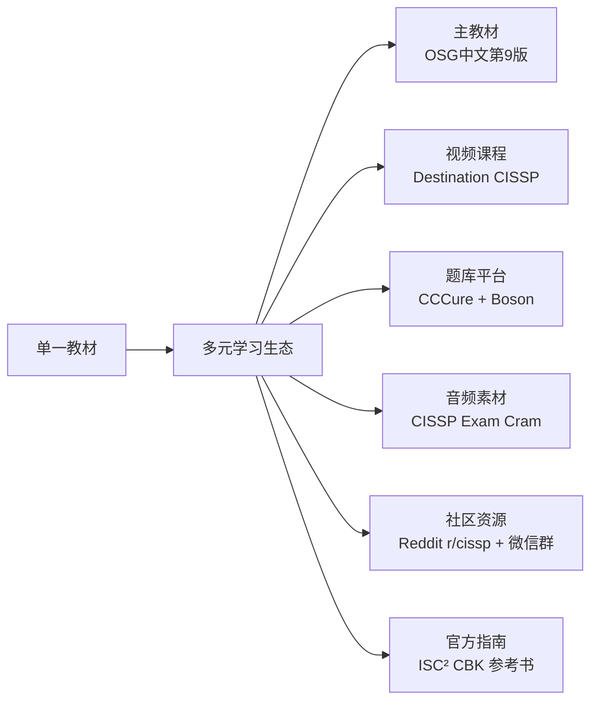
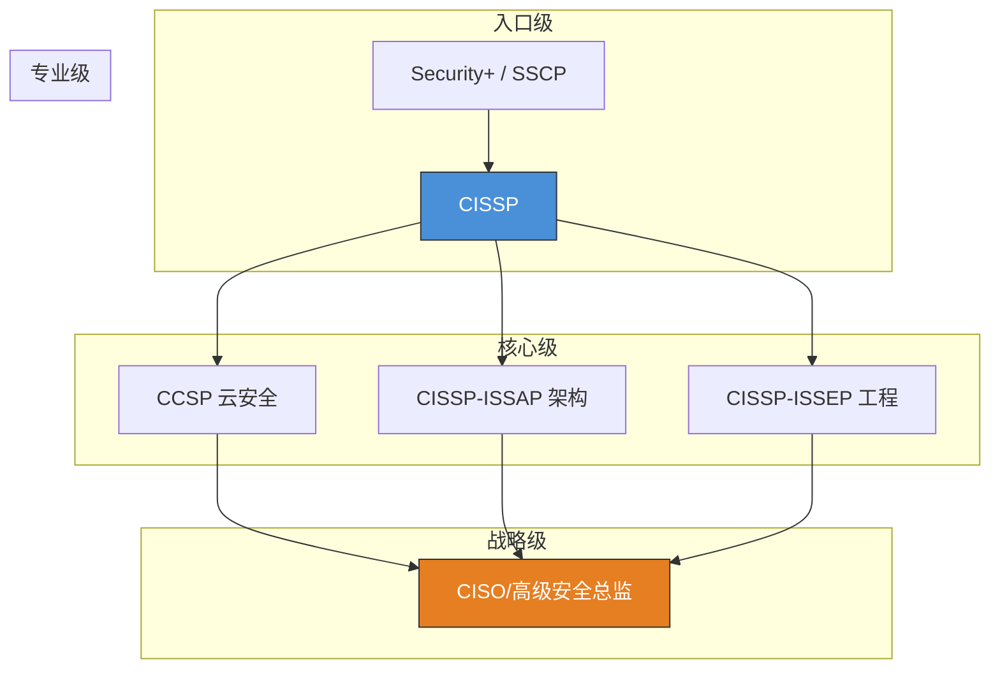

## 28.7 案例六：失败与重来的认证故事

### 28.7.1 引言

认证考试从来不只是知识的检验，更是对学习方法、心态管理和执行力的综合考验。在众多安全认证中，（ISC）² 的 CISSP（Certified Information Systems Security Professional）被誉为安全领域的"黄金标准"，但其通过率长期维持在 50%-60% 之间——这意味着每两位考生中就有一人首战失利。

本案例的主人公刘洋——一位 28 岁的网络工程师——就是这"一半"中的一员。他从第一次的惨败中站起来，通过系统性的策略调整，最终在第二次考试中成功通关。他的故事不是天才的传奇，而是一个普通从业者通过正确方法论实现逆袭的范本。本文将完整还原他的备考历程，并对每个关键节点进行深度剖析，提供可复制的经验框架。

> **本案例的核心价值**：不是告诉你"如何一次通过"，而是告诉你"当第一次失败后，如何系统性地调整并成功"。这比一次通过更有普适性——因为大多数人的第一次都不会那么顺利。

---

### 28.7.2 CISSP 认证概述：你要挑战的究竟是一座怎样的山？

在进入具体案例之前，有必要先理解刘洋所挑战的究竟是怎样一座"高峰"。

#### 28.7.2.1 CISSP 是什么

CISSP 由国际信息系统安全认证联盟（ISC）² 颁发，自 1994 年推出以来，已成为全球公认的信息安全领域最高级别认证之一。截至 2025 年，全球持证人数约 15 万人，覆盖超过 170 个国家和地区。CISSP 并非单纯的技术认证，它强调 **"管理者视角"**——考生需要证明自己不仅懂技术，更能从战略、管理、合规等维度理解安全。

**为什么 CISSP 被称为"黄金标准"？**

| 维度 | 说明 |
|------|------|
| 行业认可度 | 全球 80% 以上的安全岗位要求或优先录用 CISSP 持证者 |
| 薪资溢价 | 持证者平均薪资比未持证者高出 25%-35%（ISC² 2024 数据） |
| 法律要求 | 美国联邦政府（FedRAMP、DoD 8140）强制要求安全岗位持有 CISSP |
| 知识广度 | 覆盖 8 大知识域，是安全领域最全面的认证 |
| 持续要求 | 需每年完成 40 个 CPE 学分，确保持证者持续更新知识 |

#### 28.7.2.2 八大知识域

CISSP 考试涵盖（ISC）² 制定的 **CBK（Common Body of Knowledge）**，共 8 个知识域（Domain）：

| 域编号 | 知识域名称 | 权重 | 核心内容 | 常见失分点 |
|--------|-----------|------|---------|-----------|
| 域1 | 安全与风险管理 | 15% | CIA三元组、合规、风险管理、威胁建模 | 混淆风险接受与风险转移 |
| 域2 | 资产安全 | 10% | 资产分类、数据生命周期、隐私保护 | GDPR/CCPA 合规细节 |
| 域3 | 安全架构与工程 | 13% | 安全模型、密码学、物理安全、安全评估 | 密码学算法选型场景题 |
| 域4 | 通信与网络安全 | 14% | 网络架构、协议安全、安全通信通道 | VPN 类型选择、网络分段 |
| 域5 | 身份与访问管理（IAM） | 13% | 身份生命周期、认证/授权、访问控制模型 | DAC/MAC/RBAC 场景选择 |
| 域6 | 安全评估与测试 | 12% | 审计、渗透测试、漏洞评估 | 白盒/黑盒/灰盒测试区别 |
| 域7 | 安全运营 | 13% | 事件响应、BCP/DRP、取证、人员安全 | RTO/RPO 计算、取证流程 |
| 域8 | 软件开发安全 | 10% | 安全开发生命周期、应用安全、安全编码 | OWASP Top 10 场景应用 |

> **权重解读**：域1（15%）和域4（14%）合计占近 30% 的考题，是备考的绝对重点。但域8（10%）虽然权重最低，却是网络工程师最陌生的领域——刘洋第一次失败的重要原因之一就是域8 几乎全军覆没。

#### 28.7.2.3 考试形式与评分机制

- **考试时长**：4 小时（250 道选择题，其中 25 道为不计分预测试题）
- **合格分数线**：700 分（满分 1000 分）
- **语言**：支持中文、英文等多语种
- **费用**：首次考试约 749 美元，重考约 599 美元
- **工作经验要求**：需在至少 2 个知识域拥有 5 年工作经验（或 4 年+大学学历）

**评分机制的隐藏规则**：

CISSP 采用 **CAT（Computerized Adaptive Testing）自适应考试** 机制。系统会根据你当前答题的正确率动态调整下一题的难度——答对了就出更难的，答错了就出更简单的。这意味着：

1. **你的最终得分取决于你在"最难区间"的表现**：如果你在中等难度题上表现良好，系统会把你推向高难度区间，而高难度题的正确率决定了你的上限。
2. **25 道预测试题不计分**：你不知道哪 25 道是预测试，所以必须认真对待每一道题。
3. **"差 18 分"不等于"只差 18 分"**：由于自适应算法，682 分可能意味着你在 2-3 个知识域存在系统性薄弱，而非仅仅少了 18 道正确答案。

> **为什么强调"管理者思维"？**
>
> CISSP 试题通常不直接考察"这个命令怎么写"，而是问"作为安全主管，你应该选择哪种方案来平衡安全与业务需求"。许多技术出身的考生（包括刘洋）在第一次考试时正是栽在这个认知转换上。

---

### 28.7.3 案例背景：刘洋的起点

**主人公画像**：

| 项目 | 内容 |
|------|------|
| 姓名 | 刘洋 |
| 年龄 | 28岁 |
| 专业背景 | 网络工程专业本科 |
| 工作经验 | 3年网络工程师（企业内网运维为主） |
| 英语水平 | CET-4，阅读英文材料有困难，专业术语理解吃力 |
| 认证经历 | 此前无高级安全认证（仅持有 CCNA） |
| 备考动机 | 寻求职业转型从网络运维到安全架构 |
| 经济状况 | 月薪 12K，备考预算有限（首次约 500 元，第二次约 2000 元） |

刘洋之所以选择 CISSP，在于他看到了行业趋势：传统网络工程师的岗位正在被 SDN（软件定义网络）和自动化取代，而安全领域的专业人才缺口持续扩大。据 ISC²《2024年网络安全劳动力报告》，全球安全人才缺口约 480 万人，持证者平均薪资比未持证者高出 25%-35%。

**但刘洋的起点存在三个结构性劣势**：

1. **经验不足**：CISSP 要求 5 年经验（或 4 年+学历），刘洋只有 3 年，属于"擦线报考"——这意味着他缺乏真实的管理层决策经验，而 CISSP 恰恰考察的就是这种经验。
2. **英语短板**：CISSP 的英文术语体系与中文翻译存在系统性差异。例如 "threat modeling" 在中文教材中可能译为"威胁建模"，但考试中的英文题干会使用 "identify potential threats to the system architecture" 这类表述，刘洋需要额外的翻译转换时间。
3. **知识域盲区**：3 年网络运维经验集中在域4（通信与网络安全），对域1（风险管理）、域5（IAM）、域8（开发安全）几乎零基础。

---

### 28.7.4 第一次考试：一次典型的失败

#### 28.7.4.1 备考过程还原

| 维度 | 具体做法 | 问题诊断 |
|------|---------|---------|
| 备考时间 | 3个月，平均每天1-2小时 | 总投入不足（仅约 180 小时），远低于建议的 300-400 小时 |
| 学习资源 | 仅使用一本《CISSP官方学习指南（第8版）》中文版 | 资源单一，缺乏多元输入 |
| 学习方法 | 通读教材 → 划重点 → 做章末习题（每章约20题） | 被动学习为主，缺乏主动输出 |
| 模拟考试 | 仅完成1套模拟题（250题），得分62% | 模拟次数严重不足 |
| 练习题总量 | 约400题 | 远低于社区建议的 1500-3500 题 |
| 错题复盘 | 无系统性的错题记录 | 错误未被系统化分析 |
| 学习社区 | 未加入任何学习群组 | 缺乏外部反馈和认知冲突 |
| 时间管理 | 无专项训练 | 考试节奏感缺失 |

#### 28.7.4.2 考试结果

**成绩单**：未通过，最终得分 682 分（距合格线 700 分差 18 分）。

看似只差 18 分，但（ISC）² 的评分体系采用**自适应难度算法**：当你在某个知识域的答题正确率持续偏低时，系统会降低后续同域题目的难度（意味着你的得分上限被锁死）。因此，18 分的差距背后，可能反映出 2-3 个知识域的系统性薄弱。

**各域得分分布**（根据考试后反馈）：

| 知识域 | 正确率 | 评价 |
|--------|-------|------|
| 域1 安全与风险管理 | 58% | 薄弱——缺乏管理者视角 |
| 域2 资产安全 | 65% | 一般 |
| 域3 安全架构与工程 | 62% | 薄弱——密码学部分失分严重 |
| 域4 通信与网络安全 | 78% | 优势域（本职工作相关） |
| 域5 身份与访问管理 | 55% | 薄弱——访问控制模型混淆 |
| 域6 安全评估与测试 | 68% | 一般 |
| 域7 安全运营 | 60% | 薄弱——BCP/DRP 概念模糊 |
| 域8 软件开发安全 | 45% | 严重薄弱——几乎零基础 |

> **关键发现**：刘洋的优势域（域4）正确率高达 78%，但弱势域（域8）仅 45%。这种"偏科"在 CAT 考试中是致命的——系统会在你的优势域不断出难题，但弱势域的天花板锁死了总分上限。

#### 28.7.4.3 五大致命原因深度分析

**原因一：学习资源单一，缺乏多元输入**

刘洋只使用了一本中文教材，这带来了三个严重后果：

1. **翻译损耗**：中文版教材中的术语翻译可能与考试原题英文表述不一致。例如，"access control" 可能被译为"访问控制"，但考试中直接出现 "mandatory access control (MAC)" 的英文术语时，刘洋会反应不及。
2. **视角单一**：每本教材都有作者的个人理解偏差，单一来源意味着刘洋只接触了"一种解释"而非"多种视角下的共识"。
3. **缺乏视频辅助**：对于网络架构、加密流程等需要空间想象的知识点，文字描述远不如视频动画直观。

> **数据支撑**：CISSP 社区统计显示，使用 3 种以上资源（教材+视频+题库）的考生通过率比仅使用教材的考生高出约 25 个百分点。

**原因二：没有制定可量化的学习计划**

刘洋所谓的"计划"仅仅是每天读几章，缺乏以下关键要素：

- **阶段性里程碑**：没有设定"第1个月完成域1-3，第2个月域4-6，第3个月域7-8+复习"的分段目标
- **质量检查点**：没有定期评估自己的掌握程度（例如每周模拟30题并记录正确率趋势）
- **时间分配优先级**：对权重高的域（域1的15%、域4的14%）和对自己薄弱域（如域8的软件开发安全）没有倾斜更多时间

> **方法论缺失的本质**：刘洋的计划是"时间导向"（每天学2小时）而非"目标导向"（本周攻克域3的密码学）。时间导向的计划无法保证产出质量，只能保证"我学了"。

**原因三：刷题量远低于及格线**

CISSP 社区公认的经验数据表明：

| 练习量 | 通过率参考值 | 说明 |
|--------|-------------|------|
| < 500题 | < 40% | 严重不足，仅能覆盖基础知识 |
| 500-1500题 | 40%-60% | 基本覆盖，但缺乏深度 |
| 1500-2500题 | 60%-75% | 充分练习，多数人能通过 |
| 2500-3500题 | 75%-85% | 深度练习，高通过率 |
| 3500+题 | > 85% | 极致准备 |

刘洋的 400 题练习量处于最低档。更重要的是，他不仅题量少，还**缺乏错题分析**——做错的题看一遍答案就放过，没有深究"为什么错"和"正确思路是什么"，导致同一个知识点换个说法继续错。

> **刷题的本质**：刷题不是为了"见过这道题"，而是为了"见过这个知识点的 10 种问法"。刘洋 400 题的练习量意味着每个知识点平均只见过不到 1 种问法。

**原因四：时间管理不当**

CISSP 考试 250 题 / 240 分钟 ≈ 每题约 57 秒。刘洋在前 100 题上花费了过多时间（平均每题 80秒+），导致后半程（特别是最后 50 题）平均每题只剩 35 秒，仓促作答、连题意都没读完。

根据考试后的复盘，最后 50 题的正确率仅为 45%，远低于前 100 题（约 65%），这是决定性的失分区域。

> **时间崩盘的心理机制**：当考生意识到时间不够时，会产生"时间焦虑"——注意力从题目内容转移到"还剩多少时间"上，认知资源被分散，正确率进一步下降。这是一个恶性循环。

**原因五："管理者思维"认知不足**

这是最根本的原因。刘洋的技术背景让他倾向于"技术人员的解题方式"：

- 题目问"最合适的访问控制模型"→ 他想到 MAC 的安全性最高 → 选 MAC
- **正确答案思路**：作为安全管理者，要考虑业务场景中用户需要灵活授权，应选 RBAC（基于角色的访问控制）

CISSP 考察的是**决策层思维**，而非技术细节。这就像把一位优秀的战地医生提拔为医院院长——他不再只需要做手术，还需要管理预算、协调科室、制定流程。

> **管理者思维的核心公式**：
>
> ```
> 最佳答案 = 法律合规（必须满足） + 业务需求（核心驱动） + 安全目标（实现手段） + 成本约束（现实边界）
> ```
>
> 技术员思维只关注"安全目标"，而管理者思维必须同时平衡四个维度。

#### 28.7.4.4 失败的心理冲击：从否认到重建

得知未通过的那一刻，刘洋描述自己的感受是："像被一堵无形的墙挡住了——明明付出了三个月的努力，却连及格线都没碰到。"他经历了典型的"失败后心理周期"：

| 阶段 | 时间 | 典型表现 | 关键行为 |
|------|------|---------|---------|
| 否认期 | 第1-3天 | "是不是阅卷出错了？"、"就差18分，运气好点就过了" | 反复查看成绩单，拒绝承认失败 |
| 愤怒期 | 第4-7天 | "CISSP 就是故意卡通过率"、"这种考试跟实际工作有什么关系" | 抱怨考试制度，质疑认证价值 |
| 讨价还价期 | 第8-10天 | "如果我再多刷 200 题是不是就能过了？" | 开始寻找"捷径"，试图最小化调整 |
| 抑郁期 | 第11-14天 | 情绪低落，自我怀疑，"我是不是不适合安全这个领域" | 动力下降，考虑放弃 |
| 接纳期 | 第15天起 | 浏览网上失败经验贴 → 发现自己不是特例 → 开始理性分析原因 | 制定新的策略，重新出发 |

> **心理周期的关键洞察**：
>
> 1. **从"愤怒"到"接纳"的过渡时长决定了重考的成功率**。刘洋用两周时间完成了这一过渡，这在他的成功中起到了关键作用。
> 2. **失败后最常见的错误是"立刻重考"**：带着未消化的情绪和未调整的方法再次走进考场，大概率会重复同样的失败。
> 3. **失败后最危险的思维是"我哪里不够努力"**：刘洋第一次失败后曾想"下次我每天学 4 小时"——但这没有触及根本问题（方法、资源、思维），只是增加了时间投入。

**失败后的心理重建三步法**：

```text
第一步：情绪隔离（第1-7天）
  ├── 允许自己难过，但设定"难过期限"（不超过一周）
  ├── 找一个可以倾诉的人（朋友/家人/导师），把情绪说出来
  └── 避免在社交媒体上公开抱怨（负面情绪会自我强化）

第二步：数据化复盘（第8-14天）
  ├── 把失败拆解为可量化的指标（各域得分、练习量、时间分配）
  ├── 对照成功者的标准，找出差距的具体位置
  └── 列出"可控因素"和"不可控因素"，只关注前者

第三步：策略重构（第15天起）
  ├── 基于复盘结果，制定全新的备考方案
  ├── 设定"最小可行改进"（先改最关键的一个问题）
  └── 寻找外部支持（学习社区、导师、同伴）
```

---

### 28.7.5 策略调整：从失败到重来的系统化方案

在进行了彻底的自我剖析后，刘洋制定了一套全新的备考方案。以下是他从"盲目备考"到"精确制导"的五大核心转变。

#### 28.7.5.1 学习资源多元化（从 1 种 → 6 种）



**各资源的定位和使用方法**：

| 资源 | 类型 | 用途 | 使用频率 | 费用 | 为什么选它 |
|------|------|------|---------|------|-----------|
| OSG中文第9版 | 主教材 | 构建知识框架，逐域学习 | 每天1-2章 | ≈ ￥300 | 内容最全面，中文友好 |
| Destination CISSP（每周2节） | 视频课 | 攻克难点（密码学、网络架构） | 每周2次 | ≈ $99/月 | 讲师Mike Chapple是CISSP官方认证讲师 |
| CCCure题库 | 练习 | 大量刷题、按域专项训练 | 每天50-100题 | ≈ $50/季度 | 题量大（20000+），按域分类 |
| Boson ExSim | 模拟 | 全真模拟考试环境 | 考前4周每周1套 | ≈ $99 | 最接近真实考试难度和节奏 |
| CISSP Exam Cram（Pocket Prep） | 音频 | 碎片时间（通勤、健身）复习 | 每日30分钟 | ≈ $15/月 | 音频形式适合通勤场景 |
| r/cissp + 学习群 | 社区 | 错题讨论、经验交流 | 每日30分钟 | 免费 | 真实考生的第一手经验 |

> **资源选择原则**：
>
> 并非资源越多越好。刘洋的"6种资源"覆盖了 **输入-练习-验证-讨论** 四个环节：
> - **输入**：教材（系统性）+ 视频（直观性）+ 音频（碎片化）
> - **练习**：题库（广度）+ 模拟考（真实感）
> - **验证**：错题分析确认掌握程度
> - **讨论**：社区交流拓展思路

> **避坑指南**：不要同时使用 3 本以上的教材。教材之间会有表述差异，同时使用会造成认知混乱。正确的做法是"一本主教材 + 其他资源补充"。

#### 28.7.5.2 制定可量化、有节奏的学习计划

**总时间**：4个月（16周），平均每天3-4小时（含周末加倍）

**阶段计划**：

```text
第1-8周（基础构建期）：
├── 每周 1 个知识域（前2个月的细分目标）
│   ├── 周一至周三：阅读OSG对应章节 + 标注难点
│   ├── 周四：观看对应章节的 Destination CISSP 视频
│   ├── 周五：CCCure 按域刷题（100题/天）
│   ├── 周六：错题复现（针对错题重新学习知识点）
│   └── 周日：休息 + 碎片时间听音频复习
│
├── 每2周里程碑：CCCure 该两个域的正确率 > 75%
└── 每4周里程碑：整套250题模拟，正确率 > 65%

第9-12周（强化突破期）：
├── 交叉刷题（随机域出题，避免"熟悉感偏差"）
├── 每周3套 CCCure 定制模拟（125题/套）
├── 重点攻克薄弱域：域3（密码学）和域8（开发安全）
├── 每2周里程碑：随机题正确率 > 72%
└── 错题本归类分析（按知识点、按错误类型）

第13-16周（冲刺模考期）：
├── 第13周：Boson ExSim 模拟考1（找感觉）
├── 第14周：Boson ExSim 模拟考2 + 错题回归
├── 第15周：Boson ExSim 模拟考3 + 薄弱域最终补强
├── 第16周：轻度复习 + 心态调整 + 休息
└── 目标：Boson 模拟考连续2次 > 750分
```

**时间投入对比**：

| 维度 | 第一次备考 | 第二次备考 | 变化 |
|------|-----------|-----------|------|
| 总备考时长 | 3个月 | 4个月 | +33% |
| 日均学习时间 | 1-2小时 | 3-4小时 | +100% |
| 总学习时长 | ~180小时 | ~480小时 | +167% |
| 周末投入 | 偶尔 | 每天6-8小时 | 大幅增强 |

> **时间管理的核心原则**：第二次备考的日均时间是第一次的 2 倍，但效果不是 2 倍——而是指数级的提升。这是因为系统化方法让每一小时的学习都产生了更高的"知识转化率"。

#### 28.7.5.3 科学刷题法：从"刷题"到"刷题+复盘"

刘洋纠正了第一次"只刷题不复盘"的错误，建立了系统的刷题流程：

```text
刷题循环（每道题的标准流程）：
  ① 独立作答（限时，即使不确定也要选一个）
  ② 查看答案与解析（无论对错都读解析）
  ③ 三步复盘：
     ├── 如果正确：确认自己的推理路径是否正确（还是蒙对的？）
     ├── 如果错误：分析错误类型
     │   ├── 知识型错误：对该知识点根本不了解
     │   ├── 理解型错误：了解知识点但理解有偏差
     │   └── 审题型错误：没读懂问题在问什么
     └── 记录到错题本（附带解析摘要）
  ④ 同类题巩固：在CCCure中再找3-5道同知识点题目
```

**错题本结构**（刘洋使用Notion搭建）：

| 题目 | 我的答案 | 正确答案 | 知识域 | 错误类型 | 核心知识点 | 下次复习 |
|------|---------|---------|--------|---------|-----------|---------|
| 关于DAC与MAC的区别... | DAC | MAC | 域5 | 理解型 | MAC强制系统级策略... | 3天后 |
| BCP中RTO与RPO... | RTO=2h | 正确答案 | 域7 | 审题型 | 问的是数据损失量... | 2天后 |

**错题本的使用策略**：

1. **艾宾浩斯遗忘曲线复习法**：错题在 1天、3天、7天、14天、30天 各复习一次
2. **错误类型分类**：将错题按"知识型/理解型/审题型"分类，优先攻克知识型错误
3. **薄弱域标记**：为每个错题标记所属知识域，定期统计各域的错题占比

**练习量的变化**：

| 维度 | 第一次备考 | 第二次备考 |
|------|-----------|-----------|
| 总练习题数 | ~400 | ~3200 |
| 错题复现率 | 0% | 每道错题至少复现2次 |
| 模拟考次数 | 1次 | 8次（含Boson 3次+CCCure 5次） |
| 模拟考平均得分 | 62% | 78% |

> **刷题的本质是"模式识别训练"**：
>
> CISSP 的题目虽然不会完全重复，但同一知识点的问法有固定的"模式"。刷 3200 道题意味着每个知识点平均见过 8 种以上的问法——当你在考场上遇到第 9 种问法时，大脑能自动识别出"哦，这又是考 DAC vs MAC 的"，从而快速调用正确的解题思路。

#### 28.7.5.4 管理者思维的系统训练

这是刘洋最核心的转变。他通过以下方法完成了从"技术员"到"管理者"的视角转换：

**4步思维训练法**：

1. **读题时问自己"我是谁"**：
   - 题目中的角色是 CISO（首席信息安全官）、安全经理还是安全工程师？
   - 不同角色的最佳答案不同。CISO 关注战略和合规，经理关注流程和人，工程师关注技术方案

2. **刻意练习"最佳实践"选择**：
   - CISSP 的"最佳答案"往往不是最安全的方案，而是**最符合业务目标**的方案
   - 练习口诀：**先合规 → 再安全 → 后成本 → 最后效率**
   - 优先顺序：法律合规 > 人员安全 > 数据安全 > 业务连续性 > 成本优化

3. **反向思维训练**：
   - 每做一道题，不要立刻判断哪个对，先判断哪三个选项错
   - 排除法的正确率比直接选择高 15-20%（刘洋统计数据）

4. **案例阅读法**：
   - 每天阅读 2-3 个真实安全事件案例（来自 OSG 中的案例框）
   - 分析：决策者的思路是什么？为什么选 A 而非 B？

**管理者思维 vs 技术员思维对比**：

| 场景 | 技术员思维（错误） | 管理者思维（正确） | 关键差异 |
|------|-------------------|-------------------|---------|
| 公司需要实施加密 | "用 AES-256，因为最安全" | "评估业务场景，选择 NIST 认可的算法，兼顾性能与安全" | 考虑业务约束 |
| 员工使用个人设备 | "全部禁止，太危险" | "制定BYOD策略，MDM管控 + 数据隔离 + 员工培训" | 平衡安全与可用性 |
| 发现安全漏洞 | "立刻打补丁" | "评估影响范围 → 变更管理流程 → 先防护再修复 → 事后复盘" | 遵循流程规范 |
| 选择防火墙方案 | "最贵的下一代防火墙" | "根据网络拓扑、流量规模和预算选择适当方案" | 成本效益分析 |
| 数据泄露事件 | "立刻通知所有用户" | "先评估影响范围 → 按法规要求通知 → 准备公关方案" | 法律合规优先 |

> **管理者思维的底层逻辑**：
>
> 技术人员追求"最优解"（最安全、最先进），而管理者追求"满意解"（在约束条件下可接受的方案）。CISSP 的正确答案往往是"最符合业务场景的满意解"，而不是"技术上最完美的最优解"。

#### 28.7.5.5 时间管理专项训练

针对第一次考试后半程崩盘的问题，刘洋在冲刺阶段专门训练了"节奏感"：

**模拟考试节奏模板**：

| 考试阶段 | 题号范围 | 用时目标 | 策略 | 检查点 |
|---------|---------|---------|------|--------|
| 第一阶段 | 1-75 | ≤70分钟 | 中速推进，标记不确定题目 | 第75题时检查：剩余170分钟 |
| 第二阶段 | 76-150 | ≤70分钟 | 维持节奏，如果超时则适当加快 | 第150题时检查：剩余100分钟 |
| 第三阶段 | 151-200 | ≤55分钟 | 加速，先做完再回头检查标记题 | 第200题时检查：剩余45分钟 |
| 第四阶段 | 201-250 | ≤45分钟 | 快速作答，先选再复查 | 第250题时检查：剩余时间 |
| 检查时间 | 剩余 | 约10-15分钟 | 仅复查标记题目 | 不改动首次选择（除非确认错误） |

> **总原则**：每50题检查一次时间，落后于计划则在下一阶段补回。如果到第200题时时间已经严重不足，果断放弃标记题，先完成所有题目。

**时间管理训练的具体方法**：

1. **每周进行 2 次限时模拟**：严格按照上述节奏模板执行
2. **记录每 50 题的实际用时**：建立个人节奏数据库
3. **识别"时间黑洞"**：找出自己总是花过多时间的题型（如密码学计算题），针对性训练
4. **训练"快速跳过"能力**：遇到不确定的题目，5秒内标记跳过，不要纠结

---

### 28.7.6 第二次考试：成功之路

#### 28.7.6.1 考前48小时

| 时间节点 | 行动 | 目的 |
|---------|------|------|
| 第-2天 | 停止刷题，不再接触新知识点。只复习错题本中的高频错误 | 避免信息过载，巩固已有知识 |
| 第-1天上午 | 轻量复习（2小时），浏览每域的思维导图 | 激活知识网络，不做深度思考 |
| 第-1天下午 | 休息、散步、保证充足睡眠（至少8小时） | 身体状态直接影响考试表现 |
| 考试当天早晨 | 清淡早餐、提前1小时到达考场、15分钟冥想平静心态 | 降低皮质醇水平，进入最佳状态 |

> **考前禁忌**：
> - ❌ 不要熬夜复习（睡眠不足会导致认知能力下降 20-30%）
> - ❌ 不要尝试新知识点（新信息在高压下容易混淆）
> - ❌ 不要和焦虑的同伴交流（负面情绪会传染）
> - ✅ 可以浏览思维导图和错题本
> - ✅ 可以做轻松的有氧运动（散步、慢跑）

#### 28.7.6.2 考场实战策略

- **先做标记题**：第一遍完成约 200 题，标记出约 40 道不确定的题目
- **后处理标记题**：完成所有题目后，集中精力处理标记题
- **最后 30 分钟**：只复查标记题，不改动首次选择（除非确认错误）
- **时间分配**：严格按照训练节奏执行，最后剩余 12 分钟

> **考场心态管理**：
>
> 刘洋在考场上遇到了一道完全不会的密码学计算题。他的应对方式是：5秒内标记跳过，继续下一题。这个"不纠结"的决策避免了时间黑洞，为后面的题目留出了充足时间。

#### 28.7.6.3 成绩单

- **最终得分**：782 分
- **各域表现**：8个域全部在 70% 正确率以上，其中域1、域5、域7 超过 85%

**各域得分对比（第一次 vs 第二次）**：

| 知识域 | 第一次 | 第二次 | 提升 |
|--------|-------|-------|------|
| 域1 安全与风险管理 | 58% | 87% | +29% |
| 域2 资产安全 | 65% | 72% | +7% |
| 域3 安全架构与工程 | 62% | 78% | +16% |
| 域4 通信与网络安全 | 78% | 82% | +4% |
| 域5 身份与访问管理 | 55% | 88% | +33% |
| 域6 安全评估与测试 | 68% | 75% | +7% |
| 域7 安全运营 | 60% | 86% | +26% |
| 域8 软件开发安全 | 45% | 71% | +26% |

> **关键洞察**：刘洋提升最大的三个域（域5 +33%、域1 +29%、域7 +26%）恰好是第一次最薄弱的域。这证明了"针对性补强"策略的有效性——集中火力攻克薄弱域，比均匀分配时间更高效。

---

### 28.7.7 经验教训深度总结

刘洋的案例揭示了认证备考的五个核心原则：

#### 原则一：系统 > 努力

第一次备考的失败不是因为不够努力（他确实花了 3 个月），而是因为没有系统。有了 4 个月的**系统化方案**，效果远超 3 个月的盲目努力。系统化意味着：目标分解 → 资源匹配 → 进度追踪 → 反馈调整 → 循环迭代。

> **系统化的核心是"反馈循环"**：没有反馈的计划只是愿望清单。刘洋第二次的计划中，每 2 周有一个里程碑检查点，每 4 周有一个综合评估——这些反馈点让他能及时发现偏差并调整。

#### 原则二：复盘 > 刷题

刷 3200 道题本身不是关键，关键是每道题的**三步复盘法**。研究表明，主动回忆（Active Recall）的学习效果是被动阅读的 6 倍以上。错题分析就是将"被动做题"转化为"主动学习"的最强手段。

> **复盘的三个层次**：
> 1. **表层复盘**：知道正确答案是什么
> 2. **深层复盘**：知道为什么选这个答案，其他选项为什么错
> 3. **迁移复盘**：这个知识点在其他场景下会怎么考？

#### 原则三：思维 > 知识

CISSP 考察的不是"你知道多少"，而是"你怎么思考"。刘洋的转变核心不是记住了更多知识点，而是学会了从管理者的角度思考安全决策。这需要刻意练习，无法靠死记硬背达成。

> **思维转变的标志**：当你在做模拟题时，不再问"哪个技术最先进"，而是问"哪个方案最符合业务场景"——这就是思维转变完成的信号。

#### 原则四：环境 > 个体

加入学习社区和讨论小组后，刘洋表示"原来很多人都卡在同一个问题上，交流之后豁然开朗"。学习不是单打独斗，社区提供了：情感支持（你不是一个人在战斗）、认知冲突（不同观点碰撞）、信息红利（正规渠道获取不到的考试经验）。

> **社区学习的三个收益**：
> 1. **信息收益**：获取第一手的考试经验（如"域3的密码学题通常出现在第50-80题之间"）
> 2. **认知收益**：不同视角的讨论能帮你发现盲点
> 3. **情感收益**：看到别人也失败了，会减少自我怀疑

#### 原则五：容错 > 完美

刘洋第一次的失败在某些角度看是"值得的"——它让他看清了自己的真实水平，迫使他从根本上改变方法。如果第一次侥幸擦线通过，他反而可能带着"管理者思维"的薄弱点进入职场，在实际工作中暴露问题。**失败只有在你拒绝反思时才是失败的**。

> **"值得的失败" vs "不值得的失败"**：
> - 值得的失败：暴露了方法问题，促使你系统性改进
> - 不值得的失败：因为粗心、状态不好等偶然因素，没有获得有价值的信息

---

### 28.7.8 常见误区与纠正方法

以下是认证备考中最常见的六大误区，以及对应的纠正方法：

| 误区 | 典型表现 | 危害 | 纠正方法 |
|------|---------|------|---------|
| 误区一：资源越多越好 | 同时买 5 本教材、3 个视频课 | 认知过载，知识碎片化 | 一本主教材 + 其他资源补充 |
| 误区二：刷题量=通过率 | 刷了 5000 题但从不复盘 | 虚假安全感，实际掌握度低 | 刷题+复盘，重质量不重数量 |
| 误区三：考前突击 | 前3个月不学，考前1个月猛学 | 知识留存率低，遗忘快 | 分散学习，每天少量持续 |
| 误区四：只学不练 | 教材读了 3 遍但只做了 200 题 | 缺乏应用能力和模式识别 | 学练比至少 1:1 |
| 误区五：忽视时间管理 | 平时做题不限时，考试时崩盘 | 会做的题没时间做 | 从第一次模拟开始就限时 |
| 误区六：失败后立刻重考 | 考完第二天就报名重考 | 带着未消化的情绪和未调整的方法再次失败 | 至少间隔 2 周，完成复盘再重考 |

> **误区背后的心理机制**：
>
> 大多数误区都源于一种心理——"努力错觉"。刷了 5000 题感觉"我肯定能过"，读了 3 遍教材感觉"我肯定掌握了"。但实际上，这些努力没有转化为真正的能力。刘洋第一次备考就是"努力错觉"的典型受害者。

---

### 28.7.9 给不同层次读者的针对性建议

#### 入门级（准备首次报考）

- 给自己至少 4-6 个月的备考期，不要听信"2个月裸考过"的帖子
- 前期投入：预算 2000-3000 元（教材+题库+视频课），这是对自己的投资
- 预防针：60% 的通过率意味着 40% 的人会失败——做好心理准备
- 英语建议：如果英文水平在 CET-4 以下，先用中文教材建立框架，考前 1 个月切换英文题库熟悉术语
- **第一个月关键任务**：完成 CISSP 官方 CBK 文档的阅读，建立全局认知框架

#### 进阶级（首次失败，准备重考）

- **不要立刻重考**：给自己 1-2 周的冷静期，然后像刘洋一样做一次彻底的失败分析
- **针对性补强**：不要从头到尾重新学一遍，用成绩单定位薄弱域，集中火力攻克
- **更换资源组合**：如果第一次只用了教材，第二次必须加入视频和题库
- **调整考场策略**：时间管理和答题节奏是可以通过模考训练的
- **加入学习社区**：失败后加入社区，你会发现"失败者俱乐部"比"成功者俱乐部"更有价值

#### 精通级（已通过，持续提升）

- CISSP 只是起点，不是终点。建议后续跟进：CCSP（云安全）、CISSP-ISSAP（架构）、CISSP-ISSEP（工程）
- 保持 CPE（继续教育学分）的积累：每年 40 个 CPE 学分
- 将考试中学习的"管理者思维"应用到实际工作中，否则证书只是纸面资格
- **进阶认证路径**：CISSP → CISM（管理）→ CCSP（云安全）→ CISSP-ISSAP（架构）

---

### 28.7.10 关联认证与进阶路径

CISSP 认证在整个安全认证体系中处于什么位置？以下是刘洋后续的规划参考：



各认证对比：

| 认证 | 发证机构 | 难度 | 适合人群 | 建议顺序 | 与CISSP的关系 |
|------|---------|------|---------|---------|-------------|
| Security+ | CompTIA | ★★ | 初级安全从业者 | 第1个 | CISSP的前置认证 |
| SSCP | (ISC)² | ★★★ | 安全技术人员 | 第2个 | CISSP的技术版 |
| CISSP | (ISC)² | ★★★★★ | 安全管理者/架构师 | 第3个 | 核心认证 |
| CCSP | (ISC)² | ★★★★ | 云安全专家 | 第4个 | CISSP的云安全方向 |
| CISM | ISACA | ★★★★ | 安全经理 | 可选并行 | CISSP的管理方向 |
| CISSP-ISSAP | (ISC)² | ★★★★★ | 安全架构师 | 第5个 | CISSP的架构方向 |

> **认证组合策略**：
>
> - **技术路线**：Security+ → SSCP → CISSP → CISSP-ISSEP
> - **管理路线**：Security+ → CISSP → CISM → CISSP-ISSAP
> - **云安全路线**：Security+ → CISSP → CCSP
>
> 刘洋选择了"管理路线"，因为他从网络工程师转型的目标是安全架构师。

---

### 28.7.11 本章小结

刘洋的故事是一个典型的"失败-反思-调整-成功"的成长叙事。他的经历告诉我们：

- **失败不是终点，而是数据**——它告诉你哪些方法行不通
- **系统化方法胜过蛮力**——正确的策略比多花时间更有效
- **思维模式的转变才是真正的成长**——从技术员到管理者，这不仅是考试的要求，更是职业生涯的必经之路

如果你的第一次认证考试也未能如愿，不妨把刘洋的故事当作一面镜子，问问自己：我的方法系统化了吗？我的复盘深入了吗？我的思维模式转变了吗？

请记住：认证考试没有失败者，只有还在路上的人。