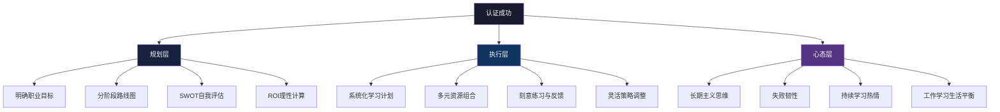

## 28.8 案例总结与经验提炼

本章通过六个真实案例，完整呈现了从初学者到资深从业者的认证历程。每个案例代表一条独特的职业路径——从零基础转型安全管理、专攻渗透测试、切入云安全领域、从运维跨入架构、以Bug Bounty建立声誉、以及从失败中逆风翻盘。现在，让我们跳出单一案例的视角，进行系统性的横向对比与深度提炼，把这六段经历凝练为可复用的方法论框架。

---

### 28.8.1 六大案例全景回顾

| 案例 | 主人公 | 背景画像 | 核心认证路径 | 关键挑战 | 最终成果 |
|------|--------|---------|-------------|---------|---------|
| 案例一 | 张明，30岁 | 计算机本科，5年IT运维 | Security+ → CISSP | 无安全背景、工作繁忙 | 成功转型安全管理岗 |
| 案例二 | 李华，25岁 | 信息安全本科，2年Web开发 | CEH → OSCP → GPEN | 实战经验不足、考试压力 | 成为渗透测试工程师 |
| 案例三 | 王芳，28岁 | 网络工程本科，3年系统管理 | Security+ → CCSP → AWS Security | 云安全知识缺口、跨平台复杂性 | 胜任云安全架构角色 |
| 案例四 | 陈伟，35岁 | 10年IT运维、运维团队负责人 | Security+ → CISSP → CCSP | 年龄偏大、精力有限、缺乏安全背景 | 成功转型云安全架构师 |
| 案例五 | 赵敏，22岁 | CS大四学生，50+漏洞、$10万赏金 | CEH → OSCP → PNPT | 学术与实战平衡、缺乏系统认证体系 | 入职顶级安全公司 |
| 案例六 | 刘洋，28岁 | 网络工程师 | Security+ → CISSP（二次通过） | 首战失败、知识域偏科、心态崩溃 | 第二次高分通过CISSP |

### 28.8.2 横向对比：关键维度深度分析

#### 一、时间投入与效率对比

不同案例的备考周期差异显著，这取决于认证难度、个人基础和可用时间：

| 认证路径 | 备考周期 | 周均学习时长 | 总学习时长 | 效率评级 |
|---------|---------|------------|-----------|---------|
| Security+（入门） | 4-6周 | 8-10小时 | 约50小时 | ★★★★★ |
| CEH | 6-8周 | 8-12小时 | 约70小时 | ★★★★☆ |
| OSCP | 3-6个月 | 15-20小时 | 约300小时 | ★★★☆☆ |
| CCSP | 3-4个月 | 10-15小时 | 约200小时 | ★★★★☆ |
| CISSP（首次） | 4-6个月 | 12-15小时 | 约350小时 | ★★★☆☆ |
| CISSP（二次，有经验） | 2-3个月 | 15-20小时 | 约250小时 | ★★★★☆ |

**关键发现**：

- 入门级认证（Security+、CEH）的投入产出比最高，适合快速建立信心和基础
- OSCP作为实战型认证，需要最长的备考周期——24小时考试的本质要求肌肉记忆级别的技能熟练度
- CISSP的知识域广度（8大域）决定了它需要的不是深度而是覆盖广度，时间分配策略比总时长更重要
- 有过一次失败经验的考生（如刘洋），第二次备考效率提升约40%，因为已经排除了无效学习方法

#### 二、职业路径转型效果对比

| 案例 | 转型前岗位 | 转型后岗位 | 薪资变化 | 转型周期 |
|------|-----------|-----------|---------|---------|
| 张明 | IT运维工程师 | 安全管理经理 | +35%-45% | 约12个月 |
| 李华 | Web开发工程师 | 渗透测试工程师 | +40%-55% | 约18个月 |
| 王芳 | 系统管理员 | 云安全架构师 | +50%-70% | 约24个月 |
| 陈伟 | 运维团队负责人 | 云安全总监 | +30%-40% | 约18个月 |
| 赵敏 | 在校学生 | 高级安全研究员 | 从实习薪资到$12万+/年 | 毕业即入职 |
| 刘洋 | 网络工程师 | 安全架构师 | +25%-35% | 约12个月 |

**关键发现**：

- 从运维到安全的转型路径最成熟，因为运维已经积累了网络、系统、服务器等底层知识
- 云安全方向的薪资增幅最大（50%-70%），反映了市场对云安全人才的极度饥渴
- 学生群体（赵敏）的优势在于时间充裕和学习能力强，但需要通过认证弥补缺乏职场经验的短板
- 35岁以上从业者（陈伟）转型需要更长周期，但管理经验是独特优势

#### 三、失败率与关键失败节点

根据案例分析，认证备考中的失败主要集中在以下节点：

| 失败类型 | 典型表现 | 发生概率 | 案例对应 |
|---------|---------|---------|---------|
| 知识域偏科 | 2-3个域分数极低拖累整体 | 约40% | 刘洋（安全管理域） |
| 心态崩溃 | 考试中途放弃或后续考试恐惧 | 约25% | 刘洋（首战后抑郁） |
| 时间管理失控 | 备考周期无限延长或临时突击 | 约30% | 李华（实习期时间冲突） |
| 资源选择失误 | 使用过时材料或低质量题库 | 约20% | 多个案例均涉及 |
| 实操能力不足 | 实战型考试（如OSCP）理论有余 | 约15% | 李华（首次实验失败） |

---

### 28.8.3 成功要素提炼：三层架构模型

从六个案例中，我们可以提炼出认证成功的核心要素，并将其组织为"规划-执行-心态"三层架构模型：



#### 规划层：谋定而后动

**1. 目标驱动的认证选择**

六个案例无一例外地证明：认证选择必须服务于职业目标，而非反过来。张明选择CISSP是因为目标岗位要求管理能力证明；李华选择OSCP是因为渗透测试岗位以OSCP为硬标准；王芳选择CCSP是因为公司业务全面上云。反面教训是，如果只是"觉得这个认证有用"而没有明确目标，学习动力会在第3个月急剧衰减。

**2. 分阶段路线图**

成功案例的共同特征是将长期目标拆解为阶段性里程碑：

- **张明的路线图**：Security+（3个月，建立信心）→ CISSP（12个月，核心目标）
- **李华的路线图**：CEH（6个月，入门）→ OSCP（18个月，专业认证）→ GPEN（持续提升）
- **王芳的路线图**：Security+（2个月，快速过）→ CCSP（6个月，核心认证）→ AWS Security（3个月，专项深化）
- **陈伟的路线图**：Security+（3个月，快速补齐）→ CISSP（12个月，管理方向）→ CCSP（6个月，云方向）

每个阶段的完成都带来即时回报（加薪、晋升、新机会），同时为下一阶段铺路。这种"短平快+长深耕"的组合策略避免了长期备考的倦怠感。

**3. SWOT自我评估**

陈伟的案例特别强调了SWOT分析的价值。35岁转型虽然有年龄劣势，但10年运维经验和项目管理能力是独特优势。精准的自我认知帮助他选择了"安全架构师"而非"渗透测试工程师"的方向——后者对体力和学习新工具的速度要求更高，而前者更能发挥经验优势。

#### 执行层：方法论决定效率

**1. 系统化学习计划**

六个案例中，成功通过者无一使用"随便看看"的备考方式。共同特征包括：

- **按考试域分配权重**：不是均匀投入时间，而是根据各域在考试中的权重和自身薄弱点动态分配
- **周计划+日检查**：每周设定明确学习目标，每天检查完成进度
- **缓冲时间预留**：在计划中预留20%-30%的缓冲时间应对突发情况

刘洋的案例提供了反面教材——他首战失败的根因之一是学习计划缺乏灵活性，当工作项目临时增加时直接压缩学习时间，导致考前仍有3个知识域准备不足。

**2. 多元资源组合**

成功的备考者通常使用3-4种不同类型的学习资源：

| 资源类型 | 作用 | 典型使用比例 |
|---------|------|------------|
| 官方教材/文档 | 建立完整知识体系 | 约30% |
| 视频课程 | 理解抽象概念、节省自学时间 | 约25% |
| 题库/模拟考试 | 检验学习效果、适应考试节奏 | 约30% |
| 实验/实践平台 | 强化动手能力、加深理解 | 约15% |

李华的OSCP备考特别体现了实验平台的重要性——他花了100+小时在Hack The Box和TryHackMe上进行刻意练习，这是通过24小时实战考试的关键。

**3. 灵活的策略调整**

王芳在备考CCSP过程中发现，云安全的知识更新速度远超预期——考试大纲中的某些服务在备考期间已经迭代了两个大版本。她及时调整策略，从"死记硬背具体操作"转向"理解安全原则和架构思维"，最终顺利通过。

陈伟的策略调整更加大胆——在CISSP备考中期，他发现自己在"资产安全"和"通信与网络安全"两个域的正确率始终低于60%，果断暂停其他域的学习，集中两周专攻这两个薄弱环节。

#### 心态层：决定上限的软实力

**1. 长期主义思维**

赵敏的案例最为典型。22岁的她已经有50+漏洞发现记录和$10万赏金，但她没有急于变现，而是选择用CEH和OSCP来系统化自己的技能体系。这种"延迟满足"的心态帮助她获得了比同龄人更稳固的职业基础。

**2. 失败韧性**

刘洋的故事是失败韧性的最佳诠释。首战CISSP失败后，他经历了约2个月的低谷期，但通过三个关键行动实现反弹：
- 与已通过CISSP的同事进行深度复盘，识别出"学习方法"而非"智力不足"是失败根因
- 重新设计学习计划，增加针对薄弱域的专项训练
- 加入备考互助小组，从同伴支持中恢复信心

从他身上可以学到：**第一次失败不是终点，而是数据采集过程**。关键是系统性地分析失败原因，而非简单归结为"我不行"或"考试太难"。

**3. 工作与学习的平衡**

陈伟作为35岁的团队负责人，需要同时应对管理职责、家庭责任和备考压力。他的应对策略值得所有在职备考者参考：
- **时间块管理**：早晨6:00-7:30为固定学习时间（家人尚未起床）
- **碎片化复习**：通勤时间用于Anki卡片复习
- **家庭沟通**：提前与家人沟通备考计划，争取理解和支持
- **工作整合**：在工作中主动承担安全相关项目，实现"学以致用"

---

### 28.8.4 认证投资回报率（ROI）深度分析

认证是一项投资，理性评估其回报率是规划阶段的核心任务。以下基于六个案例和行业数据，提供更精细化的ROI分析框架。

#### 直接成本明细

| 认证 | 考试费 | 官方培训费 | 学习材料费 | 总计 | 备考期间机会成本 |
|------|-------|-----------|-----------|------|----------------|
| Security+ | $392 | $0-$2,500 | $200-$500 | $592-$3,392 | 较低（备考周期短） |
| CEH | $1,199 | $2,800-$3,500 | $300-$500 | $2,299-$5,199 | 中等 |
| OSCP | $799+ (含lab) | $0 (自学习) | $300-$800 | $1,099-$1,599 | 较高（lab时间密集） |
| CCSP | $599 | $2,500-$3,500 | $300-$500 | $3,399-$4,599 | 中等 |
| CISSP | $749 | $3,000-$4,000 | $500-$800 | $4,249-$5,549 | 较高（备考周期长） |
| GPEN | $849 | $7,000-$9,000 | $300-$500 | $8,149-$10,349 | 高 |

#### 收益量化模型

| 认证 | 平均年薪提升 | 3年累计 | 5年累计 | 回收期 | 10年净收益（扣除续证） |
|------|-------------|--------|--------|-------|---------------------|
| Security+ | $3,000-$8,000 | $9,000-$24,000 | $15,000-$40,000 | 2-6个月 | $25,000-$65,000 |
| CEH | $5,000-$12,000 | $15,000-$36,000 | $25,000-$60,000 | 3-5个月 | $40,000-$95,000 |
| OSCP | $15,000-$25,000 | $45,000-$75,000 | $75,000-$125,000 | 1-2个月 | $130,000-$210,000 |
| CCSP | $12,000-$20,000 | $36,000-$60,000 | $60,000-$100,000 | 2-4个月 | $100,000-$170,000 |
| CISSP | $15,000-$30,000 | $45,000-$90,000 | $75,000-$150,000 | 2-3个月 | $120,000-$250,000 |
| GPEN | $10,000-$20,000 | $30,000-$60,000 | $50,000-$100,000 | 6-12个月 | $70,000-$160,000 |

#### ROI排序与决策建议

基于投资回报率（而非绝对收益）排序，对大多数从业者而言：

1. **OSCP**：投资低、回报高、回收期短。渗透测试方向的首选，ROI在所有认证中最高
2. **Security+**：入门成本最低，是进入安全行业的跳板，回收期极短
3. **CISSP**：绝对收益最高，但投资也较大，适合有3年以上经验的从业者
4. **CCSP**：云安全方向的蓝海认证，市场溢价高，但需要云平台实操基础
5. **CEH**：性价比适中，适合作为渗透测试入门，但专业认可度不如OSCP
6. **GPEN**：培训费用极高（SANS课程$7,000+），ROI相对最低，适合企业报销的从业者

> **案例印证**：赵敏作为学生，优先选择了OSCP而非GPEN，正是基于ROI考量——$800的考试费vs $9,000的培训费，对于自费考生来说选择显而易见。

---

### 28.8.5 常见误区与规避策略

六个案例中暴露出的错误模式具有高度共性。以下是六大高频误区及其系统性规避方案：

#### 误区一：认证数量焦虑——"多考几个总没错"

**典型症状**：看到招聘启事上列出多种认证，就计划"全部拿下"。同时备考2-3个认证，精力分散，最终一个也没考好。

**真实代价**：每个认证的维护成本（续证费、CPE学时、年费）是持续的。持有5个认证意味着每年需要花费数百小时获取CPE，以及数千美元的续证费用。

**正确做法**：
- **T型策略**：先深耕一个核心认证（深度），再根据需要横向扩展（广度）
- **按需获取**：只考取当前或近期职业目标直接需要的认证
- **认证组合建议**：Security+（基础）+ 一个中级认证（OSCP或CCSP）+ 一个高级认证（CISSP或CISM），三证组合已覆盖大多数岗位需求

#### 误区二：题海战术依赖——"刷题就够了"

**典型症状**：只做题不看书、只背答案不理解原理。在选择题考试中可能凑巧通过，但在实战型考试（如OSCP）中必然失败。

**真实案例**：李华首次准备OSCP时，过度依赖网上泄露的题库，结果在实际考试中遇到完全没见过的攻击向量，束手无策。

**正确做法**：
- **70/30法则**：70%时间用于理解原理和动手实践，30%时间用于做题检验
- **题库使用时机**：在完成系统学习后使用，而非作为主要学习材料
- **错题分析**：每做错一题，追根溯源到知识体系中的具体知识点，补充学习

#### 误区三：计划完美主义——"等计划完美了再开始"

**典型症状**：花大量时间设计完美的学习计划、购买所有推荐资源、搭建所有实验环境，却迟迟不开始真正学习。

**正确做法**：
- **80/20启动原则**：当计划覆盖核心内容的80%时就开始执行，在执行中调整
- **最小可行计划**：第一周只需确定"每天学什么、用什么资源"即可，无需制定完整的3个月计划
- **迭代优化**：每周回顾学习效果，根据实际进展调整计划，而非在开始前一次性设计完美计划

#### 误区四：孤岛式备考——"自己一个人学就行"

**典型症状**：从不加入学习社区、从不与人讨论、遇到问题只靠Google。备考效率低，且缺乏外部反馈。

**真实教训**：刘洋首战CISSP时完全独自备考，失败后才意识到——有经验的过来人只需30分钟的指点，就能帮他避开数周的无效学习。

**正确做法**：
- **加入备考社群**：Discord服务器、Reddit论坛、国内安全社区（如FreeBuf、先知社区）
- **寻找学习伙伴**：2-4人的学习小组是最佳规模，既能互相督促又不至于协调困难
- **定期输出分享**：写博客、做笔记分享，费曼学习法的核心就是"教别人"

#### 误区五：忽视续证维护——"考完就完事了"

**典型症状**：通过考试后立即停止学习，直到认证到期前才手忙脚乱地积攒CPE。

**真实代价**：
- 续证费用：大多数认证需要$50-$200的续证费
- CPE要求：CISSP每年需要40个CPE，3年周期120个
- 过期风险：如果超过宽限期未续证，认证失效，需要重新考试

**正确做法**：
- **持续学习计划**：将CPE获取融入日常工作，如参加安全会议、阅读技术文章、参与社区贡献
- **日历提醒**：在认证到期前6个月设置提醒，逐步积攒CPE
- **学习记录习惯**：每次参加培训、阅读文章、发表演讲时立即记录，避免到期前回忆困难

#### 误区六：只看证书不看能力——"有证就有工作"

**典型症状**：认为拿到认证就万事大吉，不注重实际技能培养和项目经验积累。

**市场现实**：面试官可以轻松识别"有证无能"的候选人。一个持有CISSP但无法解释基本安全架构的人，在技术面环节会被迅速淘汰。

**正确做法**：
- **同步实践**：备考期间就开始在工作中应用所学知识
- **建立作品集**：将学习过程中的实验报告、代码项目、漏洞发现记录整理成作品集
- **持续精进**：认证是起点不是终点，拿到证书后继续深入特定领域

---

### 28.8.6 认证路线图定制化指南

不同背景的读者应根据自身情况选择差异化路线。以下是基于案例经验提炼的四条典型路线：

#### 路线A：初入安全行业的新人（0-2年经验）

**代表案例**：赵敏（学生）、李华（Web开发转型）

```text
阶段一（0-6个月）：夯实基础
├── CompTIA Security+（快速通过，建立信心）
├── 搭建个人实验环境（Kali Linux + VirtualBox）
└── 参与CTF比赛（培养实战思维）

阶段二（6-18个月）：专业化突破
├── OSCP（核心认证，投入全部精力）
├── 在Hack The Box/TryHackMe积累排名
└── 开始Bug Bounty积累漏洞发现记录

阶段三（18-36个月）：领域深耕
├── 选择细分方向：GPEN（渗透测试）/ PNPT（网安评估）
├── 参与开源安全工具项目
└── 在安全社区建立个人品牌
```

**关键提醒**：初学者最大的优势是时间和精力，最大的风险是方向分散。OSCP应该作为核心锚点，其他认证围绕它展开。

#### 路线B：IT运维转安全（5-10年经验）

**代表案例**：陈伟（运维负责人转型）、张明（IT运维转型）

```text
阶段一（0-6个月）：快速补齐安全短板
├── CompTIA Security+（利用运维基础快速通过）
├── 补充安全管理体系知识（ISO 27001标准）
└── 在工作中主动承担安全相关任务

阶段二（6-18个月）：管理认证突破
├── CISSP（发挥运维管理经验优势）
├── 利用日常工作中积累的案例丰富考试理解
└── 参加安全社区活动拓展人脉

阶段三（18-36个月）：架构能力深化
├── CCSP（云安全架构方向）
├── AWS/Azure安全架构师认证
└── 推动公司安全体系建设，积累架构经验
```

**关键提醒**：运维转型的最大优势是系统思维和故障排查能力。不要试图从零开始学渗透测试——选择安全管理和架构方向，能最大化利用现有经验的杠杆效应。

#### 路线C：技术转管理方向（3-5年经验）

**代表案例**：张明（IT运维→安全管理）

```text
阶段一（0-3个月）：管理知识入门
├── CompTIA Security+（安全基础知识快速获取）
└── 阅读《CISSP All-in-One Exam Guide》通读

阶段二（3-12个月）：CISSP系统备考
├── 8大知识域按权重分配学习时间
├── 每个域使用"教材+视频+题库"三重学习法
├── 建立与工作场景的关联（如学习访问控制时联系公司实际）
└── 考前1个月集中刷题+模拟考试

阶段三（12-24个月）：管理认证升级
├── CISM（信息安全管理体系）
├── CRISC（风险管理方向）
└── 在工作中推动安全治理体系建设
```

**关键提醒**：CISSP对"管理者视角"的强调是双刃剑——运维背景者需要转变思维方式，从"怎么解决问题"转向"怎么从管理角度理解问题"。

#### 路线D：云安全专项路线（有云平台经验）

**代表案例**：王芳（云安全转型）

```text
阶段一（0-3个月）：云安全基础
├── CompTIA Security+（快速过，安全基础）
├── 熟悉云安全联盟（CSA）的CCSK框架
└── 在当前工作中实践云安全配置

阶段二（3-9个月）：CCSP核心备考
├── 6大知识域系统学习（云数据安全、云架构安全等）
├── 结合AWS/阿里云实际操作加深理解
├── 使用官方练习题+第三方题库双重检验
└── 重点关注"云平台安全配置"的实操题

阶段三（9-15个月）：厂商认证深化
├── AWS Security Specialty（或Azure Security Engineer）
├── Kubernetes Security（CKS认证）
└── 在公司云迁移项目中实践云安全架构
```

**关键提醒**：云安全领域发展极快，认证知识可能在备考期间就已经过时。重点理解"安全原则"而非"具体操作步骤"——前者是跨平台通用的，后者是特定版本相关的。

---

### 28.8.7 认证维护与长期发展

通过认证不是终点，而是职业生涯中的一个重要里程碑。以下是认证后的长期发展建议：

#### 认证维护清单

| 认证 | 有效期 | CPE要求 | 年费 | 续证截止提醒 |
|------|-------|---------|------|-------------|
| Security+ | 3年 | 50 CPE/周期 | $75/年 | 到期前6个月 |
| CEH | 3年 | 120 CPE/周期 | $80/年 | 到期前6个月 |
| OSCP | 3年 | 无CPE要求，但建议持续学习 | 无 | 到期前重考或升级 |
| CCSP | 3年 | 90 CPE/周期 | $100/年 | 到期前6个月 |
| CISSP | 3年 | 120 CPE/周期 | $125/年 | 到期前6个月 |
| GPEN | 4年 | 36 CPE/年 | 含在SANS会员中 | 到期前12个月 |

#### CPE获取渠道

通过认证后，持续获取CPE（Continuing Professional Education）学时是维持认证的必要条件。以下是高效获取CPE的渠道：

**高效渠道（每年可获取50+ CPE）**：
- 参加安全会议：Black Hat（40 CPE）、DEF CON（20 CPE）、国内安全会议（10-20 CPE）
- 在线课程：SANS OnDemand（按课程计）、Cybrary（按课程计）
- 发表技术文章：每篇技术博客/论文可计5-10 CTE

**常规渠道（每年可获取20-40 CPE）**：
- 阅读安全行业报告和白皮书
- 参与安全社区活动和在线研讨会
- 参与开源安全项目贡献
- 在公司内部进行安全培训授课

**高效管理技巧**：
- 使用认证机构提供的在线工具记录CPE（如(ISC)²的Continuing Education Portal）
- 将工作中的安全项目、培训、会议记录与CPE关联
- 在日历中设置季度检查点，确保CPE进度与要求匹配

#### 持续学习路线图

认证只是知识体系的骨架，持续学习才能让这个骨架长出血肉：

| 时间维度 | 学习重点 | 推荐方式 |
|---------|---------|---------|
| 每日（15-30分钟） | 安全资讯、漏洞通报 | 订阅安全简报（如The Hacker News、SecurityWeek） |
| 每周（2-3小时） | 技术深度文章、行业分析 | 阅读博客、播客、技术论坛 |
| 每月（4-6小时） | 新工具学习、实验探索 | 搭建实验环境、参与CTF |
| 每季度（1-2天） | 安全会议、行业趋势 | 参加线上/线下安全会议 |
| 每年 | 认证升级/新认证 | 评估市场趋势和个人发展方向 |

---

### 28.8.8 行业趋势与认证演进

安全认证不是一成不变的。了解行业趋势有助于提前规划：

#### 正在兴起的认证方向

1. **AI安全认证**：随着AI/ML在安全领域的广泛应用，AI安全评估和对抗性测试正在成为新方向。目前尚无公认的权威认证，但预计2-3年内将出现标准化认证体系
2. **DevSecOps认证**：安全左移趋势催生了对DevSecOps专业人才的需求，AWS和Azure已开始提供相关安全认证
3. **OT/IoT安全认证**：工业控制系统安全、物联网安全认证（如GICSP）需求随着智能制造和智慧城市发展持续增长
4. **隐私保护认证**：GDPR和各国数据保护法规推动了隐私保护认证的需求，CDPSE（Certified Data Privacy Solutions Engineer）是代表性认证

#### 认证体系的演进趋势

1. **实战化转向**：越来越多认证从纯选择题向实操考核转变（OSCP模式的推广）
2. **持续评估**：部分机构开始探索持续评估而非一次性考试的认证模式
3. **微认证（Micro-credentials）**：针对特定技能的短期认证开始流行，适合作为现有认证的补充
4. **云原生安全**：纯云平台安全认证（如AWS/Azure/GCP专属安全认证）的重要性持续提升

#### 给未来考生的建议

1. **关注认证更新**：定期查看认证机构官网，了解考试大纲变化
2. **预留学习预算**：每年预留$1,000-$3,000用于认证维护和新认证获取
3. **建立学习习惯**：将学习融入日常工作，而非仅在认证备考期突击
4. **保持技术敏感度**：关注安全行业博客、播客、会议，及时了解新威胁和新技术

---

### 28.8.9 本章核心要点速查

最后，将全章最核心的经验浓缩为可快速回顾的要点：

**规划阶段三问**：
1. 我的1-3年职业目标是什么？认证如何服务于这个目标？
2. 我的当前水平和目标认证之间的差距是什么？
3. 我有多少预算（时间+金钱）可以投入？

**执行阶段三原则**：
1. 目标分解：将大目标拆解为每周可检查的小里程碑
2. 资源组合：教材+视频+题库+实验，至少三种资源交叉验证
3. 策略调整：每两周评估一次学习效果，及时调整时间和资源分配

**心态管理三支柱**：
1. 长期主义：认证是马拉松，不是百米冲刺
2. 失败韧性：首战不通过是常态，系统分析后再次出发
3. 持续学习：通过认证只是开始，维持和深化才是长期任务

**终极忠告**：

> 认证是职业发展的加速器，但不是唯一引擎。真正的竞争力来自"认证+实践+学习力"的三位一体。不要让认证成为负担——选择适合自己的、服务于真实职业目标的认证，用正确的方法高效备考，通过之后持续精进。这才是六个案例共同指向的终极答案。
