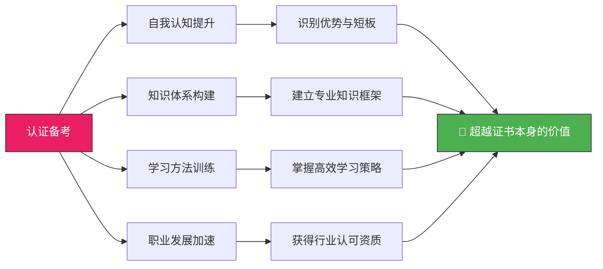

## 28.1 认证备考策略

```mermaid
graph TD
    A["📚 认证备考策略全景"] --> B["第一步：自我评估"]
    A --> C["第二步：设定目标"]
    A --> D["第三步：分解内容"]
    A --> E["第四步：安排时间"]
    A --> F["第五步：学习执行"]
    A --> G["第六步：冲刺突破"]
    A --> H["第七步：考试通过"]
    
    B --> B1["基础知识评估"]
    B --> B2["薄弱环节识别"]
    B --> B3["学习风格诊断"]
    
    C --> C1["SMART目标设定"]
    C --> C2["考试日期确认"]
    C --> C3["通过标准分析"]
    
    D --> D1["模块化拆分"]
    D --> D2["优先级排序"]
    D --> D3["知识图谱构建"]
    
    E --> E1["工作日安排"]
    E --> E2["周末强化"]
    E --> E3["弹性缓冲期"]
    
    F --> F1["多轮复习法"]
    F --> F2["主动回忆"]
    F --> F3["错题整理"]
    F --> F4["模拟测试"]
    
    G --> G1["查漏补缺"]
    G --> G2["考前模拟"]
    G --> G3["状态调整"]
    
    style A fill:#E91E63,stroke:#333,color:#fff
    style B fill:#FF9800,stroke:#333,color:#fff
    style C fill:#FF9800,stroke:#333,color:#fff
    style D fill:#2196F3,stroke:#333,color:#fff
    style E fill:#2196F3,stroke:#333,color:#fff
    style F fill:#4CAF50,stroke:#333,color:#fff
    style G fill:#4CAF50,stroke:#333,color:#fff
    style H fill:#4CAF50,stroke:#333,color:#fff
```



认证备考不是简单的"看书+做题"重复劳动，而是一个系统工程。根据（ISC）² 2024年发布的行业调研报告，成功通过高级安全认证（如CISSP、CISM）的考生平均备考周期为4-6个月，投入时间200-400小时。而未能通过的考生中，63%的人承认缺乏系统性的备考策略。更值得注意的是，Pearson VUE的考试统计数据显示，首次通过率高的考生与通过率低的考生之间，最大的差异不在于智力或基础，而在于是否使用了结构化的备考方法。

本章将为你拆解认证备考的完整方法论——从自我评估到考试日策略，每一步都有可执行的标准和工具。无论你正在备考的是入门级的Security+、实战型的OSCP，还是管理级的CISSP，这套方法论都适用。

---

### 28.1.1 自我评估——在开始前先看清自己

自我评估是备考的起点，也是最容易被跳过的一步。许多考生看到考试大纲就直接开始看书，结果学到一半发现基础概念欠缺、或者知识点远比预期庞杂。科学的自我评估包含以下三个维度：

#### 基础知识评估

网络安全认证的知识范围通常可以分为若干领域。以CISSP为例，涵盖安全与风险管理、资产安全、安全架构与工程、通信与网络安全、身份与访问管理、安全评估与测试、安全运营、软件开发安全八个领域（CBK）。评估你的每个领域掌握程度：

| 评估等级 | 定义 | 对应策略 |
|---------|------|---------|
| L1 - 零基础 | 完全没接触过该领域概念 | 从最基础教材开始，预留额外20-30%学习时间 |
| L2 - 了解概念 | 知道术语和基本定义，但无法解释原理 | 重点理解核心机制而非记忆名称 |
| L3 - 能讲解 | 可以为他人讲解该领域核心内容 | 进入练习和深化阶段 |
| L4 - 能应用 | 在实际工作或项目中使用过相关知识 | 重点关注考试特有考点和格式 |
| L5 - 能教学 | 达到可以培训他人水平 | 仅需模拟测试和时间管理训练 |

**评估工具**：正规认证机构通常提供官方样题（约25-50题）作为摸底工具。使用样题的目的不是"判断能不能通过"，而是识别每个领域的得分率。例如：

- **OSCP**：官方PWK课程预测试可以帮你判断是否具备参加培训的基础条件。如果你在预测试中无法独立完成基础的Web应用渗透，建议先完成TryHackMe的Pre-Security路径。
- **CISSP**：ISC²官网提供的官方练习测试（Official Practice Tests）前50题可以作为摸底。Wiley Efficient Learning平台也提供按领域分类的诊断测试。
- **CompTIA Security+**：CompTIA CertMaster平台的在线预评估工具能给出各领域的掌握百分比，评估结果会直接推荐你从哪个模块开始。
- **CEH**：EC-Council提供官方的入门评估测试，可以在iLabs平台免费访问。

**实操步骤**：
1. 找到目标认证的官方评估工具或样题（至少25题以上才有统计意义）
2. 在不查资料的情况下，限时完成（模拟考试环境）
3. 按领域统计正确率，制作雷达图或柱状图
4. 将结果填入上述L1-L5等级表
5. 保存评估结果作为后续学习计划的基准线

#### 薄弱环节识别

识别薄弱环节时，建议按照"权重×差距"的方法排序：

```text
优先级分 = 领域权重(%) × (1 - 当前掌握度)
```

其中领域权重来自考试大纲中该领域题目占比，当前掌握度通过摸底测试得出（0.0-1.0）。计算后按优先级分从高到低排序，优先攻克高分值领域中的低掌握内容。

以CISSP为例，安全运营领域占13%，如果掌握度只有0.3，优先级分为 13% × 0.7 = 9.1。安全架构与工程领域占15%，如果掌握度为0.6，优先级分为 15% × 0.4 = 6.0。在这种情况下，虽然安全架构权重更高，但因为已有基础，安全运营反而更需要优先投入，因为它的提升空间更大。

| 领域 | 权重 | 掌握度 | 差距 | 优先级分 | 优先级 |
|------|------|--------|------|----------|--------|
| 安全运营 | 13% | 0.3 | 0.7 | 9.1 | 1 |
| 安全架构与工程 | 15% | 0.6 | 0.4 | 6.0 | 2 |
| 软件开发安全 | 11% | 0.2 | 0.8 | 8.8 | 3 |
| 资产安全 | 10% | 0.5 | 0.5 | 5.0 | 4 |

**注意力陷阱**：人天生倾向于复习自己已经熟悉的内容（因为这会带来成就感），而回避不擅长的领域。制定学习计划时，必须有意识地强制分配时间给薄弱环节。一种有效的方法是"最不喜欢的领域优先法则"——每天学习的第一个时段，固定分配给最让你抗拒的科目。研究表明，清晨的皮质醇水平最高，认知能力处于峰值，此时攻克难题的效率比晚间高约30%。

#### 学习风格诊断

每个人的学习风格不同，找到适合自己的方式可以显著提升效率。根据VARK学习模型，常见的学习风格有：

- **视觉型**（Visual）：擅长通过图表、思维导图、颜色编码来学习。备考时多制作知识图谱和流程图。推荐工具：XMind、Mermaid、Excalidraw。
- **听觉型**（Aural）：通过听课、讨论、口述来巩固知识。适合参加培训班、学习小组、或录制自己的讲解音频。推荐工具：Audacity录音、YouTube安全频道播客。
- **读/写型**（Read/Write）：通过阅读和笔记来学习。适合精读教材、整理笔记、撰写总结。推荐工具：Notion、Obsidian、Logseq。
- **动觉型**（Kinesthetic）：通过动手实践来学习。适合实验室操作、CTF挑战、配置真实环境。推荐工具：TryHackMe、Hack The Box、本地虚拟实验室。

**混合策略推荐**：虽然每个人都有优势风格，但研究表明使用多种感官渠道学习（多模态学习）的记忆效果优于单一渠道。备考时至少结合阅读+练习两种方式。例如，读完一个章节后，立即做对应练习；听完一节课程后，整理一页思维导图。

**学习风格自测**：在正式备考前，花15分钟做一个简单的VARK问卷测试（网上有免费版本），了解自己的主导风格。然后根据主导风格选择主要学习路径，辅以其他风格作为补充。

---

### 28.1.2 设定目标——SMART框架在认证备考中的运用

认证备考的周期通常长达数月，没有一个清晰的目标框架，中途放弃的概率会大幅增加。Locke的目标设定理论指出，具体且有挑战性的目标比"尽力而为"的目标能带来更高的绩效。运用SMART框架可将模糊的"我要考过XX认证"转化为可执行的计划。

#### 如何制定SMART目标

| 维度 | 要求 | 举例（以CISSP为例） |
|------|------|-------------------|
| S（Specific）具体 | 明确考试名称、版本、时间、目标分数 | 在2026年3月15日前通过CISSP考试，每题得分率不低于70% |
| M（Measurable）可衡量 | 有量化指标追踪进度 | 每天完成50道练习题，每周掌握1个CBK领域 |
| A（Achievable）可达成 | 目标与当前水平和可用时间匹配 | 已有3年安全工作经验，每天可投入2小时，6个月内可行 |
| R（Relevant）相关 | 目标与职业发展路径一致 | CISSP是晋升安全管理岗位的必要资质 |
| T（Time-bound）有时限 | 设定明确的截止日期 | 2026年3月15日，逾期重新评估 |

**SMART目标示例对比**：

| 维度 | ❌ 模糊目标 | ✅ SMART目标 |
|------|------------|-------------|
| 定性 | "我要考过CISSP" | "我要在2026年3月15日通过CISSP考试" |
| 定量 | "多做些题" | "每天完成50道练习题，正确率从当前60%提升到80%" |
| 可追踪 | "好好复习" | "每周完成1个CBK领域的精读+练习，用Notion记录进度" |

#### 在实际操作中反向规划

确定考试日期后，使用反向规划法（Backward Planning）拆解每月、每周、每天的任务：

```text
考试日期：2026年3月15日
现在日期：2025年9月15日
可用周期：26周

阶段分配：
  第1-8周（9月-11月）：精读教材第一遍 + 逐领域练习
  第9-16周（11月-1月）：精读教材第二遍 + 错题集中攻克
  第17-22周（1月-3月）：模拟测试 + 查漏补缺
  第23-26周（3月）：冲刺复习 + 状态调整 → 考试
```

每个月的第一周，检查前一个月的进度是否达标，根据实际情况调整后续计划。这种固定周期的回顾机制（PDCA循环）是长期备考不掉队的关键。

**反向规划的实操步骤**：
1. 从考试日期倒推，确定总备考周期（建议至少预留10%的缓冲时间）
2. 将总周期分为4个阶段：概览→精读→强化→冲刺
3. 为每个阶段分配时间比例（推荐25%:40%:25%:10%）
4. 将阶段目标分解为月度里程碑
5. 每月里程碑再分解为周度任务
6. 周度任务最终落实为每日学习清单

---

### 28.1.3 分解内容——模块化学习的艺术

认证考试的大纲通常由几十个甚至上百个知识点构成，面对庞杂的内容体系，最有效的策略是**模块化分解**。

#### 模块化拆分方法

以CEH（Certified Ethical Hacker）考试为例，官方大纲涵盖20个模块。模块化拆分的步骤：

1. **按官方大纲分组**：将20个模块按主题聚类为5-6个大类（如信息收集、漏洞分析、攻击技术、防御技术、工具使用、法律法规）
2. **评估每个模块的难度和工作量**：使用1-5分制打分
3. **评估每个模块与你的距离**（即当前掌握度）
4. **计算每个模块的"需要投入" = 难度 × (5 - 掌握度)**
5. **按投入分数从高到低排序，确定学习优先级**

```text
模块：信息收集（难度2，掌握度3）→ 需要投入 = 2 × 2 = 4
模块：漏洞分析（难度3，掌握度1）→ 需要投入 = 3 × 4 = 12 （优先）
模块：攻击技术（难度5，掌握度2）→ 需要投入 = 5 × 3 = 15 （最优先）
```

**不同认证的模块化策略差异**：

| 认证类型 | 模块数量 | 特点 | 分解策略 |
|---------|---------|------|---------|
| Security+ | 约35个目标 | 概念为主，覆盖面广 | 按领域分组，每组2-3天 |
| CEH | 20个模块 | 工具和攻击技术为主 | 按攻击链顺序分组 |
| CISSP | 8个领域 | 深度和广度兼具 | 按领域逐一击破，注重交叉 |
| OSCP | 不固定 | 纯实操 | 按技术栈分组（Web/内核/提权） |
| CISM | 4个领域 | 管理和策略导向 | 按业务流程串联 |

#### 知识图谱构建

对于每个模块，建议构建知识图谱而非线性笔记。知识图谱是一种以概念为节点、以关系为边的网络结构，相比传统笔记有以下优势：

- **强调整体结构**：一眼看清知识点之间的层级和关联
- **便于发现空白**：孤立的节点意味着该概念缺少上下文，需要补充
- **支持主动回忆**：看到节点名称后回忆定义，比阅读笔记更有效

**实操方法**：使用XMind或FreeMind创建每个模块的思维导图。先画主干（一二级），再填充枝叶（三四级细节）。每天学习新内容后，更新对应模块的导图。一周后，只看一级节点名称，尝试从记忆中展开整个子树。能成功展开的模块标记为"已掌握"，需要参考的模块标记为"需复习"。

**知识图谱的数字化管理**：
- 使用Obsidian创建双向链接的知识库，每个知识点是一个Markdown文件
- 用`[[ ]]`语法链接相关概念，形成网状结构
- 利用Obsidian的Graph View可视化知识网络
- 定期检查"孤立节点"（无链接的概念），补充关联关系

#### 知识串联策略

认证考试不同于学校考试，它不会单独考察某个知识点，而是综合考察多个领域的交叉内容。例如，CISSP考试中一道关于远程访问的问题，可能同时涉及网络安全、身份管理、安全运营三个领域。

**交叉复习法**：每周安排一次"跨领域练习"，随机组合两个看似无关的领域，找出它们在实际场景中的交集。例如：

- 密码学（安全架构） + 社会工程学（安全运营）= 如何向终端用户解释PKI的信任模型？
- 风险评估（安全管理） + 入侵检测（安全运营）= 如何基于风险等级配置IDS规则？
- 访问控制（身份管理） + 加密通信（网络安全）= 如何设计零信任架构中的端到端加密方案？
- 合规审计（安全评估） + 数据保护（资产安全）= 如何在GDPR框架下设计数据分类策略？

这种交叉训练能帮助你建立知识之间的桥梁，在考试中看到题目时快速定位到多个领域的答案。

---

### 28.1.4 安排时间——将有限的时间用在刀刃上

安全认证备考的常见困境是：工作忙、家庭事务多、学习时间碎片化。时间管理不是简单地"挤出时间"，而是对有限时间的战略性分配。

#### 工作日晚间安排（周一至周五）

针对全职工作者的备考者，工作日的黄金学习时间是**晚上8:00-10:30**（假设下班后处理完生活事务）。建议采用90分钟深度学习法：人的注意力高度集中时间约为45-90分钟，超过这个范围学习效率会断崖式下降。

| 时段 | 活动 | 时长 | 说明 |
|------|------|------|------|
| 20:00-20:05 | 回顾昨日内容 | 5分钟 | 唤醒记忆（利用Spaced Repetition原则） |
| 20:05-21:05 | 深度学习新内容 | 60分钟 | 精读教材/看视频课程 |
| 21:05-21:10 | 休息 | 5分钟 | 远离屏幕，闭目养神 |
| 21:10-21:40 | 练习巩固 | 30分钟 | 做对应章节练习题 |
| 21:40-21:50 | 整理错题/笔记 | 10分钟 | 记录今日重点和错题 |
| 21:50-22:00 | 预览明日内容 | 10分钟 | 浏览明日要学的标题和图表 |

**注意事项**：
- 每天学习量不宜过大。按照成年人认知负荷的研究，每天2小时新知识学习是可持续的上限。超过此限度的内容在一周后留存率低于10%。
- 学习时段固定化。建立"每晚8点准时开始"的条件反射，降低启动阻力（startup friction）。
- 手机放在另一个房间。根据加州大学欧文分校的研究，手机上未读消息的存在（即使不看）会持续消耗认知资源，降低学习效率达20-30%。
- 使用"两分钟规则"：如果开始学习前有小任务（回消息、整理桌面），先花2分钟处理完，避免在学习时分心。

#### 周末强化安排（周六至周日）

周末是追赶进度和深度练习的黄金时间，但不宜把两天全部排满，否则会产生持续疲劳，影响下一周的工作和学习。

| 时段 | 周六 | 周日 |
|------|------|------|
| 上午 9:00-10:30 | 深度学习新内容 | 复习本周学过的所有内容 |
| 10:30-10:45 | 休息 | 休息 |
| 10:45-12:00 | 对应模块练习题 | 综合练习题（跨领域） |
| 12:00-14:00 | 午餐+午休 | 午餐+午休 |
| 下午 14:00-15:30 | 实验室/动手实操 | 模拟测试（如有） |
| 15:30-16:00 | 休息+整理 | 休息+整理 |
| 16:00-17:30 | 错题回顾 | 下一周学习规划 |
| 晚上 | 自由活动 | 自由活动 |

**关键原则**：周六学习新内容，周日复习巩固。周日晚上留出30分钟规划下一周的每日学习任务。这个习惯虽然看似简单，但实际效果显著——明确列出目标的学习者比凭感觉学习者的执行率高出42%（根据杜克大学目标执行研究）。

#### 弹性缓冲期的设置

即使最好的计划也会遇到意外——加班、生病、家庭事务。因此，在总体规划中必须设置缓冲期。建议：

- 每4周中安排1周作为"缓冲周"：用于追赶进度、处理未完成的模块、或者纯粹休息
- 每个阶段（如"精读阶段"）结束时预留1周作为缓冲
- 如果缓冲期未被使用（进度正常），则可以用这周进行额外的模拟测试或深度实践

**实际案例**：一位备考CISSP的安全工程师，原本计划16周完成第一次精读，因为在第6周和第11周遇到工作上的紧急项目，导致进度落后了3周。由于他预留了4周的总缓冲期，最终仍能在预定日期之前完成全部准备。对比另一位没有预留缓冲期的同事，在类似的情况下被迫推迟了2个月的考试。

**缓冲期的三种使用模式**：

| 模式 | 适用场景 | 操作方式 |
|------|---------|---------|
| 追赶模式 | 进度落后 | 优先完成高优先级模块，跳过低优先级的细节 |
| 深化模式 | 进度正常 | 针对薄弱领域做专项强化训练 |
| 休息模式 | 疲劳累积 | 完全不学习，让大脑整合和巩固已有知识 |

---

### 28.1.5 学习执行——从输入到输出的转化

这是备考策略中最核心的部分。很多考生失败不是因为不懂知识，而是因为**只会输入不会输出**——能看懂答案但做不对题。以下四种方法可以帮助你实现从"知道"到"做到"的转化。

#### 多轮复习法（Pass Method）

多轮复习法的核心思想是：第一轮不求记住所有细节，而是建立整体框架；第二轮填充细节；第三轮融会贯通。

**第一轮（概览）**：快速通读全书或课程，目标是了解整体结构和各模块的定位。不要求理解每个细节，不理解的地方做标记跳过。此轮耗时占总计划的25%。完成标准：能够画出整本书的一级目录结构，说出每个模块的核心主题。

**第二轮（精读）**：逐章深入学习，配合练习题加深理解。每个模块学完后，自己画一张该模块的知识图谱（不看书）。此轮耗时占总计划的40%。完成标准：能够独立讲解每个模块的核心概念，练习题正确率达到70%以上。

**第三轮（整合）**：跨模块关联学习，做完整模拟题，识别和弥补知识盲区。此轮耗时占总计划的25%。完成标准：完整模拟测试得分率达到通过线以上，各领域无明显短板。

**冲刺轮**：考前1-2周，只看错题、笔记和知识图谱，不做大量新题。此轮耗时占总计划的10%。完成标准：错题库中的题目能够100%正确回答，知识图谱能够闭卷完整复述。

这种"由粗到细再到粗"的学习路径，比从头到尾精读一遍同时试图记住所有内容的效果高出50%以上（基于间隔重复和交替学习的心理学研究）。

#### 主动回忆（Active Recall）

主动回忆是目前被认知科学证实最有效的学习策略之一，其效果远超被动阅读和画高亮。核心做法是：在学习一个知识点后，主动从记忆中提取信息，而不是被动地重新阅读。

**具体操作**：

1. 读完一个章节后，将书合上，用白纸或空文档写下你能记住的所有要点
2. 对照原文，用红笔标注遗漏和错误的地方
3. 重点关注那些写错或忘记的部分——这些是你的真正薄弱环节
4. 24小时后，重复第1-3步

**Leitner卡片系统**：将知识点写在Anki卡上，每张卡分到不同盒子里。正确回答的卡片升级到更长的复习间隔，错误回答的卡片回到初级盒。这个系统的精妙之处在于，你的学习时间自然而然地集中在最不熟悉的知识点上。

| 盒子 | 复习频率 | 卡片数量控制 |
|------|---------|------------|
| 盒子1 | 每天一次 | 限制在20张以内 |
| 盒子2 | 每3天一次 | 无上限 |
| 盒子3 | 每周一次 | 无上限 |
| 盒子4 | 每2周一次 | 无上限 |
| 盒子5 | 每月一次 | 无上限 |

**Anki卡片制作最佳实践**：
- 每张卡片只包含一个知识点（避免信息过载）
- 使用"填空式"卡片记忆关键术语：`______是一种通过验证用户身份来控制资源访问的过程`
- 使用"问答式"卡片理解概念：`Q: 什么是最小权限原则？A: 只授予用户完成工作所必需的最低权限`
- 使用"场景式"卡片训练应用能力：`Q: 某公司员工离职后仍能访问内部系统，应采用什么安全控制？A: 账户生命周期管理中的及时停用流程`
- 每周添加20-30张新卡片，避免一次性添加过多导致复习压力过大

#### 错题整理方法论

错题不是简单的"做错了抄下来"，而是每一次考试评估中最有价值的数据。通过系统化的错题分析，你可以精准定位知识盲区并针对性弥补。

**错题记录模板**：

```text
题目编号：CISSP-0123
原始题目：[题目简述]
我的错误答案：B（选择了"业务影响分析"）
正确答案：C（"关键资产识别"）
错误类型：概念混淆（误把BIA当做资产识别方法）
知识盲区：BIA与资产识别的定义边界不清晰
补救行动：重读OSG第3章第4节，做10道同类练习题
复习日期：2026-01-15（3天后）
检查结果：[填写]
```

**错误分类维度**：

1. **概念混淆**（占比约40%）：两个类似概念的定义和边界不清
   - 处理方式：用对比表格梳理差异，例如BIA vs RA vs 资产识别
   - 预防方法：学习新概念时，主动找一个容易混淆的类似概念做对比
2. **知识遗漏**（占比约30%）：完全没接触过该知识点
   - 处理方式：添加新卡片到Anki，从理论到题目的完整学习
   - 预防方法：定期检查知识图谱中的孤立节点
3. **阅读理解错误**（占比约20%）：理解了知识但读错了题干关键字
   - 处理方式：训练自己在做每道题前圈出3个关键字
   - 预防方法：做题时放慢速度，先通读题干再看选项
4. **粗心大意**（占比约10%）：紧迫、疲劳或审题不仔细
   - 处理方式：调整状态，考前保证充足睡眠
   - 预防方法：建立做题检查清单，最后5分钟专门用于复查标记题目

**每周错题回顾会**：每周日晚上，花30分钟回顾本周所有错题。对于已经成功纠正2次的错题，移出"重点监控"列表；对于反复出错的，标记为"顽固弱点"，需要采取新的学习方法（比如换个教材或换种解释方式）。

#### 模拟测试的科学使用

模拟测试是最接近真实考试的训练方式，但如果使用方法不当，反而会浪费宝贵的学习时间。

**模拟测试的正确节奏**：

| 阶段 | 频率 | 用途 |
|------|------|------|
| 学习前期 | 每2周1次 | 评估进度，发现空白领域 |
| 学习中期 | 每周1次 | 训练时间管理，适应题型 |
| 学习后期 | 每3天1次 | 冲刺阶段，查漏补缺 |
| 最后一周 | 0-1次 | 保持手感但不影响信心 |

**模拟测试的关键数据记录**：

做模拟测试后，除了总分，一定要记录以下数据：

- **每个领域的得分率**：发现哪个领域持续偏低
- **每道题的用时**：哪些题超时了？是知识点不熟悉还是计算题耗时？
- **做题顺序**：先做擅长的还是按顺序做？哪种策略正确率更高？
- **第二遍检查时的改动**：从正确改为错误的比例是多少？如果这个比例高，说明第一遍还不够确定，需要加强知识点深度理解

**模拟测试的环境设置**：
- 选择安静、不受打扰的环境
- 使用与真实考试相同的计时方式
- 关闭手机和所有通知
- 如果真实考试是机考，尽量用电脑而非手机做题
- 准备与真实考试相同的草稿工具

---

### 28.1.6 冲刺突破——最后30天的作战计划

考前一个月是备考的黄金冲刺期。这个阶段的策略与前期有本质区别——从"全面学习"转向"精准打击"。

#### 考前30天时间分配

| 时间段 | 重点任务 | 时间占比 |
|--------|---------|---------|
| 第30-21天 | 完成最后一遍各领域知识点扫描 | 30% |
| 第20-11天 | 高强度模拟测试（每2-3天一套） | 40% |
| 第10-6天 | 错题集中歼灭（只看错题和笔记） | 20% |
| 第5-1天 | 状态调整（轻度复习+充足休息） | 10% |

**考前10天的关键提示**：
- 不再学习全新的知识，只巩固已有内容
- 停止做大批量新题，专注回顾错题
- 调整作息，确保与考试当天时间一致（如8:00起床、23:00前入睡）
- 模拟考试当天的环境——如果你要在早上9点考试，提前几天在9点做模拟测试
- 准备好考试当天需要的所有证件、确认邮件、考场地址

#### 考试日策略

考试当天的表现往往决定最终结果。即使是准备充分的考生，如果考试日策略不当，也可能发挥失常。

**考前一周的准备清单**：

| 准备事项 | 具体操作 | 重要性 |
|---------|---------|--------|
| 证件准备 | 确认身份证/护照有效期，准备2份复印件 | ⭐⭐⭐⭐⭐ |
| 考场踩点 | 提前1天去考场熟悉路线、计算通勤时间 | ⭐⭐⭐⭐ |
| 物品清单 | 准备好准考证、文具、水、轻便零食 | ⭐⭐⭐⭐ |
| 作息调整 | 提前3天开始模拟考试日作息时间 | ⭐⭐⭐⭐ |
| 饮食安排 | 考前一晚正常饮食，避免生冷和过量咖啡因 | ⭐⭐⭐ |

**考试当天的时间管理策略**：

```text
以CISSP为例（250题，6小时）：
- 平均每题用时：6分钟（含阅读、思考、作答）
- 建议分3个阶段：
  第1阶段（前2小时）：按顺序做题，遇到不确定的标记后跳过
  第2阶段（中间2小时）：完成跳过的题目，重点关注标记题
  第3阶段（最后2小时）：复查所有标记题，检查答题卡

以Security+为例（最多90题，90分钟）：
- 平均每题用时：1分钟
- 建议分2个阶段：
  第1阶段（60分钟）：按顺序快速作答
  第2阶段（30分钟）：复查标记题
```

**考试中的心理调节**：
- 遇到不会的题：深呼吸3次，标记后跳过，不要在一题上消耗过多时间
- 感到焦虑时：提醒自己"我已经准备了X个月，大部分题目我都会"
- 中途休息时：去洗手间用冷水洗把脸，做5次深呼吸
- 答题速度变慢时：可能是疲劳，起身走动2分钟再继续

#### 状态调适与心理准备

备考后期最大的敌人不是知识不足，而是焦虑和疲劳。以下方法可以帮助你在冲刺期保持良好的心理状态：

- **正念休息**：每学习90分钟，进行一次5分钟的深呼吸或冥想。研究表明，这可以显著降低皮质醇水平，提高学习效率
- **积极自我对话**：将"我记不住这些"改为"这需要更多练习，我可以做到"
- **保持运动**：每周至少3次30分钟的中等强度有氧运动，增加大脑血流和BDNF（脑源性神经营养因子）水平，这直接影响记忆力和学习能力
- **模拟考试后的心理恢复**：如果模拟考试成绩不理想，允许自己沮丧30分钟，然后分析错题找出问题原因并进行针对性改善
- **建立支持网络**：加入备考社群（Discord、Reddit、微信群），与其他考生交流进度和心得。社交支持是应对备考压力的重要缓冲

**焦虑水平自检表**：

| 症状 | 轻度（正常） | 中度（需关注） | 重度（需干预） |
|------|-------------|---------------|---------------|
| 睡眠 | 偶尔失眠 | 持续1周以上入睡困难 | 严重失眠，影响白天状态 |
| 食欲 | 轻微下降 | 明显变化 | 完全没有食欲或暴饮暴食 |
| 注意力 | 偶尔走神 | 频繁走神，难以集中 | 无法阅读超过10分钟 |
| 情绪 | 轻微紧张 | 明显烦躁 | 哭泣、绝望感 |
| 身体 | 轻微头痛 | 持续疲劳 | 胸闷、心悸 |

如果出现中度以上症状，建议调整学习计划，增加休息时间，必要时寻求专业帮助。

---

### 28.1.7 常见误区与纠正

根据对数百名认证考生的跟踪调查，以下是备考中最常见也最致命的误区：

**误区一：等准备好了再报名**

很多考生不报名考试，等自己"学完"再报。结果因为没有明确的截止日期，学习进度持续拖延，最终不了了之。

**纠正**：确定备考计划时立即报名考试。无论是3个月后还是6个月后，一个明确的deadline会提供持续的紧迫感。数据表明，提前报名的考生完成备考的概率是未报名者的2.3倍。

**误区二：只看书不做题**

部分考生追求"书读三遍"，但几乎没有做过任何练习题。到了考场上发现自己理解了概念，但完全不适应考试的出题方式——尤其是CISSP这类以场景题为主的考试。

**纠正**：从第二轮学习开始，每个章节学完后必须做对应的练习题。练习题的数量至少与被学习内容的页数相当（即200页的书，至少做200道练习题）。

**误区三：盲目刷题不分析**

与误区二相反，有些考生做了数千道题，但从不分析错题原因。他们完成大量刷题后，正确率始终在60-70%徘徊，无法突破。

**纠正**：每做一套题，花与做题等长的时间分析错题。一道错题的深入分析（找到根源概念、制定复习计划）比做十道新题更有价值。

**误区四：迷信"押题"和"捷径"**

互联网上充斥着"考试攻略""押题密卷""3天速成"等宣传。实际上，正规安全认证的每一道题都是经过严格设计和验证的，没有什么捷径可以绕过系统学习。

**纠正**：凡是承诺"3天包过"的，99%是骗局。投入足够的时间和精力是唯一可靠的通过路径。选择正规的官方教材、授权的培训机构、合法的练习题库。

**误区五：忽视动手实践**

对于OSCP、CEH Practical这类需要实操的认证，只看书不做实验是绝对无法通过的。即便是理论性强的CISSP，动手搭建过安全架构、配置过访问控制策略的人，对概念的理解深度也远超纯理论学习者。

**纠正**：每个认证都找到对应的实验室环境。对于渗透测试类认证，使用TryHackMe、Hack The Box、OffSec Proving Grounds；对于安全运营类，搭建虚拟实验室（VirtualBox/VMware）模拟真实场景。

**误区六：忽略身体健康**

长时间备考期间，很多考生牺牲睡眠、运动和社交来"挤出"学习时间。研究表明，睡眠不足6小时会将记忆巩固效率降低40%，这意味着你"多学"的时间实际上被"低效学习"抵消了。

**纠正**：保证每天7-8小时睡眠，每周至少3次运动。这不是浪费时间，而是对学习效率的投资。一个精力充沛的2小时学习，抵得上疲劳状态下的4小时。

**误区七：独自备考，拒绝交流**

有些考生认为"一个人学更快"，拒绝加入学习小组或社群。但实际上，教别人是最好的学习方式（费曼学习法），与他人讨论可以暴露你自以为懂但其实不懂的概念。

**纠正**：至少找一个备考伙伴，每周进行一次30分钟的知识互考。加入目标认证的在线社群，遇到问题时主动提问和讨论。

---

### 28.1.8 工具与资源生态

工欲善其事，必先利其器。以下是一个经过验证的备考工具栈：

#### 核心学习工具

| 工具名称 | 分类 | 用途 | 推荐理由 |
|---------|------|------|---------|
| Anki | 间隔重复 | 知识点记忆 | 开源免费，支持自定义卡片和共享牌组 |
| XMind | 思维导图 | 知识图谱构建 | 支持Markdown导出，与笔记工具集成 |
| Notion / Obsidian | 知识管理 | 笔记+错题记录+进度追踪 | 支持双向链接，构建个人知识库 |
| Forest | 专注计时 | 番茄钟计时 | 游戏化机制减少手机使用 |
| Toggl Track | 时间追踪 | 记录学习时间 | 了解真实学习时长，避免自我欺骗 |
| Google Sheets | 进度追踪 | 模拟测试成绩记录 | 多设备同步，便于可视化分析 |

#### 认证专用训练平台

| 认证 | 推荐平台 | 价格区间 | 特点 |
|------|---------|---------|------|
| Security+ | CompTIA CertMaster | $200-400 | 官方平台，含实验环境 |
| CEH | EC-Council iLabs | $500+ | 官方实验平台，20个模块实操 |
| CISSP | Boson ExSim + Wiley | $100-300 | 最接近真实考试的模拟题 |
| OSCP | OffSec Proving Grounds | $200+ | 官方练习场，难度分级 |
| CISM | ISACA官方题库 | $200+ | 管理导向的场景题 |
| 通用 | TryHackMe | $14/月 | 从零基础到进阶的路径式学习 |
| 通用 | Hack The Box | $14/月 | 进阶渗透测试练习 |

#### 官方资源优先原则

无论使用多少第三方工具，以下官方资源是每位备考者必须使用的：

1. **认证机构的官方学习指南（Official Study Guide / Official CBK）**：这是内容的权威来源，所有第三方教材都以此为基础
2. **认证机构的考试大纲（Exam Blueprint / Exam Outline）**：明确标注每个领域的权重和具体知识点，是备考路线图的核心依据
3. **认证机构的官方样题和问答**：最接近真实考试难度的题目
4. **认证机构官方或授权的培训课程**：如果预算允许，官方培训的效率远高于自学

**教材选择的常见误区**：
- 不要同时使用多本教材（最多2本：一本主教材+一本精要版）
- 不要追求"最新版"而忽略"最适合你的版本"
- 不要只看英文教材而忽略中文资源（如果英文是第二语言）
- 不要跳过教材直接刷题（题库应作为教材的补充而非替代）

---

### 28.1.9 实战案例——从零基础到认证通过的完整路径

**案例背景**：李明，28岁，从事IT运维工作3年，有意转型为网络安全方向。他选择了"Security+ → CEH → CISSP"的三阶梯认证路径，总周期18个月。

**第一阶段（第1-4个月）：Security+备考**

| 项目 | 详情 |
|------|------|
| 自我评估结果 | 网络安全基础几乎为零，L1等级 |
| 目标 | 4个月内通过Security+认证 |
| 学习策略 | 官方学习指南精读1遍 + Professor Messer视频课程 + Jason Dion模拟题库 |
| 每日学习时间 | 工作日1.5小时/天，周末4小时/天 |
| 总投入时间 | 约180小时 |
| 遇到的挑战 | 第2个月遇到工作需要加班，进度落后2周 |
| 应对措施 | 启用了缓冲期，削减"自由活动"时间 |
| 最终成绩 | 822分（满分900，通过线750） |

**第二阶段（第5-10个月）：CEH备考**

| 项目 | 详情 |
|------|------|
| 基础优势 | 有了Security+基础，CEH难度降低不少 |
| 目标 | 6个月内通过CEH (312-50) |
| 学习策略 | 官方课程自学 + iLabs实践 + Boson ExSim模拟题 |
| 每日学习时间 | 工作日2小时/天，周末6小时/天 |
| 总投入时间 | 约300小时 |
| 特别调整 | 每周分配4小时做动手实验（Nmap扫描、Metasploit基础操作） |
| 遇到的挑战 | 实验部分比预期耗时更多，后续压缩了理论课时 |
| 最终成绩 | 115分（总分150，通过线105） |

**第三阶段（第11-18个月）：CISSP备考**

| 项目 | 详情 |
|------|------|
| 目标 | 8个月内通过CISSP |
| 学习策略 | 官方OSG通读2遍 + Sybex题库 + 11th Hour复习指南 + 考前冲刺班 |
| 每日学习时间 | 工作日2小时/天，周末6-8小时/天 |
| 总投入时间 | 约450小时 |
| 关键措施 | 从第15个月开始每周做1套250道完整模拟题，记录每领域得分率 |
| 发现的问题 | 第17个月发现安全架构与工程领域持续低于60% |
| 应对措施 | 集中用1周时间专攻该领域，重读OSG对应章节+做专项练习 |
| 最终成绩 | 第一次尝试通过（超出通过线不多，但过了） |

**关键总结**：
1. 三个阶段连贯但各有侧重，从"打基础"到"会操作"再到"懂体系"，层层递进
2. 每个阶段都预留了缓冲期应对意外
3. 每个认证都使用了官方资源+模拟题库+练习环境的组合策略
4. 从第1天就报名了考试，没有给自己"学完再报"的机会
5. 18个月总投入约930小时，日均约1.7小时——对于全职工作者完全可行

---

### 28.1.10 进阶复盘——备考本身就是能力提升

通过本文应当认识到：认证备考策略的本质不是"通过考试的技术"，而是**系统化学习能力的训练**。

一个精心规划和严格执行的备考过程，会让你在以下方面获得超越证书本身的成长：

- **系统性思维**：学会将分散的知识点组织为完整的知识体系
- **时间管理能力**：在有限的工作和生活压力中高效分配学习时间
- **自我认知能力**：精准识别自己的弱点并有针对性地改善
- **执行力**：将长期计划分解为每日行动并坚持执行的能力

这些能力一旦养成，将不仅服务于这次认证考试，而是贯穿整个网络安全职业生涯的底层能力。

**备考能力的迁移应用**：

| 备考中培养的能力 | 职业场景中的应用 |
|----------------|-----------------|
| 模块化学习 | 快速掌握新技术栈和安全框架 |
| 错题分析 | 安全事件根因分析和复盘 |
| 时间管理 | 项目管理和紧急响应优先级排序 |
| 知识图谱构建 | 安全架构设计和威胁建模 |
| 模拟测试 | 红蓝对抗演练和渗透测试规划 |
| 压力管理 | 安全事件应急响应中的冷静决策 |

下一步将从本文的框架出发，提供一个可直接使用的自我评估清单，帮助你马上开始你的备考之旅。


