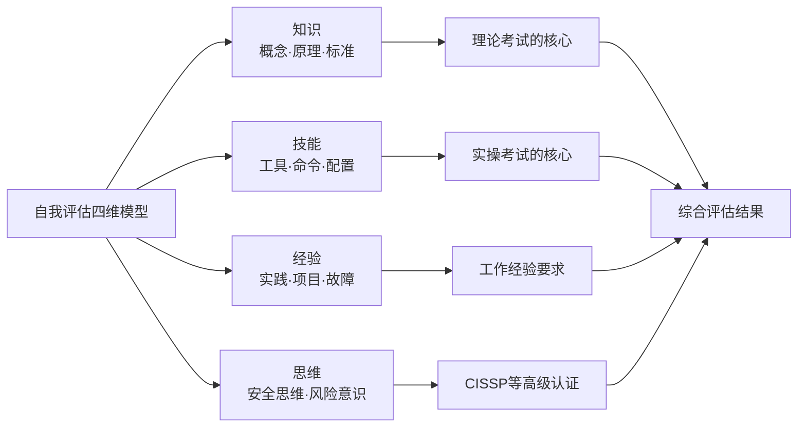

## 自我评估清单

在认证备考的七步策略中，自我评估是所有后续行动的基石。没有准确的自我认知，学习计划就会偏离方向——要么在已经掌握的内容上浪费时间，要么忽略了致命的知识盲区。本节提供一套系统化的自我评估框架，帮助你在备考初期建立清晰的能力画像，制定精准的学习路径。

### 为什么自我评估如此重要

认证考试本质上是对特定知识体系和实践能力的标准化检验。然而，大多数考生在备考初期犯的第一个错误，就是跳过评估直接开始"从第一章读到最后一页"。这种做法存在三个致命问题：

1. **时间错配**：在已掌握的领域花费大量时间，而在薄弱环节蜻蜓点水
2. **虚假安全感**：觉得自己"大概都懂"，直到模拟考试暴露真实水平
3. **动机衰减**：缺乏清晰的起点，学习过程变成无尽的马拉松

心理学中的邓宁-克鲁格效应（Dunning-Kruger Effect）在安全领域尤为突出——技术能力越初级的人，越倾向于高估自己的水平。一份严格的自我评估清单，就是对抗这种认知偏差的最佳武器。

### 自我评估的四维模型

有效的自评需要覆盖四个维度，缺一不可：

| 维度 | 评估内容 | 典型表现 |
|------|----------|----------|
| **知识（Knowledge）** | 概念理解、原理掌握、标准熟悉度 | 能否用自己的话解释，而非死记硬背 |
| **技能（Skill）** | 工具操作、命令执行、配置能力 | 能否独立完成具体任务，而非纸上谈兵 |
| **经验（Experience）** | 真实环境实践、项目经历、故障处理 | 是否在真实场景中应用过所学知识 |
| **思维（Mindset）** | 安全思维模式、风险意识、系统性思考 | 遇到新问题时能否用安全视角分析 |



### 第一步：基础能力摸底

以下清单涵盖网络安全认证所需的通用基础知识。请用1-5分制诚实评分（1=完全不懂，5=精通），并在备注栏记录具体薄弱点。

#### 1.1 计算机网络基础

| 评估项目 | 自评(1-5) | 备注/薄弱点 |
|----------|-----------|-------------|
| OSI七层模型与TCP/IP四层模型的对应关系 | | |
| TCP三次握手/四次挥手的完整流程与状态机 | | |
| UDP与TCP的区别及各自适用场景 | | |
| HTTP/HTTPS协议原理，TLS握手过程 | | |
| DNS解析流程（递归/迭代查询） | | |
| ARP协议工作原理与ARP欺骗 | | |
| IP子网划分与CIDR表示法 | | |
| 常见网络设备（交换机/路由器/防火墙）的功能区别 | | |
| 网络地址转换（NAT/PAT）原理 | | |
| VPN技术（IPSec/SSL/TLS）的基本原理 | | |
| 抓包分析工具（Wireshark/tcpdump）的基本使用 | | |
| 网络故障排查的基本方法论（ping/traceroute/nslookup） | | |

> **评分标准说明**：1分=从未接触；2分=听说过概念；3分=理解原理但无法独立操作；4分=能独立完成相关任务；5分=能深入分析和排错。低于3分的项目需要优先补课。

#### 1.2 操作系统基础

| 评估项目 | 自评(1-5) | 备注/薄弱点 |
|----------|-----------|-------------|
| Linux文件系统结构（FHS标准） | | |
| 常用Linux命令（文件操作/权限管理/进程管理/网络配置） | | |
| Linux用户与组管理（useradd/groupadd/sudo） | | |
| Linux权限模型（rwx/特殊权限/ACL） | | |
| systemd服务管理（systemctl/status/enable/disable） | | |
| Linux日志系统（rsyslog/journalctl/常见日志路径） | | |
| Windows Active Directory基础概念 | | |
| Windows组策略（GPO）的作用与管理 | | |
| Windows注册表的结构与安全相关配置 | | |
| Windows事件日志查看与分析 | | |
| 虚拟化技术（VMware/VirtualBox/Docker基础） | | |
| Shell脚本编写能力（Bash/PowerShell） | | |

#### 1.3 密码学基础

| 评估项目 | 自评(1-5) | 备注/薄弱点 |
|----------|-----------|-------------|
| 对称加密与非对称加密的区别 | | |
| 常见加密算法（AES/RSA/ECC）的基本原理 | | |
| 哈希函数的特性（不可逆性/抗碰撞/雪崩效应） | | |
| 常见哈希算法（MD5/SHA-256/SHA-3）的区别 | | |
| 数字签名的工作原理 | | |
| 数字证书与PKI体系 | | |
| 密钥管理的基本概念（密钥生成/存储/分发/销毁） | | |
| 密码学在实际安全协议中的应用（SSL/TLS/SSH/IPSec） | | |
| 常见密码攻击方式（字典/暴力/彩虹表/侧信道） | | |
| 加密工具的使用（OpenSSL/GPG） | | |

#### 1.4 安全概念与术语

| 评估项目 | 自评(1-5) | 备注/薄弱点 |
|----------|-----------|-------------|
| CIA三元组（机密性/完整性/可用性）的含义与关系 | | |
| AAA框架（认证/授权/审计） | | |
| 最小权限原则与纵深防御原则 | | |
| 常见攻击类型（SQL注入/XSS/CSRF/SSRF/文件包含） | | |
| OWASP Top 10的最新内容与含义 | | |
| 社会工程学的基本概念与防范 | | |
| 安全开发生命周期（SDLC） | | |
| 风险管理的基本流程（识别/评估/应对/监控） | | |
| 漏洞管理生命周期（发现/评估/修补/验证） | | |
| 安全合规框架（ISO 27001/NIST/等保2.0）的基本概念 | | |
| 安全事件响应的基本流程 | | |
| 零信任架构的核心理念 | | |

### 第二步：目标认证知识领域评估

在完成基础能力摸底后，你需要针对目标认证的具体知识领域进行专项评估。以下列出主流认证的核心领域，请根据你选择的目标认证勾选对应领域。

#### CISSP 八大知识域

| 领域 | 自评(1-5) | 占考试比重 | 优先级 |
|------|-----------|-----------|--------|
| 1. 安全与风险管理 | | 15% | |
| 2. 资产安全 | | 10% | |
| 3. 安全架构与工程 | | 13% | |
| 4. 通信与网络安全 | | 13% | |
| 5. 身份与访问管理（IAM） | | 13% | |
| 6. 安全评估与测试 | | 11% | |
| 7. 安全运营 | | 13% | |
| 8. 软件开发安全 | | 11% | |

#### OSCP/渗透测试相关认证

| 领域 | 自评(1-5) | 优先级 |
|------|-----------|--------|
| 信息收集（被动/主动侦察） | | |
| 漏洞扫描与利用 | | |
| Web应用安全测试 | | |
| 权限提升（Linux/Windows） | | |
| 横向移动技术 | | |
| 后渗透与持久化 | | |
| 密码攻击与凭证收集 | | |
| 报告撰写与沟通 | | |

#### CISP（国内注册信息安全专业人员）

| 领域 | 自评(1-5) | 优先级 |
|------|-----------|--------|
| 信息安全保障 | | |
| 信息安全技术 | | |
| 信息安全管理 | | |
| 信息安全工程 | | |
| 信息安全法规与标准 | | |
| 信息安全规划与管理 | | |

#### 填写你自己的目标认证知识领域

根据你选择的具体认证，列出其考试大纲的所有知识领域，并逐一评估：

```text
目标认证：_______________
考试版本/年份：_______________

领域1：_______________  自评(1-5)：___  优先级：___
领域2：_______________  自评(1-5)：___  优先级：___
领域3：_______________  自评(1-5)：___  优先级：___
领域4：_______________  自评(1-5)：___  优先级：___
领域5：_______________  自评(1-5)：___  优先级：___
领域6：_______________  自评(1-5)：___  优先级：___
领域7：_______________  自评(1-5)：___  优先级：___
领域8：_______________  自评(1-5)：___  优先级：___
```

### 第三步：实践经验评估

许多认证（尤其是CISSP、OSCP等）要求或隐含要求实际工作经验。即使没有硬性要求，实践经验也是通过考试的关键因素。

#### 实践经验自评表

| 经验类别 | 具体项目 | 是否具备 | 年限/时长 | 与认证相关度 |
|----------|----------|---------|-----------|-------------|
| 安全运维 | SIEM部署与告警分析 | □ 是 □ 否 | | 高/中/低 |
| 安全运维 | 入侵检测/防御系统管理 | □ 是 □ 否 | | 高/中/低 |
| 安全运维 | 漏洞扫描与修补 | □ 是 □ 否 | | 高/中/低 |
| 渗透测试 | Web应用渗透测试 | □ 是 □ 否 | | 高/中/低 |
| 渗透测试 | 网络渗透测试 | □ 是 □ 否 | | 高/中/低 |
| 渗透测试 | 移动应用安全测试 | □ 是 □ 否 | | 高/中/低 |
| 安全开发 | 安全编码实践 | □ 是 □ 否 | | 高/中/低 |
| 安全开发 | 代码审计 | □ 是 □ 否 | | 高/中/低 |
| 安全管理 | 风险评估与管理 | □ 是 □ 否 | | 高/中/低 |
| 安全管理 | 安全策略制定 | □ 是 □ 否 | | 高/中/低 |
| 安全管理 | 事件响应与处置 | □ 是 □ 否 | | 高/中/低 |
| 合规审计 | 安全审计执行 | □ 是 □ 否 | | 高/中/低 |
| 合规审计 | 等保/ISO审计经验 | □ 是 □ 否 | | 高/中/低 |

#### 实验室环境搭建情况

如果你缺乏实际工作经验，可以通过搭建实验室环境来弥补。评估你当前的实验条件：

| 实验环境 | 是否已搭建 | 用途说明 |
|----------|-----------|----------|
| Kali Linux / Parrot OS | □ 是 □ 否 | 渗透测试基础平台 |
| DVWA / WebGoat | □ 是 □ 否 | Web安全练习靶场 |
| Metasploitable / VulnHub | □ 是 □ 否 | 综合漏洞靶机 |
| Hack The Box / TryHackMe | □ 是 □ 否 | 在线渗透练习平台 |
| Active Directory lab | □ 是 □ 否 | AD环境渗透练习 |
| Splunk / ELK Stack | □ 是 □ 否 | SIEM分析练习 |
| VirtualBox / VMware 多机环境 | □ 是 □ 否 | 网络攻防拓扑搭建 |

### 第四步：学习风格诊断

了解自己的学习风格，能帮助你选择最高效的学习路径。不同类型的学习者适合不同的资源和方法。

#### 学习风格自测

回答以下问题，统计你的选项：

**问题1：学习新概念时，你更倾向于？**
- A. 阅读教材和文档 → 视觉型学习者
- B. 听讲座和播客 → 听觉型学习者
- C. 动手实践和实验 → 动觉型学习者
- D. 与他人讨论交流 → 社交型学习者

**问题2：记忆安全概念时，什么方式对你最有效？**
- A. 画思维导图和流程图 → 视觉型
- B. 反复朗读和讨论 → 听觉型
- C. 在实际环境中操作 → 动觉型
- D. 教给别人或参与小组学习 → 社交型

**问题3：面对复杂的安全架构，你更倾向于？**
- A. 画出架构图来理解 → 视觉型
- B. 用文字描述各个组件的交互 → 听觉型
- C. 在实验环境中搭建并测试 → 动觉型
- D. 与同事一起分析讨论 → 社交型

**统计结果：**

| 学习风格 | 你的主要类型 | 推荐学习方法 |
|----------|-------------|-------------|
| 视觉型 | □ | 思维导图、图表、视频教程、色彩编码笔记 |
| 听觉型 | □ | 播客、有声书、小组讨论、口述复习 |
| 动觉型 | □ | 实验室操作、CTF挑战、项目驱动学习 |
| 社交型 | □ | 学习小组、论坛讨论、teaching others |

#### 每日可投入学习时间评估

诚实评估你每天实际可用于认证备考的时间：

| 时间段 | 可用时长 | 适合的学习活动 |
|--------|---------|---------------|
| 工作日早晨 | ___分钟 | 间隔重复复习（Anki卡片） |
| 工作日午休 | ___分钟 | 练习题、短视频 |
| 工作日晚间 | ___小时 | 深度学习、实验操作 |
| 周末白天 | ___小时 | 新内容学习、模拟考试 |
| 通勤时间 | ___分钟 | 播客、音频课程、Anki复习 |

**每周可用学习总时间**：___小时

> **经验法则**：大多数安全认证（如CISSP、CISP）需要150-300小时的备考时间。如果你每周只能投入10小时，那么备考周期至少需要15-30周。根据这个数据设定你的考试日期。

### 第五步：综合诊断与差距分析

将前四步的结果汇总，识别你的核心差距和学习优先级。

#### 差距分析矩阵

对每个评估项目，计算"目标水平"与"当前水平"的差距：

```text
目标水平：考试通过所需的最低能力（通常为3-4分）
当前水平：你在第一步/第二步中的自评分数
差距 = 目标水平 - 当前水平（负数表示已达标）
```

#### 差距汇总表

| 知识领域 | 当前水平 | 目标水平 | 差距 | 优先级 | 预计学习时长 |
|----------|---------|---------|------|--------|-------------|
| 计算机网络基础 | | | | | |
| 操作系统基础 | | | | | |
| 密码学基础 | | | | | |
| 安全概念与术语 | | | | | |
| 认证领域1 | | | | | |
| 认证领域2 | | | | | |
| 认证领域3 | | | | | |
| ... | | | | | |

**优先级判定规则：**
- **P0（紧急）**：差距≥2 且考试占比≥10%
- **P1（重要）**：差距≥2 或考试占比≥15%
- **P2（一般）**：差距=1
- **P3（低优先）**：已达标（差距≤0），仅需巩固

### 第六步：设定SMART目标

基于差距分析，为每个薄弱领域设定具体的备考目标。

#### SMART目标模板

```text
目标1：
- Specific（具体的）：掌握CISSP第4域"通信与网络安全"的所有知识点
- Measurable（可衡量）：在该领域的模拟题正确率达到80%以上
- Achievable（可实现）：基于当前水平（2分），通过6周学习达到4分
- Relevant（相关的）：该域占CISSP考试13%，是必须通过的关键领域
- Time-bound（有时限的）：在考试日期前6周完成，留出2周冲刺

目标2：
- Specific：能够独立使用Wireshark分析TCP/IP流量并识别异常
- Measurable：完成10个Wireshark分析练习，每个正确率>90%
- Achievable：当前有基础网络知识，补充协议细节即可
- Relevant：网络分析是多个认证考试的实操考点
- Time-bound：4周内完成

目标3：
- Specific：掌握Linux权限提升的5种常见方法
- Measurable：在TryHackMe的权限提升房间中独立完成
- Achievable：当前有Linux基础，需要补充提权知识
- Relevant：OSCP/渗透测试认证的核心考点
- Time-bound：3周内完成
```

#### 考试日期倒推规划

| 里程碑 | 日期 | 目标 |
|--------|------|------|
| 评估完成日 | 日期：_____ | 完成本自我评估，输出差距分析 |
| 基础补齐 | 日期：_____ | P0领域达到3分水平 |
| 核心突破 | 日期：_____ | 所有P1领域达到3分水平 |
| 全面提升 | 日期：_____ | 所有领域达到目标水平 |
| 模拟考试 | 日期：_____ | 模拟考试通过率>80% |
| 正式考试 | 日期：_____ | 通过认证考试 |

### 第七步：学习风格匹配与资源选择

根据你的学习风格评估结果，选择最适合的学习资源组合：

#### 视觉型学习者推荐资源

| 资源类型 | 推荐资源 | 适用认证 |
|----------|---------|---------|
| 思维导图 | XMind/MindMeister + 认证知识图谱 | 所有认证 |
| 视频教程 | Cybrary/Pluralsight/Udemy视频课程 | CISSP/OSCP/CISP |
| 图表笔记 | 用颜色编码的表格整理知识点 | 所有认证 |
| 架构图 | Visio/Draw.io绘制安全架构 | CISSP/安全架构师 |

#### 动觉型学习者推荐资源

| 资源类型 | 推荐资源 | 适用认证 |
|----------|---------|---------|
| 在线靶场 | TryHackMe/Hack The Box/PentesterLab | OSCP/CEH |
| 本地实验室 | VirtualBox搭建多机攻防环境 | OSCP |
| 练习题库 | Boson/CCCure/Wiley practice tests | CISSP |
| 实操项目 | 从零搭建SIEM/WAF/IDS | 安全运维认证 |

#### 听觉型学习者推荐资源

| 资源类型 | 推荐资源 | 适用认证 |
|----------|---------|---------|
| 播客 | Darknet Diaries/Security Now/安全客 | 所有认证 |
| 有声书 | CISSP官方教材有声版 | CISSP |
| 讲座录音 | SANS/Webinar录播 | 高级认证 |
| 口述复习 | 向同事/朋友讲解知识点 | 所有认证 |

### 常见误区与纠正

| 误区 | 正确做法 | 说明 |
|------|---------|------|
| "我工作了好几年了，基础知识不用看" | 诚实完成基础摸底，很多"常识"其实理解不准确 | 认证考试考的是标准化知识，不是个人经验 |
| "自评分数不重要，做题才知道" | 自评是定位方向，做题是验证手段，两者互补 | 先有方向感，做题才能高效利用 |
| "所有领域都要达到精通才去考试" | 聚焦高权重领域，其他达到"足够"即可 | 考试是通过制，不是满分制 |
| "自评一次就够了" | 每2-4周重新评估一次，追踪进步 | 知识掌握是动态变化的 |
| "参考别人的评分标准" | 制定自己的标准并保持一致 | 自评的核心是自我比较，不是横向排名 |
| "评估结果让自己沮丧就放弃" | 差距大说明提升空间大，调整计划而非放弃 | 每个专家都曾是初学者 |

### 进阶技巧：深度自评方法

对于追求更高备考效率的读者，以下高级自评技巧可以帮助你更精确地定位能力水平。

#### 方法一：费曼技巧验证法

选择一个知识点，尝试用最简单的语言向一个"完全不懂技术的人"解释。如果你无法用简单语言说清楚，说明你对这个知识点的理解还不够深入。

**操作步骤：**
1. 从评估清单中选择一个自评3-4分的知识点
2. 假设听众是你的家人或非技术朋友
3. 用不超过5句话解释这个概念
4. 如果卡壳或用了过多术语 → 实际水平比自评低1分

**示例：**
- 自评4分的"数字签名"：尝试向朋友解释"为什么网购时确认收货后商家才能收到钱"
- 自评3分的"SQL注入"：尝试解释"为什么登录页面输入 `' OR 1=1 --` 能绕过密码验证"

#### 方法二：限时模拟测试

不看任何资料，在限定时间内完成一套模拟题。这比反复复习后的做题更能反映真实水平。

**操作规则：**
- 选择与目标认证相关的模拟题（30-50题）
- 严格计时（按实际考试时间比例缩减）
- 不允许查阅任何资料
- 做完后立即对答案，不修改

**结果分析：**
- 正确率≥80%：该领域已达标，只需巩固
- 正确率60-79%：基本掌握，需要强化薄弱点
- 正确率40-59%：需要系统学习
- 正确率<40%：需要从基础重新学起

#### 方法三：教学互评法

如果你有学习伙伴，可以互相出题、互相讲解。教别人是最好的学习方式，同时也能暴露自己的知识盲区。

**操作方式：**
1. 各自选择一个自己认为"已经掌握"的知识点
2. 向对方讲解5分钟
3. 对方提出3个追问
4. 如果无法回答追问 → 说明理解不够深入
5. 交换角色，重复以上步骤

#### 方法四：项目驱动自评

选择一个与目标认证相关的实际项目，在完成项目的过程中检验自己的能力。

**项目示例：**

| 认证方向 | 自评项目 | 考察的能力 |
|----------|---------|-----------|
| CISSP | 为一个虚拟企业编写信息安全策略 | 安全管理、风险管理、合规 |
| OSCP | 在HTB上独立完成3台不同难度的靶机 | 渗透测试全流程 |
| CISP | 编写一份等保二级测评报告 | 等保标准、安全评估 |
| CEH | 搭建完整的渗透测试实验室并记录过程 | 工具使用、方法论、文档能力 |

### 评估结果记录模板

完成所有评估后，将结果整理到以下模板中，作为你备考旅程的起点文档：

```text
========================================
自我评估报告
日期：____年__月__日
目标认证：_______________
目标考试日期：____年__月__日
========================================

一、基础能力评估结果
  网络基础：___分  |  操作系统：___分
  密码学：___分    |  安全概念：___分

二、目标认证领域评估结果
  领域1(___域)：___分 |  领域2(___域)：___分
  领域3(___域)：___分 |  领域4(___域)：___分
  领域5(___域)：___分 |  领域6(___域)：___分
  领域7(___域)：___分 |  领域8(___域)：___分

三、实践经验评估
  相关工作年限：___年
  核心经验领域：_______________
  经验薄弱领域：_______________

四、学习风格
  主要类型：_______________
  每周可用时间：___小时
  预计备考周期：___周

五、Top 5 差距领域（按优先级排序）
  1. _______________（差距___分）
  2. _______________（差距___分）
  3. _______________（差距___分）
  4. _______________（差距___分）
  5. _______________（差距___分）

六、SMART目标（前3个）
  目标1：_______________
  目标2：_______________
  目标3：_______________

========================================
```

### 本节小结

自我评估不是一次性的任务，而是一个持续迭代的过程。建议每2-4周重新审视你的评估结果，根据学习进展动态调整优先级和计划。记住：

- **诚实**是自评的生命线——自欺欺人的评分只会浪费你的时间
- **量化**是自评的关键——模糊的"还行"不如具体的"3分"
- **行动**是自评的目的——评估结果必须转化为具体的学习计划
- **迭代**是自评的保障——定期复盘，持续校准

完成本节的自我评估后，你将拥有一个清晰的能力画像和明确的学习方向。接下来，我们将基于这个评估结果，制定具体的学习计划和时间安排。
