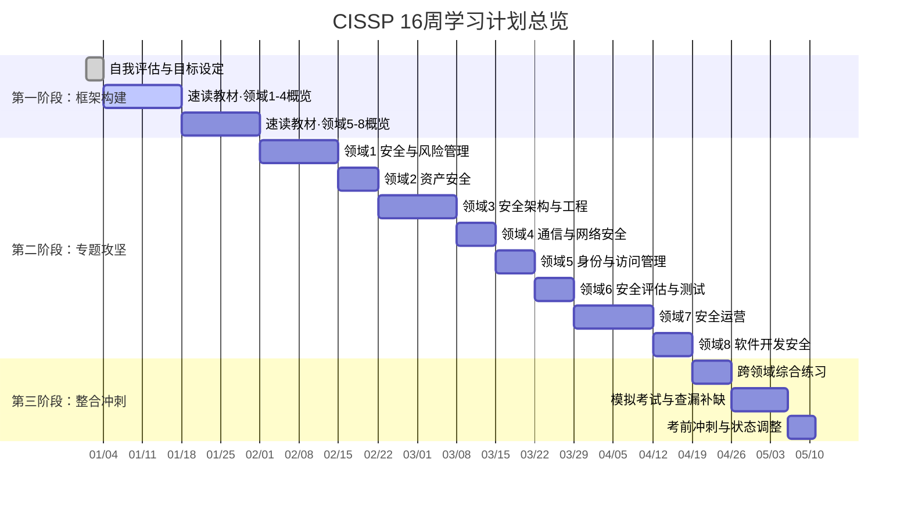

## CISSP学习计划示例

CISSP（Certified Information Systems Security Professional）是全球公认含金量最高的信息系统安全认证之一，由（ISC）²颁发。考试覆盖八大知识域（CBK），要求考生在4小时内完成125-175道选择题，需要深厚的跨领域知识储备和成熟的"安全管理者思维"。根据（ISC）² 2024年行业调研，CISSP全球持证者超过17万人，持证者平均年薪$131,000-$165,000，是薪资溢价最高的安全认证之一。

然而，CISSP也是公认最难通过的安全认证之一——全球首次通过率仅约20%-30%。失败的主要原因不是知识量不够，而是**缺乏系统化的备考计划**。许多考生在八大知识域的汪洋大海中迷失方向，不知道从哪里开始、如何分配时间、何时进入冲刺。

本章提供一份**经过实战验证的CISSP 16周学习计划**，覆盖从零基础评估到考前冲刺的完整路径。这不是一份通用模板——它是一个可直接执行的行动方案，包含每个阶段的具体任务、时间分配、资源推荐和质量检查点。



---

## 第零步：明确前提条件

在开始任何学习计划之前，必须先确认以下前提条件。跳过这一步是CISSP备考失败的首要原因。

### 报考资格确认

CISSP要求至少5年全职信息安全相关工作经验（涵盖八大域中至少2个域）。如果尚未满足经验要求，可以先参加考试，获得"Associate of (ISC)²"身份，待满足经验后再正式认证。这并不影响你的备考——知识储备越早建立越好。

| 资格情况 | 处理方式 | 建议 |
|---------|---------|------|
| 5年以上相关经验 | 直接报考 | 全力备考 |
| 3-5年经验 | 先考后认证 | 可报考，通过后积累经验再转正 |
| 1-3年经验 | 先考其他认证 | 建议先考SSCP或Security+打基础 |
| 无经验 | 不建议直接备考CISSP | 从Security+开始，逐步积累 |

### 学习资源准备清单

启动学习计划前，确保以下核心资源到位。不要等到学习中途才去购买或寻找资源，这会打断学习节奏。

| 资源类别 | 推荐资源 | 预估费用 | 优先级 |
|---------|---------|---------|-------|
| **官方教材** | (ISC)² Official Study Guide (OSG) 第9版 — Stuart McClure 著 | ¥350-500 | 必备 |
| **官方CBK参考** | (ISC)² Official CBK Reference 第5版 | ¥400-600 | 推荐 |
| **复习指南** | 11th Hour CISSP（考前冲刺用） | ¥150-200 | 强烈推荐 |
| **题库** | Boson ExSim CISSP 模拟题 | $79-99 | 强烈推荐 |
| **官方题库** | Wiley Efficient Learning 在线平台 | 含在教材购买中 | 推荐 |
| **视频课程** | Thor Pedersen (Udemy) 或 Kelly Handerhan (Cybrary) | ¥100-200（打折时） | 推荐 |
| **闪卡** | Anki + CISSP共享牌组（如"CISSP Flashcards by Destination Certification） | 免费 | 推荐 |
| **笔记工具** | Obsidian 或 Notion（构建个人知识库） | 免费 | 推荐 |

**资源使用原则**：官方教材（OSG）是唯一的权威内容来源。所有第三方资源——视频课程、模拟题库、闪卡——都是辅助工具，用于帮助理解和巩固官方教材的内容，而非替代它。备考初期可以先看视频建立直觉，但必须回归教材确认每一个知识点。

---

## 第一阶段：框架构建（第1-6周）

这一阶段的核心目标不是记住所有知识点，而是**建立完整的知识地图**，搞清楚"考试要考什么"和"我现在缺什么"。

### 第1周：自我评估与目标设定

#### 自我评估

使用以下评估表对八大知识域逐一打分。诚实面对自己——这不是考试，是诊断。打分标准参考下表：

| 评估等级 | 定义 | 表现特征 |
|---------|------|---------|
| L1 零基础 | 完全没接触过该领域 | 说不出该领域包含哪些概念 |
| L2 了解术语 | 知道基本定义，但无法解释原理 | 能说"BIA是业务影响分析"，但说不出它与RA的区别 |
| L3 能讲解 | 可以为他人讲解核心内容 | 能解释PKI的信任链如何工作 |
| L4 能应用 | 在实际工作中使用过相关知识 | 曾经设计过访问控制策略或做过事件响应 |
| L5 能教学 | 达到培训他人水平 | 能就该主题给别人上一堂完整的课 |

```markdown
## CISSP八大域自我评估

领域1：安全与风险管理          [ L1 / L2 / L3 / L4 / L5 ]
领域2：资产安全                [ L1 / L2 / L3 / L4 / L5 ]
领域3：安全架构与工程          [ L1 / L2 / L3 / L4 / L5 ]
领域4：通信与网络安全          [ L1 / L2 / L3 / L4 / L5 ]
领域5：身份与访问管理          [ L1 / L2 / L3 / L4 / L5 ]
领域6：安全评估与测试          [ L1 / L2 / L3 / L4 / L5 ]
领域7：安全运营                [ L1 / L2 / L3 / L4 / L5 ]
领域8：软件开发安全            [ L1 / L2 / L3 / L4 / L5 ]

总分：____ / 40
最薄弱领域（L1-L2）：____________________
最强领域（L4-L5）：____________________
```

**评估后的优先级排序**：使用"权重×差距"公式计算每个领域的学习优先级：

```text
优先级分 = 领域权重(%) × (6 - 当前等级)
```

CISSP八大域的官方权重如下：

| 领域 | 名称 | 官方权重 | 若当前等级为L2 | 优先级分 |
|------|------|---------|---------------|---------|
| 1 | 安全与风险管理 | 15% | (6-2)×15% = 6.0 | 高 |
| 2 | 资产安全 | 10% | (6-2)×10% = 4.0 | 中 |
| 3 | 安全架构与工程 | 13% | (6-2)×13% = 5.2 | 高 |
| 4 | 通信与网络安全 | 13% | (6-2)×13% = 5.2 | 高 |
| 5 | 身份与访问管理 | 13% | (6-2)×13% = 5.2 | 高 |
| 6 | 安全评估与测试 | 12% | (6-2)×12% = 4.8 | 中 |
| 7 | 安全运营 | 13% | (6-2)×13% = 5.2 | 高 |
| 8 | 软件开发安全 | 11% | (6-2)×11% = 4.4 | 中 |

计算后按优先级分从高到低排序，高分领域在第二阶段获得更多学习时间。

#### 设定SMART目标

```text
目标示例：
- Specific: 在2026年4月15日前通过CISSP考试（CAT模式，125-175题）
- Measurable: 每个领域得分率不低于70%，总分达到700/1000
- Achievable: 每天投入2小时（工作日）+ 5小时（周末），16周可行
- Relevant: 晋升安全管理岗位的必要资质
- Time-bound: 2026年4月15日考试，2026年1月1日启动
```

**立即报名考试**：确定目标后，第一时间在Pearson VUE注册考试。设定一个16周后的考试日期，用这个硬性deadline驱动整个学习计划。数据表明，提前报名的考生完成备考的概率是未报名者的2.3倍。

### 第2-3周：速读教材·领域1-4概览

打开OSG（Official Study Guide），按章节顺序快速阅读领域1至领域4的内容。注意以下要点：

- **不求记住所有细节**：第一遍的目标是"见过"所有概念，建立初步认知
- **标记不理解的内容**：用荧光笔或电子标记标注每个章节中让你困惑的概念
- **每天记录3个新学到的概念**：在笔记本上写下当天接触到的3个最重要的术语或概念
- **不做练习题**：这个阶段的做题只会打击信心——因为你还没学完
- **每天学习节奏**：60分钟阅读 + 15分钟整理当天笔记

**具体执行计划**：

| 周次 | 学习内容 | 预估时间 | 产出物 |
|------|---------|---------|-------|
| 第2周 | 领域1（安全与风险管理）精读 | 10-12小时 | 领域1概念清单 |
| 第3周前半 | 领域2（资产安全）精读 | 5-6小时 | 领域2概念清单 |
| 第3周后半 | 领域3（安全架构与工程）精读 | 5-6小时 | 领域3概念清单 |
| 第3周末 | 领域4（通信与网络安全）精读 | 5-6小时 | 领域4概念清单 |

### 第4-5周：速读教材·领域5-8概览

继续速读领域5至领域8。这两个领域覆盖身份管理、安全测试、安全运营和软件安全——对于有实际工作经验的人来说，这些领域可能更容易理解。

| 周次 | 学习内容 | 预估时间 | 产出物 |
|------|---------|---------|-------|
| 第4周 | 领域5（身份与访问管理）+ 领域6（安全评估与测试） | 10-12小时 | 领域5-6概念清单 |
| 第5周 | 领域7（安全运营）+ 领域8（软件开发安全） | 10-12小时 | 领域7-8概念清单 |

### 第6周：构建思维导图 + 摸底测试

**构建思维导图**：使用XMind或MindNode，为每个领域创建一张思维导图。以领域1为例：

```markdown
领域1：安全与风险管理
├── 安全治理
│   ├── 安全策略（可接受使用、访问控制、变更管理）
│   ├── 标准/基线/指南/流程
│   ├── 合规性（GDPR、HIPAA、SOX）
│   └── 角色与职责（数据所有者、保管者、处理者）
├── 风险管理
│   ├── 定量分析（SLE、ARO、ALE、EF）
│   ├── 定性分析（风险矩阵、优先级矩阵）
│   ├── 风险处置策略（接受、减轻、转移、规避）
│   └── 风险框架（NIST RMF、ISO 27005、OCTAVE）
├── 业务连续性
│   ├── BIA（业务影响分析）
│   ├── BCP（业务连续性计划）
│   ├── DRP（灾难恢复计划）
│   └── 恢复指标（RTO、RPO、MTPD、MTBF）
└── 法律与合规
    ├── 刑法与民法的区别
    ├── 知识产权法
    ├── 隐私保护法规
    └── 数字取证的法律要求
```

**摸底测试**：完成思维导图后，做一套Boson ExSim模拟题（或Wiley平台的官方预评估题），记录每个领域的得分率。这次测试的目的不是判断能否通过，而是**精确定位每个领域的空白区**。

**第一阶段质量检查点**：

- [ ] 八大域全部完成速读，每域至少过了一遍
- [ ] 每个域都有对应的思维导图（即使很简略）
- [ ] 摸底测试完成，各领域得分率已记录
- [ ] 学习优先级排序已根据评估结果更新
- [ ] 考试日期已注册确认

---

## 第二阶段：专题攻坚（第7-14周）

这是整个学习计划中最核心、耗时最长的阶段。每个领域按照"精读 → 理解 → 练习 → 巩固"的四步循环逐个攻破。

### 时间分配策略

根据第一阶段的摸底结果，为每个领域分配不同的学习时间。核心原则：**薄弱领域多花时间，但仍需覆盖所有领域**。

| 领域 | 权重 | 建议学习天数 | 分配逻辑 |
|------|------|------------|---------|
| 领域1：安全与风险管理 | 15% | 10天 | 权重最高+内容最广（涵盖治理、风险、BCP、法律） |
| 领域2：资产安全 | 10% | 5天 | 权重最低，但数据分类是高频考点 |
| 领域3：安全架构与工程 | 13% | 10天 | 涉及安全模型和密码学，需要深度理解 |
| 领域4：通信与网络安全 | 13% | 6天 | 网络基础好的人可以适当压缩 |
| 领域5：身份与访问管理 | 13% | 6天 | IAM是现代安全核心，需要理解零信任 |
| 领域6：安全评估与测试 | 12% | 5天 | 偏方法论，理解比记忆更重要 |
| 领域7：安全运营 | 13% | 10天 | 涵盖事件响应、取证、监控，内容广泛 |
| 领域8：软件开发安全 | 11% | 6天 | 开发背景的人可适当压缩 |
| **合计** | **100%** | **58天 ≈ 8.3周** | 预留缓冲约1周 |

### 每个领域的标准学习流程

每个领域严格按以下四步走，不要跳步：

**第一步：精读教材（第1-2天）**

逐字逐句阅读OSG中对应领域的章节。不是速读——这次要理解每一个概念的原理和逻辑。边读边在笔记本上记录核心概念和自己的疑问。

**第二步：理解深化（第2-3天）**

- 用费曼学习法向自己或他人解释每个核心概念
- 在思维导图上补充细节（从一级扩展到三级）
- 对于安全模型、密码学等抽象内容，画出对比表格：

```markdown
## 示例：对称加密 vs 非对称加密

| 维度 | 对称加密 | 非对称加密 |
|------|---------|-----------|
| 密钥数量 | 1个（共享密钥） | 2个（公钥+私钥） |
| 加密速度 | 快（100-1000倍） | 慢 |
| 密钥分发 | 困难（需要安全通道） | 简单（公钥可公开） |
| 代表算法 | AES、DES、3DES、Blowfish | RSA、ECC、Diffie-Hellman |
| 适用场景 | 大数据量加密 | 密钥交换、数字签名 |
| 常见组合 | — | 用非对称加密交换对称密钥（混合加密） |
```

**第三步：专项练习（第4-5天）**

完成该领域的50-100道专项练习题。每做完一组（20-25题），立即分析错题，使用以下模板：

```markdown
## 错题分析模板

题目编号：CISSP-D1-0042
题目大意：关于BIA中RPO和RTO的关系
我的答案：C（RPO > RTO）
正确答案：A（RPO通常 >= RTO）
错误类型：概念混淆
根因分析：将RPO（数据可容忍丢失量）与RTO（系统可容忍中断时间）的量纲搞混
补救行动：重读OSG第1章BCP/DRP部分，画出RPO/RTO时间线图
复习日期：3天后
```

**第四步：巩固复习（第6天）**

- 合上教材，只看思维导图，尝试从记忆中展开每个分支
- 快速过一遍本领域的错题（不重做，只确认已理解）
- 在Anki中添加15-20张新卡片（本领域的核心概念和易混淆点）
- 如果某个子领域仍不清晰，标记为"需二次攻克"

### 各领域学习重点精要

以下是每个领域最核心的学习重点和常见陷阱，帮助你聚焦精力：

**领域1：安全与风险管理（15%权重 — 最高权重）**

这是CISSP中权重最高、内容最广的领域。它不只考技术——更考管理思维。

- **必须掌握的核心公式**：SLE = 资产价值 × 暴露因子；ALE = SLE × ARO；ROI = (ALE_before - ALE_after - Cost_of_Solution) / Cost_of_Solution
- **高频考点**：BCP/DRP的六步法、定量与定性风险分析的区别、安全策略的层次结构（策略→标准→基线→指南→流程）
- **常见陷阱**：混淆"数据所有者"（业务部门，决定数据分类）与"数据保管者"（IT部门，负责技术保护）
- **学习建议**：这个领域的知识与所有其他领域交叉——理解扎实了，后面的领域会轻松很多

**领域2：资产安全（10%权重）**

内容相对聚焦，重点是数据全生命周期管理。

- **核心考点**：数据分类（公开/内部/机密/绝密）、数据所有权与责任分离、数据残留处理（清除 vs 擦除 vs 消磁）
- **高频考点**：数据在不同状态（传输中/使用中/存储中）的保护方法
- **常见陷阱**：混淆"安全清除"（逻辑删除+覆写）与"物理销毁"（消磁/粉碎）的适用场景
- **学习建议**：结合实际工作中的数据管理经验理解，这一域的理论性不强但概念容易混淆

**领域3：安全架构与工程（13%权重）**

这是最技术化的领域之一，涉及安全模型和密码学。

- **必须记住的安全模型**：
  - Bell-LaPadula（BLP）：保密性 — "不上读，不下写"（No Read Up, No Write Down）
  - Biba：完整性 — "不下读，不上写"（No Read Down, No Write Up）
  - Clark-Wilson：完整性 — 通过受限接口和转换过程保障
  - Brewer-Nash（Chinese Wall）：防止利益冲突
- **密码学核心**：理解对称（AES、DES）vs 非对称（RSA、ECC）vs 哈希（SHA、MD5）的区别和应用场景
- **常见陷阱**：在CISSP考试中，当问到"最安全"的加密方法时，答案通常是**AES-256**而非RSA，因为AES-256的密钥空间更大
- **学习建议**：画出安全模型对比表，把每个模型的特性、目标和局限性放在一起比较

**领域4：通信与网络安全（13%权重）**

覆盖网络协议、安全通信和网络架构。

- **核心考点**：OSI七层模型中各层的安全协议、IPSec的工作模式（传输模式 vs 隧道模式）、TLS/SSL握手流程
- **高频考点**：VPN类型对比（IPSec vs SSL/TLS VPN）、无线安全协议（WPA2-Enterprise vs WPA3）、DNS安全（DNSSEC、DNS over HTTPS）
- **常见陷阱**：混淆IPSec的传输模式（加密载荷，保留IP头）和隧道模式（加密整个原始数据包）
- **学习建议**：如果你有网络基础，这个领域的学习时间可以适当压缩；如果没有，建议先补充TCP/IP协议栈知识

**领域5：身份与访问管理（13%权重）**

IAM是现代安全架构的核心支柱，也是零信任模型的基础。

- **核心考点**：认证（Authentication）vs 授权（Authorization）vs 审计（Accounting）的区别、多因素认证（MFA）的三类因素、RBAC vs ABAC vs MAC vs DAC的区别
- **高频考点**：Kerberos认证流程（5步）、联合身份（SAML、OAuth 2.0、OIDC的区别）、零信任架构的核心原则
- **常见陷阱**：混淆"你知道什么"（知识因素）、"你拥有什么"（持有因素）和"你是谁"（生物因素）三类认证因素的定义边界
- **学习建议**：画出Kerberos的完整认证流程图，理解每一步涉及的组件（KDC、TGT、Service Ticket）

**领域6：安全评估与测试（12%权重）**

偏方法论，核心是理解各种安全测试的类型和流程。

- **核心考点**：渗透测试的四种类型（黑盒/白盒/灰盒/红盒）、漏洞扫描 vs 渗透测试的区别、SOC审计的类型
- **高频考点**：测试方法论对比表（如下所示）、入侵检测系统的部署位置
- **对比记忆**：

| 测试类型 | 测试者知识 | 适用场景 | 优势 | 劣势 |
|---------|-----------|---------|------|------|
| 黑盒 | 无任何信息 | 模拟真实攻击 | 最接近外部攻击者视角 | 可能遗漏内部漏洞 |
| 白盒 | 完全信息 | 全面安全审计 | 覆盖最全面 | 费用高、周期长 |
| 灰盒 | 部分信息 | 综合评估 | 平衡效率和覆盖面 | 需要合理设定信息边界 |
| 红盒 | 无信息+防御方知情 | 检验防御团队能力 | 检验实际响应能力 | 需要防御方配合 |

**领域7：安全运营（13%权重）**

涵盖安全运营的方方面面，从事件响应到取证分析。

- **核心考点**：事件响应的PICERL模型（准备→识别→遏制→根除→恢复→经验教训）、数字取证的四步法、日志管理与SIEM
- **高频考点**：事件响应各阶段的具体操作、备份策略（全量/差异/增量）、安全监控指标（KPI/CSF）
- **常见陷阱**：CISSP的"安全运营"不是SOC分析师的日常工作——它站在管理视角，关注流程设计和策略制定
- **学习建议**：画出PICERL模型的完整流程图，为每个阶段列出3-5个具体操作

**领域8：软件开发安全（11%权重）**

覆盖安全开发生命周期和常见软件漏洞。

- **核心考点**：SDLC各阶段的安全活动、OWASP Top 10、安全编码原则
- **高频考点**：DevSecOps中安全左移（Shift Left）的理念、常见Web漏洞（SQL注入、XSS、CSRF）的原理和防御、编译器安全特性（DEP、ASLR、Stack Canaries）
- **常见陷阱**：CISSP不考代码编写，但要求理解漏洞原理和防御策略——考试中你需要选择"最有效的防御措施"
- **学习建议**：如果从事过软件开发，这部分可以适当压缩；如果完全是运维背景，建议额外花时间理解SDLC和基本漏洞类型

### 每周的执行节奏

在整个第二阶段，每周遵循以下固定节奏（以领域3为例）：

| 日期 | 活动 | 时长 | 产出 |
|------|------|------|------|
| 周一 | 精读领域3第1-2章 | 60分钟 | 笔记：核心概念列表 |
| 周二 | 精读领域3第3-4章 | 60分钟 | 笔记：安全模型对比表 |
| 周三 | 费曼学习法 + 思维导图补充 | 60分钟 | 完善的思维导图 |
| 周四 | 专项练习：领域3（25题） | 45分钟 | 错题分析（3-5题） |
| 周五 | 错题回顾 + Anki卡片制作 | 30分钟 | 新增15-20张卡片 |
| 周六 | 综合练习（跨领域25题） | 90分钟 | 错题分析 |
| 周日 | 复习本周内容 + 预览下周 | 45分钟 | 周复盘记录 |

**第二阶段质量检查点**（第14周末完成）：

- [ ] 八大域全部完成精读和专项练习
- [ ] 每个域至少完成50道专项练习题
- [ ] 思维导图已补充至三级细节
- [ ] Anki卡片累计300-500张
- [ ] 错题分析累计100+题
- [ ] 本周模拟测试总分达到65%以上

---

## 第三阶段：整合冲刺（第15-16周）

进入最后两周，学习策略从"全面攻坚"转向"精准打击"。不再学习新内容，专注于查漏补缺和应试训练。

### 第15周：跨领域综合练习

**每日安排**：

| 日期 | 活动 | 时长 |
|------|------|------|
| 周一 | 全套模拟题（250题，严格计时4小时） | 4小时 |
| 周二 | 模拟题错题分析 + 按领域归类 | 2小时 |
| 周三 | 重点攻克得分率最低的2个领域 | 2小时 |
| 周四 | 全套模拟题（第二套） | 4小时 |
| 周五 | 错题分析 + 对比两次模拟得分变化 | 2小时 |
| 周六 | 11th Hour CISSP 快速通读 | 3小时 |
| 周日 | 复习思维导图 + Anki卡片快速过 | 2小时 |

**模拟测试的关键数据追踪**：

不要只关注总分——每次模拟测试后，按以下维度分析：

```markdown
## 模拟测试分析模板

测试编号：Mock Exam #3
测试日期：2026-04-01
总分：720/1000（通过线700）
用时：3小时45分钟

各领域得分率：
  领域1 安全与风险管理：78% ✓
  领域2 资产安全：72% ✓
  领域3 安全架构与工程：65% △
  领域4 通信与网络安全：70% ✓
  领域5 身份与访问管理：82% ✓
  领域6 安全评估与测试：68% △
  领域7 安全运营：75% ✓
  领域8 软件开发安全：60% ✗

分析：
  - 领域8得分最低，需要最后集中突击
  - 领域3仍有提升空间，重点复习安全模型部分
  - 领域5已稳定，可适当减少投入

行动：
  - 周三专项复习领域8（SDLC + OWASP Top 10）
  - 领域3重点：Clark-Wilson vs Biba的区别
```

### 第16周：考前冲刺

**考前一周的核心原则**：

1. **不再学习全新知识**：只巩固已有内容，不要在最后时刻打开新章节
2. **每天只做轻量复习**：过一遍错题、浏览思维导图、快速刷Anki卡片
3. **调整生物钟**：从周一开始按考试时间起床和学习。如果考试定在上午9点，每天9:00-11:00做模拟测试
4. **保证充足睡眠**：考前一周每天保证7-8小时睡眠，不要熬夜
5. **适度运动**：每天30分钟中等强度运动，帮助缓解焦虑

**考前7天逐日安排**：

| 天数 | 活动 | 时长 | 注意事项 |
|------|------|------|---------|
| 考前7天 | 全套模拟题（最后一套） | 4小时 | 记录最终得分作为参考，不纠结分数 |
| 考前6天 | 分析最后一次模拟的错题 | 2小时 | 重点记住错题涉及的知识点 |
| 考前5天 | 过一遍所有思维导图 | 1.5小时 | 只看一级和二级节点，能展开的跳过 |
| 考前4天 | Anki卡片快速过一遍 | 1小时 | 只复习"盒子1"和"盒子2"的卡片 |
| 考前3天 | 浏览11th Hour CISSP关键页面 | 1小时 | 这本书就是为最后冲刺设计的 |
| 考前2天 | 轻度复习+放松 | 30分钟 | 不做新题，只浏览笔记 |
| 考前1天 | 完全休息 | 0分钟 | 准备证件、确认考场位置、早睡 |

---

## 学习计划执行的关键指标

整个16周学习过程中，以下指标是判断计划是否有效执行的客观标准：

| 指标 | 目标值 | 测量方式 |
|------|-------|---------|
| 每周学习时长 | 工作日10-12小时 + 周末8-10小时 | 日历记录 |
| 专项练习题累计 | 800-1200题 | 题库统计 |
| 模拟测试次数 | 4-6套完整模拟 | 测试记录 |
| Anki卡片累计 | 400-600张 | Anki统计 |
| 错题分析累计 | 200-300题 | 错题本记录 |
| 模拟测试最终得分 | 70%+ | Boson/Wiley报告 |
| 各领域最低得分率 | 不低于60% | 按领域统计 |

如果某项指标持续低于目标值，需要及时调整策略：
- **学习时长不够**：检查时间管理（参考28.3时间管理技巧），找到时间流失点
- **做题正确率低**：可能是基础概念不扎实，回退到精读阶段重新学习
- **某领域得分持续低于60%**：为该领域额外分配3-5天专项攻坚
- **模拟测试分数停滞**：可能是学习方法问题，尝试费曼学习法或换一种教材解释

---

## 两种常见备考者的计划变体

### 变体一：全职备考者（每天可用6-8小时）

全职备考者的优势是时间充裕，但需要防止过度学习导致的疲劳和效率下降。

```text
适用周期：8-10周

第1-2周：框架构建（速读 + 思维导图 + 摸底）
第3-7周：专题攻坚（每个领域1周，精读+练习）
第8-9周：综合冲刺（模拟测试 + 查漏补缺）
第10周：考前调整
```

**每日安排**：
- 上午 9:00-11:30：新知识学习（2.5小时）
- 下午 14:00-16:30：练习题 + 错题分析（2.5小时）
- 晚上 19:00-20:30：复习 + Anki卡片（1.5小时）
- 总计约6.5小时/天

**特别注意**：全职备考者最常见的陷阱是"感觉学了很多但其实没记住"。因为没有工作的间歇，大脑持续处于输入状态，学习效率会在第2-3周显著下降。**强制每天留出至少2小时完全脱离学习的活动**（运动、社交、兴趣爱好），这对长期效率至关重要。

### 变体二：在职忙碌者（每天可用1-1.5小时）

在职者的挑战是在极其有限的时间内保持学习连续性。核心策略是**高频短时**替代**低频长时**。

```text
适用周期：20-24周

第1-3周：框架构建（利用周末完成速读和思维导图）
第4-18周：专题攻坚（每个领域1-1.5周）
第19-22周：综合冲刺（利用周末做完整模拟测试）
第23-24周：考前调整
```

**每日安排**：
- 早晨 7:00-7:30：Anki卡片复习（30分钟，通勤路上完成）
- 午休 12:30-13:00：阅读教材一个章节（30分钟）
- 晚上 20:00-21:00：练习题 + 错题整理（60分钟）
- 周六 9:00-13:00：集中学习4小时（新内容+综合练习）
- 周日 9:00-12:00：模拟测试或复习3小时

**特别注意**：在职者的最大风险是**被工作和生活打断后放弃**。建议在日历上锁定学习时间段（如同锁死一个会议），并告知家人和同事。参见28.3时间管理技巧中的"日历块管理法"。

---

## 经济投入预算

以下是CISSP备考的典型费用清单，帮助你提前做好预算：

| 费用项目 | 最低方案 | 推荐方案 | 高端方案 |
|---------|---------|---------|---------|
| 考试费 | $749（¥5,400） | $749（¥5,400） | $749（¥5,400） |
| 官方教材(OSG) | ¥350 | ¥350 | ¥350 |
| 11th Hour复习 | — | ¥180 | ¥180 |
| Boson ExSim题库 | — | ¥700 | ¥700 |
| 培训课程 | 自学 | Udemy打折 ¥100 | 官方培训 ¥25,000+ |
| Anki/思维导图 | 免费 | 免费 | 免费 |
| **合计（不含考试费）** | **¥350** | **¥1,330** | **¥26,230** |
| **总计** | **¥5,750** | **¥6,730** | **¥31,630** |

**省钱建议**：
- OSG和Boson ExSim是性价比最高的投资，不建议省略
- 培训课程（$3,000-$5,000的官方培训）对有工作经验的考生来说并非必需
- Udemy等平台经常打折，Thor Pedersen的CISSP课程打折时仅需几十元
- (ISC)²会员年费$50/年，持证后可获得社区资源和折扣

---

## 学习计划的风险管理

即使最好的计划也会遇到意外。以下是最常见的风险和应对方案：

| 风险场景 | 发生概率 | 应对方案 |
|---------|---------|---------|
| 工作突然需要加班/出差 | 高 | 启用缓冲周（每4周留1周弹性时间），出差期间用Anki维持记忆 |
| 学习进度落后2周以上 | 中 | 跳过低权重领域（领域2/6）的精读，直接进入练习模式 |
| 模拟测试成绩不理想 | 中 | 不要恐慌——分析错题比追求高分更重要，错题才是最有价值的数据 |
| 学习倦怠（无法集中注意力） | 中 | 降低每日学习目标（从2小时降到30分钟），转换学习形式（做题→看视频） |
| 考试延期 | 低 | 进入"维护模式"：每天30分钟Anki复习，维持记忆不退化 |
| 家庭/健康问题 | 低 | 健康优先，暂停学习1-2周不会影响总计划 |

**核心原则**：学习计划是为你服务的工具，不是束缚你的枷锁。如果计划需要调整，大胆调整。**灵活性本身也是计划的一部分**。

---

## 从计划到行动：最后的忠告

这份16周学习计划的核心理念可以浓缩为三句话：

> **第一句：先画地图，再走路。** 不要一上来就从第一页开始死磕，先用6周时间建立完整的知识地图，搞清楚全貌再深入细节。

> **第二句：做题是检验，不是目的。** 练习题的价值不在于"做了多少题"，而在于通过错题发现知识盲区。一道错题的深入分析比做十道新题更有价值。

> **第三句：计划的终点不是考试，而是能力。** CISSP的知识体系覆盖了信息安全的方方面面。即使不考虑认证本身，这套知识体系也会成为你职业发展的坚实基础。

现在，打开你的日历，找到16周后的某个工作日，注册CISSP考试。然后回到这篇计划，从第零步开始执行。


