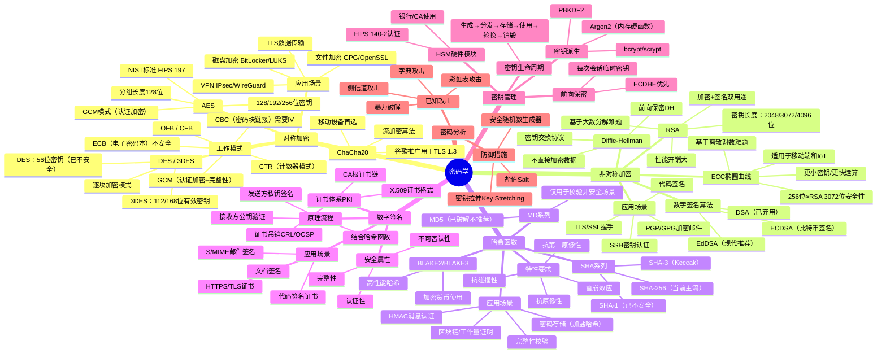
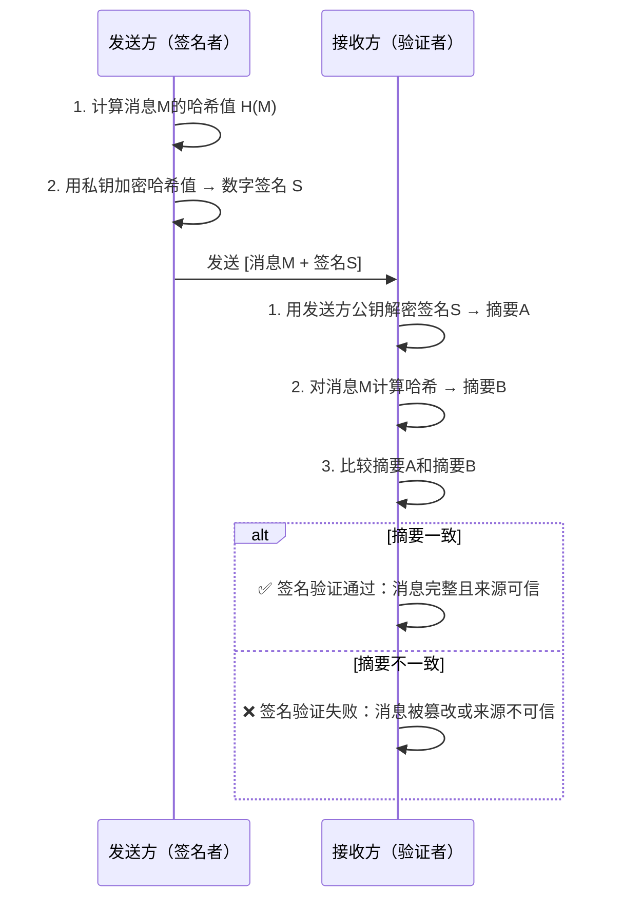
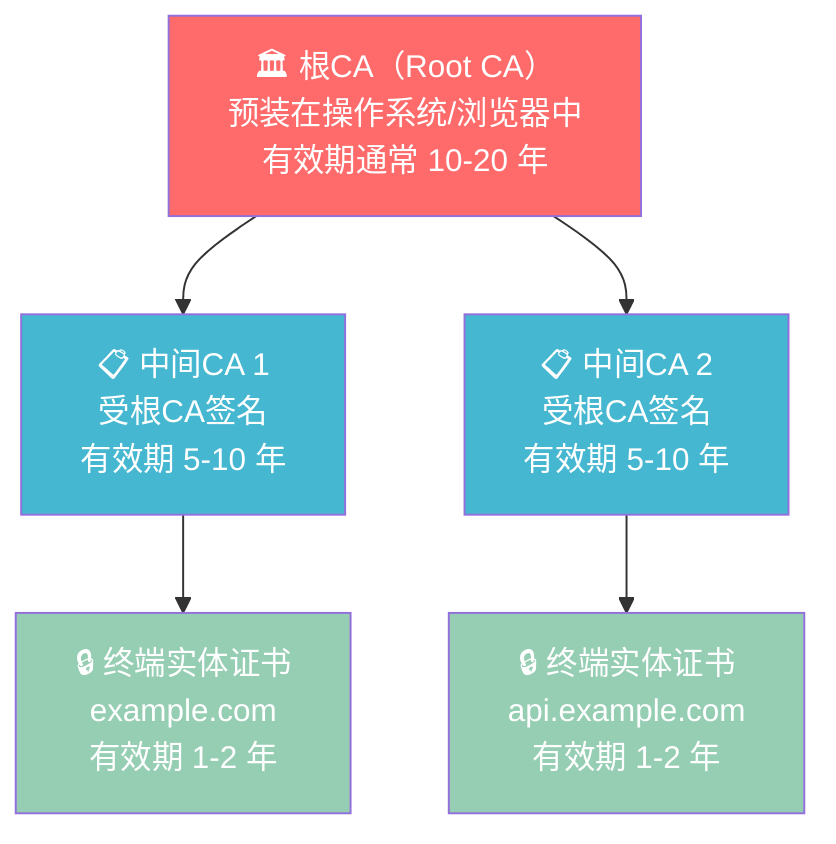
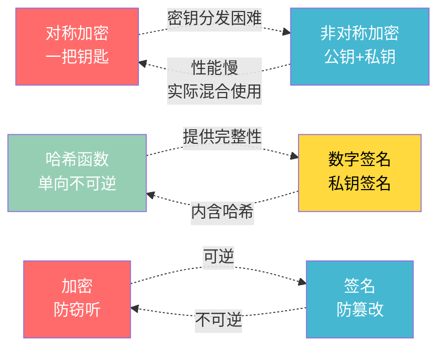

## 思维导图示例（密码学）

密码学（Cryptography）是信息安全的基石，也是几乎所有安全认证考试的核心知识域——从入门级的 CompTIA Security+ 到高级的 CISSP、OSCP，密码学概念无处不在。本节以密码学为例，演示如何用**思维导图**将庞杂的知识体系结构化，帮助你在备考中建立清晰的记忆框架。

> **为什么用思维导图？** 认证考试中的密码学知识涵盖对称加密、非对称加密、哈希函数、数字签名、密钥管理、PKI 等多个子域，彼此关联错综复杂。传统的线性笔记难以呈现这种网状关系，而思维导图天然适合展示"一棵树的全貌"——先见森林，再见树木。

---

## 一、密码学全景思维导图

以下是密码学核心知识体系的 Mermaid 思维导图，涵盖认证考试中 90% 以上的密码学考点：



---

## 二、按知识域展开详解

### 2.1 对称加密

对称加密使用**同一个密钥**进行加密和解密，核心优势是速度快，适合处理大量数据。

| 算法 | 密钥长度 | 分组大小 | 安全状态 | 认证考试要点 |
|------|---------|---------|---------|-------------|
| **AES** | 128/192/256 位 | 128 位 | ✅ 推荐 | NIST 标准，GCM 模式提供认证加密 |
| **DES** | 56 位 | 64 位 | ❌ 已破解 | 1999 年被 EFF 22 小时破解 |
| **3DES** | 112/168 位 | 64 位 | ⚠️ 即将淘汰 | NIST 已禁止用于新系统 |
| **ChaCha20** | 256 位 | 流密码 | ✅ 推荐 | Google 主推，TLS 1.3 默认选项之一 |

**关键工作模式对比：**

| 模式 | 安全性 | 并行化 | 典型用途 |
|------|--------|--------|---------|
| **ECB** | ❌ 不安全（相同明文→相同密文） | 可并行 | 绝不用于安全场景 |
| **CBC** | ⚠️ 需要随机 IV | 仅解密可并行 | 传统 TLS，逐渐被取代 |
| **CTR** | ✅ 安全（需唯一 nonce） | 完全并行 | 与 AES 组合为 AES-CTR |
| **GCM** | ✅✅ 最佳（加密+认证） | 完全并行 | TLS 1.3、IPsec、WireGuard |

**认证考试常见考点：**
- ECB 模式的"企鹅图像泄漏"经典案例：ECB 加密的 BMP 图片仍能辨认轮廓，因为相同像素块产生相同密文
- GCM 模式同时提供**机密性**和**完整性**，是现代系统首选
- AES 的密钥扩展过程：128 位密钥需要 10 轮，256 位需要 14 轮

### 2.2 非对称加密

非对称加密使用**一对密钥**——公钥（Public Key）加密，私钥（Private Key）解密，解决了对称加密的密钥分发难题。

**RSA vs ECC 核心对比：**

| 维度 | RSA | ECC |
|------|-----|-----|
| 数学基础 | 大整数分解难题 | 椭圆曲线离散对数难题 |
| 256 位安全性等价 | — | RSA 3072 位 |
| 512 位安全性等价 | — | RSA 7680 位 |
| 性能（1024 位） | 基准 | 约 6-8 倍快于 RSA |
| 密钥大小 | 2048 位（最低） | 256 位（同等安全） |
| 证书大小 | 较大 | 较小 |
| 适用场景 | 通用 | 移动端、IoT、TLS |

**密钥交换：Diffie-Hellman 协议**

DH 协议允许双方在不安全的信道上协商共享密钥，其安全基础是**离散对数难题**：

```text
Alice 和 Bob 公开约定：大素数 p 和生成元 g

Alice 生成私钥 a，计算公钥 A = g^a mod p，发送给 Bob
Bob 生成私钥 b，计算公钥 B = g^b mod p，发送给 Alice

Alice 计算：K = B^a mod p = g^(ab) mod p
Bob 计算：K = A^b mod p = g^(ab) mod p

共享密钥 K = g^(ab) mod p（窃听者即使知道 g, p, A, B 也无法计算 K）
```

**前向保密（Forward Secrecy）**：使用临时 DH 密钥（ECDHE），即使长期私钥泄露，历史会话数据仍安全。TLS 1.3 要求所有连接支持前向保密。

### 2.3 哈希函数

哈希函数将任意长度输入映射为**固定长度输出**，是密码学中的"指纹"工具。

**密码学哈希函数四大特性：**

| 特性 | 含义 | 通俗解释 |
|------|------|---------|
| **抗原像性** | 给定哈希值 h，无法找到原文 m 使 H(m)=h | 无法从指纹反推手指 |
| **抗第二原像性** | 给定 m，无法找到 m'≠m 使 H(m)=H(m') | 无法伪造相同的指纹 |
| **抗碰撞性** | 无法找到任意 m₁≠m₂ 使 H(m₁)=H(m₂) | 无法让两个不同手指产生相同指纹 |
| **雪崩效应** | 输入改变 1 bit，输出改变约 50% | 拷贝文件改一个字节，哈希值面目全非 |

**算法安全性演进：**

```text
MD5 (128位)  →  2004年碰撞攻击成功  →  ❌ 不可用于安全场景
SHA-1 (160位) → 2017年SHAttered攻击  →  ❌ Google+CW已造碰撞
SHA-256 (256位) → 当前主流  →  ✅ 推荐使用
SHA-3 (224-512位) → NIST 2015年标准  →  ✅ 备选方案
BLAKE3 (256位) → 极高吞吐量  →  ✅ 高性能场景推荐
```

**密码存储最佳实践：**

错误做法——直接存储哈希：
```text
password = "Myyour_password"
stored = MD5(password)  →  ❌ 彩虹表秒破
```

正确做法——加盐 + 密钥拉伸：
```text
salt = secure_random(16 bytes)  # 随机盐值
stored = Argon2id(password, salt, iterations=3, memory=64MB)
# 即使数据库泄露，暴力破解成本极高
```

常见密钥派生函数（KDF）在考试中的对比：

| KDF | 特点 | 认证考试考点 |
|-----|------|-------------|
| **PBKDF2** | NIST 推荐，迭代次数可调 | FIPS 标准，兼容性好 |
| **bcrypt** | 包含盐值，自适应成本 | OpenBSD 默认，96 字节输出 |
| **scrypt** | 内存硬函数，抗 GPU/ASIC | Litecoin 使用 |
| **Argon2** | 2015 年密码哈希竞赛冠军 | 当前最佳实践，抗侧信道 |

### 2.4 数字签名与 PKI

数字签名将**哈希函数**和**非对称加密**结合，提供认证性、完整性和不可否认性。

**签名与验证流程：**



**PKI（公钥基础设施）信任链：**



**证书吊销机制对比：**

| 机制 | 全称 | 工作方式 | 优点 | 缺点 |
|------|------|---------|------|------|
| **CRL** | Certificate Revocation List | 客户端定期下载吊销列表 | 简单直接 | 列表可能很大；更新不及时 |
| **OCSP** | Online Certificate Status Protocol | 实时查询CA服务器 | 实时性好 | 隐私泄露；单点故障 |
| **OCSP Stapling** | 证书装订 | 服务器主动获取并附带OCSP响应 | 兼顾实时性和性能 | 需要服务器支持 |
| **CRLSet** | Chrome的CRL替代方案 | 浏览器内置小规模吊销列表 | 快速、隐私友好 | 仅限Chrome，非通用标准 |

### 2.5 密钥管理

密码学系统的安全性最终取决于密钥管理的强度。正如安全界的共识："**加密算法通常不是最弱环节，密钥管理才是。**"

**密钥生命周期六大阶段：**

| 阶段 | 关键操作 | 安全要求 | 考试常见考点 |
|------|---------|---------|-------------|
| **生成** | 使用密码学安全随机数生成器（CSPRNG） | 不可预测性；足够熵值 | `/dev/urandom` vs `/dev/random` 之争 |
| **分发** | 安全通道传输；数字信封机制 | 保密性+完整性+认证性 | DH 密钥交换、RSA 密钥封装 |
| **存储** | HSM 硬件模块或密钥库 | 防泄露、防篡改 | FIPS 140-2 四个安全等级 |
| **使用** | 严格限制用途（签名/加密/派生） | 最小权限原则 | 密钥用途分离（Key Usage 扩展） |
| **轮换** | 定期更换；事件驱动更换 | 无缝过渡、向后兼容 | 90 天轮换策略、密码泄露触发轮换 |
| **销毁** | 安全擦除、物理销毁 | 不可恢复 | DoD 5220.22-M 标准、密码学擦除 |

**HSM（硬件安全模块）安全等级：**

| FIPS 140-2 等级 | 要求 | 典型应用场景 |
|----------------|------|-------------|
| **Level 1** | 基本安全要求；无物理安全 | 软件 HSM 模拟 |
| **Level 2** | 被动篡改检测（封蜡/贴纸） | 小型组织 |
| **Level 3** | 主动篡改抵抗（零化/加密内存） | 银行、CA、政府 |
| **Level 4** | 完全物理封装；环境故障保护 | 最高安全级别 |

---

## 三、考试高频考点速记表

以下是密码学在各认证考试中的高频考点汇总，适合制作 Anki 卡片或速记：

| 考点 | 关键数据 | 记忆技巧 |
|------|---------|---------|
| AES-256 密钥长度 | 256 位 | "AES 256 = 军事级" |
| DES 密钥长度 | 56 位（实际 64 位含校验） | "DES 56 = 已死" |
| RSA 最低安全长度 | 2048 位（2030 年后需 3072 位） | "RSA 二零四八起步" |
| ECC 256 位安全性 | ≈ RSA 3072 位 | "ECC 256 = RSA 三零七二" |
| SHA-256 输出长度 | 256 位（32 字节） | "SHA-256 名字即长度" |
| MD5 输出长度 | 128 位（16 字节） | "MD5 一二八已不安全" |
| 前向保密 | ECDHE / DHE | "E 前缀 = Ephemeral 临时的" |
| 认证加密 | AES-GCM / ChaCha20-Poly1305 | "GCM = 加密+MAC" |
| 密码存储 KDF | Argon2id > bcrypt > PBKDF2 | "Argon2 冠军最佳" |
| 证书有效期 | 终端实体 1-2 年；中间 CA 5-10 年 | "叶子短命，根长寿" |

---

## 四、思维导图构建方法论

### 4.1 构建原则

构建密码学思维导图时，遵循以下方法论：

**原则一：从核心概念出发**
以"密码学"为根节点，先展开四大核心分支（对称/非对称/哈希/签名），再逐层细化。不要一开始就陷入具体算法细节。

**原则二：按"是什么→为什么→怎么用"展开**
每个子节点应包含：定义（是什么）、安全基础（为什么安全）、应用场景（怎么用）。

**原则三：标注考试重点**
用颜色或标记区分"必须掌握"和"了解即可"的知识点。例如：
- 🔴 红色 = 必考高频点（AES 工作模式、RSA vs ECC、SHA 安全性）
- 🟡 黄色 = 常考中频点（DH 密钥交换流程、PKI 证书链）
- 🟢 绿色 = 了解级别（PBKDF2 细节、HSM 等级区分）

**原则四：关联对比记忆**
在思维导图中用虚线箭头标注容易混淆的概念对：



### 4.2 各认证考试的思维导图侧重

不同认证考试对密码学的考查深度和角度不同，思维导图的构建也应有所侧重：

| 认证 | 密码学权重 | 侧重方向 | 思维导图重点 |
|------|-----------|---------|-------------|
| **CompTIA Security+** | ⭐⭐⭐ | 概念理解、算法选择 | 对称/非对称对比、哈希用途、基本 PKI |
| **CEH** | ⭐⭐ | 攻击利用 | 密码分析攻击、弱密码破解、彩虹表 |
| **CISSP** | ⭐⭐⭐⭐ | 管理决策 | 算法选择策略、密钥管理生命周期、合规要求 |
| **OSCP** | ⭐⭐ | 实操破解 | John/hashcat 命令、密码哈希识别、离线破解 |
| **CISP** | ⭐⭐⭐ | 合规标准 | 国密算法（SM2/SM3/SM4）、等保密码要求 |

### 4.3 从思维导图到 Anki 卡片的转化

思维导图是**全局视角**，Anki 卡片是**局部击破**。建议工作流：

1. **先画全景导图**：用 Mermaid mindmap 梳理完整知识树（如本文第一节所示）
2. **识别薄弱节点**：在导图中标注自己不熟悉的分支
3. **转化为原子卡片**：每个叶子节点 → 1-2 张 Anki 卡片
4. **添加关联箭头**：在卡片的"补充信息"字段引用相关卡片编号

**转化示例：**

思维导图节点 → Anki 卡片：

```text
导图节点：AES → GCM模式
转化卡片：
正面：AES-GCM相比AES-CBC多了什么安全属性？
背面：GCM额外提供认证加密（AEAD），同时保证机密性和完整性。
      CBC只提供机密性，需要额外HMAC保证完整性。
      GCM是TLS 1.3的首选模式。
```

---

## 五、实战练习：自测思维导图掌握度

尝试在不看上文的情况下，默画以下思维导图：

1. **基础级**：画出对称加密 vs 非对称加密的对比树，标注各自至少 3 个算法
2. **进阶级**：画出 PKI 信任链从根 CA 到终端证书的层级关系
3. **高级**：画出 TLS 1.3 握手过程中密码学组件的交互流程（ECDHE 密钥交换 + AES-GCM 加密 + SHA-256 哈希）

完成后对照本文的 Mermaid 图，标记遗漏的知识点，针对性复习。

---

## 六、常见误区与纠正

| 误区 | 正确理解 | 影响 |
|------|---------|------|
| "AES 是对称加密，所以不能用于 HTTPS" | HTTPS 用 AES 加密数据，用 RSA/ECDHE 交换密钥，两者配合使用 | 混淆了加密和密钥交换的角色 |
| "MD5 加密密码还是可以用的" | MD5 是哈希不是加密；且已不安全，应用 Argon2id | 密码存储安全 |
| "RSA 4096 位一定比 256 位 ECC 安全" | ECC 256 位 ≈ RSA 3072 位，4096 位 RSA 略强但性能差很多 | 实际部署中 ECC 更优 |
| "加密=签名，都是保护数据的" | 加密保证机密性（防窃听），签名保证完整性+不可否认性（防篡改） | 安全目标混淆 |
| "前向保密靠算法实现" | 前向保密靠密钥交换协议（ECDHE），与加密算法无关 | TLS 配置错误 |
| "证书越长越安全" | 证书安全取决于密钥长度和算法，与证书文件大小无直接关系 | 安全评估偏差 |

---

## 七、小结

本节以密码学为例，演示了思维导图在安全认证备考中的完整应用：

1. **全景导图先行**：用 Mermaid mindmap 梳理密码学六大知识域，建立全局认知框架
2. **逐域深度展开**：对称加密、非对称加密、哈希函数、数字签名/PKI、密钥管理、密码分析，每个子域都有详细的对比表格和流程图
3. **考试导向整理**：汇总各认证考试的高频考点和记忆技巧，提升备考效率
4. **方法论沉淀**：给出思维导图的构建原则、考试侧重差异、以及从导图到 Anki 卡片的转化流程
5. **误区纠偏**：列出 6 个常见密码学认知误区及正确理解

> **下一步行动**：建议读者参照本节的模板，为自己的薄弱知识域（如网络协议、操作系统安全、渗透测试方法论等）各画一张思维导图，结合 Anki 间隔重复，形成"宏观导图 + 微观卡片"的双层备考体系。
