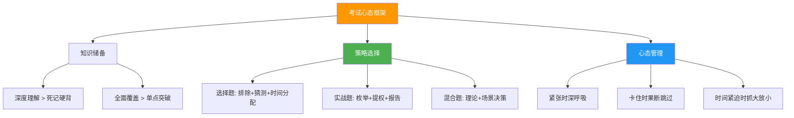

## 28.2 考试技巧

备考再充分，如果不懂"考试"本身，也可能功亏一篑。根据 (ISC)² 2024 年全球认证考生调研，**约 35% 的首次失败者自评"知识掌握足够，但考试策略失误导致未通过"**。考试技巧不是投机取巧——它是将已有知识最大化转化为分数的系统方法论。

本节按"道-法-术-器"框架，从选择题、实战操作题、报告撰写三大考试形式出发，覆盖题型分析、时间分配、排除策略、心态管理全链路，帮助你在考场上稳定发挥甚至超常发挥。

---

## 28.2.1 考试形式全景与应对哲学（道）

不同认证考试形式差异巨大，盲目套用同一套策略会导致严重失误。先认清考试形式，再制定对策。

### 认证考试的三大形式

| 考试形式 | 代表认证 | 题目数量 | 时间限制 | 核心能力考察 | 通过线 |
|---------|---------|---------|---------|------------|-------|
| **选择题（CBT）** | CISSP、CISM、Security+、CEH、CISA | 100-250 题 | 3-4 小时 | 知识广度 + 判断力 | 70-75%（CISSP 为 CAT 自适应） |
| **实战操作（Hands-on）** | OSCP、CISP-PTE、OSCE3 | 不固定（3-5 台机器） | 24-48 小时 | 渗透能力 + 报告质量 | 攻破指定数量的机器 + 合格报告 |
| **混合模式** | CISM（案例分析）、CISSP（CAT 自适应） | 选择题 + 场景分析 | 3-4 小时 | 理论 + 实际决策 | 官方阈值（非公开） |

### 考试的核心不是"答对"，而是"在规则内拿最多分"

**选择题的哲学**：你不需要答对所有题目，你只需要超过通过线。这意味着：
- 不确定的题目花太多时间是负收益（时间机会成本）
- 有些题目本身有争议，纠结没有意义
- 稳定发挥比偶尔超常更重要

**实战题的哲学**：你不需要攻破所有机器，你只需要达到通过分数。这意味着：
- 先拿容易的分数（低垂的果实）
- 一台机器拿到 user shell 有时比两台机器都只拿到部分信息更有价值
- 报告质量可以弥补技术不足



---

## 28.2.2 选择题深度攻略（法 + 术）

选择题是大多数认证考试的主要形式，但"会做"和"做对"之间往往隔着一层策略。

### 审题五步法

**第一步：读清题目问的是什么**

很多失分不是因为不会，而是因为没看清题目在问什么。养成圈画关键词的习惯：

- **"最"字题**："最有效""最重要""首先"——答案只有一个
- **"首先"题**：考的是流程顺序，第一个步骤往往不是最有效的，而是最基础的
- **否定题**："以下哪项**不是**""**除外**"——读两遍，圈出否定词
- **"最佳"题**：可能有多个"对"的答案，但只有一个是"最佳"的

**第二步：识别题目考察的知识域**

CISSP 等综合性考试中，一道题可能涉及多个领域。识别出题意图能帮你快速定位知识：

```text
题目中出现"加密""哈希""密钥" → 安全架构与工程 / 密码学
题目中出现"策略""流程""合规" → 安全管理 / 风险管理
题目中出现"IDS""防火墙""日志" → 安全运营 / 通信安全
题目中出现"渗透""漏洞利用" → 安全评估 / 渗透测试
```

**第三步：分析题目的场景背景**

选择题往往设定一个特定场景。先理解场景，再回答问题：

- **谁是决策者？** 技术人员还是管理者？答案可能完全不同
- **当前处于什么阶段？** 事前预防、事中检测还是事后响应？
- **约束条件是什么？** 预算有限、时间紧迫、人员不足？

**第四步：评估所有选项**

不要看到第一个"感觉对"的选项就选。完整阅读所有选项，进行横向对比。

**第五步：确认答案的合理性**

选完后用"如果我是安全管理者，这个答案合理吗？"来验证。

### 排除法：从 4 个选项到 1 个答案

排除法是选择题最实用的技巧，能将猜中概率从 25% 提升到 50%-75%。

**第一轮排除：绝对化选项**

以下表述在信息安全考试中几乎总是错误的：

| 绝对化表述 | 为什么几乎总是错的 | 例外情况 |
|-----------|------------------|---------|
| "必须""只能""绝不" | 安全领域强调深度防御和多层控制，极少有单一方案能解决所有问题 | 符合法规强制要求的条款（如"必须加密传输中的 PII"） |
| "总是安全的""完全消除" | 没有绝对的安全，只有风险管理 | "消除了已知的特定漏洞"这种限定性表述 |
| "所有以上" | 要谨慎——如果任何一个是错的，这个选项就不对 | 当你确认 A、B、C 都正确时才选 |
| "以上都不是" | 同样要谨慎——通常不是答案，除非你确信其他全错 | 极少见 |

**第二轮排除：技术细节错误**

- 混淆相似概念（如对称/非对称加密的应用场景）
- 时间/数量/顺序错误（如将"三次握手"写成"两次"）
- 张冠李戴（如将某个框架的特性安到另一个框架上）

**第三轮排除：场景不匹配**

- 答案在技术上可能正确，但不符合题目设定的场景
- 例如：题目要求"最小成本"方案，你选了一个功能最全但最贵的

**排除法实战示例**：

```text
题目：在一个零信任架构中，以下哪项措施是最基本的安全原则？

A. 在网络边界部署防火墙          → 排除：零信任取消了"边界"假设
B. 所有用户和设备必须经过身份验证和授权 → 保留：零信任的核心原则
C. 禁止所有外部网络连接            → 排除：绝对化，不现实
D. 使用 VPN 保护所有远程访问        → 排除：VPN 是传统边界安全方案

答案：B（零信任的核心是"永不信任，始终验证"）
```

### 猜测策略：不确定时如何最大化得分

当排除到 2 个选项无法继续排除时：

**策略一：选择最"安全"的答案**
- 在安全管理类题目中，选择最符合最佳实践、最保守的选项
- 安全领域的"最佳答案"往往是防护最全面、风险最低的方案

**策略二：选择最具体、最准确的答案**
- 在技术类题目中，选择最精确的技术描述
- 模糊的、笼统的描述往往不是正确答案

**策略三：注意题目中的"限定词"**
- "**通常**情况下"——暗示有例外，答案是一般性原则
- "**在所有选项中**"——即使不完美，选最好的那个
- "根据**最佳实践**"——选业界推荐的标准做法

**策略四：利用关联题目**
- 考试中后续题目可能暗示前面题目的答案
- 如果前面一道题的答案是"A 是正确的"，后面类似的题大概率也选 A

**关键数据**：在 CAT 自适应考试（如 CISSP）中，猜测策略需要调整——因为答错的惩罚更大（会推送更难的题目），所以宁可花时间确认，也不要随意猜。

### CISSP 专项："安全管理者思维"

CISSP 考试最大的特点不是考你技术多强，而是考你能否像一个安全管理者一样思考：

**CISSP 答题黄金法则**：

1. **生命安全永远第一**：如果某个选项涉及保护人员生命安全，这几乎总是正确答案（如地震后先救人再救数据）
2. **风险管理优先于技术方案**：管理者先评估风险再决定对策，而不是直接上技术
3. **业务连续性重要于完美安全**：如果一个方案能保护所有数据但会让业务停摆，它可能不是最佳答案
4. **合规与法律高于技术**：涉及法律法规的选项优先级更高
5. **选择"最正确"而非"技术上最正确"**：有时候技术上完美的方案在管理层面不可行

**CISSP 典型陷阱题目分析**：

```text
题目：公司发现一次数据泄露事件，作为信息安全官，你应该首先做什么？

A. 立即修复漏洞                      → 错：先调查，后修复
B. 通知所有受影响的用户                → 错：太早了，还没评估范围
C. 启动事件响应计划，进行调查评估        → 对：标准流程
D. 向媒体发布公开声明                  → 错：最后才做的事

解析：很多人会选 A（技术思维），但管理者思维是 C——先启动事件响应流程，
按计划调查、评估范围，然后再决定修复和通知的策略。
```

### CISM 专项：从"安全视角"到"管理视角"

CISM 比 CISSP 更加偏向管理决策：

- **信息风险管理**是核心，技术是手段
- 答题时问自己："如果我是 CISO，面对董事会，我会怎么解释这个决策？"
- 关注**业务目标**与**安全目标**的对齐
- 优先选择"能证明 ROI"和"可量化"的方案

### Security+ 专项：广度优先

Security+ 考察面广但不深：

- 8 个领域都有题目，不要偏科
- 重点掌握术语和定义的精确含义
- 注意 CompTIA 特有的"Exam Objectives"——每个目标都有可能出题
- 图表题和场景题要先理解图表/场景，再回答

---

## 28.2.3 时间分配策略（术 + 器）

时间管理是考试策略的核心。时间分配不当是导致"会做的题没时间做"的首要原因。

### 选择题考试的时间分配

**通用公式**：

```text
每题平均时间 = 总考试时间 ÷ 总题目数 × 0.8（预留 20% 用于检查和难题）

示例：
- CISSP: 240 分钟 ÷ 125 题 × 0.8 = 约 1.5 分钟/题
- Security+: 90 分钟 ÷ 90 题 × 0.8 = 约 0.8 分钟/题
- CISM: 240 分钟 ÷ 150 题 × 0.8 = 约 1.3 分钟/题
```

**三遍答题法**：

| 遍数 | 策略 | 时间占比 | 目标 |
|------|------|---------|------|
| 第一遍 | 快速过——有把握的立即选，没把握的标记 | 50%（约 1.2 小时） | 完成 70% 的题目 |
| 第二遍 | 回顾标记题——用排除法缩小范围 | 30%（约 0.7 小时） | 完成剩余 30% |
| 第三遍 | 检查——重点检查第一遍不确定的和计算题 | 20%（约 0.5 小时） | 确认答案 |

**关键原则**：
- **不要在单个题目上超过 3 分钟**——如果超过，标记后跳过
- **不要修改第一直觉**——研究表明，修改答案时从错改对的概率只有约 30%
- **CAT 考试没有回头功能**——CISSP 的 CAT 模式下，一旦提交就不能回头，每题都要慎重

### 实战考试的时间分配

以 OSCP（24 小时）为例，时间分配是成败的关键：

```mermaid
gantt
    title OSCP 24小时考试时间分配示例
    dateFormat HH:mm
    axisFormat %H:%M
    section 信息收集
    目标侦察与扫描   :00:00, 3h
    section 机器攻坚
    机器1（简单）    :03:00, 3h
    机器2（中等）    :06:00, 5h
    机器3（困难）    :11:00, 5h
    section 休息
    短暂休息         :09:00, 1h
    section 报告
    报告撰写         :16:00, 5h
    报告检查         :21:00, 3h
```



**OSCP 时间分配建议**：

| 阶段 | 时间分配 | 具体内容 |
|------|---------|---------|
| **信息收集** | 前 3 小时 | Nmap 全端口扫描、目录枚举、服务识别、漏洞搜索 |
| **机器攻坚** | 13-15 小时 | 每台机器预留 4-5 小时，包含尝试和切换 |
| **休息** | 1-2 小时 | 每 6-8 小时短暂休息，保持清醒 |
| **报告撰写** | 5-6 小时 | 详细记录每个发现，截图，修复建议 |
| **检查** | 2-3 小时 | 审核报告，补充遗漏 |

**关键策略**：
- **先做简单机器**：拿到 20 分（2 台 user）可能就够通过了
- **不要死磕一台机器**：尝试 2-3 小时没有进展，切换到下一台
- **user shell 优先**：拿到 user 比 root 更有确定性，先确保拿分
- **报告是生命线**：OSCP 不仅考技术，更考报告质量——报告占通过分数的很大权重

### CISSP CAT 考试的时间特殊性

CISSP 采用**计算机自适应测试（CAT）**，与传统考试有本质区别：

| 特性 | 传统考试 | CAT 自适应考试 |
|------|---------|--------------|
| 题目数量 | 固定（如 250 题） | 动态（100-150 题） |
| 题目难度 | 固定 | 根据答题表现动态调整 |
| 时间限制 | 固定（如 4 小时） | 固定（4 小时） |
| 回头修改 | 通常可以 | **不能回头** |
| 通过判定 | 达到分数线 | 达到统计阈值 |
| 提前结束 | 不可能 | 答够且置信度达标时可提前结束 |

**CAT 考试的时间管理要点**：
- 每题平均 1.5-2 分钟，但难题可以多花时间
- 如果连续答对，题目会越来越难——这是好事，说明你在进步
- 如果连续答错，题目会变简单——不要慌，重新调整节奏
- 系统判定你已通过或不可能通过时会提前结束考试

---

## 28.2.4 实战操作考试深度攻略（术 + 器）

对于 OSCP、CISP-PTE 等实战型考试，技术能力是基础，但考试策略决定了你能把技术能力转化成多少分数。

### OSCP 考试全流程策略

**Phase 0：考前准备（考试前 1-2 天）**

```text
□ 确认考试环境（VPN 连接、远程桌面工具）
□ 准备好常用脚本和工具清单
□ 测试网络连接稳定性
□ 准备报告模板
□ 设置好截图工具
□ 确认考试时间和登录凭证
□ 准备食物和水（24 小时是持久战）
```

**Phase 1：信息收集（每台机器 20-30 分钟）**

信息收集是渗透测试的基础，但过度收集会浪费时间。以下是高效的信息收集流程：

```bash
# 第一轮：快速扫描（5分钟）
nmap -sC -sV -oA initial <target>        # 默认脚本 + 版本检测
nmap -p- -oA full <target>               # 全端口扫描（后台运行）

# 第二轮：深入扫描（10分钟）
# 对发现的端口逐一深入
nmap -sU -p 161 <target>                # SNMP
nmap --script="http-*" -p 80,443 <target> # HTTP 脚本

# 第三轮：目录枚举（10分钟）
gobuster dir -u http://<target> -w /usr/share/wordlists/dirb/common.txt
nikto -h http://<target>
```

**Phase 2：漏洞发现与利用（每台机器 2-4 小时）**

```text
1. 先用已知漏洞搜索
   - searchsploit <service> <version>
   - 查看 CVE 数据库

2. 尝试常见攻击向量
   - Web 漏洞（SQL 注入、文件上传、命令注入）
   - 服务漏洞（默认密码、已知 CVE）
   - 配置错误（目录遍历、敏感文件泄露）

3. 如果常规方法失败
   - 尝试暴力破解（但先确认没有锁定机制）
   - 尝试社会工程（如果考试范围允许）
   - 尝试竞态条件或其他高级攻击
```

**Phase 3：提权（每台机器 1-2 小时）**

提权是 OSCP 考试中最耗时的环节：

```text
Linux 提权检查清单：
□ sudo -l（检查 sudo 权限）
□ SUID 文件（find / -perm -4000 2>/dev/null）
□ 内核漏洞（uname -a → 搜索 exploit）
□ 计划任务（crontab -l, /etc/crontab）
□ 可写路径（PATH 劫持）
□ 敏感文件（/etc/passwd 可写、SSH 密钥）

Windows 提权检查清单：
□ whoami /all（检查 Token 特权）
□ 系统信息（systeminfo → 搜索补丁缺失）
□ 服务路径（不安全的服务路径引号缺失）
□ AlwaysInstallElevated
□ 注册表自启动项
□ 凭据搜索（浏览器、配置文件）
```

**Phase 4：报告撰写（5-6 小时）**

报告是考试的"最后一公里"，也是最容易被忽视的环节。

**报告模板结构**：

```markdown
1. 执行摘要（Executive Summary）
   - 测试范围概述
   - 发现的主要风险
   - 关键建议

2. 方法论说明
   - 使用的工具和技术
   - 测试范围和边界

3. 发现汇总表
   | 机器 | 漏洞 | 严重程度 | 状态 |
   |------|------|---------|------|
   | 机器1 | Web SQL注入 | 高 | 已获取 root |
   | 机器2 | 配置错误 | 中 | 已获取 user |

4. 详细发现（按机器组织）
   每台机器包含：
   - IP 地址
   - 枚举过程和关键发现
   - 漏洞利用步骤（完整命令和输出）
   - 截图
   - 提权过程
   - 最终截图（id、whoami 等证明）

5. 修复建议
   - 针对每个漏洞的具体修复措施
   - 优先级排序

6. 附录
   - 完整的扫描结果
   - 使用的工具版本
```

**报告撰写关键原则**：
- **详细到可复现**：每个攻击步骤都要包含完整命令和输出
- **截图是证据**：关键步骤必须有截图（获取 user/root 的证明）
- **修复建议要具体**：不要只写"修复漏洞"，要写"升级 OpenSSH 到 8.6p1"
- **遵循官方模板**：Offensive Security 提供了官方报告模板，务必使用

### CISP-PTE 实战考试策略

CISP-PTE 考试为 8 小时实操考试，考察 Web 渗透和系统渗透：

| 部分 | 分值 | 时间建议 | 重点 |
|------|------|---------|------|
| Web 渗透 | 约 60 分 | 4-5 小时 | SQL 注入、文件上传、命令注入、逻辑漏洞 |
| 系统渗透 | 约 40 分 | 3-4 小时 | 信息收集、漏洞利用、权限提升 |

**CISP-PTE 技巧**：
- Web 部分是拿分重点，确保 Web 题目拿到足够分数
- 注意中文环境的特殊性（如 GBK 编码、国产中间件）
- 报告格式要求严格，按模板填写

---

## 28.2.5 心态管理与应试心理（道 + 术）

考试不仅是知识的比拼，更是心态的较量。很多失败者不是输在知识，而是输在心态。

### 考前焦虑管理

**正常化焦虑**：适度的焦虑是好事——它让你保持警觉和专注。研究表明，完全没有焦虑的考生表现反而不如中等焦虑的考生（Yerkes-Dodson 定律）。

**焦虑水平与表现的关系**：


**考前一周的心态调整**：

1. **停止新知识学习**：考前一周不要再学新内容，只做复习和模拟
2. **正常作息**：保持平时的作息时间，不要临时调整
3. **适度运动**：每天 30 分钟的有氧运动能显著降低焦虑
4. **心理预演**：闭眼想象自己在考场上稳定答题的场景
5. **准备 Plan B**：告诉自己"即使这次没过，还有下次"——减轻心理压力

### 考试中的心态管理

**遇到不会的题**：

- **不要慌**：一道题不会不代表考试失败
- **深呼吸 3 次**：给自己 30 秒冷静
- **用排除法缩小范围**：即使不确定，也能提高猜中概率
- **标记跳过**：先做后面的题，回头再看

**时间紧迫时**：

- **停止追求完美**：一道 70% 确定的答案比空着好
- **快速过一遍剩余题目**：有把握的立即选
- **不要恐慌**：恐慌会导致连续犯错

**实战考试中遇到卡壳**：

- **设置"放弃阈值"**：同一台机器尝试超过 3 小时无进展，暂时放弃
- **切换思路**：换个攻击向量、换个工具、换个角度
- **短暂休息**：离开工位 10 分钟，走一走，让大脑"后台处理"
- **记录尝试过程**：即使失败了，报告中记录尝试过程也有价值

### 考后心态调整

- **不要立即对答案**：考完就放下，等成绩出来再说
- **记录经验**：无论通过与否，记录考试过程中的经验教训
- **庆祝努力**：备考本身就是一个提升的过程，无论结果如何

---

## 28.2.6 考前一周准备清单（器）

### 知识准备

```text
□ 最后一遍核心知识点（重点看薄弱环节）
□ 复习所有标记的错题
□ 快速过一遍所有思维导图
□ 确认考纲的所有知识点都已覆盖
□ 如果有模拟题，最后做一套完整的模拟
```

### 实操准备（实战考试）

```text
□ 测试 VPN 连接和远程桌面工具
□ 准备好常用脚本和工具清单
□ 确认考试环境（虚拟机、网络）
□ 准备报告模板（提前写好框架）
□ 测试截图工具
□ 准备备选工具（如主工具失败）
```

### 物质准备

```text
□ 确认考试时间和地点（或在线考试的时间窗口）
□ 准备身份证件（与报名信息一致）
□ 准备计算器（部分考试允许）
□ 准备饮用水和零食（长时间考试）
□ 确认网络环境稳定
□ 准备备用设备（如笔记本电脑）
```

### 心理准备

```text
□ 保证每晚 7-8 小时睡眠
□ 考前一天不做高强度学习
□ 进行 15 分钟冥想或深呼吸练习
□ 提前规划好考试当天的行程
□ 准备一个"信心锚点"——回忆一次成功的经历
```

---

## 28.2.7 各认证考试的特殊技巧

### OSCP 考试特殊技巧

1. **练习环境**：Proving Grounds 和 Hack The Box 的机器难度与考试接近
2. **枚举很重要**：80% 的突破来自充分的枚举，不要急于攻击
3. **不要忽略"简单"攻击**：默认密码、常见漏洞利用往往最有效
4. **报告占大比重**：即使技术不完美，报告写得好也能通过
5. **时间管理是关键**：24 小时很长，但很容易浪费在一台机器上

### CISSP 考试特殊技巧

1. **理解"Think Like a Manager"**：不是技术题，是管理决策题
2. **CAT 模式没有回头**：每题都要慎重，不能回头修改
3. **"Protect Human Life"**：涉及生命安全的选项几乎总是对的
4. **不要被技术细节迷惑**：CISSP 不考你是否会配置防火墙，考你是否知道何时该用防火墙
5. **官方学习指南是最好的教材**：不要依赖太多第三方资料

### CISM 考试特殊技巧

1. **信息风险管理是核心**：每道题都从风险管理角度思考
2. **选择"能证明价值"的方案**：CISO 向董事会汇报时需要 ROI
3. **业务目标优先**：安全服务业务，而非业务服务安全
4. **不要选"技术上最先进"的方案**：选"最符合业务需求"的方案

### Security+ 考试特殊技巧

1. **覆盖范围广**：8 个领域都要准备，不要偏科
2. **术语要精确**：CompTIA 对术语定义非常严格
3. **性能题和拖拽题**：注意考试中可能有非选择题型
4. **理解"why"比"what"更重要**：知道为什么选这个方案比知道是什么方案更关键

---

## 28.2.8 常见考试失误与纠正

### 选择题常见失误

| 失误类型 | 具体表现 | 纠正方法 |
|---------|---------|---------|
| **审题不清** | 没看到"NOT""EXCEPT"就选了 | 养成圈画关键词的习惯 |
| **过度思考** | 一道简单的定义题想太复杂 | 简单题快速过，复杂题才值得深思 |
| **时间失控** | 前半部分花太多时间，后面仓促答题 | 使用"三遍答题法"，每题不超过 3 分钟 |
| **修改答案** | 把对的改错了 | 除非有明确理由，否则不改第一直觉 |
| **偏科** | 某个领域几乎不准备 | 按考纲均匀分配学习时间 |

### 实战考试常见失误

| 失误类型 | 具体表现 | 纠正方法 |
|---------|---------|---------|
| **信息收集不足** | 省略关键枚举步骤 | 使用标准化的信息收集清单 |
| **死磕一台机器** | 在一台机器上浪费 8 小时 | 设置 3 小时放弃阈值 |
| **忽略报告** | 最后 1 小时才开始写报告 | 从一开始就边做边记录 |
| **忘记截图** | 关键步骤没有截图证明 | 每完成一步立即截图 |
| **不看考试要求** | 漏掉了必须完成的题目 | 开考前仔细阅读所有要求 |

---

## 28.2.9 小结

考试技巧的本质是**在有限的时间和压力下，将你的知识储备最大化地转化为分数**。记住三个核心原则：

> **原则一**：了解考试形式是第一步——选择题、实战题、混合题各有不同的应对策略
> **原则二**：时间管理是成败关键——先做会的，标记不会的，永远留时间检查
> **原则三**：心态决定发挥——适度紧张是好事，恐慌是大敌

无论参加哪种认证考试，以下行动清单适用于所有人：

1. 开考前 5 分钟通读所有要求和说明
2. 前 10% 的时间快速浏览全部题目，评估难度分布
3. 用排除法处理不确定的题目，永远不要空着
4. 实战考试中先拿容易的分数，再挑战难题
5. 无论结果如何，考后记录经验教训，为下次做准备

> 💡 **最后提醒**：考试技巧可以提升 10%-20% 的得分，但无法替代扎实的知识储备。最好的考试策略是——**充分准备 + 合理策略 + 稳定心态**。三者缺一不可。
