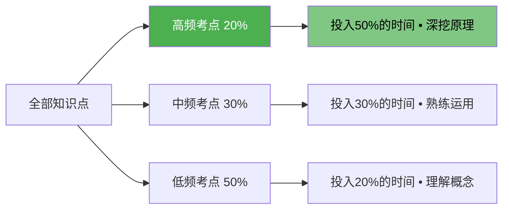
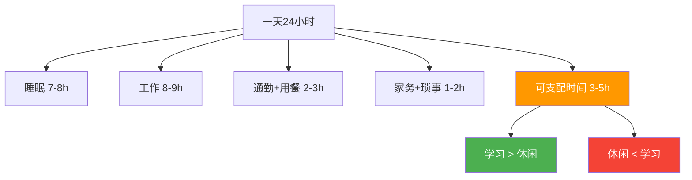

## 28.3 时间管理技巧

时间管理是认证备考中最被低估却最关键的能力。根据LinkedIn 2024年的一项调查，**78%的认证失败案例中，考生自评的首要原因不是理解能力不足，而是"没时间复习"**。更扎心的事实是：大多数人的"没时间"并非真的没有时间，而是**没有把时间用在正确的事情上**。

本章从认知科学和管理学两个维度出发，为你构建一套"道-法-术-器"四位一体的时间管理体系。

---

## 28.3.1 时间管理的底层逻辑（道）

### 帕金森定律：为什么你总是到最后才学

英国历史学家西里尔·帕金森提出的**帕金森定律**指出："工作会膨胀，以填满分配给它的所有时间。"这意味着如果你给自己3个月准备一个考试，你极大概率会用满3个月；如果只给你3周，你也会在三周内完成。

**对备考的启示**：不要设置过长的备考周期。研究表明，将备考周期压缩到合理范围（例如3-4个月），配合每日固定学习时段，效率反而高于松散安排6个月以上的方案。

### 艾森豪威尔矩阵：什么事真正重要

时间管理的核心不是"做更多事"，而是**做对的事**。艾森豪威尔矩阵将任务分为四个象限：

| 象限 | 紧急且重要 | 不紧急但重要 | 紧急但不重要 | 不紧急不重要 |
|------|-----------|-------------|-------------|-------------|
| **行动** | 立即做 | 计划做 | 委托/减少 | 尽量不做 |
| **备考示例** | 考前最后冲刺 | 日常系统学习 | 同事临时求助 | 刷短视频 |
| **时间占比** | 20% | 60% | 15% | 5% |

**关键洞察**：大多数人的时间被浪费在"紧急但不重要"的象限。认证备考的绝大多数活动属于"不紧急但重要"——这意味着它**永远可以被推到明天**，直到变成"紧急且重要"，然后变成危机。

### 80/20法则：用20%的努力拿下80%的分数

在大多数认证考试中，约**20%的知识点覆盖了80%的考题**。这不是让你投机取巧，而是提醒你：

- 先建立全局认知，识别高频考点
- 对高频考点投入更多时间（深挖原理）
- 对低频考点做到"知道存在，理解概念"即可



---

## 28.3.2 三阶段备考法（法）

根据认知科学中的**间隔效应**（Spacing Effect）和**测试效应**（Testing Effect），最优备考路径分为三个阶段：

### 第一阶段：框架构建期（第1-4周）

**目标**：建立完整的知识地图，而非死记硬背细节。

**具体行动**：
1. **浏览考纲**（Day 1-2）：通读官方考纲，标记自己不熟悉的模块
2. **速读教材/视频**（Week 1-3）：快速过一遍主要教材或培训视频，不做笔记，只求"见过"
3. **构建思维导图**（Week 3-4）：为每个模块建立一张思维导图，用XMind或MindNode完成
4. **自测摸底**（Week 4 end）：做一套完整的模拟题，记录得分和薄弱环节

**关键产出**：一个标注了"已掌握/需重点攻破/完全陌生"的模块清单。

### 第二阶段：专题攻坚期（第5-12周）

**目标**：按模块逐一攻克，深挖原理，典型题训练。

**每周节奏**：

| 日期 | 活动 | 时长 |
|------|------|------|
| 周一-周三 | 新知识学习（阅读+笔记） | 每天1小时 |
| 周四 | 针对性练习（专项题库） | 1小时 |
| 周五 | 错题回顾 + 复述巩固 | 45分钟 |
| 周六 | 完整模拟题 + 错题分析 | 2小时 |
| 周日 | 休息/补进度 | — |

**核心方法**：
- **费曼学习法**：学完一个概念后，假装把它讲给一个完全不懂的人听。如果你卡住了，说明你没真正理解。
- **主动回忆**：每学完一个知识点，闭书复述要点，而非重读。研究表明主动回忆的效率是被动重读的**2-3倍**（Roediger & Karpicke, 2006）。
- **交错练习**：不要在同一天反复练习同一类题目。交错不同主题的练习，记忆留存率更高。

### 第三阶段：冲刺模考期（第13-16周）

**目标**：实战模拟，查漏补缺，调整心态。

**具体行动**：
1. **全真模拟**：每3天做一套完整模拟题，严格计时
2. **边际增益分析**：每次模考后，按模块分析失分原因（知识盲区 / 粗心 / 时间不够）
3. **反脆弱训练**：在有干扰的环境下练习（咖啡厅、通勤路上），适应真实考场的不确定性
4. **错题三遍法**：同类型错题至少做三遍，直到形成条件反射

---

## 28.3.3 平衡工作与学习的实战方案（术）

### 每日时间池分析法

大多数在职人士每天的可支配时间比你想象的要多。用一张表格记录你一周的时间流向：



**关键结论**：即使最忙的人，每天也有3-5小时的可支配时间。问题在于这些时间被分散、被打断、被无意识地消耗了。

### 具体平衡策略

#### 1. 与家人/伴侣达成共识

备考不是一个人的事。与家人提前沟通：
- 明确告知备考周期（X个月）和每周需要的学习时间
- 约定"无扰学习时段"（例如晚8-10点关上书房门）
- 考后补偿计划（例如考完一起去旅行）

#### 2. 用日历块管理时间，而非待办清单

**不要**写"今天复习网络安全"——太模糊了，会被优先级更低的事情挤掉。

**要**写"今晚8:00-9:30：完成OWASP Top 10中XSS模块的思维导图+10道练习题"。

**实操模板**（Google Calendar / Outlook）：
```text
周一 19:00-19:30 通勤听播客（复习昨日内容）
周一 20:00-21:30 模块攻坚：SQL注入原理与防御
周二 07:00-07:30 晨间回顾：昨晚笔记（主动回忆）
周二 19:00-19:30 通勤听播客
周二 20:00-21:00 专项练习：SQL注入10题
周三 07:00-07:30 错题回顾
...
```

#### 3. 碎片时间的分类利用

不同的碎片时间适合不同的学习活动，不要一刀切：

| 碎片时长 | 场景 | 适合的学习活动 | 工具推荐 |
|----------|------|---------------|---------|
| 5-10分钟 | 排队、等车 | 复习闪卡（Anki） | Anki手机端 |
| 15-30分钟 | 通勤（公共交通） | 听播客/音频课程 | 喜马拉雅、得到 |
| 30-60分钟 | 午休、等待 | 做练习题、读教材 | 题库APP、PDF |
| 60分钟+ | 通勤（高铁/飞机） | 完整模块学习 | 笔记本电脑+笔记 |

#### 4. 工作场合的"隐形学习"

在不影响本职工作的前提下，可以利用工作中的碎片：
- 午休时间：吃完饭后30分钟做题
- 茶水间偶遇：和同事讨论技术话题，巩固知识
- 培训机会：如果公司有相关培训，优先参加
- 项目实践：主动申请涉及认证知识的工作任务（学以致用，一举两得）

---

## 28.3.4 推荐工具矩阵（器）

| 类别 | 工具名称 | 用途 | 价格 | 推荐指数 |
|------|---------|------|------|---------|
| 任务管理 | Todoist | 每日学习任务规划 | 免费/Pro $5/月 | ⭐⭐⭐⭐⭐ |
| 日历管理 | Google Calendar | 时间块规划 | 免费 | ⭐⭐⭐⭐⭐ |
| 笔记系统 | Obsidian/Notion | 知识管理+双向链接 | 免费 | ⭐⭐⭐⭐⭐ |
| 闪卡系统 | Anki | 间隔重复记忆 | 免费(iOS$25) | ⭐⭐⭐⭐⭐ |
| 专注计时 | Forest / Focusmate | 番茄工作法/社交监督 | 免费/订阅 | ⭐⭐⭐⭐ |
| 思维导图 | XMind | 知识框架构建 | 免费/Pro ¥129 | ⭐⭐⭐⭐ |
| 模考平台 | 各认证官方模考 | 全真模拟 | 视认证而定 | ⭐⭐⭐⭐⭐ |
| 进度追踪 | Notion / Excel | 学习进度仪表盘 | 免费 | ⭐⭐⭐⭐ |

---

## 28.3.5 常见误区与纠正

### 误区一：每天必须有2小时以上的完整学习时间

**真相**：每天3个20分钟的高质量学习，效果往往优于1个60分钟的疲惫学习。认知科学研究表明，学习效率在连续学习45分钟后开始显著下降。**高频短时 > 低频长时**。

**纠正**：接受"微学习"（Micro-Learning）的理念——利用碎片时间做闪卡、听音频、做几道题，同样有效。

### 误区二：先忙完工作再学习

**真相**：工作永远忙不完。如果你等到"工作不忙了"再学习，你永远不会有开始的那一天。

**纠正**：把学习时间像会议一样固定在日历上。**如果有人约你在这个时间段开会，你不需要拒绝——你只需要说"我已有安排了"。**

### 误区三：笔记越详细越好

**真相**：详细的笔记不等于深入的理解。很多人花大量时间整理笔记，实际上是在用"做笔记"来逃避"真正的学习"（思考和回忆）。

**纠正**：采用"最小笔记原则"——每页笔记不超过3个核心概念，用自己的话写，配上实际案例。笔记是思考的副产品，不是学习本身。

### 误区四：休息是浪费时间

**真相**：睡眠和休息对记忆巩固至关重要。记忆不是在学习时形成的，而是在**睡眠中**通过"记忆重放"（Memory Replay）机制固化的。

**纠正**：保证每晚7-8小时睡眠。每周至少安排一天完全休息。**学得狠不如睡得香。**

---

## 28.3.6 进阶：长期备考者的时间管理（精通级）

### 年度备考规划

对于需要6个月以上准备的认证（如CISSP、OSCP），建议采用**季度迭代**的方式：

- **Q1**：框架构建 + 基础模块（每周5-8小时）
- **Q2**：专题攻坚 + 专项练习（每周8-12小时）
- **Q3**：全真模拟 + 错题攻关（每周10-15小时）
- **Q4**：冲刺模考 + 薄弱修补（每周12-16小时）

每个季度末进行一次进度评估，调整下周期的计划。

### 回顾与复盘系统

每周日晚花15分钟做一次"周复盘"：

```text
本周学了多少小时？____实际 vs 计划 ____
本周完成了多少个模块？____
本周错题做了几遍？____
本周最大的收获：____________________
本周最大的问题：____________________
下周的调整计划：____________________
```

每月的复盘则关注更大的层面：

```text
哪些学习方法效果好？继续做。
哪些学习方法效果差？停止做。
哪里浪费了时间？怎么改进？
目标是否需要调整（提前/推迟）？
```

### 应对倦怠期

长期备考必然经历**激情期 → 疲劳期 → 平台期 → 倦怠期 → 冲刺期**的循环。在倦怠期：

1. **降低目标**：从"每天2小时"降到"每天30分钟"，保持习惯不断
2. **转换形式**：做题改为看视频，阅读改为听播客
3. **社交学习**：加入学习小组，互相监督
4. **允许停顿**：给自己放1-2天假，完全不碰学习
5. **视觉化成果**：列出已经学完的内容，给自己正反馈

---

## 28.3.7 小结

时间管理不是让你变成一台学习机器，而是让你**在对的时间用对的方法学对的内容**。记住三个核心公式：

> **公式一**：效果 = 时间 × 效率 × 方向
> **公式二**：效率 = 专注度 × 学习方法
> **公式三**：方向 = 对高频/薄弱知识点的精准投入

与其焦虑"时间不够"，不如从今天开始做一件事：**打开日历，把明天的学习时间先锁死1小时**。剩下的，这篇文章给了你所有需要的方法和工具。
