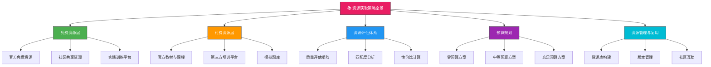
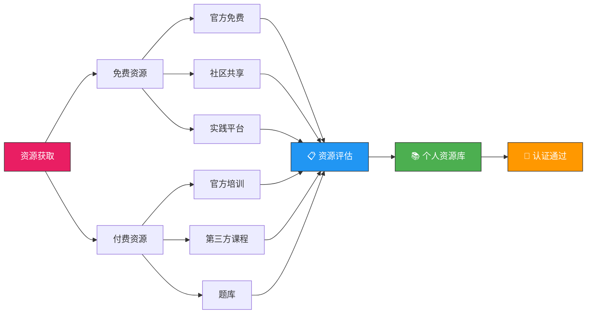

## 28.4 资源获取技巧

认证备考是一场信息战——你需要的不是"更多资源"，而是"正确的资源"。根据Udemy 2024年学习者行为报告，安全认证备考者平均接触过12种不同的学习资源，但最终仅深度使用3-4种。这意味着大量时间和金钱被浪费在低质量或不匹配的资源上。本节将为你建立一套完整的资源获取、评估和管理体系，确保每一分钱和每一分钟都花在刀刃上。



---

### 28.4.1 免费资源体系——零成本也能系统备考

免费资源并不等于低质量资源。事实上，许多认证机构提供的免费内容质量远超第三方付费产品。关键在于知道去哪里找、如何筛选、以及如何将零散的免费资源组织成系统化的学习路径。

#### 官方免费资源（优先级最高）

认证机构出于推广自身认证体系的需要，通常会提供大量免费内容。这些资源的最大优势是**权威性和准确性**——它们直接反映考试的出题方向和评分标准。

| 认证 | 官方免费资源 | 获取方式 | 内容质量 |
|------|------------|---------|---------|
| CISSP | (ISC)² 官方Webinar库 | isc2.org/Training/Free-Training | ⭐⭐⭐⭐⭐ 每月更新，覆盖全部8个CBK领域 |
| CompTIA Security+ | CertMaster免费预评估 | comptia.org/certifications/security | ⭐⭐⭐⭐ 精准定位薄弱领域 |
| CEH | EC-Council免费eBook和白皮书 | eccouncil.org/training/free-cybersecurity-resources | ⭐⭐⭐⭐ 覆盖核心攻防概念 |
| OSCP | OffSec免费渗透测试方法论 | offsec.com/courses/pen-200/ | ⭐⭐⭐ 仅为课程概览，非完整内容 |
| CISM | ISACA免费样题和知识摘要 | isaca.org/education/free | ⭐⭐⭐⭐⭐ 样题质量极高 |
| CISA | ISACA免费在线学习模块 | isaca.org/cisa | ⭐⭐⭐⭐ 部分模块可免费访问 |
| CCSP | (ISC)² 免费云安全入门课程 | isc2.org/Training/Free-Training | ⭐⭐⭐⭐ 适合零基础入门 |
| CySA+ | CompTIA CySA+蓝队训练日 | comptia.org/events | ⭐⭐⭐⭐ 线上线下结合 |

**使用策略**：不要把官方免费资源当作"可选项"，而是当作"必选项"。以CISSP为例，(ISC)²每月举办的免费Webinar由持证专家主讲，内容直接对标考试大纲。2024年共举办了48场Webinar，覆盖了CBK的全部8个领域。将这些Webinar按领域分类整理，本身就是一份高质量的复习材料。

#### 社区共享资源（需筛选）

社区资源的优势在于**实战性和时效性**——它们往往来自一线从业者的真实经验和最新考试反馈。但质量参差不齐，需要有筛选能力。

**GitHub开源学习资料**

GitHub是安全认证学习资料最丰富的开源平台。以下仓库经过社区验证，质量可靠：

| 仓库名称 | 覆盖认证 | Star数 | 内容类型 | 推荐理由 |
|---------|---------|--------|---------|---------|
| awesome-certifications | 通用 | 5000+ | 认证路径推荐+资源汇总 | 最全面的认证资源索引 |
| CISSP-Study-Resources | CISSP | 3000+ | 学习笔记+思维导图+题库 | 按CBK领域分类，结构清晰 |
| security-plus-study-guide | Security+ | 2000+ | 章节笔记+模拟题 | 适合零基础，循序渐进 |
| OSCP-Preparation | OSCP | 2500+ | 实验指南+脚本+报告模板 | 渗透测试实操导向 |
| CEH-Study-Materials | CEH | 1500+ | 模块笔记+工具使用指南 | 20个模块全覆盖 |

**使用技巧**：不要下载了就放在那里。每个GitHub仓库，先花10分钟浏览目录结构和README，判断是否与你的学习阶段匹配。然后只下载你需要的3-5个核心文件，其余的收藏备查。一个常见错误是下载了几十GB的资料却从未打开过。

**YouTube教学视频**

YouTube上有大量高质量的安全认证教学频道。关键是区分"娱乐型"和"学习型"内容：

| 频道名称 | 认证方向 | 内容深度 | 适合阶段 | 更新频率 |
|---------|---------|---------|---------|---------|
| Professor Messer | Security+, Network+, CySA+ | 入门-中级 | 系统学习 | 每个考试全量覆盖 |
| NetworkChuck | 网络安全+渗透测试 | 入门 | 兴趣培养 | 每周 |
| John Hammond | CTF+渗透测试+恶意软件分析 | 中级-高级 | 拓展视野 | 每周 |
| 13Cubed (DFIR) | DFIR取证+安全运营 | 中级-高级 | 专项深入 | 每月 |
| The Cyber Mentor (TCM) | 渗透测试+OSCP | 入门-中级 | 实操训练 | 每月 |
| Hack The Box | HTB挑战讲解+OSCP备考 | 中级-高级 | 模拟实战 | 每周 |
| IppSec | Hack The Box机器解析 | 高级 | OSCP冲刺 | 每周 |

**重要提示**：YouTube视频适合补充理解，不适合作为主要学习方式。研究表明，纯视频学习的知识留存率仅为10-20%，而配合笔记和练习的留存率可提升到60-70%。建议每看30分钟视频，花15分钟整理笔记和做对应练习。

**Reddit学习社区**

Reddit上的安全认证讨论是获取最新考试情报的最佳渠道之一。以下是值得关注的子版块：

- r/cissp：CISSP备考者的聚集地，经常有通过考试的经验分享和最新考题动态
- r/CompTIA：Security+、CySA+等CompTIA认证的备考讨论
- r/oscp：OSCP备考者的实战经验交流，包含大量实验室攻略
- r/netsec：广义的网络安全社区，技术讨论质量高
- r/SecurityCertifications：所有安全认证的综合性讨论版块

**使用策略**：搜索你目标认证的"[PASSED]"帖子，这些都是通过考试的考生写的总结。通常包含：备考时长、使用的资源、考试难度感受、注意事项。将这些帖子的共同点提取出来，就是最佳的备考路径。例如，CISSP的[PASSED]帖子中，90%以上提到了"官方OSG+题库"的组合，这就是最可靠的资源信号。

#### 实践训练平台（免费层）

对于渗透测试类认证（OSCP、CEH Practical、PNPT），动手实践是通过考试的前提。以下平台提供免费层：

| 平台 | 免费内容 | 适合认证 | 学习路径 |
|------|---------|---------|---------|
| TryHackMe | 部分房间免费 + 免费学习路径 | Security+, CEH, OSCP入门 | Pre-Security → Complete Beginner → Jr Penetration Tester |
| Hack The Box | 部分退役机器 + Starting Point | OSCP, CPTS | Starting Point → Easy → Medium → Hard |
| PicoCTF | 全部CTF挑战免费 | 通用安全基础 | 按难度递增的CTF挑战 |
| OverTheWire (Bandit) | 全部免费 | Linux基础+命令行 | Level 0-34的递进式关卡 |
| PortSwigger Web Security Academy | 全部免费 | Web安全+渗透测试 | 按OWASP Top 10分类的实验室 |
| LetsDefend | 部分SOC模拟免费 | CySA+, SC-200 | Blue Team训练路径 |

**关键原则**：免费平台的使用要有目标感。不要漫无目的地"做机器"，而是按照认证考试的知识领域选择对应的练习。例如备考OSCP时，每完成一台HTB机器，对照OSCP考试大纲标注你练习了哪些技术点，确保覆盖面足够。

---

### 28.4.2 付费资源选择——用投资思维做选择

当免费资源无法满足需求时，付费资源成为必要选择。但付费不等于盲目花钱——一份好的付费资源应该能节省你的时间、提升通过率、或提供免费资源无法获得的价值。

#### 付费资源质量评估矩阵

在购买任何付费资源前，使用以下五个维度进行评估：

| 评估维度 | 权重 | 评分标准（1-5分） | 说明 |
|---------|------|-----------------|------|
| 内容权威性 | 25% | 1=个人整理，5=官方/认证机构出品 | 是否由认证机构或授权讲师制作 |
| 考试匹配度 | 30% | 1=泛泛而谈，5=精准对标考试大纲 | 内容是否与最新版考试大纲完全匹配 |
| 更新频率 | 15% | 1=3年以上未更新，5=每季度更新 | 是否跟踪考试版本变化 |
| 学员评价 | 20% | 1=差评为主，5=90%+好评 | 多个平台交叉验证评价 |
| 通过率数据 | 10% | 1=无数据，5=公布通过率且高于平均 | 是否有可验证的通过率统计 |

**加权评分计算**：每个资源的总分 = Σ(维度评分 × 维度权重)。总分≥4.0为强烈推荐，3.0-4.0为值得考虑，<3.0建议寻找替代方案。

#### 主要付费资源平台对比

**在线课程平台**

| 平台 | 代表课程 | 价格区间 | 优势 | 劣势 | 适合人群 |
|------|---------|---------|------|------|---------|
| Udemy | Jason Dion系列、TCM Security | ¥50-200（促销价） | 性价比极高，课程丰富 | 质量参差不齐 | 预算有限的自学者 |
| Pluralsight | 安全认证路径课程 | $29/月 | 体系化学习路径 | 无实操环境 | 在职学习者 |
| LinkedIn Learning | 安全认证入门课程 | $29.99/月 | 与LinkedIn档案集成 | 深度不足 | 职业转型初期 |
| Cybrary | CISSP/CEH/Security+ | 免费-$59/月 | 专注安全领域 | 更新不够及时 | 安全领域专精 |
| Offensive Security | OSCP/OSWE课程 | $1599-$2499 | 行业标杆，实操导向 | 价格高，难度大 | 渗透测试方向 |

**官方培训课程**

官方培训是通过率最高的学习方式，但价格也最高：

| 认证 | 官方培训 | 价格 | 通过率 | 是否含考试券 |
|------|---------|------|--------|------------|
| CISSP | (ISC)² Official Training | ¥15000-25000 | ~95% | 可选（加购考试券约¥4500） |
| CEH | EC-Council iLabs + 线上课程 | ¥8000-15000 | ~90% | 部分套餐含 |
| CISM | ISACA官方培训 | $2495 | ~90% | 不含（考试费另付$575） |
| OSCP | OffSec PEN-200 | $1599-$2499 | ~30%（含实验考试） | 含1次考试机会 |
| Security+ | CompTIA CertMaster | $799-$2499 | ~85% | 部分套餐含 |

#### 模拟题库选择

模拟题库是付费资源中性价比最高的投资。好的题库能帮你快速适应考试节奏、发现知识盲区、校准答题策略。

| 题库产品 | 覆盖认证 | 价格 | 题目数量 | 核心优势 |
|---------|---------|------|---------|---------|
| Boson ExSim-Max | CISSP, CCNP, Security+ | $99-$149 | 800-1500 | 被公认为最接近真实考试难度 |
| Wiley Efficient Learning | CISSP | $99/年 | 1300+ | 官方出版商出品，题目质量有保障 |
| Pocket Prep | Security+, CEH | $24.99/月 | 500-1000 | 移动端友好，碎片时间可用 |
| Kaplan IT Training | Security+, CySA+ | $179-$249 | 1000+ | 提供详细的知识点解析 |
| Whizlabs | CEH, CISM, CISSP | $149-$199 | 800-1200 | 多认证覆盖，性价比高 |

**题库使用警告**：市面上存在大量"题库背诵"类产品（如ExamTopics的共享题库），这些资源的题目来源往往不合规，答案质量也参差不齐。使用这类资源可能导致两种后果：一是学到错误的知识点，二是遇到考试题目变动后措手不及。建议始终选择有官方授权或行业口碑的付费题库。

---

### 28.4.3 资源评估与筛选方法论

面对海量的备考资源，如何快速判断一个资源是否值得投入时间和金钱？以下是一套经过验证的评估流程。

#### 五步筛选法

```text
第一步：需求定位（5分钟）
├── 明确目标认证和版本
├── 评估自己当前的知识水平（参考28.1节自评方法）
└── 确定学习风格偏好（视觉/听觉/读写/动觉）

第二步：资源搜集（15分钟）
├── 搜索官方推荐资源清单
├── 在Reddit/Discord搜索通过者的推荐
└── 查看GitHub awesome列表

第三步：质量初筛（每个资源10分钟）
├── 检查更新日期（是否与最新考试版本匹配）
├── 浏览内容目录（是否覆盖大纲所有领域）
├── 查看学员评价（多平台交叉验证）
└── 评估作者/机构背景

第四步：深度试用（1-2天）
├── 使用免费试读/试看功能
├── 做几道样题评估难度匹配度
└── 评估学习体验（界面、节奏、互动性）

第五步：决策购买（最终判断）
├── 计算加权评分（使用28.4.2的评估矩阵）
├── 对比预算和性价比
└── 确认退款政策（如有）
```

#### 评估一个资源质量的六个信号

**正面信号（高质量资源的特征）**：
- 内容有清晰的知识体系结构，而非散乱的知识点堆砌
- 提供配套练习题，且题目有详细解析
- 定期更新，跟踪考试大纲变化
- 有通过考试的学员反馈和成绩数据
- 作者或机构在安全领域有可验证的专业背景
- 提供学习路径建议，告诉你"先学什么、后学什么"

**负面信号（低质量资源的特征）**：
- 承诺"包过""押题""速成"——正规认证没有捷径
- 内容明显过时，仍在讲解已被删除的考试知识点
- 评论区充斥"答案有误""内容错误"的反馈
- 价格远低于同类产品（异常低价通常是盗版或过期内容）
- 没有任何通过率数据或学员反馈
- 内容与官方考试大纲存在明显出入

#### 资源更新追踪

安全认证考试会定期更新版本（通常每3-5年），考试大纲、知识点权重、题型都可能变化。使用资源时必须确认其版本匹配度：

| 认证 | 当前版本 | 最新更新时间 | 下次预期更新 |
|------|---------|------------|------------|
| CISSP | 2024 (v9) | 2024年4月 | 2027年 |
| Security+ | SY0-701 | 2023年11月 | 2027年 |
| CEH | v13 | 2023年10月 | 2026年 |
| CISM | 2024版 | 2024年6月 | 2027年 |
| OSCP | 2022版 | 2022年 | 持续迭代 |
| CySA+ | CS0-003 | 2023年5月 | 2026年 |

**操作建议**：在购买任何资源前，先确认其是否已更新到当前考试版本。一本基于Security+ SY0-601的教材，在SY0-701考试中可能有30%以上的内容不再适用。

---

### 28.4.4 不同预算的资源组合方案

不同经济条件的备考者需要不同的资源组合策略。以下提供三种预算方案，你可以根据自身情况选择或调整。

#### 方案一：零预算方案（总成本 ¥0）

适合人群：经济紧张的学生、试水阶段、或仅需少量补强的考生

| 资源类型 | 推荐选择 | 备注 |
|---------|---------|------|
| 核心教材 | GitHub开源学习资料 + 官方免费学习指南 | 优先下载最新版本 |
| 视频课程 | YouTube免费课程（Professor Messer等） | 配合笔记使用 |
| 练习题 | 官方免费样题 + 社区共享题库 | 注意答案准确性 |
| 实验环境 | TryHackMe免费房间 + OverTheWire | 逐步挑战 |
| 知识管理 | Anki（免费）+ Markdown笔记 | 构建个人知识库 |
| 交流社区 | Reddit + Discord免费群组 | 获取最新考试情报 |

**预算分配表**：

```text
总预算：¥0
├── 教材费用：¥0（GitHub + 官方免费资源）
├── 课程费用：¥0（YouTube + 免费Webinar）
├── 题库费用：¥0（官方样题 + 社区资源）
├── 实验费用：¥0（免费平台）
└── 工具费用：¥0（开源工具）
```

**风险提示**：零预算方案需要更多的时间成本来筛选和整合资源。预计需要额外投入20-30小时用于资源搜集和验证。通过率可能低于付费方案约10-15%，但对于基础扎实的考生，影响有限。

#### 方案二：中等预算方案（总成本 ¥1000-3000）

适合人群：有稳定收入的在职人员、追求较高通过率的考生

| 资源类型 | 推荐选择 | 价格 | 备注 |
|---------|---------|------|------|
| 核心教材 | 官方教材（纸质/电子版） | ¥200-400 | 如CISSP OSG、Security+ Sybex |
| 视频课程 | Udemy促销课程（2-3门） | ¥150-300 | 等促销期购买，原价虚高 |
| 练习题 | Boson ExSim或等效题库 | ¥300-800 | 性价比最高的投资 |
| 实验环境 | TryHackMe订阅 或 HTB VIP | ¥200-400/月 | 按需订阅2-3个月 |
| 知识管理 | Anki（免费）+ Obsidian（免费） | ¥0 | 搭配使用 |
| 模拟考试 | 至少2次完整模拟 | 包含在题库中 | 考前1个月进行 |

**预算分配表**：

```text
总预算：¥2000（示例）
├── 教材费用：¥300（官方教材）
├── 课程费用：¥250（Udemy 3门课程）
├── 题库费用：¥600（Boson题库）
├── 实验费用：¥800（2个月订阅）
└── 缓冲预算：¥50（意外支出）
```

**关键策略**：中等预算方案的核心是"把钱花在刀刃上"。题库是性价比最高的投资——一套Boson ExSim的¥600投入，可能直接帮你省下一次¥4500的考试重考费。教材次之，因为它是学习的基石。视频课程优先选择促销价，不要在原价时购买Udemy课程（促销时通常打1-2折）。

#### 方案三：充足预算方案（总成本 ¥8000-25000）

适合人群：公司资助、急需认证晋升、或追求最高通过率的考生

| 资源类型 | 推荐选择 | 价格 | 备注 |
|---------|---------|------|------|
| 核心教材 | 官方教材 + 辅助教材 | ¥400-800 | OSG + OSG Practice Tests + 1本辅助 |
| 官方培训 | (ISC)²/EC-Council官方课程 | ¥15000-25000 | 含系统化教学和实验室 |
| 题库 | Boson + Wiley官方题库 | ¥500-1000 | 多题库交叉验证 |
| 实验环境 | OffSec/TCM Premium | ¥2000-5000 | 完整的实操训练环境 |
| 冲刺班 | 考前冲刺/押题班 | ¥1000-3000 | 考前1-2周参加 |
| 辅助工具 | 专业笔记软件+Anki Pro | ¥200-500 | 提升学习效率 |

**预算分配表**：

```text
总预算：¥20000（示例，以CISSP为例）
├── 教材费用：¥600（3本教材）
├── 官方培训：¥18000（含5天集中培训）
├── 题库费用：¥800（2套题库）
├── 冲刺班费用：¥600（线上冲刺）
└── 缓冲预算：¥0（已含在各项中）
```

**重要提醒**：充足预算不等于"花钱就能过"。官方培训的通过率虽然高达95%，但这并不意味着参加培训就不需要努力——培训提供了最好的学习框架，但知识的吸收和巩固仍然需要个人投入时间。很多参加过官方培训的考生反馈，培训最大的价值不是"学到了新知识"，而是"建立了一个清晰的知识体系"。

#### 三种方案对比

| 对比维度 | 零预算方案 | 中等预算方案 | 充足预算方案 |
|---------|----------|------------|------------|
| 总成本 | ¥0 | ¥1000-3000 | ¥8000-25000 |
| 预期通过率 | 60-70% | 75-85% | 85-95% |
| 额外时间成本 | +20-30小时（搜集资源） | +5-10小时（整合资源） | +0（资源已整合） |
| 适合周期 | 6-12个月 | 4-8个月 | 3-6个月 |
| 最大风险 | 资源质量不可控 | 可能遗漏某些领域 | 投入大但执行力不足 |
| 核心优势 | 零经济压力 | 性价比最优 | 通过率最高 |

---

### 28.4.5 资源库构建与管理

获取资源只是第一步，如何管理和使用这些资源才是决定备考效果的关键。一个混乱的资源库会导致：找不到之前保存的资料、重复下载浪费时间、不清楚哪些内容已经学过。

#### 个人资源库目录结构

建议使用以下标准化目录结构管理所有备考资源：

```text
认证备考/
├── CISSP/
│   ├── 01-官方资源/
│   │   ├── Official Study Guide (OSG)/
│   │   ├── Official Practice Tests/
│   │   ├── Exam Outline v9/
│   │   └── Free Webinars/
│   ├── 02-第三方教材/
│   │   ├── 11th Hour CISSP/
│   │   └── CISSP All-in-One/
│   ├── 03-视频课程/
│   │   ├── Udemy - Jason Dion/
│   │   └── YouTube - Professor Messer/
│   ├── 04-题库/
│   │   ├── Boson ExSim/
│   │   ├── Wiley Practice Tests/
│   │   └── 错题记录.xlsx
│   ├── 05-实验环境/
│   │   ├── 虚拟机配置/
│   │   └── 实验报告/
│   ├── 06-个人笔记/
│   │   ├── 知识图谱/
│   │   ├── Anki牌组/
│   │   └── 错题分析/
│   └── 07-考试信息/
│       ├── 考试大纲.pdf
│       ├── 报名流程.md
│       └── 考试当天指南.md
```

#### 资源版本管理

安全认证教材会随考试版本更新，必须明确标识资源对应的考试版本：

- 在每个资源文件夹中放置一个 `VERSION.md` 文件，记录：资源名称、版本号、对应的考试版本、下载/购买日期、更新状态
- 定期检查资源是否需要更新（建议每3个月检查一次）
- 对于已过期的资源，移入 `Archive/` 文件夹而非直接删除——某些知识点可能仍有参考价值

#### 学习进度追踪

在资源库中维护一个学习进度表，记录每种资源的使用情况：

| 资源名称 | 开始日期 | 完成日期 | 掌握度评分 | 备注 |
|---------|---------|---------|----------|------|
| OSG 第1-4章 | 2026-01-15 | 2026-01-22 | 4/5 | 风险管理章节较难 |
| Professor Messer 全部 | 2026-01-15 | 2026-02-10 | 3/5 | 需配合教材复习 |
| Boson题库 第1-3套 | 2026-02-15 | 2026-02-20 | 3/5 | 安全架构得分偏低 |

这个追踪表的价值在于：当你觉得"学了很多但不确定掌握了多少"时，查看进度表能给你一个客观的量化反馈。

---

### 28.4.6 资源获取的常见陷阱

根据对数百名认证考生的调查，以下是最常见的资源获取陷阱：

**陷阱一：下载囤积症**

很多考生热衷于下载各种资源包、电子书合集、视频课程合集，硬盘上存了数百GB的学习资料。但实际使用率不到5%。这种行为的本质是用"获取资源"的行动替代"学习知识"的行动——给人一种"在努力"的错觉，实际上什么都没学到。

**纠正**：遵循"72小时法则"——下载一个资源后72小时内必须开始使用它，否则大概率永远不会用。如果72小时内没有时间开始，说明这个资源不在当前的优先级中，不要下载。

**陷阱二：盲目追求"全套"**

看到某个认证的"全套备考资料包"就想全部拥有，实际上大部分资料是重叠的或低质量的。一个典型的CISSP"全套资料包"可能包含：3本教材、5套题库、10个视频课程、20份笔记。但真正需要的核心资源只有2-3种。

**纠正**：使用"2+1原则"——每个认证最多准备2种核心学习资源（1本教材 + 1套视频课程）和1种评估工具（1套题库）。多余的资源只会分散注意力。

**陷阱三：忽视版本兼容性**

使用过期版本的教材备考新版考试是最常见的资源错误。以Security+为例，SY0-601（2020年版）和SY0-701（2023年版）之间有约30%的知识点变化。如果用SY0-601的教材备考SY0-701考试，意味着约30%的学习时间浪费在了不会考的内容上，同时遗漏了30%的新考点。

**纠正**：购买资源前，花2分钟确认其对应的考试版本。在资源文件夹命名中加入版本号，如"Security+ SY0-701 Official Study Guide"而非仅仅"Security+教材"。

**陷阱四：只用单一类型的资源**

只看视频不做题、只做题不看书、只看书不实践——每种单一资源都有其局限性。研究表明，使用多种类型资源交叉学习的效果比单一资源高40-60%。

**纠正**：至少组合使用三种类型的资源：理论学习（教材/视频）+ 知识检验（题库）+ 动手实践（实验环境）。根据VARK学习模型，多模态学习的记忆效果显著优于单模态。

**陷阱五：轻信"包过"承诺**

市场上存在大量以"包过""保证通过""不过退款"为卖点的培训产品。这些承诺背后往往有严格的附加条件（如要求出勤率100%、完成所有作业等），或者根本无法兑现。正规的安全认证考试不存在"包过"的可能——考试由认证机构独立管理，培训机构无法干预评分。

**纠正**：任何承诺"包过"的机构都应该引起警惕。关注那些公布真实通过率、提供免费试学、有透明退款政策的正规机构。

---

### 28.4.7 资源获取实战案例

#### 案例一：零预算通过Security+

**考生背景**：王磊，22岁，应届毕业生，网络安全专业，经济紧张

**资源策略**：
- 教材：使用学校图书馆的Security+教材 + GitHub上的开源笔记
- 视频：Professor Messer全套免费课程（YouTube）
- 题库：CompTIA官网免费样题 + Reddit上整理的社区题库
- 实验：TryHackMe免费房间（Pre-Security路径全部免费）
- 笔记：Obsidian（免费）建立个人知识库
- 社区：r/CompTIA加入备考群组

**备考过程**：6个月，每天1.5小时。第1-2个月用Professor Messer课程+GitHub笔记建立知识框架；第3-4个月开始做题，每章学完做对应练习；第5个月密集刷题+错题分析；第6个月冲刺。

**结果**：798分通过（满分900，通过线750），总投入¥0。

**关键经验**：零预算不代表零投入——他每周花2-3小时在Reddit上搜索最新的考试情报和通过者经验，这些"信息搜集"时间本身就是一种投资。

#### 案例二：高效投资通过CISSP

**考生背景**：张伟，34岁，安全工程师，5年经验，公司提供¥20000培训预算

**资源策略**：
- 核心教材：CISSP OSG (9th) + OSG Practice Tests（¥500）
- 官方培训：(ISC)² 5天官方培训（¥20000，公司报销）
- 题库：Boson ExSim-Max（¥600）
- 辅助：11th Hour CISSP（¥200）+ Wiley题库（¥700）
- 实验：无需（CISSP为理论考试，用已有的工作经验补充实践理解）

**备考过程**：4个月。第1个月跟官方培训系统学习；第2个月精读OSG + 做Boson题库；第3个月做完整模拟测试 + 针对性补强；第4个月冲刺 + 错题回顾。

**结果**：一次通过，超过通过线25分。培训贡献了约40%的学习效率提升——用20000元节省了约2个月的备考时间。

**关键经验**：官方培训的最大价值不是"学新知识"（张伟已有5年经验），而是"建立体系"——培训将他零散的工作经验组织成了考试要求的知识框架。

---

### 28.4.8 进阶：构建你的资源情报网络

对于有长期认证规划的考生（如计划在3-5年内考取多个认证），建立一个持续运作的资源情报网络比一次性购买资源更有价值。

#### 信息源订阅清单

| 信息源 | 类型 | 更新频率 | 内容价值 |
|--------|------|---------|---------|
| (ISC)² Blog | 官方博客 | 每周 | 认证更新、行业趋势、免费资源通知 |
| CompTIA Blog | 官方博客 | 每周 | 新考试发布、学习路径更新 |
| Krebs on Security | 安全新闻 | 每日 | 行业动态（CISSP等管理类认证关联） |
| Dark Reading | 安全媒体 | 每日 | 技术深度文章（补充实践案例） |
| SANS NewsBites | 周报 | 每周 | 安全事件摘要（备考背景知识） |
| certmike.com | 认证攻略 | 每月 | 各认证的备考经验分享 |

#### 社区参与策略

被动获取信息只是第一步，主动参与社区能让你获得更高质量的资源情报：

- **Discord学习群组**：加入2-3个目标认证的Discord群组，关注#resources频道的资源分享
- **LinkedIn专业网络**：关注认证讲师和通过者，他们的分享往往包含最新的备考建议
- **本地安全社区**：参与DEF CON Groups、BSides等本地安全活动，获取线下学习资源推荐
- **知识分享**：将你的学习笔记和经验分享到GitHub或博客——"教是最好的学"，同时也能获得社区反馈

---

### 28.4.9 本节小结

资源获取不是一次性的购买行为，而是一个持续的"搜集—评估—使用—反馈—优化"循环。核心要点回顾：

1. **官方资源优先**：认证机构的免费和付费资源永远是最权威的选择
2. **评估先于购买**：使用五维评估矩阵和六信号识别法筛选资源
3. **组合优于单一**：理论+题库+实践的三合一组合通过率最高
4. **管理决定效率**：标准化的资源库结构让备考有条不紊
5. **警惕常见陷阱**：下载囤积、盲目全套、忽视版本都是隐性成本
6. **量力而行**：根据预算选择合适的方案，零预算也能通过考试



记住：最好的资源不是最贵的或最全的，而是最适合你当前水平、学习风格和目标认证的那一个。将本节的方法论与28.1节的备考策略结合使用，你就能以最优的成本效益比完成认证备考。
