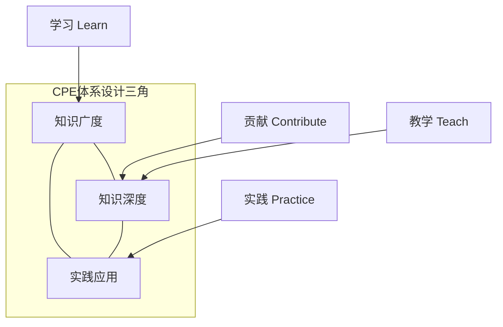
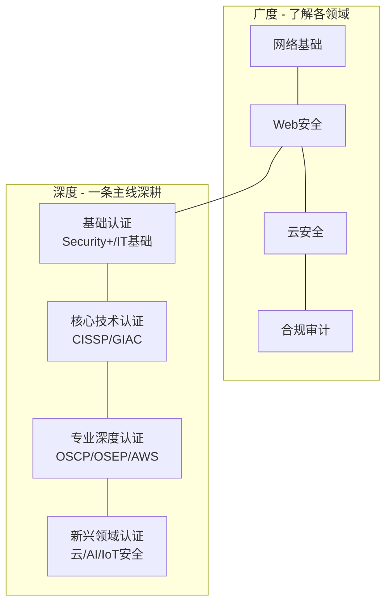
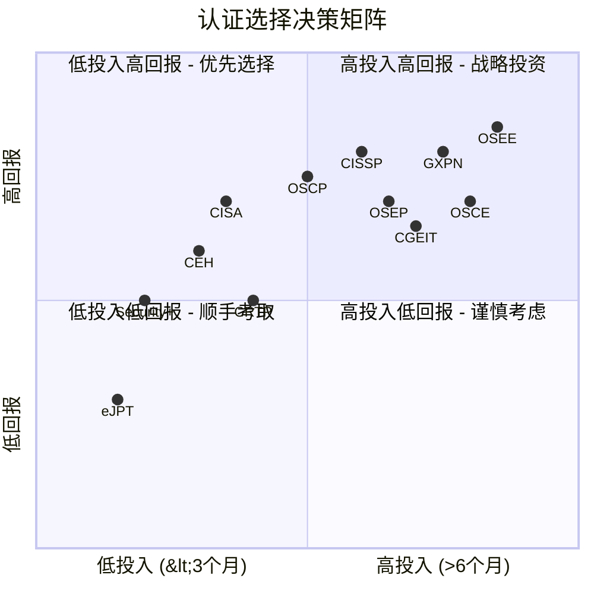
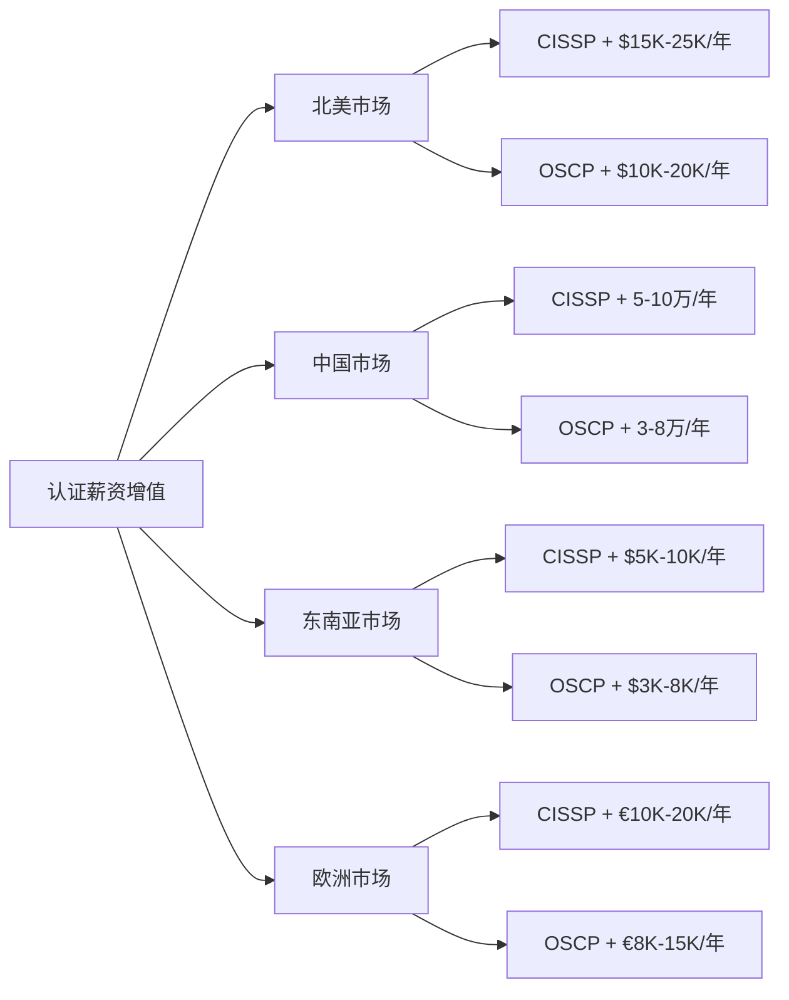
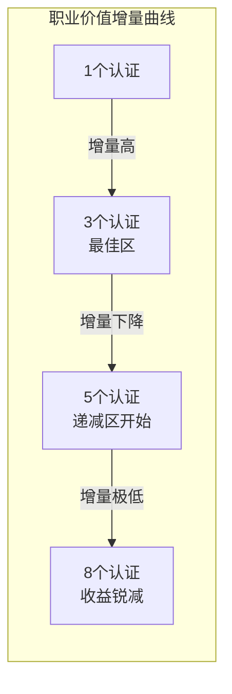
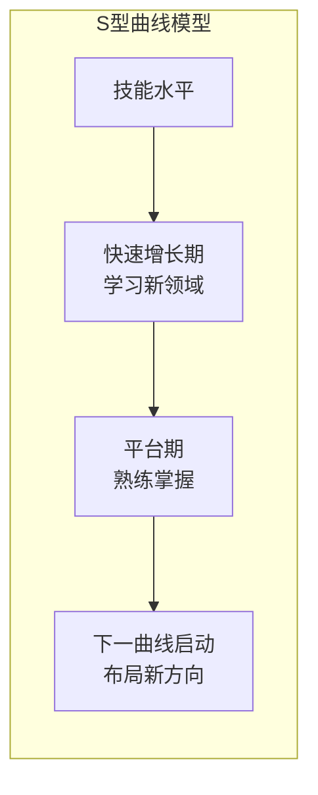
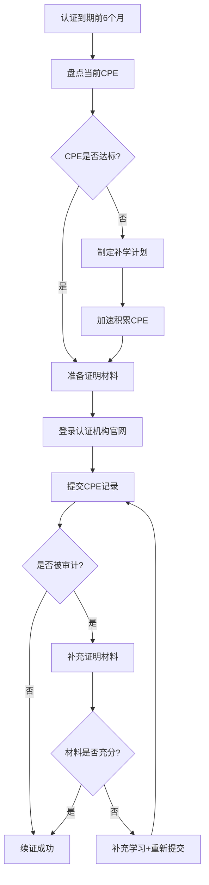

# 28.6 认证续证与持续发展

## 28.6.1 续证机制的设计原理与意义

### 为什么认证需要续证

信息安全领域的技术迭代速度远超其他行业。十年前的前沿技术（如Flash安全、Windows XP加固、传统边界防火墙），如今已基本退出历史舞台。认证机构设计续证机制，绝非为了收取续证费用，而是基于以下三个核心理念：

**知识保鲜（Knowledge Currency）**：认证的价值在于它所代表的知识水平。如果一个人在2015年通过CISSP后从未更新知识，到2025年他掌握的"安全知识"中，关于云安全、AI安全、零信任架构、供应链安全等内容将严重落后于行业实践。CPE制度强制持有者持续接触新知识，确保认证标签始终反映当前行业水准。

**行业公信力（Public Trust）**：雇主、客户和监管机构信任认证，是因为他们相信每个持有者都维持着统一的知识基线。如果没有续证要求，认证体系将不可避免地向"一考永逸"退化，最终失去公信力——这就像医生执照不需要继续教育一样不可想象。

**职业责任（Professional Accountability）**：信息安全从业者手中掌握着组织的数据安全命脉。续证制度要求从业者对自己的专业发展负责，而非在获得认证后停止成长。ISO 27001等标准明确要求"人员能力的持续验证"，这与认证续证的理念一脉相承。

### CPE体系的设计逻辑

CPE（Continuing Professional Education）是续证的核心计量单位。大多数认证机构遵循相似的设计逻辑：



- **学习（Learn）**：通过课程、会议、阅读等吸收新知识——这是基础层
- **贡献（Contribute）**：通过写作、演讲、开源等回馈社区——这是输出层
- **教学（Teach）**：通过授课、指导等深化理解——费曼学习法的实践
- **实践（Practice）**：通过实际工作应用知识——将理论转化为肌肉记忆

这种四维设计确保续证不仅是"凑学分"，而是真正的职业成长。值得注意的是，(ISC)²和ISACA都在近年加强了对"实践"类CPE的审核力度，要求提供更详细的工作证明。

### 续证周期与费用的经济学分析

理解续证的经济学成本有助于做出更明智的职业规划决策：

| 认证 | 续证周期 | 直接费用（3-4年） | 间接成本（时间） | 综合年化成本 |
|------|----------|-------------------|------------------|-------------|
| CISSP | 3年 | $405（$135×3） | ~60小时（学习+CPE记录） | ~$135/年 + 20小时/年 |
| CISA | 3年 | $255（$85×3） | ~50小时 | ~$85/年 + 17小时/年 |
| Security+ | 3年 | $0（无年费） | ~30小时 | 仅时间成本 ~10小时/年 |
| OSCP | 3年 | $240（$80×3） | ~40小时 | ~$80/年 + 13小时/年 |
| GIAC | 4年 | $559（一次性） | ~36小时 | ~$140/年 + 9小时/年 |

**关键洞察**：认证的持有成本不应被低估。以CISSP为例，三年周期内的总成本约为$405年费 + 60小时时间成本（按时薪$80计算为$4800），合计接近$5200。这意味着认证投资是一项需要持续投入的"长期资产"，而非一次性消费品。


## 28.6.2 主流认证续证要求详解

不同的认证机构有着不同的续证周期、CPE要求和提交流程。选择认证前，务必将续证成本纳入考量。

### (ISC)² 续证体系

(ISC)² 旗下认证包括CISSP、SSCP、CCSP、CSSLP等，其续证规则统一但各有细微差别。

| 认证 | 续证周期 | CPE要求 | 年费 | 特殊要求 |
|------|----------|---------|------|----------|
| CISSP | 3年 | 120 CPE | $135/年 | 含20 CPE的职业道德要求 |
| SSCP | 3年 | 90 CPE | $135/年 | 含15 CPE职业道德要求 |
| CCSP | 3年 | 90 CPE | $135/年 | 含15 CPE职业道德要求 |
| CSSLP | 3年 | 90 CPE | $135/年 | 含15 CPE职业道德要求 |

**CPE分类详解**：

| 类别 | 描述 | 上限 | CPE/小时 |
|------|------|------|----------|
| Group A | 安全会议、研讨会、在线研讨会 | 无上限 | 1 CPE/小时 |
| Group B | 培训课程、大学课程、自学（书籍/播客/视频） | 无上限（自学上限40/3年） | 1 CPE/小时 |
| Group C | 教学、演讲、写作（书籍/文章/博客） | 每年最多40 CPE | 1 CPE/小时（备课加倍） |
| Group D | 志愿服务（非营利组织、社区安全） | 每年最多20 CPE | 1 CPE/小时 |
| Group E | 工作经验（日常安全工作） | 每年最多20 CPE | 1 CPE/小时 |
| 职业道德 | 专门的安全职业道德内容 | 至少20 CPE/3年 | 1 CPE/小时 |

**关键规则**：
- 至少20 CPE必须来自职业道德相关活动（CISSP要求，其他认证可能不同）
- 自学（Group B的自学部分）最多40 CPE/3年周期——这意味着你读了100本安全书，最多只能算40 CPE
- 超过3年周期的CPE*不能*结转到下一周期——每周期清零重新计算
- CPE必须在周期内均匀分布——不应全部集中在最后一个月，否则审计时难以解释
- (ISC)²采用"荣誉制度"申报CPE，但保留随机审计权利

### ISACA 续证体系

ISACA 旗下认证包括CISA、CISM、CRISC、CGEIT等：

| 认证 | 续证周期 | CPE要求 | 年费 | 特殊要求 |
|------|----------|---------|------|----------|
| CISA | 3年 | 120 CPE | $85/年 | 至少20 CPE/年 |
| CISM | 3年 | 120 CPE | $85/年 | 至少20 CPE/年 |
| CRISC | 3年 | 120 CPE | $85/年 | 至少20 CPE/年 |
| CGEIT | 3年 | 120 CPE | $85/年 | 至少20 CPE/年 |

ISACA 的CPE有明显不同于(ISC)²的特点：
- 要求*每年*最低20 CPE，不能一年内凑满120——强制均匀分布
- 超过120小时的CPE最多结转入下一周期40小时——有缓冲但不鼓励"囤积"
- 提供CPE审计服务，随机抽取约10%的会员进行核查——审计概率远高于(ISC)²
- ISACA的CPE定义更严格：非安全相关的IT课程通常不被接受

### CompTIA 续证体系

CompTIA 认证（Security+、CySA+、CASP+等）的续证相对简单：

| 认证 | 续证周期 | CPE要求 | 年费 | 替代方式 |
|------|----------|---------|------|----------|
| Security+ | 3年 | 50 CEU | $- | 通过新版考试续证 |
| CySA+ | 3年 | 60 CEU | $- | 通过新版考试续证 |
| CASP+ | 3年 | 75 CEU | $- | 通过新版考试续证 |

**注**：CompTIA使用CEU（Continuing Education Unit）而非CPE，1 CEU ≈ 10小时学习活动。CompTIA的独特优势在于：
- 可以通过参加更高级别的CompTIA考试自动续证低级认证——例如通过CASP+考试会自动续Security+
- 无年费——这在主流认证中是最大的成本优势
- CEU获取途径广泛：除了传统学习，还包括行业经验、开源贡献、出版物等
- 美国国防部DoD 8570/8140指令认可CompTIA认证，使得续证对政府承包商尤为重要

### OffSec 续证体系

OffSec 认证（OSCP、OSEP、OSWE等）采用独特的积分制：

| 认证 | 续证周期 | 积分要求 | 年费 |
|------|----------|---------|------|
| OSCP | 3年 | 100分 | $80/年 |
| OSEP | 3年 | 100分 | $80/年 |
| OSWE | 3年 | 100分 | $80/年 |
| OSED | 3年 | 100分 | $80/年 |
| OSEE | 3年 | 100分 | $80/年 |

积分获取方式：

| 活动 | 积分 | 说明 |
|------|------|------|
| 完成OffSec新课程 | 40分/课程 | 每门课限一次 |
| 通过新考试 | 60分/次 | 包括OSWA、OSDA等附加认证 |
| 撰写技术博客（英文） | 5分/篇 | 每年最多20分，需OffSec审核 |
| 撰写技术博客（其他语言） | 3分/篇 | 每年最多12分 |
| CTF获奖 | 15-25分 | 取决于赛事级别 |
| 公开演讲 | 5-10分/次 | 需提前申请 |
| 安全工具/脚本提交 | 5-10分/次 | 开源项目贡献 |

**OffSec续证的关键差异**：
- 不接收工作经验作为CPE——OffSec坚持必须通过持续学习和实践维持技术水平，这是其"实用主义"理念的体现
- 博客内容必须经OffSec审核通过，确保技术质量——审核周期通常为2-4周
- CTF成绩需要提供排名截图和官方结果链接——不能仅凭自我声明
- 每个博客/演讲/工具提交都有"冷却期"，不能在短时间内大量堆叠

### SANS GIAC 续证体系

GIAC认证（GPEN、GXPN、GCIA等）：

| 认证 | 续证周期 | CPE要求 | 年费 |
|------|----------|---------|------|
| GIAC认证 | 4年 | 36 CPE | $559/4年（含1次重考） |

**续证选择**：
1. **积累CPE**：36 CPE + $559——最常见的方式
2. **重考**：参加最新版考试（如果及格，自动续证4年，费用包含在$559中）——适合希望更新知识的人
3. **升级认证**：参加更高版本的考试——例如从GPEN升级到GXPN

GIAC的CPE要求相对宽松（36 CPE/4年），但单次费用较高（$559）。这种设计鼓励持有者通过重考而非"凑学分"来维持认证，与OffSec的理念类似但执行方式不同。

### EC-Council 续证体系

EC-Council（CEH、CHFI等）的续证：

| 认证 | 续证周期 | CPE要求 | 年费 |
|------|----------|---------|------|
| CEH | 3年 | 120 CPE | $80/年 |
| CEH Master | 3年 | 120 CPE | $80/年 |
| CHFI | 3年 | 120 CPE | $80/年 |

EC-Council的特殊之处：
- 可以通过"EC-Council官方培训"获取CPE，折扣力度较大
- CEH续证可以通过参加ECCTLP（EC-Council Certified Trainer）培训获取大量CPE
- 在美国DoD 8570指令中，CEH是被认可的认证之一

### 各体系横向对比

| 维度 | (ISC)² | ISACA | CompTIA | OffSec | GIAC |
|------|--------|-------|---------|--------|------|
| 续证难度 | ★★★☆ | ★★★★ | ★★☆☆ | ★★★☆ | ★★☆☆ |
| 年化成本 | $135 | $85 | $0 | $80 | ~$140 |
| 审计概率 | 低 | 高(10%) | 低 | 中 | 低 |
| CPE灵活度 | 高 | 中 | 高 | 低 | 高 |
| 结转规则 | 不可 | 最多40h | — | — | — |
| 重考续证 | 不可 | 不可 | 可以 | — | 可以 |


## 28.6.3 CPE学分获取实操指南

### 高性价比CPE获取策略

不是所有CPE的获取难度都一样。以下是一个按投入产出比排序的策略矩阵：

| 优先级 | 活动类型 | 投入时间 | CPE产出 | 额外收益 | 难度 |
|--------|----------|----------|---------|----------|------|
| ★★★★★ | 从业日常工作 | 工作时间内 | 1 CPE/小时 | 无额外投入 | 极低 |
| ★★★★☆ | 观看在线研讨会 | 1小时 | 1 CPE | 了解新技术 | 低 |
| ★★★★☆ | 安全播客/视频 | 通勤/健身时间 | 1 CPE/小时 | 碎片时间利用 | 极低 |
| ★★★☆☆ | 参加行业会议 | 1-3天 | 8-24 CPE | 人脉+前沿趋势 | 中 |
| ★★★☆☆ | 技术写作 | 10-20小时/篇 | 5-10 CPE | 个人品牌+简历亮点 | 高 |
| ★★★☆☆ | 安全会议演讲 | 40-80小时准备 | 10-20 CPE | 行业影响力+人脉 | 极高 |
| ★★☆☆☆ | 大学课程 | 45+小时/学期 | 45+ CPE | 学历提升 | 高 |
| ★☆☆☆☆ | CTF比赛 | 8-48小时 | 15-25分 | 实战能力 | 高 |

**核心原则**：优先利用"零增量成本"的CPE来源（日常工作、碎片时间学习），再逐步扩展到高投入高回报的活动（会议演讲、技术写作）。大多数持证者仅靠日常工作+在线研讨会+播客，就能满足大部分CPE需求。

### 具体操作手册

**利用日常工作获取CPE**（适合绝大多数从业者）：

1. **文档安全活动**：每周记录参与的安全项目（审计、渗透测试、安全架构评审），按小时计入Group E
2. **内部培训**：在公司内部做安全分享，可同时算入教学（Group C）和志愿服务（Group D）
3. **安全工具评估**：评估新安全工具的工作时长可计为Group B或Group E
4. **安全事件响应**：参与安全事件处理，记录处理时长和学到的新知识
5. **合规审计参与**：参与SOC 2、ISO 27001等合规审计的准备工作

**实操模板 - 月度CPE跟踪表**：

```yaml
月份: 2026年7月
认证周期: 2024.01 - 2026.12
本月CPE累计:
  - 日期: 2026-07-03
    活动: 参与内部渗透测试项目（Web应用安全评估）
    类别: Group E（工作经验）
    CPE: 6
    证明材料: 项目报告编号#PT-2026-07-03
  - 日期: 2026-07-10
    活动: 观看Black Hat 2026演讲录像《AI Security Challenges》
    类别: Group B（自学）
    CPE: 1.5
    证明材料: 视频URL + 学习笔记
  - 日期: 2026-07-17
    活动: 撰写技术博客《零信任网络分段实践指南》
    类别: Group C（写作）
    CPE: 3
    证明材料: 博客URL + 发布日期截图
  - 日期: 2026-07-24
    活动: 内部分享《OWASP Top 10 2026更新解读》
    类别: Group C（教学）+ Group D（志愿服务）
    CPE: 3
    证明材料: PPT讲义 + 参会签到表
本月合计: 13.5 CPE
周期累计: 87/120 CPE（剩余: 33 CPE, 剩余月: 6）
进度健康度: ✅ 按计划推进（建议线性进度: 62%）
```

**安全会议的CPE策略**：

参加一次大型会议（如Black Hat、DefCon、RSA Conference）通常可获得12-24 CPE。但如果无法亲临现场，很多会议提供以下替代方案：

| 大型会议 | 线下CPE | 线上直播 | 录播回看 | 费用 |
|----------|---------|----------|----------|------|
| Black Hat USA | 24 CPE（4天） | 24 CPE（同价） | 部分免费 | $2000-$4000 |
| RSA Conference | 24 CPE（4天） | 24 CPE | 部分免费 | $1500-$3000 |
| DEF CON | 不提供CPE证书 | — | 免费 | $300 |
| SANS本地培训 | 24-36 CPE | 24-36 CPE | 不适用 | $5000-$7000 |
| 本地BSides会议 | 6-12 CPE | 通常没有 | 部分免费 | $20-$100 |
| 线上安全峰会 | 8-16 CPE | 8-16 CPE | 部分免费 | $0-$500 |

**注**：DEF CON虽然不提供官方CPE证明，但(ISC)²允许自行记录。参加DEF CON讲座并做笔记，仍可作为Group B（自学）申报CPE。关键是保留详细的学习笔记作为证明。

**高性价比会议推荐（按地区）**：

| 地区 | 会议 | 费用 | 特点 |
|------|------|------|------|
| 北美 | BSides系列（Las Vegas、DC等） | $20-$100 | 社区驱动，质量高，性价比极高 |
| 欧洲 | CCC（混沌通信大会） | €120 | 深度技术，黑客文化 |
| 亚太 | 云安全联盟CSA峰会 | ¥2000-$500 | 云安全专业，国内可参加 |
| 线上 | SANS webcasts | 免费 | 每月多场，直接获取CPE |
| 全球 | HackerOne黑客学院 | 免费 | 在线学习+bug bounty实践 |

### 高效自学CPE

自学是最灵活的CPE获取方式，但容易被低估。有效的自学CPE管理方法：

**书籍阅读**：
- 阅读安全类技术书籍，每1小时阅读时间 = 1 CPE
- 建议做好阅读笔记，以备审计时使用——记录书名、作者、阅读日期、阅读时长、关键收获
- 阅读清单建议覆盖不同方向：Web安全、密码学、云安全、安全架构等
- 经典推荐：The Web Application Hacker's Handbook、Red Team Field Manual、Applied Cryptography、Security Engineering、The Art of Invisibility

**安全播客/视频**（可在通勤时间完成）：

| 播客名称 | 时长 | 风格 | 推荐人群 |
|----------|------|------|----------|
| Darknet Diaries | 30-60分钟/期 | 故事型 | 所有人 |
| Risky Business | 40-60分钟/期 | 新闻分析 | 安全从业者 |
| Security Now | 2小时/期 | 技术深度 | 技术工程师 |
| SANS ISC Stormcast | 5-10分钟/期 | 每日新闻 | 所有人 |
| 安全内参 | 文字版 | 中文新闻 | 国内从业者 |
| 知道创宇404实验室 | 30-45分钟/期 | 中文技术 | 国内安全工程师 |
| 安全客播客 | 20-40分钟/期 | 中文安全 | 国内从业者 |

**公开课平台对比**：

| 平台 | CPE支持 | 年度费用 | 课程质量 | 语言 |
|------|---------|----------|----------|------|
| SANS OnDemand | ✅ 官方认可 | $6000+ | 极高 | 英文 |
| Cybrary | ✅ 支持CPE报告 | 免费/$299/年 | 高 | 英文 |
| Pluralsight | ✅ 支持CPE报告 | $299/年 | 高 | 英文 |
| Coursera | ✅ 可申请 | $49/月+ | 高 | 多语言 |
| Udemy | 需自行记录 | $10-$50/课 | 中-高 | 多语言 |
| 中国大学MOOC | 需自行申请 | 免费/低 | 中-高 | 中文 |
| 安全客/FreeBuf | 需自行记录 | 免费 | 中 | 中文 |

**中文安全学习资源特别推荐**：
- 合天网安实验室：提供在线渗透实验，实验时长可计为CPE
- 看雪学院：高质量中文安全课程，部分提供结业证书
- 先知社区：技术文章和讨论，阅读时间可计为CPE
- 360安全客：免费技术文章和视频

### CPE获取的时间管理技巧

将CPE融入日常工作和生活的关键在于"系统化"而非"突击化"：

**碎片时间利用策略**：
- 通勤时间（30-60分钟/天）→ 播客/有声书 → 每月约15-25 CPE
- 午休时间（30分钟/天）→ 在线研讨会录播 → 每月约10-15 CPE
- 睡前阅读（30分钟/天）→ 安全技术书籍 → 每月约15 CPE
- 周末时间（2-4小时/周）→ 深度学习/技术写作 → 每月约8-16 CPE

**关键提醒**：(ISC)²要求CPE记录必须包含日期、时长和学习内容摘要，因此建议每次学习后立即记录，而非月底回忆。


## 28.6.4 认证组合的高阶策略

### 认证组合的设计原则

认证组合不是把所有的证都考一遍，而是基于职业目标进行战略性选择。以下是认证组合设计的五个核心原则：

**原则一：深度+广度（T型策略）**



**原则二：互补而非重叠**
- ❌ 错误：CISSP + SSCP（SSCP完全被CISSP覆盖，SSCP是CISSP的子集）
- ✅ 正确：CISSP + CCSP（覆盖管理+云安全，互补性强）
- ❌ 错误：OSCP + eJPT + CEH（三个入门渗透测试认证重叠）
- ✅ 正确：OSCP + OSEP（递进关系，由浅入深）

**原则三：厂商中立+厂商特定互补**
```text
厂商中立认证（通用基础）        厂商特定认证（深度技能）
CISSP（安全管理框架）      +   AWS Security / Azure Security / GCP Security
OSCP（渗透测试基础）        +   CRTO（红队实操）/ Kali Linux专家
CISA（审计基础）            +   Splunk / QRadar / CrowdStrike
```

**原则四：考虑续证协同效应**
有些认证之间可以共享CPE：
- (ISC)²的所有认证CPE互通——如果你持有CISSP和CCSP，一份CPE可以同时满足两个认证
- ISACA的认证CPE大部分互通，但需要总CPE量满足最高认证
- CompTIA的高级考试可以自动续低级认证
- 同一机构内的多认证共享CPE是降低续证成本的关键策略

**原则五：避免over-certification（过度认证）**
一个常见的错误是：在职业生涯早期就积累了7-8个认证，但每个都只有表面水平。更好的策略是：

```text
职业初期（0-3年）：1-2个核心认证 + 深度掌握
  → Security+ + 一个方向性认证（OSCP/CISA/eJPT）
  → 重点：建立安全知识框架 + 实操能力

职业中期（3-8年）：3-5个互补认证 + T型发展
  → CISSP + 1-2个专业认证 + 1个厂商认证
  → 重点：构建差异化竞争力 + 行业人脉

职业成熟期（8年+）：5-8个认证 + 领域权威
  → CISSP + 高级专业认证 + 新兴领域认证
  → 重点：行业影响力 + 知识传承
```

### 按目标方向的认证组合

**渗透测试/红队方向**：

```text
入门：eJPT → Security+
初级：OSCP（必考，行业标杆）
中级：OSEP（高级逃逸）+ CRTO（红队实操）
高级：OSEE（漏洞利用专家）+ GXPN（高级渗透）
专家：OSCE3（OffSec综合认证）
```

**安全管理/治理方向**：

```text
入门：Security+ → SSCP
中级：CISSP（必考，管理方向标配）
高级：CISM（ISACA管理认证）+ CGEIT（治理）
专家：CISA（审计）+ ISO 27001 LA（审计师）
```

**云安全方向**：

```text
入门：Security+ → AWS Cloud Practitioner
中级：CCSP（ISC云安全）+ AWS Security Specialty
高级：Azure Security Engineer + GCP Security Engineer
专家：云安全架构师（需多云经验+CCSP）
```

**数据安全方向**：

```text
入门：CompTIA Security+ → CDPSE（数据隐私认证）
中级：CISSP → CIPP（信息隐私认证，分区域：CIPP/E欧洲、CIPP/US美国、CIPP/A亚洲）
高级：CIPM（隐私管理）+ 数据安全专家（GDPR/PIPL专项）
专家：DPO认证 + 行业合规专家
```

**AI安全方向**（2025-2026新兴领域）：

```text
入门：AI安全基础培训 → Security+
中级：CISSP → AI安全专项培训
高级：AI红队评估认证 → 模型安全研究
专家：参与AI安全标准制定（NIST AI RMF、EU AI Act相关）
```

**注**：AI安全认证目前尚无统一的国际标准，建议关注以下来源：
- IAPP的AI治理认证（AIGP）——已正式推出
- SANS的AI安全课程（有多门相关课程，可能推出专门认证）
- NIST AI风险管理框架学习证书——免费在线学习
- OWASP AI Exchange——开源社区贡献机会

### 认证投入产出分析模型

在选择下一张认证时，建议使用以下决策矩阵：



**注**：CEH在某些国家政府部门和军事合同中具有特别价值（如美国DoD 8570指令认可），但这不代表它在所有市场都有高回报。选择认证时，务必结合自身职业目标和目标市场来评估。


## 28.6.5 CPE/CEU管理最佳实践

### CPE管理的致命陷阱

以下是实际工作中最常见的CPE管理失败案例：

**陷阱一：最后一刻突击**
> 张工在CISSP三年周期的最后一个月，发现还需要50个CPE。他疯狂刷课，结果：(1) 很多学习浮于表面，没有真正吸收；(2) 提交的CPE记录粗糙，被随机审计抽中后需要提供详细证明；(3) 险些未能按时完成续证。

**对策**：每季度检查一次CPE进度，用以下公式计算健康度：

```text
进度健康度 = 已获得CPE / (周期总CPE × 已过月数/总月数) × 100%
健康标准：>80% = 良好，60-80% = 需加紧，<60% = 危险

示例：
已过18个月（总36个月的50%），需要120 CPE
目标进度 = 120 × 50% = 60 CPE
实际获得54 CPE → 健康度 = 54/60 = 90% ✅ 良好
实际获得42 CPE → 健康度 = 42/60 = 70% ⚠️ 需加紧
实际获得30 CPE → 健康度 = 30/60 = 50% 🔴 危险
```

**陷阱二：忽视职业道德CPE**
> (ISC)²要求CISSP持有者在3年周期内至少有20个CPE来自职业道德内容。很多人在最后才发现这一点，但职业道德相关的学习资源远少于技术内容。

**对策**：
- 每年至少在职业道德方面积累7个CPE，确保3年周期内达到21+（留1个安全余量）
- 建议资源：(ISC)²官方职业道德视频、IAPP隐私课程、公司合规培训、法律/道德相关安全课程
- 参加一次1小时的(ISC)²官方职业道德在线研讨会 = 1 CPE
- 阅读《(ISC)² Code of Ethics》并做学习笔记 = 可申报1 CPE
- 关注GDPR/CCPA/PIPL等隐私法规更新，相关学习均可计入职业道德CPE

**陷阱三：高估自学CPE**
> (ISC)²对自学CPE有严格限制——每个周期最多40 CPE。这意味着即使你读了一百本书，最多只能算40 CPE。

**对策**：多元化CPE来源，不要把鸡蛋放在一个篮子里。一个健康的CPE组合应该是：
- Group A（会议/研讨会）：30-40 CPE
- Group B（培训/自学）：30-40 CPE（含40 CPE自学上限）
- Group C（教学/写作）：10-20 CPE
- Group D（志愿服务）：5-10 CPE
- Group E（工作经验）：10-20 CPE
- 职业道德：20+ CPE

**陷阱四：忽视审计风险**
> ISACA每年随机审计10%的会员。李工提交了所有CPE，但被审计后发现：(1) 两年前某次会议没有保留门票/签到记录；(2) 在线课程证书没有下载。最终判定这两项CPE无效，差2个CPE未能续证。

**对策**：为每项CPE活动保留完整的证明材料。具体做法见下文"CPE文档保存规范"。

**陷阱五：跨认证CPE计算错误**
> 王工同时持有CISSP和CCSP，以为两者的CPE是独立计算的，分别记录了120 CPE。实际上(ISC)²的CPE互通——同一批CPE可以同时满足两个认证，但他浪费了双倍的时间。

**对策**：了解(ISC)²的CPE互通规则——同一组CPE可以同时提交给多个(ISC)²认证。ISACA同理。提前规划可以大幅减少工作量。

**陷阱六：认证过期后才想起续证**
> 赵工的CISSP在2025年12月31日到期，他直到2026年1月才发现。虽然有90天宽限期，但需要额外支付$50的延期费，且如果宽限期内仍未完成，认证将被撤销，需要重新考试。

**对策**：在日历中设置多重提醒——到期前6个月、3个月、1个月、1周。宽限期政策因认证而异：(ISC)²宽限期90天（需支付$50延期费），ISACA宽限期60天。

### CPE文档保存规范

| CPE类型 | 必备证明材料 | 保存期限 | 最佳实践 |
|---------|-------------|----------|----------|
| 安全会议 | 参会证、门票收据、日程表 | 周期结束后2年 | 拍照+扫描存档 |
| 在线课程 | 结业证书、课程大纲、学习时长 | 周期结束后2年 | PDF下载到本地 |
| 技术写作 | 发表链接、发表日期、字数证明 | 周期结束后2年 | 截图存档+PDF保存 |
| 教学演讲 | 邀请函、PPT/讲义、照片 | 周期结束后2年 | 录视频备份 |
| 志愿服务 | 服务证明信、联系人信息 | 周期结束后2年 | 邮件确认+正式信件 |
| 工作经验 | 工作记录、上司确认 | 周期结束后2年 | 简单日志+月度汇总 |
| 自学 | 学习笔记、阅读记录 | 周期结束后2年 | 笔记工具（Notion/Obsidian）+截图 |

**审计应对经验**：
- (ISC)²审计时会要求你提供CPE活动的"证据链"——不仅要证明你参加过，还要证明学到了什么
- 建议每次CPE活动后写一段50-100字的学习摘要，审计时可直接使用
- 如果被抽中审计，响应时间通常为30天，建议提前准备好所有材料

### 数字化转型：CPE管理工具详解

除了官方工具，以下第三方工具可显著提高CPE管理效率：

| 工具 | 平台 | 费用 | 特点 |
|------|------|------|------|
| CPE Tracker Pro（第三方） | Web/iOS/Android | $9.99/年 | 多认证统一管理，自动提醒 |
| Notion CPE模板（免费） | Web | 免费 | 高度可定制，适合技术用户 |
| Excel云端模板 | 任何平台 | 免费 | 简单可靠，适合低频率用户 |
| Accreditator | Web | $49/年 | 企业级CPE管理，支持团队 |
| 飞书多维表格 | Web/移动端 | 免费 | 国内用户友好，支持自动化 |

**推荐方案**：使用Notion或飞书搭建自己的CPE管理系统，结合云端备份和自动提醒功能。以下是Notion模板的最小字段建议：

```text
CPE记录字段模板：
├── 活动名称（必填）
├── 日期（必填）
├── CPE数量（必填）
├── 认证目标（下拉：CISSP/CISA/OSCP…）
├── CPE类别（下拉：A/B/C/D/E）
├── 证明材料链接（文件上传/链接）
├── 审核状态（下拉：待审核/已确认）
└── 备注（记录学习心得，审计时可用）
```

### CPE规划工作表

```text
┌─────────────────────────────────────────────────────────────────┐
│                 三年CPE规划工作表（CISSP示例）                  │
├──────────────┬────────┬────────┬────────┬────────────────────────┤
│ CPE来源       │ 第一年 │ 第二年 │ 第三年 │ 备注                   │
├──────────────┼────────┼────────┼────────┼────────────────────────┤
│ 日常工作      │ 20     │ 20     │ 20     │ 每月记录约2 CPE        │
│ 在线研讨会    │ 8      │ 8      │ 8      │ 每月看1-2个免费研讨会   │
│ 行业会议      │ 12     │ 0      │ 12     │ 隔年参加一次大型会议    │
│ 自学（播客/书）│ 12     │ 13     │ 15     │ 上限40，注意分布       │
│ 技术写作      │ 0      │ 10     │ 0      │ 写2-3篇技术文章         │
│ 教学与分享    │ 4      │ 4      │ 4      │ 内部分享每月/季度       │
│ 职业道德CPE   │ 8      │ 4      │ 8      │ 至少20，分布在前后      │
├──────────────┼────────┼────────┼────────┼────────────────────────┤
│ 年度合计      │ 64     │ 59     │ 67     │                        │
│ 周期总计      │        │ 190    │        │ 目标120，有安全余量     │
└──────────────┴────────┴────────┴────────┴────────────────────────┘
```

**规划要点**：
- 第一年偏重基础积累（日常工作+在线学习）
- 第二年偏重输出（技术写作+教学分享）
- 第三年查漏补缺（确保职业道德CPE达标+总CPE超额完成）
- 每年都保持职业道德CPE的稳定输入，避免最后突击


## 28.6.6 职业发展路径的深度拓展

### 薪资谈判与认证价值

认证在薪资谈判中的价值取决于市场供需：

**地域差异因素**：



**注**：这些数字是市场参考值，实际薪资受企业规模、行业、城市、个人经验等多因素影响。认证是加成因素，不是替代因素——一个没有实际经验的认证持有者，薪资溢价会大幅缩水。

**认证在不同行业的价值差异**：

| 行业 | 最高认证溢价 | 核心认证 | 说明 |
|------|-------------|----------|------|
| 金融/银行 | +30-50% | CISSP, CISA, CISM | 合规要求高，认证是硬性门槛 |
| 科技公司 | +15-30% | OSCP, CISSP, AWS | 实操能力优先，认证是加分项 |
| 政府/军工 | +20-40% | CISSP, CEH, Security+ | DoD 8570/8140等合规要求 |
| 咨询公司 | +20-35% | CISSP, CISA, CISM | 认证是客户信任的基础 |
| 传统制造 | +10-25% | Security+, CISA | 信息安全管理刚起步 |

### 跨领域转型路径

**从开发转安全（适合有3年以上开发经验的工程师）**：

```text
Phase 1（0-6个月）：建立安全基础认知
├── 学习：OWASP Top 10、安全开发生命周期（SDL）、SAST/DAST
├── 认证：Security+（建立安全通用知识框架）
├── 实践：在现有工作中应用SAST/DAST工具
├── 社区：加入OWASP本地分会，参加安全meetup
└── 里程碑：能独立完成一个Web应用的安全审计

Phase 2（6-18个月）：深入应用安全
├── 学习：Web安全深入（Burp Suite、代码审计）、API安全
├── 认证：CISSP（或OSCP，取决于方向偏好）
├── 实践：参与公司安全评审、漏洞修复、安全代码审查
├── 输出：撰写安全技术博客，建立个人品牌
└── 里程碑：能独立设计安全架构方案

Phase 3（18-36个月）：明确专业方向
├── 方向A：应用安全架构师 → CSSLP + 安全架构经验
├── 方向B：渗透测试/红队 → OSCP → OSEP → OSWE
├── 方向C：安全开发运维（DevSecOps） → CCSP + DevSecOps实践
└── 里程碑：在目标方向具备独立工作能力
```

**从运维转安全（适合系统/网络运维人员）**：

```text
Phase 1（0-6个月）：
├── 学习：安全基础、防火墙、入侵检测、日志分析
├── 认证：Network+ → Security+
├── 实践：在运维工作中加入安全加固实践
├── 工具：学习SIEM（Splunk/ELK）、IDS/IPS
└── 里程碑：能独立配置和调优安全设备

Phase 2（6-18个月）：
├── 学习：SOC运营、安全架构、合规审计、应急响应
├── 认证：CISSP（系统性的安全知识梳理）
├── 实践：参与安全运维、事件响应演练
├── 输出：建立安全运营文档体系
└── 里程碑：能主导安全事件响应

Phase 3（18-36个月）：
├── 方向A：安全运维工程师 → GCIA（网络分析）+ SIEM专家
├── 方向B：安全架构师 → CCSP/AWS Security + 架构设计
├── 方向C：合规与风险管理 → CISA/CISM + 合规审计
└── 里程碑：在目标方向成为团队核心成员
```

**从网络工程转安全（适合CCNA/CCNP持证者）**：

```text
Phase 1（0-6个月）：
├── 学习：网络安全攻防基础、防火墙高级配置
├── 认证：Security+ → CEH（利用网络基础优势）
├── 实践：网络流量分析、入侵检测
└── 优势：网络协议知识是天然优势

Phase 2（6-18个月）：
├── 学习：网络渗透、无线安全、云网络安全
├── 认证：OSCP（利用网络基础快速上手）→ GCIA
├── 实践：网络层面的渗透测试和防御
└── 方向：网络取证、云网络安全架构
```

### 认证的边际递减效应

理解认证的"边际递减效应"对规划职业发展至关重要：



**经济学解读**：
- 前两个认证：建立职业门槛和基础知识，增量最高
- 3-5个认证：构建差异化竞争力，增量较高
- 5-8个认证：已经开始进入递减区，需要精挑细选
- 8个以上：每多一个认证的时间成本远高于收益

**核心建议**：把花在第八个认证上的时间，投入到人脉建设、开源项目、技术博客或管理能力提升上，收益通常更高。根据LinkedIn数据，安全领域薪资最高的专业人士平均持有3-5个认证，而非8-10个。


## 28.6.7 持续发展的长期策略

### 技术发展的S型曲线模型

安全技术的发展遵循S型曲线，一个专业的从业者在多个S型曲线上持续学习：



**战略启示**：
1. 在第一曲线的上升期（获得认证后1-3年）积累实践经验
2. 在平台期到来前（约3-5年），开始布局第二曲线
3. 第二曲线应在第一曲线仍在增长时就启动，而非等到衰退
4. 当前值得布局的第二曲线：AI安全、云原生安全、供应链安全、量子安全

### 持续学习的系统化方法

**每年学习计划模板**：

```text
2026年个人发展计划
├── 核心目标：获取CISSP认证 + 云安全入门
│
├── Q1（1-3月）：基础建设
│   ├── 完成CISSP官方学习指南通读
│   ├── 每周5小时学习（工作日1小时/天）
│   └── 输出：知识脑图x8
│
├── Q2（4-6月）：备考冲刺
│   ├── 参加CISSP考前冲刺班
│   ├── 完成1500道模拟题（正确率>85%）
│   └── 输出：错题本x1 + 考试通过
│
├── Q3（7-9月）：深度方向+CPE积累
│   ├── 参加Black Hat线上会议 → 8 CPE
│   ├── 开始AWS Security课程 → 6 CPE
│   ├── 写2篇技术博客 → 6 CPE
│   └── 输出：博客文章x2
│
└── Q4（10-12月）：总结+规划
    ├── 全年CPE统计：确保>40 CPE
    ├── 复盘：哪些学习有效？哪些方向需要调整？
    └── 输出：2027年发展计划
```

### 为高级从业者的进阶建议

对于已经持有CISSP 5年以上、具备丰富经验的从业者，认证只是职业发展的一个维度。高级阶段的持续发展应更关注：

**从"学什么"到"教什么"**：
- 在行业会议上做演讲（不仅是参加）——Black Hat、DEF CON、国内安全会议都接受投稿
- 在职培训机构担任讲师——SANS、看雪学院等机构需要有经验的讲师
- 撰写安全方向的技术书籍或专栏——出版社和安全媒体都需要高质量内容
- 在CTF比赛中担任出题人——锻炼对攻防技术的深度理解
- 参与开源安全项目维护——在GitHub上维护有影响力的工具

**从"技术深度"到"技术广度+商业敏锐度"**：
- 学习CISO视角的预算管理、风险量化——了解FAIR风险分析框架
- 了解安全对于营收、合规、品牌的影响——能用商业语言解释安全投资回报
- 掌握向高管层汇报安全风险的语言——学会用"风险"而非"漏洞"来沟通
- 建立跨部门协作能力——安全不只是技术部门的事

**从"跟随认证"到"创造认证"**：
- 参与认证机构的考试大纲修订——(ISC)²、ISACA都接受社区反馈
- 在标准化组织（如IETF、NIST、ISO）中贡献——参与安全标准制定
- 建设内部培训体系和认证标准——为企业定制安全能力模型
- 参与安全社区建设——组织BSides、DEF CON Group等本地活动

**从"个人贡献者"到"团队领导者"**：
- 培养和指导初级安全工程师——建立安全团队的梯队建设
- 建立安全度量体系——用数据驱动安全决策
- 推动安全文化建设——让安全融入组织的每个环节


## 28.6.8 认证续证的完整工作流

### 续证提交的标准流程



### 各认证机构的在线续证操作

**CISSP续证（ISC/ISSAC Portal）**：
1. 登录 https://www.isc2.org/
2. 进入 "Continuing Education" → "Submit CPE"
3. 选择认证类型（CISSP/CCSP等）
4. 逐条录入CPE活动（日期、类型、CPE数量、描述）
5. 上传证明材料（支持PDF、图片、链接）
6. 支付年费 $135
7. 确认提交——系统会自动检查CPE是否达标

**CISA续证（ISACA Portal）**：
1. 登录 https://www.isaca.org/
2. 进入 "Certification" → "CPE Management"
3. 录入CPE记录——ISACA要求更详细的描述
4. 注意：ISACA会检查CPE是否符合"信息安全相关"要求
5. 支付年费 $85
6. ISACA保留审计权利——提交后可能被抽中核查

**Security+续证（CompTIA Portal）**：
1. 登录 https://www.comptia.org/
2. 进入 "Certifications" → "Renew"
3. 选择续证方式：CEU积累 或 更高级别考试
4. 如果选CEU：上传学习记录和证书
5. 支付续证费（如果适用）
6. 系统自动验证并更新认证状态

### 续证常见问题解答

| 问题 | 答案 |
|------|------|
| 认证过期了还能续证吗？ | 大多数认证有90天宽限期（(ISC)²），部分需要重新考试 |
| 多个认证可以共享CPE吗？ | (ISC)²内认证可以共享；ISACA内认证大部分可以；跨机构不可以 |
| CPE记录需要提前准备吗？ | 强烈建议！审计时需要立即提供证明材料 |
| 在线课程的CPE怎么证明？ | 下载结业证书，记录课程URL和学习时长 |
| 工作经验可以算CPE吗？ | (ISC)²的Group E支持，ISACA不支持工作经验CPE |
| 被审计了怎么办？ | 30天内提交证明材料，保持冷静，按要求提供即可 |


## 28.6.9 本节小结

认证续证和持续发展是安全职业生涯的长期课题，而非一次性任务：

1. **CPE管理是基本功**：理解每个认证的CPE规则，建立季度检查机制，多元化的CPE来源
2. **认证组合要战略性布局**：T型发展、互补而非重叠、协同效应最大化
3. **持续发展是系统工程**：S型曲线理论指导方向选择，年度计划系统化执行
4. **高阶阶段超越认证本身**：从"学什么"到"教什么"，从技术深度到商业敏锐度
5. **续证是可预测的成本**：将年费和时间成本纳入职业规划，避免财务和时间上的被动

**行动清单**：
- [ ] 检查所有已持有认证的到期日期
- [ ] 建立CPE跟踪系统（推荐Notion/飞书模板）
- [ ] 制定本年度的学习+CPE计划
- [ ] 评估下一个认证的目标和时间节点
- [ ] 考虑加入安全社区（如OWASP本地分会、DEFCON Group）
- [ ] 在日历中设定每季度的CPE健康度检查提醒
- [ ] 评估当前认证组合的互补性和续证协同效应
- [ ] 识别自己的S型曲线位置，规划下一步发展方向

---

> **本章关联阅读**：
> - [理论基础：认证的价值分析](../理论基础/02-282认证的价值分析.md)
> - [核心技巧：时间管理技巧](08-283时间管理技巧.md)
> - [实战案例：从零到CISSP的安全管理之路](../实战案例/01-281案例一从零到CISSP的安全管理之路.md)
