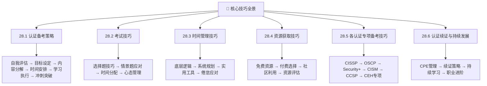
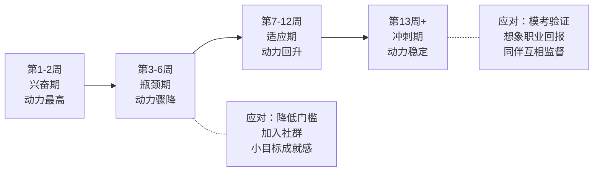
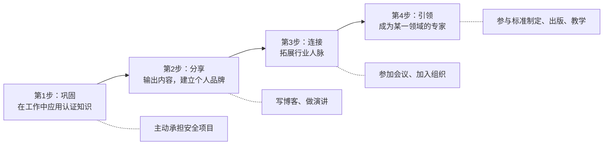
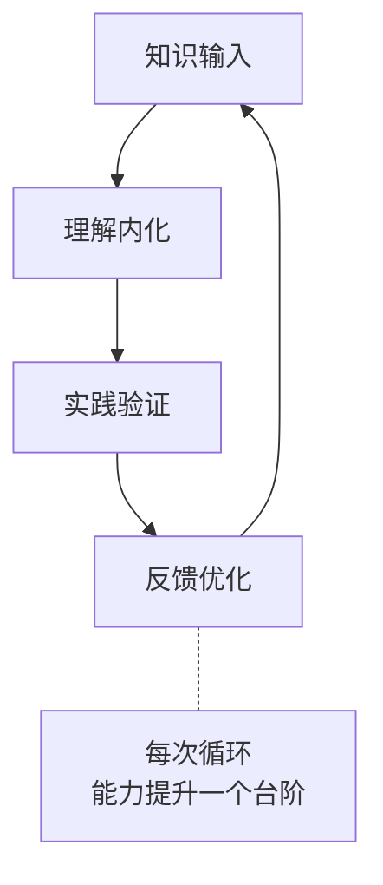

## 28.7 本节小结

本节围绕"核心技巧"这一核心主题，系统性地覆盖了认证备考从策略制定到持续发展的完整方法论体系。从自我评估、学习计划制定、考试技巧、时间管理、资源获取，到各认证的专项备考方法，再到认证续证与长期职业发展——12个小节共同构成了一套"道-法-术-器"四位一体的备考操作系统。以下是对本节全部内容的结构化回顾、核心要点提炼、以及面向不同读者群体的行动指南。

---

## 一、内容回顾：核心技巧的全景地图

在进入具体要点之前，先用一张全景图回顾本节的完整知识架构：



每个模块都不是孤立的知识碎片，而是相互支撑、层层递进的有机整体。备考策略是"方向盘"，考试技巧是"加速器"，时间管理是"油门"，资源获取是"燃料"，专项技巧是"赛道适应"，续证发展是"续航能力"。

---

## 二、六大模块的核心要点

### 模块一：认证备考策略——从零开始的系统化路径

**核心结论：没有策略的备考是低效的重复劳动，有策略的备考是精准的能力投资。**

| 维度 | 要点 | 关键工具/方法 |
|------|------|-------------|
| 自我评估 | 认清当前水平，识别知识盲区 | 自我评估清单（基础+领域+薄弱项） |
| 目标设定 | 用SMART框架设定可量化、有时限的认证目标 | Specific、Measurable、Achievable、Relevant、Time-bound |
| 内容分解 | 将庞大的考试大纲拆解为可执行的学习模块 | 按考试域/权重分配时间和练习量 |
| 时间安排 | 将学习任务嵌入日常工作生活节奏 | 每日固定时段+碎片时间利用 |
| 学习执行 | 多方法并用，主动学习优于被动阅读 | 费曼学习法、思维导图、间隔重复 |
| 冲刺突破 | 考前集中精力查漏补缺 | 全真模拟考+错题本复习 |

**备考策略的"黄金公式"：**

```text
认证通过率 = 基础水平 × 策略质量 × 执行力度 × 时间投入
```

四个变量缺一不可。零基础+零策略=几乎不可能通过；零基础+好策略=可以弥补；有基础+零策略=效率低下。最理想的组合是：评估清楚基础 → 制定精准策略 → 坚持高质量执行 → 投入足够时间。

**关键提醒：** 学习计划不是一次性产品，而是需要每2-4周根据实际进度和模拟考试结果进行调整的"活文档"。王芳在备考CCSP时，每月底都会复盘当月学习效果，根据薄弱环节重新分配下月的学习比重——这种PDCA循环让她的备考效率持续提升。

### 模块二：考试技巧——会学习更要会考试

**核心结论：同样的知识储备，不同的考试策略可能导致30%的成绩差异。**

选择题是大多数认证考试的主要题型，掌握以下技巧能显著提升得分：

- **审题三遍法**：第一遍快速浏览，第二遍圈出关键词（NOT、EXCEPT、MOST、LEAST），第三遍确认理解题意
- **排除法优先**：先排除2-3个明显错误选项，再在剩余选项中选择最全面、最安全的答案
- **时间分段法**：对于150题/4小时的CISSP考试，每50题检查一次时间进度，落后则加速
- **标记系统**：不确定的题目立即标记并跳过，避免在单题上消耗过多时间

**不同题型的应对策略：**

| 题型 | 核心策略 | 陷阱提醒 |
|------|---------|---------|
| 选择题（4选1） | 排除法+关键词定位 | 注意否定词和极端表述 |
| 情景题/案例题 | 圈出限定条件，选择"最佳实践"而非"技术上正确" | 题目可能隐含业务约束条件 |
| 实操题（如OSCP） | 先完成所有有把握的目标，再攻克高难度目标 | 不要在一台机器上卡超过20分钟 |
| 论述题/报告 | 结构化写作：问题→分析→方案→验证→总结 | 避免纯技术堆砌，体现管理思维 |

**心态管理的四象限模型：**

| 压力来源 | 表现 | 有效应对 |
|----------|------|---------|
| 知识焦虑 | "总觉得没学完" | 设定明确的"学习完成线"（如模拟考稳定>70%） |
| 时间焦虑 | "来不及了了" | 优先级排序，聚焦考试权重最高的域 |
| 经济焦虑 | "考不过钱白花了" | 选择有免费重考政策的认证，降低沉没成本 |
| 比较焦虑 | "别人都考过了" | 关注自己的进步曲线，不与他人盲目比较 |

### 模块三：时间管理——从"没时间"到"高效利用"

**核心结论：78%的认证失败不是因为智力不足，而是因为时间管理失败。**

**时间管理的"道-法-术-器"体系：**

**道（底层逻辑）：**
- 帕金森定律：工作会膨胀以填满可用时间 → 为备考设定明确截止日期
- 注意力经济：最稀缺的资源不是时间，而是高质量注意力 → 把最难的内容放在精力最好的时段

**法（系统规划）：**
- 番茄工作法：25分钟专注+5分钟休息，4轮后休息15-30分钟
- 时间块法：将一天分为"学习块"和"生活块"，互不干扰
- 最低承诺法：设定"每天至少15分钟"的底线，确保连续性

**术（实用技巧）：**
- 碎片时间利用：通勤听音频、午休刷Anki闪卡、等待时看错题本
- 二八法则：80%的考试分数来自20%的核心知识点，优先攻克高权重域
- 习惯回路：固定时间+固定地点+固定行为→形成自动化的学习习惯

**器（工具支撑）：**
- Anki：间隔重复，利用碎片时间巩固长期记忆
- 日历/看板工具：可视化学习进度，追踪"学习链条"
- 计时器/专注App：番茄钟、Forest等，提升专注质量

**倦怠应对的科学方法：**



### 模块四：资源获取——花最少的钱获得最好的效果

**核心结论：优质资源≠昂贵资源，关键在于选择与匹配。**

**免费资源矩阵（适合预算有限的备考者）：**

| 资源类型 | 代表平台/内容 | 适用认证 | 优势 | 局限 |
|----------|-------------|---------|------|------|
| 官方免费内容 | (ISC)² Webinar、CompTIA学习指南 | 所有认证 | 最权威、最贴近考纲 | 覆盖面有限 |
| YouTube教学 | Professor Messer、NetworkChuck | Security+、Network+ | 免费、可反复观看 | 质量参差不齐 |
| GitHub学习资料 | awesome-security、认证备考仓库 | 所有认证 | 社区维护、更新快 | 需要自行筛选 |
| CTF平台 | HackTheBox、TryHackMe、PicoCTF | OSCP、CEH等实操类 | 真实实战环境 | 需要一定基础 |
| Reddit社区 | r/cybersecurity、r/netsec | 所有认证 | 经验分享、答疑 | 信息碎片化 |

**付费资源的性价比评估：**

| 资源 | 价格区间 | 核心价值 | 推荐指数 | 适合人群 |
|------|---------|---------|---------|---------|
| 官方培训课程 | $2,000-5,000 | 系统性强、含实验 | ★★★★★ | 预算充足、时间有限者 |
| Udemy认证课程 | $10-50（促销价） | 性价比高、内容丰富 | ★★★★ | 自学能力强、预算有限者 |
| SANS/GIAC培训 | $7,000-9,000 | 行业顶级、含实操 | ★★★★★ | 企业资助、追求高含金量者 |
| 模拟考试题库 | $15-100 | 熟悉题型、查漏补缺 | ★★★★ | 所有备考者 |

**资源选择的决策框架：**

```text
预算充足？ ──是──→ 官方培训 + 模拟考试 + 社区资源（最优组合）
    │
    └──否──→ 你的基础如何？
                │
                ├── 较好 ──→ 官方教材 + YouTube + CTF平台（自学路线）
                │
                └── 较弱 ──→ Udemy系统课程 + Anki + 模拟考试（渐进路线）
```

### 模块五：各认证专项备考技巧——因"证"制宜

**核心结论：不同认证考察的核心能力不同，备考策略必须"因证制宜"。**

| 认证 | 核心考察点 | 思维要求 | 备考重心 | 高频失分原因 |
|------|-----------|---------|---------|-------------|
| CISSP | 安全管理八大域 | 管理者思维 | 80%概念+20%技术 | 用技术员思维答题 |
| OSCP | 渗透测试实战 | 攻击者思维 | 70%实操+30%理论 | 实操时间分配不当 |
| Security+ | 安全基础全览 | 通识思维 | 50%记忆+50%理解 | 知识面不够广 |
| CISM | 信息安全治理 | 决策者思维 | 70%管理+30%技术 | 忽视业务与安全的平衡 |
| CCSP | 云安全架构 | 架构师思维 | 60%云知识+40%安全 | 混淆不同云平台的差异 |
| CEH | 道德黑客技术 | 攻击者视角 | 50%工具+50%方法论 | 只会用工具不懂原理 |

**CISSP备考的"管理者思维"核心法则：**

1. **保护生命安全第一**：任何涉及人身安全的选项都是最优先的
2. **风险管理优先于技术控制**：选择"最全面、最系统"的方案，而非"技术上最先进"的方案
3. **合规与业务连续性并重**：安全措施不能脱离业务需求
4. **纵深防御**：没有单一的完美解决方案，多层防护才是最佳实践
5. **人在流程中**：最薄弱的环节通常是人，安全意识培训至关重要

**OSCP备考的"实战为王"核心法则：**

1. **信息收集决定成败**：70%的时间应该花在目标侦察和信息收集上
2. **不要死磕一台机器**：单台机器卡住超过20分钟就跳过，先完成所有有把握的目标
3. **记录即资产**：详细的笔记和截图是写报告的基础，也是复习的材料
4. **方法论优于工具**：理解渗透测试的五个阶段（侦察→扫描→漏洞利用→后渗透→报告）比掌握某个工具有价值
5. **报告是最终交付物**：考试成绩的一半取决于报告质量

### 模块六：认证续证与持续发展——认证是起点而非终点

**核心结论：认证的价值不在于证书本身，而在于持续学习和知识更新。**

**续证机制的核心设计：**

大多数高级安全认证（CISSP、CISM、CCSP等）要求持证者在3年周期内积累一定数量的CPE（继续教育学分），以保持证书有效性。这不是"变相收费"，而是基于以下考量：

- **知识保鲜**：信息安全领域技术迭代极快，5年前的前沿知识可能已经过时
- **能力验证**：持续学习是专业能力的重要证明
- **行业标准**：确保认证持有者的知识水平与行业发展同步

**CPE获取的高效途径：**

| 途径 | CPE学分 | 频率建议 | 额外价值 |
|------|---------|---------|---------|
| 行业会议（RSA、Black Hat、ISC² Congress） | 5-15/次 | 每年1-2次 | 拓展人脉、了解前沿 |
| 在线课程（Cybrary、SANS Webcast） | 1-4/门 | 每季度1-2门 | 碎片化学习、灵活安排 |
| 安全社区演讲/分享 | 2-5/次 | 每年2-4次 | 建立个人品牌 |
| 发表安全文章/博客 | 2-5/篇 | 每月1-2篇 | 知识沉淀、影响力 |
| 志愿安全服务 | 1-3/次 | 每年1-2次 | 社区回馈、人脉积累 |

**从持证者到行业专家的四步跃迁：**



---

## 三、核心方法论的"道法术器"提炼

将本节12个小节的精华提炼为一个可复用的四层方法论框架：

### 道：底层规律——知识增长的螺旋模型



认证备考不是线性积累，而是螺旋上升。每经历一次"学习→实践→反馈"的循环，对知识的理解就会深入一层。这意味着：不要期望一次就学会所有内容，要允许自己在不同阶段反复回到同一个知识点，每次都会有新的理解。

### 法：方法论框架——三阶段递进法

| 阶段 | 目标 | 时间占比 | 核心活动 | 里程碑 |
|------|------|---------|---------|--------|
| 基础构建期 | 建立知识框架 | 40% | 教材精读+视频辅助 | 章节测试正确率>70% |
| 强化突破期 | 深化理解+大量练习 | 35% | 刷题+错题分析+实操 | 模拟考正确率>70% |
| 冲刺模考期 | 查漏补缺+考场适应 | 25% | 全真模考+策略训练 | 模拟考正确率>75% |

### 术：具体技巧——高频实用技巧速查

**学习技巧：**

| 技巧 | 做法 | 效果 |
|------|------|------|
| 费曼学习法 | 学完概念后用自己的话讲给别人听 | 讲不清楚说明没真正理解 |
| 间隔重复 | 用Anki制作闪卡，每天复习15分钟 | 长期记忆效果提升300%+ |
| 错题归因 | 每道错题标记错误类型：知识型/理解型/审题型 | 精准定位薄弱环节 |
| 思维导图 | 每学完一个域画一张脑图 | 建立知识之间的连接 |
| 对比学习 | 把相似概念放在一起比较（如DAC vs MAC vs RBAC） | 深度理解差异 |

**做题技巧：**

| 技巧 | 适用场景 | 具体做法 |
|------|---------|---------|
| 排除法 | 选择题（尤其是4选1） | 先排除2个明显错误的，在剩余2个中选最优 |
| 关键词定位 | 情景题/案例题 | 圈出题干中的限定词（如"最优先""最低成本"） |
| 反向验证 | 不确定时 | 把你选的答案代入题干，看是否自洽 |
| 时间分段 | 长时间考试（如CISSP 4小时） | 每50题检查一次时间，落后则加速 |

### 器：工具与资源——高效工具矩阵

| 工具类别 | 推荐工具 | 用途 | 费用 |
|----------|---------|------|------|
| 间隔重复 | Anki | 闪卡复习，利用碎片时间 | 免费 |
| 知识管理 | Notion / Obsidian | 错题本、学习笔记、进度追踪 | 免费 |
| 思维导图 | XMind / ProcessOn | 知识结构化、复习用脑图 | 免费版 |
| 题库平台 | TutorialsDojo / Whizlabs | 模拟考试、按域刷题 | $15-50 |
| 动手实验 | AWS Free Tier / TryHackMe | 实操练习、环境搭建 | 免费-$20/月 |
| 视频学习 | A Cloud Guru / Udemy | 系统性视频课程 | $10-50 |
| 社区交流 | Reddit / 微信备考群 | 经验分享、疑难讨论 | 免费 |

---

## 四、常见误区与纠正

本节覆盖的12个小节中，反复出现的备考误区可以归纳为以下六类：

| 误区 | 错误做法 | 正确做法 | 涉及模块 |
|------|---------|---------|---------|
| 盲目追求认证数量 | 1年内考5-6个入门级认证 | 聚焦1-2个与职业目标相关的认证 | 28.1 |
| 只看书不做题 | 反复阅读教材但不做练习 | 学一章做一章题，边学边练 | 28.1、28.5 |
| 忽视时间管理 | "有空就学"，没有固定计划 | 设定每日最低学习时间，形成习惯 | 28.3 |
| 闭门造车 | 一个人埋头苦学 | 加入学习社群，定期交流经验 | 28.4 |
| 用技术思维答管理题 | CISSP选"技术上最优"的答案 | 从管理者的角度思考，选"最全面、最安全"的方案 | 28.5 |
| 考过就停止学习 | 拿到证书后完全停止学习 | 持续积累CPE学分，保持知识更新 | 28.6 |

---

## 五、投资回报率（ROI）速览

认证是一项投资，以下是主要安全认证的ROI对比：

| 认证 | 总投入（含学习+考试+时间） | 薪资提升幅度 | 年化ROI | 投资回收期 |
|------|--------------------------|-------------|---------|-----------|
| Security+ | $1,500-2,500 | +$5,000-8,000/年 | 200-400% | 3-6个月 |
| CEH | $2,000-3,500 | +$5,000-10,000/年 | 150-300% | 3-6个月 |
| OSCP | $3,000-5,000 | +$15,000-25,000/年 | 300-500% | 2-4个月 |
| AWS Security Specialty | $2,000-4,000 | +$15,000-30,000/年 | 375-750% | 2-3个月 |
| CISSP | $4,000-7,000 | +$20,000-35,000/年 | 285-500% | 3-5个月 |
| CCSP | $3,000-5,000 | +$15,000-25,000/年 | 300-500% | 3-5个月 |
| CISM | $3,000-5,000 | +$15,000-25,000/年 | 300-500% | 2-4个月 |

> **注**：以上数据基于(ISC)²、ISACA、CompTIA等行业报告的中位数估计。实际回报因地区、行业、个人能力等因素而异。一线城市和海外市场的薪资提升幅度通常更高。

---

## 六、面向不同读者的行动指南

### 初学者（0-2年经验）

**你的第一步：**
1. 完成自我评估清单，明确当前水平
2. 选择入门级认证（如CompTIA Security+）作为起点
3. 用官方教材+YouTube免费视频建立基础
4. 每天至少学习1小时，形成习惯
5. 加入一个学习社群（如Reddit r/cybersecurity）

**你的认证路径建议：**
```text
CompTIA Security+ → CEH/OSCP（根据兴趣选择方向） → CISSP/CCSP（根据职业目标选择）
```

### 中级从业者（2-5年经验）

**你的重点突破方向：**
1. 定位职业方向（管理 vs 技术 vs 云安全）
2. 选择中级认证（OSCP/CISSP/CCSP）作为核心目标
3. 投入更多时间在实操练习（TryHackMe/HackTheBox/AWS Free Tier）
4. 开始建立个人品牌（写博客、参与社区）

**你的认证路径建议：**
```text
管理方向：CISSP → CISM → CRISC
技术方向：OSCP → OSCE → GXPN
云安全方向：AWS Security Specialty → CCSP → Azure/GCP安全认证
```

### 高级从业者（5年以上经验）

**你的持续进阶策略：**
1. 考取高级/专家级认证（OSCE、CISM、CCSP）
2. 积累CPE学分，保持认证有效性
3. 参与行业会议演讲、发表安全文章
4. 考虑攻读更高层次的认证（如CISSP-ISSAP/ISSMP）
5. 向CISO/安全总监方向发展

---

## 七、核心提醒：认证不是终点

本节最需要铭记的一句话是：**认证是职业发展的加速器，但不是唯一标准。**

认证的价值在于：
- **知识系统化**：备考过程本身就是一次系统学习
- **能力验证**：为雇主和客户提供可信赖的能力背书
- **职业敲门砖**：在求职和晋升中提供竞争优势
- **人脉拓展**：通过认证社区结识行业同行

但认证的局限性在于：
- **理论≠实践**：持有认证不等于具备实际工作能力
- **知识会过时**：信息安全领域技术迭代极快，需要持续更新
- **认证通胀**：随着持有者增加，单个认证的区分度可能下降
- **软技能不可替代**：沟通、领导力、业务理解等能力无法通过认证获得

因此，正确的态度是：**以认证为起点，以持续学习和实践为终身习惯。** 认证告诉你"知道什么"，实践告诉你"能做什么"，而持续学习确保你"始终跟上行业发展"。

---

## 八、下一步：从理论到行动

完成本节学习后，建议你立即采取以下行动：

1. **今天就做**：填写自我评估清单，明确自己的起点和目标
2. **本周内做**：选定目标认证，收集官方考试大纲和学习资源
3. **本月内做**：制定详细的学习计划（含时间表、资源清单、里程碑）
4. **持续做**：每天至少学习1小时，每周至少做一次模拟测试
5. **长期做**：加入学习社群，建立学习习惯，持续积累CPE学分

记住：最好的备考时间是十年前，其次是现在。不要等到"准备好了"再开始——在开始的过程中，你会准备好。
