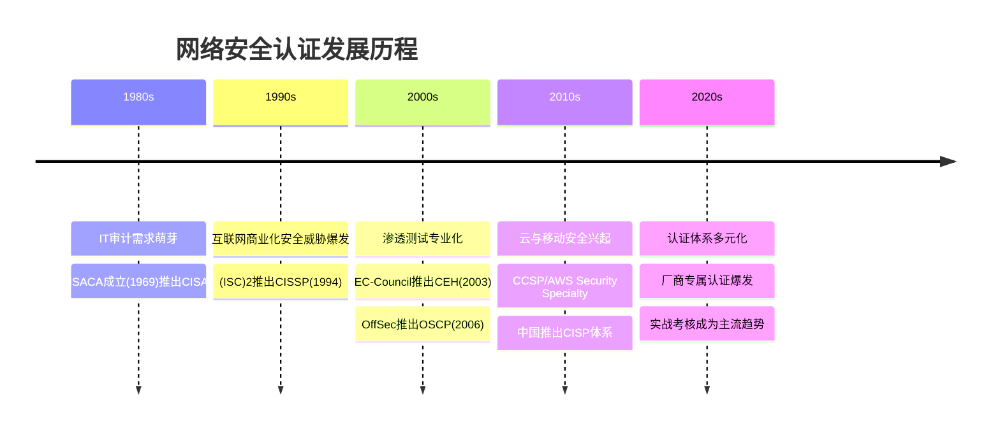
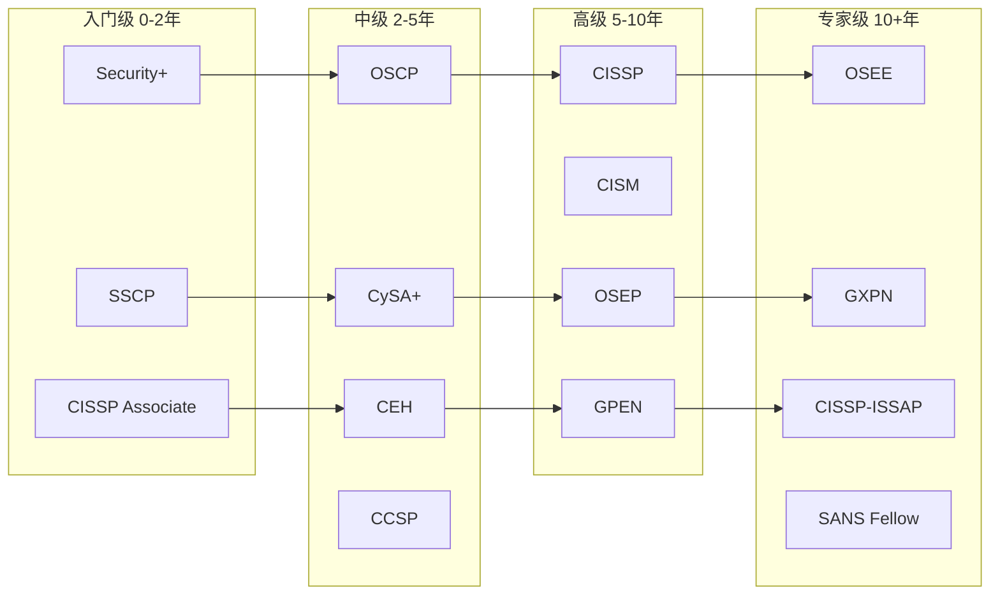
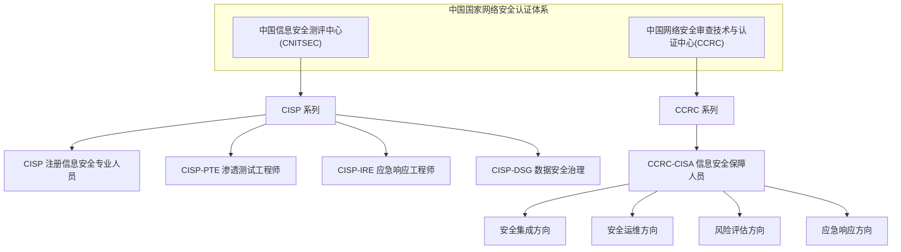
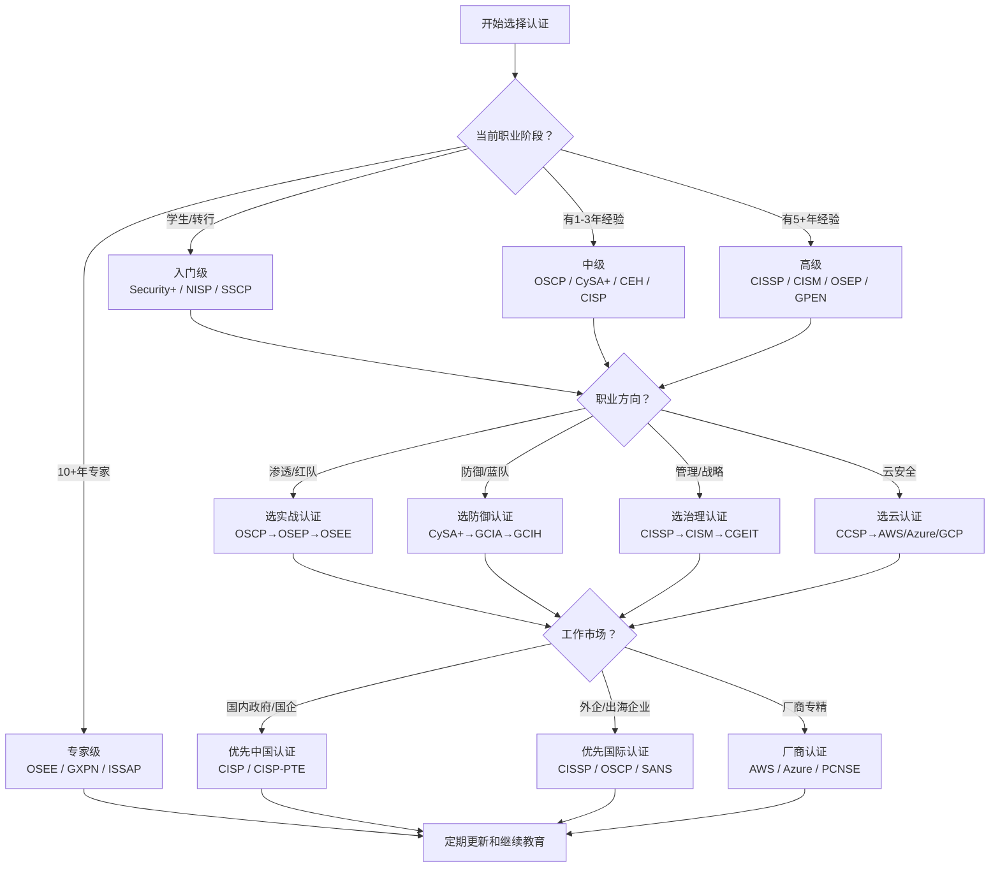

## 28.1 认证体系概述

网络安全认证是信息安全行业最成熟的人才评价体系之一。本节从认证的本质、分类体系、核心价值、选择策略和发展趋势五个维度，构建一个完整的认知框架，帮助读者在数十种认证中找到最适合自己的路径。

### 28.1.1 认证的起源与本质

#### 认证产生的历史背景

网络安全认证并非凭空诞生，而是信息安全行业走向成熟化的必然产物。要理解认证体系的全貌，有必要先回顾其发展脉络：



早在1989年（ISC）²成立时，信息安全还是一个模糊的岗位概念，企业缺乏衡量安全专业人员能力的客观标准。当时的"安全专家"往往是自学成才的系统管理员。随着1990年代互联网商业化带来的安全事件激增——如1998年Solar Sunrise事件中一名15岁少年入侵了美国国防部系统、2000年Mafiaboy发动的分布式拒绝服务攻击瘫痪了Amazon和Yahoo等主要网站——行业迫切需要一个标准化的能力评估框架。认证制度就在这样的背景下应运而生。

#### 认证的本质：信任传递机制

从经济学角度看，网络安全认证解决的是一个典型的**信息不对称**问题。诺贝尔经济学奖得主Michael Spence在1973年提出的"信号传递理论"（Signaling Theory）完美解释了认证的经济学本质：

```text
求职者能力 → 认证机构评估 → 认证证书 → 雇主信任
   未知            筛选          标签        降低信息成本
```

在劳动力市场中，雇主和求职者之间存在天然的信息鸿沟：
- **雇主的困境**：无法在2-3轮面试中准确判断候选人的真实技术水平。一个能流利谈论"零信任架构"的候选人，可能从未在生产环境中配置过一条防火墙规则。
- **求职者的困境**：即使拥有真才实学，也缺乏让陌生人快速相信的凭证。能力是隐性的，需要信号来显性化。

认证机构充当了**第三方信用担保**的角色。这种信任传递链条的有效性取决于三个核心要素：

| 信任要素 | 含义 | 典型体现 |
|---------|------|---------|
| **机构声誉** | 机构本身的可信度 | （ISC）²成立30+年，CISSP持证人超20万 |
| **评估严格性** | 考试难度与监考严谨度 | OSCP要求24h实机攻破、CEH需140分(满分100)的加权通过线 |
| **持证人表现** | 持证群体的行业口碑 | CISSP持证者在安全管理岗位上的平均绩效表现 |

当任何一个环节出现问题时，认证的公信力就会受到质疑。这也解释了为什么CISSP在30多年后仍然被广泛认可——（ISC）²在以上三个维度上持续保持了高标准。反之，某些机构通过"交钱即过"的方式发放证书，短期内获取了大量考生，但长期来看严重损害了自身品牌价值。

**信号强度的衰减规律**：认证的信号价值并非永恒。一项研究表明，认证对薪资的正向影响在获得后1-2年内最强，之后逐渐衰减——因为雇主会逐步关注你的实际产出而非证书本身。这意味着认证的最大价值窗口在职业转换期（跳槽、转岗、升职），而非平稳发展期。

#### 认证的心理与社会功能

除了纯技术评估功能，认证还承担了多重社会职能：

| 功能维度 | 具体表现 | 受益方 | 深层机制 |
|---------|---------|-------|---------|
| **信号效应** | 认证作为能力信号，帮助求职者脱颖而出 | 求职者 | 降低雇主筛选成本，获得面试机会 |
| **筛选过滤器** | HR用认证快速过滤简历池 | 雇主 | 简历初筛通过率提升40-60% |
| **薪资谈判** | 认证持有者平均薪资高出非持有者15-25% | 个人 | 量化的能力证明增强议价权 |
| **职业路径** | 认证体系定义了清晰的进阶路线 | 行业 | 减少人才发展方向的模糊性 |
| **合规要求** | 某些行业（如国防、金融）强制要求持证 | 组织 | 法规驱动的刚性需求 |
| **持续学习** | 继续教育要求推动终身学习 | 行业生态 | 强制知识更新防止能力退化 |
| **身份认同** | 持证者形成专业社群和职业归属感 | 个人/行业 | 社会学意义上的职业共同体构建 |

### 28.1.2 认证的体系化分类

网络安全认证不是简单的列表，而是一个多维度的立体体系。以下从四个维度进行全景分析：

```mermaid
graph TB
    subgraph "维度一：技术领域"
        direction TB
        A1["红队/渗透"]
        A2["蓝队/防御"]
        A3["管理/治理"]
        A4["审计/合规"]
        A5["云安全"]
        A6["工控/IoT"]
    end

    subgraph "维度二：难度层级"
        direction TB
        B1["入门 🟢"]
        B2["中级 🟡"]
        B3["高级 🟠"]
        B4["专家 🔴"]
    end

    subgraph "维度三：认证机构"
        direction TB
        C1["国际中立机构"]
        C2["厂商专有"]
        C3["国家级"]
    end

    subgraph "维度四：考核方式"
        direction TB
        D1["纯理论笔试"]
        D2["理论+实操"]
        D3["纯实战考核"]
        D4["持续评估"]
    end
```



#### 维度一：按技术领域分类

##### 1. 红队与渗透测试（Red Team / Penetration Testing）

这类认证验证的是攻击思维和渗透能力，通常包含实战考核环节：

| 认证 | 颁发机构 | 核心方向 | 考核方式 | 行业定位 | 费用 |
|------|---------|---------|---------|---------|------|
| OSCP | OffSec | Web/网络渗透 | 24h实战 | 渗透测试黄金标准 | $1,499 |
| PNPT | TCM Security | 全流程渗透 | 5天实战+报告 | OSCP平价替代 | $399 |
| GPEN | GIAC/SANS | 企业渗透测试 | 理论+实操 | 企业级认可 | $9,499 |
| CEH | EC-Council | 道德黑客基础 | 理论笔试 | 入门级/合规需求 | $1,199 |
| OSEP | OffSec | 高级渗透与绕过 | 48h实战 | 红队进阶 | $1,499 |
| OSED | OffSec | Windows二进制利用 | 48h实战 | 漏洞利用开发 | $1,499 |
| CRTO | Zero-Point Security | 红队操作 | 实战考核 | 域渗透首选 | $550 |

**关键区分**：OSCP和PNPT是"让你自己动手"的认证，考试环境就是一台靶机，你得真正攻进去。而CEH更侧重理论知识的广度——你知道SQL注入的10种方式，但不一定能在真实环境中执行一次完整的渗透。

**实战建议**：如果你是渗透测试的初学者，推荐路径为 PNPT（低门槛入门）→ OSCP（行业标准）→ OSEP/OSED（高级方向选择）→ OSEE（顶峰）。PNPT的$399学费和5天考试窗口让它成为最具性价比的实战认证入门选择。

##### 2. 蓝队与安全运营（Blue Team / Security Operations）

这类认证关注的是防御、检测和响应能力：

| 认证 | 颁发机构 | 核心方向 | 主要受众 | 费用 |
|------|---------|---------|---------|------|
| CompTIA Security+ | CompTIA | 安全基础通识 | 所有安全入门者 | $392 |
| CySA+ | CompTIA | 安全分析与威胁检测 | SOC分析师 | $392 |
| GCIA | GIAC/SANS | 入侵分析 | 安全分析专家 | $9,499 |
| GCIH | GIAC/SANS | 事件响应与处理 | 应急响应人员 | $9,499 |
| GSEC | GIAC/SANS | 安全实战基础 | 安全通才 | $9,499 |
| SC-200 | Microsoft | 微软安全运营 | Azure/365环境 | $165 |
| BTL1 | Security Blue Team | 蓝队实操入门 | 蓝队初级 | $499 |
| BTL2 | Security Blue Team | 蓝队进阶操作 | 蓝队中级 | $599 |

**实战建议**：SOC（安全运营中心）从业人员建议优先考虑 Security+ → CySA+ → GCIA → GCIH 的路径，每一步都对应不同的岗位层级。预算有限时，Security Blue Team的BTL1/BTL2是GIAC系列的高性价比替代。

##### 3. 安全治理与管理（Governance, Risk & Compliance）

这是偏向战略和管理层的认证体系：

| 认证 | 颁发机构 | 核心方向 | 工作经验要求 | 费用 |
|------|---------|---------|------------|------|
| CISSP | （ISC）² | 安全全领域知识 | 5年（可豁免1年） | $749 |
| CISM | ISACA | 安全治理与管理 | 5年管理经验 | $760 |
| CISA | ISACA | IT审计与控制 | 5年审计经验 | $760 |
| CRISC | ISACA | 风险与内控 | 3年相关经验 | $575 |
| CGEIT | ISACA | IT治理 | 5年治理经验 | $575 |

**重要说明**：这些认证不仅是"考过就行"——CISSP要求5年工作经验（4年+1年学位的折中方案），CISM要求5年信息安全管理工作经验。它们更适合有一定职业积累的人，而不是刚毕业的学生。CISSP允许"Associate of (ISC)²"身份——即工作经验不足也可以考试，通过后以Associate头衔工作，满足经验后再升级为正式CISSP。

##### 4. 云安全（Cloud Security）

随着云原生架构的普及，云安全认证近年来增长最快：

| 认证 | 颁发机构 | 核心方向 | 前置要求 | 费用 |
|------|---------|---------|---------|------|
| CCSP | （ISC）² | 通用云安全 | 5年经验或CISSP | $599 |
| AWS Security Specialty | AWS | AWS云安全 | AWS基础认证 | $300 |
| Azure Security Engineer | Microsoft | Azure安全 | Azure基础认证 | $165 |
| Google Professional Cloud Security | Google Cloud | GCP安全 | GCP基础认证 | $200 |
| CCSK | CSA | 云安全基础 | 无 | $395 |

**关键洞察**：CCSP偏理论和方法论（云安全架构设计），而AWS/Azure/GCP的安全认证偏实操（具体产品的安全配置）。理想状态是两者都拿——先CCSP建立理论框架，再厂商认证落地到具体产品。

##### 5. 工控与物联网安全（ICS/SCADA & IoT）

这是一个细分但需求快速增长的方向：

| 认证 | 颁发机构 | 侧重点 | 适用场景 |
|------|---------|--------|---------|
| GICSP | GIAC/SANS | 工业控制系统安全 | 电力/能源/制造 |
| GMOB | GIAC/SANS | 移动设备安全 | 企业移动安全 |
| ICS-CTP | SANS | ICS渗透测试 | 关键基础设施 |
| GRID | GIAC/SANS | 关键基础设施防御 | 工控防护运营 |
| ISA/IEC 62443 | ISA | 工控系统安全标准 | 安全设计与评估 |

**适用人群**：电力、能源、制造、交通等基础设施行业的安全从业者，以及物联网产品安全工程师。这个领域由于人才培养周期长、行业壁垒高，持证者的稀缺性远高于通用安全认证，薪资溢价显著。

#### 维度二：按难度与经验层级分类

这是从业者最关心的分类方式，因为直接对应职业发展路径：



##### 入门级（0-2年经验）

适合在校学生、转行者、初级IT从业人员。重点验证基础安全知识的掌握程度。

| 认证 | 预计备考时长 | 考试费用 | 有效期限 | CPE要求 |
|------|------------|---------|---------|--------|
| Security+ | 2-3个月 | $392 | 3年 | 50 CPE/3年 |
| SSCP | 3-4个月 | $399 | 3年 | 60 CPE/3年 |
| CISP（中国） | 3-6个月 | ¥12,800 | 5年 | 需换证 |
| NISP 一级 | 1-2个月 | ¥4,800 | 永久 | 无 |
| NISP 二级 | 2-3个月 | ¥8,800 | 永久 | 无 |

**入门建议**：Security+是国际化道路的最佳起点，全球认可度最高，知识覆盖全面，且没有工作经验门槛。如果目标是中国本土企业，CISP同样值得考虑，但注意其12,800元的费用需要参加指定培训机构。在校生可先从NISP入手，费用最低且无门槛。

##### 中级（2-5年经验）

适合已有实际工作经验的从业者。开始出现实战考核型认证。

| 认证 | 预计备考时长 | 考试费用 | 实验要求 | 通过率参考 |
|------|------------|---------|---------|-----------|
| OSCP | 4-6个月 | $1,499 | 必须完成练习 | ~30-40% |
| CEH | 2-3个月 | $1,199 | 包含iLabs | ~60-70% |
| CySA+ | 2-3个月 | $392 | 无 | ~75-85% |
| CCSP | 3-4个月 | $599 | 无 | ~65-75% |
| PNPT | 2-3个月 | $399 | 靶机练习 | ~70-80% |

**路径选择**：想做红队→OSCP，想做蓝队→CySA+，想做管理→过渡期可以考虑考CCSP或开始准备CISSP。OSCP的30-40%通过率说明了它的筛选力度——这不是"背题就能过"的认证。

##### 高级（5-10年经验）

适合资深工程师、团队负责人和安全经理。

| 认证 | 预计备考时长 | 经验要求 | 考试费用 | 续证费用/年 |
|------|------------|---------|---------|-----------|
| CISSP | 4-8个月 | 5年 | $749 | $135/年 |
| CISM | 4-6个月 | 5年管理经验 | $760 | $85/年 |
| OSEP | 3-6个月 | OSCP水平 | $1,499 | 永久有效 |
| GPEN | 4-5个月 | 2-3年渗透经验 | $9,499（含课程） | $499/年 |

**关键决策——CISSP vs CISM**：

| 对比维度 | CISSP | CISM |
|---------|-------|------|
| 知识广度 | 10个安全领域，覆盖面极广 | 聚焦4个管理领域，深度更强 |
| 考核侧重 | 技术理解+管理判断 | 战略制定+项目管理+治理 |
| 适合人群 | 偏技术的综合安全人才 | 已在管理岗位或计划转管理 |
| 行业定位 | "万金油"式综合认证 | 管理岗位"敲门砖" |
| 薪资溢价 | +25-35% | +30-40% |

##### 专家级（10+年经验）

适合安全架构师、漏洞研究员、企业安全负责人。

| 认证 | 特点 | 难度评价 | 行业地位 |
|------|------|---------|---------|
| OSEE | 最高难度实战渗透 | 极难 | 漏洞研究顶级认证 |
| GXPN | SANS最高级渗透认证 | 极难 | 企业渗透认证巅峰 |
| CISSP-ISSAP | CISSP的高级架构方向 | 高 | 安全架构设计认证 |
| OSWE | Web应用高级安全 | 高 | Web白盒审计认证 |

**现实评估**：专家级认证的持有者在全球范围内数量极少（OSEE持证者估计不超过500人）。这些认证的价值不仅在于知识本身，更在于它向行业传递的信号——"我在安全领域的某个方向上达到了顶尖水平"。对于大多数从业者来说，高级认证（CISSP/CISM）已经足够支撑整个职业生涯。

#### 维度三：按认证机构类型分类

##### 国际中立认证机构

这些机构不隶属于任何厂商，保持技术中立：

| 机构 | 成立年份 | 代表认证 | 全球持证人数 | 特点 |
|------|---------|---------|------------|------|
| （ISC）² | 1989 | CISSP, CCSP, SSCP | 约300,000+ | 最全面的安全知识认证 |
| ISACA | 1969 | CISM, CISA, CRISC | 约200,000+ | 治理与审计领先 |
| CompTIA | 1982 | Security+, CySA+ | 约2,000,000+ | 入门级市场主导 |
| Offensive Security | 2006 | OSCP, OSEP, OSEE | 约50,000+ | 实战渗透标杆 |
| GIAC/SANS | 2002 | GSEC, GPEN, GCIH | 约30,000+ | 深度培训+认证 |
| EC-Council | 2001 | CEH, CHFI, ECSA | 约300,000+ | 道德黑客普及 |
| TCM Security | 2019 | PNPT | 增长中 | 新一代实战认证 |

##### 厂商专有认证

特定于某个云平台或产品的安全认证：

| 认证系列 | 代表认证 | 适用场景 | 费用参考 |
|---------|---------|---------|---------|
| AWS Security | AWS Security Specialty, SCS | AWS环境安全 | $300 |
| Microsoft Security | SC-200, SC-300, AZ-500 | Microsoft 365/Azure | $165 |
| Google Cloud Security | Professional Cloud Security Engineer | GCP环境 | $200 |
| Cisco Security | CCNA Security, CCNP Security | 网络设备安全 | $330 |
| Palo Alto Networks | PCNSA, PCNSE | 防火墙产品安全 | $175-$400 |

**策略建议**：厂商认证的含金量与对应平台在市场上的占有率正相关。AWS Security Specialty在AWS主导的企业中价值极高，但到了GCP环境中含金量就大打折扣。建议先拿一张国际中立认证（如Security+或CISSP）建立通识基础，再根据所在环境选择厂商认证。

##### 国家级认证体系

不同国家出于安全自主可控的考虑，建立了本国的认证体系，在中国尤为重要：



| 中国认证 | 颁发机构 | 类比国际认证 | 适用范围 | 考试费用 |
|---------|---------|------------|---------|---------|
| CISP | 中国信息安全测评中心 | CISSP（维度相似） | 政府/国企/关键基础设施 | ¥12,800 |
| CISP-PTE | 中国信息安全测评中心 | OSCP（方向相似） | 渗透测试岗位 | ¥12,800 |
| CISP-IRE | 中国信息安全测评中心 | GCIH（方向相似） | 应急响应 | ¥12,800 |
| CISP-DSG | 中国信息安全测评中心 | CDPSE（方向相似） | 数据安全 | ¥12,800 |
| NISP 一级/二级 | 中国信息安全测评中心 | Security+（水平相似） | 在校学生 | ¥4,800/¥8,800 |

**中国认证体系的独特性**：与（ISC）²等国际认证不同，中国的CISP体系更强调"培训+考试"双轨制——必须参加指定培训机构的课程才能报名考试。这使得认证的获取成本（时间和金钱）高于同级别的国际认证。但在涉及国家安全、政府项目、关键信息基础设施的领域，CISP的合规价值远超国际认证。

#### 维度四：按考核方式分类

考核方式决定了认证的"含金量"，也是区分水证和硬核证书的关键：

| 考核类型 | 代表认证 | 描述 | 含金量评价 |
|---------|---------|------|-----------|
| **纯理论笔试** | Security+, SSCP | 全部选择题，考知识记忆 | ⭐⭐⭐ |
| **情境分析** | CISSP, CISM | 选择题+情境题，考应用判断 | ⭐⭐⭐⭐ |
| **理论+沙盒** | CEH, CySA+ | 选择题+虚拟实验室操作 | ⭐⭐⭐⭐ |
| **纯实战考核** | OSCP, PNPT | 只考实操，在规定时间内攻入靶机 | ⭐⭐⭐⭐⭐ |
| **持续评估** | SANS GIAC系列 | 培训课程+考试+实操 | ⭐⭐⭐⭐⭐ |
| **混合模式** | CCSP | 选择题+案例分析 | ⭐⭐⭐⭐ |

**核心规律**：实战考核占比越高，认证的"纸上谈兵"风险越低，市场认可度通常也越高。这就是为什么OSCP虽然只是"中级"认证，但在渗透测试领域的口碑和含金量超过了某些"高级"认证。

### 28.1.3 认证的核心价值分析

#### 对个人的价值

**薪资影响**：根据多个行业薪资调查报告的数据：

| 认证 | 持证者平均薪资（全球） | 相对非持证者溢价 | 中国地区溢价 |
|------|---------------------|----------------|-------------|
| 无核心认证 | $80,000-100,000 | 基准 | 基准 |
| Security+ | $85,000-110,000 | +10~15% | +10~20% |
| CISSP | $120,000-160,000 | +25~35% | +30~50% |
| OSCP | $100,000-140,000 | +20~30% | +25~40% |
| CISM | $130,000-170,000 | +30~40% | +35~55% |

> **数据来源**：基于（ISC）² 2024年网络安全劳动力研究、PayScale、LinkedIn薪资数据汇总。中国地区数据来自招聘网站综合统计，不同城市间差异显著。一线城市（北上广深）溢价通常在上述区间的上限。

**职业机会扩展**：
- **简历过滤关**：超过70%的网络安全岗位JD中明确列出优先认证要求
- **面试机会**：持有目标认证的候选人平均获得面试邀请率高出40-60%
- **晋升条件**：在中大型企业中，CISSP/CISM往往是安全总监及以上岗位的硬性条件
- **项目竞标**：安全服务项目投标时，团队持证人数是重要的评分项

**知识体系构建**：
认证备考过程本身就是一个系统化学习的过程。以CISSP为例，其覆盖的**8个知识域**（安全与风险管理、资产安全、安全架构与工程、通信与网络安全、身份与访问管理、安全评估与测试、安全运营、软件开发安全）构成了一个完整的安全知识框架，可以帮你建立"不偏科"的通才视野。

#### 对组织的价值

| 价值维度 | 具体体现 | 典型场景 |
|---------|---------|---------|
| **降低招聘成本** | 认证作为预筛选条件，减少面试时间和误招风险 | 年招聘量>50人的安全团队 |
| **合规需求** | ISO 27001、等级保护2.0、PCI DSS等标准要求特定岗位持证 | 金融、电信、政府行业 |
| **客户信任** | 服务商的认证持有者数量是客户评估服务能力的重要参考 | 安全咨询/集成项目 |
| **团队能力基线** | 认证帮助组织建立内部能力评估标准 | 大型安全运营中心 |
| **保险要求** | 部分网络安全保险要求特定岗位持证 | 企业投保网络责任险 |

#### 认证的局限性——你必须知道的真相

在强调认证价值的同时，必须正视其局限性。不了解这些局限性的人，容易陷入"证书收集者"的陷阱：

1. **认证 ≠ 能力**：高分通过CISSP的人不一定能实际应对一次真实的网络攻击。认证只证明了你在考试那一刻的知识储备，而不是实际解决问题的能力。业内有句话："OSCP证明你能在靶机上拿到shell，但不保证你能在生产环境中优雅地完成一次完整的渗透测试。"

2. **知识时效性**：网络安全领域变化极快，认证更新速度往往跟不上技术演进。一些认证教材中的内容可能已经过时3-5年。例如，某些认证仍在详细讲解WEP加密（已被完全破解），而对容器安全、云原生安全的覆盖不足。

3. **理论与实践鸿沟**：纯笔试型认证存在严重的"学习-应用"断裂——你能通过选择题，但不代表你会在生产环境中做SSH密钥配置、防火墙规则优化、日志分析等实际操作。

4. **费用门槛**：SANS/GIAC的课程+考试费用高达$9,499，OSCP需要$1,499，CISP需要¥12,800。对于个人自费学习是一笔不小的投入。需要理性评估投资回报比。

5. **应试套路化**：催生了大量的"认证考试培训"产业，部分机构专注于教人"刷题"而非"学习"，导致持证者实际知识掌握不足。业内称这类现象为"paper certification"。

6. **地域适用性差异**：某些认证在特定区域的认可度差异巨大。例如，CEH在北美市场评价参差不齐（被部分雇主视为"水证"），但在亚太和中东地区仍被广泛认可。

> **核心建议**：把认证当作学习的"框架"和"里程碑"，而不是目的。最好的学习方式是：选定一个认证 → 按大纲系统学习 → 在实验中验证知识 → 考试 → 在实践中检验和应用。循环往复。

#### 认证投资回报率（ROI）分析框架

选择认证不仅是知识投资，更是财务决策。以下是一个简化的ROI计算框架：

```text
认证ROI = (薪资溢价 × 预期持证年限 + 职业机会增量价值) / (考试费 + 培训费 + 备考时间成本)
```

| 认证 | 总投入（费用+时间） | 年化薪资溢价 | 回本周期 | 5年ROI |
|------|-------------------|------------|---------|--------|
| Security+ | ~$2,500（含3个月自学时间） | +$8,000-15,000 | 2-4个月 | 15-30x |
| OSCP | ~$8,000（含6个月学习时间） | +$15,000-30,000 | 3-6个月 | 10-20x |
| CISSP | ~$5,000（含6个月备考+$135/年续证） | +$20,000-40,000 | 3-4个月 | 15-35x |
| CISP | ~¥18,000（含培训+考试+时间） | +¥30,000-60,000 | 4-7个月 | 8-18x |
| SANS GPEN | ~$12,000（含课程+考试+时间） | +$25,000-50,000 | 3-5个月 | 10-20x |

> **注意**：以上为粗略估算，实际ROI因个人情况、所在城市、行业等因素差异显著。备考时间成本按市场时薪折算。

### 28.1.4 如何选择适合自己的认证

选择认证不是盲目追热门，而应该基于以下决策框架：



#### 具体场景推荐

| 你的情况 | 推荐优先认证 | 理由 |
|---------|------------|------|
| 大二/大三安全专业学生 | NISP二级 → Security+ | 费用低、无经验门槛、建立基础 |
| 转行想做渗透测试 | PNPT → OSCP | 从低门槛实战认证起步，逐步升级 |
| SOC初级分析师 | CySA+ | 聚焦威胁检测和分析 |
| 已工作3年，想提升薪资 | CISSP | 薪资溢价最高，且显示综合能力 |
| 想进甲方做安全经理 | CISSP → CISM | 技术与管理的完整路径 |
| 在国内政府/央企工作 | CISP | 合规硬性要求，不可替代 |
| 云平台运维转安全 | AWS Security + CCSP | 云场景专属，区分度大 |
| 漏洞研究方向 | OSEE 或 参与漏洞奖励计划 | 认证只是一种，成果更重要 |

#### 选择认证的常见误区

| 误区 | 真相 |
|------|------|
| "证书越多越好" | 针对性强比数量多更重要，3-5张核心认证覆盖你的职业方向足矣 |
| "先考最贵的SANS" | 贵不等于适合，先评估自己的职业阶段和需求 |
| "CISSP必须工作5年才能考" | 可以提前考，以Associate身份工作，满经验后升级 |
| "CEH没有含金量" | 在部分亚太/中东市场和合规场景中CEH仍有重要价值 |
| "只看通过率选认证" | 通过率低不代表适合你，通过率高也不代表没价值 |
| "考完认证就不用学了" | CPE/续证要求就是为了防止"考完即忘" |

### 28.1.5 认证的发展趋势

#### 趋势一：实战考核成为主流

传统的纯选择题考试正在被淘汰。Offensive Security的"24小时实战考核"模式被越来越多的机构效仿。TCM Security的PNPT甚至要求渗透测试报告的撰写质量，模拟真实的工作交付场景。可以预见，未来5年内，绝大多数有价值的认证都将包含至少30%的实操考核内容。

**典型案例**：2023年，EC-Council对CEH进行了重大改革，加入了"CEH Practical"实操考试选项（CEH Master = 理论+实操双通过），标志着即便是老牌笔试认证也在向实战化转型。

#### 趋势二：微认证与专项化

传统的"大而全"认证（CISSP覆盖8个领域）正在与"小而精"的微认证并行发展。云服务商推出的专项认证（如AWS Security Specialty只聚焦云安全的一个子领域）可以让从业者快速证明某个细分方向的专业能力。

**市场信号**：Credly、Badgr等数字徽章平台的兴起，使得企业也可以自行颁发微认证。Google、Microsoft、IBM等科技巨头已经在Coursera等平台上推出专项技能徽章，作为传统认证的补充。

#### 趋势三：认证与持续评估结合

传统的"考一次管三年"模式正在向"持续学习+定期评估"转变。微软和AWS已经开始提供免费的沙盒环境进行持续性技能评估。未来的认证可能不再是"一次定终身"，而是基于你在实际工作中的持续表现。

**前沿探索**：（ISC）²在2024年宣布正在探索"持续专业教育（CPE）+ 定期微评估"的混合续证模式，取代传统的"凑CPE学分即可续证"。这意味着未来的CISSP续证可能需要通过在线评估来验证知识更新。

#### 趋势四：中国认证体系的国际化

随着中国网络安全法的实施和等保2.0的推进，CISP体系在国内的影响力持续扩大。同时，CISSP等国际认证也开始提供中文考试版本。在未来5-10年，可能会形成"国际认证+中国认证"双轨并行的格局。

**值得关注**：2023年以来，部分中国安全厂商（如奇安信、深信服）也开始推出自家的安全认证体系。虽然目前影响力有限，但随着国产化替代的推进，这些厂商认证可能在特定生态内获得重要地位。

### 28.1.6 认证维护与持续发展

拿到认证只是起点，维护和利用认证才是长期课题。

#### 续证策略

| 认证 | 有效期 | 续证要求 | 年均维护成本 | 策略建议 |
|------|-------|---------|------------|---------|
| CISSP | 3年 | 40 CPE/年，$135/年 | ~$500（含CPE活动） | 参加行业会议一举多得 |
| Security+ | 3年 | 50 CPE/3年 | ~$200 | 多看行业文章即可 |
| OSCP | 永久 | 无 | $0 | 一次投入终身受益 |
| CEH | 3年 | 120 CPE/3年 | ~$300 | 通过教课/写作获取CPE |
| CISP | 5年 | 重新培训+考试 | ¥12,800/5年 | 成本较高但合规刚需 |

#### 如何最大化认证的价值

1. **简历展示**：将认证放在简历显眼位置，标注获取时间和证书编号供雇主验证
2. **LinkedIn标签**：在LinkedIn个人资料中添加认证标签，提高被猎头搜索到的概率
3. **面试话术**：准备"备考过程中学到了什么"的故事，而非只展示证书本身
4. **知识应用**：将认证学到的框架和方法论应用到实际工作中，形成可量化成果
5. **社区参与**：加入认证相关社群（如（ISC）²本地分会），拓展人脉网络

### 28.1.7 本章小结

网络安全认证体系是一个多维度、多层次的复杂系统。本节通过四个维度（技术领域、难度级别、认证机构、考核方式）对其进行了解构，帮助读者建立完整的认证知识框架。

**核心要点回顾：**

1. **认证是信任传递机制**，解决信息不对称问题，但其价值取决于评估的严格程度
2. **没有"最好"的认证，只有"最适合"的认证**——选择取决于你的职业阶段、技术方向和市场需求
3. **实战考核型认证价值更高**——OSCP虽然只是中级认证，但含金量远超许多高级笔试认证
4. **中国CISP体系在特定场景下不可替代**——政府、央企、关键基础设施行业中，CISP具有合规优势
5. **认证是投资而非消费**——理性评估ROI，选择投入产出比最高的认证
6. **认证是起点不是终点**——拿下认证后要持续学习，在实际工作中验证和深化知识

从下一节开始，我们将逐一深入分析每个核心认证的备考策略、学习资源和实战经验。
