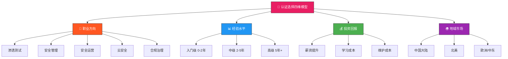
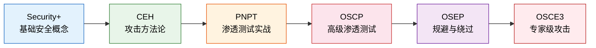
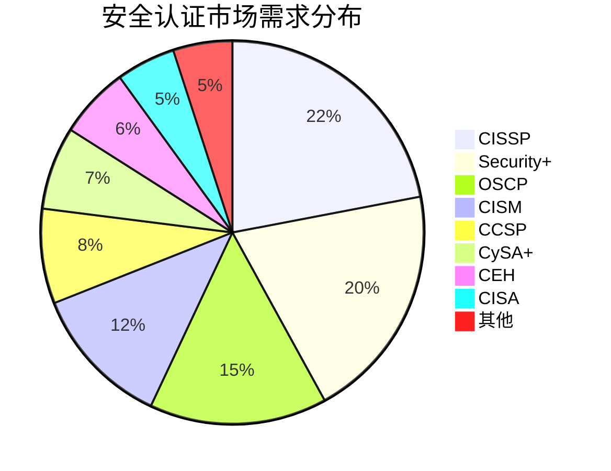
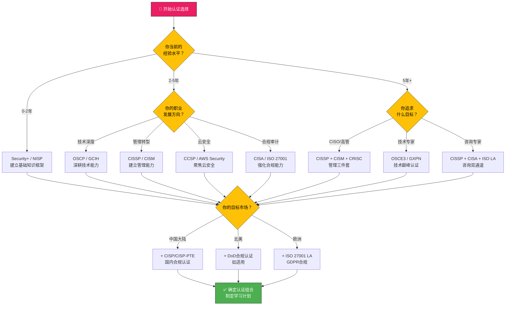

## 28.3 认证选择策略

信息安全认证体系庞大复杂，全球范围内活跃的安全相关认证超过200种，涵盖渗透测试、安全管理、安全运营、云安全、合规审计等多个方向。面对如此庞大的选择空间，盲目跟风考取热门认证不仅浪费时间和金钱，更可能导致职业发展偏离目标。本节建立一套系统化的认证选择方法论，帮助读者根据自身情况做出最优决策。

### 28.3.1 认证选择的四个维度

认证选择本质上是一个多目标优化问题，需要同时考虑四个核心维度：



**核心原则：先定方向，再选认证。** 每个认证都有明确的能力定位和市场定位，脱离职业目标谈认证选择毫无意义。下面逐一展开四个维度的分析框架。

### 28.3.2 按职业方向选择

不同职业方向对应不同的认证路径，每条路径从入门到精通形成完整的进阶链条。

#### 渗透测试方向

渗透测试是安全领域最具技术深度的方向，要求从基础网络知识逐步过渡到高级漏洞挖掘和利用能力。



| 认证 | 颁发机构 | 考试形式 | 费用（美元） | 备考周期 | 前置要求 | 薪资影响 |
|------|---------|---------|-------------|---------|---------|---------|
| CompTIA Security+ | CompTIA | 90题选择题，90分钟 | $392 | 2-3个月 | 无硬性要求 | +10-15% |
| CEH (v12) | EC-Council | 125题选择题，4小时 | $1,199 | 2-4个月 | 建议2年安全经验 | +8-12% |
| PNPT | TCM Security | 实操考核，5天 | $399 | 1-2个月 | 基础渗透知识 | +5-10% |
| OSCP | OffSec | 23小时45分钟实操 | $1,599-$2,499 | 3-6个月 | 网络与Linux基础 | +15-25% |
| OSEP | OffSec | 4天实操 | $1,649-$2,549 | 3-6个月 | OSCP或同等经验 | +10-15% |
| OSCE3 | OffSec | 4天综合实操 | $2,549+ | 6-12个月 | 多个OffSec认证 | +20-30% |

**路径解读**：
- Security+ 是零基础的最佳起点，覆盖身份认证、访问控制、密码学等核心概念，为后续所有方向打下基础
- CEH 提供了系统化的攻击方法论框架，但偏理论，实际动手能力有限
- PNPT 是近年崛起的高性价比实操认证，考试形式更贴近真实渗透测试工作流
- OSCP 是渗透测试领域的分水岭认证，23小时实操考试对心理素质和技术能力双重考验，持有者在求职市场上具有显著优势
- OSEP 聚焦于防御规避技术，是进入红队/高级渗透测试的必经之路
- OSCE3 是OffSec的顶级认证，代表渗透测试领域的最高技术水平

#### 安全管理方向

安全管理侧重于战略规划、风险治理和组织安全能力建设，适合从技术岗位向管理岗位转型的从业者。

| 认证 | 颁发机构 | 考试形式 | 费用（美元） | 备考周期 | 前置要求 | 薪资影响 |
|------|---------|---------|-------------|---------|---------|---------|
| SSCP | (ISC)² | 125题选择题，3小时 | $349 | 2-3个月 | 1年安全相关经验 | +8-12% |
| CISSP | (ISC)² | 100-150题CAT，3小时 | $749 | 3-6个月 | 5年安全工作经验（可1年实习替代1年） | +20-30% |
| CISM | ISACA | 150题选择题，4小时 | $575-$760 | 3-6个月 | 5年信息安全管理经验（3年可替代） | +15-25% |
| CRISC | ISACA | 150题选择题，4小时 | $575-$760 | 3-6个月 | 3年风险管理相关经验 | +15-20% |
| CGEIT | ISACA | 150题选择题，4小时 | $575-$760 | 3-6个月 | 5年IT治理相关经验 | +12-18% |

**路径解读**：
- SSCP 是(ISC)²体系的入门级认证，侧重技术层面的安全实践，适合从运维/开发转型的初学者
- CISSP 覆盖安全领域的八个知识域（安全与风险管理、资产安全、安全架构等），是安全管理岗位的"黄金标准"，全球认可度最高
- CISM 聚焦于信息安全管理体系的建立和运行，强调业务导向的安全决策能力
- CRISC 专注于IT风险管理，适合在合规和风控体系中发展的从业者
- CGEIT 面向IT治理领域，适合审计和治理岗位

#### 安全运营方向

安全运营关注威胁检测、事件响应和安全监控，是当前人才缺口最大的方向之一。

| 认证 | 颁发机构 | 考试形式 | 费用（美元） | 备考周期 | 前置要求 | 薪资影响 |
|------|---------|---------|-------------|---------|---------|---------|
| CySA+ | CompTIA | 85题选择题+PBQ，165分钟 | $392 | 2-3个月 | Security+或2年经验 | +10-15% |
| GCIH | SANS/GIAC | 150题选择题，4小时 | $2,499（含培训） | 2-4个月 | 建议安全运营经验 | +15-20% |
| GCIA | SANS/GIAC | 150题选择题，4小时 | $2,499（含培训） | 2-4个月 | 建议网络分析经验 | +12-18% |
| GCFA | SANS/GIAC | 82题选择题，3小时 | $2,499（含培训） | 2-4个月 | 建议数字取证经验 | +12-18% |
| GCFE | SANS/GIAC | 82题选择题，3小时 | $2,499（含培训） | 2-4个月 | 建议取证分析经验 | +10-15% |
| GSLC | SANS/GIAC | 115题选择题，3小时 | $2,499（含培训） | 2-4个月 | 建议安全架构经验 | +10-15% |

**路径解读**：
- CySA+ 是安全运营方向的最佳入门认证，覆盖威胁情报、漏洞管理、安全监控等核心能力
- GCIH（GIAC Certified Incident Handler）是事件响应领域的权威认证，SANS课程质量业界公认
- GCIA 聚焦于网络流量分析和入侵检测，适合SOC分析师和网络防御工程师
- GCFA 和 GCFE 分别面向数字取证和事件取证分析，是安全响应团队的核心认证
- **注意**：SANS/GIAC系列认证的培训费用高昂（通常$7,000-$9,000），但课程内容和实操质量远超其他培训机构，被视为安全运营领域的"奢侈品认证"

#### 云安全方向

云计算安全是增长最快的细分领域，各大云厂商的专用安全认证需求持续攀升。

| 认证 | 颁发机构 | 考试形式 | 费用（美元） | 备考周期 | 前置要求 | 薪资影响 |
|------|---------|---------|-------------|---------|---------|---------|
| AWS Cloud Practitioner | AWS | 65题选择题，90分钟 | $100 | 1-2个月 | 无 | +5-8% |
| AWS Security Specialty | AWS | 65题选择题，170分钟 | $300 | 2-4个月 | AWS基础+安全经验 | +12-18% |
| CCSP | (ISC)² | 125题选择题，4小时 | $599 | 3-6个月 | 5年IT经验（含1年云安全） | +15-22% |
| CCSK | CSA | 60题选择题，90分钟 | $395 | 1-2个月 | 无硬性要求 | +8-12% |
| Azure Security Engineer | Microsoft | 40-60题，120分钟 | $165 | 2-3个月 | Azure基础 | +10-15% |
| GPCSE | SANS/GIAC | 82题选择题，3小时 | $2,499 | 2-4个月 | 云安全实战经验 | +12-18% |
| Google Professional Cloud Security | Google | 50-60题选择题，2小时 | $200 | 2-3个月 | GCP基础+安全经验 | +10-15% |

**路径解读**：
- 如果刚入云安全领域，从 AWS Cloud Practitioner 或 CCSK 起步，成本低、门槛低
- CCSP 是云安全方向最全面的认证，由(ISC)²颁发，与CISSP形成互补
- 各云厂商的专用认证（AWS/Azure/GCP）在特定生态中认可度极高，建议根据目标企业的技术栈选择
- CCSK 由云安全联盟（CSA）颁发，是云安全领域的基础框架认证，侧重治理和合规

#### 合规治理方向

合规与治理方向关注法律法规遵从、标准体系实施和审计能力，是受监管行业（金融、医疗、政府）的核心需求。

| 认证 | 颁发机构 | 考试形式 | 费用（美元） | 备考周期 | 前置要求 | 薪资影响 |
|------|---------|---------|-------------|---------|---------|---------|
| ISO 27001 LA | Exemplar/PECB | 选择题+论述题，2小时 | $500-$2,000 | 2-4个月 | ISO 27001 LI | +10-15% |
| CISA | ISACA | 150题选择题，4小时 | $575-$760 | 3-6个月 | 5年信息系统审计经验 | +15-22% |
| CRISC | ISACA | 150题选择题，4小时 | $575-$760 | 3-6个月 | 3年风险管理经验 | +15-20% |
| CDPSE | ISACA | 100题选择题，2.5小时 | $575-$760 | 2-3个月 | 3年隐私工程经验 | +10-15% |

### 28.3.3 按经验水平选择

经验水平是选择认证的关键约束条件。选择远超自身能力水平的认证不仅备考效率低下，即使侥幸通过也难以在实际工作中发挥作用。

#### 初学者（0-2年经验）

**目标**：建立完整的安全知识框架，了解行业术语和基础概念。

**推荐认证组合**：

| 优先级 | 认证 | 目的 | 投入 | 回报周期 |
|-------|------|-----|------|---------|
| 1 | CompTIA Security+ | 安全基础知识的"百科全书" | $392 + 2-3个月备考 | 3-6个月 |
| 2 | CompTIA Network+ | 网络基础（Security+的前置） | $349 + 2-3个月备考 | 即时 |
| 3 | CEH | 理解攻击者视角和方法论 | $1,199 + 2-4个月备考 | 6-12个月 |

**给初学者的忠告**：
- **不要跳过基础认证直接考OSCP**。OSCP的通过率长期维持在20-30%，缺乏基础的初学者需要更长的准备时间，且通过率更低
- **Security+虽然"简单"，但知识体系极其全面**，涵盖安全运营的方方面面，为后续所有方向提供知识框架
- **CEH的价值在于方法论**，而非技术深度。它帮助你理解攻击者的思维模式，这对后续的渗透测试学习至关重要
- 初学者应优先投入时间建立实际动手能力（搭建靶场、参与CTF），而非一味追求认证数量

#### 中级从业者（2-5年经验）

**目标**：深化专业方向，建立差异化竞争力。

**推荐认证组合（按方向）**：

| 方向 | 首选认证 | 补充认证 | 预期投资 |
|------|---------|---------|---------|
| 渗透测试 | OSCP | PNPT + OSWP | $2,000-4,000 + 6-12个月 |
| 安全运营 | GCIH | CySA+ + GCIA | $2,500-5,000 + 4-8个月 |
| 安全管理 | CISSP | CISM | $1,300-2,000 + 6-12个月 |
| 云安全 | AWS Security Specialty | CCSP | $500-1,200 + 3-6个月 |
| 合规审计 | CISA | ISO 27001 LA | $1,000-2,000 + 4-8个月 |

**给中级从业者的忠告**：
- **OSCP是渗透测试方向的分水岭**，通过OSCP标志着你具备了专业级渗透测试能力
- **CISSP虽然不要求管理经验，但最好先有1-2年的安全管理实践**再考取，否则知识难以内化
- **SANS培训是一笔不小的投资**，但如果你的雇主提供教育补贴，优先选择SANS/GIAC认证
- 中级阶段应开始考虑"认证组合"而非单一认证，如渗透测试方向的 OSCP + OSWP + PNPT 三件套

#### 高级从业者（5年+经验）

**目标**：获取顶级认证，确立行业专家地位，进入高级管理和架构岗位。

**推荐认证组合**：

| 目标 | 认证组合 | 投资规模 | 战略价值 |
|------|---------|---------|---------|
| 高级渗透/红队 | OSCE3 + GXPN | $5,000+ | 行业顶尖技术认证 |
| CISO路径 | CISSP + CISM + CRISC | $2,500+ | 高管岗位敲门砖 |
| 首席安全架构师 | CISSP + TOGAF + CCSP | $3,000+ | 架构设计权威 |
| 安全咨询专家 | CISSP + CISA + ISO 27001 LA | $2,500+ | 审计咨询双资质 |

**给高级从业者的忠告**：
- **高级认证的价值不仅在于知识，更在于行业声誉和人脉**。CISSP持有者社区（ISC)²会员组织）是全球最大的安全专业人士网络
- **考虑行业垂直认证**，如金融行业的 CRISC、医疗行业的 HCISPP，这些在特定行业中具有不可替代的价值
- **持续维护所有认证的CPE/CE学分**，高级认证的维护成本不低，需要规划好时间和预算
- **高级阶段不要追求数量**，3-4个高质量认证远胜于10个入门级认证

### 28.3.4 按市场需求和薪资影响选择

认证的市场价值会随行业趋势和技术发展动态变化。以下是基于多个数据源（CyberSeek、Infosec Institute、LinkedIn Salary Insights）的综合分析。

#### 当前市场需求排名（2024-2025年）



#### 薪资影响分析

| 认证 | 无证平均薪资（美国） | 持证平均薪资（美国） | 薪资提升 | 持证者占比 |
|------|-------------------|-------------------|---------|----------|
| CISSP | $95,000 | $131,000 | +38% | 26.3% |
| OSCP | $85,000 | $115,000 | +35% | 8.2% |
| CISM | $100,000 | $133,000 | +33% | 11.5% |
| Security+ | $70,000 | $88,000 | +26% | 42.1% |
| CCSP | $105,000 | $132,000 | +26% | 5.3% |
| CEH | $72,000 | $85,000 | +18% | 15.8% |
| CISA | $90,000 | $110,000 | +22% | 10.2% |

> **数据说明**：以上数据基于美国市场，中国市场薪资水平通常为美国的40-60%，但认证的价值趋势相似。数据来源于CyberSeek 2024、Robert Half Technology Salary Guide和LinkedIn Salary Insights，仅供参考。

#### 增长最快的认证方向

**快速上升**：
1. **CCSP**：云安全认证需求年增长率超过25%，受多云战略和零信任架构推动
2. **CySA+**：安全运营人才缺口持续扩大，SOC分析师和威胁猎手需求激增
3. **CRISC**：受ESG（环境、社会、治理）和数据隐私法规推动，风险管理岗位增长迅速
4. **AWS/Azure安全认证**：各云平台安全专用认证需求随企业上云进程同步增长

**稳定需求**：
1. **CISSP**：安全管理岗位的"硬通货"，需求稳定且持续
2. **OSCP**：渗透测试领域无可替代的标杆认证
3. **CISM**：安全治理和管理层岗位的核心要求

**需谨慎评估**：
1. **CEH**：虽然市场认可度高，但技术深度不如OSCP，部分企业已将其视为"锦上添花"而非必要条件
2. **CCNA Security（已更名为CCNA CyberOps）**：Cisco认证体系正在调整，单一道厂商认证的通用性受限
3. **纯厂商认证**（如Splunk Certified、Palo Alto PCNSC）：仅在使用对应产品的企业中有价值

### 28.3.5 按地域市场选择

认证的认可度和价值在不同地区存在显著差异，需要根据目标市场做出针对性选择。

#### 中国市场

中国安全认证市场有其独特性——国家认可的认证与国际认证并行，且前者在政府机构和国有企业中具有不可替代的地位。

| 认证 | 颁发机构 | 适用场景 | 费用（人民币） | 备考周期 | 特殊说明 |
|------|---------|---------|-------------|---------|---------|
| CISP | 中国信息安全测评中心 | 政府/国企/军工 | 9,800-12,800 | 2-3个月 | 国内最权威安全认证，持证人数超10万 |
| CISP-PTE | 中国信息安全测评中心 | 渗透测试岗位 | 6,800-8,800 | 2-3个月 | 国内渗透测试领域权威认证 |
| CISP-IRE | 中国信息安全测评中心 | 应急响应岗位 | 6,800-8,800 | 2-3个月 | 应急响应方向的专项认证 |
| NISP（一级/二级） | 国家信息安全水平考试中心 | 在校学生/初级岗位 | 680-1,500 | 1-2个月 | 门槛低，适合在校生入门 |
| NITES | 工信部教育考试中心 | 信息安全岗位 | 300-800 | 1-2个月 | 官方背景，政府项目认可 |

**中国市场关键洞察**：
- **CISP 是政府和国企的"入场券"**，如果目标是体制内或央企安全岗位，CISP是必选项，国际认证只能作为补充
- **CISP-PTE 认证在渗透测试岗位的认可度逐年上升**，但技术深度不如OSCP，两者并不冲突
- **CISSP 在外企、互联网大厂和安全厂商中认可度极高**，与CISP形成互补
- **等保测评师**（等级保护测评师）在合规领域具有独特价值，适合从事等保2.0相关工作
- 中国市场对国际认证的认可度正在快速提升，特别是CISSP、OSCP和CCSP

#### 北美市场

北美是信息安全认证体系最成熟的市场，认证种类丰富，雇主认可度体系完善。

| 认证 | 价值定位 | 最佳适用场景 | 特殊说明 |
|------|---------|-------------|---------|
| CompTIA Security+ | 入门级岗位的普遍要求 | 求职敲门砖、DoD 8570合规 | 美国国防部认可的IAT Level II认证 |
| OSCP | 渗透测试领域的黄金标准 | 红队/渗透测试/漏洞研究 | 技术面试中认可度最高的实操认证 |
| CISSP | 安全管理的通用货币 | 管理岗/架构岗/咨询岗 | 全球认可度最高，北美最通用 |
| CISM | 安全治理的权威认证 | CISO路径/安全总监岗位 | 侧重业务视角，管理者首选 |
| GCIH/GCIA | SANS体系的核心认证 | SOC分析师/事件响应/数字取证 | SANS课程在北美企业中享有极高声誉 |

**北美市场关键洞察**：
- **DoD 8570/8140 合规要求**是北美特有的市场需求——从事美国国防部相关工作必须持有特定认证（如Security+对应IAT Level II）
- **SANS/GIAC认证在北美的市场价值远高于其他地区**，许多企业直接将SANS培训作为员工发展计划的一部分
- **OSCP的面试认可度在北美渗透测试岗位中排名第一**，甚至超过SANS的GPEN
- **云安全认证（AWS/Azure）在北美的需求增速最快**，反映北美企业上云的领先地位

#### 欧洲市场

欧洲安全认证市场受GDPR（通用数据保护条例）影响显著，合规和数据保护方向的认证具有独特优势。

| 认证 | 价值定位 | 最佳适用场景 | 特殊说明 |
|------|---------|-------------|---------|
| CISSP | 全球通用认证 | 跨国企业/咨询公司 | 欧洲大型企业普遍认可 |
| CISM | 安全治理的权威认证 | 安全管理岗位 | 在欧洲企业中认可度略高于北美 |
| ISO 27001 LA/LI | 信息安全管理体系审计/实施 | 合规审计/体系建设 | 欧洲市场特有的高价值认证 |
| CDPSE | 隐私工程认证 | GDPR合规/数据保护 | 2022年新推出的认证，增长迅速 |
| CIPT (IAPP) | 隐私技术认证 | 数据保护工程师 | IAPP体系的核心技术认证 |

**欧洲市场关键洞察**：
- **ISO 27001 Lead Implementer/Lead Auditor 是欧洲安全认证的"硬通货"**，在合规领域几乎无替代品
- **GDPR合规相关认证（CDPSE、CIPT、CIPM）在欧洲需求强劲**，且受数据保护法规驱动持续增长
- **CISSP在欧洲的认可度与北美相当**，但SANS/GIAC在欧洲的市场影响力较弱
- **英国市场更偏向北美认证体系**，德国市场更重视ISO和TÜV体系认证

#### 中东/东南亚市场

| 区域 | 高价值认证 | 特点 |
|------|----------|------|
| 中东（海湾国家） | CISSP、CISM、OSCP、CISA | 受油气行业合规要求驱动，认证薪资溢价高（通常+20-30%） |
| 东南亚 | CISSP、Security+、CCSP、CISP | 市场处于快速增长期，认证认可度正在与国际接轨 |
| 日本 | CISSP、ISMS认证、SCAP | 日本市场偏重ISMS（ISO 27001）体系认证 |

### 28.3.6 认证投资回报率（ROI）分析

认证选择不能仅看市场价值，还需要考虑投资回报率——即投入的金钱、时间和精力与获得的职业回报之间的比值。

#### 投资回报率计算框架

```text
认证ROI = (薪资提升 + 职业机会价值) / (考试费 + 培训费 + 备考时间成本)

其中：
- 备考时间成本 = 备考小时数 × 你的时薪（或机会成本）
- 职业机会价值 = 新增的岗位机会带来的期望薪资提升（按概率加权）
```

#### 典型认证ROI对比

| 认证 | 总投资（美元） | 备考时间 | 薪资提升 | ROI评级 | 最佳投资时机 |
|------|-------------|---------|---------|---------|------------|
| Security+ | $500-800 | 200-300小时 | +10-15% | ⭐⭐⭐⭐⭐ | 职业生涯初期 |
| OSCP | $2,000-4,000 | 500-800小时 | +15-25% | ⭐⭐⭐⭐ | 1-3年经验时 |
| CISSP | $1,500-3,000 | 300-600小时 | +20-30% | ⭐⭐⭐⭐⭐ | 3-5年经验时 |
| SANS/GIAC | $7,000-9,000 | 200-400小时 | +15-20% | ⭐⭐⭐ | 雇主付费时 |
| CISM | $1,000-2,000 | 300-500小时 | +15-25% | ⭐⭐⭐⭐ | 转管理岗时 |
| OSCE3 | $5,000+ | 800-1,500小时 | +20-30% | ⭐⭐⭐ | 高级渗透测试阶段 |

**ROI优化策略**：
1. **利用雇主报销**：大多数大型企业和安全厂商提供每年$3,000-$10,000的教育/认证报销额度，优先使用这些资源
2. **利用二手资料**：如 OSCP 的 PWK 课程在考后可以转让给他人，分摊成本
3. **社区资源**：如 TJ Null 的 OSCP 靶场列表、HackTheBox 等免费平台，可以显著降低备考成本
4. **批量备考**：CISSP + CISM 的知识域有大量重叠，可以在半年内连续备考，节省学习成本
5. **考虑认证时效**：大多数认证有效期为3-5年，需要将维护成本纳入长期投资考量

#### 认证维护成本对比

| 认证 | 有效期 | 维护费 | CPE要求 | 年均维护成本 |
|------|-------|-------|--------|------------|
| Security+ | 3年 | $75/年 | 50 CPE | ~$200 |
| CISSP | 3年 | $85/年 | 40 CPE/年 | ~$300 |
| OSCP | 无到期要求 | 无 | 无 | $0 |
| CISM | 3年 | $45/年 | 20 CPE/年 | ~$200 |
| GCIH | 4年 | 无 | 36 CPE/年 | ~$100 |
| CCSP | 3年 | $100/年 | 30 CPE/年 | ~$350 |

> **重要提示**：OSCP 是少数没有到期要求的安全认证之一，一旦获得终身有效，这是其独特的长期价值。但 OffSec 鼓励持有者通过更新考试来保持技能，这在求职市场中会形成差异化优势。

### 28.3.7 认证选择的决策流程

面对复杂的认证体系，以下决策流程可以帮助你快速定位最适合的认证：



### 28.3.8 常见误区与纠正

在认证选择和备考过程中，以下误区最为常见：

**误区1：认证越多越好**
- **事实**：认证的价值在于深度而非数量。持有CISSP + OSCP的双认证专家，远胜于持有10个入门级认证的"集邮者"
- **建议**：每个职业阶段聚焦2-3个核心认证，追求深度而非广度

**误区2：只要通过考试就能证明能力**
- **事实**：部分认证（如CEH）可以通过背题库通过，实际能力与认证不匹配的现象普遍
- **建议**：优先选择有实操考试的认证（OSCP、PNPT、GPEN），它们更能证明真实能力

**误区3：只看认证本身的市场价值**
- **事实**：认证的价值高度依赖你的职业路径。一个在渗透测试岗位上价值极高的OSCP认证，对想做安全咨询的从业者来说ROI很低
- **建议**：始终以职业目标为导向选择认证，而非追逐市场热点

**误区4：忽视认证的维护成本**
- **事实**：多数认证需要每3年续期，每年需要积累CPE学分，这是一项持续的金钱和时间投入
- **建议**：在选择认证时，将5年维护成本纳入总投入计算

**误区5：认为国际认证在中国市场没有价值**
- **事实**：虽然国内安全岗位对CISP有明确要求，但CISSP、OSCP等国际认证在互联网大厂、安全厂商和外企中认可度极高
- **建议**：如果目标是市场化企业，国际认证同样重要；如果目标是体制内，则优先考取CISP

**误区6：一次性投入过多时间备考**
- **事实**：长时间高强度备考容易导致知识遗忘和效率下降
- **建议**：制定可持续的学习计划（每天1-2小时，持续3-6个月），比突击备考（连续3个月每天8小时）效果更好

**误区7：忽视认证之间的知识协同**
- **事实**：很多认证之间存在大量知识重叠（如CISSP与CISM、Security+与CEH），利用这种重叠可以显著降低备考成本
- **建议**：制定认证组合时，优先选择知识域重叠度高的认证，在相同知识基础上扩展不同维度

### 28.3.9 认证选择的综合建议

最终，认证选择应遵循以下原则：

1. **目标导向**：认证是工具而非目的。始终从职业目标出发，选择能最快、最有效达成目标的认证
2. **渐进式投入**：从低成本、高回报的入门认证开始，逐步升级到高价值的专业认证
3. **实战优先**：优先选择有实操考试的认证，它们不仅更具市场价值，备考过程本身就是技能提升
4. **市场适配**：根据目标市场（行业和地区）选择认证，不同市场的偏好差异显著
5. **投资视角**：将认证视为职业投资，计算总投入（金钱+时间+维护）和预期回报，做出理性决策
6. **动态调整**：认证市场持续变化，每年回顾一次认证组合，确保与职业发展保持一致

> **最后一句话**：最好的认证不是最贵的或最难的，而是最契合你当前阶段和目标的那一个。选择之后，全身心投入备考过程本身，就是最好的能力提升。
