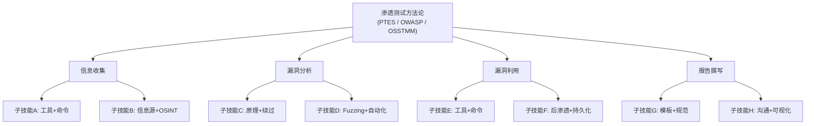

# 28.4 认证备考理论

## 28.4.1 概述：从"死记硬背"到"能力建构"

安全认证备考不同于普通的资格考试。OSCP（PEN-284）、OSWE、GPEN、CISSP 等安全认证不仅考察知识记忆，更检验**在压力环境下运用技术能力解决实际问题的水平**。传统的"刷题-背诵"模式在实操型认证面前几乎无效。

以 OSCP 为例：Offensive Security 官方数据显示，全球平均通过率约 30%-40%，而其中二战及以上考生占比超过 60%。这组数据传递了一个清晰信号——**不是知识量不够，而是备考方法出了问题**。很多考生投入了大量时间，却因为缺乏科学的学习策略和精力管理，导致效率低下、信心崩溃。

本章从**学习科学原理→时间与精力管理→资源筛选策略→特殊场景应对→备考预算与后勤→常见误区**六个维度，构建一套完整的认证备考理论框架。目标不是"教你怎么通过考试"，而是"帮你成为能通过考试的人"。

---

## 28.4.2 学习科学原理：让大脑高效吸收安全知识

安全知识具有独特的学习特征：它既有大量需要精确记忆的命令和参数（如 nmap 的扫描标志、sqlmap 的注入参数），又需要高度灵活的攻击链思维（如何从一个初始立足点一路打通到域管）。这意味着你需要同时运用记忆策略和理解策略，而非单一方法。

### 28.4.2.1 间隔重复（Spaced Repetition）—— 对抗遗忘曲线

**理论基础**：德国心理学家赫尔曼·艾宾浩斯（Hermann Ebbinghaus）在1885年提出的遗忘曲线显示，人类大脑在学习后20分钟内会遗忘约42%的新信息，1小时后遗忘56%，1天后遗忘74%。**间隔重复**通过在遗忘即将发生前进行复习，将短期记忆转化为长期记忆。

遗忘曲线的核心机制是：每次成功的提取都会"重置"遗忘曲线，并且下次遗忘速度更慢。这就是为什么第1次复习在1小时后，第2次可以推迟到1天后，第3次推迟到3天后——信息越牢固，间隔越长。

**在284备考中的具体实施**：

1. **初始学习阶段**（第1-2天）
   - 学习新内容后 → 1小时后首次复习
   - 同一天结束时第二次复习（晚间复盘）
   - 让信息在睡眠中得到巩固（睡眠中的记忆重放机制：海马体在REM睡眠期间会重演白天学到的内容，将其转运到大脑皮层进行长期存储）

2. **巩固阶段**（第3-14天）
   - 第2天、第4天、第7天、第14天各复习一次
   - 间隔逐步拉长：1天 → 3天 → 7天 → 14天
   - 移除已完全掌握的卡片，降低认知负荷

3. **考前冲刺阶段**（考前1周）
   - 每天快速过一遍所有薄弱内容
   - 重点复习错误率超过30%的知识点
   - 不再引入新内容，只做巩固

**推荐工具及配置**：

| 工具 | 适用场景 | 优势 | 局限 |
|------|----------|------|------|
| **Anki** | 理论知识、命令记忆 | 开源、插件生态丰富、间隔算法可调 | 学习曲线较陡 |
| **SuperMemo** | 长期备考（3个月+） | 算法最科学（SM-18），精确度最高 | 界面老旧、收费 |
| **RemNote** | 综合性笔记+记忆 | 笔记即卡片，减少工作流切换 | 云服务依赖 |
| **Quizlet** | 快速共享卡片 | 社区资源多，移动端体验好 | 精准度不如Anki |

**Anki 最佳实践配置**（针对284备考）：

```text
新卡片/天：15-20（不要贪多，保持可持续）
复习卡片/天：50-100
步骤（Steps）：1m 10m 1d 3d 7d
毕业间隔：7天
简单奖励：130%（不要太高，避免过早自信）
```

**284专属卡片模板**：

```text
正面：Windows 提权 - 发现未引用的服务路径
背面：wmic service get name,displayname,pathname,startmode 
     | findstr /i "Auto" 
     | findstr /i /v "C:\Windows\\" 
     | findstr /i /v """
     
    原理：当服务路径包含空格且未加引号时，
    系统会在每个空格处截断并尝试执行。
    
    验证命令：sc qc <服务名>
    
    利用条件：对服务路径所在的目录有写入权限
```

**卡片制作的黄金法则**：
- 一张卡片只考察一个知识点（不要把nmap的20个参数塞进一张卡片）
- 正面用问题而非陈述句（"如何发现未引用的服务路径？"比"未引用服务路径的命令是..."更有效）
- 背面包含原理和验证方法，不只是命令本身
- 添加"失败场景"卡片：什么时候这个方法会失败？错误表现是什么？

---

### 28.4.2.2 主动回忆（Active Recall）—— 提取效应

**理论基础**：加州大学洛杉矶分校的心理学家研究发现，主动回忆比被动重读的效果高出**50%以上**。每次从大脑中提取信息，都会强化该记忆的神经通路，这种现象被称为**提取效应（Testing Effect）**。

这个原理在安全领域尤其重要。渗透测试本质上就是一个主动提取的过程——你在面对目标时，需要从记忆中主动搜索"这个漏洞可能在哪里""下一步应该做什么"，而不是翻开书对照。如果你的备考方式是被动阅读，那你在考场上的表现会远低于你的"阅读量"所暗示的水平。

**在备考中的应用层级**：

| 层级 | 方法 | 适合场景 | 效率系数 |
|------|------|----------|----------|
| 初级 | 闭书自我提问 | 理论学习 | 1.5x |
| 中级 | 手写命令/流程图 | 方法论理解 | 2.0x |
| 高级 | 不看笔记完成完整攻击链 | 实操整合 | 3.5x |
| 终级 | 教会他人（费曼技巧） | 融会贯通 | 5.0x |

**具体操作流程——费曼技巧改编版（安全领域适用）**：

1. **选择概念**：选择一个攻击技术（如 Kerberoasting）
2. **解释给"本科生"**：用最简单的语言，不用术语，解释这个攻击做什么、怎么做
3. **发现盲区**：如果你解释到一半卡住了——恭喜！这就是你真正的薄弱环节
4. **回到资料**：只精准阅读卡住的部分，不要通读全文
5. **简化并类比**：用生活化类比重构理解（如"Kerberoasting 就像在酒店前台查有没有人忘取快递——快递就是服务账户的票据"）

**主动回忆实操模板（每日30分钟）**：

```text
09:00 - 09:05：选取昨日学习的5个知识点
09:05 - 09:20：不看笔记，逐一写出/说出：
  - 这个技术解决什么问题？
  - 攻击步骤是什么？（至少3步）
  - 关键命令/工具参数是什么？
  - 遇到什么情况会失败？
09:20 - 09:30：对照笔记标记错误，整理到错题本
```

---

### 28.4.2.3 刻意练习（Deliberate Practice）—— 突破瓶颈区

**理论基础**：安德斯·埃里克森（Anders Ericsson）的研究表明，**刻意练习**是区分专家与新手的核心因素。其关键在于：在能力边界上（舒适区边缘）进行有明确目标、即时反馈的重复训练。

很多人每天"刷靶机"6小时，三个月后发现能力并没有显著提升——这不是因为练习量不够，而是因为一直在"舒适区"里重复已经会的东西。真正的提升发生在你做那些"差一点就成功"的靶机时。

**284备考的刻意练习四步法**：

**步骤1：诊断当前水平**（第1-2天）
```text
枚举能力评分：1-5
提权能力评分：1-5
内网渗透评分：1-5
Web攻击评分：1-5
报告撰写评分：1-5
```
每个维度打出自评分数，找出1-2分的薄弱项作为刻意练习目标。

**步骤2：拆解子技能**（将大目标分解为小单元）

不要笼统地说"我要学内网渗透"，而是拆解为：
- 使用 BloodHound 采集数据（1天）
- 分析 Active Directory 攻击路径（2天）
- 使用 Impacket 工具集进行横向移动（3天）
- 利用 ACL 滥用提权（2天）
- DCSync 攻击与检测规避（1天）

每个子技能都应该是**可独立验证、有明确完成标准**的。

**步骤3：设计练习任务**（每个子技能配套3个练习）

以 BloodHound 为例：
```text
练习A：给一个域环境，运行 SharpHound 采集器，完整输出 JSON 数据
  验证：SharpHound zip 文件 + BloodHound 导入成功

练习B：给定 BloodHound 查询，找到3条从标准用户到域管的攻击路径
  验证：标注 Prebuilt Queries → Find Shortest Paths → 截图为证

练习C：在一个 misconfigured 环境中，通过 BloodHound 发现 ACL 滥用链
  验证：至少利用1条查询结果实现实际提权
```

**步骤4：获取即时反馈**

- 使用 Hack The Box / PG Practice 作为练习环境（自带提权标识）
- 将步骤录屏或记笔记，完成后对照官方 walkthrough 复盘
- 用 ChatGPT 或导师对自己的攻击方案进行评审

**刻意练习的"难度甜蜜点"**：

理想的练习难度应该是"成功率在60%-80%"。如果成功率低于40%，说明难度过高，需要拆解更细的子技能；如果高于80%，说明已经在舒适区，应该提升难度。以HTB靶机为例：如果你能独立完成Easy级靶机，就不要反复刷Easy，而是挑战Medium级；如果你卡在Medium上，不要直接跳到Hard，而是分析自己卡在哪个环节（枚举不充分？提权思路窄？），针对性补强。

---

### 28.4.2.4 多感官与情境学习

**认知负荷理论**（John Sweller, 1988）指出，人类工作记忆容量有限（约7±2个信息块）。多感官学习通过利用不同通道（视觉/听觉/动觉）并行处理信息，可以有效扩展有效认知容量。

| 学习方式 | 对应感官 | 284备考具体应用 |
|----------|----------|-----------------|
| 阅读 | 视觉 | 官方文档、博客、白皮书 |
| 看视频 | 视觉+听觉 | ippsec 视频通关、OWASP 课程 |
| 手写笔记 | 动觉+视觉 | 绘制攻击流程图、命令速记 |
| 实操 | 动觉+视觉+听觉 | VM 环境复现攻击链 |
| 口头复述 | 听觉+动觉 | 录制自己的讲解视频 |
| 讨论教学 | 全部 | Discord 安全社群讨论、带徒弟 |

**最强组合——实操录制复盘法**（推荐每周2次）：

1. 开启录屏软件（OBS Studio / ScreenRec）
2. 在不看任何笔记的情况下攻一台靶机
3. 全程出声思考（Think-Aloud Protocol）
4. 完成后回放录屏，标记所有卡住超过3分钟的点
5. 针对这些卡点做专项笔记和 Anki 卡片

这种方法将实操、主动回忆、出声思考、复盘反思四合一，效率远高于单独做题。

**情境学习的迁移效应**：

认知科学中的"迁移适当加工理论"指出，在与考试相似的环境中学习，知识提取效率更高。具体到284备考：
- 使用与考试相同的 VPN 客户端配置
- 在与考试相同的终端环境中操作（考试用的是 Kali Linux）
- 模拟考试的时间压力（设定倒计时，不允许中断）
- 模拟考试的网络环境（如果可能，在与日常不同的网络中练习）

---

## 28.4.3 时间与精力管理：可持续备考的底层架构

### 28.4.3.1 备考周期规划模型

根据 Offensive Security 官方统计，OSCP 认证的平均备考时间为**3-6个月**，每日投入4-6小时。但"投入时间"不等于"有效时间"——一个每天学习6小时但方法正确的考生，可能比一个每天学习10小时但方法低效的考生更快通过考试。

**三阶段周期模型**（以12周为例）：

| 阶段 | 时间 | 目标 | 每日时间分配 |
|------|------|------|-------------|
| **基础构建** | 第1-4周 | 覆盖90%考试大纲知识点 | 2h 理论 + 2h 实操 |
| **能力整合** | 第5-8周 | 独立完成20台以上靶机 | 1h 复盘 + 3h 实操 |
| **冲刺模拟** | 第9-12周 | 3次以上完整模拟考 | 5h 模拟考 + 复盘 |

**每周推荐时间表**（以在职备考为例）：

```text
周一：19:00-21:00 理论学习（新知识点）+ Anki 卡片制作
周二：19:00-21:30 靶机实战（1-2台 easy 靶机）
周三：19:00-21:00 薄弱环节专项练习（基于上周复盘）
周四：19:00-21:30 靶机实战（1台 medium 靶机）
周五：休息（大脑需要巩固的窗口期）
周六：09:00-12:00 完整攻击链练习（3-4小时）
周日：14:00-16:00 复盘 + 周报 + 下周计划
```

### 28.4.3.2 番茄工作法在实操备考中的改进

经典番茄工作法（25分钟工作+5分钟休息）在**深度实操**中有明显局限——25分钟不足以完成一次完整的攻击尝试。以下是针对安全备考的**改进版**：

| 任务类型 | 番茄时长 | 休息时长 | 循环次数后长休息 |
|----------|----------|----------|-----------------|
| 理论学习 | 25分钟 | 5分钟 | 4次后休15分钟 |
| 靶机实操 | 45分钟 | 5分钟 | 3次后休20分钟 |
| 模拟考试 | 90分钟 | 10分钟 | 2次后休30分钟 |
| 复盘分析 | 30分钟 | 5分钟 | 4次后休15分钟 |

**关键原则**：休息时必须**离开屏幕**——散步、喝水、拉伸，而不是刷手机。研究证明自然环境下的散步可以提升后续学习的注意力恢复效率（Attention Restoration Theory，Kaplan, 1995）。

### 28.4.3.3 精力管理：比时间管理更重要

Jim Loehr 和 Tony Schwartz 在《The Power of Full Engagement》中指出，**精力而非时间是高绩效的真正货币**。备考中的精力管理四维度：

**1. 体能精力**
- 每工作90分钟休息5-10分钟（与人体超日节律同步）
- 每天7-9小时睡眠（睡眠是记忆巩固的关键窗口）
- 每小时起身活动2分钟（久坐超过1小时，认知能力下降约15%）
- 避免高碳水午餐（血糖波动导致下午注意力下降）

**2. 情绪精力**
- 每天记录一个学习上的"小胜利"（保持正向情绪）
- 遇到难题卡住时，设置15分钟计时器——到了就切换任务
- 加入备考社群（Discord/微信群），看到别人的困难可以减轻焦虑感

**3. 思维精力**
- 上午处理最难的内容（皮质醇水平最高时）
- 下午处理重复性练习（如命令记忆、端口扫描）
- 使用"2分钟法则"：任何超过2分钟才能判断是否值得做的决策，先尝试浅层探索

**4. 意志精力**
- 明确回答"我为什么要考这个认证？"——写在显眼位置
- 设置阶段性里程碑奖励（如完成两周计划后吃一顿好的）
- 提前制定"如果今天不想学"的应急方案（如"只做15分钟，之后就自由活动"）

---

## 28.4.4 资源筛选策略：在信息爆炸中找到高价值学习材料

### 28.4.4.1 资源评估矩阵

在安全领域，过时或错误的信息比没有信息更有害。284考试每年更新大纲，使用过时的资源可能导致备考方向完全错误。

| 评估维度 | 权重 | 评分标准（1-5分） | 说明 |
|----------|------|-------------------|------|
| **时效性** | 30% | 5=当前年发布；3=1-2年内；1=3年前 | 安全技术变化极快 |
| **实操覆盖率** | 25% | 5=每节都有动手lab；1=纯理论 | 284是实操认证 |
| **权威性** | 15% | 5=官方/认证培训商；3=知名社区；1=个人博客 | 官方大纲为最高标准 |
| **深度** | 15% | 5=含原理+绕过+变种；1=只列步骤 | 知其然更要知其所以然 |
| **可访问性** | 15% | 5=免费/低价；3=中等价格；1=高价限时 | 性价比同样重要 |

**计算方式**：加权总分 = 时效性×0.3 + 实操覆盖率×0.25 + 权威性×0.15 + 深度×0.15 + 可访问性×0.15

**284备考资源评估示例**：

| 资源 | 时效性 | 实操 | 权威 | 深度 | 可访问 | 总分 | 推荐度 |
|------|--------|------|------|------|--------|------|--------|
| PWK 官方教材 | 5 | 4 | 5 | 5 | 2 | 4.20 | ⭐必读 |
| ippsec 视频 | 5 | 5 | 4 | 4 | 4 | 4.55 | ⭐必看 |
| TJ Null 靶机列表 | 5 | 5 | 4 | 3 | 5 | 4.50 | ⭐必跟 |
| Hack The Box | 5 | 5 | 3 | 3 | 3 | 3.90 | 强烈推荐 |
| OffSec Discord | 5 | 4 | 3 | 4 | 5 | 4.30 | ⭐必加 |
| YouTube 旧教程 | 2 | 3 | 2 | 2 | 5 | 2.80 | 谨慎参考 |

### 28.4.4.2 五类核心资源及其使用策略

**第一类：官方资料（不可替代）**
- 考试大纲（Exam Guide PDF）：采购后立即下载，逐条标记掌握程度
- 官方教材（PWK/OSCP 教材）：精读2-3遍，每一章都要在 lab 中复现
- 官方 Discord：提问前先用 search 功能，80%的问题已有答案

**第二类：靶机平台（核心训练场）**
```text
推荐刷机顺序（由易到难）：
1. PG Practice（与 OSCP 环境最接近的靶机）— 30台
2. Hack The Box（退休机器 + TJ Null 列表）— 40台  
3. VulnHub（经典漏洞环境）— 15台
4. Proving Grounds Play（入门级）— 20台

刷机标准：
- Easy：控制在1-2小时内完成
- Medium：控制在3-4小时内完成  
- Hard：攻不下来看 walkthrough，但必须完全理解并重现
```

**第三类：视频教程（补充理解）**
- ippsec：每个视频逐行分析，建议 1.25x-1.5x 速度观看
- Twitch 安全主播（如：John Hammond、Conda）：直播攻防，能看到实时决策过程
- 不推荐长时间观看纯理论视频——每看1小时视频至少要对应2小时实操

**第四类：社区与讨论**
- OffSec Discord：官方社区，练习题求助
- r/OSCP：Reddit 备考经验贴（需注意时效性）
- 本地安全社群：线下交流、考场环境模拟

**第五类：文档与工具手册**
- 工具官方 Wiki（nmap.org/docs、sqlmap 手册等）
- Cheat Sheet（找到一份好的，然后根据自己的习惯和弱点不断修改）
- GitHub 开源笔记（如：swisskyrepo/PayloadsAllTheThings）

---

## 28.4.5 特殊场景应对策略

### 28.4.5.1 在职备考

**挑战**：每天有效学习时间仅2-4小时，碎片化严重。

**策略**：
1. **碎片时间利用**：通勤时用 Anki 复习卡片（手机版），午休看10分钟 ippsec
2. **周末集中突破**：周六安排4-6小时连续实操（比分散的2小时更有效）
3. **阶段目标法**：将每周目标拆解为"周一至周四积累、周五休息、周六突破、周日复盘"
4. **与工作结合**：将工作中的安全任务（如渗透测试、代码审计）与备考内容对标

### 28.4.5.2 脱产备考

**挑战**：时间充足但容易陷入"低效勤奋"——每天学习12小时但真正吸收的内容有限。

**策略**：
1. **严格执行作息**：每天固定学习时间不超过8小时，强制休息
2. **每周休息一天**：完全不碰电脑，让大脑进行记忆巩固
3. **模拟考试频率**：从第6周开始，每2周一次完整模拟考
4. **社交避难**：告知朋友家人自己在备考阶段，减少社交干扰

### 28.4.5.3 二战/多次备考

**挑战**：知识反馈较差、对复习内容产生厌烦感、信心受挫。

**策略**：
1. **重新诊断**：不要从头开始，先做一次模拟考——重点发现"上次弱在哪里"和"新增了哪些内容"
2. **改变方法**：如果上次只看书，这次就多实操；如果上次只刷题，这次就多做 complete walkthrough
3. **更新资源**：至少替换50%的学习资源（新的靶机、新的视频、新的笔记工具）
4. **心理调整**：
   - 统计显示 60% 的考生需要2次或以上通过 OSCP
   - 每次失败提供了下一次成功的具体路径
   - 重点不在于 "为什么又没过"，而在于 "这次有什么不同"

### 28.4.5.4 考前冲刺（考前最后2周）

**时间分配**：
```text
第1-7天：
  上午（09:00-12:00）：模拟考（连续4-5小时，模拟真实考试节奏）
  下午（14:00-17:00）：复盘上午的模拟考 + 针对性补弱
  晚上（20:00-22:00）：轻量复习（观看 walkthrough、阅读笔记）

第8-14天：
  每天1次完整的模拟考，严格按考试时间
  重点复习：枚举方法论、提权 checklist、report 模板
  第12天开始减少新内容摄入，以巩固为主
  第13天：整理好考试环境、工具、VPN 配置
  第14天：半天轻量复习 + 充分休息 + 早睡
```

### 28.4.5.5 考试日实操准备

考试日是整个备考周期的最高压时刻。以下是基于大量考生经验总结的**考试日SOP（标准操作流程）**：

**考前准备（考试前3天）**：
1. 确认考试时间窗口（通常为48小时中的前24小时为攻击阶段，后24小时为报告阶段）
2. 准备两台电脑或确保备用网络方案（考试期间网络中断可能意味着失败）
3. 安装并测试所有必要工具：VPN客户端、Kali虚拟机、截图工具、文本编辑器
4. 关闭所有可能干扰的应用：即时通讯、邮件通知、自动更新
5. 准备食物和水——考试期间你不会有心思去做饭

**考试日执行框架**：
```text
09:00 - 09:15：连接VPN、确认环境、深呼吸
09:15 - 10:00：快速枚举所有目标（nmap全端口扫描 + 服务识别）
10:00 - 11:00：攻击第一个最容易的目标（先拿到50分稳住心态）
11:00 - 13:00：继续攻击或转向第二个目标
13:00 - 13:30：午餐休息（必须离开电脑）
13:30 - 17:00：攻击剩余目标
17:00 - 17:30：评估当前得分，决定是否需要攻击bonus点

关键原则：
- 先拿到容易的分数，再挑战高难度
- 每次成功都立即截图并记录（不要等到最后）
- 如果一个目标卡了超过1小时没进展，先跳过
- 不要熬夜——疲劳状态下的决策质量会严重下降
```

**紧急情况预案**：
- **VPN断开**：立即保存当前状态，重新连接。如果反复断开，联系考试支持
- **虚拟机崩溃**：使用快照恢复。关键提示：每完成一个攻击步骤就保存一次快照
- **卡在一个漏洞上**：使用"5步排除法"——检查服务版本、搜索已知EXP、尝试手动注入、查看源代码（如果可访问）、搜索类似漏洞的writeup

---

## 28.4.6 备考预算与后勤规划

认证备考不仅是智力投入，也是经济和后勤投入。提前规划预算可以避免备考中途因资金问题被迫中断。

### 28.4.6.1 核心费用清单

| 项目 | 预估费用（USD） | 说明 |
|------|----------------|------|
| OSCP 考试+培训（PEN-200） | $1,599-$2,499 | 含教材+lab+考试，价格随套餐变动 |
| HTB VIP订阅（3个月） | $60-$90 | 靶机 + 专属挑战 + 社区 |
| PG Practice 订阅（3个月） | $19-$59 | 最接近考试环境的靶机 |
| 备用笔记本/硬件 | $0-$500 | 如需要额外设备 |
| 云VPS（备用练习环境） | $30-$60 | DigitalOcean/Hetzner 按需 |
| **总计** | **$1,700-$3,200** | 视选择而定 |

**节省策略**：
- 利用 Black Friday / Cyber Monday 折扣购买 HTB 年费计划（通常打5-7折）
- PG Play（免费版）可以作为入门练习，不需要一开始就订阅付费版
- 本地虚拟机（VirtualBox/VMware）可以满足大部分练习需求，减少云VPS开支
- VulnHub 的靶机完全免费下载，是性价比最高的练习资源之一

### 28.4.6.2 环境搭建清单

确保以下环境在备考开始前全部就绪：

```text
□ Kali Linux 虚拟机（最新版，已更新所有工具）
□ Windows 靶机模板（Server 2016/2019 + Windows 10，用于AD环境练习）
□ VPN 客户端配置完成并测试通过
□ 截图工具配置（Flameshot / Greenshot / 内置工具）
□ 笔记系统搭建完毕（Obsidian / Notion / CherryTree）
□ Anki 卡片模板创建并导入基础卡片
□ 常用工具 PATH 配置完成（nmap, gobuster, ffuf, impacket, bloodhound）
□ 快照策略制定（每个靶机开始前保存clean snapshot）
□ 网络环境确认（确保能稳定访问 HTB / PG / OffSec 平台）
```

---

## 28.4.7 学习小组与社交策略

### 28.4.7.1 为什么需要学习小组

安全认证备考本质上是一场孤独的马拉松。研究表明，拥有学习伙伴的考生通过率比独自备考高出约20%-30%。原因包括：
- **社会促进效应**：看到同伴在努力会激发自己的动力
- **知识互补**：每个人的强项不同，互相讲解能深化理解
- **情感支持**：备考焦虑在社群中更容易被理解和缓解
- **问责机制**：约定的进度检查点可以防止拖延

### 28.4.7.2 高效学习小组的构建方法

**理想规模**：3-5人。太少了缺乏多样性，太多则协调困难。

**成员筛选原则**：
- 目标一致（都在备考同一认证或相似级别）
- 水平相近（差距不超过一个等级，否则强者会失去动力）
- 承诺度相当（都是全职或都是在职，时间表需要对齐）

**小组活动建议**：

| 活动 | 频率 | 时长 | 目的 |
|------|------|------|------|
| 周进度分享 | 每周1次 | 30-60分钟 | 互相激励、发现问题 |
| 联合靶机攻克 | 每周1-2次 | 2-3小时 | 协作解题、知识互补 |
| 费曼教学轮值 | 每两周1次 | 每人15分钟 | 深度理解、暴露盲区 |
| 模拟面试 | 考前2周 | 每人30分钟 | 模拟考场压力 |

**注意边界**：
- 小组讨论不应替代个人实操——自己动手做的时间应占总学习时间的70%以上
- 不要在小组中共享考试答案或违规内容
- 如果小组中有成员持续不贡献或只索取，应及时调整

---

## 28.4.8 备考心理调适与压力管理

### 28.4.8.1 备考焦虑的三个阶段

| 阶段 | 典型表现 | 持续时间 | 应对策略 |
|------|----------|----------|----------|
| **启动焦虑** | "这么多内容，我怎么可能学完" | 备考前2周 | 制定详细计划、完成第一个小目标 |
| **平台期焦虑** | "学了很久但没感觉进步" | 备考中段2-4周 | 换学习方式、做模拟考验证真实水平 |
| **考前焦虑** | "万一没过怎么办" | 考前1-2周 | 正常化焦虑、减少新内容、增加休息 |

### 28.4.8.2 实用减压技巧

**生理层面**：
- 4-7-8呼吸法：吸气4秒→屏住7秒→呼气8秒，重复4轮。这会激活副交感神经，降低心率和皮质醇水平
- 渐进性肌肉放松：从脚趾到头顶，依次紧绷5秒→放松10秒，每组肌肉做2次
- 规律运动：每周3次、每次30分钟的中等强度有氧运动（快走、游泳、骑车）可以显著降低焦虑水平

**认知层面**：
- **重新评估**：把"我必须通过考试"重新框架为"我通过备考在提升自己的能力，考试只是验证"
- **最坏情景分析**：问自己"如果没通过，最坏会发生什么？"——答案通常是"再考一次"，这并不可怕
- **进步日志**：每天记录1-3个"今天学到的新东西"，积累下来会让你看到真实的进步

**行为层面**：
- 维持社交生活（每周至少1次非备考社交）
- 培养一个与备考无关的爱好（音乐、运动、烹饪）
- 考前48小时不接触新的学习内容，只做复习和环境准备

---

## 28.4.9 常见误区与纠正

### 误区1：过度关注"通关秘籍"而非能力提升

**表现**：花大量时间搜索"OSCP 必过技巧""捷径"，期待找到一条简单路径。

**真相**：284认证的核心价值恰恰在于它没有捷径。它测试的是真实的渗透测试能力，而非记忆力。

**纠正**：将"通过认证"的心态转换为"成为能通过认证的人"。能力到了，证书自然到手。

### 误区2：完美主义——追求看懂每一个知识点

**表现**：在一个困难概念上卡了3天，其他内容完全没推进。

**真相**：学习中的"不完美掌握"是完全正常的。不要在**50分**的知识上追求**100分**，而要先让**100个知识点**都达到**60分**，再回头逐步深入。

**纠正**：使用"一刷、二刷、三刷"策略：
- 一刷：快速过一遍，不理解的不超过30分钟
- 二刷：完成实战练习，重点解决一刷留下的疑问
- 三刷：考前精读，查漏补缺

### 误区3：只练不记——"我都在实战了还要看什么理论"

**表现**：每天刷靶机，但同样的错误反复出现，从不做笔记。

**真相**：实操经验是感性的、局部的。只有将经验转化为知识体系，才能应对未曾遇到的场景。

**纠正**：每完成一台靶机，必须产出：
1. 攻击流程绘制（工具+步骤）
2. 3个值得记录的知识点
3. 1个新的枚举/提权命令
4. 与已有知识连接（这个技术与之前学过的哪些技术相关）

### 误区4：忽视报告撰写能力

**表现**：投入95%的时间在攻破靶机上，完全不练习报告撰写。

**真相**：OSCP 考试中，报告占**50%的分数**。一份详细但不专业的报告可能导致扣分，即使已经攻破了足够多的靶机。

**纠正**：从第3周开始，每周至少撰写1份完整渗透测试报告（模板参考官方要求），要求自己：
- 每步操作都有目的说明
- 每个发现都有截图和时间戳
- 语言简洁、逻辑清晰
- 包含修复建议（extra credit）

### 误区5：比较心态——"别人2个月就过，我是不是太差了"

**表现**：看到 Reddit/社区上的"2个月零基础过 OSCP"帖子，产生强烈的自我怀疑。

**真相**：幸存者偏差——那些发帖的人本身就是少数快速通过的案例；更有90%的考生是默默努力或二战通过。

**纠正**：
- 关闭社交媒体上的比较源
- 只记录自己的进步曲线（今天比昨天多知道了什么）
- 记住：备考是 **马拉松，不是百米冲刺**

### 误区6：忽视复盘——"做完就算了，赶紧做下一台"

**表现**：一周内完成了5台靶机，但每台都是"做完就翻篇"，从不回头分析。

**真相**：不做复盘的刷机只是在重复已有技能，无法发现和弥补薄弱环节。复盘才是能力提升的核心环节——它将零散的实操经验转化为系统化的知识。

**纠正**：每台靶机完成后，花30分钟做结构化复盘：
- 这台靶机的关键突破点是什么？（哪个枚举发现了入口，哪个提权手法成功了）
- 哪个环节卡住了？卡了多久？最终怎么解决的？
- 如果重做一次，第一步应该做什么？（培养直觉）
- 这个攻击手法可以迁移到哪些其他场景？

### 误区7：考前突击——"最后两周疯狂学就够了"

**表现**：前10周基本没学，考前2周才开始全力冲刺。

**真相**：安全能力无法在两周内速成。渗透测试能力需要大量实操积累形成的肌肉记忆和直觉判断，这些都需要时间。考前突击只会让你在考场上更加焦虑和迷茫。

**纠正**：如果你时间有限，至少保证4-6周的系统备考。如果只有2周，建议推迟考试——2周的强化复习只能在已有基础上做有限提升，不足以应对考试的全面性要求。

---

## 28.4.10 进阶：元学习与持续成长

对于已通过认证的读者，或希望在备考之外构建长期技术能力的读者，以下策略可大幅提升学习效率。

### 28.4.10.1 构建个人知识图谱

不要被动接收信息，而是主动构建自己的网络安全知识框架：



每周花30分钟更新这个知识图谱，记录新增了哪些节点、建立了哪些连接。可以使用 Obsidian 的 Graph View 功能来可视化你的知识网络——当你看到节点越来越多、连接越来越密时，会获得巨大的正向反馈。

### 28.4.10.2 构建自动化学习系统

将备考系统化、自动化，减少意志力的消耗：

1. **每日固定流程**（不要靠"今天想学什么"来驱动）
   - 早上：Anki 复习（15分钟）
   - 白天：主要学习时段（按计划执行）
   - 晚上：复盘 + 新卡片制作（10分钟）

2. **每周固定流程**（不要临时决定）
   - 周一：规划本周目标（15分钟）
   - 周三：中期检查（5分钟）
   - 周五：随机挑战一台新靶机
   - 周日：本周复盘 + 下周计划（20分钟）

3. **环境自动化**（减少进入状态的阻力）
   - 配置好 VPN 一键连接脚本
   - 保存常用 VM 快照（减少等待时间）
   - 将常用工具整理到 ~/tools 并加入 PATH

### 28.4.10.3 多语言资源获取

顶尖安全研究通常以英语发布。培养英语技术阅读能力可以让你领先于只阅读中文资源的同行：

- 英文资源到达速度比中文翻译快2-6个月
- 许多高质量 walkthrough 和技术博客只有英文版
- 认证考试本身也是英文界面和英文报告

建议：从每天阅读1篇英文技术文章开始，使用沉浸式翻译插件辅助，逐渐过渡到纯英文阅读。

### 28.4.10.4 从认证到职业发展的桥梁

通过认证只是职业发展的起点。以下是拿到证书后应该做的事情：

1. **立即更新简历和LinkedIn**：将认证信息添加到简历和社交平台，关键词优化以匹配招聘方的搜索
2. **开始积累作品集**：将备考期间的靶机 writeup（脱敏后）整理成博客文章，展示你的技术深度
3. **参与开源安全项目**：在 GitHub 上贡献工具改进、漏洞报告、文档翻译，建立社区影响力
4. **设定下一级目标**：根据职业方向选择下一个认证——OSWE（Web安全）、OSEP（高级绕过）、CRTP/CRTO（红队操作）、CISSP（管理方向）

---

## 28.4.11 总结：备考成功公式

综上所述，284认证备考没有银弹。但有一个经过大量成功案例验证的公式：

```text
备考成功率 ≈ (学习质量 × 练习数量 × 学习效率 × 心理韧性) / 备考时间
```

其中：
- **学习质量**取决于：主动回忆 + 刻意练习 + 间隔重复的运用程度
- **练习数量**取决于：完成靶机数量 + 模拟考次数 + 复盘深度
- **学习效率**取决于：精力管理 + 时间规划 + 资源质量的匹配度
- **心理韧性**取决于：目标明确度 + 情绪管理 + 失败应对策略
- **备考时间**：合理的周期（3-6个月），过长会疲劳，过短会焦虑

> **核心提醒**：认证只是起点，不是终点。通过284认证意味着你具备了安全领域的基本入场券，真正的成长在于日复一日的持续学习。拿到证书后的第30天，才是你真正开始学习安全的那一天。

---

### 延伸阅读与参考

- Brown, P. C., Roediger III, H. L., & McDaniel, M. A. (2014). *Make It Stick: The Science of Successful Learning*.
- Ericsson, A., & Pool, R. (2016). *Peak: Secrets from the New Science of Expertise*.
- Loehr, J., & Schwartz, T. (2005). *The Power of Full Engagement: Managing Energy, Not Time, Is the Key to High Performance and Personal Renewal*.
- Sweller, J. (1988). Cognitive load during problem solving: Effects on learning. *Cognitive Science*, 12(2), 257-285.
- Kaplan, S. (1995). The restorative benefits of nature: Toward an integrative framework. *Journal of Environmental Psychology*, 15(3), 169-182.
- 官方 OSCP 考试指南：https://www.offsec.com/courses/pen-200/
- TJ Null's OSCP 靶机推荐列表：https://docs.google.com/spreadsheets/d/1dwSMIgodr1FU6r4m7q4VpFefE3TNFY3I/
- ippsec 视频频道：https://www.youtube.com/c/ippsec
