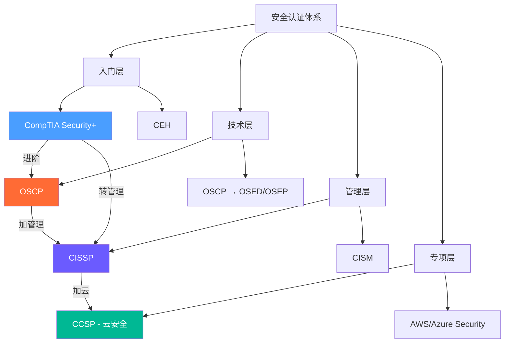
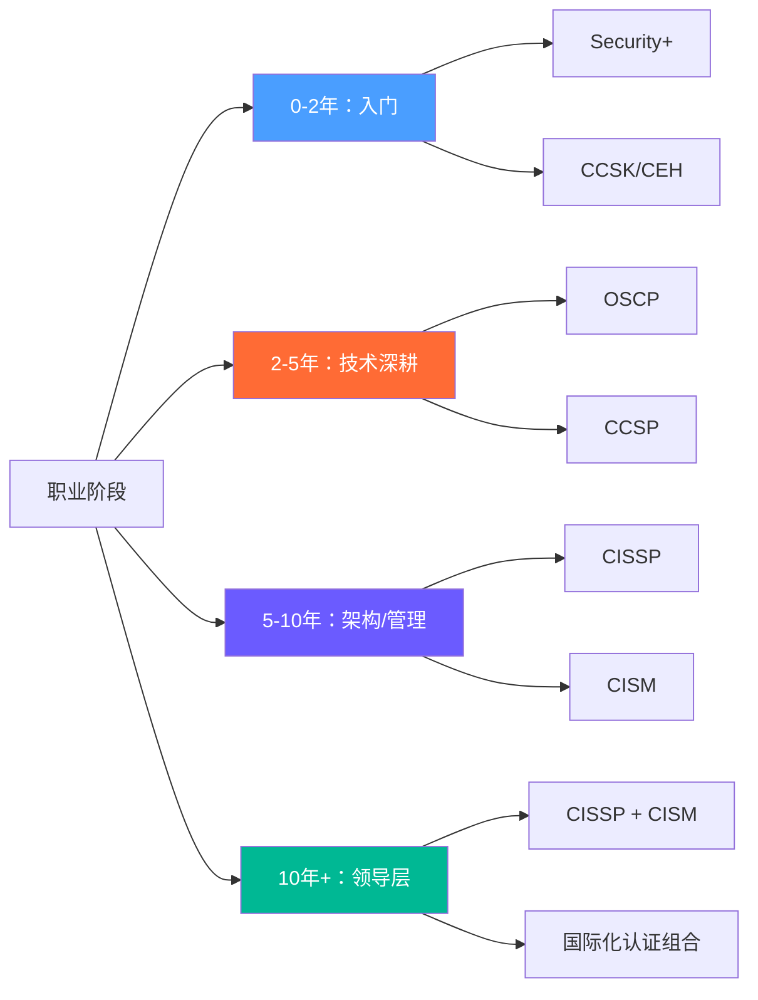

## 28.5 国际主流认证深度解析

网络安全认证不仅是一张证书，更是职业发展的**能力认证框架**——它向雇主证明你具备特定领域的知识体系和实操能力。然而面对琳琅满目的认证选项，许多从业者陷入"考什么""怎么考""值不值"的困惑。本章将对六大国际主流安全认证进行全方位深度解析，涵盖考试细节、备考策略、薪资影响、性价比分析以及职业发展路径，帮助你做出最明智的认证投资决策。

### 28.5.1 认证体系全景：从入门到专家

在选择认证之前，首先需要理解安全认证的**层次化结构**。不同认证对应不同职业阶段和技术方向，盲目追高或贪多求全都是常见误区。

**认证层次说明**：

| 层次 | 代表认证 | 目标读者 | 核心价值 |
|------|---------|---------|---------|
| 入门层 | Security+, CEH | 0-3年经验 | 建立安全知识体系，满足合规门槛 |
| 技术层 | OSCP, GPEN | 2-5年经验 | 证明实战能力，技术岗位敲门砖 |
| 管理层 | CISSP, CISM | 5+年经验 | 证明管理能力，晋升安全经理/CISO |
| 专项层 | CCSP, AWS Security | 3+年经验 | 证明云安全专长，差异化竞争 |

**认证投资回报率（ROI）总览**：

| 认证 | 总投入（课程+考试） | 薪资提升（中位数） | 回本周期 | ROI评级 |
|------|-------------------|-------------------|---------|---------|
| Security+ | $500-$800 | +$8,000-$12,000/年 | 即时 | ⭐⭐⭐⭐⭐ |
| CEH | $2,000-$3,500 | +$5,000-$10,000/年 | 3-6个月 | ⭐⭐⭐ |
| OSCP | $1,800-$2,500 | +$15,000-$25,000/年 | 即时 | ⭐⭐⭐⭐⭐ |
| CISSP | $3,000-$5,000 | +$20,000-$35,000/年 | 即时 | ⭐⭐⭐⭐⭐ |
| CISM | $1,500-$2,500 | +$15,000-$25,000/年 | 即时 | ⭐⭐⭐⭐ |
| CCSP | $1,500-$2,500 | +$12,000-$20,000/年 | 1-3个月 | ⭐⭐⭐⭐ |

> **数据来源**：Global Information Security Workforce Study (GISWS) 2024、Certified Professional Salary Survey、Glassdoor/Payscale综合数据。薪资提升为持证与未持证同类岗位的中位数差异，实际因地区、公司规模、个人经验而异。

### 28.5.2 CISSP：信息安全管理的黄金标准

#### 认证概述与业界地位

CISSP（Certified Information Systems Security Professional）由(ISC)²颁发，是**全球最广泛认可**的信息安全管理认证。截至2024年，全球持有CISSP认证的专业人士超过17万人，覆盖170多个国家和地区。

CISSP的价值不仅在于知识体系，更在于其**行业标准化**作用——它是美国国防部DoD 8570/8140指令认可的IAM/IAT Level III基准认证，也是许多跨国企业安全总监职位的**硬性要求**。

**薪资数据**：根据(ISC)² 2024年薪资调查，CISSP持证者的全球平均年薪为$120,000-$150,000（美国市场），中国市场中位数约¥40-60万/年。与同级别无证安全从业者相比，薪资溢价约25-35%。

#### 考试详情

| 项目 | 具体内容 |
|------|---------|
| 考试形式 | 计算机自适应测试（CAT） |
| 题目数量 | 125-175道选择题 |
| 考试时长 | 3小时（含15分钟教程） |
| 及格分数 | 700/1000 |
| 考试费用 | $749（首次） |
| 重考费用 | $599（30天后） |
| 考试语言 | 英语、简体中文、日语等12种语言 |
| 考试中心 | Pearson VUE全球考试中心或在线监考 |

**CAT自适应机制详解**：CISSP采用计算机自适应测试（Computerized Adaptive Testing），题目难度会根据你的答题表现实时调整。答对题目后下一道更难，答错后下一道更简单。系统在你有95%置信度判断你"通过"或"不通过"时立即结束考试，因此实际题目数量在125-175道之间浮动。这意味着：**前面的题目权重极高**——前20道题答错5道以上，基本意味着很难翻盘。建议前30道题宁可多花时间仔细审题，也不要急着提交。

#### 八大知识领域详解

CISSP的知识体系被称为**CBK（Common Body of Knowledge）**，涵盖信息安全的全部8个领域。每个领域的权重决定了考题数量分布：

| 编号 | 领域名称 | 权重 | 约考题数 | 核心主题 |
|------|---------|------|---------|---------|
| 1 | 安全与风险管理 | 15% | 19-26题 | CIA三元组、风险管理框架、合规要求 |
| 2 | 资产安全 | 10% | 13-18题 | 数据分类、隐私保护、资产生命周期 |
| 3 | 安全架构与工程 | 13% | 16-23题 | 密码学、安全模型、物理安全 |
| 4 | 通信与网络安全 | 13% | 16-23题 | OSI模型、网络架构、安全协议 |
| 5 | 身份与访问管理 | 13% | 16-23题 | AAA协议、身份生命周期、SSO |
| 6 | 安全评估与测试 | 12% | 15-21题 | 渗透测试、审计、漏洞评估 |
| 7 | 安全运营 | 13% | 16-23题 | 事件响应、灾备、取证分析 |
| 8 | 软件开发安全 | 11% | 14-19题 | SDLC、OWASP、安全编码 |

**备考重点**：领域1（安全与风险管理）权重最高且是很多考生失分的重灾区，需要特别关注风险管理方法论（NIST RMF、ISO 31000）、法律合规要求（GDPR、HIPAA、PCI DSS）以及职业道德准则。领域5（身份与访问管理）和领域7（安全运营）是实操性最强的部分，需要结合实际工作场景理解。

**高分策略**：领域1+5+7合计占41%的考题，是投入产出比最高的三个领域。建议将50%的备考时间分配给这三个核心领域。

#### 报考条件

CISSP的报考门槛较高，这也是其含金量的保证：

- **工作经验**：至少5年累计信息安全相关工作经验，领域至少覆盖CBK的2个及以上
- **学位抵免**：拥有学士学位可抵免1年经验（4年即可）；拥有(ISC)²认可的硕士学位（如信息安全硕士）可抵免2年
- **背书流程**：通过考试后需要一位持有有效CISSP认证的(ISC)²会员背书，或由(ISC)²直接审核
- **Associate路径**：不满足经验要求的考生可以通过考试成为"(ISC)² Associate"，在积累够经验后申请正式认证
- **持续教育**：持证后每年需要40个CPE（Continuing Professional Education）学分
- **年费**：年度维护费$125

#### 备考策略与时间规划

CISSP的通关率约50%（首次），需要系统化备考：

**推荐备考周期：3-6个月**

| 阶段 | 时间 | 任务 | 推荐资源 |
|------|------|------|---------|
| 基础学习 | 6-8周 | 通读CBK教材，建立知识框架 | *CISSP官方学习指南*（Sybex）、*CISSP All-in-One* |
| 强化训练 | 4-6周 | 专项刷题，识别薄弱领域 | Boson题库、Sybex配套练习 |
| 模拟冲刺 | 2-4周 | 全真模拟，计时训练 | Official (ISC)² Practice Tests |
| 考前回顾 | 1-2周 | 错题回顾，记忆重点 | 自整理笔记、Sunflower PDF |

**关键资源**：
- 官方教材：*(ISC)² CISSP Certified Information Systems Security Professional Official Study Guide*（Sybex，第9版）
- 视频课程：LinkedIn Learning CISSP课程（Mike Chapple主讲）
- 刷题工具：Boson ExSim-Max CISSP（业界公认最接近真实考试）
- 社区支持：r/cissp（Reddit社区，经验贴非常实用）
- 中文资源：CISSP官方中文学习指南、安全牛CISSP备考专栏

#### 适合人群

- **安全经理/安全总监**：CISSP是管理岗位的首选认证
- **安全架构师**：需要从全局视角设计安全方案
- **CISO/安全顾问**：高层安全职位往往要求CISSP
- **转管理岗的技术人员**：CISSP帮助你从技术思维转向风险管理思维

#### 常见误区

1. **"CISSP是技术认证"** —— 实际上CISSP偏向管理和架构，纯技术人员反而会觉得"不够硬核"
2. **"有CISSP就能做安全经理"** —— CISSP证明知识储备，但管理能力还需要实际经验
3. **"刷题就能过"** —— CISSP考察的是安全**思维**而非记忆，仅靠刷题很难通过
4. **"必须一次性通过"** —— CISSP允许多次重考，首次不过很常见，不必过度焦虑

### 28.5.3 OSCP：渗透测试的实战之王

#### 认证概述与业界地位

OSCP（Offensive Security Certified Professional）由Offensive Security（OffSec）颁发，是渗透测试领域**最具含金量的实战认证**。与其他理论型认证不同，OSCP的核心在于**动手能力**——考生需要在24小时内攻破多台靶机，再花24小时撰写渗透测试报告。

截至2024年，全球约10万人持有OSCP认证，虽然数量不及CISSP，但其在**红队和渗透测试圈**的认可度极高。许多安全公司的渗透测试岗位都明确要求或优先考虑OSCP持证者。

**薪资数据**：OSCP持证者的薪资溢价在攻防领域最为显著。根据行业调查，渗透测试工程师持OSCP后薪资提升约20-30%，在美国市场中位数约$110,000-$140,000/年，中国市场约¥30-50万/年。在招聘市场上，OSCP是渗透测试岗位的"硬通货"——LinkedIn上约70%的渗透测试岗位提及OSCP优先。

#### 考试详情

| 项目 | 具体内容 |
|------|---------|
| 考试形式 | 24小时远程实战 + 24小时报告撰写 |
| 目标数量 | 5台靶机（含独立AD域环境） |
| 总分 | 100分 |
| 及格分数 | 70分 |
| 考试费用 | 含在课程费用中（PEN-200课程$1,499起） |
| 重考费用 | $499（一次重考资格） |
| 考试环境 | 专用VPN连接，OffSec提供Kali Linux虚拟机 |

#### 靶机分布与得分策略（2024年新格式）

2024年起OSCP考试采用全新格式，目标分布更加科学：

| 目标类型 | 数量 | 分值 | 策略 |
|---------|------|------|------|
| 独立靶机（低难度） | 1台 | 10分 | 优先攻破，建立信心 |
| 独立靶机（中难度） | 1台 | 20分 | 主要得分来源 |
| Active Directory域 | 1组3台 | 40分 | 核心得分点，需要AD攻击链技能 |
| 实验报告额外分 | — | 10分 | 提交实验练习记录可得 |

**得分策略建议**：
1. 前2小时：信息收集所有目标（nmap全端口扫描 + 目录枚举）
2. 第2-6小时：攻克低难度独立靶机（10分）
3. 第6-14小时：集中攻克AD域环境（40分，耗时最长但分值最高）
4. 第14-20小时：攻克中难度独立靶机（20分）
5. 剩余时间：验证报告、完善记录

**关键提醒**：AD域攻击是2024年改革后的核心考点，占总分40%。如果AD攻击能力薄弱，几乎不可能通过考试。建议在备考中至少花50%的时间练习AD攻击链。

#### PEN-200课程核心内容

OSCP的考试资格通过PEN-200课程获得，课程涵盖以下核心模块：

1. **渗透测试方法论**：PTES标准流程、渗透测试报告规范
2. **信息收集与侦察**：OSINT、子域名枚举、Google Hacking
3. **Web应用漏洞利用**：SQL注入、文件上传、命令注入
4. **漏洞扫描与分析**：Nessus、OpenVAS使用技巧
5. **网络服务攻击**：SMB、RDP、SSH服务漏洞利用
6. **密码攻击**：Hashcat、John the Ripper、Kerberoasting
7. **漏洞利用代码开发**：Python/Perl漏洞编写基础
8. **客户端攻击**：钓鱼、宏攻击、浏览器漏洞
9. **权限提升**：Windows/Linux本地提权技术
10. **Active Directory攻击**：AS-REP Roasting、DCSync、黄金票据
11. **渗透测试报告撰写**：专业报告模板与写作规范

#### 备考实战资源

OSCP备考**不做虚拟靶机是最大的错误**。以下是推荐的练习平台：

| 平台 | 费用 | 适合阶段 | 特点 |
|------|------|---------|------|
| Hack The Box（HTB） | $20/月起 | 全过程 | 大量退役靶机可练习，TJ Null推荐列表 |
| Proving Grounds（PG） | $20/月 | 考前冲刺 | OffSec官方推荐，风格最接近考试 |
| TryHackMe（THM） | $10/月起 | 入门阶段 | 引导式学习路径，适合零基础 |
| VulnHub | 免费 | 基础练习 | 经典靶机，Kioptrix系列是OSCP经典练习 |
| CyberDefenders | 免费/$15/月 | 蓝队方向 | 蓝队分析和事件响应练习 |
| PicoCTF | 免费 | CTF入门 | 美国CMU举办，适合新手入门CTF |

**推荐资源**：
- *The Cyber Mentor*（YouTube）的OSCP系列教程
- *IppSec*（YouTube）的HTB Walkthrough
- TJ Null的OSCP靶机推荐列表（定期更新）
- OffSec官方的Discord社区
- *HackTheBox Academy* 的AD攻击专项课程

#### 适合人群

- **渗透测试工程师**：最直接的价值体现
- **红队成员**：AD域攻击技能是红队核心能力
- **安全研究员**：培养系统化漏洞发现和利用能力
- **希望转型攻防的技术人员**：OSCP是进入安全行业的技术通行证

#### 常见误区

1. **"OSCP考一次就能过"** —— 首次通过率估计在40-50%，重考很常见
2. **"OSCP代表高级渗透测试"** —— OSCP是渗透测试的**入门认证**，只是证明了基本能力
3. **"Metasploit是万能的"** —— 考试中Metasploit只能用于1个目标，需要掌握手动利用技术
4. **"不需要写报告"** —— 报告占25%分数，且报告质量差会导致不及格
5. **"只看PEN-200课程就够了"** —— 课程提供基础，但额外练习平台（HTB/PG）才是关键

### 28.5.4 CEH：道德黑客的争议与价值

#### 认证概述

CEH（Certified Ethical Hacker）由EC-Council颁发，是**全球最知名的道德黑客认证**之一。CEH更侧重于攻击技术的理论知识和工具使用，覆盖了安全攻击的完整kill chain。

#### 考试详情

| 项目 | 具体内容 |
|------|---------|
| 考试形式 | 125道选择题 |
| 考试时长 | 4小时 |
| 及格分数 | 60%-85%（因考试版本而异） |
| 考试费用 | $1,199（首次） |
| 重考费用 | $450 |
| 前置要求 | 需参加EC-Council培训或2年安全经验 |

#### 18大考试模块

CEH的v12考试覆盖了惊人的18个模块，堪称安全知识百科全书：

1. 信息收集与侦察（Reconnaissance）
2. 扫描网络（Scanning Networks）
3. 枚举（Enumeration）
4. 系统入侵（System Hacking）
5. 恶意软件威胁（Malware Threats）
6. 嗅探与欺骗（Sniffing & Spoofing）
7. 社会工程（Social Engineering）
8. 拒绝服务攻击（DoS/DDoS）
9. 会话劫持（Session Hijacking）
10. 入侵检测与防火墙（IDS/IPS/Firewall）
11. Web服务器攻击（Web Server Attacks）
12. Web应用攻击（Web Application Attacks）
13. SQL注入（SQL Injection）
14. 无线网络攻击（Wireless Attacks）
15. 移动平台攻击（Mobile Platform Attacks）
16. IoT与OT攻击（IoT & OT Attacks）
17. 云计算攻击（Cloud Computing Attacks）
18. 密码学（Cryptography）

#### 争议与客观评价

CEH在安全行业的争议最大，需要客观看待：

**优势**：
- **知识面极广**：18个模块覆盖了安全攻击的方方面面
- **合规价值高**：被美国DoD 8570/8140列为认证基准，政府机构和军方广泛认可
- **入门友好**：不要求编程基础，内容以概念和工具为主
- **全球知名度高**：HR筛选简历时CEH是一个常见关键字

**劣势**：
- **实战性不足**：纯选择题考试，无法证明实际操作能力
- **考试费用高**：$1,199的费用在同类认证中偏贵
- **内容深度有限**：每个模块都只覆盖到表层，深度不如专项认证
- **行业口碑分化**：部分技术圈对CEH评价不高，认为"刷题就能过"

**建议定位**：CEH适合作为**合规需求**（如政府岗位）或**入门了解安全攻击领域**的起点，但不建议作为唯一认证。合理路径是：CEH（入门）+ OSCP（实战）+ CISSP（管理）。

#### 与其他认证的对比

| 维度 | CEH | Security+ | OSCP |
|------|-----|-----------|------|
| 难度 | 中等 | 低 | 高 |
| 实战性 | 低 | 中 | 极高 |
| 合规认可 | 高（DoD） | 高（DoD） | 中等 |
| 费用 | $1,199 | $392 | $1,499+ |
| 技术圈认可 | 中等 | 中等 | 极高 |
| 备考时间 | 4-8周 | 6-8周 | 3-6个月 |

### 28.5.5 CompTIA Security+：信息安全入门首选

#### 认证概述

CompTIA Security+是全球认可的**入门级安全认证**，被美国国防部DoD 8570/8140认可为基准认证（IAT Level II）。与其他入门认证相比，Security+最大的优势是**无前置经验要求**，且内容覆盖了安全领域的基础知识。

#### 考试详情

| 项目 | 具体内容 |
|------|---------|
| 考试形式 | 最多90道选择题 + 实操题（PBQ） |
| 考试时长 | 90分钟 |
| 及格分数 | 750/900 |
| 考试费用 | $392 |
| 重考政策 | 第一次重考免费（需购买考试券时选择） |
| 续证周期 | 3年，需60个CEU或通过下一级认证 |

#### 五大考试领域（SY0-701版本）

Security+ 2024年更新的SY0-701版本对内容做了大幅调整，反映了当前行业趋势：

| 领域 | 权重 | 新增/强化内容 |
|------|------|-------------|
| 1. 威胁、攻击和漏洞 | 24% | 新增社会工程攻击类别、供应链攻击 |
| 2. 安全架构与设计 | 21% | 强化云安全、零信任架构 |
| 3. 实施 | 25% | 新增数据保护技术、安全配置 |
| 4. 安全运营与事件响应 | 16% | 新增OT/ICS安全基础知识 |
| 5. 治理、风险与合规 | 14% | 强化隐私保护法规（GDPR、CCPA） |

**SY0-701 vs SY0-601变化**：新版大幅删减了过时内容（如旧版网络设备配置），新增了云安全、零信任、IoT安全等现代安全话题。如果你还在用旧版教材备考，建议切换到SY0-701版本。

#### 独特优势

1. **无前置门槛**：不要求工作经验，在校生或转行者均可报考
2. **政府合规**：DoD 8570/8140指令明确要求，美国政府IT岗位必备
3. **全球雇主认可**：被全球超过1,800家企业和政府机构认可
4. **国际标准**：符合ISO 17024标准，是真正意义上的国际认证
5. **基础扎实**：为CISSP、CASP+等高级认证打下坚实基础

#### 备考策略

Security+相对难度较低，但PBQ（Performance-Based Questions）实操题需要重视：

**推荐备考周期：6-8周**

- 第1-2周：通读教材，*CompTIA Security+ Get Certified Get Ahead*（Darril Gibson）
- 第3-4周：观看视频课程，Professor Messer的免费YouTube课程最佳
- 第5-6周：刷题练习，Jason Dion的课程练习题（Udemy）
- 第7周：模拟考试，目标分数稳定在850+
- 第8周：PBQ专项训练+错题回顾

**PBQ实操题应对策略**：PBQ是Security+考试中最具挑战性的题型，要求你在模拟环境中完成配置、排错或分析操作。建议：
- 熟悉常见网络拓扑图的阅读和分析
- 掌握防火墙规则配置、VPN设置、证书管理等常见操作
- 练习CompTIA CertMaster Labs提供的实操环境
- 考试时先跳过PBQ完成所有选择题，再回头集中处理PBQ

**费用节省技巧**：
- 购买考试券时选择**捆绑包**（考试+重考），价格与单次考试相当
- 学生可通过CompTIA Academic Partner项目享受折扣
- 关注CompTIA年度促销（通常6月和11月）

#### 适合人群

- **零基础转行安全**：最合理的起点
- **在校学生**：毕业前获得，提升简历竞争力
- **IT运维转安全**：利用已有IT经验，快速补充安全知识
- **政府/军队IT人员**：DoD合规硬性要求

### 28.5.6 CISM：安全经理的进阶之选

#### 认证概述

CISM（Certified Information Security Manager）由ISACA颁发，专注于**信息安全管理和治理**，与CISSP形成互补关系。如果说CISSP是"技术架构师"，那么CISM就是"安全管理者"。

#### 考试详情

| 项目 | 具体内容 |
|------|---------|
| 考试形式 | 150道选择题 |
| 考试时长 | 4小时 |
| 及格分数 | 450/800 |
| 考试费用 | ISACA会员$575，非会员$760 |
| 考试语言 | 英语（ISACA正在增加其他语言选项） |
| 前置要求 | 5年信息安全管理工作经验（其中3年安全管理经验） |

#### 四大知识领域

CISM的知识体系只有4个领域，但每个领域的深度远超CISSP：

| 领域 | 权重 | 核心内容 | 难度评价 |
|------|------|---------|---------|
| 1. 信息安全治理 | 17% | 信息安全战略、治理框架、组织架构 | ⭐⭐⭐ |
| 2. 信息风险管理 | 20% | 风险评估方法论、风险处理策略、合规管理 | ⭐⭐⭐⭐ |
| 3. 信息安全计划开发与管理 | 33% | 安全计划设计、安全架构、资源管理 | ⭐⭐⭐⭐⭐ |
| 4. 信息安全事件管理 | 30% | IR流程、BCP/DRP、取证与根因分析 | ⭐⭐⭐⭐ |

**CISM考试特点**：与CISSP不同，CISM的题目更侧重"管理决策"而非"技术知识"。典型题型是"你作为安全经理应该怎么做"，答案往往不是"最安全"的选项，而是"最符合业务需求"的选项。这要求考生具备**将安全融入业务**的思维。

#### CISSP vs CISM：如何选择

| 维度 | CISSP | CISM |
|------|-------|------|
| 颁发机构 | (ISC)² | ISACA |
| 侧重方向 | 安全架构与技术 | 安全管理与治理 |
| 知识领域 | 8个CBK领域 | 4个管理领域 |
| 考试难度 | 较高（题目更诡诈） | 中等偏高（概念要深入） |
| 适合角色 | 安全架构师、安全经理 | 安全经理、CISO |
| 工作经验要求 | 5年（可抵免） | 5年（其中3年管理经验） |
| 全球持证人数 | 17万+ | 约6万 |
| 政府认可度 | 极高（DoD 8570） | 高（DoD 8570） |
| 年费 | $125 | ISACA会员 $135 + CISM年费 $45 |

**选择策略**：
- 如果当前是技术岗位但希望转向管理 → 先CISSP后CISM
- 如果已经是管理岗、需要提升战略视野 → CISM更直接
- 如果时间和预算有限 → CISSP优先级更高（更通用）
- **最佳组合**：CISSP + CISM 覆盖管理与技术两条线，是CISO的标配认证组合

#### 适合人群

- **现任或预备安全经理**
- **CISO/副总裁级别管理者**
- **IT审计与合规人员**：ISACA的核心受众
- **风险管理人员**

### 28.5.7 CCSP：云安全的权威认证

#### 认证概述

CCSP（Certified Cloud Security Professional）由(ISC)²颁发，是**云安全领域的权威认证**。随着企业上云加速，CCSP的需求量持续增长。

#### 考试详情

| 项目 | 具体内容 |
|------|---------|
| 考试形式 | 125道选择题 |
| 考试时长 | 4小时 |
| 及格分数 | 700/1000 |
| 考试费用 | $599 |
| 前置要求 | 至少5年IT经验（含3年信息安全、1年云安全），或CISSP+1年云经验 |

**CCSP与CISSP的关系**：持有CISSP的考生可以**豁免1年云安全经验要求**，只需5年IT经验（含3年信息安全）即可报考。这是(ISC)²为CISSP持证者提供的便利通道，也是"CISSP+CCSP"认证组合的基础。

#### 六大知识领域

| 领域 | 权重 | 核心内容 |
|------|------|---------|
| 1. 云概念、架构与设计 | 17% | 云部署模型、虚拟化、容器化 |
| 2. 云数据安全 | 19% | 数据加密、DLP、密钥管理 |
| 3. 云平台与基础设施安全 | 17% | 基础设施保护、合规评估 |
| 4. 云应用安全 | 17% | 安全SDLC、DevSecOps、API安全 |
| 5. 云安全运营 | 16% | 事件响应、取证、监控 |
| 6. 法规、风险与合规 | 14% | GDPR、HIPAA、行业合规要求 |

**备考重点**：云数据安全（领域2）权重最高，需要深入理解数据加密在云环境中的实现方式、CASB（Cloud Access Security Broker）的功能和部署模式，以及云环境下的密钥管理最佳实践。云应用安全（领域4）需要掌握DevSecOps流程和容器安全（Docker/Kubernetes安全配置）。

#### 云安全认证全景对比

| 认证 | 颁发机构 | 侧重 | 范围 | 难度 | 费用 | 持证人数 |
|------|---------|------|------|------|------|---------|
| CCSP | (ISC)² | 云安全架构 | 多云 | 高 | $599 | 约3万 |
| CCSK | CSA | 云安全知识 | 理论 | 中低 | $395 | 约5万 |
| AWS Security Specialty | AWS | AWS安全 | AWS | 中 | $150 | 约2万 |
| Microsoft SC-100 | Microsoft | Azure安全 | Azure | 中高 | $165 | 较少 |
| Google Professional Cloud Security | Google | GCP安全 | GCP | 中 | $200 | 较少 |

**选择建议**：
- 需要通用云安全知识 → CCSP（厂商中立，权威性最高）
- 从事AWS生态 → AWS Security Specialty + CCSP
- 从事Azure生态 → SC-100 + CCSP
- 预算有限且刚接触云安全 → CCSK（费用最低，内容扎实）

#### 适合人群

- **云安全工程师/架构师**
- **安全运维人员（转向云环境）**
- **CISSP持证者扩展云安全能力**：CISSP+CCSP是最强认证组合
- **混合云环境的安全管理者**

### 28.5.8 补充认证：不可忽视的专项选择

除了上述六大主流认证外，还有一些**高性价比的专项认证**值得关注，尤其在特定细分领域具有独特价值：

#### GPEN（GIAC Penetration Tester）

| 项目 | 内容 |
|------|------|
| 颁发机构 | GIAC（SANS Institute） |
| 考试形式 | 82道选择题，4小时 |
| 费用 | $2,499（含SANS培训）或$949（仅考试） |
| 定位 | OSCP的姊妹认证，侧重方法论和报告 |
| 适合人群 | 企业渗透测试团队、安全咨询师 |

GPEN与OSCP的主要区别：GPEN侧重渗透测试方法论和商业环境下的报告规范，OSCP侧重实战攻破能力。两者互补而非替代——有OSCP证明攻破能力，有GPEN证明方法论和专业性。

#### GWAPT（GIAC Web Application Penetration Tester）

| 项目 | 内容 |
|------|------|
| 颁发机构 | GIAC（SANS Institute） |
| 考试形式 | 82道选择题，4小时 |
| 费用 | $2,499（含SANS培训）或$949（仅考试） |
| 定位 | Web应用安全专项 |
| 适合人群 | Web安全工程师、应用安全团队 |

#### CRISC（Certified in Risk and Information Systems Control）

| 项目 | 内容 |
|------|------|
| 颁发机构 | ISACA |
| 考试形式 | 150道选择题，4小时 |
| 费用 | ISACA会员$575，非会员$760 |
| 定位 | IT风险管理专项 |
| 适合人群 | IT风险管理师、合规分析师、审计人员 |

CRISC是CISM的"风险专精版"，在IT风险管理领域认可度极高，尤其适合金融、医疗等强监管行业。

**认证组合推荐**：

| 职业方向 | 推荐组合 | 总投资 |
|---------|---------|--------|
| 渗透测试专家 | OSCP + GPEN + GWAPT | ~$5,000 |
| 安全架构师 | CISSP + CCSP | ~$3,500 |
| 安全管理者/CISO | CISSP + CISM | ~$4,000 |
| 云安全专家 | CCSP + AWS Security | ~$1,000 |
| IT风险管理 | CISM + CRISC | ~$2,500 |

### 28.5.9 认证选择策略：如何规划你的认证路线

#### 职业阶段匹配

#### 按职业方向推荐

**攻防方向（红队/渗透测试）**：
1. Security+（建立基础，可选）
2. OSCP（核心认证，必考）
3. OSED/OSEP（进阶，Windows漏洞利用/高级AD攻击）
4. CISSP（管理视角，拓展职业宽度）

**防御方向（蓝队/SOC）**：
1. Security+（基础）
2. CySA+ / GCIA（中级，防御分析）
3. CISSP（管理基础）
4. CISM / CCSP（根据方向选择）

**管理方向（安全经理/CISO）**：
1. Security+或CEH（合规需求）
2. CISSP（核心认证，必考）
3. CISM（管理深化）
4. CCSP（云时代必需）

**云安全方向**：
1. CCSP（核心认证）
2. AWS/Azure/Google专项认证（平台深耕）
3. CISSP（管理广度）

**合规与审计方向**：
1. Security+（基础）
2. CISA（审计专项，ISACA）
3. CISM（管理深化）
4. CRISC（风险管理）

#### 认证避坑指南

| 常见错误 | 正确做法 | 为什么 |
|---------|---------|--------|
| 不顾经验盲目报CISSP | 先确认满足5年经验要求 | 考试通过但无法认证通过 |
| 只考CEH不考OSCP | CEH后补充实战能力 | 纯理论认证在技术圈认可度低 |
| 一次性报考多个认证 | 集中精力一次性攻克一个 | 分散精力导致每个都准备不充分 |
| 忽略续证成本 | 提前规划CPE获取渠道 | 每年CPE要求需要持续投入 |
| 只看考试费用不看课程费用 | 考虑培训+考试+补考+续证总成本 | OSCP等课程费用远超考试费 |
| 盲目追求"最高级别"认证 | 选择与当前阶段匹配的认证 | 过高难度导致挫败感和资源浪费 |

### 28.5.10 认证维护与续证指南

获得认证只是起点，**持续维护**才是长期投入。以下是各认证的续证要求对比：

| 认证 | 续证周期 | 年度要求 | CPE/CEU | 年费 | 失效后果 |
|------|---------|---------|---------|------|---------|
| CISSP | 3年 | 40 CPE/年 | 120 CPE/周期 | $125 | 认证失效，需重新考试 |
| OSCP | 3年 | 通过更高级认证或重新考试 | — | $0 | 认证失效 |
| CEH | 3年 | 120 ECE/周期 | 按EC-Council要求 | $80 | 认证失效 |
| Security+ | 3年 | 60 CEU/周期 | 按CompTIA要求 | $75 | 认证失效 |
| CISM | 3年 | 20 CPE/年 | 120 CPE/周期 | $45+会员费 | 认证失效 |
| CCSP | 3年 | 30 CPE/年 | 90 CPE/周期 | $125 | 认证失效 |

**CPE获取渠道**：
- **行业会议**：Black Hat、RSA Conference、DEF CON等（通常1天=8 CPE）
- **在线课程**：SANS Webcasts（免费，每次1-2 CPE）
- **专业培训**：公司内部安全培训可申请CPE
- **发表文章**：撰写安全技术博客/论文可获CPE
- **志愿服务**：参与安全社区志愿活动可获CPE
- **教学授课**：教授安全课程可获CPE

**续证策略**：
1. **集中获取**：每年参加1-2个行业会议即可满足年度CPE要求
2. **日常积累**：订阅SANS免费Webcast，每周花1小时观看
3. **证书复用**：考取更高级认证可同时满足多个认证的续证要求（如CISSP考试通过可同时满足Security+续证）
4. **设置提醒**：在日历中设置续证截止前6个月的提醒，避免过期

### 28.5.11 学习资源汇总

#### 通用学习平台

| 平台 | 适用认证 | 费用 | 推荐理由 |
|------|---------|------|---------|
| Udemy | Security+, CEH, CISSP | $10-20/课程 | 课程丰富，折扣频繁 |
| LinkedIn Learning | CISSP, CCSP | 月费$29.99 | 专业人士授课 |
| Pluralsight | 全系列 | 月费$35 | 技能评估+学习路径 |
| Cybrary | CISSP, Security+ | 免费/高级$29/月 | 专门安全学习平台 |
| YouTube | 全系列（Professor Messer, IppSec） | 免费 | 高质量免费内容 |

#### 刷题平台

| 平台 | 适用认证 | 费用 | 真实度 |
|------|---------|------|--------|
| Boson ExSim | CISSP, Security+ | $99 | ⭐⭐⭐⭐⭐（最接近真实考试） |
| Official (ISC)² Practice Tests | CISSP, CCSP | $39.99 | ⭐⭐⭐⭐ |
| Jason Dion模拟题 | Security+ | $15-20 | ⭐⭐⭐⭐ |
| Pocket Prep | 多认证 | 免费/高级$9.99/月 | ⭐⭐⭐ |

#### 社区与论坛

- **Reddit**: r/cissp, r/oscp, r/CompTIA, r/SecurityCareerAdvice
- **Discord**: The Cyber Mentor社区、OffSec官方社区
- **Telegram**: 各认证备考群（中文考生资源丰富）
- **微信公众号**: 安全圈、FreeBuf、安全牛（中文资讯与备考经验）

### 28.5.12 常见误区与终极建议

#### 最普遍的5个认知误区

**误区一：认证越多越好**
真相：认证的价值在于**深度**而非数量。1个核心认证（如CISSP或OSCP）远胜于5个入门认证。雇主更看重你通过认证证明的能力深度，而不是证书数量。

**误区二：有认证就等于有能力**
真相：认证只是**知识体系的证明**，不是能力的保证。真正的安全能力来源于实际项目经验。认证可以帮助你通过简历筛选，但面试和工作中看的是真本事。

**误区三：有了OSCP就完成了学习**
真相：OSCP是渗透测试的**起点**而非终点。OSCP只验证了基础的渗透测试能力，之后还需要深入学习AD攻击、免杀技术、移动安全、云渗透等方向。

**误区四：CISSP是最高级别的安全认证**
真相：CISSP是管理层的"标配"而非"顶配"。在CISSP之上还有CISSP-ISSAP（架构）、ISSEP（工程）、ISSMP（管理）等专项，以及后续的CISM、CRISC等管理认证。

**误区五：考试通过就万事大吉**
真相：认证的维护（CPE学分、年费）是持续投入。每年40个CPE学分需要你有意识地去获取，否则认证会失效。建议在选择认证时就将**续证成本**纳入考量。

#### 考试当天实用建议

1. **提前踩点**：线下考试提前一天确认考场位置、交通路线、停车情况
2. **证件准备**：携带两份有效身份证件（一份必须带照片）
3. **饮食安排**：考试前吃清淡食物，避免咖啡因过量导致焦虑
4. **时间管理**：CISSP/CISM等长考试建议每30题休息2分钟，保持专注度
5. **心态调整**：遇到不确定的题目先标记跳过，不要在单题上浪费超过3分钟
6. **技术准备**：远程考试提前30分钟测试网络、摄像头、麦克风

#### 最终建议

1. **先定位，后选择**：明确自己的职业方向和技术阶段，选择最适合的1-2个认证
2. **质量优于数量**：一个认证深入准备，远比走马观花考三个认证有价值
3. **理论与实践并重**：备考CISSP的同时做实际项目，备考OSCP的同时学习理论知识
4. **持续更新**：安全行业日新月异，认证只是起点，持续学习才是核心竞争力
5. **成本考量**：考虑总拥有成本（TCO）= 考试费 + 培训费 + 重考概率×重考费 + 年费 + CPE成本
6. **利用雇主资源**：许多公司提供认证报销政策（通常$2,000-$5,000/年），申请前先了解公司政策

---

> **总结**：国际安全认证是职业发展的加速器，但不是终点。六个认证各有定位和受众，没有"最好"的认证，只有"最适合"的认证。建议读者根据自己的职业阶段、技术方向和预算情况，制定3-5年的认证规划，逐步积累、持续进步。记住：认证是敲门砖，真正的竞争力来自于认证背后的知识、技能和经验。
