## 28.6 中国安全认证体系

中国安全认证体系是国内网络安全人才评价的核心框架，与国家信息安全战略、等级保护制度、关键信息基础设施保护法规紧密耦合。与ISC²、CompTIA等国际认证体系不同，中国安全认证体系具有三个显著特征：**政策驱动性强**（认证需求直接来自法律法规的合规要求）、**行业门槛明确**（政府采购和央企招标中认证是刚性条件）、**与国家标准深度绑定**（知识体系与GB/T系列标准直接衔接）。理解这些特征，是制定中国安全认证规划的前提。

```mermaid
graph TD
    A[中国安全认证体系] --> B[CISP系列]
    A --> C[NISP系列]
    A --> D[等保测评师]
    A --> E[CSAC/CCSC]
    A --> F[CSA云安全认证]

    B --> B1[CISE 通用工程师]
    B --> B2[CISO 管理方向]
    B --> B3[CISP-PTE 渗透入门]
    B --> B4[CISP-PTS 渗透专家]
    B --> B5[CISP-IRE 应急响应]
    B --> B6[CISP-ICSSE 工控安全]
    B --> B7[CISP-DSG 数据安全]
    B --> B8[CISP-CSE 云安全]
    B --> B9[CISP-AI 人工智能安全]

    C --> C1[NISP一级 通识]
    C --> C2[NISP二级 专业基础→转CISP]
    C --> C3[NISP三级 高级技能]

    D --> D1[初级 测评助理]
    D --> D2[中级 测评师]
    D --> D3[高级 高级测评师]

    E --> E1[CCSC-I 入门]
    E --> E2[CCSC-II 中级]
    E --> E3[CSAC 安全审计]

    F --> F1[C-CCSK 云安全基础]
    F --> F2[CCSSP 云安全专家]

    style A fill:#1a1a2e,stroke:#e94560,color:#fff
    style B fill:#16213e,stroke:#e94560,color:#fff
    style C fill:#16213e,stroke:#0f3460,color:#fff
    style D fill:#16213e,stroke:#0f3460,color:#fff
    style E fill:#16213e,stroke:#0f3460,color:#fff
    style F fill:#16213e,stroke:#0f3460,color:#fff
```



### 28.6.1 CISP系列认证详解

CISP（Certified Information Security Professional，注册信息安全专业人员）由中国信息安全测评中心（CNITSEC，China Information Technology Security Evaluation Center）于2002年推出，是国内最早、规模最大、认可度最高的信息安全人员认证体系。截至2025年，持证人数已超过15万人，覆盖政府、金融、能源、电信、交通等关键行业。CISP的权威性不仅来自颁发机构的国家级背景，更来自其与国家网络安全法律法规体系的深度绑定——许多法律条款的执行需要CISP持证人员作为技术支撑。

#### 28.6.1.1 颁发机构与权威背景

中国信息安全测评中心是中央直属的国家级信息安全测评机构，负责信息技术产品、信息系统、信息安全服务的安全测评，同时承担国家信息安全人员认证工作。CISP认证的权威性来源于：

- **国家授权**：依据《网络安全法》和《信息安全等级保护管理办法》授权开展人员认证
- **行业标准支撑**：CISP知识体系与GB/T 22239（等保2.0）、GB/T 25069（信息安全技术术语）等国家标准衔接
- **政府采购门槛**：在党政机关、央企的信息安全服务招标中，CISP证书常被列为供应商团队成员的必备资质
- **国际互认**：CISP与ISC²的CISSP已实现部分互认，持CISP可申请直接参加CISSP考试的部分免修

#### 28.6.1.2 CISP认证方向与定位

CISP系列已从最初的单一工程师认证发展为覆盖多个专业方向的人才认证体系：

| 认证代码 | 全称 | 定位 | 目标岗位 | 工作年限要求 |
|---------|------|------|---------|------------|
| CISE | 注册信息安全工程师 | 技术基础 | 安全运维、安全审计、安全设计 | 本科1年/专科3年 |
| CISO | 注册信息安全管理人员 | 管理方向 | 安全主管、信息安全管理 | 本科3年/专科5年 |
| CISP-PTE | 注册渗透测试工程师 | 渗透测试入门 | 渗透测试工程师、安全服务工程师 | 无严格限制 |
| CISP-PTS | 注册渗透测试专家 | 高级渗透测试 | 高级渗透测试、红队专家 | 建议2年+实战经验 |
| CISP-IRE | 注册应急响应工程师 | 应急响应 | 安全运营中心分析师、应急响应工程师 | 无严格限制 |
| CISP-ICSSE | 注册工业控制系统安全工程师 | 工控安全 | 工控安全工程师、SCADA安全顾问 | 建议1年+工控经验 |
| CISP-DSG | 注册数据安全治理专业人员 | 数据安全 | 数据安全官(DSO)、数据安全合规 | 建议2年+数据安全经验 |
| CISP-CSE | 注册云安全工程师 | 云安全 | 云安全工程师、云安全架构师 | 建议1年+云安全经验 |
| CISP-AI | 注册人工智能安全工程师 | AI安全 | AI安全工程师、模型安全评估 | 建议1年+AI/安全经验 |

**认证方向选择逻辑：**

1. **入门选择**：安全行业新人（0-2年经验）优先选择CISE或CISP-PTE。CISE覆盖面广，适合安全运维、安全评估等通用岗位；CISP-PTE侧重实战，适合对渗透测试感兴趣的新人。
2. **管理晋升**：已具备3年以上安全经验、向管理岗位发展的从业者选CISO。部分企业将CISO与安全主管、安全经理的任职资格挂钩。
3. **专业深耕**：根据技术方向选择专业认证。专注于Web安全/红队的选PTS，专注于数据治理的选DSG，专注于工控安全的选ICSSE，专注于AI安全的选CISP-AI。

> **CISP-AI 新方向说明**：随着《生成式人工智能服务管理暂行办法》（2023年8月实施）和《人工智能安全治理框架》的出台，AI安全人才需求快速增长。CISP-AI是中国信息安全测评中心于2024年推出的新方向，覆盖AI模型安全评估、对抗样本防御、AI伦理治理、大模型安全合规等前沿领域。该认证的推出标志着中国安全认证体系正式进入AI安全赛道。

#### 28.6.1.3 考试内容与知识体系

CISP全部方向均采用**闭卷笔试**形式，考试时长120分钟。以最基础的CISE方向为例，考试覆盖10大知识域：

| 知识域 | 占比 | 核心内容 |
|--------|------|---------|
| 信息安全保障 | 8% | 安全保障概念、安全保障模型、保障框架 |
| 网络安全监管 | 10% | 法律法规（网络安全法、数据安全法、个人信息保护法）、标准体系、等级保护 |
| 信息安全管理 | 15% | 管理体系（ISO 27001）、风险评估、安全策略、安全组织 |
| 信息安全工程 | 10% | 安全工程过程、安全架构、安全开发生命周期（SDL） |
| 信息安全评估 | 8% | 安全评估方法、渗透测试方法论、安全审计 |
| 密码学 | 10% | 对称/非对称加密、哈希、PKI体系、数字签名、国密算法（SM2/SM3/SM4） |
| 网络安全 | 12% | 网络架构安全、防火墙/VPN/IDS/IPS、网络攻击与防护 |
| 系统安全 | 10% | 操作系统安全加固、恶意代码防护、补丁管理 |
| 应用安全 | 10% | Web安全、中间件安全、API安全、安全开发 |
| 数据安全 | 7% | 数据分类分级、数据脱敏、数据防泄漏（DLP） |

**考试形式对比：**

| 认证方向 | 题型 | 题目数量 | 及格线 | 考试时长 |
|---------|------|---------|--------|---------|
| CISE/CISO | 100道单选 | 100题 | 70分/100分 | 120分钟 |
| CISP-PTE | 选择题+实操 | 40题选择+4道实操 | 70分/100分 | 120分钟（选择）+180分钟（实操） |
| CISP-PTS | 选择题+实操 | 40题选择+4道综合实操 | 70分/100分 | 120分钟（选择）+240分钟（实操） |
| CISP-DSG | 100道单选 | 100题 | 70分/100分 | 120分钟 |
| CISP-IRE | 100道单选 | 100题 | 70分/100分 | 120分钟 |

**PTS实操考试特点**：PTS实操考试要求在4小时内完成一套完整的渗透测试任务，包括信息收集、漏洞发现、漏洞利用、权限提升、内网横向移动等环节，使用环境为模拟的企业内网环境。考试难度相当于中级实战水平。

#### 28.6.1.4 国密算法专题（考试高频考点）

国密算法（SM系列）是CISP考试的必考内容，也是中国安全认证体系区别于国际认证的核心知识点。掌握国密算法不仅是考试需要，更是理解中国密码产业政策的基础：

| 算法 | 全称 | 类型 | 密钥长度 | 应用场景 | 对标国际算法 |
|------|------|------|---------|---------|-------------|
| SM1 | 分组密码 | 对称加密 | 128位 | 智能IC卡、VPN | AES-128 |
| SM2 | 椭圆曲线公钥密码 | 非对称加密 | 256位 | 数字签名、密钥交换 | ECC/ECDSA |
| SM3 | 密码杂凑算法 | 哈希 | 256位输出 | 完整性校验、数字签名 | SHA-256 |
| SM4 | 分组密码 | 对称加密 | 128位 | 数据加密（WiFi/WAPI） | AES-128 |
| SM9 | 标识密码 | 非对称加密 | — | 基于标识的加密/签名 | IBE/IBS |

**考试重点提醒**：
- SM2密钥长度为256位（不是128位），常被混淆为"SM系列都是128位"
- SM3的输出长度为256位（不是128位），SM3-256是默认长度
- SM4分组长度和密钥长度均为128位，与AES-128对等
- SM9是基于标识的密码算法（IBC），不需要数字证书即可加密/签名
- 《密码法》（2020年1月实施）要求关键信息基础设施必须使用经国家密码管理局认可的密码产品，国密算法是合规的必要条件

#### 28.6.1.5 认证维持与年费

CISP证书有效期为**3年**，到期需续证。续证条件：

- 3年内获得不少于**60个继续教育学分**（CPE）
- 常用的获取方式：参加CNITSEC认可的培训课程（1天培训=8学分）、参加安全会议（如ISC大会、CSS大会，1天=4学分）、发表安全文章（每篇=10学分）
- 缴纳年金：**500元/年**，续证时一次性缴纳3年年金（即1500元）
- 超期未续证超过1年的，需重新参加考试

**CPE获取建议**：为了高效积累CPE学分，建议每年至少参加2次认可的安全会议（共约16学分），每季度撰写1篇安全技术文章（共约40学分），3年即可轻松达标60学分，无需额外参加付费培训。

#### 28.6.1.6 CISP在国内市场的价值

CISP在求职和职业发展中的实际价值体现在以下维度：

**1. 招投标资质**

在政府采购、国企招标的信息安全服务项目中，CISP证书是评估供应商团队能力的关键指标。以中国移动、国家电网等央企的安全服务招标为例，"项目团队中至少配备2名CISP持证人员"是常见的投标门槛。这意味着持证人员参与的项目可以为企业带来投标加分，因此企业愿意为持证成员承担认证费用甚至发放持证津贴。

**2. 人才引进与落户**

- 上海、深圳、杭州、成都等城市将CISP纳入**人才引进紧缺职业目录**，持证人员在申请落户时享受加分或绿色通道
- 部分城市对持有CISP且从事网络安全工作的专业人才给予**住房补贴**（如杭州每月800-1500元，发放36个月）
- 多个省市在网络安全领域**职称评定**中，将CISP作为"等同于中级职称"的参考依据

**3. 薪酬提升**

根据猎聘、BOSS直聘等招聘平台的2024年数据，持有CISP证书的安全从业人员平均薪资比未持证的同行高出**18%-25%**。具体而言：

| 岗位 | 无证薪资范围 | 持CISP薪资范围 | 涨幅 |
|------|------------|--------------|------|
| 安全运维工程师 | 12-18K | 15-22K | 20-25% |
| 安全服务工程师 | 10-16K | 14-20K | 18-25% |
| 安全主管/经理 | 18-28K | 22-35K | 18-25% |
| 渗透测试工程师 | 15-25K（持PTE） | 20-35K | 20-30% |

**4. 企业合规需求**

按照国家《网络安全法》和《关键信息基础设施安全保护条例》的要求，关键信息基础设施运营者应当"定期对从业人员进行网络安全教育、技术培训和技能考核"。许多企业在落实该要求时，将持证人数作为自身合规能力的指标之一。

### 28.6.2 国家信息安全水平考试（NISP）

NISP（National Information Security Program，国家信息安全水平考试）由中国信息安全测评中心面向高校学生和行业新人推出，是CISP的"预备级"认证体系。NISP的核心价值在于**为在校学生提供了一条无需工作经验即可提前获得信息安全专业认证的通道**，并且通过NISP二级可以直接衔接CISP，避免重复学习和考试。

#### 28.6.2.1 NISP三级体系

| 级别 | 定位 | 考试形式 | 前置条件 | 与CISP对应关系 |
|------|------|---------|---------|--------------|
| **NISP一级** | 信息安全通识教育 | 在线考试，50道选择题（60分钟） | 无 | 无 |
| **NISP二级** | 信息安全专业基础 | 线下笔试，100道选择题（120分钟） | NISP一级 | 通过NISP二级+满足工作年限=可直接申领CISP |
| **NISP三级** | 信息安全高级技能 | 在线机考+实操 | NISP二级 | 高级专项能力证明 |

**关键政策亮点**：NISP二级是目前国内**唯一可以实现"在校期间考取，毕业即领CISP"**的路径。学生在校期间通过NISP二级考试后，在满足本科毕业+1年安全工作经验的条件后，可直接申领CISE证书，无需重新参加CISP考试。这一政策由CNITSEC于2015年发布，至今仍然有效，是所有认证路径中成本最低的CISP获取方式。

#### 28.6.2.2 NISP的知识覆盖

NISP的知识体系与CISP高度一致，但深度和难度有所降低：

- **NISP一级**：覆盖网络安全基础概念、密码学入门、常见安全威胁类型、个人信息保护基本知识。适合作为全校公选课或计算机专业的导论课配套认证。
- **NISP二级**：覆盖CISP知识体系的80%，包括信息安全保障、网络安全监管、信息安全管理、密码学、网络安全、系统安全、应用安全等7个知识域，深度约为CISP的70%。考试难度约等于CISP的80%。
- **NISP三级**：在二级基础上增加实操能力考核，分Web安全、渗透测试、应急响应等方向。

#### 28.6.2.3 高校合作与推广

截至2025年，全国已有**超过200所高校**将NISP纳入信息安全专业教学体系，典型模式包括：

- **学分替代模式**：通过NISP一级=免修网络安全导论（2学分），通过NISP二级=免修网络安全技术（3学分）
- **联合培养模式**：中国信息安全测评中心与高校共建NISP考试中心，学生在校即可参加考试
- **就业直通车**：部分用人单位（如奇安信、绿盟科技、启明星辰）在校招中将NISP二级通过作为简历优先筛选条件

**"1+X"证书制度衔接**：2019年国务院印发的《国家职业教育改革实施方案》提出"1+X"证书制度试点，NISP已被纳入部分高职院校的网络安全专业"X"证书体系。学生在获得学历证书的同时，可额外考取NISP证书，提升就业竞争力。

#### 28.6.2.4 NISP的考试费用

- NISP一级：**360元**（在线考试，无需培训）
- NISP二级：**480元**（需通过授权培训机构报名，部分高校对学生有减免）
- NISP三级：**680元**（含实操环境使用费）

NISP的性价比远高于CISP（CISP培训+考试费用通常在8000-12000元），因此对于在校学生来说，先考NISP二级再在工作后转CISP是最经济的路径。以一名本科在校生为例，整个路径总成本仅为480元（NISP二级考试费）+ 1500元（CISP年金），远低于直接考CISP的10000-12000元总投入。

### 28.6.3 等保测评师

等保测评师全称为"信息安全等级保护测评师"，是依据《信息安全等级保护管理办法》设立的专业技术人员资质，由中国信息安全测评中心和中国合格评定国家认可委员会（CNAS）共同管理。等保测评师是等保制度从"标准制定"到"落地执行"的关键执行者——没有合格的测评师，等保制度就无法形成有效的安全评估闭环。

#### 28.6.3.1 等级保护制度背景

中国等级保护制度（MLPS，Multi-Level Protection System，简称"等保"）是国家信息安全的基本制度，经历了两个阶段：

- **等保1.0**（2007-2019）：依据GB/T 22239-2008，保护对象为信息系统，分为5个安全保护等级
- **等保2.0**（2019年至今）：依据GB/T 22239-2019，保护对象扩展至**基础信息网络、云计算平台、大数据平台、物联网、工业控制系统、移动互联网**等新型基础设施，法律依据上升为《网络安全法》

**等保2.0五级保护要求对比：**

| 等级 | 名称 | 适用对象 | 安全要求 | 测评周期 |
|------|------|---------|---------|---------|
| 第一级 | 用户自主保护级 | 一般信息系统 | 基本安全防护 | 自行决定 |
| 第二级 | 审计保护级 | 一般业务系统 | 安全审计+自主保护 | **每2年** |
| 第三级 | 安全标记保护级 | 重要业务系统 | 标记+强制访问控制 | **每年** |
| 第四级 | 结构化保护级 | 关键基础设施 | 结构化保护+形式化模型 | **每半年** |
| 第五级 | 访问验证保护级 | 国家核心系统 | 访问验证+最高保护 | 专项评估 |

**等保2.0标准体系（GB/T三件套）：**

| 标准编号 | 标准名称 | 作用 | 与测评师的关系 |
|---------|---------|------|-------------|
| GB/T 22239-2019 | 信息安全技术 网络安全等级保护基本要求 | 定义各等级的安全要求 | 测评师评估的依据标准 |
| GB/T 28448-2019 | 信息安全技术 网络安全等级保护测评要求 | 定义测评方法和判定准则 | 测评师执行测评的操作手册 |
| GB/T 25058-2019 | 信息安全技术 网络安全等级保护实施指南 | 指导等保实施全过程 | 测评师理解项目背景的参考 |

等保测评师负责对定级备案的信息系统进行安全评估，出具测评报告，是等保制度的执行环节的关键角色。

#### 28.6.3.2 等保测评师等级划分

| 等级 | 名称 | 能力要求 | 可承担测评范围 |
|------|------|---------|-------------|
| **初级** | 等保测评助理 | 掌握等保基础知识和测评方法论 | 在高级测评师指导下参与测评 |
| **中级** | 等保测评师 | 独立完成测评项目，编制测评报告 | 独立承担第二级及以下系统测评 |
| **高级** | 高级等保测评师 | 指导团队，审查报告，解决疑难问题 | 承担二级至四级系统测评，审核测评报告 |

#### 28.6.3.3 考试要求与知识体系

**报考条件：**

| 等级 | 学历与工作年限 |
|------|--------------|
| 初级 | 本科及以上学历，从事网络安全工作1年以上 |
| 中级 | 取得初级证书2年以上；或本科毕业+3年网络安全工作经验 |
| 高级 | 取得中级证书3年以上；或硕士毕业+5年网络安全工作经验 |

**考试内容：**

等保测评师考试由**理论知识**和**实践操作**两部分组成：

1. **理论知识（40%）**：
   - 法律法规：网络安全法、数据安全法、个人信息保护法、等级保护管理办法、关键信息基础设施安全保护条例
   - 标准体系：GB/T 22239-2019（基本要求）、GB/T 28448-2019（测评要求）、GB/T 25058-2019（实施指南）
   - 测评方法论：测评流程、测评方法（访谈、文档审查、配置核查、工具测试）、风险分析
   - 安全技术：物理安全、网络安全、主机安全、应用安全、数据安全

2. **实践操作（60%）**：
   - 安全配置核查：对服务器（Windows/Linux）、网络设备（交换机/路由器/防火墙）、安全设备（IDS/IPS/WAF）进行安全配置检查
   - 漏洞扫描与验证：使用漏洞扫描工具（如绿盟RSAS、启明星辰NSFOCUS）进行扫描，验证扫描结果
   - 渗透测试：在授权范围内进行渗透测试，验证系统安全防护水平
   - 测评报告编制：按照标准模板编写等保测评报告

#### 28.6.3.4 市场价值与职业前景

- **刚性需求**：等保2.0实施后，所有三级以上系统每**1年**进行一次测评，二级系统每**2年**测评一次，定级备案系统持续增长，带动测评人员需求
- **薪资水平**：中级等保测评师在第三方测评机构的年薪约**15-25万**，高级测评师可达**25-40万**
- **行业去向**：主要分布在各省市的等保测评机构、安全服务厂商的等保合规部门、大型企业的信息安全合规团队
- **发展前景**：随着CII（关键信息基础设施）保护制度的完善，等保测评师的需求预计在未来5年保持**10%以上年增长率**

### 28.6.4 CSAC与CCSC系列

CSAC（Certified Security Assessment and Audit Professional，注册安全评估与审计专业人员）和CCSC（Certified Cybersecurity Specialist，注册网络安全专业人才）是中国信息安全测评中心在CISP之外推出的补充认证。它们的价值在于**填补了CISP在入门级和审计方向的覆盖空白**，为不同需求的从业者提供了更灵活的选择。

#### 28.6.4.1 CCSC概述

CCSC定位于**中基层安全技术人员**，比CISP门槛更低、覆盖面更窄但更实用。分为两个级别：

| 级别 | 代码 | 定位 | 考试特点 |
|------|------|------|---------|
| **一级** | CCSC-I | 入门级安全操作 | 在线考试，60道选择题，60分钟 |
| **二级** | CCSC-II | 中级安全分析 | 线下笔试，100道选择题，120分钟 |

CCSC的考试费用远低于CISP（一级约300元，二级约800元），且不需要通过培训机构报名，个人可直接在CNITSEC官网注册考试，对个人自学者非常友好。CCSC特别适合以下人群：
- 刚进入安全行业的应届毕业生，需要快速获得专业认证证明
- 非安全岗位但需要基础安全知识的IT运维人员
- 预算有限但希望获得认可的安全认证的从业者

#### 28.6.4.2 CSAC概述

CSAC侧重于**安全评估与审计**方向，主要面向从事安全审计、合规检查、风险评估的专业人员。CSAC的知识体系强调：

- 审计方法论：风险评估方法、审计证据收集、审计程序编制
- 合规审计：GDPR、网络安全法、等保2.0、行业监管要求（银保监会、网信办）
- 技术审计：数据库审计、日志审计、网络审计、应用审计
- 审计工具：日志分析工具（如Splunk、ELK）、数据库审计系统（如安恒DAS）、配置审计工具

CSAC适合已有一定安全基础、计划向安全审计或合规方向发展的从业者，尤其是银行、证券、保险等强监管行业的IT审计岗位。

### 28.6.5 CSA系列云安全认证

CSA（Cloud Security Alliance，云安全联盟）虽然总部位于美国，但其针对中国市场推出了本土化的认证体系。CSA中国区的认证特点是**在国际云安全知识框架上叠加中国云计算合规要求**，兼顾国际视野和本土落地。

#### 28.6.5.1 C-CCSK（云安全知识认证）

C-CCSK（Certified Cloud Security Knowledge，China-CCSK）是CCSK的国际版本在中国的本地化版本，考试内容增加中国云计算合规要求：

- **国际部分**（70%）：与CCSK全球版一致，覆盖云架构、数据安全、虚拟化安全、身份管理、安全即服务等6大知识域
- **中国部分**（30%）：增加中国云安全法规（《云计算服务安全评估办法》）、等保2.0云计算扩展要求、阿里云/华为云/腾讯云的合规最佳实践
- **考试形式**：在线考试，60道选择题，90分钟
- **复认政策**：持C-CCSK可直接申请国际CCSK证书，无需额外考试

对于在中国从事云安全（尤其是政务云、金融云）的从业者，C-CCSK是性价比极高的入门级云安全认证。

#### 28.6.5.2 CCSSP（云安全专家认证）

CCSSP（Certified Cloud Security Service Professional）是CSA在中国推出的高级云安全认证，适合3-5年经验的云安全从业者：

- **前置要求**：持有C-CCSK或同等云安全知识证明
- **覆盖领域**：云安全架构设计、云安全运营、云合规管理、云安全技术（CASB、CSPM、CIEM）
- **考试形式**：线下笔试，100道选择题，120分钟
- **市场定位**：对标AWS Security Specialty认证，但更强调多云环境安全管理

### 28.6.6 中国安全认证与国际认证对比

将中国安全认证放在全球安全认证体系中定位，有助于理解其独特价值和适用边界：

| 对比维度 | 中国认证（CISP/NISP） | 国际认证（CISSP/OSCP） |
|---------|---------------------|----------------------|
| 政策背景 | 中国网络安全法律体系驱动 | 国际行业标准和市场需求驱动 |
| 知识重点 | 国密算法、等保制度、数据安全法 | 广泛安全知识、国际最佳实践 |
| 市场价值 | 政府/国企/央企招标必需 | 外企/跨国公司/全球化企业认可 |
| 实操侧重 | PTE/PTS注重国内环境实操 | OSCP注重独立渗透能力 |
| 成本 | 较低（培训+考试8000-12000元） | 较高（CISSP约700美元+培训） |
| 互认程度 | CISP与CISSP部分互认 | CISSP全球170+国家认可 |

**选择建议**：
- 在国内政府/国企/央企体系工作：CISP系列是首选
- 在外企或有国际化需求：CISSP+OSCP组合
- 在校学生：先NISP，毕业后根据职业方向决定是否考CISSP
- 追求最佳竞争力：中国认证（CISP）+ 国际认证（CISSP/OSCP）双证组合

### 28.6.7 中国安全认证全景对比

| 认证 | 颁发机构 | 核心定位 | 考试成本 | 适合人群 | 有效期 |
|------|---------|---------|---------|---------|--------|
| **CISP-CISE** | 中国信息安全测评中心 | 安全通用基础 | 8000-12000元 | 从业1年+的技术人员 | 3年 |
| **CISP-PTE/PTS** | 中国信息安全测评中心 | 渗透测试 | 9000-13000元 | 渗透测试从业者 | 3年 |
| **CISP-DSG** | 中国信息安全测评中心 | 数据安全 | 9000-12000元 | 数据安全从业者 | 3年 |
| **CISP-AI** | 中国信息安全测评中心 | AI安全 | 9000-12000元 | AI安全从业者 | 3年 |
| **NISP一级** | 中国信息安全测评中心 | 基础通识 | 360元 | 在校学生 | 长期 |
| **NISP二级** | 中国信息安全测评中心 | 专业基础 | 480元 | 在校学生→转CISP | 长期 |
| **等保测评师（中级）** | 中测评+CNAS | 等保测评 | 3000-5000元 | 等保机构从业者 | 长期 |
| **CCSC二级** | 中国信息安全测评中心 | 日常安全操作 | 800元 | 入门级自学者 | 3年 |
| **CSAC** | 中国信息安全测评中心 | 安全审计 | 1000-2000元 | 安全审计从业者 | 3年 |
| **C-CCSK** | 云安全联盟（中国） | 云安全基础 | 1500元 | 云安全入门 | 长期 |
| **CCSSP** | 云安全联盟（中国） | 云安全专家 | 3000元 | 云安全资深从业者 | 长期 |

### 28.6.8 认证路径规划

根据不同的职业阶段和发展方向，以下是推荐的认证路径。每条路径都标注了**时间节点**和**投资预算**，帮助读者制定具体的行动计划。

#### 28.6.8.1 在校学生路径（总预算约2000-5000元）

```text
大一~大二 ─→ NISP一级（安全通识，360元）
             里程碑：建立安全基础认知，明确是否进入安全行业
大三      ─→ NISP二级（专业基础，480元）
             里程碑：获得可转CISP的资格，简历加分项
大四      ─→ CISP-PTE入门 / 实习+项目经验积累
             里程碑：开始积累实操经验，准备毕业转化
毕业后1年  ─→ 凭NISP二级+1年经验申领CISE
             里程碑：正式成为CISP持证人
毕业后2-3年 ─→ 根据方向选 PTS/DSG/ICSSE/CISP-AI
             里程碑：建立专业方向壁垒
```

#### 28.6.8.2 安全运维/服务工程师路径（总预算约10000-15000元）

```text
第1年  ─→ CISP-CISE（通用基础，证明专业能力）
          里程碑：建立专业认证基础，满足招标资质要求
第2-3年 ─→ 可选方向：
           ├─ PTE（转渗透测试方向）
           ├─ 等保测评师中级（转合规测评方向）
           ├─ C-CCSK（转云安全方向）
           └─ CSAC（转安全审计方向）
          里程碑：建立专业方向壁垒
第3-5年 ─→ CISO（管理晋升）或 PTS/DSG/AI（技术深耕）
          里程碑：进入高级岗位或管理序列
第5年+  ─→ 高级等保测评师 / 行业专家
          里程碑：成为领域专家，可独立承担高级项目
```

#### 28.6.8.3 渗透测试专项路径（总预算约15000-20000元）

```text
入门    ─→ CISP-PTE（掌握渗透测试方法论，9000-13000元）
           里程碑：掌握Web渗透测试基本技能
进阶    ─→ CISP-PTS（高级渗透测试能力）
           里程碑：具备红队实战能力
专家    ─→ 实战项目积累 + CISP-PTS维持 + OSCP（国际视野补充）
           里程碑：具备独立红队评估能力
```

#### 28.6.8.4 合规与审计专项路径（总预算约8000-12000元）

```text
入门    ─→ CCSC二级（安全基础，800元）+ 等保测评师初级
           里程碑：具备等保测评基础能力
进阶    ─→ 等保测评师中级（3000-5000元）+ CSAC（安全评估审计）
           里程碑：独立承担二级系统测评
专家    ─→ 等保测评师高级 + CISP-DSG（数据安全合规）
           里程碑：承担高级系统测评，具备数据安全治理能力
```

### 28.6.9 备考策略与资源推荐

#### 28.6.9.1 CISP备考建议

1. **培训周期**：官方要求参加CISP授权培训机构的面授课程（通常5天，共40学时），不可自学直接报名。培训内容紧扣考纲，与考试通过率直接相关
2. **学习资料**：
   - 官方教材《注册信息安全专业人员培训教材》（中国信息安全测评中心编）
   - 培训机构提供的题库（约2000道模拟题）
   - 在线学习平台：安全牛（www.aqniu.com）课程、FreeBuf学院、看雪学院
3. **刷题策略**：
   - 第一轮：按知识域刷题，理解每个知识点的出题角度（约2周）
   - 第二轮：模拟考试环境刷套题（100道/120分钟），训练答题速度（约1周）
   - 第三轮：错题重刷，分析易错知识点（约3天）
4. **记忆重点**：
   - 法律法规条款（网络安全法中的处罚金额、等保2.0的定级标准）
   - 密码算法（SM2/SM3/SM4的密钥长度、算法类型）
   - 安全配置参数（各类安全设备、系统的安全配置项数值）
5. **实操准备（PTE方向）**：
   - 熟悉常见渗透测试工具：Burp Suite、Nmap、SQLMap、Metasploit
   - 练习典型漏洞利用：SQL注入、XSS、文件上传、命令执行、反序列化
   - 掌握提权方法：Linux SUID/Sudo提权、Windows内核漏洞提权

#### 28.6.9.2 等保测评师备考建议

1. **标准精读**：逐条阅读GB/T 22239-2019和GB/T 28448-2019，特别是各安全等级的差异化要求
2. **实操训练**：
   - 在VMware/VirtualBox中搭建测评环境（Windows Server + Linux + 模拟网络设备）
   - 练习使用测评工具：绿盟RSAS、Nessus、OpenVAS、Wireshark
   - 对照等保要求逐项进行安全配置核查
3. **报告模板**：收集并学习真实等保测评报告的框架和措辞（可从等保测评机构官网下载样本）
4. **模拟练习**：寻找等保测评培训机构提供的模拟题和实操演练（推荐：启明星辰、奇安信、绿盟科技的等保培训）

#### 28.6.9.3 费用对比与ROI分析

| 认证 | 培训+考试总投入 | 市场薪资增幅(月) | 回本周期(月) | ROI(3年) |
|------|---------------|----------------|------------|---------|
| CISP-CISE | 10000元 | 3000-5000元 | 2-4个月 | 约800% |
| CISP-PTE | 12000元 | 4000-6000元 | 2-3个月 | 约900% |
| CISP-DSG | 11000元 | 3000-5000元 | 2-4个月 | 约700% |
| CISP-AI | 11000元 | 4000-7000元 | 2-3个月 | 约1000% |
| NISP二级 | 480元(仅考试) | 校招优先 | - | 极高(进入门槛) |
| 等保测评师中级 | 4000元 | 2000-4000元 | 1-2个月 | 约1500% |

注：CISP培训费用因培训机构、城市、企业团购折扣而有差异，表中取中位数。CISP-AI因市场需求增长快，薪资增幅预计高于其他方向。

### 28.6.10 常见误区与纠正

**误区一："CISP考试只要刷题就能过"**

CISP考试虽然只有选择题，但题目覆盖10个知识域的约300个知识点，单纯刷题而不理解原理，遇到变形题容易失分。尤其是密码学、网络安全、应用安全三个知识域中涉及原理分析的题目（约30分），需要建立在理解基础上的推理判断，无法靠死记硬背解决。建议采取"理解原理+刷题巩固"的策略。

**误区二："拿了CISP就是安全专家"**

CISP只是基础水平的专业认证，证明持证人对信息安全的知识体系有系统性了解，不等于具备实际动手能力。在实际招聘中，面试官更看重CISP背后的系统性学习态度，而非证书本身。建议持证后持续积累实战经验，用项目成果说话。

**误区三："NISP不如CISP有用"**

对于在校学生，NISP二级的价值远高于它的费用。政策上NISP二级可直接转为CISP，这是其他任何认证都不具备的"直通车"机制。对于没有工作经验的应届生，NISP是企业校招时衡量安全基础水平的有效参考。

**误区四："等保测评师只适合去测评机构"**

虽然等保测评师的最直接去向是第三方测评机构，但大型企业的安全合规部门、安全厂商的合规产品团队、政府单位的网络安全办公室同样需要等保测评专业人才。等保制度覆盖所有行业，持证人员的职业选择远不止测评机构一条路。

**误区五："考了CISP就不用考别的了"**

CISP是通用基础认证，但每个安全子领域都有更专业的认证。一个理想的安全职业证书组合通常是"1个通用认证+2个专业认证"，例如：CISP（通用）+ PTS（渗透）+ C-CCSK（云安全），形成T型技能结构。

**误区六："国内认证和国际认证选一个就够了"**

在国内政府/国企/央企体系中，CISP是刚需；但在外企、跨国公司或有国际化需求的场景中，CISSP/OSCP的认可度更高。最佳策略是"中国认证打基础+国际认证拓宽视野"的双证组合，例如CISP-CISE（国内合规）+ CISSP（国际认可）。

### 28.6.11 政策趋势与未来发展

中国安全认证体系正在经历以下趋势变化：

1. **分领域细分化**：CISP系列从最初的2个方向扩展到9+个方向，未来还可能出现车联网安全、量子安全、供应链安全等新兴方向的专项认证
2. **实操考核权重提升**：PTE/PTS的实操模式正在影响其他方向的考试设计，预计未来CISE考试也可能加入实操环节
3. **与国际认证互认加深**：CISP与CISSP的互认范围可能扩大，NISP与国际信息安全认证的组合认证方案有望推出
4. **与职业教育深融合**：国家级职业教育政策推动"1+X"证书制度改革，NISP已被纳入部分高校学分体系，未来可能成为安全类职业教育的必修认证
5. **政策法规驱动需求**：《数据安全法》实施后数据安全治理人才缺口加大，CISP-DSG作为唯一的国家级数据安全认证，需求增速预计超过其他方向
6. **AI安全认证崛起**：随着大模型和生成式AI的广泛应用，AI安全认证（CISP-AI）预计将在未来3-5年成为增长最快的认证方向

### 28.6.12 写在最后：认证之外的成长

认证是能力的证明，不是能力的本身。中国安全认证体系为从业者提供了清晰的知识框架和职业敲门砖，但真正的成长来自于：

- **持续学习**：安全行业技术更新极快，认证学习只是起点，需要保持每年阅读5-10本安全专业书籍、跟踪CVE漏洞通报、参加安全社区活动的习惯
- **动手实践**：搭建自己的实验室（推荐使用Proxmox或VMware搭建包含靶机、攻击机、防御设备的实验环境），在CTF平台（如JUST CTF、BugKu、CTFHub）上实践，参与众测平台（如补天、漏洞盒子）获取实战反馈
- **行业交流**：参加ISC互联网安全大会、CSS中国网络安全大会、看雪安全开发者峰会等行业会议，加入行业社群（如CSDN安全社区、知乎"网络安全"话题、微信群等），拓宽视野和人脉

**行动建议：** 如果今天开始规划认证路径，建议先花1周时间确定自己的职业方向，然后花3个月系统学习对应认证的知识体系，最后用1个月集中备考。在备考过程中，每完成一个知识域的学习，就尝试将该知识域的核心内容讲给同事或朋友听——**教学相长**，能够清晰地解释一个概念，才是真正理解它的标志。
