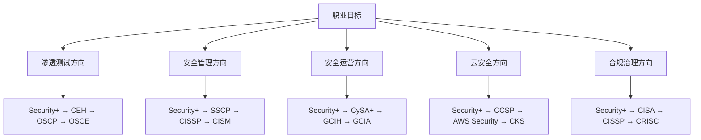

## 28.7 本节小结：理论基础核心知识体系回顾

本节（28.1–28.6）系统构建了网络安全认证的完整理论框架，从认证的本质起源出发，经过价值评估、选择策略、备考方法论，到国际与国内两大认证体系的深度解析，形成了一个从"为什么认证"到"如何准备认证"的闭环知识体系。以下从六个维度进行系统回顾与提炼。

---

### 28.7.1 认证体系的起源与本质（回顾 28.1）

网络安全认证的诞生并非偶然，而是信息安全行业从"野蛮生长"走向"专业化、标准化"的必然产物。1969年ISACA成立并推出CISA，标志着安全审计走向制度化；1990年代（ISC）²推出CISSP，开启了安全管理认证的新纪元；2000年代Offensive Security推出OSCP，确立了"以实操能力为核心"的认证范式。

**核心认知**：认证本质上是一种"能力契约"——它向雇主和行业证明持有者具备特定领域的知识体系与实操能力。理解这一本质，有助于避免两个极端：既不盲目崇拜认证（把它当作能力的唯一证明），也不轻视认证（认为"有技术就行，不需要证书"）。

**本节关键结论**：

- 认证是信息安全行业走向成熟的标志，其发展脉络反映了行业需求的演变
- 不同历史时期催生了不同类型的认证：审计型（CISA）→ 管理型（CISSP）→ 实操型（OSCP）→ 厂商型（AWS Security）
- 认证的权威性来源于颁发机构的公信力、知识体系的科学性、以及行业的广泛认可

---

### 28.7.2 认证的价值评估（回顾 28.2）

认证的价值远不止"一张证书"，它在职业发展的多个维度产生深远影响：

| 价值维度 | 具体体现 | 量化参考 |
|---------|---------|---------|
| 求职竞争力 | 60%的美国网安岗位要求或优先考虑持证候选人 | CyberSeek 数据 |
| 薪资提升 | CISSP持证者平均年薪比未持证者高约25% | （ISC）² 调查 |
| 职业晋升 | 管理岗位几乎必备CISSP/CISM | 行业普遍要求 |
| 专业认可 | 获得演讲、咨询、行业奖项的机会增加 | 持证者反馈 |
| 知识体系化 | 备考过程本身就是系统学习的过程 | 学习科学验证 |
| 行业人脉 | 认证社群是高质量职业网络的入口 | ISC²/ISACA社区 |

**投资回报率（ROI）计算要点**：直接成本（考试费+培训费+教材费+时间成本）vs 直接收益（薪资涨幅+职位提升+机会成本降低）。以CISSP为例，总投入约3000-5000美元，但年薪提升通常在5000-15000美元区间，投资回收期一般在6-12个月。

**关键警示**：认证是职业发展的"加速器"而非"替代品"。没有实际能力支撑的认证只是纸面文章；反之，有丰富经验但无认证也可能在求职和晋升中遭遇"玻璃天花板"。最佳策略是**能力先行、认证赋能**。

---

### 28.7.3 认证选择的核心策略（回顾 28.3）

面对琳琅满目的认证选项，盲目跟风是最大的误区。科学的选择策略应基于三个核心维度：

**维度一：职业目标匹配**

**维度二：经验水平适配**

| 经验水平 | 推荐认证 | 备考周期 | 难度等级 |
|---------|---------|---------|---------|
| 0-2年（入门） | Security+、CEH、NISP | 2-4个月 | ★★☆☆☆ |
| 2-5年（进阶） | OSCP、CISP、CySA+ | 3-6个月 | ★★★☆☆ |
| 5-10年（资深） | CISSP、CISM、OSCE | 4-8个月 | ★★★★☆ |
| 10年+（专家） | CISSP、CISM、GXPN | 6-12个月 | ★★★★★ |

**维度三：市场与地域因素**

- **国际市场**：CISSP、OSCP、Security+ 是"硬通货"，在全球范围内认可度最高
- **中国市场**：CISP系列在党政机关、央企、金融行业具有不可替代性，是合规要求的刚需
- **云安全领域**：AWS/Azure/GCP厂商认证在云计算岗位中权重极高
- **细分领域**：OSCP在渗透测试领域几乎是"行业货币"，持证者在该方向的薪资溢价最为显著

**选择决策树**：先确定职业方向 → 评估当前经验水平 → 考虑目标市场（国内/国际/云）→ 选择认证组合（建议1个基础+1个核心+1个进阶）→ 制定2-3年的认证规划。

---

### 28.7.4 认证备考的科学方法论（回顾 28.4）

安全认证备考不同于普通考试，它要求**在压力环境下运用技术能力解决实际问题**。传统的"刷题-背诵"模式在OSCP等实操型认证面前几乎完全失效。本节构建了五维备考框架：

**1. 学习科学原理**

- **间隔重复**：利用艾宾浩斯遗忘曲线，在关键时间节点复习，将短期记忆转化为长期记忆。具体节奏：学后1小时 → 当天晚间 → 第2天 → 第4天 → 第7天 → 第15天
- **主动回忆**：比被动重读效率高50%以上。合上笔记、尝试回忆核心概念，比反复阅读更有效
- **费曼技巧**：用最简单的语言向"外行人"解释复杂概念，能暴露理解盲区
- **交叉练习**：混合不同类型的知识点练习（如密码学+网络+渗透测试），比单一科目集中学习更有利于长期记忆和迁移能力

**2. 时间与精力管理**

- **番茄工作法**：25分钟专注 + 5分钟休息，每4个番茄钟后休息15-30分钟
- **精力峰值利用**：将最难的内容（如OSCP实操练习）安排在个人精力最充沛的时段
- **最小可行学习单元**：每天至少保证1-2小时的有效学习时间，低于此阈值的学习效率会急剧下降

**3. 资源筛选策略**

- **官方资源优先**：考试大纲、官方教材、官方实验室是第一手资料
- **社区资源验证**：Reddit、Twitter、技术博客的备考经验需交叉验证，避免被误导
- **付费vs免费**：基础理论可用免费资源，但实操类（如OSCP的PEN-200课程）官方付费资源几乎是必须的

**4. 特殊场景应对**

- **在职备考**：利用通勤时间听播客/复习卡片，午休时间做选择题练习
- **跨时区考试**：提前调整作息，确保考试时处于精力高峰
- **重考策略**：分析失败原因（知识盲区？时间管理？心理压力？），针对性补强

**5. 常见备考误区**

| 误区 | 正确做法 |
|-----|---------|
| 只看视频不动手 | 视频学习与实操练习比例至少 1:2 |
| 追求100%覆盖率 | 聚焦考试大纲的高频考点（通常覆盖70%分值） |
| 闭门造车 | 加入学习社群，参与讨论和模拟考试 |
| 忽略身体管理 | 保证7-8小时睡眠，规律运动，备考期保持健康 |
| 临考前突击 | 制定3-6个月的系统备考计划，保持节奏 |

---

### 28.7.5 国际主流认证全景解析（回顾 28.5）

本节对六大国际主流安全认证进行了深度解析，每个认证的定位、难度、投入和回报各有侧重：

| 认证 | 颁发机构 | 核心定位 | 考试形式 | 报名费（USD） | 前置条件 | 适合人群 |
|-----|---------|---------|---------|-------------|---------|---------|
| **Security+** | CompTIA | 安全入门基础 | 选择题+性能题 | ~392 | 无 | 入门者、转行者 |
| **CEH** | EC-Council | 伦理黑客基础 | 选择题+实操 | ~1199 | 培训或经验 | 渗透测试初学者 |
| **OSCP** | Offensive Security | 高级渗透测试 | 24小时实操考试 | ~1649 | 无（建议经验） | 渗透测试专业人员 |
| **CISSP** | （ISC）² | 安全管理综合 | 选择题（CAT） | ~749 | 5年经验（可用1年教育抵扣） | 安全管理者/架构师 |
| **CISM** | ISACA | 信息安全治理 | 选择题 | ~575 | 5年管理经验 | 信息安全经理 |
| **CCSP** | （ISC）² | 云安全 | 选择题 | ~599 | 5年IT经验（含1年云安全） | 云安全专业人员 |

**关键对比分析**：

- **实操型 vs 理论型**：OSCP是典型的实操型认证，24小时限时攻防；CISSP/CISM偏理论和管理，侧重决策能力
- **入门型 vs 进阶型**：Security+和CEH是入门级，适合建立知识框架；OSCP/CISSP是进阶级，需要深度积累
- **广度型 vs 深度型**：CISSP覆盖安全八大域，是最"宽"的认证；OSCP聚焦渗透测试，是最"深"的实操认证
- **投资回报**：OSCP的渗透测试方向薪资溢价最高；CISSP的管理方向晋升助力最强；Security+的性价比最优（低投入、广认可）

**认证路径推荐**（按职业方向）：

- **渗透测试专家**：Security+ → CEH → OSCP → OSEP → OSCE → GXPN
- **安全管理/CISO**：Security+ → SSCP → CISSP → CISM → CRISC
- **云安全架构师**：Security+ → CCSP → AWS Security Specialty → Azure Security Engineer
- **安全运营分析师**：Security+ → CySA+ → GCIH → GCIA → GNFA

---

### 28.7.6 中国安全认证体系（回顾 28.6）

中国安全认证体系是国家信息安全战略的重要组成部分，与国际认证体系形成互补。其核心特点在于**与国家法规政策的深度耦合**，以及在党政机关和关键行业中的不可替代性。

**CISP系列认证体系**：

| 认证代码 | 全称 | 核心定位 | 目标岗位 | 工作年限要求 |
|---------|------|---------|---------|------------|
| CISE | 注册信息安全工程师 | 技术基础 | 安全运维、安全审计、安全设计 | 本科1年/专科3年 |
| CISO | 注册信息安全管理人员 | 管理能力 | 安全管理、安全治理、风险管理 | 本科1年/专科3年 |
| CISP-A | 注册信息系统审计师 | 审计方向 | 等保测评、安全审计、合规检查 | 本科1年/专科3年 |
| CISP-PTS | 注册渗透测试工程师 | 渗透测试 | 渗透测试、安全评估、漏洞挖掘 | 本科1年/专科3年 |
| CISP-IRE | 注册应急响应工程师 | 应急响应 | 安全事件响应、应急处置、取证分析 | 本科1年/专科3年 |
| CISP-DPO | 注册数据安全官 | 数据安全 | 数据治理、隐私保护、合规管理 | 本科1年/专科3年 |

**NISP（国家信息安全水平考试）**：面向在校学生和社会人士的分级认证体系，分为一级（普及级）、二级（专业级）、三级（高级），是进入安全行业的低门槛路径。

**中国认证的独特价值**：

1. **合规刚需**：在等保2.0框架下，关键信息基础设施运营者的安全团队需要持证上岗
2. **政府采购门槛**：党政机关、央企的安全服务招标中，CISP证书常被列为供应商必备资质
3. **政策对接**：CISP知识体系与GB/T 22239（等保2.0）等国家标准直接衔接
4. **国际互认**：CISP与ISC²的CISSP已实现部分互认

**国际认证 vs 国内认证的选择逻辑**：

- **目标是外企/国际化企业**：优先CISSP/OSCP/Security+
- **目标是国企/央企/政府项目**：优先CISP系列
- **目标是互联网/创业公司**：两者皆可，技术型认证（OSCP）更受青睐
- **最佳策略**：国内+国际双证组合，如CISP+CISSP、CISP-PTS+OSCP

---

### 28.7.7 理论基础的核心启示

回顾整个理论基础板块，可以提炼出以下核心认知：

**1. 认证是手段，不是目的**

认证的终极价值在于通过系统化的学习和考核，构建完整的安全知识体系和能力框架。证书本身只是这一过程的"副产品"。切勿陷入"证书收集症"——考了一堆证书却没有扎实的技术功底。

**2. 选择比努力更重要**

在错误的方向上投入再多的时间和精力，产出也是有限的。在投入备考之前，花足够的时间进行职业规划和认证选择，确保每一步都朝着正确的方向前进。

**3. 理论与实践必须并行**

纯理论学习无法通过OSCP，纯实操积累无法通过CISSP。不同类型的知识需要不同的学习策略，但都离不开"学-练-用"的闭环。

**4. 持续学习是唯一不变的主题**

安全行业的技术迭代速度极快，今天的"最佳实践"可能在两年后成为"历史遗产"。认证只是学习旅程中的一个里程碑，而非终点。续证要求（如CISSP的CPE学分）本质上是在提醒持证者：**学习永远在路上**。

**5. 国内与国际视野缺一不可**

仅关注国内认证会错失全球化的技术交流和职业机会；仅关注国际认证则可能在国内市场的合规和政策要求面前碰壁。构建"国内+国际"的双轨认证体系，是面向未来最稳妥的策略。

---

### 28.7.8 从理论到实践的衔接

理论基础板块为后续的"核心技巧"和"实战案例"奠定了认知基础。接下来的学习将从以下方向深入：

- **核心技巧板块**：备考策略、考试技巧、时间管理、资源获取、各认证专项备考方法——将理论框架转化为可执行的行动方案
- **实战案例板块**：通过真实人物的认证之路，验证理论的有效性，获取可借鉴的经验和教训

理论是地图，实践是旅程。有了扎实的理论基础，接下来的每一步都将更加清晰和坚定。
