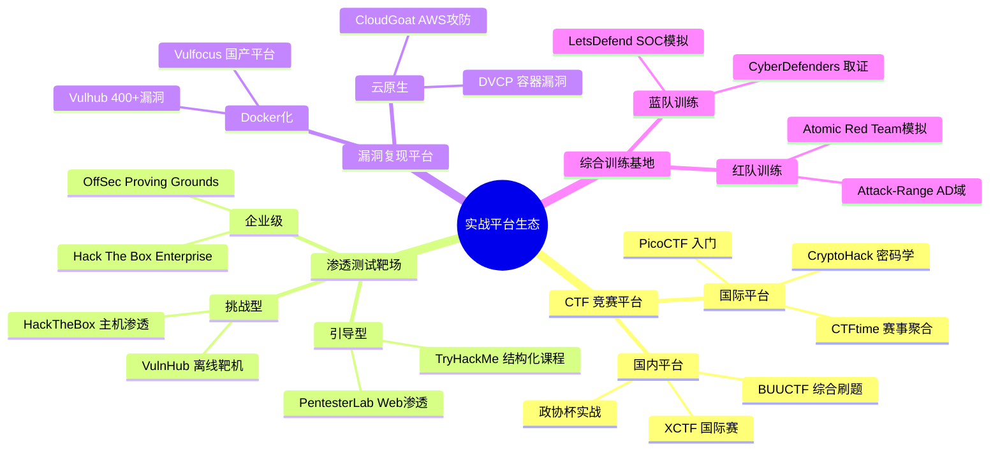
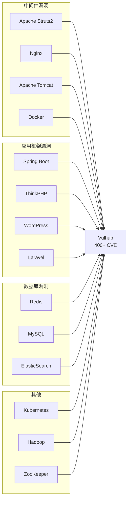
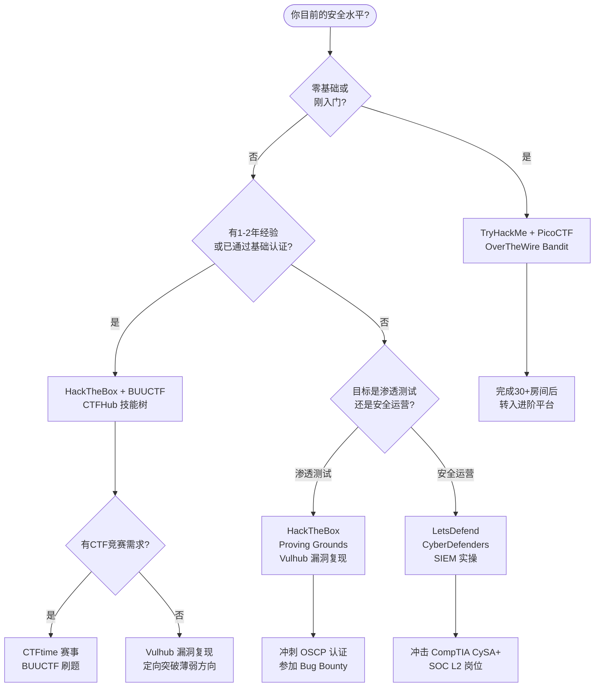
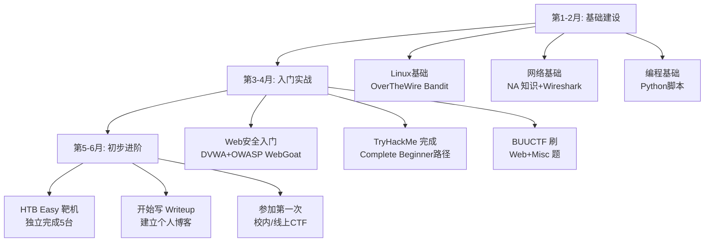

# 第29章 实战平台总汇

## 章节概述

网络安全是一门实践性极强的学科。正如学习游泳不能只看教材、学习驾驶不能只读交规，网络安全技能的提升同样离不开大量的动手实践。据统计，安全从业者在实战平台上投入的练习时间与其漏洞发现能力呈正相关——一份来自 HackerOne 的内部数据显示，活跃于实战平台的学习者在真实漏洞挖掘中的首次命中率比纯理论学习者高出 **3-5 倍**。

然而，面对市面上数量庞大、定位各异的实战平台，许多学习者陷入选择困境：该从哪个平台开始？不同平台之间有何差异？如何根据自身水平制定合理的训练计划？本章将全面梳理当前主流的网络安全实战平台，从 CTF 竞赛平台、渗透测试靶场、漏洞复现环境到综合训练基地，为你提供一份详尽的实战平台导航图和系统化的学习路径。



## 为什么使用实战平台

### 合法合规的练习环境

在真实网络环境中进行渗透测试和漏洞利用是违法行为。《中华人民共和国网络安全法》第 27 条明确规定，任何个人和组织不得从事非法侵入他人网络、干扰他人网络正常功能、窃取网络数据等危害网络安全的活动。《刑法》第 285、286 条进一步规定了非法侵入计算机信息系统罪和破坏计算机信息系统罪的刑事责任。

实战平台提供了**授权的、隔离的**环境，学习者可以在不触犯法律的前提下练习攻防技术。这些平台明确授权用户对其目标系统进行攻击，消除了法律风险。具体而言：

| 维度 | 真实网络 | 实战平台 |
|------|---------|---------|
| 法律风险 | 极高，可能面临刑事追诉 | 无，平台明确授权 |
| 环境控制 | 不可控，可能影响生产系统 | 完全隔离，随时重置 |
| 学习价值 | 风险远大于收益 | 专注技能提升 |
| 技术反馈 | 无指导，可能引发安全事故 | 有提示、Writeup、社区支持 |

### 系统化的学习路径

优秀的实战平台通常设计了由浅入深的挑战题目和关卡。与随机搜索漏洞不同，平台化的学习路径遵循**渐进式暴露原则**（Progressive Exposure）——学习者始终处于"略微超出当前能力"的挑战区间（即维果茨基的"最近发展区"理论），这是技能增长最快的阶段。

例如，TryHackMe 的学习路径设计了 800+ 结构化房间，从基础的 Linux 命令到高级的 Active Directory 攻击，每个房间都关联前置知识，形成完整的学习链路。HackTheBox 则通过 Easy → Medium → Hard → Insane 的难度分级，确保学习者能在合适难度的靶机上获得有效训练。

### 真实的技术环境

实战平台中的靶机、漏洞环境通常基于真实的技术栈构建。一台 HackTheBox 靶机可能运行着真实版本的 Apache、MySQL、PHP，并包含实际存在的配置错误和已知漏洞。这种接近真实的环境能够让学习者获得宝贵的经验：

- **技术栈真实性**：使用生产级软件的特定版本，包含真实 CVE 漏洞
- **环境复杂度**：多服务、多用户、多域的真实拓扑结构
- **攻防对抗性**：部分平台提供动态防御，靶机在运行中产生日志和告警
- **版本迭代**：漏洞库持续更新，反映最新威胁态势

### 社区交流与竞争

大多数实战平台都有活跃的社区。社区的价值不仅在于交流，更在于**社会比较理论**（Social Comparison Theory）驱动的学习动机——看到他人的成就和解题思路，能够激发自身的学习动力和方向感：

- **Writeup 共享**：社区发布的解题报告是极佳的学习材料
- **排行榜机制**：CTFtime 积分排名、HackTheBox 排行榜提供竞争动力
- **团队协作**：加入 CTF 战队可在实战中学习团队配合
- **导师效应**：高水平玩家的分享为新手提供进阶方向

## 平台分类体系与深度对比

### CTF 竞赛平台

CTF（Capture The Flag）竞赛是网络安全领域最成熟的竞技模式。选手在限定时间内解决各类安全挑战，获取隐藏在题目中的"旗帜"（Flag）来得分。

#### 国际 CTF 平台

| 平台 | 特色 | 适合人群 | 免费/付费 | 难度范围 |
|------|------|---------|----------|---------|
| **CTFtime** | 赛事聚合、战队排名 | 中高级选手 | 免费 | 中-极高 |
| **PicoCTF** | CMU 出品，入门友好 | 零基础学习者 | 免费 | 入门-中 |
| **CryptoHack** | 密码学专题，交互式 | 密码学爱好者 | 免费 | 入门-高 |
| **OverTheWire (Bandit)** | Linux 命令行闯关 | Linux 初学者 | 免费 | 入门 |
| **pwn.college** | ASU 出品，系统安全 | 二进制方向 | 免费 | 入门-高 |
| **Root-Me** | 多方向综合，法语区 | 全方向选手 | 免费/付费 | 入门-高 |

#### 国内 CTF 平台

| 平台 | 特色 | 适合人群 | 免费/付费 | 难度范围 |
|------|------|---------|----------|---------|
| **BUUCTF** | 题库丰富（1000+），分类清晰 | 中级选手 | 免费 | 入门-高 |
| **攻防世界 (XCTF)** | 赛题回放，难度较高 | 中高级选手 | 免费 | 中-高 |
| **NSSCTF** | 高校 CTF 赛题聚合 | 高校选手 | 免费 | 中-高 |
| **CTFHub** | 技能树引导式学习 | 系统学习者 | 免费/付费 | 入门-中 |
| **春秋云境** | 知名春秋网安出品 | 中高级选手 | 付费 | 中-高 |
| **CTFLearning** | 新手友好，Writeup 完整 | 入门选手 | 免费 | 入门-中 |

#### CTF 题目类型分布

```text
┌─────────────────────────────────────────────────────┐
│                CTF 知识体系全景                       │
├──────────┬──────────────────────────────────────────┤
│ Web 安全  │ SQL 注入、XSS、CSRF、SSRF、反序列化、     │
│          │ 文件包含、命令注入、模板注入、JWT攻击        │
├──────────┼──────────────────────────────────────────┤
│ 密码学    │ 古典密码、RSA、AES、哈希碰撞、椭圆曲线、   │
│          │ 格密码、后量子密码、协议分析                 │
├──────────┼──────────────────────────────────────────┤
│ 逆向工程  │ x86/x64/ARM反编译、混淆分析、Android逆向、 │
│          │ .NET逆向、Go/Rust逆向、符号执行              │
├──────────┼──────────────────────────────────────────┤
│ 二进制PWN │ 栈溢出、堆利用、格式化字符串、ROP、         │
│          │ 内核漏洞利用、沙箱逃逸、SROP                 │
├──────────┼──────────────────────────────────────────┤
│ 杂项(MISC)│ 隐写术、流量分析、编码解码、取证分析、       │
│          │ 内存取证、AI安全、区块链                     │
├──────────┼──────────────────────────────────────────┤
│ AI/ML安全 │ 模型投毒、对抗样本、提示注入、               │
│          │ 越狱攻击、数据泄露                         │
└──────────┴──────────────────────────────────────────┘
```

### 渗透测试靶场

渗透测试靶场模拟真实网络环境，提供可攻击的靶机（Target Machine），学习者需要运用渗透测试方法论（如 PTES、OSSTMM）完成从信息收集到获取 root/管理员权限的完整过程。

#### 引导型平台（适合入门）

| 平台 | 核心特色 | 靶机数量 | 学习模式 | 价格 |
|------|---------|---------|---------|------|
| **TryHackMe** | 结构化房间+引导式学习 | 400+ | 课程+挑战 | 免费/$14月 |
| **PentesterLab** | Web 渗透专题 | 100+ | 练习+证书 | $20/月 |
| **INE Security** | 前 eLearnSecurity，系统化课程 | 200+ | 课程+实验 | $499/年 |
| **Cybrary** | 综合安全课程+虚拟实验 | 150+ | 课程为主 | 免费/$59月 |

#### 挑战型平台（适合进阶）

| 平台 | 核心特色 | 靶机数量 | 难度定位 | 价格 |
|------|---------|---------|---------|------|
| **HackTheBox** | 高质量靶机，社区活跃 | 300+ | 中-极高 | 免费/$14月 |
| **VulnHub** | 可下载的 OVA/VirtualBox 靶机 | 400+ | 中-高 | 免费 |
| **Proving Grounds** | OffSec 官方，与 OSCP 对标 | 100+ | 中-高 | $19/月 |
| **SANS Holiday Hack** | 年度节日挑战赛 | 年度更新 | 中-极高 | 免费 |

#### 企业级/红队平台（适合高级选手）

| 平台 | 核心特色 | 适用场景 | 价格 |
|------|---------|---------|------|
| **Attack-Range** | AD 域环境，Active Directory 攻防 | 红队训练 | 开源免费 |
| **DVCP** | 容器化漏洞环境 | 云原生安全 | 开源免费 |
| **SafeNet Labs** | 工控/IoT 模拟环境 | OT安全训练 | 付费 |

### 漏洞复现平台

漏洞复现平台专注于提供已知 CVE 漏洞的可运行环境，帮助学习者理解漏洞原理、掌握利用方法、验证防御策略。与靶场不同，漏洞复现平台更侧重**单点漏洞的深度理解**而非完整渗透流程。

| 平台 | 漏洞数量 | 技术栈覆盖 | 特色 | 价格 |
|------|---------|-----------|------|------|
| **Vulhub** | 400+ | Web中间件、数据库、框架 | Docker一键部署，最成熟 | 免费 |
| **Vulfocus** | 200+ | Web应用、中间件 | 国产平台，中文友好 | 免费 |
| **VulnCloud** | 50+ | 云服务(AWS/Azure/GCP) | 云安全专项 | 免费 |
| **Metasploitable** | 内置 | Linux基础服务 | 经典靶机，无需联网 | 免费 |
| **DVWA** | 20+ | PHP+MySQL | Web漏洞入门必练 | 免费 |
| **WebGoat** | 50+ | Java Spring | OWASP官方教学项目 | 免费 |

#### Vulhub 漏洞分类覆盖



### 综合训练基地

综合训练平台集成了课程学习、实验操作、技能评估等完整功能，通常针对特定岗位（蓝队/红队/SOC 分析师）提供端到端的训练方案。

| 平台 | 定位 | 核心功能 | 适合角色 | 价格 |
|------|------|---------|---------|------|
| **LetsDefend** | 蓝队/SOC 训练 | SIEM 模拟、告警响应、取证 | 安全运营 | 免费/$35月 |
| **CyberDefenders** | 数字取证 | 取证挑战、蓝队实战 | 取证分析 | 免费/$15月 |
| **RangeForce** | 企业安全培训 | 模拟攻击场景+防御 | 安全团队 | 企业付费 |
| **Immersive Labs** | 技能发展平台 | 持续技能评估+训练 | 企业安全团队 | 企业付费 |
| **Pentester Academy** | 红蓝对抗 | 攻防模拟、高级渗透 | 红队/渗透测试 | $200/年 |

### 平台选择决策树



## 学习路径规划

### 初学者路径（0-6 个月）

**目标**：建立安全基础认知，掌握基本工具和思维方式。



**每周时间分配建议**：

| 活动 | 时间占比 | 具体内容 |
|------|---------|---------|
| 理论学习 | 30% | 阅读安全文档、观看教学视频 |
| 动手实践 | 50% | 靶机渗透、CTF 刷题、漏洞复现 |
| 总结复盘 | 20% | 写 Writeup、整理笔记、复盘思路 |

### 中级路径（6-18 个月）

**目标**：形成完整的渗透测试方法论，具备独立解决中等难度靶机的能力。

| 阶段 | 时长 | 实战平台 | 学习重点 |
|------|------|---------|---------|
| 工具精通 | 1-2月 | HackTheBox Medium | Metasploit、Burp Suite、Nmap 高级用法 |
| Web深挖 | 2-3月 | PortSwigger Academy | OWASP Top 10 全覆盖，高级注入技术 |
| 系统渗透 | 2-3月 | HackTheBox Hard | Linux/Windows 权限提升、内网渗透 |
| CTF 竞赛 | 持续 | BUUCTF/CTFtime | 选择 1-2 个主攻方向深入 |

### 高级路径（18 个月+）

**目标**：具备红队/渗透测试工程师实战能力，能在真实环境中发现高级漏洞。

| 方向 | 核心平台 | 训练内容 | 目标认证 |
|------|---------|---------|---------|
| 渗透测试 | HTB + Proving Grounds | 0day挖掘、高级持久化 | OSCP / OSCE |
| 红队攻击 | Attack-Range + 自建环境 | AD域攻击、C2框架、免杀 | OSEP / CRTO |
| 漏洞研究 | Vulhub + 自建靶机 | 1day/0day分析、PoC开发 | — |
| 蓝队防御 | LetsDefend + ELK | 威胁狩猎、事件响应、取证 | GCIA / CySA+ |

## 本章内容结构

本章将从以下五个维度对实战平台进行系统介绍，总计涵盖 10 个实战案例和 9 项核心技巧：

| 模块 | 章节内容 | 核心目标 |
|------|---------|---------|
| **理论基础** | 平台分类体系、评价标准、技术架构、国内生态、主流平台深度分析 | 建立平台认知框架 |
| **核心技巧** | 平台选择策略、HTB使用技巧、CTF解题方法、Vulhub复现技巧、自动化工具链、学习效率提升、高级CTF技巧 | 掌握高效使用方法 |
| **实战案例** | TryHackMe入门→HTB渗透→BUUCTF竞赛→Vulhub复现→LetsDefend蓝队→CloudGoat云安全→PortSwigger Web→HTB AD域→BUUCTF Crypto→Spring4Shell复现 | 覆盖全平台全方向 |
| **常见误区** | 初学者常犯错误与纠正方法 | 避免走弯路 |
| **练习方法** | 系统化训练计划制定与个人方案设计 | 制定可持续训练策略 |

### 平台使用频率与技能成长曲线

```text
技能成长
  ↑
  │                              ╭──────────── 高级：HTB Insane + 红队
  │                         ╭───╯
  │                    ╭───╯
  │               ╭───╯        中级：HTB Medium + CTF竞赛
  │          ╭───╯
  │     ╭───╯
  │╭───╯                 入门：TryHackMe + BUUCTF Easy
  │╯
  └──────────────────────────────────────────→ 时间
   0    3    6    9   12   15   18   24  月
```

## 学习建议与策略

### 平台选择原则

**不要贪多求全，选择 2-3 个核心平台深入练习即可获得最佳效果。** 平台选择应遵循以下原则：

1. **匹配当前水平**：选择略高于自身能力的平台，在"心流区"内高效成长
2. **明确学习目标**：渗透测试选 HackTheBox + Proving Grounds，安全运营选 LetsDefend + CyberDefenders
3. **考虑时间投入**：每周 5 小时以下选 TryHackMe（引导性强），10 小时以上选 HTB（自由度高）
4. **关注社区质量**：活跃的社区意味着更多的 Writeup、讨论和经验分享

### 高效利用平台的核心策略

| 策略 | 具体做法 | 预期效果 |
|------|---------|---------|
| **限时挑战** | 为每台靶机设定时间上限（Easy 2h, Medium 4h, Hard 8h） | 避免陷入无效钻牛角尖 |
| **先独立后查** | 独立尝试至少 30 分钟后再看提示或 Writeup | 保持学习曲线的挑战性 |
| **系统化记录** | 每完成一题写一份结构化 Writeup（背景→思路→步骤→总结） | 复盘加深理解 |
| **定向突破** | 识别薄弱方向后，在对应平台集中训练 2-4 周 | 补齐短板，技能均衡 |
| **模拟实战** | 定期进行限时 4-8 小时的完整渗透模拟 | 锻炼心态和时间管理 |

### 各水平段推荐平台组合

| 水平 | 核心平台 | 辅助平台 | 日均建议练习时间 |
|------|---------|---------|----------------|
| 入门（0-6月） | TryHackMe + PicoCTF | DVWA + OverTheWire | 1-2 小时 |
| 初级（6-12月） | BUUCTF + HTB Easy | CTFHub 技能树 | 2-3 小时 |
| 中级（1-2年） | HTB Medium/Hard + CTFtime | Vulhub + PortSwigger | 2-4 小时 |
| 高级（2年+） | HTB Insane + Proving Grounds | 自建环境 + Bug Bounty | 持续参与 |

---

> ⚠️ **安全警告与免责声明**
> 
> 本章内容仅供**合法的安全测试与教育目的**使用。所有技术、工具和方法的讨论均旨在帮助安全从业者在**获得明确授权**的前提下进行防御性安全研究。
> 
> - 🚫 **未经授权**对任何系统、网络或应用进行安全测试是**违法行为**，可能构成《刑法》第 285 条非法侵入计算机信息系统罪或第 286 条破坏计算机信息系统罪
> - ✅ 所有实践活动应在**隔离的实验环境**中进行（如虚拟机、CTF 平台、Docker 容器）
> - ✅ 遵守所在国家和地区的**网络安全法律法规**，包括但不限于《网络安全法》《数据安全法》《个人信息保护法》
> - ✅ 遵循**负责任的漏洞披露**原则（Responsible Disclosure），发现漏洞后优先通过合法渠道报告
> - ✅ 在参加 Bug Bounty 时严格遵守平台规则和项目范围（Scope），不越界测试
> 
> 作者不对因滥用本章内容造成的任何后果承担责任。请始终将技术能力用于建设安全的网络环境。
