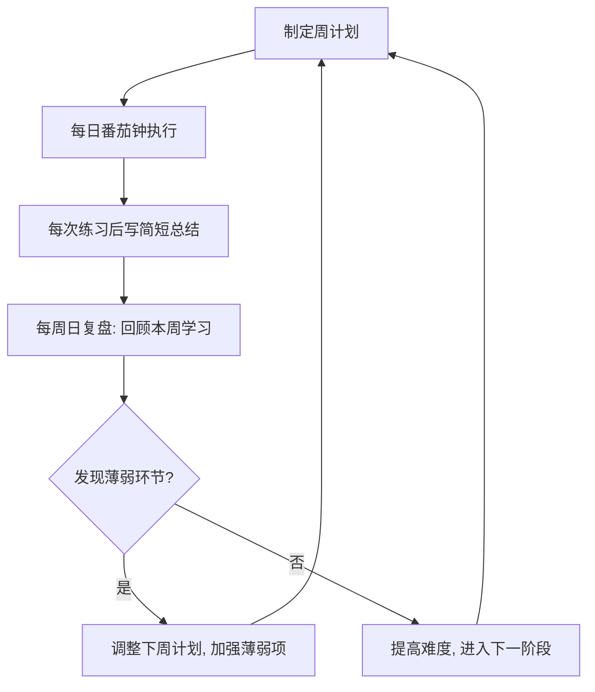

# 实战平台总汇：练习方法

## 一、系统化学习路径

### 1.1 路径设计原则

网络安全学习不同于传统学科，它具有**知识面广、技术迭代快、实操要求高**三大特点。一条有效的学习路径必须遵循以下原则：

| 原则 | 含义 | 反例 |
|------|------|------|
| 循序渐进 | 先掌握前置知识再进入下一阶段 | 未学Web基础就开始做内网渗透 |
| 以终为始 | 根据目标岗位倒推所需技能 | 目标是红队却只学Web安全 |
| 输出驱动 | 每学一个知识点就动手验证 | 只看教程不动手 |
| 刻意练习 | 针对薄弱环节反复训练 | 只做已经会的题型 |
| 及时复盘 | 每次练习后总结反思 | 做完题就丢不写writeup |

学习路径的本质不是"按顺序学完"，而是**建立可复用的能力体系**。每一阶段的学习都要明确回答三个问题：我现在能做什么？下一步要做什么？学完后我能解决什么问题？

### 1.2 入门阶段（0-3个月）

**目标**：建立安全基础知识体系，掌握基本工具使用，能够独立完成入门级挑战。

**前置能力要求**：
- 基本的计算机操作能力
- 英语阅读能力（大多数安全工具和文档以英文为主）
- 基本的逻辑思维能力

**学习内容与详细拆解**：

| 知识模块 | 具体内容 | 学习标准 |
|----------|----------|----------|
| Linux系统基础 | 文件系统、权限管理、进程管理、网络命令、Shell脚本基础 | 能够不查手册完成日常操作，编写简单Shell脚本 |
| 网络协议基础 | TCP/IP五层模型、HTTP/HTTPS协议、DNS解析流程、ARP协议 | 能够用Wireshark抓包分析流量，理解三次握手四次挥手 |
| Web安全基础 | OWASP Top 10全部漏洞类型、SQL注入/XSS/CSRF原理 | 能够手工复现每种漏洞，理解攻击原理而非只记Payload |
| 编程基础 | Python基础语法、requests/socket/re模块、正则表达式 | 能够编写简单的网络脚本和自动化工具 |

**推荐平台和资源**：

| 周次 | 平台 | 内容 | 目标 | 每日时长 |
|------|------|------|------|----------|
| 1-2 | OverTheWire Bandit | Linux命令闯关 | 熟练使用Linux命令行（至少通关30关） | 2-3小时 |
| 3-4 | TryHackMe Complete Beginner路径 | 网络和Web基础 | 理解安全核心概念，完成所有必修模块 | 2-3小时 |
| 5-8 | DVWA本地搭建 + PortSwigger Web Security Academy | Web漏洞单点练习 | 掌握SQL注入、XSS、文件上传等核心Web漏洞 | 2-3小时 |
| 9-12 | PicoCTF + 攻防世界 | CTF入门题目 | 体验CTF竞赛形式，每种题型至少做5题 | 2-3小时 |

**关键里程碑检查**：
- [ ] 能够在命令行下独立完成Linux日常操作（不依赖图形界面）
- [ ] 能够用Nmap完成基本端口扫描并解读结果
- [ ] 能够手工完成DVWA Low-Medium难度的所有漏洞利用
- [ ] 能够独立解出PicoCTF的10道入门题

**每日练习时间**：2-3小时，建议分为理论学习（1小时）+ 实操练习（1-2小时）

### 1.3 进阶阶段（3-6个月）

**目标**：掌握渗透测试方法论，能够独立完成中等难度挑战，建立自己的工具链。

**学习内容与详细拆解**：

| 知识模块 | 具体内容 | 学习标准 |
|----------|----------|----------|
| 渗透测试流程 | 信息收集→漏洞扫描→漏洞利用→权限提升→后渗透→报告撰写 | 能够按照标准流程完成完整渗透测试 |
| 权限提升 | Linux内核提权、SUID/SGID提权、Cron提权、Windows提权 | 能够针对目标系统选择合适的提权方法 |
| 内网渗透基础 | 横向移动、域渗透入门、隧道技术 | 理解域环境基础概念，能够进行基本横向移动 |
| 自动化脚本 | Python高级编程、nmap脚本引擎、自动化渗透框架 | 能够编写自定义漏洞利用脚本 |

**推荐平台和资源**：

| 周次 | 平台 | 内容 | 目标 | 每日时长 |
|------|------|------|------|----------|
| 13-16 | HackTheBox Easy靶机 | 渗透测试实战 | 完成10台Easy靶机，每台写详细writeup | 3-4小时 |
| 17-20 | BUUCTF | Web/Pwn/Reverse题目 | 积累CTF经验，尝试中等难度题目 | 3-4小时 |
| 21-24 | Vulhub漏洞复现 | 经典CVE复现 | 理解10个以上经典CVE的原理和利用 | 3-4小时 |

**关键里程碑检查**：
- [ ] 独立完成HackTheBox 10台Easy靶机
- [ ] 能够在Vulhub中复现至少5个经典CVE
- [ ] 编写过至少3个自定义渗透脚本
- [ ] 能够独立完成一份完整的渗透测试报告

**每日练习时间**：3-4小时，建议分为靶机实战（2-3小时）+ 知识整理（1小时）

### 1.4 高级阶段（6-12个月）

**目标**：具备专业安全人员能力，能够应对复杂攻击场景，建立专业方向优势。

**学习内容与详细拆解**：

| 知识模块 | 具体内容 | 学习标准 |
|----------|----------|----------|
| 高级渗透测试 | 域渗透完整流程、免杀技术、横向移动高级技术 | 能够在Active Directory环境中完成完整渗透链 |
| 漏洞挖掘 | 代码审计、模糊测试、协议分析、逆向工程 | 能够独立发现中等难度的漏洞 |
| 安全研究 | CVE分析、漏洞原理研究、安全工具开发 | 能够独立分析一个新漏洞的完整利用链 |
| 团队协作 | 红蓝对抗、报告撰写、项目管理 | 能够在团队中承担专业角色 |

**推荐平台和资源**：

| 周次 | 平台 | 内容 | 目标 | 每日时长 |
|------|------|------|------|----------|
| 25-36 | HackTheBox Medium/Hard靶机 | 高级渗透测试 | 完成20台中高级靶机 | 4-5小时 |
| 37-40 | Proving Grounds + TJNulls | OSCP备考模拟 | 在模拟考试环境中完成完整渗透测试 | 4-5小时 |
| 41-48 | 专项深入 | 根据职业方向选择 | 建立专业方向竞争优势 | 4-5小时 |

**每日练习时间**：4-5小时，建议分为深度实战（3-4小时）+ 研究总结（1小时）

### 1.5 职业方向分化（12个月以后）

进入高级阶段后，需要根据职业目标选择专精方向：

| 方向 | 核心技能 | 推荐平台 | 职业路径 |
|------|----------|----------|----------|
| 红队攻防 | 渗透测试、免杀、社工、域渗透 | HackTheBox、OSEP | 渗透测试工程师→红队成员 |
| Web安全 | 代码审计、漏洞挖掘、安全开发 | PortSwigger、Bug Bounty | 安全工程师→安全架构师 |
| 二进制安全 | Pwn、Reverse、内核漏洞 | CTFtime、内核CTF | 二进制安全研究员 |
| 蓝队防守 | 威胁检测、应急响应、日志分析 | LetsDefend、CyberDefenders | 安全运营→蓝队负责人 |
| 云安全 | 容器逃逸、K8s安全、云渗透 | CloudGoat、AWS Goat | 云安全工程师→云安全架构师 |

## 二、高效练习方法

### 2.1 刻意练习——最核心的提升方法

刻意练习是所有技能提升方法中**研究支撑最充分、效果最显著**的一种。它由心理学家K. Anders Ericsson提出，核心思想是：**有目的的、针对薄弱环节的、即时反馈的重复训练**。

刻意练习与普通练习的关键区别：

| 维度 | 普通练习 | 刻意练习 |
|------|----------|----------|
| 目标 | 完成任务 | 提升特定技能 |
| 选择 | 做自己会的题 | 专攻不会的题型 |
| 反馈 | 做对就行 | 分析为什么对/为什么错 |
| 舒适度 | 在舒适区 | 在学习区（略超出当前能力） |
| 重复 | 重复已掌握的 | 反复练习未掌握的 |

**在网络安全中的具体应用**：

**第一步：识别薄弱环节**
每次练习后记录自己的弱点。例如：
- SQL注入手工测试熟练但自动化脚本不会写
- Linux提权了解原理但实战中找不到提权点
- 能做CTF题但不会写完整的渗透报告

**第二步：设计针对性训练**
针对每个弱点设计专项练习。例如：
- SQL注入弱项：每天做3道不同类型的SQL注入题（联合查询/报错/盲注/堆叠）
- 提权弱项：每周完成3台不同提权方式的靶机，专门寻找提权路径

**第三步：获取即时反馈**
- 做完题后立即对照官方writeup或社区讨论
- 分析自己的解题思路与最优解的差距
- 记录错误原因和改进方案

**第四步：迭代提升**
根据反馈调整练习计划，逐步提高难度。

### 2.2 费曼学习法——深度理解的利器

费曼学习法的核心是：**如果你不能用简单语言解释一个概念，说明你还没有真正理解它**。

**在网络安全中的实践步骤**：

1. **选择一个安全概念**（例如：SQL注入的union查询）
2. **用最简单的语言解释**：假设你要教一个完全不懂安全的人，你会怎么说？
3. **发现卡壳的地方**：如果你发现自己解释不清楚某个环节，说明那里理解不够深
4. **回到源头重新学习**：重新阅读文档、实验验证，直到能流畅解释
5. **简化和类比**：用日常生活的例子帮助理解（例如：SQL注入就像你去餐厅点餐时告诉服务员"除了我的菜，顺便把后厨保险柜密码也给我"）

**实践方式**：
- 写技术博客：把每个知识点写成面向初学者的教程
- 在安全社区回答问题：通过回答他人问题检验自己的理解
- 录制技术视频：用视频讲解一个技术点，录的过程本身就是深度学习
- 与同伴互相讲解：找一个学习伙伴，轮流讲解不同知识点

### 2.3 番茄工作法——保持专注的节奏

将学习时间分割为25分钟的专注时段，每个时段之间休息5分钟。

**在安全学习中的优化应用**：

| 时段类型 | 时长 | 适合任务 | 注意事项 |
|----------|------|----------|----------|
| 番茄钟1-2 | 50分钟 | 理论学习（阅读文档/教程） | 做笔记，标记不理解的地方 |
| 番茄钟3-4 | 50分钟 | 实操练习（靶机/CTF题） | 集中精力，不要同时开多个窗口 |
| 番茄钟5-6 | 50分钟 | Writeup写作/知识整理 | 及时记录解题过程和心得 |
| 长休息 | 15-30分钟 | 彻底放松 | 离开电脑，活动身体 |

**实践建议**：
- 每个番茄钟专注于单一任务，不要在番茄钟内切换任务
- 使用计时器工具（如Forest App、Pomofocus）强制执行
- 记录每个番茄钟的完成情况，分析时间利用率
- 每4个番茄钟后休息15-30分钟，避免大脑疲劳
- 在番茄钟开始前明确本时段的具体目标（不是"做靶机"，而是"完成HackTheBox Target的端口扫描和目录枚举"）

### 2.4 间隔重复法——对抗遗忘的利器

艾宾浩斯遗忘曲线表明，学习后如果不复习，24小时后仅能记住约33%的内容。间隔重复法通过在**最佳遗忘时间点**进行复习，大幅提高记忆保持率。

**推荐的间隔复习时间表**：

| 复习轮次 | 距首次学习 | 复习方式 | 适合内容 |
|----------|------------|----------|----------|
| 第1次 | 1小时后 | 快速浏览笔记 | 新学的命令、概念 |
| 第2次 | 1天后 | 闭卷回忆+对照 | Payload、绕过技巧 |
| 第3次 | 3天后 | 实操验证 | 工具使用流程 |
| 第4次 | 7天后 | 教给别人 | 完整的方法论 |
| 第5次 | 15天后 | 综合测试 | 所有知识点 |

**推荐工具**：
- **Anki**：制作安全知识卡片，自动安排复习计划。适合记忆：常用命令、Payload模板、漏洞特征、端口/服务对应关系
- **Obsidian**：建立双向链接的知识网络，适合记录：学习笔记、writeup、技术总结
- **自建题库**：用SQLite或Markdown维护个人错题本，定期重做

**Anki卡片制作示例**：
```text
正面：SQL注入中，当页面不回显查询结果时，可以用什么方法？
背面：布尔盲注（基于True/False判断）、时间盲注（基于响应时间判断）
     布尔盲注常用函数：left(), ascii(), substring()
     时间盲注常用函数：sleep(), benchmark(), IF()
```

### 2.5 主题式学习——建立知识体系

围绕特定主题进行**深度学习**，而非零散刷题。主题式学习的核心是：在一个主题上做到**从原理到利用到防御到变体**的完整闭环。

**示例主题——SQL注入完整学习路径**：

| 阶段 | 内容 | 平台/资源 | 产出 |
|------|------|-----------|------|
| 原理理解 | SQL语法基础、注入原理、数据库结构 | DVWA Low | 能手工执行基础注入 |
| 类型覆盖 | Union注入、报错注入、布尔盲注、时间盲注、堆叠注入 | PortSwigger Labs | 每种类型至少做3题 |
| 绕过技术 | 大小写混合、注释符绕过、编码绕过、WAF绕过 | BUUCTF + 自建靶场 | 整理绕过技巧清单 |
| 工具自动化 | SQLMap使用、自定义注入脚本 | 实战环境 | 编写自动化注入脚本 |
| 防御分析 | 参数化查询、ORM防护、WAF规则 | 代码审计 | 能识别和修复SQL注入漏洞 |

**更多推荐主题**：

| 主题 | 学习路径 | 预计时间 |
|------|----------|----------|
| XSS攻击链 | 反射→存储→DOM→CSP绕过→Session劫持→权限提升 | 2周 |
| 权限提升（Linux） | SUID/SGID→Cron→Sudo误配置→内核漏洞→容器逃逸 | 3周 |
| 域渗透 | 域环境基础→Kerberos攻击→DCSync→Golden Ticket→横向移动 | 4周 |
| 代码审计 | PHP审计→Java审计→反序列化链→供应链攻击 | 4周 |

### 2.6 建立个人学习系统

将上述方法整合为一个可运转的**个人学习系统**：



**每日学习流程模板**：

| 时间段 | 活动 | 产出 |
|--------|------|------|
| 开始前5分钟 | 明确今日目标（具体到要完成什么） | 1-2个具体目标 |
| 第1个番茄钟 | 理论学习/阅读文档 | 学习笔记 |
| 第2-3个番茄钟 | 实操练习 | 解题过程记录 |
| 第4个番茄钟 | 整理笔记/写writeup | 文档产出 |
| 结束前5分钟 | 记录今日收获和明日计划 | 学习日志 |

## 三、Writeup写作方法

### 3.1 为什么Writeup是学习的核心环节

Writeup不仅是记录解题过程的文档，更是**将实践经验转化为可复用知识**的关键环节。研究表明，写下来的知识记忆保持率是仅靠阅读的2-3倍。

Writeup的核心价值：
- **强迫你梳理思路**：写作过程中你会发现自己理解不透彻的地方
- **建立可检索的知识库**：未来遇到类似问题可以快速查找
- **展示专业能力**：高质量的Writeup是求职面试的有力证明
- **帮助社区**：你的Writeup可能帮助其他正在学习的人

### 3.2 Writeup结构模板

```markdown
# [题目名称] Writeup

## 基本信息
- 平台：HackTheBox / TryHackMe / BUUCTF
- 难度：Easy / Medium / Hard
- 类型：Web / Pwn / Reverse / Misc / Crypto
- 考点：列出涉及的核心知识点
- 耗时：从开始到完成的时间

## 环境信息
- 靶机IP / 题目地址
- 操作系统 / 技术栈
- 网络拓扑（如适用）

## 信息收集
### 端口扫描
（附Nmap完整扫描命令和结果）
nmap -sC -sV -O -p- <target>

### 目录枚举
（附Gobuster/Dirsearch扫描命令和结果）

### 其他发现
（DNS信息、子域名、技术指纹等）

## 漏洞发现与分析
### 漏洞类型
（明确说明是什么漏洞）

### 发现过程
（描述如何发现该漏洞的）

### 漏洞原理
（用简单语言解释为什么这个漏洞存在）

## 漏洞利用
### 利用方法
（详细描述利用步骤）

### Payload构造
（列出关键Payload及其含义）

### 执行结果
（附截图或终端输出）

## 权限提升（如有）
### 提权向量
（如何发现提权可能的）

### 提权方法
（具体提权步骤）

### 权限提升结果
（最终获得的权限级别）

## 总结
### 知识点梳理
（列出本题涉及的所有知识点）

### 踩坑记录
（过程中遇到的困难和解决方法）

### 可改进的地方
（如果重做，哪些地方可以做得更好）

### 相关资源
（相关的学习资料、参考文章链接）
```

### 3.3 Writeup写作技巧

**内容层面**：
- 使用清晰的标题和分段，让读者可以快速定位感兴趣的部分
- 包含关键命令和完整输出，不要省略"重复步骤"而要明确说明
- 解释每个步骤的**原理**，而非仅仅列出操作命令
- 标注踩坑点和注意事项，特别是那些你花了很长时间才搞明白的地方
- 用截图辅助说明关键步骤，尤其是Web漏洞的页面变化

**写作层面**：
- 先写骨架（各级标题），再填充内容
- 用第三人称视角审阅一遍，确保逻辑通顺
- 检查所有命令是否可以直接复制执行
- 添加"前置条件"说明（需要什么环境、工具版本等）

**发布层面**：
- 格式统一：所有Writeup使用相同的模板结构
- Markdown语法规范：代码块标注语言类型，表格对齐
- 添加目录结构：方便读者导航
- 保护敏感信息：不要泄露平台密码、API Key等

### 3.4 Writeup进阶技巧

**建立个人Writeup模板库**：

```text
writeup-templates/
├── ctf-web.md          # CTF Web题模板
├── ctf-pwn.md          # CTF Pwn题模板
├── htb-machine.md      # HackTheBox靶机模板
├── vulhub-reproduce.md # Vulhub漏洞复现模板
├── bug-bounty.md       # 漏洞赏金报告模板
└── pentest-report.md   # 渗透测试报告模板
```

**Writeup质量自检清单**：
- [ ] 其他人能否按照我的Writeup复现整个过程？
- [ ] 每个关键步骤都解释了"为什么这样做"？
- [ ] 包含了完整的命令和输出？
- [ ] 记录了所有踩坑点和解决方法？
- [ ] 格式清晰，层级合理？

## 四、技能评估与进阶规划

### 4.1 能力模型：T型人才结构

网络安全从业者需要建立"T型"能力结构：横向有广泛的安全知识面，纵向有一个或多个深度专精方向。

```mermaid
graph LR
    subgraph 横向：广泛知识面
        A1[Web安全]
        A2[二进制安全]
        A3[密码学]
        A4[网络协议]
        A5[操作系统]
        A6[云安全]
    end
    subgraph 纵向：深度专精
        B1[Web渗透]
        B2[漏洞挖掘]
        B3[安全研究]
    end
    A1 --- B1
    A1 --- B2
```

### 4.2 分领域能力评估清单

**Web安全**：

| 级别 | 能力要求 | 验证方式 |
|------|----------|----------|
| L1 入门 | 能手工进行基础SQL注入和XSS | 完成DVWA Medium难度 |
| L2 进阶 | 掌握SSRF、文件上传、反序列化等漏洞利用 | 完成PortSwigger Labs 20题以上 |
| L3 高级 | 能发现逻辑漏洞和业务安全问题 | 提交有效Bug Bounty报告 |
| L4 专家 | 能进行全栈代码审计，发现0Day | 独立发现CVE级别的漏洞 |

**二进制安全**：

| 级别 | 能力要求 | 验证方式 |
|------|----------|----------|
| L1 入门 | 理解栈溢出原理，能覆盖返回地址 | 完成ROP Emporium前3关 |
| L2 进阶 | 能编写基本的ROP链和Shellcode | 完成HackTheBox Pwn Easy题 |
| L3 高级 | 掌握堆漏洞利用（UAF/Double Free/Heap Overflow） | 完成BUUCTF Pwn中等难度题 |
| L4 专家 | 能进行内核漏洞利用和沙箱逃逸 | 提交内核漏洞CVE |

**渗透测试**：

| 级别 | 能力要求 | 验证方式 |
|------|----------|----------|
| L1 入门 | 掌握信息收集和基本漏洞利用 | 独立完成TryHackMe入门路径 |
| L2 进阶 | 完成完整渗透测试流程，掌握提权技术 | 独立完成HackTheBox 10台Easy靶机 |
| L3 高级 | 能在Active Directory环境中完成渗透 | 独立完成HackTheBox 5台Medium靶机 |
| L4 专家 | 能应对复杂防护环境，掌握免杀和横向移动 | 通过OSCP/OSCE等认证 |

### 4.3 实战能力检验标准

**入门检验**（0-3个月目标）：
- 独立完成TryHackMe Complete Beginner路径全部必修模块
- 在DVWA上手工完成所有Low/Medium难度漏洞利用
- 能够用Nmap、Gobuster、nikto等工具完成基础信息收集

**进阶检验**（3-6个月目标）：
- 独立完成HackTheBox 10台Easy靶机，每台写完整writeup
- 在Vulhub上复现5个以上经典CVE
- 编写过3个以上自定义渗透脚本

**高级检验**（6-12个月目标）：
- 独立完成HackTheBox 5台Medium靶机
- 在Proving Grounds上模拟OSCP考试环境完成完整渗透
- 能够编写专业的渗透测试报告

**专业检验**（12个月+目标）：
- 通过OSCP/OSCE等专业认证
- 提交过有效的Bug Bounty报告
- 在CTF比赛中取得个人或团队名次

### 4.4 进阶规划：从学习者到专家

| 阶段 | 时间投入 | 关键动作 | 产出 |
|------|----------|----------|------|
| 新手期 | 0-3个月 | 大量基础练习，建立知识框架 | 能独立完成入门挑战 |
| 成长期 | 3-12个月 | 刻意练习+主题学习+写writeup | 完成20+靶机，建立知识库 |
| 突破期 | 1-2年 | 专精方向深入+参与项目/比赛 | 获得认证，提交漏洞 |
| 专家期 | 2年+ | 安全研究+工具开发+团队领导 | 发现0Day，建立影响力 |

## 五、常见练习误区与纠正

### 5.1 数量陷阱：刷题不等于学习

**误区**：做了500道CTF题就一定比做100道的人强。

**真相**：练习的质量远比数量重要。做1道题并深入理解其原理、写详细writeup、举一反三，远比快速做10道题却什么都不记住有效。

**纠正方法**：
- 每道题做完后写至少500字的总结
- 定期回顾旧题，检验是否还能复现
- 尝试用不同方法解同一道题

### 5.2 工具依赖症：会用工具不等于会安全

**误区**：会用SQLMap、Metasploit等工具就是安全专家。

**真相**：工具只是手段，理解原理才是核心。工具会过时，但原理不会。一个理解SQL注入原理的人，即使没有SQLMap也能手工利用。

**纠正方法**：
- 先手工利用，再用工具自动化
- 阅读工具源码，理解其工作原理
- 尝试自己编写简单的安全工具

### 5.3 孤岛学习：闭门造车效率低

**误区**：安全学习应该独自进行，不告诉别人。

**真相**：交流和分享是加速学习的催化剂。一个人的视野有限，通过社区交流可以发现自己的盲区。

**纠正方法**：
- 加入至少一个CTF战队或安全社区
- 定期在博客/GitHub上分享学习成果
- 参加线上/线下的安全技术交流活动

### 5.4 只攻不防：安全是对抗的艺术

**误区**：只关注攻击技术，忽视防御知识。

**真相**：真正的安全专家必须理解攻防两端。不了解防御的人无法设计出有效的安全方案。

**纠正方法**：
- 每学一种攻击技术，同时学习其防御方法
- 尝试配置WAF、IDS等防御设备
- 阅读安全事件报告，分析攻防双方的策略

### 5.5 忽略报告能力：技术再强也要写报告

**误区**：技术能力是唯一重要的，报告写作是"软技能"可以忽略。

**真相**：在实际工作中，渗透测试报告是交付给客户的唯一可见成果。报告写得不好，技术能力再强也无法体现价值。

**纠正方法**：
- 每次练习都写完整报告
- 学习专业的报告写作方法
- 请他人阅读你的报告并给反馈

## 六、社区参与方法

### 6.1 CTF战队

**加入战队的好处**：
- 团队协作解决复杂问题，学习他人的解题思路
- 分享知识和经验，在教学相长中提升自己
- 参加线上/线下CTF比赛，以赛代练
- 拓展人脉资源，获取行业信息

**国内知名CTF战队及招募方式**：

| 战队 | 特点 | 招募方式 |
|------|------|----------|
| Nu1L | 综合实力强，多次获得国际赛事冠军 | 年度公开招募（关注官方微博） |
| Rois | Web方向突出 | 内部推荐+技术考核 |
| AAA战队 | 多方向均衡发展 | 学校社团+线上招募 |
| 网鼎杯参赛队 | 政府背景赛事参赛队 | 通过网鼎杯选拔 |

**寻找战队的途径**：
- 学校CTF社团（大多数985/211高校都有）
- 线上CTF社区招募帖（CTFtime、先知社区等）
- 安全会议和沙龙上的交流认识
- 社交媒体安全群组（微信/QQ安全群、Telegram频道）

### 6.2 技术分享

**分享平台选择**：

| 平台 | 适合内容 | 优势 |
|------|----------|------|
| 个人博客 | 深度技术文章、学习总结 | 完全自主控制，建立个人品牌 |
| GitHub | 开源工具、Writeup、知识库 | 代码展示，获得社区认可 |
| 知乎 | 技术科普、行业分析 | 大量潜在读者，SEO友好 |
| 先知社区 | 漏洞分析、渗透报告 | 安全圈高质量社区 |
| FreeBuf/安全客 | 综合安全文章 | 行业影响力大 |
| B站/YouTube | 技术演示、靶机教学 | 视频形式直观，受众广 |

**分享的好处**：
- 写作过程本身就是深度学习，加深对知识的理解
- 建立个人品牌，为职业发展铺路
- 获得社区反馈，发现自己的知识盲区
- 帮助他人学习，扩大行业影响力

### 6.3 安全会议与社区活动

**推荐的国内安全会议**：

| 会议 | 规模 | 特点 | 参与方式 |
|------|------|------|----------|
| KCon | 大型 | 国内顶级安全技术会议 | 购票参加 |
|ISC互联网安全大会 | 大型 | 综合性安全大会 | 购票/线上直播 |
| 看雪峰会 | 中型 | 侧重二进制安全 | 购票参加 |
| 安全开发者峰会 | 中型 | DevSecOps方向 | 购票参加 |
| 各城市安全沙龙 | 小型 | 本地技术交流 | 免费/低价参加 |

**国际安全会议**（在线参与）：
- DEF CON：全球最大的黑客会议，YouTube有完整录像
- Black Hat：专业安全技术会议，演讲质量极高
- CCC（Chaos Communication Congress）：欧洲黑客文化盛会

## 七、学习资源管理

### 7.1 工具环境管理

**虚拟机环境搭建**：

| 环境 | 用途 | 推荐配置 |
|------|------|----------|
| Kali Linux | 渗透测试主环境 | 4核CPU/8GB RAM/100GB磁盘 |
| Parrot Security | 备选渗透环境（更轻量） | 2核CPU/4GB RAM/50GB磁盘 |
| Windows 10/11 | Windows安全研究 | 4核CPU/8GB RAM/100GB磁盘 |
| Ubuntu Server | 日常开发和靶机搭建 | 2核CPU/4GB RAM/50GB磁盘 |

**虚拟机最佳实践**：
- 使用快照功能：每次重要操作前创建快照，方便回滚
- 网络隔离：渗透环境使用Host-Only或NAT网络，不要桥接到生产网络
- 共享文件夹：配置VM共享文件夹方便传输writeup和工具
- 定期备份：重要工具和配置定期备份到外部存储

**容器环境**：

```bash
# 拉取Vulhub漏洞环境
git clone https://github.com/vulhub/vulhub.git
cd vulhub

# 启动某个漏洞环境（以Struts2为例）
cd struts2/s2-045
docker-compose up -d

# 查看环境状态
docker-compose ps

# 清理环境
docker-compose down
```

**工具更新管理**：

```bash
# Kali Linux系统更新
sudo apt update && sudo apt upgrade -y

# Metasploit框架更新
sudo msfupdate

# Nmap更新
sudo apt install --reinstall nmap

# 自定义工具目录管理
cd /opt/tools

# 更新所有git工具
for dir in */; do
    if [ -d "$dir/.git" ]; then
        echo "=== Updating $dir ==="
        cd "$dir" && git pull && cd ..
    fi
done

# 建立工具更新脚本
cat > /opt/tools/update-all.sh << 'EOF'
#!/bin/bash
echo "[*] Starting tool update $(date)"
sudo apt update && sudo apt upgrade -y
cd /opt/tools
for dir in */; do
    if [ -d "$dir/.git" ]; then
        echo "[*] Updating $dir"
        cd "$dir" && git pull 2>/dev/null && cd ..
    fi
done
echo "[*] Update complete $(date)"
EOF
chmod +x /opt/tools/update-all.sh
```

### 7.2 知识库管理体系

**推荐知识管理工具对比**：

| 工具 | 特点 | 适合场景 | 平台 |
|------|------|----------|------|
| Obsidian | Markdown+双向链接，本地存储 | 个人知识网络构建 | 全平台 |
| Notion | 多功能数据库，协作方便 | 团队知识库 | Web/桌面/移动端 |
| CherryTree | 树状结构笔记，层级清晰 | 分类整理大量笔记 | Windows/Linux |
| Joplin | 开源Evernote替代，支持加密 | 注重隐私的笔记 | 全平台 |

**推荐知识库结构**：

```text
安全知识库/
├── 基础知识/
│   ├── Linux/
│   │   ├── 常用命令速查.md
│   │   ├── 权限管理详解.md
│   │   ├── Shell脚本编程.md
│   │   └── 内核安全机制.md
│   ├── 网络/
│   │   ├── TCP-IP协议栈.md
│   │   ├── HTTP协议详解.md
│   │   ├── DNS安全.md
│   │   └── 流量分析技巧.md
│   └── 编程/
│       ├── Python安全编程.md
│       ├── C语言与二进制.md
│       └── Web开发基础.md
├── 漏洞分类/
│   ├── Web漏洞/
│   │   ├── SQL注入/
│   │   │   ├── 原理与分类.md
│   │   │   ├── 利用技巧.md
│   │   │   ├── 绕过技术.md
│   │   │   └── 防御方案.md
│   │   ├── XSS/
│   │   ├── SSRF/
│   │   ├── 文件上传/
│   │   ├── 反序列化/
│   │   └── 逻辑漏洞/
│   ├── 二进制漏洞/
│   │   ├── 栈溢出.md
│   │   ├── 堆利用.md
│   │   └── 内核漏洞.md
│   └── 配置漏洞/
│       ├── 服务配置错误.md
│       └── 权限配置不当.md
├── 工具使用/
│   ├── 信息收集/
│   │   ├── Nmap深度使用.md
│   │   ├── 子域名枚举.md
│   │   └── 目录扫描.md
│   ├── 漏洞利用/
│   │   ├── Metasploit.md
│   │   ├── SQLMap.md
│   │   └── Burp Suite.md
│   └── 后渗透/
│       ├── 提权技术.md
│       ├── 横向移动.md
│       └── 权限维持.md
├── Writeup/
│   ├── CTF/
│   │   ├── 2026/
│   │   └── 按比赛分类/
│   ├── 靶机/
│   │   ├── HackTheBox/
│   │   └── TryHackMe/
│   └── 漏洞复现/
│       └── CVE-YYYY-XXXXX.md
└── 学习计划/
    ├── 阶段目标.md
    ├── 进行中/
    └── 已完成/
```

### 7.3 学习进度追踪

**推荐的进度追踪方法**：

**方法一：表格追踪**

| 日期 | 平台 | 完成内容 | 难度 | 耗时 | 收获/反思 |
|------|------|----------|------|------|-----------|
| 2026-01-15 | HackTheBox | Lame靶机 | Easy | 3h | 了解了Samba漏洞利用，学习了nmap脚本引擎 |
| 2026-01-16 | PortSwigger | SQL注入Lab 1-5 | Easy | 2h | Union注入流程基本掌握 |

**方法二：GitHub仓库追踪**
- 建立私有仓库记录所有writeup
- 使用Issue或Project Board跟踪学习进度
- 通过Git历史可以看到自己的成长轨迹

**方法三：学习仪表盘**
使用Notion或自建工具维护学习仪表盘：
- 本月完成的靶机/题目数量
- 各方向练习时间分布
- 薄弱环节识别和改进计划

## 八、心理调节与持续学习

### 8.1 克服挫败感

安全学习中遇到困难是**常态而非异常**。即使是最顶级的安全研究员也会花数天时间才能攻克一个难题。

**心态调整方法**：
- **接受"卡住"是正常的**：每个难题都是提升的机会，不是能力不足的证明
- **设置合理期望**：不是每道题都能在1小时内解出，允许自己花更长时间
- **寻求帮助不丢人**：在社区提问、看writeup、问队友都是正常的学习方式
- **关注进步而非差距**：对比上个月的自己，而非行业大佬
- **适时休息**：连续卡在一道题上超过2小时，先放下做别的事

### 8.2 避免倦怠

安全学习是一场马拉松，不是短跑。保持长期学习动力的关键：

- **多样化练习**：不要只做一个方向，Web/Pwn/Misc交替练习
- **设定阶段性目标**：将大目标分解为可达成的小目标
- **庆祝小胜利**：每完成一个靶机/CTF题，给自己正向反馈
- **保持好奇心**：安全领域永远有新东西可学，保持探索欲
- **结伴同行**：找学习伙伴互相鼓励和监督

### 8.3 保持技术敏锐度

安全领域技术迭代极快，保持学习的习惯至关重要：

- **每日**：浏览安全资讯（FreeBuf、安全客、The Hacker News）
- **每周**：深入研究一个新的CVE或安全事件
- **每月**：完成一个新的平台挑战或学习新工具
- **每季**：回顾和更新自己的知识库
- **每年**：评估职业发展方向，调整学习计划

## 九、本节小结

系统化的练习方法是提升安全技能的关键。本节的核心要点包括：

1. **路径规划**：按照入门→进阶→高级→专精的路径循序渐进，每个阶段都有明确的目标和检验标准
2. **方法论**：以刻意练习为核心，结合费曼学习法、间隔重复、番茄工作法等科学方法
3. **Writeup**：每次练习都写详细writeup，将实践经验转化为可复用知识
4. **评估体系**：建立T型能力模型，定期评估自己的能力水平
5. **社区参与**：通过战队、技术分享、会议参与等方式加速学习
6. **资源管理**：建立高效的知识库和工具环境管理体系
7. **心理建设**：克服挫败感，避免倦怠，保持长期学习动力

记住：**学习方法比学习内容更重要，学习习惯比学习方法更重要**。选择适合自己的方法，建立可持续的学习习惯，在安全的道路上稳步前行。
