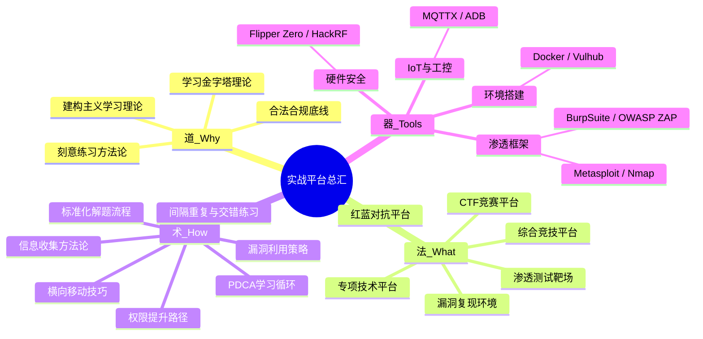

# 第29章 实战平台总汇：本章小结

## 知识图谱：本章架构总览

本章从"道法术器"四个维度构建了网络安全实战平台的完整知识体系。以下思维导图展示了全章三大部分（理论基础、核心技巧、实战案例）的知识脉络与衔接关系：



## 一、本章核心要点回顾

### 1.1 实战平台的理论根基：为什么必须动手？

实战平台的价值远超"练手工具"的浅层认知。从教育心理学角度看，它们解决了安全学习中最核心的问题——**理论与实践之间的鸿沟**。

**学习金字塔理论**（Edgar Dale, 1960s）指出：
- 被动学习（听课、阅读）→ 知识留存率仅 5%-10%
- 主动学习（讨论、实践）→ 知识留存率可达 50%-75%
- 教授他人（写writeup、做分享）→ 知识留存率高达 90%

这意味着：你读完本章的理论知识，如果不去动手实践，一周后只能记住不到10%。但如果你在HTB上完成一台靶机，再写一篇writeup分享出去，留存率可以达到90%。这就是为什么"道法术器"中，"术"和"器"（动手实践）的权重远大于"道"和"法"（理论学习）。

**刻意练习理论**（Anders Ericsson, 1993）进一步揭示：真正带来技能提升的，不是单纯的重复练习，而是**在适当难度区间内有目标、有反馈、可迭代的精进训练**。实战平台恰好提供了这种条件——每个靶标都是一个经过设计的挑战，难度渐进且有明确完成标准。

**建构主义学习理论**（Jean Piaget）则告诉我们：知识不是被动接收的，而是学习者通过与环境互动主动构建的。在HackTheBox上面对一台目标机器时，没有人告诉你这台机器有什么漏洞。你必须通过端口扫描、服务枚举、代码分析来主动发现攻击面。这个探索过程本身就是你在构建自己对攻击链的理解——每一步发现都会修正你头脑中的心理模型。

**本章覆盖的六大类平台，每一类对应不同的能力维度：**

| 平台类型 | 训练能力 | 适用阶段 | 典型平台 | 学习周期建议 |
|---------|---------|---------|---------|------------|
| CTF竞赛平台 | 单点突破、逆向思维、限时压力下的策略决策 | 进阶+ | CTFHub, XCTF, BUUCTF | 持续参与，每周至少1场 |
| 渗透测试靶场 | 完整渗透链、系统性思维、报告撰写 | 入门-高级 | HTB, THM, VulnHub | 3-6个月/阶段 |
| 漏洞复现环境 | 漏洞原理理解、调试能力、补丁分析 | 初中级 | Vulhub, Vulfocus | 1-3个月 |
| 红蓝对抗平台 | 团队协作、实时攻防决策、应急响应 | 高级 | 阿里云安全攻防, LetsDefend | 按需参与 |
| 专项技术平台 | 纵深技术、领域深耕（IoT/云/二进制） | 中高级 | RouterSploit, CloudGoat, GitHub | 持续学习 |
| 综合竞技平台 | 全能型能力、时间压力下的优先级判断 | 进阶+ | CTFHub, 攻防世界 | 月度参与 |

### 1.2 平台选择的决策框架

"选哪个平台"是初学者最常见的困惑。本章推荐以下**三阶决策法**：

**第一阶：评估自身状况**

| 评估维度 | 选项A → 推荐 | 选项B → 推荐 |
|---------|-------------|-------------|
| 技术水平 | 零基础 → THM / OverTheWire | 有基础 → HTB / VulnHub |
| 可用时间 | 每天>2小时 → 深度平台 | <1小时 → CTF每日挑战 |
| 网络条件 | 国际访问受限 → CTFHub / 攻防世界 | 网络畅通 → HTB / THM |
| 语言能力 | 英文弱 → 国产平台+中文社区 | 英文好 → 英文平台为主 |
| 职业方向 | Web安全 → PortSwigger / Web靶场 | 二进制 → PWN平台 / ROP Emporium |

**第二阶：确定目标方向**

- **全职安全从业者** → HTB VIP + OSCP靶场 + 实战项目（漏洞赏金/护网）
- **在校学生入行** → THM学生优惠($10/年) + CTF参赛 + GitHub开源贡献
- **转行学习者** → VulnHub系统训练 + 认证备考（OSCP/CEH）+ 12个月计划
- **在职提升** → 专项平台深耕 + 漏洞赏金计划（HackerOne/Bugcrowd）

**第三阶：制定组合方案**

不推荐"一个平台吃到底"。最优策略是**2+1+1组合**：
- **2个核心平台**：一个系统性靶场（如HTB/THM）作为主线，一个CTF平台作为支线
- **1个复现环境**：Vulhub或Vulfocus，用于理解具体漏洞原理
- **1个实践出口**：漏洞赏金、护网行动或在职项目，将练习转化为实战经验

### 1.3 实战案例的核心收获

本章的十个实战案例覆盖了从入门到高级的完整光谱，核心收获提炼如下：

| 案例 | 核心技能点 | 难度 | 关键收获 |
|------|----------|------|---------|
| 案例一 TryHackMe入门 | 引导式学习路径 | ★☆☆ | THM的Room设计是最好的入门阶梯，跟着路径走比盲刷题高效3倍 |
| 案例二 HTB靶机渗透 | 完整渗透链 | ★★★ | 从信息收集到提权的全流程，时间管理是关键 |
| 案例三 BUUCTF竞赛 | CTF限时解题 | ★★☆ | 优先做拿手方向，时间分配决定最终排名 |
| 案例四 Vulhub漏洞复现 | CVE漏洞原理 | ★★☆ | Docker一键部署极大降低了环境搭建门槛 |
| 案例五 LetsDefend蓝队 | SOC分析与响应 | ★★☆ | 蓝队视角是被大多数学习者忽视的能力维度 |
| 案例六 CloudGoat云安全 | AWS云环境攻防 | ★★★ | 云安全是增长最快的领域，IAM配置错误是最常见切入点 |
| 案例七 PortSwigger高级Web | OWASP Top 10深度 | ★★★ | PortSwigger的Lab设计是Web安全训练的标杆 |
| 案例八 HTB Active Directory | AD域渗透 | ★★★★ | 内网渗透需要系统化的知识，无法速成 |
| 案例九 BUUCTF Crypto | 密码学竞赛 | ★★★ | Crypto需要数学功底，SageMath是必备工具 |
| 案例十 Vulhub Spring4Shell | 框架漏洞复现 | ★★☆ | 框架级漏洞影响面极大，及时补丁是防御关键 |

## 二、方法论精要：高效利用平台的四步循环

### 2.1 PDCA 学习循环

将实战平台学习抽象为一个持续迭代的闭环：

```mermaid
flowchart TD
    A[Plan: 制定学习计划] --> B[Do: 动手解题]
    B --> C[Check: 复盘总结]
    C --> D[Act: 改进调整]
    D --> A
    
    A1[设定SMART目标<br>选择合适靶标<br>预估时间分配] --> A
    B1[按标准化流程执行<br>记录关键步骤<br>独立思考至少30分钟] --> B
    B2[遇到卡点:先独立思考30min<br>再查阅提示(非完整writeup)] --> B
    C1[对比官方writeup<br>分析差距根因<br>提炼知识点] --> C
    D1[更新笔记体系<br>调整学习路径<br>补充理论短板] --> D
```

**Plan 阶段的关键操作：** 不要盲目开始。先花 5-10 分钟理解靶标的类型（Web/二进制/密码学）、难度等级、涉及的技术栈。新手常见的错误是选择难度远超当前水平的靶标，导致挫败感。正确的做法是：在你的"最近发展区"内练习——成功率60%-80%的难度区间是最佳学习区。

**Do 阶段的黄金30分钟原则：** 遇到卡点时，先给自己 30 分钟的独立思考时间。不要立刻查看 writeup。30 分钟后仍无进展，可以部分查阅提示（HTB 的官方提示系统设计得非常合理），但只获取下一步方向而非完整解法。研究表明，"试错→卡住→反思→突破"的过程是刻意练习的核心环节，跳过这个环节等于跳过了最有效的学习机会。

**Check 阶段的复盘模板：** 每次完成挑战后，填写以下结构化复盘，而不是简单记录做了哪些步骤：

> **挑战复盘模板**
> - 目标机/题目：____________
> - 涉及技术点：____________
> - 解题用时：总时长____ / 实际动手____ / 查资料____
> - 卡点位置：____________
> - 突破方法：____________
> - 改进空间：____________
> - 关联知识点（至少3个）：____________
> - 遗忘/模糊的知识点：____________（用于间隔重复）

**Act 阶段的关键：** 复盘不是终点，而是下一轮学习的起点。根据复盘发现的薄弱环节，调整下一步的学习计划。例如：如果发现SSRF类题目失败率高，就制定专项练习计划，在不同平台上连续做3-5道SSRF相关的挑战。

### 2.2 标准化的解题七步法

无论面对什么平台，以下七步流程可以让你保持清晰的思路：

| 步骤 | 内容 | 时间预算 | 关键工具 |
|------|------|---------|---------|
| 第1步 | 信息收集 | 15分钟 | nmap, gobuster, whatweb |
| 第2步 | 漏洞识别 | 20分钟 | searchsploit, nikto, OWASP ZAP |
| 第3步 | 漏洞利用 | 30分钟 | Metasploit, 手工EXP, 自定义Payload |
| 第4步 | 权限维持 | 选做 | 反弹Shell持久化, 后门植入 |
| 第5步 | 内网探测 | 进阶 | 横向移动, 权限提升, 内网信息收集 |
| 第6步 | 目标达成 | - | 获取Flag/最终权限, 记录证据 |
| 第7步 | 复盘总结 | **必做！** | 写writeup, 补充知识库, 分享交流 |

**信息收集的标准化命令模板：**

```bash
# 第1步：全端口扫描（发现所有开放服务）
nmap -sC -sV -p- -T4 target_ip -oA nmap_full

# 目录扫描（发现隐藏的Web路径）
gobuster dir -u http://target_ip -w /usr/share/wordlists/dirbuster/directory-list-2.3-medium.txt -x php,html,txt -o gobuster_results.txt

# 服务指纹识别（确认技术栈）
whatweb http://target_ip

# 子域名枚举（如有域名）
gobuster vhost -u http://target_ip -w /usr/share/wordlists/seclists/Discovery/DNS/subdomains-top1million-5000.txt
```

**漏洞识别的系统化方法：**

```bash
# 第2步：版本漏洞搜索
searchsploit apache 2.4.49  # 根据nmap扫描到的版本搜索已知漏洞

# Web漏洞自动化扫描
nikto -h http://target_ip -o nikto_results.html

# 手动测试常见Web漏洞
# SQL注入：在所有参数后加 ' 观察报错
# XSS：在所有输入点测试 <script>alert(1)</script>
# 文件上传：尝试上传WebShell（修改扩展名、Content-Type）
# SSRF：在URL参数中尝试 http://127.0.0.1 和 http://localhost
```

### 2.3 工具链构建策略

不要一次性安装所有工具。建议按阶段渐进式构建：

**初期（0-3个月）基础工具链：**

```bash
# 基础工具安装（Kali/Debian系）
sudo apt update && sudo apt install nmap wireshark sqlmap gobuster nikto -y

# BurpSuite Community 手动下载安装（从PortSwigger官网）
# OWASP ZAP（开源替代BurpSuite）
sudo apt install zaproxy -y

# Python 脚本环境
pip install requests beautifulsoup4 pwntools

# 信息收集增强
sudo apt install whatweb curl -y
```

**中期（3-6个月）进阶工具链：**

```bash
# 漏洞利用框架
sudo apt install metasploit-framework exploitdb -y

# 内网渗透工具集
git clone https://github.com/BloodHoundAD/BloodHound.git
git clone https://github.com/gentilkiwi/mimikatz.git

# 逆向调试工具
sudo apt install gdb radare2 ghidra -y

# 密码学工具
pip install hashcat sage
sudo apt install john -y

# 自动化信息收集
pip3 install autorecon
```

**高级（6个月+）专业工具链：**

```bash
# 云安全工具
pip install awscli scoutsuite pacu

# 容器安全
docker pull vulnerables/web-dvwa
pip install trivy  # 容器镜像漏洞扫描

# IoT/硬件安全
# Flipper Zero 固件刷写工具链
# HackRF SDR 驱动与工具

# 代码审计
pip install semgrep bandit  # 静态代码分析
sudo apt install trufflehog -y  # 密钥泄露检测
```

### 2.4 笔记与知识管理体系

建立个人知识库是"从学习者到专家"的关键一步。推荐以下**三层笔记结构**：

**第一层：挑战日志（Writeup）**
- 按平台分类（HTB/THM/BUUCTF等），建立统一的目录结构
- 每篇包含：靶标背景→信息收集→漏洞分析→利用过程→Flag→技术总结
- 格式建议：Markdown + 截图 + 命令记录（方便复现）
- 工具推荐：Obsidian（本地知识库，支持双向链接）、语雀（云端共享）、GitHub Pages（公开博客）
- **关键习惯**：每篇writeup结尾必须写"改进空间"和"关联知识点"，为间隔重复做准备

**第二层：知识索引（技术字典）**
- 按漏洞类型分类（SQL注入/XSS/SSRF/RCE/反序列化等）
- 每种漏洞包含：原理→检测方法→利用方式→修复建议→关联CVE→常用Payload
- 这是你自己的"安全百科"，随着学习持续积累
- **使用方法**：遇到新题目时，先查阅知识字典确认是否已掌握该类漏洞的利用方式

**第三层：方法论沉淀（思维模型）**
- 解题流程模板（如本章的七步法）
- 漏洞发现Checklist（OWASP Top 10逐项检查）
- 工具使用技巧速查表
- 常见绕过方法汇总（WAF绕过、过滤绕过）
- **进阶**：建立个人的"攻击思维树"——遇到不同类型的系统时，系统化地枚举所有可能的攻击面

## 三、各阶段学习路径详解（含具体里程碑）

### 3.1 入门阶段（0-3个月）：夯实基础

**目标：** 建立基本的安全思维，熟悉常用工具，完成 30+ 基础挑战

| 周次 | 学习内容 | 实操平台 | 产出物 | 每日时间 |
|-----|---------|---------|-------|---------|
| 第1周 | Linux基础命令、网络协议基础 | OverTheWire Bandit 1-10 | 完成10关 | 2-3小时 |
| 第2周 | Web基础（HTTP/HTML/JavaScript） | THM Web 基础模块 | 5篇笔记 | 2-3小时 |
| 第3周 | 信息收集工具（Nmap/Gobuster） | THM 信息收集模块 | 工具使用Cheatsheet | 2-3小时 |
| 第4周 | 常见Web漏洞（SQLi/XSS） | THM Web漏洞模块 + DVWA | 10篇writeup | 3-4小时 |
| 第5-6周 | 渗透测试基本流程 | VulnHub基础靶机 x5 | 5篇完整writeup | 3-4小时 |
| 第7-8周 | 权限提升基础（Linux） | THM权限提升模块 | 提权方法汇总 | 3-4小时 |
| 第9-12周 | 综合练习 + 间隔重复 | THM/PicoCTF | 30+挑战记录 | 3-4小时 |

**里程碑验证：** 能独立完成一个中等难度的 VulnHub 靶机（如 Kioptrix 系列），写出完整的渗透测试报告（包含信息收集、漏洞发现、利用过程、修复建议），并在GitHub或博客上公开发布。

**入门阶段常见卡点与应对：**

| 卡点 | 原因 | 解决方案 |
|------|------|---------|
| Linux命令不熟 | 缺少日常使用经验 | 每天花30分钟在OverTheWire Bandit上练习 |
| Nmap扫描结果看不懂 | 网络协议基础薄弱 | 先补TCP/IP四层模型，再回来用Nmap |
| 不知道从哪里开始渗透 | 缺乏方法论 | 严格按七步法执行，先信息收集再漏洞利用 |
| 写writeup不知道写什么 | 缺乏结构化思维 | 按"背景→发现→利用→总结"四段式写 |

### 3.2 进阶阶段（3-6个月）：体系化提升

**目标：** 掌握完整渗透测试流程，具备CTF竞赛基本能力

| 方向 | 重点内容 | 推荐平台 | 考察指标 | 建议用时 |
|------|---------|---------|---------|---------|
| Web安全 | OWASP Top 10深度理解、WAF绕过、逻辑漏洞 | HTB Web挑战、PortSwigger Labs | 独立完成40道CTF Web题 | 每周10小时 |
| 二进制安全 | 缓冲区溢出、ROP链、堆利用基础 | PicoCTF PWN、BUUCTF PWN | 完成15道PWN题 | 每周8小时 |
| 密码学 | 常见加密算法攻击、哈希碰撞 | CryptoHack、XCTF密码学 | 完成20+密码学挑战 | 每周6小时 |
| 逆向工程 | 静态/动态分析、反调试绕过 | Reversing.kr、XCTF Reverse | 完成10道逆向题 | 每周6小时 |
| 内网渗透 | 横向移动、域渗透、Kerberos攻击 | HTB Active Directory靶场 | 完成5台AD靶机 | 每周8小时 |

**里程碑验证：** 在 HTB 上获得 10+ 台 Active 机器权限（Pro Hacker 等级），参加过 1-2 次 CTF 比赛并做出 3+ 道题，拥有个人GitHub上的writeup仓库。

**进阶阶段的效率提升技巧：**
- 使用AutoRecon自动化信息收集，节省30%的手动扫描时间
- 建立个人Payload模板库，遇到类似漏洞直接复用
- 每周固定时间做"间隔重复"——回顾一周前做过的题目，不看writeup重新解一遍
- 加入CTF战队或安全社区，通过团队协作学习他人的思路

### 3.3 高级阶段（6-12个月）：专业化深耕

**目标：** 在某一个方向形成深度优势，具备独立漏洞发现能力

```text
方向一：Web安全深水区
  ├─ 高级绕过技术（WAF绕过、SSRF深化、反序列化链构造）
  ├─ 代码审计实战（Java/PHP/Python/Go）
  ├─ 企业级漏洞挖掘（逻辑漏洞、越权、竞态条件）
  ├─ API安全测试（GraphQL、REST API认证绕过）
  └─ 目标：在SRC/HackerOne上提交有效漏洞，获得致谢或奖金

方向二：二进制与系统安全
  ├─ 堆溢出与堆利用（House of系列、IO_FILE利用）
  ├─ 内核漏洞利用（内核提权、sandbox逃逸）
  ├─ ARM/IoT逆向（固件提取、协议分析）
  ├─ 浏览器安全（V8引擎漏洞、沙箱逃逸）
  └─ 目标：在CVE中留有编号或公开EXP，在Pwn2Own等比赛中有所斩获

方向三：云安全与基础设施
  ├─ AWS/Azure/GCP安全加固与攻防
  ├─ Kubernetes安全与容器逃逸
  ├─ CI/CD管道安全（GitHub Actions、Jenkins）
  ├─ 基础设施即代码（IaC）安全审计
  └─ 目标：获得云安全认证（CCSP/AWS Security Specialty）

方向四：红队实战
  ├─ 社会工程学（钓鱼/物理渗透/水坑攻击）
  ├─ 应用层C2通信（自定义C2框架、流量混淆）
  ├─ 防御绕过（EDR/AV规避、AMSI绕过）
  ├─ 持久化与横向渗透（域渗透、黄金票据）
  └─ 目标：参与护网行动或红队评估，建立个人红队工具集
```

**里程碑验证：** 在某一个方向形成系统化知识体系，公开分享 10+ 篇高质量技术文章，在漏洞赏金平台获得首笔奖励或在SRC提交有效漏洞。

### 3.4 专家阶段（12个月+）：影响力构建

**目标：** 从技术执行者成长为安全专家，建立行业影响力

| 维度 | 具体行动 | 预期成果 |
|------|---------|---------|
| 技术深耕 | 持续跟踪安全研究前沿，阅读顶级会议论文 | 能理解并复现BlackHat/DEF CON的最新研究 |
| 漏洞发现 | 在CVE、HackerOne、SRC上持续贡献 | 累计10+有效CVE编号，HackerOne排行前列 |
| 知识传播 | 撰写技术博客、做安全演讲、录制教学视频 | 个人品牌建立，成为细分领域KOL |
| 工具贡献 | 开发开源安全工具或为知名项目贡献代码 | GitHub上拥有被广泛使用的安全工具 |
| 团队建设 | 组建或加入CTF战队，指导新人 | 战队在国内外CTF比赛中取得优异成绩 |

## 四、常见误区深度剖析

### 误区一：贪多求全，多平台齐头并进

**错误表现：** 同时注册 5-6 个平台，每个浅尝辄止，一周后全部搁置。

**根本原因：** 对"积累效应"缺乏认知。每一个靶场都有自己的环境、工具和难度曲线，频繁切换平台意味着巨大的"环境适应成本"。

**纠正方法：** 采用"一口井挖到底"策略。前 3 个月只使用 1 个核心平台（推荐 THM 或 VulnHub），彻底熟悉后再横向扩展。研究表明，在单一平台上完成50道题的学习效果，远好于在5个平台上各做10道题。

### 误区二：过早依赖 Writeup

**错误表现：** 遇到困难立刻查看 writeup，感觉"看懂了"就跳过。

**认知陷阱：** 看懂和能做是两回事。当你阅读 writeup 时，你获得的是"被动知识"——你知道有人这样做了，但你没有亲自走过这条路径。缺少了"试错→卡住→反思→突破"的刻意练习关键环节。

**纠正方法：** 设置"三次独立尝试"规则——至少用自己的方法尝试三次、每次都坚持 30 分钟以上，才允许查看部分提示。如果看完整writeup后，隔一周重新做一遍（不看writeup），能独立完成才说明真正掌握。

### 误区三：重攻轻防，能力结构失衡

**错误表现：** 只会用工具扫描和已知漏洞，不了解防御机制的工作原理。

**深层问题：** 攻击和防御是同一枚硬币的两面。不了解 WAF 规则，你就不知道如何绕过 WAF；不了解日志审计，你就无法掩盖踪迹。真正的安全专家必须同时理解攻防双方。

**纠正方法：** 每月至少完成一个蓝队/防御侧练习。用 Splunk 分析攻击日志、编写检测规则、配置Snort/Suricata规则。HTB 的堡垒（Fortress）模式、LetsDefend 和 CyberDefenders 是蓝队训练的优秀平台。

### 误区四：只看技术不看原理

**错误表现：** 能跑通 Metasploit 模块但说不清漏洞触发机制，能利用 SQL 注入但写不出手工 Payload。

**深层问题：** 工具会过时，漏洞会修补，但原理不会变。理解"为什么"比记住"怎么做"重要得多。

**纠正方法：** 每条命令都问自己"为什么这样写"？每次利用成功都尝试手工复现。例如：能用 SQLMap 跑出数据后，尝试手工构造完整的注入 Payload；能用Metasploit获得shell后，尝试理解exploit的每一行代码在做什么。

### 误区五：忽视环境搭建能力

**错误表现：** 只会用平台提供的在线环境，无法在本地搭建测试环境。

**深层问题：** 在线平台依赖网络连接，且环境有时效性限制。本地搭建能力让你可以：自由修改环境进行实验、反复重置环境练习、在无网络环境下学习、搭建自定义靶场。

**纠正方法：** 学会使用 Docker 和 Docker Compose 在本机构建靶场。

```bash
# 本地搭建 Vulhub 环境（基本功）
git clone https://github.com/vulhub/vulhub.git
cd vulhub/thinkphp/5-rce
docker-compose up -d
echo "靶场运行中：http://localhost:8080"

# 练习后清理环境
docker-compose down -v  # -v 同时删除数据卷

# 查看运行中的容器
docker ps
```

### 误区六：忽视时间管理和目标设定

**错误表现：** 每天"随便做做"，没有明确的学习目标和时间规划，三个月后发现自己几乎没有进步。

**根本原因：** 缺乏结构化的学习计划。没有目标的练习等于无效重复。

**纠正方法：** 使用SMART原则制定每周学习目标，每天固定时间段练习（推荐每天2-3小时），每周日做一次复盘。可以使用本章介绍的SkillTracker脚本追踪自己的进度和弱点分布。

### 误区七：不写Writeup，学了就忘

**错误表现：** 做完题目就翻篇，不记录、不总结、不分享。

**深层问题：** 没有writeup的学习相当于"用完就扔"。你不会记得三周前做过的那台靶机是怎么利用SSRF打内网的，下次遇到类似场景还是要从头摸索。

**纠正方法：** 坚持写writeup，即使简短也要写。最低标准：每道题记录"题目名→关键漏洞→核心Payload→学到的知识点"。进阶标准：写完整的解题报告并在GitHub上公开，接受社区review。

## 五、综合资源速查表

### 5.1 平台速查对比

| 平台名称 | 类型 | 难度 | 语言 | 付费情况 | 适合人群 | 特色优势 |
|---------|------|------|------|---------|---------|---------|
| TryHackMe | 渗透靶场 | ★☆☆-★★★ | 英 | 基础免费/进阶$14/月 | 零基础入门 | 引导式学习路径，学生折扣$10/年 |
| HackTheBox | 渗透靶场 | ★★☆-★★★★ | 英 | 基础免费/VIP $14/月 | 有基础进阶 | 高仿真，机器更新快，Proving Grounds |
| VulnHub | 靶机下载 | ★★☆-★★★ | 英 | 完全免费 | 有一定基础 | 可离线部署，社区Writeup丰富 |
| CTFHub | CTF综合 | ★☆☆-★★★★ | 中 | 免费 | 全阶段 | 国产精品，题目分类清晰，技能树设计 |
| 攻防世界 | CTF综合 | ★★☆-★★★ | 中 | 免费 | 初中级 | XCTF官方，赛事联动 |
| BUUCTF | CTF综合 | ★☆☆-★★★★ | 中 | 免费 | 全阶段 | 题目量大（2000+），适合刷题 |
| Vulhub | 漏洞复现 | ★★☆ | 英/中 | 免费 | 中级 | Docker一键部署，CVE覆盖率最高 |
| OverTheWire | 游戏化 | ★☆☆-★★☆ | 英 | 免费 | 零基础 | 游戏化学习，Bandit经典关卡设计 |
| PortSwigger Academy | Web专项 | ★★☆-★★★★ | 英 | 免费 | 中级+ | Web安全训练标杆，Lab设计精良 |
| CryptoHack | 密码学 | ★☆☆-★★★★ | 英 | 免费 | 中级+ | 密码学专项，从古典到现代全覆盖 |
| pwnable.kr/tw | 二进制 | ★★☆-★★★★ | 英/韩 | 免费 | 中级+ | 二进制安全专项，题目设计精巧 |
| LetsDefend | 蓝队/SOC | ★★☆-★★★ | 英 | 基础免费 | 初中级 | 蓝队训练标杆，模拟真实SOC环境 |
| CyberDefenders | 蓝队取证 | ★★★-★★★★ | 英 | 免费 | 中高级 | 数字取证分析，蓝队专项训练 |
| CloudGoat | 云安全 | ★★★-★★★★ | 英 | 免费(需AWS账号) | 中高级 | AWS云攻防实战，Django一键部署 |
| PicoCTF | CTF入门 | ★☆☆-★★☆ | 英 | 免费 | 学生/入门 | CMU出品，教育导向，适合学生群体 |

### 5.2 学习社区与信息源

**中文社区：**
- 先知社区（xianzhicommunity.com）：高质量漏洞分析和渗透测试文章
- 安全客（anquanke.com）：漏洞通报、安全资讯、技术文章
- FreeBuf（freebuf.com）：综合性安全媒体，适合跟踪行业动态
- 看雪论坛（kanxue.com）：逆向工程和二进制安全的中文社区聚集地
- 吾爱破解（52pojie.cn）：逆向工程和软件安全的活跃社区
- 创宇安全（knownsec.com）：漏洞研究和安全技术分享

**国际社区：**
- Reddit r/netsec、r/hacking：安全新闻和讨论
- HackTheBox Forum：HTB相关的解题讨论和writeup分享
- CTFTime（ctftime.org）：全球CTF赛事日历和队伍排名
- InfoSec Writeups（infosecwriteups.com）：CTF和渗透测试writeup聚合
- Twitter/X 安全圈：跟踪安全研究员的最新发现

**漏洞信息与CVE：**
- CVE Mitre（cve.mitre.org）：CVE编号官方数据库
- Exploit-DB（exploit-db.com）：公开exploit代码库
- Packet Storm Security：安全漏洞公告和exploit
- NVD（nvd.nist.gov）：NIST国家漏洞数据库，含CVSS评分
- GitHub Advisory Database：GitHub托管的安全公告

**认证信息与职业发展：**
- OffSec（offsec.com）：OSCP/OSEP/OSCE认证，渗透测试行业黄金标准
- EC-Council（ec-council.org）：CEH认证，偏理论和管理
- SANS/GIAC（sans.org）：GPEN/GWAPT等高级认证，业界认可度最高
- CompTIA Security+：入门级安全认证，适合转行者

### 5.3 给不同读者的最后建议

**如果你是学生：**
利用 THM 学生优惠（年费$10），配合 CTFHub 系统学习。大二结束时争取在 HTB 达到 Pro Hacker 等级（10+台Active机器）。参加校级CTF和全国大学生信息安全竞赛，积累竞赛经验。利用课余时间在GitHub上建立个人writeup仓库，这将是未来求职的重要资产。

**如果你是转行者：**
从 OverTheWire Bandit 开始建立信心，然后用 THM 系统学习 3-4 个月，接着考 OSCP 作为入行敲门砖。OSCP认证在安全行业认可度极高，是转行者最有力的能力证明。同时关注漏洞赏金平台（HackerOne/Bugcrowd），第一个有效漏洞的奖金不仅是经济回报，更是简历上的亮眼经历。

**如果你是在职开发者：**
重点关注 Web 安全和代码审计方向，用 PortSwigger Web Security Academy 系统学习 OWASP Top 10，配合 SRC 漏洞挖掘实践。你的开发经验是巨大优势——你能理解代码层面的漏洞原理，比纯安全背景的人更快上手代码审计。建议从你日常使用的技术栈开始（如Java Spring/Python Django/Node.js），深入该框架的安全特性。

**如果你是安全从业者：**
每年参加 2-3 次高质量护网或红队活动，持续跟踪顶尖安全会议（BlackHat/DefCon/ISC2）的最新研究，在 HackerOne 上参与私密漏洞赏金计划。考虑考取OSCP/OSCE等高级认证，或向安全架构师/安全顾问方向发展。持续输出技术博客和演讲，建立个人品牌影响力。

## 六、学习效果自评清单

完成本章学习后，用以下清单检验自己的掌握程度：

| 评估项 | 入门级（0-3个月） | 进阶级（3-6个月） | 高级（6-12个月） |
|-------|-----------------|-----------------|----------------|
| 平台选择 | 能说出3个适合自己的平台及原因 | 能设计2+1+1平台组合方案 | 能评估新平台的质量和适用性 |
| 信息收集 | 能使用Nmap完成基础扫描 | 能使用AutoRecon+手动枚举 | 能进行无网络环境下的OSINT |
| 漏洞利用 | 能利用已知CVE获取shell | 能手工构造SQLi/XSS Payload | 能发现逻辑漏洞和0day |
| 权限提升 | 能使用LinPEAS检查提权向量 | 能手动利用SUID/cron提权 | 能利用内核漏洞或链式提权 |
| 工具使用 | 会用3-5个基础工具 | 会用10+工具并能组合使用 | 能开发自定义工具/脚本 |
| 笔记体系 | 有基础的writeup记录 | 三层笔记体系运转良好 | 拥有个人安全知识库和博客 |
| 社区参与 | 能阅读他人writeup | 能在社区讨论和提问 | 能输出高质量技术文章 |

## 结语

实战平台是安全学习者从"知道"到"做到"的桥梁。本章系统梳理了六大类平台的选择方法、使用技巧和进阶路径。真正的成长不在于注册了多少平台，而在于**每一个挑战后的深度复盘**和**每一次失败后的认知升级**。

本章各节知识点已形成完整的闭环：平台认知（是什么）→ 选择决策（选哪个）→ 上手使用（怎么用）→ 深度复盘（怎么学）→ 持续进阶（去哪里）。将这个循环融入日常学习习惯，你会发现每一步都在构建自己坚实的安全能力体系。

最后，请记住三个核心原则：
1. **动手优于阅读**——看完本章后，请立即打开一个实战平台，完成你的第一道挑战
2. **坚持优于天赋**——每天2小时的持续练习，比偶尔一天突击12小时有效得多
3. **分享优于独占**——写一篇writeup分享出去，你会发现自己理解得更深刻了

下一章将进入**职业发展路径**专题，讨论如何将本章学到的实战技能转化为职业竞争力，包括认证规划、简历构建、面试准备和长期职业发展策略。
