## 本节小结：前六个实战案例回顾与学习指南

在前面的六个实战案例中，我们从入门到进阶、从攻击到防御、从单机到云端，系统地走过了网络安全实战训练的核心路径。每个案例不仅展示了特定平台的使用方法，更承载了一套完整的学习方法论。本节将对前六个案例进行深度复盘，提炼共性规律，并为读者制定个性化的后续学习路线。

### 一、六个案例的核心价值回顾

| 案例 | 平台 | 定位 | 核心技能 | 难度 |
|------|------|------|----------|------|
| 案例一 | TryHackMe | 入门引导 | Linux基础、网络基础、Web安全入门、信息收集 | ★☆☆☆☆ |
| 案例二 | HackTheBox | 渗透测试 | 靶机渗透、漏洞利用链、提权、内网穿透 | ★★★☆☆ |
| 案例三 | BUUCTF | CTF竞赛 | SQL注入、密码学、逆向工程、杂项 | ★★★☆☆ |
| 案例四 | Vulhub | 漏洞复现 | Docker环境搭建、CVE漏洞验证、漏洞原理分析 | ★★★☆☆ |
| 案例五 | LetsDefend | 蓝队防御 | SIEM分析、日志取证、应急响应、告警研判 | ★★★☆☆ |
| 案例六 | CloudGoat | 云安全 | AWS IAM配置、SSRF提权、云上攻击路径 | ★★★★☆ |

这六个案例构成了一个完整的攻防训练闭环：**TryHackMe打基础 → HackTheBox练渗透 → BUUCTF拓视野 → Vulhub深挖漏洞 → LetsDefend补防御 → CloudGoat拓云上**。读者如果按照这个顺序系统学习，已经具备了中级安全从业者的实战框架。

### 二、跨案例的核心学习规律

#### 2.1 信息收集是所有攻击的起点

回顾六个案例，信息收集贯穿始终。在TryHackMe中，我们用Nmap扫描端口发现服务；在HackTheBox中，信息收集的结果直接决定了攻击路径的选择；在BUUCTF中，题目往往需要从蛛丝马迹中提取关键信息；在Vulhub中，识别漏洞版本号是复现的前提；在CloudGoat中，枚举IAM策略是攻击的第一步。

**规律总结**：无论面对什么目标，信息收集永远是第一步，且收集的全面程度直接决定攻击成功率。初学者最常见的错误就是急于使用攻击工具而忽略了前期侦察。

```text
信息收集的标准流程：
1. 被动收集 → Whois、DNS记录、搜索引擎（OSINT）
2. 主动扫描 → Nmap端口扫描、服务指纹识别
3. 深度枚举 → 目录爆破、参数fuzz、子域名探测
4. 漏洞探测 → 版本匹配、已知漏洞库查询
```

#### 2.2 漏洞理解比漏洞利用更重要

在Vulhub案例中，我们不仅复现了漏洞，更深入分析了漏洞的成因、影响范围和修复方案。在HackTheBox中，很多靶机的漏洞利用依赖于对底层原理的理解，而非简单的脚本套用。BUUCTF的密码学题目更是直接考察对加密算法原理的掌握。

**规律总结**：会用工具只是"术"，理解原理才是"道"。一个理解了SQL注入原理的安全人员，即使面对WAF也能找到绕过方式；而只会复制粘贴payload的人，在真实环境中往往寸步难行。

#### 2.3 攻防思维需要同步培养

前六个案例中，案例一到案例四侧重攻击，案例五转向防御，案例六则融合了攻防视角。这种设计并非偶然——真正的安全能力是攻防一体的。

| 攻击视角 | 防御视角 |
|----------|----------|
| 寻找薄弱点并利用 | 识别攻击行为并阻断 |
| 关注如何突破边界 | 关注如何守住边界 |
| 追求最高权限 | 追求最小权限 |
| 利用配置缺陷 | 修复配置缺陷 |
| 红队模拟攻击 | 蓝队检测响应 |

**规律总结**：只懂攻击的人容易成为黑客，只懂防御的人难以预见新型威胁。攻防兼备才能真正理解安全的本质——它是一个持续对抗的过程。

#### 2.4 Writeup是最好的学习工具

在BUUCTF案例中，我们展示了Writeup的写作方法。这不是可有可无的"作业"，而是将零散知识结构化的最佳手段。研究表明，"费曼学习法"——用自己的话教给别人——是最高效的学习方式之一。

**高质量Writeup的要素**：

1. **题目信息**：难度评级、分类标签、涉及技术点
2. **解题思路**：从拿到题目到最终解题的思维过程
3. **关键步骤**：每一步操作的目的和结果
4. **踩坑记录**：遇到的障碍和解决方案
5. **知识点总结**：提炼出的通用方法和原理
6. **改进建议**：如果重做会怎样优化

### 三、六个案例对应的能力模型

通过对六个案例的综合分析，可以提炼出网络安全从业者需要具备的核心能力模型：

```mermaid
graph TD
    A[网络安全核心能力模型] --> B[信息收集能力]
    A --> C[漏洞分析能力]
    A --> D[渗透测试能力]
    A --> E[防御检测能力]
    A --> F[安全研究能力]
    A --> G[云安全能力]
    
    B --> B1[被动侦查OSINT]
    B --> B2[主动扫描Nmap]
    B --> B3[Web枚举DirBuster]
    
    C --> C1[漏洞原理理解]
    C --> C2[CVE分析验证]
    C --> C3[0day挖掘思路]
    
    D --> D1[漏洞利用链构建]
    D --> D2[权限提升技术]
    D --> D3[后渗透操作]
    
    E --> E1[日志分析研判]
    E --> E2[告警分类处置]
    E --> E3[应急响应流程]
    
    F --> F1[CTF解题方法]
    F --> F2[密码学基础]
    F --> F3[逆向分析]
    
    G --> G1[云平台安全配置]
    G --> G2[云上攻击路径]
    G --> G3[云安全最佳实践]
    
    style A fill:#1a1a2e,stroke:#e94560,color:#fff
    style B fill:#16213e,stroke:#0f3460,color:#fff
    style C fill:#16213e,stroke:#0f3460,color:#fff
    style D fill:#16213e,stroke:#0f3460,color:#fff
    style E fill:#16213e,stroke:#0f3460,color:#fff
    style F fill:#16213e,stroke:#0f3460,color:#fff
    style G fill:#16213e,stroke:#0f3460,color:#fff
```



对应到六个案例的覆盖关系：

| 能力维度 | 案例一 | 案例二 | 案例三 | 案例四 | 案例五 | 案例六 |
|----------|:------:|:------:|:------:|:------:|:------:|:------:|
| 信息收集 | ★★★ | ★★☆ | ★☆☆ | ★☆☆ | ★☆☆ | ★★☆ |
| 漏洞分析 | ★☆☆ | ★★☆ | ★★☆ | ★★★ | ★☆☆ | ★★☆ |
| 渗透测试 | ★☆☆ | ★★★ | ★★☆ | ★☆☆ | — | ★★★ |
| 防御检测 | — | — | — | — | ★★★ | — |
| 安全研究 | — | ★☆☆ | ★★★ | ★☆☆ | — | — |
| 云安全 | — | — | — | — | — | ★★★ |

读者可以据此自查能力短板：如果某个维度在所有案例中都是低分，说明需要在后续学习中重点补充。

### 四、常见问题与纠正建议

在指导大量学员完成这些实战练习后，我们总结了以下高频问题：

| 常见问题 | 具体表现 | 纠正方法 |
|----------|----------|----------|
| 工具依赖症 | 离开Metasploit就不会渗透 | 手动复现工具的每一步操作，理解底层原理 |
| Writeup跳步 | 只写结果不写过程 | 强制要求每一步都有截图和原理说明 |
| 急于求成 | 靶机还没渗透完就换下一个 | 每台靶机至少花2小时，尝试至少3种方法 |
| 忽略防御 | 只关注怎么攻击不管怎么防守 | 每个漏洞都写出对应的修复方案 |
| 不做复盘 | 做完就忘 | 每周整理一次笔记，建立自己的知识库 |
| 孤立学习 | 从不看别人的Writeup | 每周阅读3篇高质量Writeup，对比自己的解题思路 |
| 忽视基础 | 直接挑战高难度题目 | 确保前4个案例的简单题全部完成后才进阶 |

**核心建议**：学习网络安全最忌讳"贪多嚼不烂"。与其一个月做50道题但每道都是一知半解，不如精做10道题但每道都吃透原理。质量永远优先于数量。

### 五、学习路径推荐

根据前六个案例的学习情况，读者可以根据自身定位选择不同的进阶方向：

**路径一：渗透测试方向（红队）**

适合人群：对攻防对抗有兴趣，目标成为渗透测试工程师或红队成员。

```text
推荐进阶顺序：
案例二(HackTheBox) → 补充：案例七(PortSwigger Web安全)
→ 补充：案例八(AD渗透) → 案例三(BUUCTF)进阶题
→ 专项练习：内网渗透、域渗透、0day挖掘
```

重点平台：HackTheBox（持续练习）、PortSwigger Academy（Web专项）、VulnHub（离线靶机）

**路径二：安全运营方向（蓝队）**

适合人群：对安全运维、SOC分析感兴趣，目标成为安全运营工程师或蓝队成员。

```text
推荐进阶顺序：
案例五(LetsDefend) → 深入学习SIEM平台（Splunk/ELK）
→ 应急响应流程 → 威胁狩猎 → 威胁情报
→ 合规与审计（等保2.0、ISO 27001）
```

重点平台：LetsDefend（持续练习）、CyberDefenders（蓝队CTF）、Splunk BOTS（SIEM实战）

**路径三：漏洞研究方向（安全研究）**

适合人群：对漏洞原理有浓厚兴趣，目标成为安全研究员或漏洞猎人。

```text
推荐进阶顺序：
案例四(Vulhub) → CVE深度分析 → 源码审计
→ Fuzzing技术 → 0day挖掘 → 漏洞报告撰写
→ 参与漏洞赏金计划（HackerOne/Bugcrowd）
```

重点平台：Vulhub（漏洞复现）、GitHub安全实验室、CVE数据库、HackerOne/Bugcrowd

**路径四：CTF竞赛方向**

适合人群：喜欢解题竞赛，目标参加CTF比赛或成为全能型选手。

```text
推荐进阶顺序：
案例三(BUUCTF) → CTFtime找战队 → 分方向专攻
→ PWN/Reverse/Web/Crypto/MISC各方向
→ 参加线上赛积累经验 → 加入线下赛团队
```

重点平台：BUUCTF、CTFHub、picoCTF、攻防世界

### 六、学习效率提升技巧

#### 6.1 建立个人知识库

将学习过程中的笔记、Writeup、工具用法整理成结构化的知识库，是长期成长的关键。推荐使用Obsidian或Notion搭建个人Wiki，按技术方向分类管理：

```text
个人安全知识库/
├── 信息收集/
│   ├── Nmap常用命令速查.md
│   ├── 子域名枚举方法汇总.md
│   └── OSINT工具合集.md
├── Web安全/
│   ├── SQL注入绕过WAF技巧.md
│   ├── XSS漏洞利用手册.md
│   └── 文件上传漏洞绕过.md
├── 提权技术/
│   ├── Linux提权方法清单.md
│   └── Windows提权方法清单.md
├── Writeup/
│   ├── HTB-XX靶机.md
│   └── BUUCTF-XX题目.md
└── 工具笔记/
    ├── Burp Suite使用技巧.md
    └── Metasploit模块速查.md
```

#### 6.2 刻意练习法

不要无脑刷题，每次练习前明确目标：

- **本次练习重点**：例如"专门练习SQL注入绕过"而非"随便做几道题"
- **计时训练**：给自己设定时间限制，模拟真实渗透测试的时间压力
- **多种方法尝试**：同一道题用至少两种方法解决，拓展思路
- **对比优秀Writeup**：做完后对比排名靠前的解题思路，找出差距

#### 6.3 社区参与

安全社区是加速成长的催化剂：

- **论坛交流**：FreeBuf、安全客、先知社区等国内平台
- **国际社区**：Reddit r/netsec、Hacker News、Twitter安全圈
- **开源贡献**：参与安全工具开发，为开源项目提交安全补丁
- **CTF战队**：加入CTF战队，与队友协作参赛

### 七、后续案例预告

在接下来的案例七至案例十中，我们将进入更高阶的实战领域：

- **案例七：PortSwigger Academy高级Web安全挑战**——深入SQL盲注、SSRF、原型污染等高级Web漏洞
- **案例八：HackTheBox Active Directory靶机**——域渗透攻防，Kerberoasting、Pass-the-Hash等AD攻击技术
- **案例九：BUUCTF Crypto方向竞赛题**——密码学实战，RSA攻击、AES模式破解、哈希碰撞
- **案例十：Vulhub Spring4Shell漏洞复现**——分析2022年影响深远的Log4Shell级漏洞，理解供应链安全

这些案例将覆盖更深入的技术领域，对读者的基础能力提出了更高要求。建议读者在完成前六个案例后，确认自己能够在HackTheBox上独立渗透Easy/Medium级别靶机，再进入后续学习。

### 八、本节核心要点速查

| 要点 | 说明 |
|------|------|
| 信息收集先行 | 所有攻击的第一步都是侦察，收集越全面成功率越高 |
| 原理重于工具 | 理解漏洞原理才能应对变体，工具只是辅助 |
| 攻防同步培养 | 红蓝兼备才能全面理解安全本质 |
| Writeup是学习利器 | 费曼学习法的最佳实践，强制输出倒逼深度理解 |
| 质量优于数量 | 精做10题胜过刷50题，每题吃透比做更多题更重要 |
| 知识库长期积累 | 个人Wiki是安全从业者的第二大脑 |
| 选择适合的路径 | 渗透/蓝队/研究/CTF，四条路径各有侧重 |
| 持续练习保持状态 | 安全技能不进则退，每周至少投入10小时实战 |

网络安全的学习是一场马拉松而非短跑冲刺。前六个案例为你打下了坚实的基础，接下来的挑战将更加精彩。记住，每一位安全专家都曾是初学者，区别只在于他们坚持了下来。
