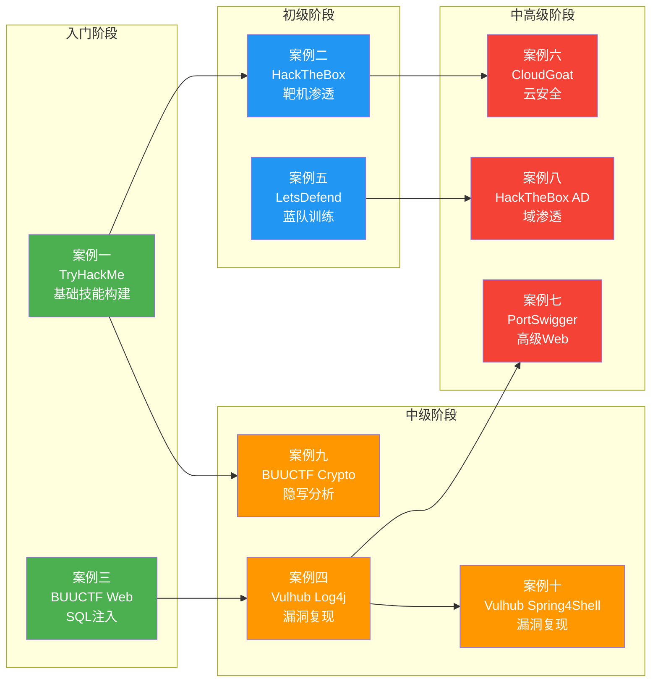
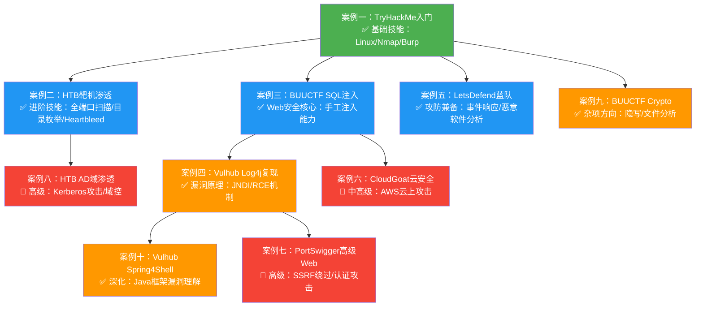

## 案例总结：十大实战案例的全景回顾与进阶指南

### 一、案例总览：从入门到高级的完整图谱

本章通过十个精心编排的实战案例，覆盖了网络安全学习从零基础入门到高级攻防的完整光谱。每个案例聚焦一个平台或一个技术方向，但十个项目合在一起，构成了一条清晰的技能成长主线。下表汇总了全部案例的核心信息：

| 案例 | 平台/方向 | 难度 | 核心技术点 | 对应能力层级 | 学习者画像 |
|------|----------|------|-----------|-------------|-----------|
| 案例一 | TryHackMe | ★☆☆☆☆ | Linux基础、Nmap扫描、Burp Suite入门、简单SQL注入/XSS | 入门 | 计算机专业零基础学生 |
| 案例二 | HackTheBox | ★★☆☆☆ | Nmap全端口扫描、Gobuster目录枚举、Heartbleed漏洞利用、Metasploit | 初级 | 有THM基础的进阶学习者 |
| 案例三 | BUUCTF | ★★☆☆☆ | SQL注入手工利用、联合查询、information_schema利用 | 初级 | CTF入门刷题者 |
| 案例四 | Vulhub | ★★★☆☆ | Docker环境部署、Log4j2 JNDI注入原理、恶意LDAP服务器搭建 | 中级 | Java安全方向学习者 |
| 案例五 | LetsDefend | ★★☆☆☆ | 邮件头分析、恶意软件静态/动态分析、IOC提取、事件响应 | 初-中级 | 安全运维工程师 |
| 案例六 | CloudGoat | ★★★★☆ | AWS IAM权限提升、STS凭证利用、Lambda函数攻击、云上横向移动 | 中-高级 | 云安全方向学习者 |
| 案例七 | PortSwigger | ★★★★☆ | 高级SSRF绕过、认证机制攻击、自定义脚本编写 | 中-高级 | Web安全深度进阶者 |
| 案例八 | HackTheBox (AD) | ★★★★☆ | Kerberos攻击、AS-REP Roasting、Kerberoasting、域控权限获取 | 中-高级 | 内网渗透进阶者 |
| 案例九 | BUUCTF (Crypto) | ★★★☆☆ | 文件隐写、binwalk提取、Stegsolve通道分析、密码破解 | 中级 | CTF杂项/密码学方向 |
| 案例十 | Vulhub (Spring4Shell) | ★★★☆☆ | Spring Bean绑定利用、ClassLoader属性修改、RCE验证 | 中级 | Java安全/漏洞研究者 |



### 二、跨案例技术分析：反复出现的核心能力

通读十个案例，以下五项核心能力贯穿始终，是每个阶段都必须持续锤炼的硬功夫：

#### 2.1 信息收集：一切渗透的起点

十个案例中，**每一个都从信息收集开始**——这不是巧合，而是渗透测试方法论的铁律。

| 阶段 | 案例中的体现 | 使用工具 | 关键技巧 |
|------|-------------|---------|---------|
| 入门 | 案例一：Nmap基本扫描 | nmap -sC -sV | 理解端口/服务/版本的含义 |
| 初级 | 案例二：全端口扫描 + 目录枚举 | nmap -p-、gobuster dir | 全端口扫描不遗漏、目录字典的选择 |
| 中级 | 案例六：云环境元数据收集 | curl 169.254.169.254 | AWS实例元数据服务（IMDS）利用 |
| 高级 | 案例八：LDAP匿名绑定枚举AD | ldapsearch、BloodHound | 从LDAP获取完整域用户/组/计算机列表 |

**常见误区**：初学者往往急于使用exploit，跳过信息收集。案例二中的Heartbleed利用，是在扫描阶段发现443端口运行着OpenSSL 1.x后才确定的——如果跳过版本识别，攻击方向完全无法确定。

**经验法则**：信息收集的时间应占整个渗透过程的30%-40%。宁可花两小时收集信息，也不要在漏洞利用阶段因为信息不足而反复试错。

#### 2.2 漏洞分析：从现象到原理

每个案例都要求学习者不仅"会用工具"，更要"理解漏洞"。这种从现象到原理的分析能力，是区分脚本小子和真正安全工程师的分水岭。

| 案例 | 漏洞 | 表层现象 | 底层原理 | 分析方法 |
|------|------|---------|---------|---------|
| 案例三 | SQL注入 | 登录框能用单引号绕过 | SQL语法拼接未做参数化 | 手工构造UNION SELECT逐步试探 |
| 案例四 | Log4j2 RCE | 日志中出现`${jndi:ldap://...}` | JNDI查找机制允许远程类加载 | 分析Log4j Lookup机制 → 构造恶意LDAP响应 |
| 案例十 | Spring4Shell | POST参数可修改Tomcat配置 | Java Bean属性绑定可修改ClassLoader | 逐层分析Spring参数绑定 → ClassLoader → AccessLogValve → JSP写入 |
| 案例八 | Kerberoasting | SPN注册的服务账号可被请求票据 | Kerberos TGS票据使用弱密码加密 | impacket获取服务票据 → hashcat离线破解 |

**方法论要点**：对于每个漏洞，建议按照"触发条件 → 影响范围 → 根因机制 → 修复方案"四步框架进行分析。不要只记住"curl命令怎么写"，而要理解"为什么这一串参数能触发漏洞"。

#### 2.3 漏洞利用：从理论到实操的闭环

理解了原理之后，需要将知识转化为可执行的攻击链。十个案例展示了不同层次的利用技巧：

**基础利用（案例一至三）**：直接使用现成工具或手工Payload
```bash
# 案例二：Metasploit模块利用Heartbleed
use auxiliary/scanner/ssl/openssl_heartbleed
set RHOSTS 10.10.10.79
run

# 案例三：手工SQL注入获取Flag
admin' union select 1,group_concat(password),3 from l0ve1ysq1#
```

**环境搭建型利用（案例四、十）**：需要先部署漏洞环境，再构造攻击
```bash
# 案例四：Log4j2环境部署 + JNDI利用
cd vulhub/log4j/CVE-2021-44228
docker-compose up -d
java -jar JNDI-Injection-Exploit.jar -C "bash -c {echo,反弹shell编码}"
```

**链式利用（案例六、八）**：多个漏洞串联，形成完整攻击链
```text
案例八的完整攻击链：
LDAP匿名绑定 → 枚举域用户 → AS-REP Roasting → hashcat破解 → 
获取用户凭证 → Kerberoasting → 破解服务票据 → 
Pass-the-Hash → 域控DCSync → 获取域管权限
```

#### 2.4 工具链的渐进式构建

十个案例涉及的工具从基础到高级，形成了一个清晰的工具栈金字塔：

```text
                    ┌─────────────────┐
                    │  专业定制工具     │   ← 案例六/七/八
                    │  Impacket/Flames │
                    ├─────────────────┤
                    │  利用框架         │   ← 案例四/十
                    │  Metasploit      │
                    ├─────────────────┤
                    │  分析与扫描       │   ← 案例二/三
                    │  Nmap/Burp/Gobuster│
                    ├─────────────────┤
                    │  基础工具         │   ← 案例一
                    │  curl/strings/file│
                    └─────────────────┘
```

**建议**：不要在入门阶段就安装Metasploit和Impacket。先用基础工具（nmap、curl、strings）手动完成任务，理解每个工具解决什么问题后，再引入更高层的自动化工具。否则你会陷入"会用工具但不懂原理"的陷阱。

#### 2.5 复盘与Writeup：知识内化的关键步骤

案例一中提到的"完成30个房间"、案例三中完整的SQL注入手工步骤、案例八中Kerberos协议的详细图解——这些都体现了**记录和复盘**的重要性。

**有效Writeup的结构**（来自本章案例的最佳实践）：

```markdown
# 靶机/题目名称

## 1. 基本信息
- IP/URL、难度、操作系统、涉及技术栈

## 2. 信息收集
- 端口扫描结果（含截图）
- 服务版本识别
- 目录枚举结果

## 3. 漏洞分析与利用
- 发现的关键漏洞
- 漏洞原理简述
- 利用步骤（含命令和输出）

## 4. 权限提升（如适用）
- 提权向量
- 提权步骤

## 5. 总结
- 涉及的知识点（至少列出3个）
- 本次学习到的新技术
- 可改进之处
```

### 三、案例之间的进阶路径

十个案例并非孤立存在，它们之间存在明确的前置依赖和进阶关系：



**推荐学习顺序**（按学习者背景分两条主线）：

**渗透测试方向**：
1. 案例一 → 2. 案例二 → 3. 案例三 → 4. 案例四 → 5. 案例十 → 6. 案例八 → 7. 案例六 → 8. 案例七

**安全运营方向**：
1. 案例一 → 2. 案例五 → 3. 案例三 → 4. 案例四 → 5. 案例二 → 6. 案例八

**CTF竞赛方向**：
1. 案例一 → 2. 案例三 → 3. 案例九 → 4. 案例四 → 5. 案例七 → 6. 案例六

### 四、六大平台的定位与选择策略

十个案例覆盖了六个核心平台，每个平台都有明确的定位：

| 平台 | 核心定位 | 案例编号 | 最佳使用阶段 | 成本 | 每日建议时间 |
|------|---------|---------|-------------|------|------------|
| TryHackMe | 引导式入门教学 | 案例一 | 0-6个月 | 免费/付费$14/月 | 1-2小时 |
| HackTheBox | 高质量靶机挑战 | 案例二、八 | 6个月+ | 免费/付费$14/月 | 2-3小时 |
| BUUCTF | CTF刷题与竞赛准备 | 案例三、九 | 3个月+ | 免费 | 1-2小时 |
| Vulhub | 已知CVE漏洞复现 | 案例四、十 | 3个月+ | 免费 | 按需 |
| LetsDefend | 蓝队/SOC模拟训练 | 案例五 | 3个月+ | 免费/付费$35/月 | 1-2小时 |
| CloudGoat | 云安全攻防实战 | 案例六 | 12个月+ | 免费(需AWS账号) | 按需 |
| PortSwigger | Web安全深度训练 | 案例七 | 6个月+ | 免费 | 1-2小时 |

**关键决策点**：
- **预算有限**：优先选择TryHackMe（免费房间足够入门）+ BUUCTF（全免费）+ Vulhub（全免费）
- **时间有限**（每天<1小时）：TryHackMe的碎片化房间设计最适合
- **目标明确**（OSCP认证）：HackTheBox + PortSwigger + 案例八的AD渗透
- **转行安全运维**：案例五的LetsDefend路径最适合

### 五、贯穿十个案例的五大核心原则

#### 原则一：平台选择要匹配当前水平

十个案例中的学习者（小明、小红、小刚等）都遵循了"略高于当前能力"的选题原则。小明从TryHackMe入门而不是直接挑战HTB Insane，小红在完成THM后才进入HTB Medium。选择远超当前能力的靶标不仅学不到东西，还会产生严重的挫败感。

**量化标准**：如果一道题独立思考30分钟毫无头绪，说明难度过高——应该退回前一级别巩固基础，而不是反复碰壁。

#### 原则二：系统化学习远胜随机刷题

案例一中小明按照"Linux基础→网络基础→Web安全→工具使用"的顺序循序渐进，而不是随意点击房间。案例六中CloudGoat的场景也按照IAM提权→横向移动→数据窃取的攻击链编排。

**随机刷题的陷阱**：看似做了很多题，但知识点之间没有连接，下次遇到类似场景仍然不会。系统化学习则能让知识形成网络——理解了案例三的SQL注入，做案例四的Log4j时就能更快理解JNDI注入的类似逻辑（都是参数注入导致的非预期执行）。

#### 原则三：Writeup写作是深度学习的催化剂

案例八中对Kerberos认证流程的详细图解、案例三中SQL注入的每一步详细记录——这些都是Writeup的价值体现。写Writeup的过程迫使你整理思路、补全逻辑链、发现知识盲区。

**Learning by Teaching**（费曼学习法）：当你能把一个技术点讲清楚时，你才算真正掌握它。Writeup就是你的"虚拟听众"。

#### 原则四：持续练习是唯一捷径

安全技能没有捷径。案例一中小明花了四周完成30个房间，案例二中小红攻克Valentine靶机经历了信息收集→漏洞发现→利用的完整过程。每个案例的背后都是大量的练习积累。

**保持节奏**：每天1-2小时的持续练习，远胜于周末突击10小时。技能的巩固依赖间隔重复和持续暴露。

#### 原则五：攻防兼备的完整视野

案例五（LetsDefend蓝队训练）的加入，体现了本章的一个核心理念：**只知道怎么攻击是不够的**。案例二中小红利用了Heartbleed，但如果不懂OpenSSL的防御机制，就无法理解为什么这个漏洞影响如此巨大。案例五中的邮件头分析、恶意软件逆向——这些防御侧能力让渗透测试更有深度。

### 六、进阶指南：从案例到实战

完成本章十个案例后，读者可以按照以下路径继续提升：

#### 6.1 短期目标（1-3个月）

| 目标 | 具体行动 | 参考案例 | 验证标准 |
|------|---------|---------|---------|
| 平台等级提升 | HTB达到"Hacker"等级 | 案例二 | 完成15台Easy+Medium靶机 |
| CTF能力巩固 | BUUCTF Web方向刷50题 | 案例三 | 独立解题率>80% |
| 漏洞复现能力 | 独立复现5个CVE | 案例四、十 | 每个CVE写一篇详细分析 |
| 蓝队基础 | LetsDefend完成SOC L1模块 | 案例五 | 通过平台评估 |

#### 6.2 中期目标（3-6个月）

| 目标 | 具体行动 | 参考案例 | 验证标准 |
|------|---------|---------|---------|
| AD渗透能力 | 独立完成3台AD靶机 | 案例八 | 包含完整的攻击链文档 |
| Web安全深度 | PortSwigger Expert级实验 | 案例七 | 完成15个Expert实验 |
| 云安全入门 | CloudGoat完成3个场景 | 案例六 | 理解AWS IAM权限模型 |
| Writeup积累 | 建立个人技术博客 | 全部案例 | 发布20+篇高质量Writeup |

#### 6.3 长期目标（6-12个月）

| 目标 | 具体行动 | 能力验证 |
|------|---------|---------|
| 认证获取 | 考取OSCP或CEH认证 | 证书编号 |
| 漏洞赏金 | 在HackerOne/Bugcrowd提交有效漏洞 | 获得奖励 |
| 社区贡献 | 向Vulhub/开源工具提交PR或场景 | 合并记录 |
| 团队协作 | 加入CTF战队并参加正式比赛 | CTFtime战队积分 |

### 七、常见问题与避坑指南

**Q1：十个案例必须按顺序做吗？**

不需要。案例之间存在建议的进阶顺序，但你可以根据自己的背景和目标选择性学习。关键原则是：**先完成前置技能（案例一），再根据方向选择后续案例**。

**Q2：遇到完全看不懂的案例怎么办？**

这说明你的前置知识有缺口。例如，看不懂案例八的Kerberos攻击，说明需要先补充AD域基础知识。建议的回溯路径：

```text
案例八看不懂 → 回到案例一补AD基础 → 案例二练基本渗透 → 再回来
案例六看不懂 → 先学AWS基础 → 了解IAM模型 → 再挑战CloudGoat
案例七看不懂 → 先完成案例三的Web基础 → 再进阶PortSwigger
```

**Q3：案例四和案例十都是Vulhub复现，有什么区别？**

- 案例四（Log4j2）侧重JNDI注入原理和恶意LDAP服务器搭建，是漏洞利用的入门
- 案例十（Spring4Shell）侧重Java框架层面的参数绑定利用，需要更深的Java知识
- 两者共同点：都需要Docker环境部署、理解漏洞触发条件、掌握PoC构造方法

**Q4：工具太多学不过来怎么办？**

遵循"够用即可"原则。十个案例中，最核心的工具只有五个：Nmap、Burp Suite、Metasploit、Docker、SQLMap。先把这五个用熟，再根据方向逐步扩展：

- Web方向：补充gobuster、ffuf、sqlmap进阶
- 二进制方向：补充GDB、pwntools、ROPgadget
- 云安全方向：补充awscli、ScoutSuite、Pacu
- 蓝队方向：补充Volatility、Wireshark进阶、ELK

**Q5：没有AWS账号能不能做案例六？**

CloudGoat需要真实AWS账号（有免费额度的账号即可）。如果确实无法获取AWS环境，可以替代方案：
- 使用AWS免费套餐（12个月免费）
- 使用本地搭建的MinIO模拟S3
- 参考CloudGoat的Terraform代码，在本地理解攻击逻辑

### 八、总结：从案例到能力的转化

本章十个案例不是终点，而是起点。它们提供了从理论到实践的桥梁，但真正的安全能力来自**持续的、有深度的、有反馈的练习**。

回顾本节的核心信息：

1. **平台选择的重要性**：不同的平台适合不同的学习目标和技能水平。TryHackMe适合入门引导，HackTheBox适合能力挑战，BUUCTF适合CTF备考，Vulhub适合漏洞理解，LetsDefend适合蓝队训练，CloudGoat适合云安全，PortSwigger适合Web深造。选择2-3个核心平台深入练习，远胜于在多个平台上浅尝辄止。

2. **系统化学习的价值**：按照推荐路径循序渐进——从Linux基础到Web安全，从单点漏洞到完整攻击链，从红队渗透到蓝队防御——每个阶段都在为下一阶段打基础。随机刷题看似高效，实则是最大的低效。

3. **Writeup写作的作用**：记录和分享解题过程不是额外负担，而是知识内化的核心机制。每篇Writeup都在迫使你整理逻辑、发现盲区、深化理解。养成写Writeup的习惯，你的进步速度将成倍提升。

4. **持续练习的必要性**：安全技能没有速成之道。每天1-2小时的持续练习，配合每周一次的深度复盘，是最有效的成长模式。技能的巩固依赖间隔重复和持续暴露，突击式学习的效果衰减极快。

5. **攻防兼备的视野**：案例五的加入提醒我们，只懂攻击不懂防御是残缺的能力结构。理解攻击手段背后的原理，才能设计出真正有效的防御策略。攻防一体，才是完整的信息安全思维。

最后，建议读者根据自己的技术水平和职业目标，选择合适的案例和平台开始行动。**最好的学习时机是现在，最好的学习方式是动手。** 从第一个案例开始，逐步构建自己的安全能力体系——这条路没有终点，但每一步都算数。
